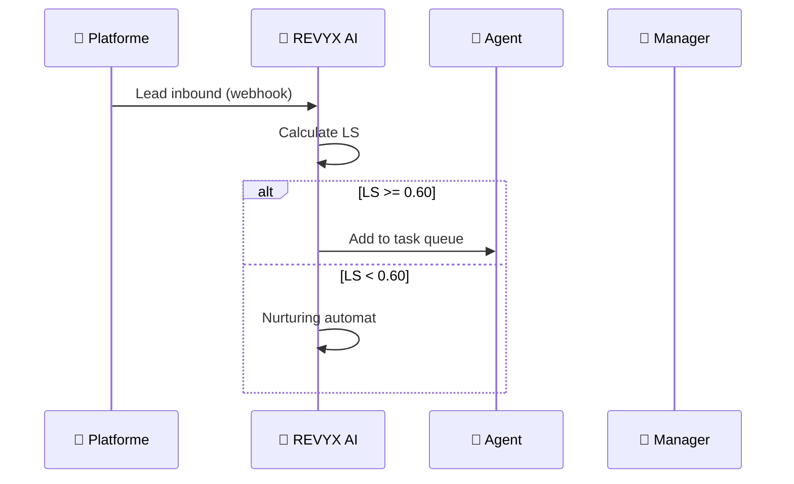

# SKILL_WORKFLOW — Workflow & Process Maps Generator
<!-- docs/skills/SKILL_WORKFLOW.md · v1.0.1 · 2026-05 -->
<!-- CONFIDENȚIAL · Uz Intern · © 2026 REVYX · ITPRO SYSTEM SRL -->

## Changelog

| Versiune | Data | Autor | Note |
|---|---|---|---|
| 1.0.0 | 2026-05 | Senior PM | Definiție inițială sub-skill |
| 1.0.1 | 2026-05 | Senior PM | Output checklist extins cu Impact Assessment (CLAUDE.md §13) |

---

## 1. Identitate

| Atribut | Valoare |
|---|---|
| **Parent** | DOC_MASTER |
| **Output** | `docs/workflow/WORKFLOW_REVYX_[scope]_v[X.Y.Z].md` |
| **Audiență** | Toate rolurile (training · onboarding · QA · audit) |
| **Limbă** | Română |

---

## 2. Scope possibilities

| Scope | Filename pattern |
|---|---|
| End-to-end transaction | `WORKFLOW_REVYX_e2e-transaction_v[X.Y.Z].md` |
| Lead lifecycle | `WORKFLOW_REVYX_lead-lifecycle_v[X.Y.Z].md` |
| Property onboarding | `WORKFLOW_REVYX_property-onboarding_v[X.Y.Z].md` |
| Showing flow | `WORKFLOW_REVYX_showing-flow_v[X.Y.Z].md` |
| Offer chain | `WORKFLOW_REVYX_offer-chain_v[X.Y.Z].md` |
| Deal closure | `WORKFLOW_REVYX_deal-closure_v[X.Y.Z].md` |
| Escalation Protocol | `WORKFLOW_REVYX_escalation_v[X.Y.Z].md` |
| GDPR Erasure | `WORKFLOW_REVYX_gdpr-erasure_v[X.Y.Z].md` |

---

## 3. Structură obligatorie

| # | Secțiune | Conținut |
|---|---|---|
| 1 | Executive Summary | Scope · referință BRD/PRD · 1 paragraf de purpose |
| 2 | Actori implicați | Tabel cu rol · responsabilitate · sistem (REVYX/extern) |
| 3 | Pre-conditions | Stare obligatorie a sistemului înainte de început |
| 4 | Flow Diagram | Mermaid sequence sau flowchart cu toți actorii |
| 5 | Etape detaliate | 1 etapă = 1 sub-secțiune cu trigger, actor, sistem, output |
| 6 | Decision Points | Tabel "if X → Y else Z" pentru toate ramificațiile |
| 7 | Timing & SLA | Per etapă: durată estimată · SLA dacă există |
| 8 | Score impacts | Care scoruri se actualizează la fiecare etapă |
| 9 | AUDIT_LOG events | Ce se loghează la fiecare etapă |
| 10 | Notifications | Ce notificări (push, WhatsApp, email) se trimit |
| 11 | Error / Exception paths | Ce se întâmplă când etapa eșuează |
| 12 | Post-conditions | Stare a sistemului la final |
| 13 | Acceptance Criteria validare | AC-uri din BRD/PRD demonstrate de acest workflow |
| 14 | Glosar specific | Termeni introduși în acest workflow |

---

## 4. Reguli inflexibile

### Paletă actori (obligatorie din `revyx.md` §2.5)

| Actor | Token culoare |
|---|---|
| 🏠 Proprietar / Vânzător | `--sel` (#F59E0B) |
| 🤝 Agent Imobiliar | `--agt` (#C9870A) |
| 🤖 Sistem REVYX AI | `--ai` (#3B82F6) |
| 👤 Client / Cumpărător | `--buy` (#10B981) |
| 👔 Manager Agenție | `--mgr` (#EC4899) |
| 🏦 Bancă / Finanțator | `--bnk` (#8B5CF6) |
| ⚖️ Notar | `--not` (#EF4444) |
| 📱 Platforme & Social | `--soc` (#FF6B35) |

### Diagrame

Format preferat — **Mermaid**:



Alternativ — flowchart ASCII pentru workflow-uri scurte (<5 etape).

### Score impacts (obligatoriu pe etapă)

Pentru fiecare etapă care afectează un scoring, documentează:

| Etapă | Scor afectat | Tip impact | Magnitude |
|---|---|---|---|
| Lead intake | LS | Init | 0.30 |
| Showing attended | LS, IS, TS | Boost | +0.05 / +0.10 / +0.05 |
| 5 zile fără activitate | DHI | Penalizare | RF=0.3 (comunicare) |

### AUDIT_LOG events

Pentru fiecare etapă cu impact business:

```markdown
**AUDIT_LOG event:** `LEAD_FIREWALL_OVERRIDE`
- user_id: manager_id
- entity_type: LEAD
- entity_id: <lead_id>
- old_value: { firewall_blocked: true }
- new_value: { firewall_blocked: false, override_reason: <text> }
```

### SLA visibility

Orice etapă cu SLA (15 min HOT, 2h calificat, 24h warm) trebuie evidențiată cu badge în text:

```markdown
**Etapa 3** — Agent răspunde lead HOT
> ⏱ **SLA: 15 min** · Escalation Nivel 1 la T+15min
```

---

## 5. Output checklist

- [ ] Header standard
- [ ] Min 1 diagramă Mermaid sau flowchart
- [ ] Toți actorii implicați documentați cu paletă brand
- [ ] Score impacts pe etape relevante
- [ ] AUDIT_LOG events documentate
- [ ] SLA visibility pe etape time-bound
- [ ] Decision points cu toate ramurile (happy + edge)
- [ ] Error paths documentate
- [ ] AC din BRD/PRD validate
- [ ] Footer brandat
- [ ] **★ Impact Assessment** completat în PR description (`docs/templates/IMPACT_ASSESSMENT.md`)
- [ ] **★ E2E test specificat pentru happy path al workflow-ului**
- [ ] **★ AUDIT_LOG events listate explicit** (pentru fiecare etapă cu impact business)

---

## 6. Anti-pattern

- ❌ Nu folosi screenshots — diagrame Mermaid/ASCII
- ❌ Nu omite actorii AI/Sistem ca "implicit"
- ❌ Nu lăsa decision points fără toate ramurile
- ❌ Nu scapa AUDIT_LOG events pentru acțiuni cu impact
- ❌ Nu folosi culori actor în afara paletei `--sel/--agt/--ai/--buy/--mgr/--bnk/--not/--soc`
- ❌ Nu inventa SLA — folosește exact valorile din BRD §5

---

*docs/skills/SKILL_WORKFLOW.md · v1.0.1 · 2026-05 · CONFIDENȚIAL · Uz Intern*
*REVYX — Real Estate Execution Intelligence · © 2026 REVYX · ITPRO SYSTEM SRL*
