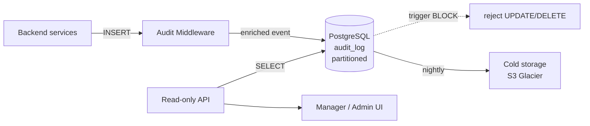

# TECH SPEC — REVYX AUDIT_LOG
<!-- TECH_SPEC_REVYX_audit-log_v1.0.0.md · v1.0.0 · 2026-05 -->
<!-- CONFIDENȚIAL · Uz Intern · © 2026 REVYX · ITPRO SYSTEM SRL -->

## Changelog

| Versiune | Data | Autor | Note |
|---|---|---|---|
| 1.0.0 | 2026-05 | Senior PM + Solution Architect | Spec inițială AUDIT_LOG · APPEND-ONLY · Phase 0 |

---

## Cuprins

1. [Executive Summary](#1-executive-summary)
2. [Architecture Overview](#2-architecture-overview)
3. [Stack & Dependencies](#3-stack--dependencies)
4. [Data Model](#4-data-model)
5. [API Contracts](#5-api-contracts)
6. [Append-Only Enforcement](#6-append-only-enforcement)
7. [State Machines](#7-state-machines)
8. [Concurrency](#8-concurrency)
9. [Caching](#9-caching)
10. [Background Jobs & Retention](#10-background-jobs--retention)
11. [Error Handling](#11-error-handling)
12. [Security](#12-security)
13. [Observability](#13-observability)
14. [Performance Budgets](#14-performance-budgets)
15. [Testing Strategy](#15-testing-strategy)
16. [Deployment](#16-deployment)
17. [Migration Strategy](#17-migration-strategy)
18. [Risks & Mitigations](#18-risks--mitigations)
19. [Impact Assessment](#19-impact-assessment)

---

## 1. Executive Summary

`AUDIT_LOG` este registrul **append-only** al tuturor acțiunilor WRITE din REVYX. Cerință critică **BR-07** (BRD §6.1) și componentă obligatorie a Phase 0 Security (CLAUDE.md §6).

| Atribut | Valoare |
|---|---|
| **Scope** | Persistență, enforcement, query și retenție audit log |
| **Referință BRD** | §8 Data Model · §6.1 BR-07 · §9 Securitate |
| **Phase** | 0 (BLOCANT pentru cod aplicație) |
| **Owner tehnic** | Solution Architect + Security Lead |

**Garanții oferite:**

1. Niciun `UPDATE` sau `DELETE` posibil la nivel BD pe rândurile existente.
2. Latență `INSERT` < 5 ms p95 sub 1.000 evenimente/sec.
3. Query read-only optimizat pentru top patterns (timeline entitate, acțiuni user, eveniment).
4. Retenție: `7 ani` legal hold · partiționare lunară · arhivare după 2 ani la stocare la rece (S3-compatible).

---

## 2. Architecture Overview



### 2.1 Data flow

1. Orice serviciu care execută o operație WRITE pe entități cu impact business apelează `auditMiddleware.record(event)` în aceeași tranzacție SQL.
2. Middleware-ul îmbogățește evenimentul cu `request_id`, `user_id`, `tenant_id`, `ip`, `user_agent`, `correlation_id`.
3. INSERT-ul se face în partiția lunară curentă (`audit_log_YYYY_MM`).
4. Triggerul `audit_log_block_modify` interzice UPDATE/DELETE la nivel BD.
5. Nightly job arhivează partițiile mai vechi de 24 luni la stocare la rece.

---

## 3. Stack & Dependencies

| Layer | Tehnologie | Versiune | Justificare |
|---|---|---|---|
| DB | PostgreSQL | 16.x | Native partitioning · TIMESTAMPTZ · trigger DDL |
| ORM | Prisma sau Kysely | latest stable | Type-safe; respectă `strict: true` |
| Backend | Node.js + TypeScript | 20 LTS · TS 5.x | Stack standard REVYX |
| Cold storage | S3-compatible (MinIO local · AWS S3 prod) | — | Cost-eficient pentru retenție lungă |
| Queue (arhivare) | BullMQ + Redis | latest | Idempotent jobs cu retry exponential |

---

## 4. Data Model

### 4.1 Schema principală

```sql
-- Migrare: 0010_audit_log.sql
CREATE TABLE IF NOT EXISTS audit_log (
  audit_id          UUID            NOT NULL DEFAULT gen_random_uuid(),
  occurred_at       TIMESTAMPTZ     NOT NULL DEFAULT NOW(),
  tenant_id         UUID            NOT NULL,
  user_id           UUID            NULL,             -- NULL pentru evenimente sistem
  actor_type        TEXT            NOT NULL CHECK (actor_type IN ('USER','SYSTEM','WEBHOOK','JOB')),
  event_type        TEXT            NOT NULL,         -- vezi §4.3
  entity_type       TEXT            NOT NULL,         -- LEAD · PROPERTY · DEAL · AGENT · TASK · SHOWING · OFFER · ACTIVITY · TENANT
  entity_id         UUID            NULL,             -- NULL pentru evenimente non-entity (login, config)
  old_value         JSONB           NULL,             -- snapshot înainte (pentru UPDATE-uri logice)
  new_value         JSONB           NULL,             -- snapshot după
  diff              JSONB           NULL,             -- diff calculat (delta minimal)
  request_id        UUID            NULL,
  correlation_id    UUID            NULL,
  ip_address        INET            NULL,
  user_agent        TEXT            NULL,
  metadata          JSONB           NULL,             -- override_reason, escalation_level, etc.
  schema_version    SMALLINT        NOT NULL DEFAULT 1,
  PRIMARY KEY (occurred_at, audit_id)
) PARTITION BY RANGE (occurred_at);

-- Partiție inițială (luna curentă)
CREATE TABLE IF NOT EXISTS audit_log_2026_05
  PARTITION OF audit_log
  FOR VALUES FROM ('2026-05-01') TO ('2026-06-01');

-- Indexes per partiție (template)
CREATE INDEX IF NOT EXISTS idx_audit_log_2026_05_tenant_entity
  ON audit_log_2026_05 (tenant_id, entity_type, entity_id, occurred_at DESC);

CREATE INDEX IF NOT EXISTS idx_audit_log_2026_05_user
  ON audit_log_2026_05 (tenant_id, user_id, occurred_at DESC)
  WHERE user_id IS NOT NULL;

CREATE INDEX IF NOT EXISTS idx_audit_log_2026_05_event
  ON audit_log_2026_05 (tenant_id, event_type, occurred_at DESC);

CREATE INDEX IF NOT EXISTS idx_audit_log_2026_05_correlation
  ON audit_log_2026_05 (correlation_id)
  WHERE correlation_id IS NOT NULL;
```

### 4.2 Constraints & invariants

| Invariant | Enforcement |
|---|---|
| `occurred_at` strict crescător per `tenant_id` (best-effort) | App + clock sync NTP |
| `tenant_id` mereu non-null (multi-tenant) | NOT NULL constraint |
| `event_type` ∈ enum oficial | CHECK + app-level enum |
| `old_value`/`new_value` păstrate fără PII raw expusă în query | Mask la write — vezi §12 |

### 4.3 Catalog `event_type` (extensibil)

| Event | Entity | Notă |
|---|---|---|
| `LEAD_CREATED` | LEAD | LS_initial = 0.30 |
| `LEAD_SCORE_UPDATED` | LEAD | Diff `lead_score` în diff |
| `LEAD_FIREWALL_BLOCKED` | LEAD | LS < 0.60 |
| `LEAD_FIREWALL_OVERRIDE` | LEAD | Manager override (BR-01) |
| `PROPERTY_CREATED` | PROPERTY | — |
| `SHOWCASE_LINK_GENERATED` | PROPERTY | token în metadata |
| `DEAL_CREATED` | DEAL | DP calculat |
| `DEAL_DHI_RECALCULATED` | DEAL | TF_default=0.70 dacă null |
| `DEAL_NEEDS_REVIEW` | DEAL | Re-matching trigger (BR-05) |
| `TASK_ASSIGNED` | TASK | NBA + max 3 active (BR-04) |
| `ESCALATION_TRIGGERED` | LEAD/TASK | level ∈ [1,2,3] în metadata |
| `OFFER_SUBMITTED` / `OFFER_COUNTERED` | OFFER | counter_to_offer_id link |
| `WHATSAPP_TEMPLATE_SENT` | LEAD | template_id + status |
| `WEBHOOK_RECEIVED` | — | source · idempotency_key în metadata |
| `WEBHOOK_HMAC_FAILED` | — | source · ip · 401 |
| `GDPR_CONSENT_CAPTURED` | LEAD | version + channel |
| `GDPR_ERASURE_REQUESTED` | LEAD | timestamp |
| `GDPR_ERASURE_COMPLETED` | LEAD | cascade summary |
| `AUTH_LOGIN_SUCCESS` / `AUTH_LOGIN_FAILED` | — | actor_type=USER, ip |
| `AUTH_PASSWORD_CHANGED` | — | session forcing (BR-12) |
| `RBAC_ROLE_GRANTED` / `RBAC_ROLE_REVOKED` | AGENT | actor=admin/manager |
| `TENANT_PROVISIONED` / `TENANT_SUSPENDED` / `TENANT_DELETED` | TENANT | vezi WORKFLOW tenant-lifecycle |
| `CONFIG_SCORING_WEIGHTS_CHANGED` | — | admin only |

---

## 5. API Contracts

### 5.1 Internal write API

`AuditLogger` este apelat **doar** din middleware/services interne. Nu există endpoint public WRITE.

```typescript
type AuditEvent = {
  tenantId: string;
  userId?: string;
  actorType: 'USER' | 'SYSTEM' | 'WEBHOOK' | 'JOB';
  eventType: AuditEventType;
  entityType: EntityType;
  entityId?: string;
  oldValue?: Record<string, unknown>;
  newValue?: Record<string, unknown>;
  metadata?: Record<string, unknown>;
  correlationId?: string;
};

interface AuditLogger {
  record(event: AuditEvent, tx?: Transaction): Promise<void>;
}
```

### 5.2 Read-only query API

| Method | Path | RBAC | Descriere |
|---|---|---|---|
| GET | `/api/v1/audit/entity/{entityType}/{entityId}` | manager+ | Timeline entitate (paginat, cursor) |
| GET | `/api/v1/audit/user/{userId}` | manager+ | Acțiuni user (cu filtre `from`, `to`, `event_type`) |
| GET | `/api/v1/audit/event/{eventType}` | admin | Filtrare per event type |
| GET | `/api/v1/audit/correlation/{correlationId}` | manager+ | Reconstrucție tranzacție logică |
| POST | `/api/v1/audit/export` | admin | Export GDPR (CSV/NDJSON, async, semnat URL) |

Toate response-urile read sunt **paginate cursor-based** (`occurred_at + audit_id`) cu `limit ≤ 200`.

---

## 6. Append-Only Enforcement

### 6.1 Trigger BD (enforcement primar)

```sql
-- Migrare: 0011_audit_log_append_only.sql
CREATE OR REPLACE FUNCTION audit_log_block_modify()
RETURNS TRIGGER LANGUAGE plpgsql AS $$
BEGIN
  RAISE EXCEPTION 'AUDIT_LOG is append-only (op=%, table=%)',
    TG_OP, TG_TABLE_NAME
    USING ERRCODE = 'insufficient_privilege';
END;
$$;

-- Aplicat per partiție (template repetat pentru fiecare partiție lunară)
CREATE TRIGGER audit_log_no_update
  BEFORE UPDATE ON audit_log_2026_05
  FOR EACH ROW EXECUTE FUNCTION audit_log_block_modify();

CREATE TRIGGER audit_log_no_delete
  BEFORE DELETE ON audit_log_2026_05
  FOR EACH ROW EXECUTE FUNCTION audit_log_block_modify();

-- Și TRUNCATE
CREATE TRIGGER audit_log_no_truncate
  BEFORE TRUNCATE ON audit_log_2026_05
  FOR EACH STATEMENT EXECUTE FUNCTION audit_log_block_modify();
```

### 6.2 Privilegii roluri DB

| Rol BD | Privilegii pe `audit_log` |
|---|---|
| `revyx_app` | `SELECT, INSERT` doar |
| `revyx_readonly` | `SELECT` doar |
| `revyx_admin` | `SELECT, INSERT` (NU UPDATE/DELETE chiar dacă owner) |
| `revyx_partition_mgr` | `CREATE TABLE` în schema (pentru job-ul partiție) |

### 6.3 Pârghii suplimentare

- `REVOKE UPDATE, DELETE, TRUNCATE ON audit_log FROM PUBLIC;`
- Backups pentru `audit_log` separate, semnate cryptografic, retenție 7 ani.
- Hash chain opțional (Phase 2): `event_hash = SHA256(prev_hash || canonical_json(event))` pentru tamper evidence.

---

## 7. State Machines

`AUDIT_LOG` este **stateless** la nivel de înregistrare — fiecare rând este imutabil. Există însă o stare la nivel de partiție:

```
ACTIVE (luna curentă)
  → READABLE (1-24 luni) — INSERT încă posibil în luna curentă, restul read-only
  → ARCHIVED (>24 luni) — exportat la cold storage · attached doar la cerere
  → PURGED (>84 luni / 7 ani) — eliminat conform retention policy
```

---

## 8. Concurrency

- Toate INSERT-urile rulează în **aceeași tranzacție** cu operația WRITE pe entitate (asigură consistență).
- Fără locking explicit: PostgreSQL gestionează contention pe partiția curentă; INSERT-uri concurente nu se blochează reciproc.
- `audit_id` UUID v4 generat la INSERT — fără secvențe globale (evită hot spot).
- Pentru INSERT batch (job de import), folosim `COPY` cu `BINARY` format.

---

## 9. Caching

- **Niciun cache pe write path** — audit log scrie direct.
- **Read cache (Redis)** pentru pattern-uri frecvente:
  - `audit:entity:{type}:{id}:page:{cursor}` · TTL 60s
  - `audit:user:{userId}:summary` · TTL 5 min
- Invalidare: la INSERT pentru `entityType+entityId`, invalidăm doar prima pagină a timeline-ului entității (key `audit:entity:{type}:{id}:page:first`).

---

## 10. Background Jobs & Retention

### 10.1 Partiție mensuală (cron)

```
Job: audit_log_create_next_partition
Cron: 0 2 25 * *   (25 ale lunii, ora 02:00 UTC)
Acțiune: CREATE PARTITION pentru luna următoare + indexuri standard + triggers
Idempotent: CREATE TABLE IF NOT EXISTS
Retry: 3× cu backoff 2/4/8 min
Alert: PagerDuty dacă fail după 3 retry
```

### 10.2 Arhivare la rece

```
Job: audit_log_archive_old_partitions
Cron: 0 3 1 * *    (1 ale lunii, ora 03:00 UTC)
Acțiune: pentru partiții >24 luni: COPY TO NDJSON.gz → upload S3 Glacier → DETACH PARTITION → mark as ARCHIVED în catalog
Idempotent: DA (skip dacă deja arhivat)
Verificare: SHA256 checksum local vs. S3 ETag înainte de DETACH
```

### 10.3 Purge legal

```
Job: audit_log_purge_expired
Cron: 0 4 1 * *
Acțiune: drop partitions ARCHIVED cu age >84 luni (7 ani) DUPĂ verificarea retention legal_hold în catalog
Aprobare: dual control — admin + legal sign-off în UI înainte de execuție
```

---

## 11. Error Handling

| Codul | Caz | Răspuns |
|---|---|---|
| `AUDIT_INSERT_FAILED` | INSERT eșuat (conexiune, lock) | Tranzacția business **eșuează** — fail-closed |
| `AUDIT_PARTITION_MISSING` | Lipsă partiție pentru `occurred_at` | Auto-create on-the-fly (idempotent) + alert |
| `AUDIT_APPEND_ONLY_VIOLATION` | UPDATE/DELETE blocat de trigger | 403 + log + alert SecOps |
| `AUDIT_QUERY_TIMEOUT` | Query >5s pe partiție mare | Returnăm timeout + sugestie filtru `from/to` |

**Fail-closed:** dacă audit log nu poate fi scris, operația WRITE business se rollback. Nicio scriere fără audit.

---

## 12. Security

### 12.1 PII handling

- `old_value`/`new_value` masked la write pentru câmpurile sensibile:
  - `phone`, `email`, `id_number`, `iban` → hash SHA256 cu salt per tenant
  - `password*`, `*_token`, `secret*` → niciodată loggate (regex deny-list)
- Funcție `redactPII(jsonb)` aplicată în middleware înainte de INSERT.

### 12.2 Acces query

- Niciun rol < `manager` nu poate citi audit log.
- `admin` poate exporta doar pentru tenant-ul propriu (sau cross-tenant cu rol `super_admin` rezervat ITPRO).
- AUDIT_LOG events pentru queries pe AUDIT_LOG: `AUDIT_QUERIED` (meta-audit).

### 12.3 Tamper evidence (Phase 2)

- Hash chain per partiție: `H_n = SHA256(H_{n-1} || canonical(event_n))`.
- `H_final` per partiție publicat extern (S3 + opțional anchored on-chain) la închiderea lunii.

### 12.4 Backups

- WAL archiving cu PITR · retention 35 zile.
- Logical dump partiție arhivată semnat cu cheie GPG ITPRO.

---

## 13. Observability

| Metric | Tip | Alert |
|---|---|---|
| `audit_insert_duration_ms` (p50/p95/p99) | histogram | p95 > 10ms 5min |
| `audit_insert_failed_total` | counter | >0 / 1min — pager |
| `audit_partition_missing_total` | counter | >0 — alert SecOps |
| `audit_append_only_violation_total` | counter | >0 — pager imediat |
| `audit_query_duration_ms` | histogram | p95 > 2s |
| `audit_archive_lag_days` | gauge | >35 zile — alert |

Logs structured JSON cu `trace_id`, `tenant_id`, `event_type`. Trace OpenTelemetry pe spans `audit.record` și `audit.query`.

Dashboard Grafana: `REVYX / AUDIT_LOG Health`.

---

## 14. Performance Budgets

| Metric | Target | Sursă |
|---|---|---|
| INSERT p95 latency | < 5 ms | Critical path WRITE |
| INSERT throughput | ≥ 1.000 events/sec/instanță | Capacity |
| Query timeline entitate (200 rânduri) | < 200 ms p95 | UX |
| Query export GDPR (1M rânduri) | < 60 sec async | NFR-10 derivat |
| Storage / lună (estimat) | ~ 30 GB la 1M events/zi | Capacity planning |
| Compresie cold storage | ≥ 8× (NDJSON.gz) | Cost |

---

## 15. Testing Strategy

### 15.1 Unit
- `AuditLogger.record()` — toate event types validate
- `redactPII()` — toate câmpurile sensibile mascate
- Validare schema event (Zod)

### 15.2 Integration
- INSERT real în partiția curentă · verificare round-trip
- Trigger UPDATE/DELETE → exception ridicată
- Privilegii rol BD (negative test: revyx_app încearcă UPDATE → fail)
- Cross-partition query (luna trecută + curentă)

### 15.3 E2E
- Flow LEAD_CREATED → LEAD_SCORE_UPDATED → LEAD_FIREWALL_OVERRIDE: 3 evenimente cu `correlation_id` egal, query reconstrucție OK
- GDPR erasure: `LEAD_DELETED` păstrat, dar `old_value` PII redacted

### 15.4 Load
- 5.000 INSERT/sec sustained 30 min — p95 < 10 ms
- 100 query concurrent timeline — p95 < 500 ms

### 15.5 Chaos
- Kill DB primary mid-INSERT → tranzacția business rollback (fail-closed)
- Disk full pe partiție → pre-alert la 80% + auto-extend

### 15.6 Coverage target

| Layer | Coverage |
|---|---|
| AuditLogger core | ≥ 95% |
| API read handlers | ≥ 85% |
| Background jobs | ≥ 80% |

---

## 16. Deployment

| Aspect | Detaliu |
|---|---|
| Feature flag | N/A — Phase 0 component, mereu ON |
| Environments | dev · staging · prod (același schema) |
| Rollback DB | `0010_audit_log.sql` reversibil prin `0010_down.sql` (DROP TABLE doar dacă gol) |
| Secrets | Niciun secret în acest scope · doar credentiale BD via env |

---

## 17. Migration Strategy

```
0010_audit_log.sql                  -- CREATE TABLE partitioned + partiție inițială + indexes
0011_audit_log_append_only.sql      -- Trigger function + triggers per partiție inițială
0012_audit_log_grants.sql           -- REVOKE UPDATE/DELETE/TRUNCATE + GRANT SELECT/INSERT per rol
0013_audit_log_partition_helper.sql -- Funcție SQL `create_audit_partition(month)` apelată de cron
```

Toate migrările sunt **idempotente** (`IF NOT EXISTS`, `CREATE OR REPLACE`).

Backwards compat: `schema_version` în rând permite evoluția JSONB-urilor fără ALTER TABLE.

---

## 18. Risks & Mitigations

| # | Risc | Probab. | Impact | Mitigare |
|---|---|---|---|---|
| R1 | Hot partition la sfârșitul lunii (high write) | MED | MED | Indexuri locale per partiție · monitoring lag |
| R2 | DBA cu privilegii root face DELETE manual | LOW | CRITIC | Audit la nivel de cluster (pgAudit) + alerting + 4-eyes principle |
| R3 | Storage cost growth nesustenabil | MED | MED | Arhivare cold + compresie + retenție configurabilă per tenant |
| R4 | Fail-closed cauzează degradare WRITE-uri business | LOW | HIGH | Health check audit la startup · circuit breaker la latență >100ms cu pager |
| R5 | PII scurs prin `new_value` neredacted | MED | CRITIC | Deny-list testată în CI · review automat al event_type-urilor noi |
| R6 | Trigger bypass via `ALTER TABLE DISABLE TRIGGER` | LOW | CRITIC | Limitare rol DB · alert pgAudit pe DDL audit_log_* |

---

## 19. Impact Assessment

### 19.1 Scope of Change

| Element | Detaliu |
|---|---|
| Document | TECH_SPEC_REVYX_audit-log_v1.0.0.md |
| Tip schimbare | NEW |
| Aria afectată | Phase 0 Security · entitate AUDIT_LOG (BRD §8) · BR-07 |
| Origine | BRD §6.1 BR-07 + CLAUDE.md §6 (Phase 0 BLOCANT) |

### 19.2 Impact pe documente conexe

| Document | Tip impact | Acțiune |
|---|---|---|
| BRD_REVYX_v1.0.0.md | None | BR-07 deja documentat |
| TECH_SPEC_REVYX_webhook-intake_v1.0.0.md | Minor | Trebuie să apeleze `auditLogger.record()` la fiecare event |
| WORKFLOW_REVYX_tenant-lifecycle_v1.0.0.md | Minor | Events `TENANT_*` standardizate aici |
| brand-configs/revyx.md | None | — |

### 19.3 Impact pe scoring

| Scor | Afectat? | Detaliu |
|---|---|---|
| LS · PS · IS · DP · NBA · TS · APS · DHI | NU | AUDIT_LOG observă, nu modifică scoruri |

### 19.4 Impact pe entități / schema BD

| Entitate | Modificare | Migrare |
|---|---|---|
| AUDIT_LOG | NEW (table partitioned) | 0010–0013 |

### 19.5 Impact pe RBAC

| Rol | Permisiuni adăugate |
|---|---|
| manager | READ audit timeline pe entitățile tenant-ului |
| admin | READ + EXPORT audit pe tenant |
| super_admin (ITPRO) | READ cross-tenant (rezervat) |

### 19.6 Impact pe SLA & NFR

| NFR | Înainte | După | Validare |
|---|---|---|---|
| Audit INSERT latency | nedefinit | p95 < 5ms | Test load 15.4 |
| Audit retention | nedefinit | 7 ani (legal) | Job 10.3 |

### 19.7 Impact pe Securitate & GDPR

| Aspect | Status | Notă |
|---|---|---|
| PII | DA | Redactare via `redactPII()` (§12.1) |
| AUDIT_LOG events noi | DA | Catalog §4.3 |
| Consent flow | NU | — |
| HMAC / JWT / RBAC | DA | Reguli rol BD §6.2 |
| Rate limiting | NU | Read API moștenește limitele standard |

### 19.8 Risks & Mitigations
Vezi §18.

### 19.9 Test Plan
Vezi §15.

### 19.10 Rollout & Rollback

| Aspect | Detaliu |
|---|---|
| Feature flag | N/A — Phase 0 mereu ON |
| Rollout | Migrările 0010–0013 aplicate înainte de orice serviciu WRITE pornește |
| Rollback | DROP triggers · DROP table doar dacă <1000 rânduri (otherwise refuzat) |

### 19.11 Approval Gate

| Aprobator | Necesar pentru |
|---|---|
| Solution Architect | Schema · trigger · privilegii rol |
| Security Lead | Redactare PII · hash chain · backups |
| Senior PM | Catalog event_type aliniat cu pilonii BRD |

---

*docs/tech-spec/TECH_SPEC_REVYX_audit-log_v1.0.0.md · v1.0.0 · 2026-05 · CONFIDENȚIAL · Uz Intern*
*REVYX — Real Estate Execution Intelligence · © 2026 REVYX · ITPRO SYSTEM SRL*
