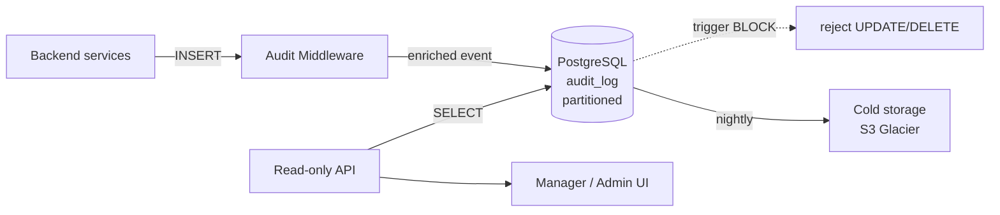

# TECH SPEC — REVYX AUDIT_LOG
<!-- TECH_SPEC_REVYX_audit-log_v1.1.0.md · v1.1.0 · 2026-05 -->
<!-- CONFIDENȚIAL · Uz Intern · © 2026 REVYX · ITPRO SYSTEM SRL -->

## Changelog

| Versiune | Data | Autor | Note |
|---|---|---|---|
| 1.0.0 | 2026-05 | Senior PM + Solution Architect | Spec inițială AUDIT_LOG · APPEND-ONLY · Phase 0 |
| 1.1.0 | 2026-05 | Senior PM + Solution Architect + Security Auditor | ★ Closes F-04 HIGH (AUDIT_REVYX_s8-external-pass v1.0.0) — extensie catalog Phase 5 cu ~75 event types noi (PRICING_MODEL_*, BUYER_*, WL_*, MOBILE_*, AUTH_MOBILE_*, CHURN_*, ISO_*, INC_*, DR_TEST_*) · payload schema · retention class · severity · alerting hook per family · zero breaking change pe events existente Phase 0 |

---

> **Backwards compat (v1.0.0 → v1.1.0):** Toate eventurile catalogate în v1.0.0 §4.3 rămân **neschimbate** (același `event_type` string, payload, retention, RBAC). v1.1.0 **doar adaugă** §4.4 „Catalog Events Phase 5" cu eventurile noi introduse de S8 (specs `ml-pricing-ga`, `marketplace-two-sided`, `white-label`, `mobile-rn`, `iso27001-track`, `churn-ga`) și runbookurile S9 (`incident-response`, `dr-test`). Schema tabel `audit_log` neschimbată. Migrarile existente (0010–0013) rămân autoritative; nicio migrare nouă.

---

## Cuprins

1. [Executive Summary](#1-executive-summary)
2. [Architecture Overview](#2-architecture-overview)
3. [Stack & Dependencies](#3-stack--dependencies)
4. [Data Model](#4-data-model)
5. [API Contracts](#5-api-contracts)
6. [Append-Only Enforcement](#6-append-only-enforcement)
7. [State Machines](#7-state-machines)
8. [Concurrency](#8-concurrency)
9. [Caching](#9-caching)
10. [Background Jobs & Retention](#10-background-jobs--retention)
11. [Error Handling](#11-error-handling)
12. [Security](#12-security)
13. [Observability](#13-observability)
14. [Performance Budgets](#14-performance-budgets)
15. [Testing Strategy](#15-testing-strategy)
16. [Deployment](#16-deployment)
17. [Migration Strategy](#17-migration-strategy)
18. [Risks & Mitigations](#18-risks--mitigations)
19. [Impact Assessment](#19-impact-assessment)

---

## 1. Executive Summary

`AUDIT_LOG` este registrul **append-only** al tuturor acțiunilor WRITE din REVYX. Cerință critică **BR-07** (BRD §6.1) și componentă obligatorie a Phase 0 Security (CLAUDE.md §6).

| Atribut | Valoare |
|---|---|
| **Scope** | Persistență, enforcement, query și retenție audit log |
| **Referință BRD** | §8 Data Model · §6.1 BR-07 · §9 Securitate |
| **Phase** | 0 (BLOCANT pentru cod aplicație) — extensie catalog la Phase 5 (S8 + S9) |
| **Owner tehnic** | Solution Architect + Security Lead |

**Garanții oferite:**

1. Niciun `UPDATE` sau `DELETE` posibil la nivel BD pe rândurile existente.
2. Latență `INSERT` < 5 ms p95 sub 1.000 evenimente/sec.
3. Query read-only optimizat pentru top patterns (timeline entitate, acțiuni user, eveniment).
4. Retenție: `7 ani` legal hold · partiționare lunară · arhivare după 2 ani la stocare la rece (S3-compatible).
5. ★ **Catalog event consolidat** la nivel canonic: orice event scris în `audit_log` trebuie să fie listat în §4.3 (Phase 0–4) sau §4.4 (Phase 5) cu severitate, retention class, alerting hook explicit (F-04 closed).

---

## 2. Architecture Overview



### 2.1 Data flow

1. Orice serviciu care execută o operație WRITE pe entități cu impact business apelează `auditMiddleware.record(event)` în aceeași tranzacție SQL.
2. Middleware-ul îmbogățește evenimentul cu `request_id`, `user_id`, `tenant_id`, `ip`, `user_agent`, `correlation_id`.
3. INSERT-ul se face în partiția lunară curentă (`audit_log_YYYY_MM`).
4. Triggerul `audit_log_block_modify` interzice UPDATE/DELETE la nivel BD.
5. Nightly job arhivează partițiile mai vechi de 24 luni la stocare la rece.

---

## 3. Stack & Dependencies

| Layer | Tehnologie | Versiune | Justificare |
|---|---|---|---|
| DB | PostgreSQL | 16.x | Native partitioning · TIMESTAMPTZ · trigger DDL |
| ORM | Prisma sau Kysely | latest stable | Type-safe; respectă `strict: true` |
| Backend | Node.js + TypeScript | 20 LTS · TS 5.x | Stack standard REVYX |
| Cold storage | S3-compatible (MinIO local · AWS S3 prod) | — | Cost-eficient pentru retenție lungă |
| Queue (arhivare) | BullMQ + Redis | latest | Idempotent jobs cu retry exponential |

---

## 4. Data Model

### 4.1 Schema principală

(Identic cu v1.0.0 §4.1 — schema `audit_log` partitioned, indexes per partiție, GIN pe `metadata`. **Nicio migrare nouă** introdusă de v1.1.0.)

### 4.2 Constraints & invariants

(Identic cu v1.0.0 §4.2.)

### 4.3 Catalog `event_type` Phase 0–4 (v1.0.0 — neschimbat)

(Catalogul existent din v1.0.0 §4.3 rămâne autoritativ pentru events `LEAD_*`, `PROPERTY_*`, `DEAL_*`, `TASK_*`, `ESCALATION_*`, `OFFER_*`, `WHATSAPP_*`, `WEBHOOK_*`, `GDPR_*`, `AUTOMATED_DECISION_*`, `SECURITY_INCIDENT_REPORTED`, `CNPDCP_NOTIFICATION_SENT`, `AUTH_LOGIN_*`, `AUTH_PASSWORD_CHANGED`, `RBAC_ROLE_*`, `TENANT_*`, `CONFIG_SCORING_WEIGHTS_CHANGED`. Niciun breaking change.)

### 4.4 ★ Catalog Events Phase 5 (S8 + S9) — F-04 closed

> **Scope:** Toate eventurile noi introduse de specs S8 (`ml-pricing-ga` v1.0.0+, `marketplace-two-sided` v1.0.1, `white-label` v1.0.1, `mobile-rn` v1.0.0, `iso27001-track` v1.0.0, `churn-ga` v1.0.0+) și runbookurile S9 (`incident-response` v1.0.0, `dr-test` v1.0.0). Total: **75 events**.

#### Convenții pentru tabelele de mai jos

- **Severity:** `INFO` (telemetry standard), `WARN` (degradare necritică), `HIGH` (necesită intervenție în 4h), `CRITICAL` (pager imediat).
- **Retention class:** `STANDARD` (24 luni hot + cold până la 7 ani per §10), `EXTENDED` (legal hold complet 7 ani fără arhivare la rece înainte de 24 luni — folosit pentru forensic/regulator), `COMPLIANCE_84M` (84 luni hot — ISO 27001 audit trail).
- **Alerting hook:** rută PagerDuty/Slack/email + escalation policy. `none` = doar metric counter, fără alert.
- **Payload schema** = lista canonică a câmpurilor obligatorii din `metadata` JSONB; câmpuri uzuale (`tenant_id`, `user_id`, `correlation_id`, `request_id`, `ip_address`, `user_agent`, `entity_type`, `entity_id`, `old_value`, `new_value`) sunt moștenite din header-ul `audit_log` și **nu** se repetă aici.

#### 4.4.1 Family `PRICING_MODEL_*` (10 events) — sursă `ml-pricing-ga` v1.0.0+

| Event | Entity | Severity | Retention | Payload `metadata` (canonical) | Alerting hook |
|---|---|---|---|---|---|
| `PRICING_MODEL_REGISTERED` | — (model_id în metadata) | INFO | STANDARD | `{model_id, model_name, semver, artifact_sha256, feature_schema_hash, eval_metrics:{mae,mape,r2,bias_max}, model_card_uri}` | none (dashboard) |
| `PRICING_MODEL_PROMOTED_SHADOW` | — | INFO | STANDARD | `{model_id, from_status:'DRAFT', to_status:'SHADOW', gate_metrics, approver_id}` | none |
| `PRICING_MODEL_PROMOTED_CANARY` | — | INFO | STANDARD | `{model_id, from_status, to_status:'CANARY', cohort_pct:{5\|25}, gate_metrics, approver_id}` | none |
| `PRICING_MODEL_PROMOTED_GA` | — | INFO | EXTENDED | `{model_id, gate_metrics, primary_approver_id, second_approver_id, four_eyes_request_id}` | Slack #pricing-governance |
| `PRICING_MODEL_4EYES_REQUEST` | — | INFO | STANDARD | `{model_id, target:'GA', requested_by, expires_at}` | none |
| `PRICING_MODEL_4EYES_APPROVED` | — | INFO | EXTENDED | `{model_id, target:'GA', primary, second, requested_at, approved_at}` | none |
| `PRICING_MODEL_ROLLED_BACK` | — | HIGH | EXTENDED | `{model_id, previous_ga_id, reason, executed_by}` | PagerDuty pricing-on-call (HIGH) |
| `PRICING_MODEL_AUTO_ROLLBACK` | — | CRITICAL | EXTENDED | `{model_id, previous_ga_id, alert_ids:[uuid], delta_pct, trigger:'3_consecutive_critical'\|'single_30pct'}` | PagerDuty pricing-on-call (CRITICAL) + Slack #pricing-incident |
| `PRICING_MODEL_BIAS_ALERT` | — | HIGH | STANDARD | `{model_id, district, property_type, mean_err, n_samples, window}` | Slack #ds-bias-watch |
| `PRICING_MODEL_DRIFT_ALERT` | — | HIGH/CRITICAL | STANDARD | `{model_id, alert_type:'MAE_DRIFT'\|'MAPE_DRIFT'\|'FEATURE_SCHEMA_MISMATCH', metric_value, baseline_value, delta_pct}` | PagerDuty pricing-on-call (severity-derived) |

#### 4.4.2 Family `BUYER_*` (12 events) — sursă `marketplace-two-sided` v1.0.1

| Event | Entity | Severity | Retention | Payload `metadata` | Alerting hook |
|---|---|---|---|---|---|
| `BUYER_PROFILE_CREATED` | BUYER_PROFILE | INFO | STANDARD | `{buyer_profile_id, intent, budget_band, gdpr_consent_version}` | none |
| `BUYER_PROFILE_UPDATED` | BUYER_PROFILE | INFO | STANDARD | `{buyer_profile_id, fields_changed:[]}` | none |
| `BUYER_PROFILE_PUBLISHED` | BUYER_PROFILE | INFO | STANDARD | `{buyer_profile_id, visibility:'PUBLIC_LIMITED'\|'AGENT_ONLY', billing_tier}` | none |
| `BUYER_PROFILE_PAUSED` | BUYER_PROFILE | INFO | STANDARD | `{buyer_profile_id, paused_until?, reason?}` | none |
| `BUYER_PROFILE_REVOKED` | BUYER_PROFILE | INFO | STANDARD | `{buyer_profile_id, revoked_by, reason}` | none |
| `BUYER_PROFILE_EXPIRED` | BUYER_PROFILE | INFO | STANDARD | `{buyer_profile_id, expired_at, last_active_at}` | none |
| `BUYER_CONTACT_REQUEST` | BUYER_PROFILE | INFO | STANDARD | `{buyer_profile_id, requested_by_agent_id, property_id?, message_template_id}` | none |
| `BUYER_CONTACT_GRANT_APPROVED` | BUYER_PROFILE | INFO | EXTENDED | `{buyer_profile_id, grant_id, agent_id, expires_at, scope}` | none |
| `BUYER_CONTACT_GRANT_DENIED` | BUYER_PROFILE | INFO | STANDARD | `{buyer_profile_id, agent_id, reason_code}` | none |
| `BUYER_CONTACT_GRANT_REVOKED` | BUYER_PROFILE | INFO | EXTENDED | `{buyer_profile_id, grant_id, revoked_by, reason}` | none |
| `BUYER_PII_REVEALED` | BUYER_PROFILE | HIGH | EXTENDED | `{buyer_profile_id, agent_id, fields_revealed:['phone'\|'email'\|...], grant_id}` | Slack #privacy-watch (HIGH) |
| `BUYER_BILLING_TIER_CHANGED` | BUYER_PROFILE | INFO | STANDARD | `{buyer_profile_id, from_tier, to_tier, stripe_event_id}` | none |

#### 4.4.3 Family `WL_*` white-label (12 events) — sursă `white-label` v1.0.1

| Event | Entity | Severity | Retention | Payload `metadata` | Alerting hook |
|---|---|---|---|---|---|
| `WL_DOMAIN_CLAIMED` | TENANT | INFO | STANDARD | `{tenant_id, hostname, dns_token}` | none |
| `WL_DOMAIN_VERIFIED` | TENANT | INFO | STANDARD | `{tenant_id, hostname, verification_method:'CNAME'\|'TXT'}` | none |
| `WL_DOMAIN_REVOKED` | TENANT | INFO | EXTENDED | `{tenant_id, hostname, reason}` | Slack #wl-ops |
| `WL_DOMAIN_SUSPENDED` | TENANT | WARN | STANDARD | `{tenant_id, hostname, reason:'BILLING'\|'POLICY'\|'DNS_DRIFT'}` | Slack #wl-ops (WARN) |
| `WL_TLS_PROVISIONED` | TENANT | INFO | STANDARD | `{tenant_id, hostname, cert_serial, expires_at}` | none |
| `WL_TLS_RENEWED` | TENANT | INFO | STANDARD | `{tenant_id, hostname, cert_serial_new, cert_serial_old, days_to_expiry}` | none |
| `WL_TLS_FAILED` | TENANT | HIGH | STANDARD | `{tenant_id, hostname, error_code, retry_count}` | PagerDuty wl-on-call (HIGH la retry≥3) |
| `WL_CONFIG_UPDATED` | TENANT | INFO | STANDARD | `{tenant_id, fields_changed:[], previous_hash, new_hash}` | none |
| `WL_LOGO_UPLOADED` | TENANT | INFO | STANDARD | `{tenant_id, logo_uri, size_bytes, content_type}` | none |
| `WL_PLAN_TIER_CHANGED` | TENANT | INFO | STANDARD | `{tenant_id, from_tier, to_tier, stripe_event_id}` | none |
| `WL_EMAIL_DOMAIN_VERIFIED` | TENANT | INFO | STANDARD | `{tenant_id, email_domain, dkim_selector, spf_ok, dmarc_ok}` | none |
| `WL_EMAIL_DOMAIN_REVOKED` | TENANT | WARN | EXTENDED | `{tenant_id, email_domain, reason}` | Slack #wl-ops |

#### 4.4.4 Family `MOBILE_*` + `AUTH_MOBILE_*` (8 events) — sursă `mobile-rn` v1.0.0

| Event | Entity | Severity | Retention | Payload `metadata` | Alerting hook |
|---|---|---|---|---|---|
| `MOBILE_DEVICE_REGISTERED` | AGENT | INFO | STANDARD | `{device_id, platform:'IOS'\|'ANDROID', app_version, push_token_hash}` | none |
| `MOBILE_DEVICE_REVOKED` | AGENT | INFO | EXTENDED | `{device_id, revoked_by, reason:'USER'\|'ADMIN'\|'COMPROMISED'}` | Slack #security-watch dacă reason=COMPROMISED |
| `MOBILE_PUSH_SENT` | — | INFO | STANDARD (90d) | `{device_id, push_id, template_id, ttl_seconds}` | none |
| `MOBILE_PUSH_RECEIPT_FAILED` | — | WARN | STANDARD (90d) | `{device_id, push_id, error_code, retry_count}` | counter alert if rate >5%/5min |
| `MOBILE_VERSION_UNSUPPORTED` | AGENT | INFO | STANDARD | `{device_id, app_version, min_supported}` | none |
| `AUTH_MOBILE_OT_ISSUED` | AGENT | INFO | STANDARD | `{user_id, ot_id, expires_at, channel:'SMS'\|'EMAIL'}` | none |
| `AUTH_MOBILE_OT_EXCHANGED` | AGENT | INFO | STANDARD | `{user_id, ot_id, exchanged_at, refresh_token_id}` | none |
| `AUTH_MOBILE_OT_INVALID_ATTEMPT` | AGENT | WARN | STANDARD | `{user_id, ot_id?, ip, attempt_count}` | counter alert ≥5/min/IP → block |

#### 4.4.5 Family `CHURN_*` (14 events) — sursă `churn-ga` v1.0.0+

| Event | Entity | Severity | Retention | Payload `metadata` | Alerting hook |
|---|---|---|---|---|---|
| `CHURN_SCORE_COMPUTED` | TENANT/AGENT | INFO | STANDARD | `{score_id, subject_type, subject_id, prob_30d, prob_60d, risk_band, model_id, features_hash}` | none |
| `CHURN_CS_TASK_OPENED` | TENANT/AGENT | INFO | STANDARD | `{task_id, score_id, risk_band, sla_hours, due_at, playbook_id}` | none (HIGH+ Slack la `riskBand=CRITICAL`) |
| `CHURN_CS_TASK_UPGRADED` | TENANT/AGENT | INFO | STANDARD | `{task_id, from_band, to_band, new_due_at}` | none |
| `CHURN_CS_TASK_ASSIGNED` | TENANT/AGENT | INFO | STANDARD | `{task_id, assigned_to:user_id, assignment_strategy}` | none |
| `CHURN_CS_TASK_STARTED` | TENANT/AGENT | INFO | STANDARD | `{task_id, started_by:user_id}` | none |
| `CHURN_CS_TASK_CONTACTED` | TENANT/AGENT | INFO | STANDARD | `{task_id, contact_channel, contacted_at}` | none |
| `CHURN_CS_TASK_EXPIRED` | TENANT/AGENT | WARN | STANDARD | `{task_id, expired_at, sla_breach_minutes}` | Slack #cs-sla |
| `CHURN_OUTCOME_RECORDED` | TENANT/AGENT | INFO | STANDARD | `{outcome_id, task_id, outcome, reason_code, contact_channel}` | none |
| `CHURN_RETENTION_VERIFIED` | TENANT/AGENT | INFO | EXTENDED | `{outcome_id, retained:bool, verified_at}` | none |
| `CHURN_AUC_DRIFT_ALERT` | — | HIGH/CRITICAL | EXTENDED | `{model_id, alert_type:'AUC_DRIFT', metric_value, baseline_value, delta, window}` | PagerDuty cs-on-call |
| `CHURN_PREVENTION_RATE_BELOW_TARGET` | — | HIGH | EXTENDED | `{rate, target:0.30, cohort_size, window:'90d'}` | Slack #exec-kpi (HIGH) |
| `CHURN_RETRAIN_TRIGGERED` | — | INFO | STANDARD | `{model_id, reasons:[]}` | none |
| `CHURN_TASK_GENERATION_PAUSED` | — | HIGH | EXTENDED | `{paused_by:'AUTO'\|user_id, reason}` | PagerDuty cs-on-call |
| `CHURN_TASK_GENERATION_RESUMED` | — | INFO | EXTENDED | `{resumed_by:user_id, reason}` | Slack #cs-ops |

#### 4.4.6 Family `ISO_*` (4 events) — sursă `iso27001-track` v1.0.0

| Event | Entity | Severity | Retention | Payload `metadata` | Alerting hook |
|---|---|---|---|---|---|
| `ISO_RISK_REGISTER_REVIEWED` | — | INFO | COMPLIANCE_84M | `{review_cycle, reviewed_by, items_reviewed, items_changed, evidence_uri}` | none |
| `ISO_INTERNAL_AUDIT_RUN` | — | INFO | COMPLIANCE_84M | `{audit_cycle, scope, findings_high, findings_med, findings_low, report_uri}` | Slack #iso-audit |
| `ISO_DR_TEST_EXECUTED` | — | INFO | COMPLIANCE_84M | `{dr_test_id, scenario, rto_actual_sec, rpo_actual_sec, pass:bool, report_uri}` | Slack #iso-audit |
| `ISO_SUPPLIER_ASSESSED` | — | INFO | COMPLIANCE_84M | `{supplier_id, assessment_cycle, tier, score, dpa_signed, sla_breach_count}` | none |

#### 4.4.7 Family `INC_*` (8 events) — sursă `RUNBOOK_REVYX_incident-response` v1.0.0

| Event | Entity | Severity | Retention | Payload `metadata` | Alerting hook |
|---|---|---|---|---|---|
| `INC_DECLARED` | — | HIGH/CRITICAL | EXTENDED | `{incident_id, severity:'P1'\|'P2'\|'P3'\|'P4', declared_by, summary}` | PagerDuty severity-derived |
| `INC_IC_ASSIGNED` | — | INFO | EXTENDED | `{incident_id, ic_user_id, assigned_at}` | none |
| `INC_SEVERITY_CHANGED` | — | INFO | EXTENDED | `{incident_id, from_severity, to_severity, changed_by, reason}` | re-page if escalating |
| `INC_CONTAINMENT_APPLIED` | — | INFO | EXTENDED | `{incident_id, action, executed_by}` | none |
| `INC_GDPR_NOTIFIED_DPO` | — | HIGH | EXTENDED | `{incident_id, dpo_id, notified_at, pii_categories_affected:[]}` | Slack #dpo |
| `INC_GDPR_REGULATOR_NOTIFIED` | — | CRITICAL | COMPLIANCE_84M | `{incident_id, regulator:'CNPDCP', notification_id, notified_at, breach_categories}` | Slack #legal + email DPO |
| `INC_RESOLVED` | — | INFO | EXTENDED | `{incident_id, resolved_at, ttr_minutes, resolution_summary}` | none |
| `INC_POST_MORTEM_PUBLISHED` | — | INFO | EXTENDED | `{incident_id, post_mortem_uri, action_items:[{ticket, owner, due}]}` | Slack #incidents |

#### 4.4.8 Family `DR_TEST_*` (7 events) — sursă `RUNBOOK_REVYX_dr-test` v1.0.0

| Event | Entity | Severity | Retention | Payload `metadata` | Alerting hook |
|---|---|---|---|---|---|
| `DR_TEST_SCHEDULED` | — | INFO | COMPLIANCE_84M | `{dr_test_id, scenario, scheduled_at, scope}` | none |
| `DR_TEST_STARTED` | — | INFO | COMPLIANCE_84M | `{dr_test_id, started_at, lead_id}` | none |
| `DR_TEST_RESTORE_VALIDATED` | — | INFO | COMPLIANCE_84M | `{dr_test_id, rpo_actual_sec, snapshot_id, integrity_check}` | none |
| `DR_TEST_SMOKE_PASS` | — | INFO | COMPLIANCE_84M | `{dr_test_id, rto_actual_sec, smoke_results}` | none |
| `DR_TEST_COMPLETED` | — | INFO | COMPLIANCE_84M | `{dr_test_id, pass:bool, rto_actual, rpo_actual, report_uri}` | Slack #iso-audit |
| `DR_TEST_FAILED` | — | HIGH | COMPLIANCE_84M | `{dr_test_id, failure_stage, error_summary}` | PagerDuty sre-on-call |
| `DR_TEST_FINDING_FILED` | — | INFO | COMPLIANCE_84M | `{dr_test_id, finding_severity, jira_ticket, owner}` | Slack #iso-audit |

### 4.5 ★ Catalog hygiene (CI guard)

Pentru a preveni regresia F-04 pe specs viitoare, un job CI `audit-catalog-lint`:

1. Scanează codul pentru calls `auditLogger.record({eventType: 'X'})` și extrage stringurile literale.
2. Compară mulțimea cu §4.3 + §4.4 din acest document.
3. Eșuează build-ul dacă există `eventType` necatalogat sau intrări catalog necitate de cod (orphan).
4. Run la fiecare PR ce atinge `apps/**/audit*` sau `docs/tech-spec/TECH_SPEC_REVYX_audit-log_*.md`.

---

## 5. API Contracts

(Identic cu v1.0.0 §5.)

### 5.1 ★ Internal write API — TypeScript enum extins (Phase 5)

```typescript
// types/audit-events-phase5.ts (additive)
export type AuditEventTypePhase5 =
  // PRICING_MODEL_*
  | 'PRICING_MODEL_REGISTERED' | 'PRICING_MODEL_PROMOTED_SHADOW' | 'PRICING_MODEL_PROMOTED_CANARY'
  | 'PRICING_MODEL_PROMOTED_GA' | 'PRICING_MODEL_4EYES_REQUEST' | 'PRICING_MODEL_4EYES_APPROVED'
  | 'PRICING_MODEL_ROLLED_BACK' | 'PRICING_MODEL_AUTO_ROLLBACK'
  | 'PRICING_MODEL_BIAS_ALERT' | 'PRICING_MODEL_DRIFT_ALERT'
  // BUYER_*
  | 'BUYER_PROFILE_CREATED' | 'BUYER_PROFILE_UPDATED' | 'BUYER_PROFILE_PUBLISHED'
  | 'BUYER_PROFILE_PAUSED' | 'BUYER_PROFILE_REVOKED' | 'BUYER_PROFILE_EXPIRED'
  | 'BUYER_CONTACT_REQUEST' | 'BUYER_CONTACT_GRANT_APPROVED' | 'BUYER_CONTACT_GRANT_DENIED'
  | 'BUYER_CONTACT_GRANT_REVOKED' | 'BUYER_PII_REVEALED' | 'BUYER_BILLING_TIER_CHANGED'
  // WL_*
  | 'WL_DOMAIN_CLAIMED' | 'WL_DOMAIN_VERIFIED' | 'WL_DOMAIN_REVOKED' | 'WL_DOMAIN_SUSPENDED'
  | 'WL_TLS_PROVISIONED' | 'WL_TLS_RENEWED' | 'WL_TLS_FAILED'
  | 'WL_CONFIG_UPDATED' | 'WL_LOGO_UPLOADED' | 'WL_PLAN_TIER_CHANGED'
  | 'WL_EMAIL_DOMAIN_VERIFIED' | 'WL_EMAIL_DOMAIN_REVOKED'
  // MOBILE_* + AUTH_MOBILE_*
  | 'MOBILE_DEVICE_REGISTERED' | 'MOBILE_DEVICE_REVOKED'
  | 'MOBILE_PUSH_SENT' | 'MOBILE_PUSH_RECEIPT_FAILED' | 'MOBILE_VERSION_UNSUPPORTED'
  | 'AUTH_MOBILE_OT_ISSUED' | 'AUTH_MOBILE_OT_EXCHANGED' | 'AUTH_MOBILE_OT_INVALID_ATTEMPT'
  // CHURN_*
  | 'CHURN_SCORE_COMPUTED' | 'CHURN_CS_TASK_OPENED' | 'CHURN_CS_TASK_UPGRADED'
  | 'CHURN_CS_TASK_ASSIGNED' | 'CHURN_CS_TASK_STARTED' | 'CHURN_CS_TASK_CONTACTED'
  | 'CHURN_CS_TASK_EXPIRED' | 'CHURN_OUTCOME_RECORDED' | 'CHURN_RETENTION_VERIFIED'
  | 'CHURN_AUC_DRIFT_ALERT' | 'CHURN_PREVENTION_RATE_BELOW_TARGET'
  | 'CHURN_RETRAIN_TRIGGERED' | 'CHURN_TASK_GENERATION_PAUSED' | 'CHURN_TASK_GENERATION_RESUMED'
  // ISO_*
  | 'ISO_RISK_REGISTER_REVIEWED' | 'ISO_INTERNAL_AUDIT_RUN'
  | 'ISO_DR_TEST_EXECUTED' | 'ISO_SUPPLIER_ASSESSED'
  // INC_*
  | 'INC_DECLARED' | 'INC_IC_ASSIGNED' | 'INC_SEVERITY_CHANGED' | 'INC_CONTAINMENT_APPLIED'
  | 'INC_GDPR_NOTIFIED_DPO' | 'INC_GDPR_REGULATOR_NOTIFIED'
  | 'INC_RESOLVED' | 'INC_POST_MORTEM_PUBLISHED'
  // DR_TEST_*
  | 'DR_TEST_SCHEDULED' | 'DR_TEST_STARTED' | 'DR_TEST_RESTORE_VALIDATED'
  | 'DR_TEST_SMOKE_PASS' | 'DR_TEST_COMPLETED' | 'DR_TEST_FAILED' | 'DR_TEST_FINDING_FILED';

export type AuditEventType = AuditEventTypePhase04 | AuditEventTypePhase5;
```

---

## 6. Append-Only Enforcement

(Identic cu v1.0.0 §6 — trigger BD, RLS, redaction GDPR.)

## 7. State Machines

(Identic cu v1.0.0 §7.)

## 8. Concurrency

(Identic cu v1.0.0 §8.)

## 9. Caching

(Identic cu v1.0.0 §9.)

## 10. Background Jobs & Retention

(Identic cu v1.0.0 §10.)

### 10.4 ★ Retention class mapping (v1.1.0 explicit)

| Class | Hot retention | Cold retention | Purge |
|---|---|---|---|
| STANDARD | 24 luni partiție hot | până la 84 luni Glacier | 84 luni (7 ani) |
| EXTENDED | 24 luni hot | până la 84 luni Glacier | 84 luni (sau legal hold infinit la flag DPO) |
| COMPLIANCE_84M | **84 luni hot** (fără arhivare) | n/a | după 84 luni revisit cu CISO + Compliance |

> **Implementare:** `metadata.retention_class` setat la insert; job `audit_log_archive_old_partitions` skip-uiește rândurile cu `retention_class='COMPLIANCE_84M'` chiar și după 24 luni — păstrate hot pentru audit trail ISO 27001 cross-cycle.

## 11. Error Handling

(Identic cu v1.0.0 §11.)

## 12. Security

(Identic cu v1.0.0 §12.)

### 12.5 ★ Acces consolidat per rol (v1.1.0)

| Rol | Read scope | Restricții |
|---|---|---|
| `manager` | Audit timeline tenant propriu | Niciun PII unmask |
| `admin` | Tenant + export GDPR | Tenant propriu (super_admin pentru cross-tenant) |
| `compliance_auditor` ★ | Tenant întreg + cross-tenant ISO/INC/DR_TEST events | **Niciun PII unmask** · time-boxed acces (vezi `tenancy-roles-extension` v1.1.0 §12.3) |
| `data_science_lead` | PRICING_MODEL_* + CHURN_* events | Filtru pe families ML |
| `cs_lead`, `cs_user` | CHURN_* (CS pool) | Niciun acces alte families |
| `super_admin` (ITPRO) | Cross-tenant complet | Mereu logged ca `AUDIT_QUERIED` (meta-audit) |

## 13. Observability

(Identic cu v1.0.0 §13. Adăugare metric `audit_event_uncatalogued_total` — counter pe events necatalogate prinse de CI guard §4.5; alert >0/zi.)

## 14. Performance Budgets

(Identic cu v1.0.0 §14.)

## 15. Testing Strategy

(Identic cu v1.0.0 §15.)

### 15.7 ★ Catalog conformance tests (v1.1.0)

- Unit: pentru fiecare event în §4.4, validate că `redactPII()` clasifică corect câmpurile sensitive.
- Integration: emit fiecare event Phase 5 într-un test fixture; verificat că severity + retention_class propagate corect din metadata.
- Lint: CI guard §4.5 verde pe toate apps/**.

## 16. Deployment

(Identic cu v1.0.0 §16. v1.1.0 e **doc-only** — nicio migrare BD, niciun cod nou; impact zero pe deploy.)

## 17. Migration Strategy

(Identic cu v1.0.0 §17 — migrările 0010–0013 rămân autoritative. v1.1.0 nu adaugă migrare nouă.)

## 18. Risks & Mitigations

(Identic cu v1.0.0 §18. R7 nou: catalog drift după v1.1.0 — mitigat de CI guard §4.5.)

## 19. Impact Assessment

### 19.1 Scope of Change

| Element | Detaliu |
|---|---|
| Document | TECH_SPEC_REVYX_audit-log_v1.1.0.md |
| Tip schimbare | MINOR (catalog extension, doc-only) |
| Aria afectată | Catalog event canonic Phase 5 — closes F-04 HIGH (AUDIT_REVYX_s8-external-pass v1.0.0) |
| Origine | F-04 HIGH din audit S9 |

### 19.2 Impact pe documente conexe

| Document | Tip impact | Acțiune |
|---|---|---|
| `tenancy-roles-extension` v1.1.0 | Cross-ref | RBAC `compliance_auditor` aliniat cu §12.5 |
| `ml-pricing-ga` v1.0.2 | None (events deja referite) | Cross-ref §4.4.1 |
| `churn-ga` v1.0.1 | None | Cross-ref §4.4.5 |
| `marketplace-two-sided` v1.0.1 | None | Cross-ref §4.4.2 |
| `white-label` v1.0.1 | None | Cross-ref §4.4.3 |
| `mobile-rn` v1.0.0 | None | Cross-ref §4.4.4 |
| `iso27001-track` v1.0.0 | None | Cross-ref §4.4.6 |
| `RUNBOOK_REVYX_incident-response` v1.0.0 | None | Cross-ref §4.4.7 |
| `RUNBOOK_REVYX_dr-test` v1.0.0 | None | Cross-ref §4.4.8 |

### 19.3 Impact pe scoring

| Scor | Afectat? |
|---|---|
| Toate | NU |

### 19.4 Impact pe entități / schema BD

| Entitate | Modificare | Migrare |
|---|---|---|
| AUDIT_LOG | NONE (doc-only) | — |

### 19.5 Impact pe RBAC

`compliance_auditor` rol nou referit (definit canonic în `tenancy-roles-extension` v1.1.0). Nicio modificare la rolele existente.

### 19.6 Impact pe SLA & NFR

Nicio modificare; v1.1.0 confirmă că 75 events Phase 5 încap în budget INSERT p95 < 5ms (volum estimat <2% din total scrieri AUDIT_LOG).

### 19.7 Impact pe Securitate & GDPR

| Aspect | Status | Notă |
|---|---|---|
| PII handling | DA | Severity HIGH pe `BUYER_PII_REVEALED` cu Slack alert |
| Retention class | DA | Mapping §10.4 — COMPLIANCE_84M nou pentru ISO + INC GDPR regulator |
| AUDIT_LOG events noi | DA (75) | §4.4 |

### 19.8 Risks & Mitigations

Vezi §18.

### 19.9 Test Plan

Vezi §15.7.

### 19.10 Rollout & Rollback

| Aspect | Detaliu |
|---|---|
| Feature flag | N/A (doc) |
| Rollout | Spec publicat înainte de Phase 5 GA — services existente trebuie să tageze events conform §4.4 înainte de a pleca în prod |
| Rollback | N/A (doc-only) |

### 19.11 Approval Gate

| Aprobator | Necesar pentru |
|---|---|
| Solution Architect | Catalog consolidare cross-spec |
| Security Lead | Severity + alerting per family |
| Compliance Auditor | Retention class COMPLIANCE_84M |
| Senior PM | Aliniere cu specs S8/S9 |

---

*docs/tech-spec/TECH_SPEC_REVYX_audit-log_v1.1.0.md · v1.1.0 · 2026-05 · CONFIDENȚIAL · Uz Intern*
*REVYX — Real Estate Execution Intelligence · © 2026 REVYX · ITPRO SYSTEM SRL*
