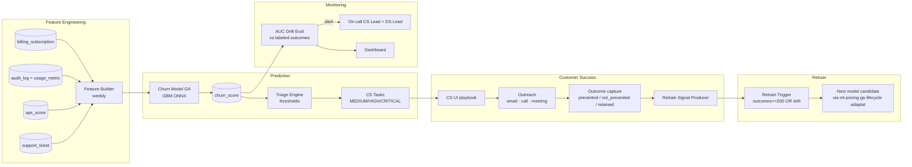

# TECH SPEC — CHURN MODEL GA (Monitoring · CS Playbook · Feedback Loop · KPI ≥30%)
<!-- TECH_SPEC_REVYX_churn-ga_v1.0.0.md · v1.0.0 · 2026-05 -->
<!-- CONFIDENȚIAL · Uz Intern · © 2026 REVYX · ITPRO SYSTEM SRL -->

## Changelog

| Versiune | Data | Autor | Note |
|---|---|---|---|
| 1.0.0 | 2026-05 | Senior PM + Solution Architect + Customer Success Lead + Data Science Lead | ★ Spec inițială S8 — graduate churn model la GA · monitoring dashboard cu AUC drift alertă · CS playbook formalizat (MEDIUM/HIGH/CRITICAL response scripts) · feedback loop (CS marchează outcome → retrain signal) · KPI churn prevention rate ≥30% MEDIUM+ convertit la "retained" |

---

## Cuprins

1. [Executive Summary](#1-executive-summary)
2. [Architecture Overview](#2-architecture-overview)
3. [Stack & Dependencies](#3-stack--dependencies)
4. [Data Model](#4-data-model)
5. [API Contracts](#5-api-contracts)
6. [Algorithms (Score · Triage · Retrain Signal)](#6-algorithms)
7. [State Machines](#7-state-machines)
8. [Concurrency](#8-concurrency)
9. [Caching](#9-caching)
10. [Background Jobs](#10-background-jobs)
11. [Error Handling](#11-error-handling)
12. [Security & GDPR](#12-security--gdpr)
13. [Observability](#13-observability)
14. [Performance Budgets](#14-performance-budgets)
15. [Testing Strategy](#15-testing-strategy)
16. [Deployment & Rollout](#16-deployment--rollout)
17. [Migration Strategy](#17-migration-strategy)
18. [Risks & Mitigations](#18-risks--mitigations)
19. [CS Playbook (MEDIUM/HIGH/CRITICAL)](#19-cs-playbook)
20. [Impact Assessment](#20-impact-assessment)

---

## 1. Executive Summary

★ **Churn Model GA** definitivează tranziția modelului de churn (predictie probabilitate că un agent / agency renunță la subscriere REVYX în următoarele 30/60 zile) din **shadow / canary** la **GA 100%**, cu un set complet de instrumente operaționale: dashboard monitoring AUC drift, CS playbook formalizat per nivel risc, feedback loop CS→retrain, și un **KPI obligatoriu Churn Prevention Rate ≥30%** pentru MEDIUM+ convertit la "retained".

| Atribut | Valoare |
|---|---|
| **Scope** | Churn score [0,1] per `tenant` (agency) și per `agent` user · triage MEDIUM/HIGH/CRITICAL · CS task generation · outcome capture (prevented/not_prevented/retained) · retrain trigger pe drift sau outcome volume · KPI prevention rate |
| **Target subiect predicție** | Tenant level (primar) · Agent level (secundar pentru retention agent) |
| **Referință BRD** | §6 Pilon retention (★ extensie S8) · NFR Audit |
| **Phase** | 5 (Maturitate platformă) |
| **Owner tehnic** | Data Science Lead + CS Lead + Solution Architect |
| **Dependențe upstream** | Billing/Metering S7 (subscription state) · Audit-log (engagement) · APS engine (agent performance) · Stripe webhooks |

**Garanții GA:**

1. **AUC drift alertă** — `AUC_rolling_30d < AUC_baseline_locked − 0.05` → alert HIGH; `< −0.10` → CRITICAL + auto-pause notifications.
2. **CS playbook obligatoriu** — fiecare semnalare MEDIUM+ generează un task CS cu script structurat (§19).
3. **Feedback loop** — CS marchează outcome după contact → retrain signal când >200 outcomes noi sau drift detectat.
4. **KPI prevention rate ≥ 30%** — MEDIUM+ flagged → contactați → ≥30% rămân "retained" 90 zile post-flag (vs baseline cohort fără intervenție).
5. **Backwards compat** — același contract `IChurnProvider` cu cel din predecessor (S6/S7); GA înlocuiește implementation, nu interface.
6. **Privacy:** scor stocat la nivel agency/agent (audit), niciun flux către party externe; comunicările CS log-uite ca audit events.

---

## 2. Architecture Overview



### 2.1 Lifecycle (analog `ml-pricing-ga`)

Procesul de promovare al unui model nou de churn folosește **același cadru lifecycle** ca `ml-pricing-ga` (`DRAFT → SHADOW → CANARY → GA`) cu thresholds adaptați:

| Tranziție | Gate |
|---|---|
| DRAFT → SHADOW | AUC_eval ≥ 0.75 · Brier score ≤ 0.18 · calibration plot OK |
| SHADOW → CANARY 5% | Shadow ≥21 zile · AUC_shadow ≥ AUC_baseline_offline − 0.02 |
| CANARY 5% → 25% | ≥ 60 zile (cycle subscription) · AUC ≥ baseline − 0.02 · prevention rate canary ≥ 25% |
| CANARY 25% → GA | ≥60 zile · AUC ≥ baseline · prevention rate ≥ 30% |

GA odată acordat, monitorizarea AUC + prevention rate continuă; dacă scade sub threshold pe o fereastră semnificativă → `ROLLED_BACK`.

---

## 3. Stack & Dependencies

| Layer | Tehnologie | Versiune | Justificare |
|---|---|---|---|
| Trainer | Python · LightGBM / sklearn | latest | tabular standard |
| Inference | ONNX runtime via Node | 1.x | reuse ml-pricing-ga pattern |
| Feature pipeline | dbt or SQL views + Python ETL | latest | reproducibilitate |
| Storage | PostgreSQL | 16.x | scoruri, outcomes, audit |
| Cache | Redis | 7.x | scor curent per tenant |
| CS workflow | Same task system as NBA / dedicated `cs_task` table | — | reuse infra |
| Notifications | Email + Slack DM CS team | — | alerts |
| Audit | `auditLogger` v1.0.0 | — | `CHURN_*`, `CS_*` |

---

## 4. Data Model

### 4.1 Tabel `churn_score`

```sql
-- Migrare: 0540_churn_score.sql
CREATE TABLE IF NOT EXISTS churn_score (
  score_id              UUID         PRIMARY KEY DEFAULT gen_random_uuid(),
  subject_type          TEXT         NOT NULL CHECK (subject_type IN ('TENANT','AGENT')),
  subject_id            UUID         NOT NULL,
  tenant_id             UUID         NOT NULL,            -- redundant pentru AGENT pentru indexing
  model_id              UUID         NOT NULL REFERENCES pricing_model_registry(model_id),  -- registry generic; model_name='churn-gbm'
  -- Notă: pricing_model_registry este reutilizat ca registry generic models (rename viitor or new table; v1 reuses it).
  prob_30d              NUMERIC(4,3) NOT NULL CHECK (prob_30d BETWEEN 0 AND 1),
  prob_60d              NUMERIC(4,3) NOT NULL CHECK (prob_60d BETWEEN 0 AND 1),
  risk_band             TEXT         NOT NULL CHECK (risk_band IN ('LOW','MEDIUM','HIGH','CRITICAL')),
  factors               JSONB        NOT NULL,            -- top features cu shap values
  features_hash         TEXT         NOT NULL,
  is_current            BOOLEAN      NOT NULL DEFAULT TRUE,
  computed_at           TIMESTAMPTZ  NOT NULL DEFAULT NOW(),
  expires_at            TIMESTAMPTZ  NOT NULL              -- recompute cel puțin săptămânal
);
CREATE UNIQUE INDEX IF NOT EXISTS idx_cs_current
  ON churn_score (subject_type, subject_id) WHERE is_current = TRUE;
CREATE INDEX IF NOT EXISTS idx_cs_band
  ON churn_score (tenant_id, risk_band, computed_at DESC) WHERE is_current = TRUE AND risk_band <> 'LOW';
```

### 4.2 Tabel `churn_outcome`

```sql
-- Migrare: 0541_churn_outcome.sql
CREATE TABLE IF NOT EXISTS churn_outcome (
  outcome_id            UUID         PRIMARY KEY DEFAULT gen_random_uuid(),
  score_id              UUID         NOT NULL REFERENCES churn_score(score_id),
  subject_type          TEXT         NOT NULL,
  subject_id            UUID         NOT NULL,
  tenant_id             UUID         NOT NULL,
  flagged_at            TIMESTAMPTZ  NOT NULL,                -- when CS task created
  contacted_at          TIMESTAMPTZ  NULL,
  contact_channel       TEXT         NULL CHECK (contact_channel IN ('EMAIL','CALL','MEETING','SLACK','WHATSAPP') OR contact_channel IS NULL),
  outcome               TEXT         NOT NULL CHECK (outcome IN ('PREVENTED','NOT_PREVENTED','RETAINED','LOST','DEFERRED','UNREACHABLE')),
  -- 'PREVENTED' = conversation succes, motivă identificată și remediată
  -- 'NOT_PREVENTED' = a renunțat oricum în 30 zile post-contact
  -- 'RETAINED' = nu churn în 90 zile post-contact (verificat post-hoc)
  -- 'LOST' = a renunțat înainte de a fi contactat
  -- 'DEFERRED' = re-evaluare în 30 zile
  -- 'UNREACHABLE' = no response 3 attempts
  reason_code           TEXT         NULL,                   -- 'PRICE','UX','MISSING_FEATURE','COMPETITOR','LOW_USAGE','OTHER'
  cs_notes              TEXT         NULL,                   -- mascat la export raportare
  outcome_recorded_at   TIMESTAMPTZ  NOT NULL DEFAULT NOW(),
  outcome_recorded_by   UUID         NOT NULL,               -- CS user
  retention_verified_at TIMESTAMPTZ  NULL,                    -- 90 zile job
  retention_verified    BOOLEAN      NULL
);
CREATE INDEX IF NOT EXISTS idx_co_score ON churn_outcome (score_id);
CREATE INDEX IF NOT EXISTS idx_co_subject ON churn_outcome (subject_type, subject_id, outcome_recorded_at DESC);
CREATE INDEX IF NOT EXISTS idx_co_outcome_recent ON churn_outcome (outcome, outcome_recorded_at DESC);
```

### 4.3 Tabel `churn_cs_task`

```sql
-- Migrare: 0542_churn_cs_task.sql
CREATE TABLE IF NOT EXISTS churn_cs_task (
  task_id               UUID         PRIMARY KEY DEFAULT gen_random_uuid(),
  score_id              UUID         NOT NULL REFERENCES churn_score(score_id),
  tenant_id             UUID         NOT NULL,
  subject_type          TEXT         NOT NULL,
  subject_id            UUID         NOT NULL,
  assigned_to           UUID         NULL,                     -- CS user
  risk_band             TEXT         NOT NULL,
  priority              TEXT         NOT NULL CHECK (priority IN ('P1','P2','P3','P4')),
  sla_hours             INTEGER      NOT NULL,                 -- 4 / 24 / 72 / 168 by band
  due_at                TIMESTAMPTZ  NOT NULL,
  status                TEXT         NOT NULL CHECK (status IN ('OPEN','IN_PROGRESS','CONTACTED','OUTCOME_PENDING','CLOSED','EXPIRED')),
  playbook_id           TEXT         NOT NULL,                 -- pointer la script §19
  notes                 TEXT         NULL,
  outcome_id            UUID         NULL REFERENCES churn_outcome(outcome_id),
  opened_at             TIMESTAMPTZ  NOT NULL DEFAULT NOW(),
  closed_at             TIMESTAMPTZ  NULL,
  expired_at            TIMESTAMPTZ  NULL
);
CREATE INDEX IF NOT EXISTS idx_cstask_open ON churn_cs_task (assigned_to, status) WHERE status IN ('OPEN','IN_PROGRESS');
CREATE INDEX IF NOT EXISTS idx_cstask_due ON churn_cs_task (due_at) WHERE status IN ('OPEN','IN_PROGRESS');
CREATE INDEX IF NOT EXISTS idx_cstask_subject ON churn_cs_task (subject_type, subject_id, opened_at DESC);
```

### 4.4 Tabel `churn_kpi_daily` (rolling KPI snapshot)

```sql
-- Migrare: 0543_churn_kpi_daily.sql
CREATE TABLE IF NOT EXISTS churn_kpi_daily (
  kpi_date              DATE         PRIMARY KEY,
  flagged_medium_plus   INTEGER      NOT NULL,
  contacted             INTEGER      NOT NULL,
  retained_90d          INTEGER      NOT NULL,
  prevented             INTEGER      NOT NULL,
  not_prevented         INTEGER      NOT NULL,
  lost                  INTEGER      NOT NULL,
  unreachable           INTEGER      NOT NULL,
  prevention_rate       NUMERIC(5,4) NOT NULL,           -- retained_90d / flagged_medium_plus
  contact_rate          NUMERIC(5,4) NOT NULL,           -- contacted / flagged_medium_plus
  auc_rolling_30d       NUMERIC(5,4) NULL,
  auc_baseline_locked   NUMERIC(5,4) NULL,
  computed_at           TIMESTAMPTZ  NOT NULL DEFAULT NOW()
);
```

### 4.5 Tabel `churn_features_snapshot`

```sql
-- Migrare: 0544_churn_features_snapshot.sql
CREATE TABLE IF NOT EXISTS churn_features_snapshot (
  snapshot_id           UUID         PRIMARY KEY DEFAULT gen_random_uuid(),
  subject_type          TEXT         NOT NULL,
  subject_id            UUID         NOT NULL,
  tenant_id             UUID         NOT NULL,
  features              JSONB        NOT NULL,
  features_hash         TEXT         NOT NULL,
  computed_at           TIMESTAMPTZ  NOT NULL DEFAULT NOW()
) PARTITION BY RANGE (computed_at);
CREATE INDEX IF NOT EXISTS idx_cfs_subject ON churn_features_snapshot (subject_type, subject_id, computed_at DESC);
```

(Retention 365d pentru retraining + audit reproducibility.)

---

## 5. API Contracts

### 5.1 Internal services

```typescript
interface IChurnProvider {                              // moștenit din predecessor
  scoreFor(input: { subjectType: 'TENANT'|'AGENT'; subjectId: string }): Promise<ChurnScore>;
  scoreBatch(items: Array<{subjectType, subjectId}>): Promise<ChurnScore[]>;
}

type ChurnScore = {
  prob30d: number; prob60d: number;
  riskBand: 'LOW'|'MEDIUM'|'HIGH'|'CRITICAL';
  factors: { name: string; shapValue: number }[];        // top 10
  computedAt: Date;
};

interface IChurnTriage {
  triageOnNewScore(score: ChurnScore, subject: { tenantId, subjectType, subjectId }): Promise<{ taskId?: string }>;
}

interface IChurnFeedback {
  recordOutcome(input: {
    taskId: string;
    outcome: 'PREVENTED'|'NOT_PREVENTED'|'RETAINED'|'LOST'|'DEFERRED'|'UNREACHABLE';
    reasonCode?: string;
    contactChannel?: string;
    notes?: string;
  }): Promise<{ outcomeId: string }>;
}
```

### 5.2 REST endpoints

| Method | Path | RBAC | Descriere |
|---|---|---|---|
| `GET` | `/api/v1/cs/churn/queue` | cs_user / cs_lead | Lista task-uri assigned + due_at sort |
| `GET` | `/api/v1/cs/churn/tenants/:id` | cs_user / cs_lead | Detail tenant + scor + factors + history |
| `POST` | `/api/v1/cs/churn/tasks/:id/start` | cs_user | Status → IN_PROGRESS |
| `POST` | `/api/v1/cs/churn/tasks/:id/contacted` | cs_user | Status → CONTACTED + channel |
| `POST` | `/api/v1/cs/churn/tasks/:id/outcome` | cs_user | Body outcome §5.1 IChurnFeedback |
| `POST` | `/api/v1/cs/churn/tasks/:id/snooze` | cs_user | DEFERRED + new due_at |
| `GET` | `/api/v1/cs/churn/dashboard/kpi?range=30d` | cs_lead+ | KPI rolling §4.4 |
| `GET` | `/api/v1/admin/churn/auc?range=30d` | admin / ds_lead | AUC drift |
| `POST` | `/api/v1/admin/churn/retrain-trigger` | admin / ds_lead | Body `{reason}` — manual retrain trigger |

---

## 6. Algorithms

### 6.1 Risk band thresholds

| Band | prob30d range | sla_hours | priority |
|---|---|---|---|
| LOW | < 0.20 | — (no task) | — |
| MEDIUM | 0.20 ≤ p < 0.45 | 168 (7 zile) | P3 |
| HIGH | 0.45 ≤ p < 0.70 | 72 | P2 |
| CRITICAL | ≥ 0.70 | 24 | P1 (4h escalare la CS Lead) |

Calibration verificată pe canary: `prob30d` ≈ rate observată în cohort.

### 6.2 Triage on new score

```typescript
async function triageOnNewScore(score: ChurnScore, subject: SubjectRef): Promise<{taskId?: string}> {
  if (score.riskBand === 'LOW') return {};                 // no action

  // Idempotency: ne deschidem un nou task doar dacă nu există unul deschis pe (subject_type, subject_id)
  const existing = await db.selectFrom('churn_cs_task')
    .where('subject_type','=',subject.subjectType)
    .where('subject_id','=',subject.subjectId)
    .where('status','in',['OPEN','IN_PROGRESS','CONTACTED','OUTCOME_PENDING'])
    .executeTakeFirst();
  if (existing) {
    // Upgrade band dacă noul scor e mai sever
    if (severity(score.riskBand) > severity(existing.risk_band)) {
      await db.updateTable('churn_cs_task').set({
        risk_band: score.riskBand,
        priority: priorityFor(score.riskBand),
        due_at: addHours(new Date(), slaHoursFor(score.riskBand)),
      }).where('task_id','=',existing.task_id).execute();
      await audit('CHURN_CS_TASK_UPGRADED', { taskId: existing.task_id, from: existing.risk_band, to: score.riskBand });
    }
    return { taskId: existing.task_id };
  }

  const taskId = await db.insertInto('churn_cs_task').values({
    score_id: score.scoreId,
    tenant_id: subject.tenantId,
    subject_type: subject.subjectType, subject_id: subject.subjectId,
    risk_band: score.riskBand, priority: priorityFor(score.riskBand),
    sla_hours: slaHoursFor(score.riskBand),
    due_at: addHours(new Date(), slaHoursFor(score.riskBand)),
    status: 'OPEN', playbook_id: playbookFor(score.riskBand),
  }).returning('task_id').executeTakeFirstOrThrow();

  await assignmentEngine.assign(taskId);                    // round-robin CS pool sau named accounts
  await audit('CHURN_CS_TASK_OPENED', { taskId, riskBand: score.riskBand });
  if (score.riskBand === 'CRITICAL') await notify.csLead({ taskId, urgency: 'P1' });
  return { taskId };
}
```

### 6.3 Outcome capture

```typescript
async function recordOutcome(input: RecordInput): Promise<{outcomeId}> {
  return db.transaction(async (tx) => {
    const task = await tx.selectFrom('churn_cs_task').where('task_id','=',input.taskId).forUpdate().executeTakeFirstOrThrow();
    if (task.status === 'CLOSED') throw E('CHURN_TASK_ALREADY_CLOSED');

    const outcomeId = await tx.insertInto('churn_outcome').values({
      score_id: task.score_id,
      subject_type: task.subject_type, subject_id: task.subject_id,
      tenant_id: task.tenant_id,
      flagged_at: task.opened_at,
      contacted_at: task.status === 'CONTACTED' ? task.contacted_at : new Date(),
      contact_channel: input.contactChannel,
      outcome: input.outcome,
      reason_code: input.reasonCode,
      cs_notes: input.notes,
      outcome_recorded_by: actor.userId,
    }).returning('outcome_id').executeTakeFirstOrThrow();

    await tx.updateTable('churn_cs_task').set({
      status: 'CLOSED', outcome_id: outcomeId.outcome_id, closed_at: new Date(), notes: input.notes,
    }).where('task_id','=',input.taskId).execute();

    await audit('CHURN_OUTCOME_RECORDED', { outcomeId: outcomeId.outcome_id, outcome: input.outcome });

    // Trigger retrain signal evaluator post-commit
    tx.afterCommit(() => events.publish('churn.outcome.recorded', { outcomeId: outcomeId.outcome_id }));
    return outcomeId;
  });
}
```

### 6.4 Retention verification (post-90d job)

```typescript
// Cron daily — pentru fiecare outcome cu retention_verified IS NULL și outcome_recorded_at < NOW() - 90d
async function verifyRetention(outcomeId: string) {
  const o = await loadOutcome(outcomeId);
  const subscriptionActive = await checkSubscriptionStillActive(o.subject_type, o.subject_id);
  await db.updateTable('churn_outcome').set({
    retention_verified_at: new Date(),
    retention_verified: subscriptionActive,
    outcome: subscriptionActive ? 'RETAINED' : (o.outcome === 'PREVENTED' ? 'NOT_PREVENTED' : o.outcome),
  }).where('outcome_id','=',outcomeId).execute();
  await audit('CHURN_RETENTION_VERIFIED', { outcomeId, retained: subscriptionActive });
}
```

Notă: `outcome` final este post-90d auto-corectat — `PREVENTED` rămâne doar dacă chiar s-a păstrat la 90 zile, altfel devine `NOT_PREVENTED`. KPI prevention rate calculat pe `outcome='RETAINED'` strict.

### 6.5 AUC drift evaluation

```typescript
// Cron daily — calculează AUC pe outcomes verificate (retention_verified=true treated as positive label "retained")
// Etichetare pentru AUC: y=1 dacă retention_verified=false (a churnat); y=0 dacă retention_verified=true (a rămas)
async function evalAuc(modelId: string, range: '7d'|'30d') {
  const rows = await query(`
    SELECT s.prob_30d AS score,
           CASE WHEN o.retention_verified = false THEN 1 ELSE 0 END AS y
    FROM churn_score s
    JOIN churn_outcome o ON o.score_id = s.score_id
    WHERE s.model_id = $1
      AND o.retention_verified IS NOT NULL
      AND o.outcome_recorded_at > NOW() - INTERVAL $2
  `, [modelId, range]);

  if (rows.length < 50) return null;                                    // insufficient
  const auc = computeAuc(rows.map(r => ({score: r.score, y: r.y})));

  const ga = await registry.getCurrentGA('churn-gbm');
  const baselineLocked = ga.eval_metrics.auc_baseline_locked;
  const delta = auc - baselineLocked;

  if (delta < -0.05) {
    await raiseAlert({
      modelId, type: 'AUC_DRIFT',
      severity: delta < -0.10 ? 'CRITICAL' : 'HIGH',
      metricValue: auc, baselineValue: baselineLocked, deltaPct: delta,
    });
    if (delta < -0.10) await pauseCsTaskGeneration();                   // safety brake
  }

  await db.insertInto('churn_kpi_daily').values({
    kpi_date: today(), auc_rolling_30d: auc, auc_baseline_locked: baselineLocked,
    /* alte coloane completate de KPI cron */
  }).onConflict('kpi_date').doUpdateSet({ auc_rolling_30d: auc }).execute();
  return auc;
}
```

`auc_baseline_locked` setat la promovare GA = `AUC_canary_25pct` (cea mai recentă măsurătoare conservativă).

### 6.6 Retrain trigger

```typescript
// Cron daily
async function evalRetrainTrigger() {
  const ga = await registry.getCurrentGA('churn-gbm');
  const newOutcomes = await countOutcomesSince(ga.promoted_to_ga_at, /*verified*/ true);
  const auc = await evalAuc(ga.model_id, '30d');
  const baselineLocked = ga.eval_metrics.auc_baseline_locked;

  const reasons = [];
  if (newOutcomes >= 200) reasons.push(`outcomes>=200 (${newOutcomes})`);
  if (auc !== null && auc < baselineLocked - 0.03) reasons.push(`auc_drift (${auc} vs ${baselineLocked})`);
  if (daysSince(ga.promoted_to_ga_at) >= 90) reasons.push('quarterly cycle');

  if (reasons.length > 0) {
    await events.publish('churn.retrain.requested', { reasons });
    await audit('CHURN_RETRAIN_TRIGGERED', { reasons });
    await notify.dsLead({ reasons });
  }
}
```

Retrain efectiv execută aceeași pipeline ca model promotion (vezi `ml-pricing-ga` §6.1 / §16) cu lifecycle SHADOW → CANARY → GA. Acest spec definește **trigger-ul**, nu pipeline-ul training (out-of-scope, reused infra).

### 6.7 KPI Prevention Rate

```typescript
// Cron daily — populates churn_kpi_daily
async function computeKpiDaily() {
  const day = today();
  const flagged = await query(`
    SELECT COUNT(*)::int AS n FROM churn_cs_task
    WHERE risk_band IN ('MEDIUM','HIGH','CRITICAL')
      AND opened_at::date = $1::date - INTERVAL '90 days'
  `, [day]);
  const cohortIds = await query(`SELECT task_id FROM churn_cs_task WHERE risk_band IN ('MEDIUM','HIGH','CRITICAL') AND opened_at::date = $1::date - INTERVAL '90 days'`, [day]);

  const verified = await query(`
    SELECT o.outcome, COUNT(*)::int AS n
    FROM churn_outcome o
    JOIN churn_cs_task t ON t.outcome_id = o.outcome_id
    WHERE t.task_id = ANY($1::uuid[])
      AND o.retention_verified_at IS NOT NULL
    GROUP BY o.outcome
  `, [cohortIds.map(c => c.task_id)]);

  const kpi = {
    flagged: flagged.n,
    contacted: sum(verified.where(o => o.outcome !== 'LOST').map(o => o.n)),
    retained: verified.find(o => o.outcome === 'RETAINED')?.n ?? 0,
    not_prevented: verified.find(o => o.outcome === 'NOT_PREVENTED')?.n ?? 0,
    lost: verified.find(o => o.outcome === 'LOST')?.n ?? 0,
    unreachable: verified.find(o => o.outcome === 'UNREACHABLE')?.n ?? 0,
  };
  const preventionRate = kpi.flagged > 0 ? kpi.retained / kpi.flagged : 0;
  const contactRate    = kpi.flagged > 0 ? kpi.contacted / kpi.flagged : 0;

  await upsertKpi(day, { ...kpi, preventionRate, contactRate });

  if (preventionRate < 0.30 && kpi.flagged >= 30) {
    await raiseAlert({ type: 'PREVENTION_RATE_BELOW_TARGET', severity: 'HIGH',
      metricValue: preventionRate, baselineValue: 0.30 });
  }
}
```

**KPI cohort definition explicit:** flagged la T-90d, măsurat la T → permite verificare reală 90d retention. Fereastră rolling de exact 90 zile pentru fairness; alarm doar dacă ≥30 task-uri (statistic significant).

---

## 7. State Machines

### 7.1 churn_cs_task

```
OPEN ──assigned + start──> IN_PROGRESS ──contact made──> CONTACTED ──outcome recorded──> CLOSED
OPEN ──due_at < NOW──> EXPIRED (auto)
IN_PROGRESS ──snooze──> DEFERRED → re-OPEN at new due_at
CONTACTED ──snooze──> OUTCOME_PENDING ──record──> CLOSED
* ──auto upgrade band──> (band field updated, status preserved)
```

### 7.2 churn_outcome

```
RECORDED ──+90d job──> RETENTION_VERIFIED (outcome possibly remapped la RETAINED sau NOT_PREVENTED)
```

---

## 8. Concurrency

- Triage idempotent — task open guarded prin SELECT FOR UPDATE pe (subject_type, subject_id) cu UNIQUE partial pe `status IN open states`.
- Outcome record atomic — `task.status='CLOSED'` prevents double-close.
- Score recompute pgvector-style cu UNIQUE WHERE is_current=TRUE.
- AUC eval lock global: `pg_advisory_xact_lock(hashtext('churn_auc_eval'))`.

---

## 9. Caching

| Key Redis | Conținut | TTL | Invalidate |
|---|---|---|---|
| `churn:score:{type}:{id}` | scor curent | 1h | event `churn.score.updated` |
| `churn:queue:{cs_user}` | listă task-uri | 60s | event `churn.cs_task.*` |
| `churn:kpi:rolling30d` | snapshot dashboard | 5 min | KPI cron |
| `churn:auc:current` | gauge AUC | 1h | AUC cron |

---

## 10. Background Jobs

| Job | Trigger | Idempotent |
|---|---|---|
| `churn.score.batch.weekly` | cron `0 4 * * 1` | DA |
| `churn.score.recompute` | event `subscription.changed` / `usage.spike` | DA |
| `churn.triage.on_score` | event `churn.score.updated` | DA |
| `churn.task.expiry.scan` | cron `*/30 * * * *` | DA |
| `churn.retention.verify.daily` | cron `0 5 * * *` | DA |
| `churn.auc.eval.daily` | cron `0 6 * * *` | DA |
| `churn.kpi.daily` | cron `0 7 * * *` | DA |
| `churn.retrain.trigger.daily` | cron `0 8 * * *` | DA |
| `churn.partition.maintenance` | cron `0 2 1 * *` | DA |

---

## 11. Error Handling

| Cod | Caz | Răspuns |
|---|---|---|
| `CHURN_SUBJECT_NOT_FOUND` | scor pentru tenant/agent inexistent | 404 |
| `CHURN_TASK_ALREADY_CLOSED` | record outcome pe task closed | 409 |
| `CHURN_OUTCOME_DUPLICATE` | două outcomes pe același task | 409 |
| `CHURN_AUC_INSUFFICIENT_DATA` | <50 outcomes verified | 200 cu `auc=null` |
| `CHURN_TASK_GENERATION_PAUSED` | safety brake activ | 503 (CS info) |
| `CHURN_RETRAIN_ALREADY_RUNNING` | trigger duplicat | 409 |

---

## 12. Security & GDPR

### 12.1 RBAC

| Rol | Permisiuni |
|---|---|
| `cs_user` | citire queue propriu · update task own · record outcome |
| `cs_lead` | + reassign tasks · view dashboard tenant-wide · pause task generation |
| `data_science_lead` | view AUC/dashboard · trigger retrain |
| `admin` | toate + manage thresholds |
| `tenant_admin` (own tenant) | view own churn score (trasparency) — opțional, configurable per tenant |

### 12.2 GDPR

- **Lawful basis (Art. 6):** legitimate interest (Art. 6(1)(f)) — retention business client; balancing test în DPIA.
- **Information transparency:** churn score-ul **nu** este partajat cu agentul — comunicare CS doar `riscul retentiei` per company conversation framework.
- **Profilare automată (Art. 22):** scorul e suport decizional pentru CS, niciun deciz automat de revoke/non-renewal — întotdeauna human in the loop.
- **DPIA:** anexat ISO track Risk Register.
- **Data minimization:** features whitelisted (no PII liber); `cs_notes` clasificate CONFIDENȚIAL, accesibile doar `cs_user/cs_lead`.

### 12.3 AUDIT events

`CHURN_SCORE_COMPUTED`, `CHURN_CS_TASK_OPENED`, `CHURN_CS_TASK_UPGRADED`, `CHURN_CS_TASK_ASSIGNED`, `CHURN_CS_TASK_STARTED`, `CHURN_CS_TASK_CONTACTED`, `CHURN_CS_TASK_EXPIRED`, `CHURN_OUTCOME_RECORDED`, `CHURN_RETENTION_VERIFIED`, `CHURN_AUC_DRIFT_ALERT`, `CHURN_PREVENTION_RATE_BELOW_TARGET`, `CHURN_RETRAIN_TRIGGERED`, `CHURN_TASK_GENERATION_PAUSED`, `CHURN_TASK_GENERATION_RESUMED`.

### 12.4 PII / sensitive

- `cs_notes` poate conține referințe sensitive (motive personale agent renunță) → masking la export raportare (regex emails + telefoane redactat).
- Conversația CS se logă în AUDIT_LOG la nivel de event/canal; conținutul detail rămâne în `cs_notes` doar pentru CS team.
- Retention `churn_outcome.cs_notes`: 365 zile post-closure → automated redaction (păstrăm structured data, ștergem free-text).

### 12.5 Rate limiting

| Endpoint | Limit |
|---|---|
| `POST /tasks/:id/outcome` | 200/zi/cs_user |
| `POST /admin/churn/retrain-trigger` | 1/zi/user |
| `GET /cs/churn/queue` | 60/min/user |

---

## 13. Observability

| Metric | Tip | Alert |
|---|---|---|
| `churn_auc_rolling_30d` | gauge | < baseline-0.05 → HIGH |
| `churn_prevention_rate_rolling_90d` | gauge | < 0.30 (n≥30) → HIGH |
| `churn_cs_task_open_total{band}` | gauge | spike → CS Lead |
| `churn_cs_task_overdue_total` | gauge | >0 alert SLA breach |
| `churn_outcome_capture_rate` | gauge | <70% în 7 zile post-flag → process issue |
| `churn_score_compute_lag_minutes` | histogram | p95 > 60 min |
| `churn_retention_verify_lag_days` | histogram | p95 > 95 (gracesince 90d) |

Dashboard: `REVYX / Churn Health` (CS) + `REVYX / Churn Model Quality` (DS) + `REVYX / Churn Prevention KPI` (exec).

---

## 14. Performance Budgets

| Metric | Target |
|---|---|
| `scoreFor` single subject (cache miss) | p95 < 200 ms |
| `scoreBatch` 1000 subjects | p95 < 4 s |
| `triageOnNewScore` | p95 < 100 ms |
| AUC eval daily (10k outcomes) | p95 < 30 s |
| KPI daily compute | p95 < 60 s |

---

## 15. Testing Strategy

### 15.1 Unit
- Risk band thresholds — boundary 0.20 / 0.45 / 0.70.
- Triage idempotency — same subject twice → 1 task; upgrade band.
- Outcome record — concurrent close → conflict.
- AUC compute — known synthetic dataset.
- Prevention rate cohort window — exact 90d.

### 15.2 Integration
- Score compute → triage → task open → CS view.
- Outcome recorded → retention verified after 90d → outcome remapped.
- AUC drift inject → alert + safety brake.
- Retrain trigger fires at >=200 outcomes.

### 15.3 E2E
- Tenant flagged HIGH → CS task assigned → contact → outcome PREVENTED → 90d later RETAINED → KPI updated.
- Tenant flagged HIGH → no contact → expire → outcome forced UNREACHABLE → 90d LOST.
- Drift inject AUC −0.12 → CRITICAL alert + task generation paused → manual resume by admin.

### 15.4 Load
- 50k tenants weekly score batch — p95 ≤ 4s per 1k batch.
- 1000 outcomes/day capture — DB no contention.

### 15.5 Chaos
- Outcome service crash mid-record → idempotency on retry → no duplicates.
- AUC eval data missing (no labels) → null + alert + no false drift.

### 15.6 Coverage

| Layer | Coverage |
|---|---|
| Triage logic | ≥99% |
| Outcome state machine | ≥99% |
| AUC / KPI calc | ≥95% |
| API handlers | ≥90% |

---

## 16. Deployment & Rollout

| Aspect | Detaliu |
|---|---|
| Feature flag | `flag.churn_ga.enabled` (post-canary 25%) |
| GA criteria | AUC ≥ 0.75 sustained 60 zile · prevention rate ≥ 30% în canary 25% · zero CRITICAL alerts |
| Soft launch | CS playbook training 2 săpt înainte de GA · dry-run pe 5 tenants |
| Rollback | Status RegistRy `ROLLED_BACK` → revine la previous GA model · CS tasks open păstrate (pentru continuitate) |
| Pause safety brake | `flag.churn_ga.task_generation_paused=true` la AUC drift CRITICAL |

---

## 17. Migration Strategy

```
0540_churn_score.sql
0541_churn_outcome.sql
0542_churn_cs_task.sql
0543_churn_kpi_daily.sql
0544_churn_features_snapshot.sql           (PARTITION BY RANGE monthly, retention 365d)
```

Idempotente. Backfill: ultimele 60 zile features computed pentru evaluation baseline. KPI table populated ziua 1 cu cohort la T-90d (poate fi nul dacă nu există date — populated incremental).

---

## 18. Risks & Mitigations

| # | Risc | Probab. | Impact | Mitigare |
|---|---|---|---|---|
| R1 | Prevention rate cronic <30% (model nu e útil) | MED | HIGH | Iterate features + CS script · revisit thresholds dacă persistă · alert §6.7 |
| R2 | CS team overwhelmed cu task-uri (volum HIGH) | MED | MED | Throttle: max 50 tasks/CS user open; queue overflow → escalate la cs_lead |
| R3 | Bias model contra tenants noi (<60 zile usage history) | MED | MED | Excluse din scoring sau scor cu confidence flag low |
| R4 | False positive cohort prea mare → CS frustrare | MED | MED | Calibration plot review · band thresholds tunable per tier subscription |
| R5 | CS notes leak PII | LOW | HIGH | Masking export · acces RBAC restrâns · retention 365d apoi redact |
| R6 | Retrain trigger flap (drift fluctuant) | LOW | MED | Cooldown 30 zile între retrain promotes · manual override admin |
| R7 | KPI cohort prea mic (<30) → fără alert | MED | LOW | Aggregat trimestrial (90d cohort) când zilnic insuficient |
| R8 | Disclosure churn score la tenant_admin → backlash | LOW | MED | Default OFF; opt-in per tenant cu DPO sign-off |
| R9 | Outcome bias (CS marchează PREVENTED optimist) | MED | MED | Verificare 90d retention (auto) corectează bias-ul · audit anomalii reason_code |
| R10 | Dependență Stripe webhook subscription_canceled latency | LOW | MED | Reconciliation cron + Stripe API GET fallback |

---

## 19. CS Playbook

Playbook-uri stocate în `docs/cs-playbooks/CHURN_<BAND>_v1.0.0.md` (out-of-scope detail aici, summary).

### 19.1 MEDIUM (P3, 7 zile SLA)

**Obiectiv:** Re-engagement light; proactive check-in. Identificare frictions early.

**Steps:**
1. Review factors top 3 (`churn_score.factors`) → identifică pattern (low usage, ticket support recent, billing issue).
2. Outreach email (template `churn_medium_email_v1`): tone consultativ, întreabă feedback, oferă 30-min call la opțiunea agent.
3. Dacă răspunde: programează call, identifică reason_code, propune remediu (training, feature toggle).
4. Dacă nu răspunde în 5 zile: 2nd touch — Slack DM sau LinkedIn (dacă consent).
5. Outcome: PREVENTED (engagement restored) / DEFERRED (verificare 30d) / UNREACHABLE.

### 19.2 HIGH (P2, 72h SLA)

**Obiectiv:** Conversație directă pentru retenție; ofertă concrete.

**Steps:**
1. Personal call (CS user) către agency owner sau decision-maker în 24h.
2. Discovery: motive nemulțumire, comparativă cu competitori, deficite features.
3. Oferte custom (cu aprobare cs_lead): discount temporar, training premium, feature roadmap commitment, dedicated CSM.
4. Document reason_code clar (PRICE / UX / MISSING_FEATURE / COMPETITOR / LOW_USAGE / OTHER).
5. Follow-up săptămânal 3 săpt.
6. Outcome: PREVENTED / NOT_PREVENTED / DEFERRED.

### 19.3 CRITICAL (P1, 24h SLA, escalare CS Lead)

**Obiectiv:** Save attempt cu intervenție senior; escalare imediată.

**Steps:**
1. Notificare cs_lead în 4h de la flag.
2. cs_lead alocă personal sau CSM senior pentru tenant.
3. Outreach în <24h via canal preferat (call > meeting > email).
4. Intervenție senior: oferă concesii business (multi-month freeze, payment plan, exec sponsor REVYX).
5. Implementare action plan în 7 zile (training session, custom integration, etc.).
6. Status update săptămânal pentru cs_lead 30 zile.
7. Outcome obligatoriu cu reason_code și action_plan_executed_y_n.

### 19.4 Referințe scripts (RO/RU/EN)

Templates traduse 3 limbi · stored în `docs/cs-playbooks/templates/`. Versionate semantic.

### 19.5 Training requirements

CS user nou poate prelua task-uri MEDIUM după onboarding 1 săpt + role-play. HIGH după 2 săpt + shadow 5 task-uri. CRITICAL doar cs_lead sau senior CS cu 6 luni vechime.

---

## 20. Impact Assessment

### 20.1 Scope of Change

| Element | Detaliu |
|---|---|
| Document | TECH_SPEC_REVYX_churn-ga_v1.0.0.md |
| Tip | NEW (S8 deliverable #6) |
| Aria | Churn model GA · CS workflow · feedback loop · KPI |
| Origine | S8 brief — graduate churn model GA |

### 20.2 Impact pe documente conexe

| Document | Impact | Acțiune |
|---|---|---|
| `ml-pricing-ga` v1.0.0 | None (lifecycle pattern reused) | Acelasi `pricing_model_registry` table folosit ca registry generic models (rename future) |
| `aps-engine` v1.0.0 | None | APS feature consumed read-only |
| `audit-log` v1.0.0 | Minor | Catalog event extins `CHURN_*` |
| Billing/Metering S7 | Minor | Webhook `subscription.canceled` → re-evaluează outcome |
| BRD | Minor | §6 Pilon retention extins ★ |

### 20.3 Impact pe scoring

| Scor | Afectat? | Detaliu |
|---|---|---|
| Churn score (nou) | DA | Scor [0,1] adăugat la nivel tenant + agent |
| LS, PS, IS, TS, DHI, NBA, APS | NU | — |

### 20.4 Impact pe entități / schema BD

| Entitate | Modificare | Migrare |
|---|---|---|
| `churn_score` | NEW | 0540 |
| `churn_outcome` | NEW | 0541 |
| `churn_cs_task` | NEW | 0542 |
| `churn_kpi_daily` | NEW | 0543 |
| `churn_features_snapshot` | NEW (partitioned) | 0544 |

### 20.5 Impact pe RBAC

| Rol | Permisiuni adăugate |
|---|---|
| `cs_user` ★ rol nou | queue + task ops + outcome record |
| `cs_lead` ★ rol nou | reassign · pause task gen · dashboard |
| `data_science_lead` | view AUC + retrain trigger |
| `tenant_admin` | optional view own churn score (per tenant config) |

### 20.6 Impact pe SLA & NFR

| Aspect | Detaliu |
|---|---|
| CS task SLA | CRITICAL 24h · HIGH 72h · MEDIUM 168h |
| Score recompute | weekly batch · event-driven on subscription change |
| Prevention rate KPI | ≥ 30% target |
| AUC drift alert | < baseline − 0.05 |

### 20.7 Securitate & GDPR

| Aspect | Status | Notă |
|---|---|---|
| PII in cs_notes | DA — restricted | masking export + retention 365d redact |
| AUDIT events | DA | §12.3 |
| Profilare Art. 22 | DA — human in the loop | §12.2 |
| DPIA | DA | anexat ISO Risk Register |

### 20.8 Test Plan

Vezi §15. Edge: cohort window, AUC drift, idempotency triage, retention verification.

### 20.9 Rollout & Rollback

GA după canary 25% ≥60 zile cu prevention rate ≥30%. Rollback prin model registry status `ROLLED_BACK` (lifecycle reused din `ml-pricing-ga`).

### 20.10 Approval Gate

| Aprobator | Necesar pentru |
|---|---|
| Senior PM | Scope · KPI target · CS playbook |
| Solution Architect | Schema · routing · registry reuse |
| Data Science Lead | Model thresholds · AUC baseline · retrain |
| CS Lead | Playbook · workflow · training plan |
| Security Lead | RBAC · AUDIT · masking |
| DPO | DPIA · Art. 22 · cs_notes retention |

---

*docs/tech-spec/TECH_SPEC_REVYX_churn-ga_v1.0.0.md · v1.0.0 · 2026-05 · CONFIDENȚIAL · Uz Intern*
*REVYX — Real Estate Execution Intelligence · © 2026 REVYX · ITPRO SYSTEM SRL*
