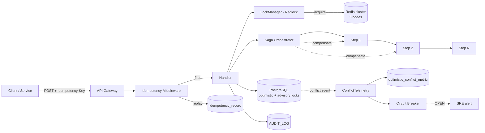

# TECH SPEC — REVYX Concurrency Hardening
<!-- TECH_SPEC_REVYX_concurrency-hardening_v1.0.0.md · v1.0.0 · 2026-05 -->
<!-- CONFIDENȚIAL · Uz Intern · © 2026 REVYX · ITPRO SYSTEM SRL -->

## Changelog

| Versiune | Data | Autor | Note |
|---|---|---|---|
| 1.0.0 | 2026-05 | Senior PM + Solution Architect + SRE Lead | ★ Spec inițială Concurrency Hardening — Phase 2 cross-cutting: distributed locks (Redis Redlock) pe entități hot · saga pattern pentru tranzacții cross-service (offer accept → deal closure → APS update) · idempotency key obligatoriu pe toate POST-urile cu side-effects · optimistic conflict observability + circuit breaker pe retry stuck. Aplicabil orizontal pe toate engine-urile S2-S5. |

---

## Cuprins

1. [Executive Summary](#1-executive-summary)
2. [Architecture Overview](#2-architecture-overview)
3. [Stack & Dependencies](#3-stack--dependencies)
4. [Data Model](#4-data-model)
5. [API Contracts](#5-api-contracts)
6. [Algorithms](#6-algorithms)
7. [State Machines](#7-state-machines)
8. [Concurrency](#8-concurrency)
9. [Caching](#9-caching)
10. [Background Jobs](#10-background-jobs)
11. [Error Handling](#11-error-handling)
12. [Security](#12-security)
13. [Observability](#13-observability)
14. [Performance Budgets](#14-performance-budgets)
15. [Testing Strategy](#15-testing-strategy)
16. [Deployment](#16-deployment)
17. [Migration Strategy](#17-migration-strategy)
18. [Risks & Mitigations](#18-risks--mitigations)
19. [Impact Assessment](#19-impact-assessment)

---

## 1. Executive Summary

★ Concurrency Hardening este spec-ul **cross-cutting** Phase 2 care extinde mecanismele de protecție concurență dincolo de optimistic locking introdus în S2-S4. Adresează patru tipuri de scenarii ne-acoperite:

1. **Hot entities** cu trafic concurent ridicat (`deal` într-o cascadă DP/DHI · `match_candidate` în re-matching · `offer` în chain rapid).
2. **Tranzacții cross-service** (offer accept ↔ deal closure ↔ APS update ↔ AUDIT_LOG) care depășesc o singură DB tx.
3. **Side-effects nedrepetabile** la retry (notificări, webhooks externe, WhatsApp template send) — cer idempotency key.
4. **Observability deficitară** pe optimistic conflicts: nu știm câte conflicte se rezolvă silent vs ajunge la circuit breaker.

| Atribut | Valoare |
|---|---|
| **Scope** | Distributed locks (Redlock) · Saga pattern · Idempotency middleware · Conflict telemetry · Circuit breaker · Backpressure |
| **Referință BRD** | §6.2 NFR · §8 (audit append-only invariant) · §9 RBAC consistency |
| **Phase** | 2 (cross-cutting) |
| **Owner tehnic** | Solution Architect + SRE Lead |
| **Dependențe upstream** | Redis 7.x (Redlock) · BullMQ · PostgreSQL advisory locks |
| **Dependențe downstream** | Toate engine-urile (lead-scoring · match · pricing · IS · NBA · DHI · APS · offer · deal-closure) |

**Garanții:**

1. **Distributed locks** pe entități "hot" via Redlock cu lease default 5s, auto-extend, fail-fast pe timeout.
2. **Saga pattern** documentat pentru 4 tranzacții critice cross-service: `OFFER_ACCEPT_SAGA`, `DEAL_CLOSURE_SAGA`, `LEAD_REMATCH_SAGA`, `PROPERTY_PRICING_CASCADE_SAGA`.
3. **Idempotency-Key** header obligatoriu pe `POST` endpoints cu side-effects (HTTP 400 dacă lipsă, HTTP 409 dacă reuse cu payload diferit).
4. **Conflict telemetry**: orice retry pe optimistic version conflict este logat în `optimistic_conflict_metric` cu entity_type + count + p95 latency.
5. **Circuit breaker** la retry "stuck" (> 5 retry sau > 5s elapsed pe aceeași tranzacție): transition `OPEN`, alert SRE, fallback graceful documentat per engine.
6. **Backwards compat**: existing engines S2-S4 primesc PR follow-up pentru a integra `lockManager.runWithLock()` și `idempotencyMiddleware`.

---

## 2. Architecture Overview



### 2.1 Componente

| Componentă | Responsabilitate |
|---|---|
| `LockManager` (Redlock client) | acquire/release/extend cu lease + retry |
| `IdempotencyMiddleware` | Verificare/persist `idempotency_record`, replay response |
| `SagaOrchestrator` | Execute step-uri ordonate cu compensare reverse-order la fail |
| `ConflictTelemetry` | Capturare optimistic version conflicts cu metrici |
| `CircuitBreaker` per saga / engine | OPEN/HALF_OPEN/CLOSED tranziții |
| `BackpressureController` | Token bucket pe queue-uri când downstream lent |

### 2.2 Hot entity inventory

| Entitate | Hot reason | Lock pattern |
|---|---|---|
| `deal` | DP/DHI cascade + needs_review + offer chain | Redlock `deal:{id}` + advisory_xact_lock |
| `match_candidate` | Re-matching cascadă pe property change | per-tenant queue + UPSERT version |
| `offer` | Chain counter rapid (race accept/counter) | Redlock `offer:{id}` + DB version |
| `property` | Pricing cascade + match v2 | advisory_xact_lock + version |
| `agent` | APS recalc + task allocator + max-3-tasks | Redlock `agent:{id}:task_alloc` |
| `lead` | IS recalc + LS update + escalation | version + IS coalesce |

---

## 3. Stack & Dependencies

| Layer | Tehnologie | Versiune | Justificare |
|---|---|---|---|
| Lock store | Redis | 7.x cluster (5 nodes) | Redlock necesită ≥3 noduri quorum |
| Lock library | `redlock` (node) | 5.x | Standard Anthropic-grade Redlock |
| Saga | Custom orchestrator în TS | — | Compensable steps cu typed contract |
| Idempotency | PostgreSQL `idempotency_record` | — | Persistent (Redis only ar pierde la failover) |
| Circuit breaker | `opossum` | latest | Maturity · metrics out-of-box |
| Backpressure | BullMQ rate limiter + custom token bucket | — | Standard |
| Audit | `auditLogger` | 1.0.0 | Toate compensation events |

---

## 4. Data Model

### 4.1 Tabel `idempotency_record`

```sql
-- Migrare: 0180_idempotency_record.sql
CREATE TABLE IF NOT EXISTS idempotency_record (
  idempotency_key      TEXT         NOT NULL,
  tenant_id            UUID         NOT NULL,
  endpoint             TEXT         NOT NULL,
  user_id              UUID         NULL,
  request_hash         TEXT         NOT NULL,        -- SHA256(method + path + canonical body)
  response_status      INTEGER      NULL,
  response_body        JSONB        NULL,
  state                TEXT         NOT NULL CHECK (state IN ('IN_FLIGHT','COMPLETED','FAILED')),
  created_at           TIMESTAMPTZ  NOT NULL DEFAULT NOW(),
  completed_at         TIMESTAMPTZ  NULL,
  expires_at           TIMESTAMPTZ  NOT NULL,        -- TTL 24h default
  PRIMARY KEY (tenant_id, idempotency_key)
);
CREATE INDEX IF NOT EXISTS idx_idem_expires ON idempotency_record (expires_at);
```

### 4.2 Tabel `saga_instance`

```sql
-- Migrare: 0181_saga_instance.sql
CREATE TABLE IF NOT EXISTS saga_instance (
  saga_id              UUID         PRIMARY KEY DEFAULT gen_random_uuid(),
  tenant_id            UUID         NOT NULL,
  saga_type            TEXT         NOT NULL CHECK (saga_type IN (
    'OFFER_ACCEPT','DEAL_CLOSURE','LEAD_REMATCH','PROPERTY_PRICING_CASCADE'
  )),
  state                TEXT         NOT NULL CHECK (state IN (
    'STARTED','RUNNING','COMPENSATING','COMPLETED','FAILED','ABORTED'
  )),
  current_step         TEXT         NULL,
  context              JSONB        NOT NULL,        -- input + step outputs
  steps_completed      TEXT[]       NOT NULL DEFAULT '{}',
  steps_compensated    TEXT[]       NOT NULL DEFAULT '{}',
  error                JSONB        NULL,
  retry_count          INTEGER      NOT NULL DEFAULT 0,
  started_at           TIMESTAMPTZ  NOT NULL DEFAULT NOW(),
  updated_at           TIMESTAMPTZ  NOT NULL DEFAULT NOW(),
  completed_at         TIMESTAMPTZ  NULL,
  version              BIGINT       NOT NULL DEFAULT 1
);
CREATE INDEX IF NOT EXISTS idx_saga_state_type
  ON saga_instance (tenant_id, state, saga_type) WHERE state IN ('RUNNING','COMPENSATING');
CREATE INDEX IF NOT EXISTS idx_saga_stuck
  ON saga_instance (started_at) WHERE state IN ('RUNNING','COMPENSATING');
```

### 4.3 Tabel `optimistic_conflict_metric` (rolling, append-only)

```sql
-- Migrare: 0182_optimistic_conflict_metric.sql
CREATE TABLE IF NOT EXISTS optimistic_conflict_metric (
  metric_id            UUID         PRIMARY KEY DEFAULT gen_random_uuid(),
  tenant_id            UUID         NOT NULL,
  entity_type          TEXT         NOT NULL,
  entity_id            UUID         NOT NULL,
  retry_attempt        INTEGER      NOT NULL,
  resolved             BOOLEAN      NOT NULL,
  duration_ms          INTEGER      NOT NULL,
  source               TEXT         NOT NULL,        -- which engine/handler
  occurred_at          TIMESTAMPTZ  NOT NULL DEFAULT NOW()
);
CREATE INDEX IF NOT EXISTS idx_oc_metric_time
  ON optimistic_conflict_metric (tenant_id, occurred_at DESC);
CREATE INDEX IF NOT EXISTS idx_oc_metric_entity
  ON optimistic_conflict_metric (tenant_id, entity_type, entity_id, occurred_at DESC);
CREATE INDEX IF NOT EXISTS idx_oc_metric_source
  ON optimistic_conflict_metric (tenant_id, source, occurred_at DESC);
-- Retention: cron purge >30 zile
```

### 4.4 Tabel `circuit_breaker_state` (volatil, dar persistat pentru cross-instance)

```sql
-- Migrare: 0183_circuit_breaker_state.sql
CREATE TABLE IF NOT EXISTS circuit_breaker_state (
  breaker_key          TEXT         PRIMARY KEY,     -- ex: 'saga:OFFER_ACCEPT', 'engine:pricing', 'tenant:<uuid>:engine:aps:nps'
  state                TEXT         NOT NULL CHECK (state IN ('CLOSED','HALF_OPEN','OPEN')),
  failures             INTEGER      NOT NULL DEFAULT 0,
  successes            INTEGER      NOT NULL DEFAULT 0,
  last_failure_at      TIMESTAMPTZ  NULL,
  next_attempt_at      TIMESTAMPTZ  NULL,
  config               JSONB        NOT NULL,        -- thresholds, cool-down
  updated_at           TIMESTAMPTZ  NOT NULL DEFAULT NOW()
);
CREATE INDEX IF NOT EXISTS idx_breaker_open
  ON circuit_breaker_state (state, next_attempt_at) WHERE state IN ('OPEN','HALF_OPEN');
```

> **Convenție key naming** (păstrată consistent în tot codebase-ul):
> - Global / per-host: `engine:<name>` (ex: `engine:pricing`) și `saga:<TYPE>` (ex: `saga:OFFER_ACCEPT`)
> - Per-tenant: prefix `tenant:<uuid>:` (ex: `tenant:abc-123:engine:aps:nps`)
> - Per-entity hot: `optimistic:<entity_type>` (ex: `optimistic:deal`)

### 4.5 Constraints & invariants

| Invariant | Enforcement |
|---|---|
| Idempotency key per (tenant, key) unic | PRIMARY KEY |
| Saga `state ∈ enum` | CHECK |
| `idempotency_record.expires_at` ≥ created_at + 1h | App validation |
| Circuit breaker single source of truth | DB row + Redis cache |

---

## 5. API Contracts

### 5.1 Idempotency middleware (HTTP)

```http
POST /api/v1/offers/:id/accept HTTP/1.1
Idempotency-Key: 5f9b... (UUID v4 sau ULID, format strict)
Content-Type: application/json
```

| Caz | Răspuns |
|---|---|
| Header lipsă pe POST cu side-effects | 400 `IDEMPOTENCY_KEY_REQUIRED` |
| Key existent + payload identic → COMPLETED | 200 cu body cached |
| Key existent + payload identic → IN_FLIGHT | 409 `REQUEST_IN_PROGRESS` |
| Key existent + payload diferit | 409 `IDEMPOTENCY_KEY_REUSED_DIFFERENT_PAYLOAD` |
| Key existent + FAILED | 200 + retry permis (engine-specific) |

### 5.2 Lock manager API

```typescript
interface LockManager {
  runWithLock<T>(
    keys: string[],          // ex: ['deal:abc-123']
    fn: (signal: AbortSignal) => Promise<T>,
    opts?: { leaseMs?: number; retries?: number; retryDelayMs?: number }
  ): Promise<T>;

  acquire(keys: string[], leaseMs?: number): Promise<Lease>;
  extend(lease: Lease, leaseMs: number): Promise<Lease>;
  release(lease: Lease): Promise<void>;
}
```

### 5.3 Saga orchestrator API

```typescript
interface Saga<C> {
  type: SagaType;
  steps: SagaStep<C>[];
}

interface SagaStep<C> {
  name: string;
  invoke: (ctx: C) => Promise<Partial<C>>;
  compensate?: (ctx: C, partial?: Partial<C>) => Promise<void>;
  retryPolicy?: { attempts: number; backoffMs: number };
  idempotencyScope?: 'step' | 'global';
}

interface SagaOrchestrator {
  start<C>(saga: Saga<C>, initialCtx: C, opts?: { tenantId: string; idempotencyKey?: string }): Promise<C>;
  resume(sagaId: string): Promise<void>;       // post-crash recovery
}
```

### 5.4 Internal admin endpoints

| Method | Path | RBAC | Descriere |
|---|---|---|---|
| `GET` | `/api/v1/admin/concurrency/sagas?state=RUNNING` | admin | Saga inflight |
| `POST` | `/api/v1/admin/concurrency/sagas/:id/abort` | admin | Forțare abort + compensare |
| `GET` | `/api/v1/admin/concurrency/conflicts?entity_type=deal` | admin | Top conflict hotspots |
| `GET` | `/api/v1/admin/concurrency/breakers` | admin | Listă circuit breakers + state |
| `POST` | `/api/v1/admin/concurrency/breakers/:key/reset` | admin | Force CLOSED (cu audit) |

---

## 6. Algorithms

### 6.1 Idempotency middleware (express)

```typescript
const POST_NEEDS_IDEMPOTENCY = new Set([
  'POST /api/v1/leads',
  'POST /api/v1/properties',
  'POST /api/v1/offers/:id/(accept|reject|counter|withdraw)',
  'POST /api/v1/deals/:id/closure/.+',
  'POST /api/v1/matches/:id/(promote|share|reject)',
  'POST /api/v1/showings',
  'POST /api/v1/showings/:id/feedback',
]);

async function idempotencyMiddleware(req, res, next) {
  if (req.method !== 'POST' || !needsIdempotency(req)) return next();
  const key = req.header('Idempotency-Key');
  if (!key || !isValidKey(key)) return res.status(400).json({ error: 'IDEMPOTENCY_KEY_REQUIRED' });

  const hash = sha256(req.method + '|' + req.path + '|' + canonicalJson(req.body));
  const existing = await db.selectFrom('idempotency_record')
    .where('tenant_id','=',req.tenant.id).where('idempotency_key','=',key).executeTakeFirst();

  if (existing) {
    if (existing.request_hash !== hash) return res.status(409).json({ error: 'IDEMPOTENCY_KEY_REUSED_DIFFERENT_PAYLOAD' });
    if (existing.state === 'IN_FLIGHT')   return res.status(409).json({ error: 'REQUEST_IN_PROGRESS' });
    if (existing.state === 'COMPLETED')   return res.status(existing.response_status).json(existing.response_body);
    // FAILED → fallthrough to retry
  }
  // Record IN_FLIGHT
  await db.insertInto('idempotency_record').values({
    tenant_id: req.tenant.id, idempotency_key: key, endpoint: req.path,
    user_id: req.user?.id ?? null, request_hash: hash, state: 'IN_FLIGHT',
    expires_at: addHours(new Date(), 24),
  }).onConflict(oc => oc.columns(['tenant_id','idempotency_key']).doNothing()).execute();

  // Capture response
  const origJson = res.json.bind(res);
  res.json = (body) => {
    db.updateTable('idempotency_record')
      .set({ state: res.statusCode < 500 ? 'COMPLETED' : 'FAILED',
             response_status: res.statusCode, response_body: body, completed_at: new Date() })
      .where('tenant_id','=',req.tenant.id).where('idempotency_key','=',key).execute();
    return origJson(body);
  };
  next();
}
```

### 6.2 Lock manager (Redlock + advisory)

```typescript
async function runWithLock<T>(keys: string[], fn: (signal: AbortSignal) => Promise<T>, opts?: LockOpts): Promise<T> {
  const leaseMs = opts?.leaseMs ?? 5000;
  const retries = opts?.retries ?? 5;

  const lock = await redlock.acquire(keys.map(k => `revyx:lock:${k}`), leaseMs, { retryCount: retries, retryDelay: 100, retryJitter: 50 });
  const ctrl = new AbortController();

  // Auto-extend lease at 70% elapsed
  const interval = setInterval(() => lock.extend(leaseMs).catch(() => ctrl.abort()), Math.floor(leaseMs * 0.7));
  try {
    return await Promise.race([
      fn(ctrl.signal),
      new Promise<T>((_, rej) => setTimeout(() => { ctrl.abort(); rej(new Error('LOCK_FN_TIMEOUT')); }, leaseMs * 3)),
    ]);
  } finally {
    clearInterval(interval);
    await lock.release().catch(() => {/* best-effort */});
  }
}
```

### 6.3 Saga orchestrator

```typescript
async function start<C>(saga: Saga<C>, ctx: C, opts: { tenantId: string; idempotencyKey?: string }): Promise<C> {
  const inst = await db.insertInto('saga_instance').values({
    tenant_id: opts.tenantId, saga_type: saga.type, state: 'RUNNING', context: ctx as any,
  }).returningAll().executeTakeFirstOrThrow();

  let cur: C = ctx;
  const completed: string[] = [];
  try {
    for (const step of saga.steps) {
      await markStepStart(inst.saga_id, step.name);
      cur = { ...cur, ...await retry(step.retryPolicy, () => step.invoke(cur)) };
      completed.push(step.name);
      await markStepComplete(inst.saga_id, step.name, cur);
    }
    await db.updateTable('saga_instance').set({ state: 'COMPLETED', completed_at: new Date() }).where('saga_id','=',inst.saga_id).execute();
    return cur;
  } catch (err) {
    await db.updateTable('saga_instance').set({ state: 'COMPENSATING', error: serializeErr(err) }).where('saga_id','=',inst.saga_id).execute();
    // Compensate reverse-order
    for (const step of [...completed].reverse()) {
      const def = saga.steps.find(s => s.name === step);
      if (def?.compensate) {
        try { await def.compensate(cur); await markCompensated(inst.saga_id, step); }
        catch (cErr) { /* alert SRE — saga half-failed; admin abort required */ await escalate(inst.saga_id, cErr); }
      }
    }
    await db.updateTable('saga_instance').set({ state: 'FAILED', completed_at: new Date() }).where('saga_id','=',inst.saga_id).execute();
    throw err;
  }
}
```

### 6.4 Saga catalog (4 critice)

#### 6.4.1 OFFER_ACCEPT_SAGA

| Step | Invoke | Compensate |
|---|---|---|
| 1. validate_offer | Verify offer.status=pending, valid_until>now | — |
| 2. lock_deal | runWithLock(['deal:'+dealId, 'offer:'+offerId]) | release |
| 3. update_offer_accepted | UPDATE offer status=accepted | UPDATE status=pending |
| 4. transition_deal | DEAL→WON_PENDING_NOTARY | DEAL→NEGOTIATION |
| 5. property_reserve | property.status=RESERVED | property.status=ACTIVE |
| 6. cancel_other_offers | Pending offers on deal → withdrawn | — (write-only audit) |
| 7. notify_parties | WhatsApp `offer_accepted` (idempotent send) | — (notification noop on compensate) |
| 8. recalc_dp_dhi | Match Engine + DHI Engine cascade | — (idempotent recalc) |

#### 6.4.2 DEAL_CLOSURE_SAGA (cadastre registered → WON terminal)

| Step | Invoke | Compensate |
|---|---|---|
| 1. lock_deal | Redlock | release |
| 2. validate_pre | closure_phase=NOTARIZED + cadastre_reg_number prezent | — |
| 3. atomic_transition | UPDATE deal=WON, property=SOLD, lead=WON | revert (best-effort) |
| 4. cancel_tasks | TASK active → CANCELLED reason=deal_won | revert state (audit) |
| 5. cancel_showings | future SHOWING → WITHDRAWN | — |
| 6. aps_recalc_dcr | Increment agent.deal_count_total + APS recalc trigger | — (idempotent) |
| 7. nps_dispatch_schedule | Enqueue T+7d email | cancel job |
| 8. gdpr_retention_set | UPDATE lead.data_retention_expires_at | — |

#### 6.4.3 LEAD_REMATCH_SAGA (property changed → needs_review)

| Step | Invoke | Compensate |
|---|---|---|
| 1. find_affected_deals | SELECT deals on property non-terminal | — |
| 2. lock_deals_batch | Redlock multi-key | release |
| 3. flag_needs_review | UPDATE deal.needs_review=true (BR-05) | revert (audit) |
| 4. notify_agents | Push notification | — |
| 5. emit_dp_recalc | publish deal.dp.updated | — (idempotent) |

#### 6.4.4 PROPERTY_PRICING_CASCADE_SAGA

| Step | Invoke | Compensate |
|---|---|---|
| 1. find_dependent_properties | from comparables_cache | — |
| 2. enqueue_recalc_jobs | BullMQ idempotent jobs | — |
| 3. wait_for_completion (timeout 60s) | watch metrics counter | — (recalc resume on next event) |

### 6.5 Conflict telemetry

```typescript
async function logConflict(meta: {
  tenantId: string; entityType: string; entityId: string;
  attempt: number; resolved: boolean; durationMs: number; source: string;
}) {
  await db.insertInto('optimistic_conflict_metric').values({ ...meta, occurred_at: new Date() }).execute();
  metrics.optimistic_conflict_total.inc({ entity_type: meta.entityType, source: meta.source });
  if (!meta.resolved) metrics.optimistic_conflict_unresolved_total.inc({ entity_type: meta.entityType });
}

// Wrapper standard pentru optimistic tx retry
async function withOptimisticRetry<T>(opts: { source: string; entityType: string; entityId: string; tenantId: string; maxAttempts?: number }, fn: () => Promise<T>): Promise<T> {
  const max = opts.maxAttempts ?? 3;
  let attempt = 0; const start = Date.now();
  while (true) {
    attempt++;
    try { return await fn(); }
    catch (e: any) {
      const isVersionConflict = e?.code === 'VERSION_CONFLICT' || /version/i.test(e?.message ?? '');
      if (!isVersionConflict || attempt >= max) {
        await logConflict({ ...opts, attempt, resolved: false, durationMs: Date.now()-start });
        if ((Date.now()-start) > 5000) await circuitBreaker.recordFailure(`optimistic:${opts.entityType}`);
        throw e;
      }
      await sleep(50 * Math.pow(2, attempt-1) + Math.random()*30);
    }
  }
}
```

### 6.6 Circuit breaker

```typescript
type BreakerState = 'CLOSED' | 'HALF_OPEN' | 'OPEN';

const DEFAULT_CONFIG = { failureThreshold: 10, successThreshold: 3, timeoutMs: 30_000 };

class CircuitBreaker {
  async execute<T>(key: string, fn: () => Promise<T>, fallback?: () => Promise<T>): Promise<T> {
    const s = await this.load(key);
    if (s.state === 'OPEN') {
      if (Date.now() < +s.next_attempt_at) {
        if (fallback) return fallback();
        throw new Error(`CIRCUIT_OPEN:${key}`);
      }
      await this.transition(key, 'HALF_OPEN');
    }
    try {
      const v = await fn();
      await this.recordSuccess(key);
      return v;
    } catch (e) {
      await this.recordFailure(key);
      if (fallback) return fallback();
      throw e;
    }
  }
}
```

### 6.7 Backpressure (token bucket per queue)

```typescript
// BullMQ rate limiter aplicat pe job-uri cu fan-out mare (ex: pricing.cascade)
queue.add('pricing.recalc', payload, {
  rateLimit: { max: 200, duration: 60_000 },         // 200/min/queue
  jobId: `pricing:recalc:${propertyId}:${minute}`,    // coalesce
});
```

---

## 7. State Machines

### 7.1 Saga state

```
STARTED → RUNNING → COMPLETED
RUNNING → COMPENSATING → FAILED
RUNNING → ABORTED (admin force)
RUNNING (>5min stuck) → ABORTED (auto + alert)
```

### 7.2 Circuit breaker state

```
CLOSED → (failures ≥ threshold) → OPEN
OPEN → (after timeoutMs) → HALF_OPEN
HALF_OPEN → (successes ≥ threshold) → CLOSED
HALF_OPEN → (any failure) → OPEN (reset timer)
```

### 7.3 Idempotency record state

```
[NEW] → IN_FLIGHT → COMPLETED
              ↘ FAILED → (retry permis cu același key)
```

---

## 8. Concurrency

Acest spec ESTE concurrency. Punctele cheie:

- **Lock acquisition order**: alfabetică pe keys → previne deadlock cross-saga (ex: `[deal:X, offer:Y]` always sorted înainte de acquire).
- **Lease auto-extend**: la 70% lease elapsed pentru a evita lease expiry mid-step.
- **Saga compensation**: reverse order, fiecare compensate idempotent.
- **No nested same-key acquire** (re-entrancy off): folosim explicit pasare lease prin context.
- **Cross-DC failover**: Redlock cu quorum ≥3 noduri. PostgreSQL primary failover → saga `RUNNING` reîncepe la post-recovery `resume(sagaId)`.

---

## 9. Caching

| Key | Conținut | TTL | Invalidare |
|---|---|---|---|
| `revyx:lock:{key}` | Redlock value | per lease (5s) | release/expire |
| `idem:result:{tenant}:{key}` | Hot path replay (read-through) | 5 min | record FAILED→COMPLETED transition |
| `breaker:{key}` | breaker state cache | 30 sec | manual reset |

---

## 10. Background Jobs

| Job | Tip | Idempotent | Retry |
|---|---|---|---|
| `idempotency.gc` | cron `0 * * * *` (orar) — purge `expires_at < NOW` | DA | 5× |
| `saga.stuck.detect` | cron `*/5 * * * *` — find RUNNING > 5min | DA | 3× (escalate) |
| `saga.resume` | post-crash boot job | DA | 5× |
| `optimistic_conflict.gc` | cron `0 5 * * *` zilnic — purge >30d | DA | 5× |
| `breaker.health` | cron `*/1 * * * *` — verify HALF_OPEN tranziții | DA | 3× |

---

## 11. Error Handling

| Cod | Caz | Răspuns |
|---|---|---|
| `IDEMPOTENCY_KEY_REQUIRED` | Header lipsă | 400 |
| `IDEMPOTENCY_KEY_REUSED_DIFFERENT_PAYLOAD` | Conflict | 409 |
| `REQUEST_IN_PROGRESS` | Replay în IN_FLIGHT | 409 |
| `LOCK_ACQUIRE_TIMEOUT` | Redlock retries exhausted | 503 + retry-after header |
| `LOCK_FN_TIMEOUT` | fn() depășește lease*3 | 504 + abort |
| `SAGA_COMPENSATION_FAILED` | Compensate aruncă | 500 + alert SRE |
| `CIRCUIT_OPEN:{key}` | Breaker OPEN | 503 + retry-after |
| `OPTIMISTIC_CONFLICT_EXHAUSTED` | retry max | 409 + telemetry |
| `SAGA_STUCK_ABORTED` | auto-abort la >5min | 500 + manual review |

---

## 12. Security

- **Idempotency key**: generated client-side cu UUID v4 / ULID. Server validează format.
- **AUDIT_LOG events:**
  - `IDEMPOTENCY_KEY_REUSED_REJECTED`
  - `SAGA_STARTED` / `SAGA_COMPLETED` / `SAGA_COMPENSATED` / `SAGA_ABORTED`
  - `CIRCUIT_BREAKER_OPENED` / `CIRCUIT_BREAKER_RESET` (admin)
  - `LOCK_FN_TIMEOUT_DETECTED`
- **PII**: idempotency_record `response_body` poate conține PII → encrypt at rest (PG `pgcrypto`) sau redact câmpurile sensibile.
- **RBAC**: admin endpoints `/admin/concurrency/*` doar admin role.
- **Rate limiting**: lock acquire `100/min/agent`; abuse detection.

---

## 13. Observability

| Metric | Tip | Alert |
|---|---|---|
| `optimistic_conflict_total{entity_type,source}` | counter | rate > baseline 3× |
| `optimistic_conflict_unresolved_total` | counter | > 5/min — investigate hot key |
| `lock_acquire_duration_ms` (p95) | histogram | p95 > 200ms |
| `lock_extend_failures_total` | counter | > 0 — Redis health |
| `saga_running_total{type}` | gauge | spike — backlog |
| `saga_compensation_total{type}` | counter | > 1/min — review root cause |
| `saga_duration_ms{type}` (p95) | histogram | p95 > 5s |
| `breaker_state{key}` | gauge | OPEN > 5min — alert |
| `idempotency_replay_total` | counter | normal traffic indicator |

Dashboard: `REVYX / Concurrency Health`.

---

## 14. Performance Budgets

| Metric | Target | Sursă |
|---|---|---|
| Lock acquire (uncontested) | p95 < 50 ms | UX |
| Lock acquire (1 contender) | p95 < 200 ms | UX |
| Idempotency middleware overhead | p95 < 30 ms | UX |
| Saga step orchestration overhead | < 10 ms per step | UX |
| Conflict telemetry write | async, non-blocking | infra |

---

## 15. Testing Strategy

### 15.1 Unit
- Lock manager: acquire/release/extend; AbortSignal propagated
- Idempotency middleware: hash mismatch → 409; IN_FLIGHT replay → 409
- Saga: invoke errors trigger compensation reverse-order
- Circuit breaker: state tranziții CLOSED→OPEN→HALF_OPEN→CLOSED

### 15.2 Integration
- OFFER_ACCEPT_SAGA happy path: 8 steps → COMPLETED
- OFFER_ACCEPT_SAGA: step 5 fail → compensate steps 4,3,2 → DEAL revert NEGOTIATION + property revert ACTIVE
- 100 concurrent accepts pe același offer → exact 1 succeeded (Redlock + version)
- Idempotency replay 5× → 1 execution + 4 cached responses

### 15.3 Chaos
- Redis primary failover mid-saga → saga.resume() picks up cu lease nou
- PG primary failover → in-flight saga → resume + compensate cleanly
- Network partition: server thinks lock acquired, lease expired → AbortSignal triggered, no double-write (verificat prin AUDIT_LOG)

### 15.4 Load
- 1000 RPS POST /offers/:id/accept (different offers) → no resource exhaustion
- 100 concurrent saga running → no deadlock, no orphan sagas after 5min

### 15.5 Coverage

| Layer | Coverage |
|---|---|
| LockManager | ≥ 95% |
| IdempotencyMiddleware | ≥ 95% |
| SagaOrchestrator | ≥ 95% |
| CircuitBreaker | ≥ 95% |

---

## 16. Deployment

| Aspect | Detaliu |
|---|---|
| Feature flag | `flag.concurrency_hardening_v1.enabled` (default ON post-rampa) cu sub-flags: `idempotency`, `redlock`, `saga`, `breaker` |
| Rollout | sub-flag pe rând: idempotency middleware (week 1) → Redlock (week 2) → Saga refactor pe OFFER_ACCEPT (week 3) → restul saga (week 4-5) → breakers (week 6) |
| Rollback | sub-flag OFF; engines au fallback la optimistic-only |
| Owner | SRE Lead + Solution Architect |

---

## 17. Migration Strategy

```
0180_idempotency_record.sql
0181_saga_instance.sql
0182_optimistic_conflict_metric.sql
0183_circuit_breaker_state.sql
```

PR-uri follow-up integrare per engine S2-S4 (separate, marcate `★ concurrency-v1 integration`):
- `lead-scoring v1` → idempotency pe POST /leads
- `match-engine v1/v2` → Redlock pe deal cascade
- `pricing-ai v1` → already references `concurrency-hardening v1.0.0`
- `offer-engine v1` (nou S5 #5) → OFFER_ACCEPT_SAGA
- `deal-closure v1` (nou S5 #6) → DEAL_CLOSURE_SAGA
- `aps-engine v1` (nou S5 #7) → idempotent recalc

---

## 18. Risks & Mitigations

| # | Risc | Probab. | Impact | Mitigare |
|---|---|---|---|---|
| R1 | Redis cluster outage | LOW | CRIT | Saga can fall back la PG advisory locks (degraded mode); breaker OPEN pe ROOM-uri afectate |
| R2 | Idempotency table grow | MED | MED | TTL 24h + cron GC |
| R3 | Saga stuck (orphan RUNNING) | MED | HIGH | `saga.stuck.detect` cron + auto-abort + alert SRE |
| R4 | Compensation fail (half-failed saga) | LOW | HIGH | Manual admin abort + AUDIT trail · alert |
| R5 | Lock starvation pe entitate hot | MED | MED | Fair queueing (FIFO) + jitter; observability hot-key |
| R6 | Idempotency key reuse cross-tenant | LOW | LOW | PRIMARY KEY include tenant_id |
| R7 | Migration regress engines existente | MED | MED | Sub-flag granular + canary tenant |
| R8 | Breaker OPEN cascade (avalanche) | LOW | HIGH | Per-key breaker (nu global); alert înainte de avalanche |

---

## 19. Impact Assessment

### 19.1 Scope of Change

| Element | Detaliu |
|---|---|
| Document | TECH_SPEC_REVYX_concurrency-hardening_v1.0.0.md |
| Tip schimbare | NEW (cross-cutting Phase 2) |
| Aria afectată | Toate engine-urile S2-S5 · NEW entități (`idempotency_record`, `saga_instance`, `optimistic_conflict_metric`, `circuit_breaker_state`) |
| Origine | Spec gap-uri concurrency S2-S4 + S5 deliverable #4 |

### 19.2 Impact pe documente conexe

| Document | Tip impact | Acțiune |
|---|---|---|
| TECH_SPEC_REVYX_lead-scoring_v1.0.0.md | Minor (★ patch v1.1) | Integrare idempotency middleware + Redlock pe lead version retry |
| TECH_SPEC_REVYX_property_v1.0.0.md | Minor (★ patch v1.1) | Idempotency POST /properties + advisory_xact_lock pe pricing |
| TECH_SPEC_REVYX_match-engine_v1.0.0.md | Minor (★ patch v1.1) | Redlock pe deal cascade · LEAD_REMATCH_SAGA |
| TECH_SPEC_REVYX_match-engine_v2.0.0.md | Minor (★ embedded ref §8) | Redlock pe embedding regen |
| TECH_SPEC_REVYX_pricing-ai_v1.0.0.md | None (pre-referenced) | — |
| TECH_SPEC_REVYX_interaction-strength_v1.0.0.md | None (pre-referenced) | — |
| TECH_SPEC_REVYX_offer-engine_v1.0.0.md (S5 #5) | Major (consumer) | OFFER_ACCEPT_SAGA implementat |
| TECH_SPEC_REVYX_deal-closure_v1.0.0.md (S5 #6) | Major (consumer) | DEAL_CLOSURE_SAGA implementat |
| TECH_SPEC_REVYX_aps-engine_v1.0.0.md (S5 #7) | Minor (consumer) | Idempotent recalc + breaker pe NPS |
| TECH_SPEC_REVYX_audit-log_v1.0.0.md | Minor | Catalog event extins (`SAGA_*`, `IDEMPOTENCY_*`, `CIRCUIT_BREAKER_*`, `LOCK_FN_TIMEOUT`) |
| TECH_SPEC_REVYX_showing_v1.0.0.md | Minor (★ patch) | Idempotency POST /showings, /feedback |
| TECH_SPEC_REVYX_showcase-links_v1.0.0.md | Minor | None — public reads |
| TECH_SPEC_REVYX_webhook-intake_v1.0.0.md | Minor | Idempotency built-in via webhook signature; saga pe lead ingestion |
| TECH_SPEC_REVYX_dhi-engine_v1.0.0.md | Minor | Optimistic retry wrapper standard |
| TECH_SPEC_REVYX_nba-engine_v1.0.0.md | Minor | Idempotent task creation |

### 19.3 Impact pe scoring

| Scor | Afectat? | Detaliu |
|---|---|---|
| Toate | NU (formă) | Hardening protejează formulele, nu le schimbă |

### 19.4 Impact pe entități / schema BD

| Entitate | Modificare | Migrare |
|---|---|---|
| `idempotency_record` | NEW | 0180 |
| `saga_instance` | NEW | 0181 |
| `optimistic_conflict_metric` | NEW | 0182 |
| `circuit_breaker_state` | NEW | 0183 |

### 19.5 Impact pe RBAC

| Rol | Permisiuni adăugate |
|---|---|
| admin | `/admin/concurrency/*` endpoints (read + abort + reset) |

### 19.6 Impact pe SLA & NFR

| NFR / SLA | Înainte | După | Validare |
|---|---|---|---|
| NFR-01 (cascade ≤30s) | best effort | enforced via saga + breakers | E2E |
| Lock acquire p95 | n/a | <200ms | Load |
| Idempotent POST | optional | mandatory pe endpoints listate | Integration |

### 19.7 Impact pe Securitate & GDPR

| Aspect | Status | Notă |
|---|---|---|
| PII | DA potențial | `idempotency_record.response_body` — encrypt at rest sau redact |
| AUDIT_LOG events noi | DA | §12 |
| Consent flow | NU | — |
| HMAC / JWT / RBAC | DA | RBAC §12 |
| Rate limiting | DA | Lock acquire 100/min/agent |

### 19.8 Risks & Mitigations

Vezi §18.

### 19.9 Test Plan

Vezi §15. Critical: chaos test failover Redis + PG · saga compensation correctness · lock starvation absent.

### 19.10 Rollout & Rollback

Sub-flag granular (idempotency / redlock / saga / breaker) · 6 săpt staged. Rollback per sub-flag.

### 19.11 Approval Gate

| Aprobator | Necesar pentru |
|---|---|
| Senior PM | Saga catalog (4 critice) · idempotency endpoint list |
| Solution Architect | Schema · Redlock topology · saga design |
| SRE Lead | Breaker config · chaos validation · failover plans |
| Security Lead | RBAC · audit · idempotency PII handling |

---

*docs/tech-spec/TECH_SPEC_REVYX_concurrency-hardening_v1.0.0.md · v1.0.0 · 2026-05 · CONFIDENȚIAL · Uz Intern*
*REVYX — Real Estate Execution Intelligence · © 2026 REVYX · ITPRO SYSTEM SRL*
