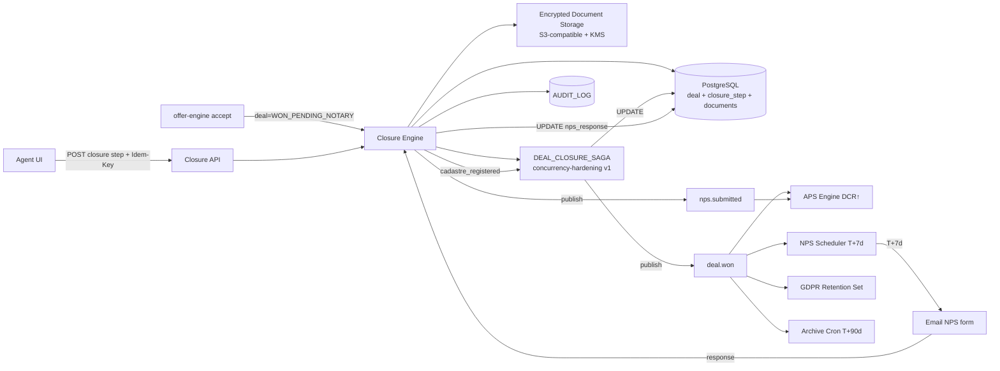

# TECH SPEC — REVYX Deal Closure Engine
<!-- TECH_SPEC_REVYX_deal-closure_v1.0.0.md · v1.0.0 · 2026-05 -->
<!-- CONFIDENȚIAL · Uz Intern · © 2026 REVYX · ITPRO SYSTEM SRL -->

## Changelog

| Versiune | Data | Autor | Note |
|---|---|---|---|
| 1.0.0 | 2026-05 | Senior PM + Solution Architect | ★ Spec inițială Deal Closure Engine — operationalizează schema deal closure (BRD §6 Pilon 06) · closure_phase enum · avans · financing · notary · cadastre · DEAL_CLOSURE_STEP audit · NPS_RESPONSE · DOCUMENTS storage encrypted. Recomandare emisă în WORKFLOW deal-closure v1.0.0 §15.2. |

---

## Cuprins

1. [Executive Summary](#1-executive-summary)
2. [Architecture Overview](#2-architecture-overview)
3. [Stack & Dependencies](#3-stack--dependencies)
4. [Data Model](#4-data-model)
5. [API Contracts](#5-api-contracts)
6. [Algorithms](#6-algorithms)
7. [State Machines](#7-state-machines)
8. [Concurrency](#8-concurrency)
9. [Caching](#9-caching)
10. [Background Jobs](#10-background-jobs)
11. [Error Handling](#11-error-handling)
12. [Security](#12-security)
13. [Observability](#13-observability)
14. [Performance Budgets](#14-performance-budgets)
15. [Testing Strategy](#15-testing-strategy)
16. [Deployment](#16-deployment)
17. [Migration Strategy](#17-migration-strategy)
18. [Risks & Mitigations](#18-risks--mitigations)
19. [Impact Assessment](#19-impact-assessment)

---

## 1. Executive Summary

★ Deal Closure Engine este componenta Phase 2 dedicată pentru pilonul 06 (Deal Intelligence — closure path WON). Operationalizează `closure_phase` (`STARTED → AVANS_PAID → FINANCING → NOTARY_SCHEDULED → NOTARIZED → CADASTRE_REGISTERED → WON`) cu audit per pas, document storage encrypted (acte notariale, dovezi avans), capturare NPS post-WON și DEAL_CLOSURE_SAGA pentru tranziția atomică terminal `cadastre_registered → WON + property=SOLD + lead=WON`.

| Atribut | Valoare |
|---|---|
| **Scope** | DEAL closure schema · DEAL_CLOSURE_STEP audit · DOCUMENTS storage · NPS_RESPONSE · DEAL_CLOSURE_SAGA · GDPR retention enforce · APS DCR trigger |
| **Referință BRD** | §5 Pilon 06 · §7.7 APS · §9.4 GDPR retention (NFR-10) |
| **Phase** | 2 |
| **Owner tehnic** | Solution Architect + Senior PM |
| **Dependențe upstream** | offer-engine v1 (handoff WON_PENDING_NOTARY) · concurrency-hardening v1 (saga + idempotency) · audit-log v1 |
| **Dependențe downstream** | aps-engine v1 (DCR/CS trigger) · property v1 (SOLD) · lead-scoring v1 (WON) |

**Garanții:**

1. Schema completă DEAL closure: `closure_phase`, `avans_amount`, `avans_paid_at`, `financing_status`, `notary_act_number`, `notarized_at`, `cadastre_registration_number`, `won_at`, `archived_at`.
2. **DEAL_CLOSURE_STEP** tabel audit append-only — toate tranzițiile de fază cu actor, timestamp, metadata.
3. **DOCUMENTS** storage encrypted at-rest cu RBAC strict (act notarial PII).
4. **NPS_RESPONSE** captura T+7d cu classification (Promoter/Passive/Detractor) și trigger APS CS.
5. **DEAL_CLOSURE_SAGA** garantează atomicitate la cadastre_registered → WON terminal (deal + property + lead + tasks + showings + APS + NPS schedule + GDPR retention).
6. NFR: APS recalc post-WON < 30s · NPS dispatch precision T+7d ±1h.

---

## 2. Architecture Overview



### 2.1 Componente

| Componentă | Responsabilitate |
|---|---|
| `ClosureEngine` (orchestrator) | API endpoints + tranziție closure_phase + step audit |
| `DocumentStorage` | Upload/retrieve cu encryption (KMS) + RBAC |
| `NPSDispatcher` | Email NPS T+7d · capture response |
| `DealClosureSagaRunner` | Wraps saga concurrency-hardening §6.4.2 |
| `GDPRRetentionService` | Set `data_retention_expires_at = NOW + 3y` la WON |
| `ArchiveScheduler` | Cron T+90d post-WON → `archived_at` |
| `FinancingTracker` | Status credit ipotecar (Phase 2 manual; Phase 3 integrare bancă) |

---

## 3. Stack & Dependencies

| Layer | Tehnologie | Versiune | Justificare |
|---|---|---|---|
| Backend | Node.js + TS | 20 LTS | Stack |
| DB | PostgreSQL | 16.x | RLS · partial indexes |
| Document storage | S3-compatible (MinIO local · AWS S3 prod) + KMS | — | Encryption at-rest + audit access |
| Encryption | AES-256-GCM (envelope encryption cu KMS data keys) | — | Standard |
| Email | SendGrid / SES | — | NPS dispatch |
| Cache | Redis | 7.x | NPS link tokens |
| Queue | BullMQ | latest | Saga + cron + email |
| Audit | `auditLogger` | 1.0.0 | Toate tranzițiile |
| Concurrency | concurrency-hardening v1.0.0 | — | DEAL_CLOSURE_SAGA |

---

## 4. Data Model

### 4.1 ALTER `deal` — closure fields complete

```sql
-- Migrare: 0200_deal_closure.sql
ALTER TABLE deal
  ADD COLUMN IF NOT EXISTS closure_phase TEXT NULL CHECK (closure_phase IS NULL OR closure_phase IN (
    'STARTED','AVANS_PAID','FINANCING_PENDING','FINANCING_APPROVED','FINANCING_REJECTED',
    'NOTARY_SCHEDULED','NOTARIZED','CADASTRE_REGISTERED','WON'
  )),
  ADD COLUMN IF NOT EXISTS closure_started_at      TIMESTAMPTZ NULL,
  ADD COLUMN IF NOT EXISTS avans_amount            NUMERIC(14,2) NULL CHECK (avans_amount IS NULL OR avans_amount > 0),
  ADD COLUMN IF NOT EXISTS avans_currency          TEXT NULL CHECK (avans_currency IS NULL OR avans_currency IN ('EUR','MDL','USD')),
  ADD COLUMN IF NOT EXISTS avans_paid_at           TIMESTAMPTZ NULL,
  ADD COLUMN IF NOT EXISTS avans_proof_document_id UUID NULL,
  ADD COLUMN IF NOT EXISTS requires_financing      BOOLEAN NOT NULL DEFAULT FALSE,
  ADD COLUMN IF NOT EXISTS financing_status        TEXT NULL CHECK (financing_status IS NULL OR financing_status IN ('pending','approved','rejected','not_required')),
  ADD COLUMN IF NOT EXISTS financing_bank_name     TEXT NULL,
  ADD COLUMN IF NOT EXISTS financing_amount_eur    NUMERIC(14,2) NULL,
  ADD COLUMN IF NOT EXISTS financing_decision_at   TIMESTAMPTZ NULL,
  ADD COLUMN IF NOT EXISTS notary_name             TEXT NULL,
  ADD COLUMN IF NOT EXISTS notary_office           TEXT NULL,
  ADD COLUMN IF NOT EXISTS notary_scheduled_at     TIMESTAMPTZ NULL,
  ADD COLUMN IF NOT EXISTS notarized_at            TIMESTAMPTZ NULL,
  ADD COLUMN IF NOT EXISTS notary_act_number       TEXT NULL,
  ADD COLUMN IF NOT EXISTS notary_document_id      UUID NULL,
  ADD COLUMN IF NOT EXISTS cadastre_registration_number TEXT NULL,
  ADD COLUMN IF NOT EXISTS cadastre_registered_at  TIMESTAMPTZ NULL,
  ADD COLUMN IF NOT EXISTS won_at                  TIMESTAMPTZ NULL,
  ADD COLUMN IF NOT EXISTS sold_price_eur          NUMERIC(14,2) NULL,
  ADD COLUMN IF NOT EXISTS archived_at             TIMESTAMPTZ NULL,
  ADD COLUMN IF NOT EXISTS lost_reason             TEXT NULL;

CREATE INDEX IF NOT EXISTS idx_deal_closure_phase
  ON deal (tenant_id, closure_phase) WHERE closure_phase IS NOT NULL AND closure_phase <> 'WON';
CREATE INDEX IF NOT EXISTS idx_deal_won_unarchived
  ON deal (tenant_id, won_at) WHERE status = 'WON' AND archived_at IS NULL;
```

### 4.2 Tabel `deal_closure_step` (audit append-only)

```sql
-- Migrare: 0201_deal_closure_step.sql
CREATE TABLE IF NOT EXISTS deal_closure_step (
  step_id              UUID         PRIMARY KEY DEFAULT gen_random_uuid(),
  tenant_id            UUID         NOT NULL,
  deal_id              UUID         NOT NULL REFERENCES deal(deal_id) ON DELETE RESTRICT,  -- ★ block delete deal cu audit
  phase_from           TEXT         NULL,
  phase_to             TEXT         NOT NULL,
  actor_user_id        UUID         NULL,
  actor_type           TEXT         NOT NULL CHECK (actor_type IN ('USER','SYSTEM','SAGA')),
  payload              JSONB        NULL,
  document_ids         UUID[]       NULL,
  occurred_at          TIMESTAMPTZ  NOT NULL DEFAULT NOW()
);
CREATE INDEX IF NOT EXISTS idx_dcs_deal_time
  ON deal_closure_step (tenant_id, deal_id, occurred_at);
-- GIN index pe payload (queried frecvent pentru drill-down audit)
CREATE INDEX IF NOT EXISTS idx_dcs_payload_gin
  ON deal_closure_step USING GIN (payload) WHERE payload IS NOT NULL;

-- Append-only: revoke UPDATE/DELETE
REVOKE UPDATE, DELETE ON deal_closure_step FROM PUBLIC;
ALTER TABLE deal_closure_step ENABLE ROW LEVEL SECURITY;
CREATE POLICY dcs_no_mutation ON deal_closure_step FOR UPDATE TO PUBLIC USING (FALSE) WITH CHECK (FALSE);
CREATE POLICY dcs_no_delete   ON deal_closure_step FOR DELETE TO PUBLIC USING (FALSE);
CREATE POLICY dcs_select      ON deal_closure_step FOR SELECT USING (tenant_id = current_setting('app.tenant_id', true)::uuid);
CREATE POLICY dcs_insert      ON deal_closure_step FOR INSERT WITH CHECK (tenant_id = current_setting('app.tenant_id', true)::uuid);  -- ★ tenant-gated INSERT
```

> **Convention `app.tenant_id` GUC:** API middleware setează `SET LOCAL app.tenant_id = $1` la începutul fiecărei tranzacții HTTP (conexiune din pool reset-ată la `RESET app.tenant_id` la final). Background jobs care nu au context tenant (cron-uri admin) bypass RLS via `SET LOCAL row_security = off` rulând cu rol `revyx_system` (privileged). Documentat ca standard cross-engine; backwards compat — engine-urile S2-S4 vor adopta același pattern în PR follow-up `concurrency-hardening v1.0.0` integration.

### 4.3 Tabel `documents`

```sql
-- Migrare: 0202_documents.sql
CREATE TABLE IF NOT EXISTS documents (
  document_id          UUID         PRIMARY KEY DEFAULT gen_random_uuid(),
  tenant_id            UUID         NOT NULL,
  entity_type          TEXT         NOT NULL CHECK (entity_type IN ('DEAL','LEAD','PROPERTY','OFFER','AGENT')),
  entity_id            UUID         NOT NULL,
  document_type        TEXT         NOT NULL CHECK (document_type IN (
    'avans_proof','notary_act','contract_preliminary','financing_approval',
    'cadastre_extract','identity_proof','energy_certificate','other'
  )),
  filename             TEXT         NOT NULL,
  mime_type            TEXT         NOT NULL,
  size_bytes           BIGINT       NOT NULL CHECK (size_bytes > 0 AND size_bytes <= 50 * 1024 * 1024), -- 50MB cap
  storage_key          TEXT         NOT NULL,        -- S3 object key
  encryption_key_id    TEXT         NOT NULL,        -- KMS key reference
  sha256_hash          TEXT         NOT NULL,
  uploaded_by_user_id  UUID         NOT NULL,
  contains_pii         BOOLEAN      NOT NULL DEFAULT TRUE,
  retention_expires_at TIMESTAMPTZ  NULL,             -- aligned cu deal/lead retention
  uploaded_at          TIMESTAMPTZ  NOT NULL DEFAULT NOW(),
  deleted_at           TIMESTAMPTZ  NULL,             -- soft delete; purge la retention
  metadata             JSONB        NULL
);
CREATE INDEX IF NOT EXISTS idx_doc_entity      ON documents (tenant_id, entity_type, entity_id);
CREATE INDEX IF NOT EXISTS idx_doc_retention   ON documents (retention_expires_at) WHERE retention_expires_at IS NOT NULL AND deleted_at IS NULL;
CREATE INDEX IF NOT EXISTS idx_doc_type        ON documents (tenant_id, document_type);
```

### 4.4 Tabel `nps_response`

```sql
-- Migrare: 0203_nps_response.sql
CREATE TABLE IF NOT EXISTS nps_response (
  nps_id               UUID         PRIMARY KEY DEFAULT gen_random_uuid(),
  tenant_id            UUID         NOT NULL,
  deal_id              UUID         NOT NULL REFERENCES deal(deal_id) ON DELETE RESTRICT,
  agent_id             UUID         NOT NULL,
  lead_id              UUID         NOT NULL,
  score                INTEGER      NOT NULL CHECK (score BETWEEN 0 AND 10),
  classification       TEXT         NOT NULL CHECK (classification IN ('detractor','passive','promoter')),
  comment              TEXT         NULL,
  consent_at           TIMESTAMPTZ  NULL,                          -- ★ Art.6/Art.21: consent capturat la deal WON UI
  dispatched_at        TIMESTAMPTZ  NOT NULL,
  submitted_at         TIMESTAMPTZ  NOT NULL DEFAULT NOW(),
  response_token       TEXT         NOT NULL UNIQUE,
  ip_address           INET         NULL
);
CREATE UNIQUE INDEX IF NOT EXISTS uq_nps_per_deal ON nps_response (tenant_id, deal_id);  -- ★ tenant-scoped
CREATE INDEX IF NOT EXISTS idx_nps_agent_time ON nps_response (tenant_id, agent_id, submitted_at DESC);
```

### 4.5 Tabel `nps_dispatch_queue` (operational)

```sql
-- Migrare: 0204_nps_dispatch_queue.sql
CREATE TABLE IF NOT EXISTS nps_dispatch_queue (
  dispatch_id          UUID         PRIMARY KEY DEFAULT gen_random_uuid(),
  tenant_id            UUID         NOT NULL,
  deal_id              UUID         NOT NULL REFERENCES deal(deal_id) ON DELETE CASCADE,
  scheduled_for        TIMESTAMPTZ  NOT NULL,
  state                TEXT         NOT NULL DEFAULT 'PENDING' CHECK (state IN ('PENDING','SENT','OPENED','SUBMITTED','EXPIRED','CANCELLED')),
  attempts             INTEGER      NOT NULL DEFAULT 0,
  response_token       TEXT         NULL UNIQUE,
  sent_at              TIMESTAMPTZ  NULL,
  expires_at           TIMESTAMPTZ  NOT NULL,
  consent_at           TIMESTAMPTZ  NULL,                          -- ★ propagat din UI deal WON; required pentru dispatch
  created_at           TIMESTAMPTZ  NOT NULL DEFAULT NOW()
);
CREATE UNIQUE INDEX IF NOT EXISTS uq_nps_dispatch_per_deal ON nps_dispatch_queue (tenant_id, deal_id);  -- ★ tenant-scoped
CREATE INDEX IF NOT EXISTS idx_nps_due ON nps_dispatch_queue (state, scheduled_for) WHERE state = 'PENDING';
```

### 4.6 Constraints & invariants

| Invariant | Enforcement |
|---|---|
| `closure_phase` linear progression (no skip) | App-level validator §6.1 |
| `cadastre_registered → WON` atomic | Saga §6.4 |
| Single NPS per deal | UNIQUE INDEX |
| Document encryption mandatory | App + KMS check |
| `deal_closure_step` append-only | RLS POLICY |
| `closure_phase = WON ↔ deal.status = WON ↔ property.status = SOLD ↔ lead.status = WON` | Saga atomic |

### 4.7 ★ GDPR special category data (Art. 9) — notary acts cu CNP/IDNP

Documentele tip `notary_act` și `identity_proof` conțin **CNP / IDNP (numere de identificare națională)**, calificate
ca **special category data** sub GDPR Art. 9. Procesarea este permisă sub derogarea **Art. 9(2)(c) — necesitate
pentru protejarea intereselor vitale** combinată cu **Art. 9(2)(g) — interes public substanțial** și obligație legală
națională (Legea nr. 133/2011 RM + cadrul notarial moldovenesc + Legea cadastrului).

**Limitări impuse:**

| Aspect | Restricție |
|---|---|
| Storage | Encryption mandatory (KMS envelope §6.5) — niciun acces neautorizat |
| Retention | 10 ani (obligație contabilă/legală) — override Art. 17 erasure (vezi §4.8) |
| Access | RBAC strict: `notary_act` → agent (own deal) + manager (audit trail visible); `identity_proof` → agent (own deal) only · admin **NICIODATĂ** fără audit `DOCUMENT_DOWNLOADED` log |
| Profilare / decizii automate | INTERZISĂ (Art. 22) — niciun scoring nu folosește conținut document |
| Export | Inclus în Art. 15 export DAR redactat de Art. 9 fields la admin export bulk |
| Disclosure în AUDIT_LOG | `act_number` ok (number admin), CNP/IDNP **NICIODATĂ** în metadata diff — verificat la write via PII redactor |

### 4.8 ★ GDPR Art. 17 (right to erasure) policy — coexistență cu append-only AUDIT_LOG

REVYX adoptă **modelul "redaction with audit retention"** pentru Art. 17:

| Tabel | Comportament la GDPR erasure |
|---|---|
| `lead` | PII fields (`full_name`, `phone_e164`, `email`) → NULL; `score_components` → redact buyer-identifying paths |
| `activity` | Bulk DELETE pe `entity_type='lead' AND entity_id=$leadId` — operational data |
| `deal` | `notes` → NULL; numerice (price, dates) → păstrate pentru analytics anonimizat |
| `documents` | Soft delete + 30 zile re-evaluare; documente sub legal hold (notary_act, contract_preliminary, financing_approval) → **NU sunt purgate** până la `retention_expires_at` (10 ani — Art. 17(3)(b) excepție obligație legală) |
| `audit_log` | **NU** se purgă entries; PII din `old_value`/`new_value` JSONB **redactată** prin script `gdpr_audit_redact` (înlocuiește valorile cu `'[REDACTED_GDPR_<request_id>]'`); `event_type`, timestamp, actor sunt păstrate (Art. 5(1)(f) accountability) |
| `deal_closure_step` | Append-only; `payload` JSONB redactată similar AUDIT_LOG dacă conține PII |
| `nps_response` | Soft-delete cu pseudonimizare `comment` → NULL; `score` păstrat anonimizat |

**Audit events GDPR:**
- `GDPR_ERASURE_REQUESTED` (T+0)
- `GDPR_ERASURE_LEGAL_REVIEW_REQUIRED` (când documente sub legal hold blochează cascade)
- `GDPR_ERASURE_COMPLETED` cu cascade summary
- `GDPR_AUDIT_REDACTED` (per script run, cu nr. records redacted)
- `LEAD_DATA_RECTIFIED` (★ Art. 16 right to rectification)

**Justificare regulatorie:** modelul respectă Art. 5(1)(f) integritate + Art. 5(1)(b) limitarea scopului · Art. 17(3)(b)/(e) — excepții pentru obligații legale și exercitarea drepturilor în justiție.

> **Notă proces:** orice cerere de erasure care ar atinge documente sub legal hold (notary, financing) trece prin
> manager review (SLA 10 zile lucrătoare) cu notice către data subject privind temeiul refuzului parțial. Refuz total
> este interzis — pseudonimizare minimă obligatorie (CNP/IDNP redact din metadata audit).

### 4.9 ★ GDPR Art. 22 — automated decision-making review

Lead Firewall (LS<0.60 blochează queue), Match DP scoring și NBA prioritization sunt decizii automate cu efect legal
(determinarea queue-ului agent, prioritate task-uri). Sub Art. 22 GDPR + Legea 133/2011 RM:

| Component | Notice către data subject | Right to human review | Implementare |
|---|---|---|---|
| Lead Firewall (LS gate) | DA — privacy-policy + intake notice | DA | `POST /api/v1/gdpr/automated-decision/review` cu deadline manager response 5 zile lucrătoare |
| Match Engine DP | DA | DA | Manager poate override match selection (audit `MATCH_OVERRIDE_HUMAN`) |
| NBA priority | NU (operațional intern, fără efect direct subject) | N/A | — |
| APS (per agent, internal) | NU | N/A — agent vede explainability §6.9 | — |

**Audit events:**
- `AUTOMATED_DECISION_REVIEW_REQUESTED` (data subject input via /gdpr endpoint)
- `AUTOMATED_DECISION_OVERRIDDEN` (manager review concludes override)
- `AUTOMATED_DECISION_UPHELD` (review concludes original decision OK + reasoning)

> Acest framework este auditabil de DPO și exportabil ca evidence pentru CNPDCP investigation.

---

## 5. API Contracts

### 5.1 REST endpoints

| Method | Path | RBAC | Idempotency | Descriere |
|---|---|---|---|---|
| `POST` | `/api/v1/deals/:id/closure/start` | agent (own) | YES | Inițiere closure (transition handoff) |
| `POST` | `/api/v1/deals/:id/closure/avans-paid` | agent (own) | YES | Confirmă avans + upload proof |
| `POST` | `/api/v1/deals/:id/closure/financing` | agent (own) | YES | Update financing status |
| `POST` | `/api/v1/deals/:id/closure/notary-scheduled` | agent (own) | YES | Programează notar |
| `POST` | `/api/v1/deals/:id/closure/notarized` | agent (own) | YES | Confirmă semnare act |
| `POST` | `/api/v1/deals/:id/closure/cadastre-registered` | agent (own) | YES | Trigger DEAL_CLOSURE_SAGA → WON |
| `GET`  | `/api/v1/deals/:id/closure/steps` | agent (own) / team_lead+ | NO | Audit trail per deal |
| `POST` | `/api/v1/documents` (multipart) | agent | YES | Upload document encrypted |
| `GET`  | `/api/v1/documents/:id` | role-based per `entity_type` | NO | Download (signed URL 5min) |
| `POST` | `/api/v1/nps/:token/submit` | public (token gated) | YES | Submit NPS response |

### 5.2 Internal services

```typescript
interface ClosureEngine {
  startClosure(dealId: string, actor: User, idemKey: string): Promise<Deal>;
  recordAvansPaid(dealId: string, input: AvansInput, actor: User, idemKey: string): Promise<Deal>;
  recordFinancing(dealId: string, input: FinancingInput, actor: User, idemKey: string): Promise<Deal>;
  scheduleNotary(dealId: string, input: NotaryScheduleInput, actor: User, idemKey: string): Promise<Deal>;
  recordNotarized(dealId: string, input: NotarizedInput, actor: User, idemKey: string): Promise<Deal>;
  registerCadastre(dealId: string, input: CadastreInput, actor: User, idemKey: string): Promise<{ deal: Deal; sagaId: string }>;
}

interface DocumentStorage {
  upload(input: DocumentUploadInput, actor: User): Promise<Document>;
  get(documentId: string, actor: User): Promise<{ url: string; expiresAt: Date }>;
  softDelete(documentId: string, actor: User): Promise<void>;
}

interface NPSDispatcher {
  // ★ consentAt obligatoriu — null face dispatch CANCELLED (GDPR Art. 6/Art. 21)
  schedule(dealId: string, sendAt: Date, consentAt: Date | null): Promise<NPSDispatch>;
  send(dispatchId: string): Promise<void>;
  recordResponse(token: string, score: number, comment?: string): Promise<NPSResponse>;
}
```

---

## 6. Algorithms

### 6.1 Phase progression validator

```typescript
const PHASE_GRAPH: Record<string, string[]> = {
  '_start':              ['STARTED'],                                // intrare din WON_PENDING_NOTARY
  'STARTED':             ['AVANS_PAID'],
  'AVANS_PAID':          ['FINANCING_PENDING','NOTARY_SCHEDULED'],   // skip if !requires_financing
  'FINANCING_PENDING':   ['FINANCING_APPROVED','FINANCING_REJECTED'],
  'FINANCING_APPROVED':  ['NOTARY_SCHEDULED'],
  'FINANCING_REJECTED':  [],                                          // dead-end → DEAL=LOST or back to NEGOTIATION
  'NOTARY_SCHEDULED':    ['NOTARIZED'],
  'NOTARIZED':           ['CADASTRE_REGISTERED'],
  'CADASTRE_REGISTERED': ['WON'],
  'WON':                 [],
};

function validateTransition(from: string|null, to: string): boolean {
  const key = from ?? '_start';
  return PHASE_GRAPH[key]?.includes(to) ?? false;
}
```

### 6.2 Step recorder

```typescript
async function recordStep(tx: Tx, deal: Deal, phaseTo: string, actor: User, payload: any, documentIds?: string[]) {
  if (!validateTransition(deal.closure_phase, phaseTo)) {
    throw new HttpError(409, `INVALID_CLOSURE_PHASE_TRANSITION:${deal.closure_phase}->${phaseTo}`);
  }
  await tx.insertInto('deal_closure_step').values({
    tenant_id: deal.tenant_id, deal_id: deal.deal_id,
    phase_from: deal.closure_phase, phase_to: phaseTo,
    actor_user_id: actor.userId, actor_type: 'USER',
    payload, document_ids: documentIds ?? null,
  }).execute();
}
```

### 6.3 Avans paid flow

```typescript
async function recordAvansPaid(dealId: string, input: AvansInput, actor: User): Promise<Deal> {
  return db.transaction(async (tx) => {
    const deal = await tx.selectFrom('deal').where('deal_id','=',dealId).forUpdate().executeTakeFirstOrThrow();
    // upload proof
    const doc = await documentStorage.upload({
      entityType: 'DEAL', entityId: dealId, documentType: 'avans_proof',
      file: input.file, containsPii: true,
    }, actor);
    await recordStep(tx, deal, 'AVANS_PAID', actor, { amount: input.amount, currency: input.currency, paid_at: input.paidAt }, [doc.documentId]);

    const updated = await tx.updateTable('deal').set({
      closure_phase: 'AVANS_PAID',
      avans_amount: input.amount, avans_currency: input.currency,
      avans_paid_at: input.paidAt ?? new Date(),
      avans_proof_document_id: doc.documentId,
      version: deal.version + 1n,
    }).where('deal_id','=',dealId).where('version','=',deal.version).returningAll().executeTakeFirstOrThrow();

    await auditLogger.record({
      tenantId: deal.tenant_id, eventType: 'DEAL_AVANS_PAID',
      entityType: 'DEAL', entityId: dealId,
      newValue: { amount: input.amount, currency: input.currency },
    }, tx);

    tx.afterCommit(() => events.publish('deal.closure.avans_paid', { dealId }));
    return updated;
  });
}
```

### 6.4 Cadastre registered → DEAL_CLOSURE_SAGA

```typescript
async function registerCadastre(dealId: string, input: CadastreInput, actor: User, idemKey: string) {
  return saga.start({
    type: 'DEAL_CLOSURE',
    steps: [
      { name: 'lock_deal',           invoke: ctx => lockManager.acquire([`deal:${dealId}`,`property:${ctx.propertyId}`,`lead:${ctx.leadId}`], 8000).then(l => ({ leaseId: l.id })) },
      { name: 'validate_pre',        invoke: ctx => validateClosurePreConditions(dealId, ctx) },        // closure_phase=NOTARIZED, cadastre_reg_number not empty
      { name: 'record_step',         invoke: ctx => recordCadastreStep(dealId, input, actor, ctx) },
      { name: 'atomic_transition',   invoke: ctx => atomicWonTransition(dealId, input, ctx),
                                     compensate: ctx => revertWonTransition(dealId, ctx) },
      { name: 'cancel_tasks',        invoke: ctx => cancelActiveTasks(dealId, 'deal_won') },
      { name: 'cancel_showings',     invoke: ctx => cancelFutureShowings(ctx.propertyId) },
      { name: 'aps_recalc_dcr',      invoke: ctx => apsEngine.triggerDcrIncrement(ctx.assignedAgentId, dealId) },
      { name: 'nps_schedule',        invoke: ctx => npsDispatcher.schedule(dealId, addDays(new Date(), 7), input.npsConsentAt) },     // ★ npsConsentAt captured în UI cadastre confirmation
      { name: 'gdpr_retention_set',  invoke: ctx => gdprService.setRetentionExpiresAt(ctx.leadId, addYears(new Date(), 3)) },
      { name: 'release_lock',        invoke: ctx => lockManager.release({ id: ctx.leaseId }) },
    ],
  }, { dealId, actorId: actor.userId, propertyId: '', leadId: '', assignedAgentId: '' }, { tenantId: actor.tenantId, idempotencyKey: idemKey });
}

async function atomicWonTransition(dealId: string, input: CadastreInput, ctx: any) {
  return db.transaction(async (tx) => {
    const deal = await tx.selectFrom('deal').where('deal_id','=',dealId).forUpdate().executeTakeFirstOrThrow();
    await tx.updateTable('deal').set({
      closure_phase: 'WON', status: 'WON', won_at: new Date(),
      cadastre_registration_number: input.registrationNumber,
      cadastre_registered_at: input.registeredAt ?? new Date(),
      sold_price_eur: input.soldPriceEur,
      version: deal.version + 1n,
    }).where('deal_id','=',dealId).where('version','=',deal.version).execute();

    await tx.updateTable('property').set({
      status: 'SOLD', sold_at: new Date(),
      version: sql`version + 1`,
    }).where('property_id','=',deal.property_id).execute();

    await tx.updateTable('lead').set({
      status: 'WON',
      version: sql`version + 1`,
    }).where('lead_id','=',deal.lead_id).execute();

    await auditLogger.recordMany([
      { eventType: 'DEAL_WON',     entityType: 'DEAL',     entityId: dealId },
      { eventType: 'PROPERTY_SOLD', entityType: 'PROPERTY', entityId: deal.property_id },
      { eventType: 'LEAD_WON',     entityType: 'LEAD',     entityId: deal.lead_id },
    ], tx);

    // Publish events post-commit pentru cascade downstream (APS, NPS, GDPR retention, archive scheduler)
    tx.afterCommit(() => {
      events.publish('deal.won',      { dealId, agentId: deal.assigned_agent_id, propertyId: deal.property_id, leadId: deal.lead_id, soldPriceEur: input.soldPriceEur });
      events.publish('property.sold', { propertyId: deal.property_id, dealId });
      events.publish('lead.status_changed', { leadId: deal.lead_id, agentId: deal.assigned_agent_id, oldStatus: 'NEGOTIATION', newStatus: 'WON' });
    });

    return { propertyId: deal.property_id, leadId: deal.lead_id, assignedAgentId: deal.assigned_agent_id };
  });
}
```

### 6.5 Document encryption

```typescript
async function uploadEncrypted(input: DocumentUploadInput, actor: User): Promise<Document> {
  const dataKey = await kms.generateDataKey({ keySpec: 'AES_256' });          // returns plaintext + ciphertext key
  const ciphertext = await aesGcm.encrypt(dataKey.plaintextKey, input.fileBuffer);
  const sha = sha256(input.fileBuffer);
  const objectKey = `tenants/${actor.tenantId}/${input.entityType}/${input.entityId}/${randomUUID()}.bin`;
  await s3.putObject({ Bucket: BUCKET, Key: objectKey, Body: ciphertext, Metadata: { 'kms-key-id': dataKey.keyId } });
  // Don't store plaintext data key; ciphertext stored as encryption_key_id reference (envelope encryption)
  const doc = await db.insertInto('documents').values({
    tenant_id: actor.tenantId, entity_type: input.entityType, entity_id: input.entityId,
    document_type: input.documentType, filename: input.filename, mime_type: input.mimeType,
    size_bytes: input.fileBuffer.length, storage_key: objectKey,
    encryption_key_id: dataKey.ciphertextKeyId, sha256_hash: sha,
    uploaded_by_user_id: actor.userId, contains_pii: input.containsPii,
    retention_expires_at: input.retentionExpiresAt ?? null,
  }).returningAll().executeTakeFirstOrThrow();

  await auditLogger.record({
    tenantId: actor.tenantId, eventType: 'DOCUMENT_UPLOADED',
    entityType: 'DOCUMENT', entityId: doc.document_id,
    metadata: { document_type: input.documentType, sha256: sha },
  });
  return doc;
}

async function downloadEncrypted(documentId: string, actor: User) {
  const doc = await db.selectFrom('documents').where('document_id','=',documentId).executeTakeFirstOrThrow();
  if (doc.deleted_at) throw new HttpError(410, 'DOCUMENT_GONE');
  enforceDocumentRBAC(doc, actor);     // bazat pe entity_type + role + ownership

  const dataKey = await kms.decrypt(doc.encryption_key_id);
  const ciphertext = await s3.getObject({ Bucket: BUCKET, Key: doc.storage_key });
  const plaintext = await aesGcm.decrypt(dataKey, ciphertext.Body);

  await auditLogger.record({
    tenantId: actor.tenantId, eventType: 'DOCUMENT_DOWNLOADED',
    entityType: 'DOCUMENT', entityId: documentId,
    metadata: { document_type: doc.document_type, by_user: actor.userId },
  });
  return { contentBuffer: plaintext, mimeType: doc.mime_type, filename: doc.filename };
}
```

### 6.6 NPS dispatch (T+7d)

```typescript
async function dispatchNPS(dispatchId: string) {
  const token = generateToken(64);

  // Atomic claim: doar un worker poate trece la SENT (UPDATE ... WHERE state='PENDING' ... RETURNING).
  const claimed = await db.updateTable('nps_dispatch_queue').set({
    state: 'SENT', sent_at: new Date(), response_token: token, attempts: sql`attempts + 1`,
  }).where('dispatch_id','=',dispatchId)
    .where('state','=','PENDING')
    .where('scheduled_for','<=', sql`NOW()`)
    .returningAll().executeTakeFirst();
  if (!claimed) return;     // alt worker a luat job-ul SAU PENDING expirat — skip silent.
  const d = claimed;

  // ★ GDPR Art. 6/Art. 21: NPS dispatch necesită consent explicit
  if (!d.consent_at) {
    await db.updateTable('nps_dispatch_queue').set({ state: 'CANCELLED' })
      .where('dispatch_id','=',dispatchId).execute();
    await auditLogger.record({
      tenantId: d.tenant_id, eventType: 'NPS_DISPATCH_SKIPPED_NO_CONSENT',
      entityType: 'DEAL', entityId: d.deal_id,
    });
    return;
  }

  const lead = await loadLeadOfDeal(d.deal_id);
  if (!lead.gdpr_consent_at) {
    await db.updateTable('nps_dispatch_queue').set({ state: 'CANCELLED' }).where('dispatch_id','=',dispatchId).execute();
    return;     // skip dacă consent revocat
  }

  await email.send({
    to: lead.email, subject: 'Cum a fost experiența REVYX?',
    template: 'nps_request',
    data: { name: lead.full_name, npsLink: `${PUBLIC_URL}/nps/${token}` },
  });

  await auditLogger.record({
    tenantId: d.tenant_id, eventType: 'NPS_DISPATCHED',
    entityType: 'DEAL', entityId: d.deal_id,
  });
}

async function recordNpsResponse(token: string, score: number, comment?: string, ip?: string): Promise<NPSResponse> {
  const d = await db.selectFrom('nps_dispatch_queue').where('response_token','=',token).where('expires_at','>', new Date()).executeTakeFirstOrThrow();
  const classification = score >= 9 ? 'promoter' : score >= 7 ? 'passive' : 'detractor';
  const lead = await loadLeadOfDeal(d.deal_id);
  const deal = await loadDeal(d.deal_id);

  return db.transaction(async (tx) => {
    const r = await tx.insertInto('nps_response').values({
      tenant_id: d.tenant_id, deal_id: d.deal_id, agent_id: deal.assigned_agent_id, lead_id: lead.lead_id,
      score, classification, comment, dispatched_at: d.sent_at!, response_token: token, ip_address: ip,
    }).returningAll().executeTakeFirstOrThrow();
    await tx.updateTable('nps_dispatch_queue').set({ state: 'SUBMITTED' }).where('dispatch_id','=',d.dispatch_id).execute();

    await auditLogger.record({
      tenantId: d.tenant_id, eventType: 'NPS_SUBMITTED',
      entityType: 'DEAL', entityId: d.deal_id,
      newValue: { score, classification },
    }, tx);
    if (score < 7) {
      await auditLogger.record({
        tenantId: d.tenant_id, eventType: 'NPS_LOW_SCORE_FLAGGED',
        entityType: 'DEAL', entityId: d.deal_id,
        metadata: { score, manager_review: true },
      }, tx);
    }

    tx.afterCommit(() => events.publish('nps.submitted', { dealId: d.deal_id, agentId: deal.assigned_agent_id, score, classification }));
    return r;
  });
}
```

### 6.7 GDPR retention enforcer (post-WON)

```typescript
async function setRetentionExpiresAt(leadId: string, expiresAt: Date) {
  await db.updateTable('lead').set({
    data_retention_expires_at: expiresAt,
    version: sql`version + 1`,
  }).where('lead_id','=',leadId).execute();
  await auditLogger.record({
    eventType: 'GDPR_RETENTION_SET', entityType: 'LEAD', entityId: leadId,
    newValue: { expires_at: expiresAt.toISOString() },
  });
}
```

### 6.8 Archive cron (T+90d)

```typescript
// cron 0 6 * * * (zilnic)
async function archiveScan() {
  const cutoff = subDays(new Date(), 90);
  const won = await db.selectFrom('deal').where('status','=','WON').where('won_at','<', cutoff).where('archived_at','is',null).limit(1000).select(['deal_id','tenant_id']).execute();
  for (const d of won) {
    await db.updateTable('deal').set({ archived_at: new Date(), version: sql`version + 1` }).where('deal_id','=',d.deal_id).execute();
    await auditLogger.record({ tenantId: d.tenant_id, eventType: 'DEAL_ARCHIVED', entityType: 'DEAL', entityId: d.deal_id });
  }
}
```

---

## 7. State Machines

### 7.1 closure_phase

Vezi PHASE_GRAPH §6.1.

### 7.2 NPS dispatch

```
PENDING ──(scheduled_for ≤ now & gdpr ok)──> SENT
SENT    ──(buyer click)──> OPENED
OPENED  ──(submit)──> SUBMITTED
SENT/OPENED ──(expires_at < now)──> EXPIRED
PENDING ──(consent revocat)──> CANCELLED
```

### 7.3 deal status

```
WON_PENDING_NOTARY → (closure_phase progression) → cadastre_registered → WON [terminal]
                  ↘ (financing rejected · agent decision) → LOST or NEGOTIATION
                  ↘ (property unavailable mid-closure) → LOST (rare; offer-engine handles upstream)
WON ──(T+90d cron)──> archived_at set (read-only mode)
```

---

## 8. Concurrency

- **DEAL_CLOSURE_SAGA** garantează atomicitate (concurrency-hardening §6.4.2).
- **Optimistic locking** pe `deal.version`, `property.version`, `lead.version`.
- **Redlock** pe `[deal:X, property:Y, lead:Z]` (alfabetic ordonat).
- **Idempotency-Key** obligatoriu pe toate POST `/closure/*` și `/documents`.
- **NPS double-submit**: `UNIQUE INDEX uq_nps_per_deal` + token single-use.
- **Document upload race**: KMS data key + S3 PUT atomic; rollback la fail middle-pipe.

---

## 9. Caching

| Key Redis | Conținut | TTL | Invalidare |
|---|---|---|---|
| `deal:{id}:closure` | snapshot cu phase + steps count | 5 min | event `deal.closure.*` |
| `nps:token:{token}` | dispatch_id + lead_id | 30d | submit/expiry |
| `doc:url:{id}:{user}` | signed S3 URL | 5 min | TTL |

---

## 10. Background Jobs

| Job | Tip | Idempotent | Retry |
|---|---|---|---|
| `nps.dispatch.scan` | cron `*/15 * * * *` — find PENDING due | DA | 5× |
| `nps.expire.scan` | cron `0 1 * * *` — expire >30d | DA | 3× |
| `deal.archive.scan` | cron `0 6 * * *` — T+90d | DA | 5× |
| `closure.financing.reminder` | cron daily — pending >5d | DA | 3× |
| `closure.notary.t-24h.reminder` | event-based scheduled | DA | 3× |
| `documents.retention.purge` | cron `0 4 * * *` — soft delete cu retention expirat | DA | 5× |
| `documents.kms.rotate` | cron weekly — re-encrypt cu new data key (Phase 3) | DA | manual |

---

## 11. Error Handling

| Cod | Caz | Răspuns |
|---|---|---|
| `INVALID_CLOSURE_PHASE_TRANSITION` | skip fază | 409 |
| `DEAL_NOT_PENDING_NOTARY` | start pe deal status invalid | 422 |
| `DOCUMENT_REQUIRED` | confirm avans fără proof | 422 |
| `DOCUMENT_TOO_LARGE` | >50MB | 413 |
| `DOCUMENT_MIME_NOT_ALLOWED` | mime in deny list | 422 |
| `KMS_KEY_UNAVAILABLE` | KMS down | 503 + retry |
| `CADASTRE_NUMBER_DUPLICATE` | reg_number reuse cross-deal | 409 |
| `NPS_TOKEN_INVALID_OR_EXPIRED` | token greșit | 410 |
| `NPS_ALREADY_SUBMITTED` | dublu submit | 409 |
| `CLOSURE_VERSION_CONFLICT` | optimistic | retry 3× |

---

## 12. Security

- **JWT RS256** + RBAC.
- **Document RBAC matrix:**
  - `avans_proof` — agent (own deal), team_lead+, manager (audit trail)
  - `notary_act` — agent (own deal), manager (audit), admin (no plaintext fără audit `DOCUMENT_DOWNLOADED`)
  - `identity_proof` — agent (own deal) ONLY
- **Encryption at-rest**: AES-256-GCM cu KMS data key envelope. Plaintext data key niciodată stocat.
- **Encryption in-transit**: TLS 1.3 mandatory.
- **AUDIT_LOG events:**
  - `DEAL_CLOSURE_STARTED` · `DEAL_AVANS_PAID` · `DEAL_FINANCING_UPDATE` · `DEAL_NOTARY_SCHEDULED` · `DEAL_NOTARIZED` · `DEAL_WON`
  - `PROPERTY_SOLD` · `LEAD_WON`
  - `DOCUMENT_UPLOADED` · `DOCUMENT_DOWNLOADED` · `DOCUMENT_DELETED`
  - `NPS_DISPATCHED` · `NPS_SUBMITTED` · `NPS_LOW_SCORE_FLAGGED`
  - `GDPR_RETENTION_SET` · `DEAL_ARCHIVED`
- **PII**: act notarial conține CNP/IDNP, nume, adrese — encryption mandatory; redaction la AUDIT diff (doar metadata).
- **Rate limiting**: closure POST 10/min/agent · document upload 5/min/agent (50MB).

---

## 13. Observability

| Metric | Tip | Alert |
|---|---|---|
| `closure_phase_distribution` | gauge | stuck phase tracking |
| `closure_step_duration_days` (per phase) | histogram | p95 > KPI |
| `won_saga_duration_ms` (p95) | histogram | p95 > 3s |
| `nps_response_rate` | gauge | < 30% — review dispatch UX |
| `nps_score_avg{agent}` | gauge | < 7 — manager review |
| `document_upload_size_bytes` | histogram | tracking storage |
| `document_kms_failure_total` | counter | > 0 — KMS health |
| `deal_archive_total` | counter | trend |

Dashboard: `REVYX / Deal Closure Pipeline`.

---

## 14. Performance Budgets

| Metric | Target | Sursă |
|---|---|---|
| closure step record (any) | p95 < 500 ms | UX |
| Document upload (5MB) | p95 < 2s | UX |
| Document download (signed URL) | p95 < 200ms | UX |
| WON saga complete | p95 < 3s | UX |
| NPS dispatch precision | T+7d ±1h | KPI |

---

## 15. Testing Strategy

### 15.1 Unit
- `validateTransition`: graf complet, no skip permis
- `recordStep`: append-only enforced
- `dispatchNPS`: skip dacă consent revocat
- `classification`: 9-10=promoter, 7-8=passive, 0-6=detractor

### 15.2 Integration
- Pipeline complet: start → avans → financing → notary → notarized → cadastre → WON atomic
- Document upload encrypted → S3 + KMS round-trip
- NPS dispatch + submit → APS CS trigger

### 15.3 E2E
- Cadastre register → DEAL_CLOSURE_SAGA → DEAL=WON, property=SOLD, lead=WON, NPS scheduled, GDPR retention=NOW+3y
- Saga step 4 (atomic_transition) fail mid-flight → compensate revert (deal/property/lead status)
- NPS submit la T+7d: classification correct + APS event emis

### 15.4 Load
- 100 simultaneous WON → no resource exhaustion
- 10k documents/zi upload → no S3 throttling
- NPS daily 1000 dispatches → email throughput OK

### 15.5 Chaos
- KMS down mid-upload → 503 + retry post-recovery
- S3 down → fallback queue + retry
- Saga step 7 (NPS schedule) fail → step success preserved (NPS scheduled async la replay)

### 15.6 Coverage

| Layer | Coverage |
|---|---|
| Phase validator | ≥ 100% |
| Saga steps | ≥ 95% |
| Document encryption | ≥ 95% |
| NPS dispatcher | ≥ 90% |
| API handlers | ≥ 90% |

---

## 16. Deployment

| Aspect | Detaliu |
|---|---|
| Feature flag | `flag.deal_closure_v1.enabled` (prerequisite `offer_engine_v1.enabled` + `concurrency_hardening_v1.saga`) |
| Rollout | shadow 1 săpt → 10% → 50% → 100% în 4 săpt |
| Rollback | flag OFF · DEAL.won_at flow legacy minimal (status WON direct) |
| Owner | Solution Architect + Senior PM |

---

## 17. Migration Strategy

```
0200_deal_closure.sql
0201_deal_closure_step.sql
0202_documents.sql
0203_nps_response.sql
0204_nps_dispatch_queue.sql
```

Idempotente. Backfill: deals existente cu status=WON → INSERT 1 deal_closure_step (`phase_to=WON`, actor_type=SYSTEM); fără documente retroactive.

---

## 18. Risks & Mitigations

| # | Risc | Probab. | Impact | Mitigare |
|---|---|---|---|---|
| R1 | KMS region outage | LOW | CRIT | Multi-region KMS (Phase 3); fallback queue + retry; circuit breaker |
| R2 | Saga half-failed la WON | LOW | CRIT | Compensation + admin manual abort (concurrency-hardening §6.3) + alert |
| R3 | NPS spam (token enumeration) | LOW | MED | Token 64 chars random + rate limit `/nps/:token/submit` |
| R4 | Document storage cost spike | MED | LOW | Lifecycle policy: archive >1y → cheaper tier |
| R5 | Cadastre number duplicate (data entry error) | MED | MED | UNIQUE INDEX + UI confirm |
| R6 | GDPR retention not enforced retroactively | LOW | HIGH | Cron weekly verification on existing leads |
| R7 | NPS lower response rate | MED | LOW | Auto-reminder T+10d, T+15d (Phase 3) |
| R8 | Document leak via signed URL | LOW | HIGH | URL TTL 5min · IP-bound · audit access |

---

## 19. Impact Assessment

### 19.1 Scope of Change

| Element | Detaliu |
|---|---|
| Document | TECH_SPEC_REVYX_deal-closure_v1.0.0.md |
| Tip schimbare | NEW (operationalizează BRD §6 Pilon 06 closure path) |
| Aria afectată | Pilon 06 · DEAL ALTER (closure fields) · NEW deal_closure_step, documents, nps_response, nps_dispatch_queue |
| Origine | BRD §5 Pilon 06 · §7.7 APS CS · §9.4 GDPR · WORKFLOW deal-closure §15.2 (recomandare) · S5 deliverable #6 |

### 19.2 Impact pe documente conexe

| Document | Tip impact | Acțiune |
|---|---|---|
| BRD_REVYX_v1.1.0.md | None | Implementare §6 Pilon 06 |
| WORKFLOW_REVYX_deal-closure_v1.0.0.md | Major (★ followup v1.1) | Schema concretă + saga + retention enforce |
| TECH_SPEC_REVYX_offer-engine_v1.0.0.md | None (handoff) | WON_PENDING_NOTARY consumed |
| TECH_SPEC_REVYX_aps-engine_v1.0.0.md (S5 #7) | Major | DCR/CS triggers |
| TECH_SPEC_REVYX_property_v1.0.0.md | Minor | property → SOLD via saga |
| TECH_SPEC_REVYX_lead-scoring_v1.0.0.md | Minor | lead → WON via saga |
| TECH_SPEC_REVYX_audit-log_v1.1.1.md | Minor | Catalog event extins (`DEAL_CLOSURE_*`, `DOCUMENT_*`, `NPS_*`, `GDPR_RETENTION_SET`, `DEAL_ARCHIVED`) |
| TECH_SPEC_REVYX_concurrency-hardening_v1.0.0.md | None (consumer) | DEAL_CLOSURE_SAGA used |

### 19.3 Impact pe scoring

| Scor | Afectat? | Detaliu |
|---|---|---|
| LS, TS | DA | I=1.0 final, FV=1.0 la notarized |
| **APS** | DA | DCR↑ la WON, CS via NPS T+7d (vezi aps-engine v1) |
| DP, DHI | DA | terminal |
| IS | NU | — |

### 19.4 Impact pe entități / schema BD

| Entitate | Modificare | Migrare |
|---|---|---|
| DEAL | ALTER (15+ closure fields) | 0200 |
| `deal_closure_step` | NEW append-only | 0201 |
| `documents` | NEW | 0202 |
| `nps_response` | NEW | 0203 |
| `nps_dispatch_queue` | NEW | 0204 |

### 19.5 Impact pe RBAC

| Rol | Permisiuni adăugate |
|---|---|
| agent | closure POST endpoints pe deals proprii · upload documents pe entity proprii · download cu RBAC matrix |
| team_lead | view team closure |
| manager | + `nps_low_score` review · forțare archive |
| admin | document RBAC matrix config · KMS key management |

### 19.6 Impact pe SLA & NFR

| NFR / SLA | Înainte | După | Validare |
|---|---|---|---|
| NFR-10 (GDPR retention 3y default) | configurat | enforced via saga | E2E |
| WON saga p95 | n/a | <3s | Load |
| NPS precision T+7d | n/a | ±1h | Cron monitor |

### 19.7 Impact pe Securitate & GDPR

| Aspect | Status | Notă |
|---|---|---|
| **PII** | DA | act notarial cu CNP/IDNP — encryption mandatory |
| AUDIT_LOG events noi | DA | §12 |
| Consent flow | DA | NPS skip dacă revocat |
| HMAC / JWT / RBAC | DA | RBAC matrix per document_type |
| Rate limiting | DA | closure 10/min · upload 5/min |
| Encryption at-rest | DA | KMS envelope mandatory |

### 19.8 Risks & Mitigations

Vezi §18.

### 19.9 Test Plan

Vezi §15. Critical: saga atomic compensation (atomic_transition fail → revert), GDPR retention enforce, document encryption round-trip.

### 19.10 Rollout & Rollback

| Aspect | Detaliu |
|---|---|
| Feature flag | `flag.deal_closure_v1.enabled` |
| Strategie | shadow → 10% → 50% → 100% în 4 săpt |
| Rollback | flag OFF · simplified WON path (no full closure schema) |
| Owner | Solution Architect + Senior PM |

### 19.11 Approval Gate

| Aprobator | Necesar pentru |
|---|---|
| Senior PM | Closure phases · NPS classification · archive policy |
| Solution Architect | Schema · saga · KMS envelope |
| Security Lead | PII handling · encryption · RBAC matrix |
| Legal / DPO | GDPR retention · NPS consent · document archival |

---

*docs/tech-spec/TECH_SPEC_REVYX_deal-closure_v1.0.0.md · v1.0.0 · 2026-05 · CONFIDENȚIAL · Uz Intern*
*REVYX — Real Estate Execution Intelligence · © 2026 REVYX · ITPRO SYSTEM SRL*
