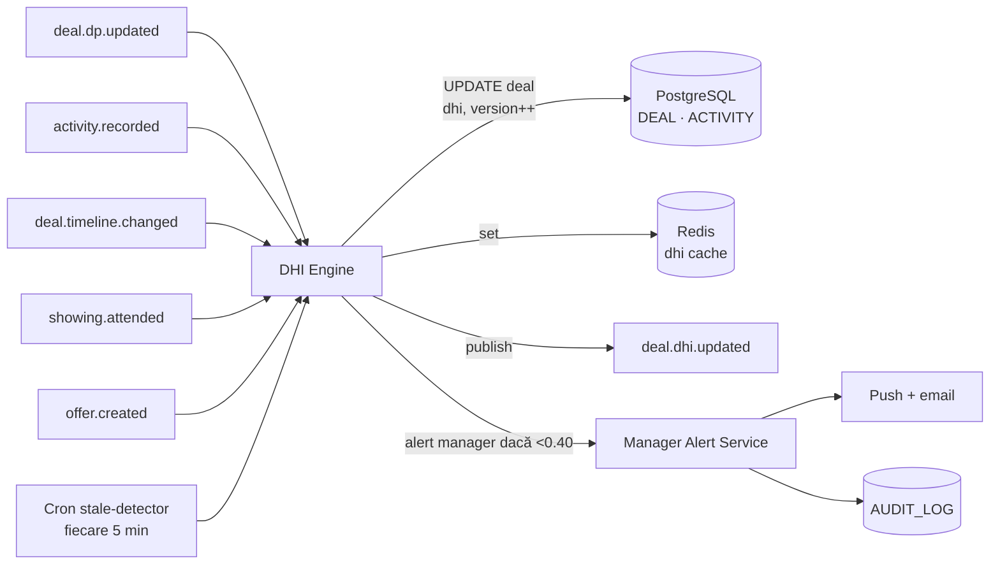

# TECH SPEC — REVYX DHI Engine
<!-- TECH_SPEC_REVYX_dhi-engine_v1.0.0.md · v1.0.0 · 2026-05 -->
<!-- CONFIDENȚIAL · Uz Intern · © 2026 REVYX · ITPRO SYSTEM SRL -->

## Changelog

| Versiune | Data | Autor | Note |
|---|---|---|---|
| 1.0.0 | 2026-05 | Senior PM + Solution Architect | Spec inițială DHI — formulă DP × (1−RF) × TF, TF_default=0.70 (BR-10), RF binar din ACTIVITY, alertă manager <0.40, recalc ≤10 min (NFR-03) · Phase 1 |

---

## Cuprins

1. [Executive Summary](#1-executive-summary)
2. [Architecture Overview](#2-architecture-overview)
3. [Stack & Dependencies](#3-stack--dependencies)
4. [Data Model](#4-data-model)
5. [API Contracts](#5-api-contracts)
6. [Algorithms](#6-algorithms)
7. [State Machines](#7-state-machines)
8. [Concurrency](#8-concurrency)
9. [Caching](#9-caching)
10. [Background Jobs](#10-background-jobs)
11. [Error Handling](#11-error-handling)
12. [Security](#12-security)
13. [Observability](#13-observability)
14. [Performance Budgets](#14-performance-budgets)
15. [Testing Strategy](#15-testing-strategy)
16. [Deployment](#16-deployment)
17. [Migration Strategy](#17-migration-strategy)
18. [Risks & Mitigations](#18-risks--mitigations)
19. [Impact Assessment](#19-impact-assessment)

---

## 1. Executive Summary

DHI (Deal Health Index) Engine monitorizează sănătatea deal-urilor active în Pilon 06 (Deal Intelligence). Calculează `DHI = DP × (1 − RF) × TF` (BRD §7.8) cu RF binar detectat automat din ACTIVITY și TF default 0.70 când `expected_close_date = NULL` (BR-10).

| Atribut | Valoare |
|---|---|
| **Scope** | Calcul DHI · detecție RF binar · TF auto · alerting manager · review queue |
| **Referință BRD** | §5 Pilon 06 · §6.1 BR-10 · §7.8 · §6.2 NFR-03 (recalc ≤10 min) · §12 AC-DHI-01..04 · T03 (TF=0 → DHI=0) |
| **Phase** | 1 (Core engines) |
| **Owner tehnic** | Solution Architect + Senior PM |
| **Dependențe upstream** | match-engine v1.0.0 (DP) · activity recorder · showing v1.0.0 |
| **Dependențe downstream** | Pipeline Board UI · Manager Alert Service · NBA Engine (DHI nu intră în NBA, dar low DHI poate genera task) |

**Garanții oferite:**

1. DHI ∈ [0, 1] cu clamp explicit la output.
2. `TF_default = 0.70` când `expected_close_date IS NULL` (BR-10, AC-DHI-03).
3. Recalc DHI în **≤ 10 minute** după orice modificare DEAL/ACTIVITY (NFR-03, AC-DHI-04).
4. Deal fără activitate 5 zile → DHI recalc cu RF comunicare = 0.3 + alertă manager (AC-DHI-01).
5. DHI < 0.40 → marcaj roșu Pipeline Board + secțiunea „Deal-uri în Risc" (AC-DHI-02).
6. T03: TF = 0 (deal la scadență) → DHI = 0 → alertă critică < 5 min.
7. RF detectat binar din ACTIVITY — niciun input manual scor (RF e derivat).

---

## 2. Architecture Overview



### 2.1 Data flow

1. Trigger event: `deal.dp.updated`, `activity.recorded`, `deal.timeline.changed`, `showing.attended`, `offer.created`, sau cron `dhi.stale.scan` (5 min).
2. Engine calculează RF binar prin `RiskDetector` (4 categorii — vezi §6.2).
3. TF derivat din `expected_close_date` cu fallback 0.70 (BR-10).
4. UPDATE `deal.dhi` cu optimistic locking + AUDIT.
5. Dacă `dhi < 0.40` → emit `deal.dhi.alert` → Manager Alert Service (push + email digest).
6. Cron `dhi.stale.scan` fiecare 5 min: filtrează deals fără ACTIVITY de 5 zile → forțează recalc cu RF comunicare = 0.3.

### 2.2 Componente principale

| Componentă | Responsabilitate |
|---|---|
| `DHIEngine` | Orchestrare calc · DP fetch · RF detect · TF derive · UPDATE atomic |
| `RiskDetector` | RF binar din ACTIVITY/DEAL signals (4 categorii) |
| `TimeFactorResolver` | TF din `expected_close_date` cu fallback 0.70 |
| `StaleDealScanner` | Cron 5min · deals fără ACTIVITY 5 zile → recalc forțat |
| `ManagerAlertService` | Aggregator alert <0.40 · digest email + push |

---

## 3. Stack & Dependencies

| Layer | Tehnologie | Versiune | Justificare |
|---|---|---|---|
| Backend | Node.js + TypeScript | 20 LTS · TS 5.x | Stack standard REVYX |
| ORM | Kysely | latest | Type-safe SQL |
| DB | PostgreSQL | 16.x | TIMESTAMPTZ · CHECK constraints · partial indexes |
| Cache | Redis | 7.x | Cache DHI per deal · alert dedup |
| Queue | BullMQ | latest | Cron 5min + alert dispatch |
| Audit | `auditLogger` | 1.0.0 | Toate UPDATE-urile DHI |

---

## 4. Data Model

### 4.1 ALTER `deal` (Phase 1 — DHI fields)

```sql
-- Migrare: 0100_deal_dhi.sql
ALTER TABLE deal
  ADD COLUMN IF NOT EXISTS dhi                     NUMERIC(4,3) NOT NULL DEFAULT 0 CHECK (dhi BETWEEN 0 AND 1),
  ADD COLUMN IF NOT EXISTS dhi_components          JSONB        NULL,    -- { dp, rf, rf_categories, tf, tf_source }
  ADD COLUMN IF NOT EXISTS dhi_calculated_at       TIMESTAMPTZ  NOT NULL DEFAULT NOW(),
  ADD COLUMN IF NOT EXISTS dhi_alert_state         TEXT         NOT NULL DEFAULT 'NONE'
    CHECK (dhi_alert_state IN ('NONE','WARNING','CRITICAL','ACKNOWLEDGED')),
  ADD COLUMN IF NOT EXISTS dhi_alert_acknowledged_at TIMESTAMPTZ NULL,
  ADD COLUMN IF NOT EXISTS dhi_alert_acknowledged_by UUID         NULL,
  ADD COLUMN IF NOT EXISTS expected_close_date     DATE         NULL,    -- shared cu NBA Engine (vezi 0091)
  ADD COLUMN IF NOT EXISTS last_activity_at        TIMESTAMPTZ  NULL,    -- denormalizat pentru stale scan
  ADD COLUMN IF NOT EXISTS version                 BIGINT       NOT NULL DEFAULT 1;

CREATE INDEX IF NOT EXISTS idx_deal_dhi_low
  ON deal (tenant_id, dhi)
  WHERE dhi < 0.40 AND status NOT IN ('WON','LOST','CANCELLED');
CREATE INDEX IF NOT EXISTS idx_deal_stale_scan
  ON deal (last_activity_at)
  WHERE status NOT IN ('WON','LOST','CANCELLED');
CREATE INDEX IF NOT EXISTS idx_deal_close_date
  ON deal (expected_close_date)
  WHERE expected_close_date IS NOT NULL AND status NOT IN ('WON','LOST','CANCELLED');
```

### 4.2 Tabel `dhi_alert` (audit traffic alerts)

```sql
-- Migrare: 0101_dhi_alert.sql
CREATE TABLE IF NOT EXISTS dhi_alert (
  alert_id           UUID         PRIMARY KEY DEFAULT gen_random_uuid(),
  tenant_id          UUID         NOT NULL,
  deal_id            UUID         NOT NULL REFERENCES deal(deal_id),
  level              TEXT         NOT NULL CHECK (level IN ('WARNING','CRITICAL')),
  dhi_value          NUMERIC(4,3) NOT NULL,
  rf_categories      TEXT[]       NOT NULL,           -- {'communication','financing'}
  tf_value           NUMERIC(4,3) NOT NULL,
  triggered_at       TIMESTAMPTZ  NOT NULL DEFAULT NOW(),
  acknowledged_at    TIMESTAMPTZ  NULL,
  acknowledged_by    UUID         NULL,
  resolution_notes   TEXT         NULL
);

CREATE INDEX IF NOT EXISTS idx_dhi_alert_open
  ON dhi_alert (tenant_id, triggered_at DESC)
  WHERE acknowledged_at IS NULL;
```

### 4.3 Constraints & invariants

| Invariant | Enforcement |
|---|---|
| `dhi ∈ [0, 1]` | CHECK + clamp app-side |
| `tf ∈ [0, 1]` | App clamp |
| `rf ∈ [0, 1]` | App clamp (max 1.0 chiar dacă suma categorii depășește) |
| `last_activity_at` denormalizat | Trigger AFTER INSERT pe ACTIVITY |
| `version` strict crescător | Optimistic locking |

### 4.4 Trigger `last_activity_at` denorm

```sql
CREATE OR REPLACE FUNCTION activity_update_deal_last_activity() RETURNS TRIGGER AS $$
BEGIN
  IF NEW.entity_type = 'deal' THEN
    UPDATE deal SET last_activity_at = NEW.occurred_at
      WHERE deal_id = NEW.entity_id AND (last_activity_at IS NULL OR last_activity_at < NEW.occurred_at);
  ELSIF NEW.entity_type = 'lead' THEN
    UPDATE deal SET last_activity_at = NEW.occurred_at
      WHERE lead_id = NEW.entity_id AND (last_activity_at IS NULL OR last_activity_at < NEW.occurred_at);
  END IF;
  RETURN NEW;
END;
$$ LANGUAGE plpgsql;

CREATE TRIGGER trg_activity_update_deal_last
  AFTER INSERT ON activity
  FOR EACH ROW EXECUTE FUNCTION activity_update_deal_last_activity();
```

---

## 5. API Contracts

### 5.1 Internal services

```typescript
interface DHIEngine {
  recalcForDeal(dealId: string, opts?: { reason?: string }): Promise<DHIResult>;
  getBreakdown(dealId: string): Promise<DHIBreakdown>;
}

interface RiskDetector {
  detect(deal: Deal, activityWindow: ActivityWindow): RFAssessment;
}

interface ManagerAlertService {
  fanOutCriticalAlerts(): Promise<{ dispatched: number }>;
  acknowledge(alertId: string, manager: User, notes?: string): Promise<void>;
}
```

### 5.2 REST endpoints

| Method | Path | RBAC | Descriere |
|---|---|---|---|
| `GET` | `/api/v1/deals/:id/dhi` | agent (own) / team_lead+ | Snapshot DHI + breakdown |
| `POST` | `/api/v1/deals/:id/recalc-dhi` | manager+ | Forțează recalc (debug) |
| `GET` | `/api/v1/deals?dhi_lt=0.40` | manager+ | Pipeline „deals în risc" |
| `GET` | `/api/v1/dhi-alerts?open=true` | manager+ | Alerte deschise agency-wide |
| `POST` | `/api/v1/dhi-alerts/:id/acknowledge` | manager+ | Acknowledge cu notes |

---

## 6. Algorithms

### 6.1 DHI formula (BRD §7.8)

```typescript
// DHI = DP × (1 − RF) × TF
function calculateDHI(input: DHIInputs): DHIResult {
  const dp = clamp01(input.dp);
  const rf = clamp01(input.rf);
  const tf = clamp01(input.tf);
  const dhi = clamp01(dp * (1 - rf) * tf);
  return {
    dhi,
    components: { dp, rf, tf, rf_categories: input.rfCategories, tf_source: input.tfSource },
  };
}
```

### 6.2 RF binar din ACTIVITY (BRD §7.8)

Categorii RF (BRD):

| Categorie | Magnitudine | Trigger binar |
|---|---|---|
| **Finanțare problematică** | 0.4 | ACTIVITY `note_added` cu `metadata.flag='financing_issue'` SAU lead.budget_validated=false după >14 zile QUALIFIED |
| **Comunicare ruptă** | 0.3 | Fără `message_sent`/`message_received`/`call` în ultimele 5 zile (AC-DHI-01) |
| **Concurență** | 0.2 | ACTIVITY cu `metadata.competitor_seen=true` SAU note text trigger keyword |
| **Timeline alunecat** | 0.1 | `expected_close_date < NOW()` SAU showing CANCELLED >2× pe DEAL |

```typescript
function detectRiskFactor(deal: Deal, act: ActivityWindow, now: Date): RFAssessment {
  const categories: string[] = [];
  let rf = 0;

  // 1. Finanțare problematică
  const financingIssue = act.notes.some(n => n.metadata?.flag === 'financing_issue')
    || (deal.lead.status === 'QUALIFIED' && !deal.lead.budget_validated && daysSince(deal.lead.qualified_at, now, TZ) > 14);
  if (financingIssue) { rf += 0.4; categories.push('financing'); }

  // 2. Comunicare ruptă (5 zile fără message/call)
  const lastComm = act.lastCommunicationAt; // max(message_sent, message_received, call)
  if (!lastComm || daysSince(lastComm, now, TZ) >= 5) {
    rf += 0.3; categories.push('communication');
  }

  // 3. Concurență
  if (act.competitorSignals.length > 0) { rf += 0.2; categories.push('competition'); }

  // 4. Timeline alunecat
  const expectedPast = deal.expected_close_date && new Date(deal.expected_close_date) < now;
  const showingCancelMulti = act.showingsCancelled >= 2;
  if (expectedPast || showingCancelMulti) { rf += 0.1; categories.push('timeline_slip'); }

  return { rf: Math.min(1, rf), categories };
}
```

> RF e binar **per categorie** (categoria contribuie sau nu) — nu se interpolează gradual. Suma cap la 1.0 (toate 4 active = 1.0 → DHI = 0).

### 6.3 TF (Time Factor) cu BR-10 default

```typescript
function resolveTimeFactor(deal: Deal, now: Date): { tf: number; source: 'expected_close_date'|'default_br10'|'expired' } {
  if (!deal.expected_close_date) {
    // BR-10: TF_default = 0.70 când expected_close_date IS NULL (AC-DHI-03)
    return { tf: 0.70, source: 'default_br10' };
  }

  const today = startOfDay(now, TZ);
  const target = startOfDay(new Date(deal.expected_close_date), TZ);
  const daysToClose = Math.round((target.getTime() - today.getTime()) / (24*60*60_000));

  if (daysToClose < 0)  return { tf: 0,    source: 'expired' };       // T03: la/peste scadență → TF=0 → DHI=0
  if (daysToClose === 0) return { tf: 0,   source: 'expired' };
  if (daysToClose <= 7)  return { tf: 0.30, source: 'expected_close_date' };
  if (daysToClose <= 14) return { tf: 0.55, source: 'expected_close_date' };
  if (daysToClose <= 30) return { tf: 0.75, source: 'expected_close_date' };
  if (daysToClose <= 60) return { tf: 0.90, source: 'expected_close_date' };
  return { tf: 1.0, source: 'expected_close_date' };
}
```

> Curba TF e tunable per tenant în `scoring_config` (admin only). Default-ul de mai sus e seed-ul inițial. BR-10 (`TF_default=0.70`) este **inflexibil**.

### 6.4 Recalc orchestration

```typescript
async function recalcForDeal(dealId: string, opts?: { reason?: string }): Promise<DHIResult> {
  return db.transaction(async (tx) => {
    const deal = await tx.selectFrom('deal').where('deal_id','=',dealId).forUpdate().executeTakeFirstOrThrow();
    if (['WON','LOST','CANCELLED'].includes(deal.status)) return existingSnapshot(deal);

    const dp = await matchEngine.getDP(dealId);                    // din Match Engine spec
    const acts = await loadActivityWindow(tx, dealId);             // ferestre 7d/14d/30d
    const { rf, categories } = detectRiskFactor(deal, acts, new Date());
    const { tf, source: tfSource } = resolveTimeFactor(deal, new Date());

    const result = calculateDHI({ dp, rf, tf, rfCategories: categories, tfSource });

    if (Math.abs(result.dhi - Number(deal.dhi)) < 1e-4) return result;

    const newAlertState = result.dhi < 0.40 ? 'CRITICAL'
                        : result.dhi < 0.70 ? 'WARNING'
                        : 'NONE';

    await tx.updateTable('deal').set({
      dhi: result.dhi,
      dhi_components: result.components,
      dhi_calculated_at: new Date(),
      dhi_alert_state: newAlertState === 'NONE' ? 'NONE' : (deal.dhi_alert_state === 'ACKNOWLEDGED' ? 'ACKNOWLEDGED' : newAlertState),
      version: deal.version + 1n,
    }).where('deal_id','=',dealId).where('version','=',deal.version).execute();

    // Spawn dhi_alert dacă tranziție la CRITICAL (cu suprimare dacă există deja open)
    if (newAlertState === 'CRITICAL' && deal.dhi_alert_state !== 'CRITICAL' && deal.dhi_alert_state !== 'ACKNOWLEDGED') {
      await tx.insertInto('dhi_alert').values({
        tenant_id: deal.tenant_id,
        deal_id: dealId,
        level: 'CRITICAL',
        dhi_value: result.dhi,
        rf_categories: categories,
        tf_value: tf,
      }).execute();
      await events.publish('deal.dhi.alert', { dealId, level: 'CRITICAL', dhi: result.dhi });
    }

    await auditLogger.record({
      tenantId: deal.tenant_id,
      actorType: 'SYSTEM',
      eventType: 'DEAL_DHI_RECALCULATED',
      entityType: 'DEAL',
      entityId: dealId,
      oldValue: { dhi: deal.dhi, dhi_alert_state: deal.dhi_alert_state },
      newValue: { dhi: result.dhi, dhi_alert_state: newAlertState },
      metadata: { reason: opts?.reason, rf_categories: categories, tf_source: tfSource },
    }, tx);

    await invalidateCache(`deal:${dealId}:dhi`);
    return result;
  });
}
```

### 6.5 Stale deal scanner (AC-DHI-01)

```typescript
// Cron: */5 * * * * — recalc toate deals fără activitate 5 zile (forțează RF comunicare)
async function scan() {
  const stale = await db.selectFrom('deal')
    .where('status','not in',['WON','LOST','CANCELLED'])
    .where(eb => eb.or([
      eb('last_activity_at','<', sql`NOW() - INTERVAL '5 days'`),
      eb('last_activity_at','is',null),
    ]))
    .select(['deal_id']).limit(500).execute();

  for (const d of stale) {
    await recalcForDeal(d.deal_id, { reason: 'stale_5d_scan' });
  }
}
```

### 6.6 Manager alert fan-out

```typescript
// Cron: */2 * * * * (la 2 min) — agregat pentru a evita spam
async function fanOutCriticalAlerts() {
  const open = await db.selectFrom('dhi_alert')
    .where('acknowledged_at','is',null)
    .where('triggered_at','>=', sql`NOW() - INTERVAL '15 minutes'`)
    .selectAll().execute();

  // Group per agency manager + dispatch digest
  const byManager = groupByManager(open);
  for (const [managerId, alerts] of byManager.entries()) {
    await pushNotifier.send(managerId, {
      title: `${alerts.length} deal(uri) în risc`,
      deepLink: '/dashboard/at-risk',
    });
    if (alerts.length >= 5) await emailSender.send('dhi_critical_digest', managerId, { alerts });
  }
}
```

---

## 7. State Machines

### 7.1 DHI alert state

```
NONE     ──(dhi < 0.70)──> WARNING
NONE     ──(dhi < 0.40)──> CRITICAL
WARNING  ──(dhi < 0.40)──> CRITICAL
WARNING  ──(dhi >= 0.70)──> NONE
CRITICAL ──(manager ack)──> ACKNOWLEDGED
ACKNOWLEDGED ──(dhi >= 0.70 sustain 24h)──> NONE
ACKNOWLEDGED ──(dhi din nou < 0.40 după >7zile)──> CRITICAL (nou alert)
```

---

## 8. Concurrency

- **Optimistic locking** pe `deal` cu `version` field. Conflict → re-fetch + retry max 3× (50/100/200 ms).
- Trigger `last_activity_at` denormalizat → rulează în context tranzacție ACTIVITY (atomicitate cu INSERT activity).
- Lock advisory `pg_advisory_xact_lock(hashtext('deal:'||deal_id))` pe `recalcForDeal` previne thrash pe deal "fierbinte".
- DHI alert dedup: `WHERE deal_id AND acknowledged_at IS NULL` previne dublu-alert pe re-trigger CRITICAL.

---

## 9. Caching

| Key Redis | Conținut | TTL | Invalidare |
|---|---|---|---|
| `deal:{id}:dhi` | snapshot {dhi, components, version} | 5 min | event `deal.dhi.updated` · ACTIVITY pe deal/lead |
| `tenant:{tid}:at_risk_deals` | listă deal_id sortată asc DHI | 60 sec | event `deal.dhi.alert` · acknowledge |
| `dhi_alert:open:{tenantId}` | counter alerte deschise | 30 sec | INSERT/ACK alert |

---

## 10. Background Jobs

| Job | Tip | Idempotent | Retry |
|---|---|---|---|
| `dhi.stale.scan` | cron `*/5 * * * *` | DA (filter status+last_activity) | 3× backoff 30s |
| `dhi.recalc.fallback` | cron `0 */1 * * *` (orar) | DA | 3× backoff |
| `dhi.alerts.fanout` | cron `*/2 * * * *` | DA (filter unacked) | 2× backoff |
| `dhi.acknowledged_clear` | cron `0 4 * * *` (zilnic 04:00) | DA — auto-clear ACKNOWLEDGED dacă DHI sustain ≥0.70 24h | 5× |

---

## 11. Error Handling

| Cod | Caz | Răspuns |
|---|---|---|
| `DEAL_VERSION_CONFLICT` | optimistic lock | retry 3× |
| `DHI_OUT_OF_RANGE` | bug calc → >1 sau <0 | hard-fail + alert + clamp |
| `RF_INVALID` | RF >1 după sumă | clamp 1.0 + log warning |
| `DEAL_TERMINAL_RECALC` | recalc pe WON/LOST/CANCELLED | 200 + skip (idempotent) |
| `ALERT_ACK_INVALID` | ack pe alert deja acknowledged | 409 |

---

## 12. Security

- **JWT RS256** moștenit Phase 0.
- **RBAC:**
  - `agent` — read DHI doar pe deal-urile proprii
  - `senior_agent` — + view team-level
  - `team_lead` — view echipă DHI list
  - `manager` — ack alerts agency-wide · forțare recalc
  - `admin` — config TF curve · RF magnitudini
- **AUDIT_LOG events:**
  - `DEAL_DHI_RECALCULATED` · `DEAL_DHI_ALERT_TRIGGERED` · `DEAL_DHI_ALERT_ACKNOWLEDGED`
  - `DEAL_TF_CONFIG_CHANGED` (admin)
- **Rate limiting** moștenit.
- Niciun PII în DHI components — doar metric date.

---

## 13. Observability

| Metric | Tip | Alert |
|---|---|---|
| `dhi_recalc_duration_ms` (p95) | histogram | p95 > 60s — reduce eficiență NFR-03 |
| `dhi_recalc_lag_seconds` (event → recalc) | histogram | p95 > 600s (10 min) — VIOLATES NFR-03 |
| `dhi_distribution` (bucket 0.0/0.1/.../1.0) | histogram | shift left → review pipeline |
| `dhi_alerts_open_total` | gauge | >100 → review threshold |
| `dhi_alert_dispatch_latency_ms` | histogram | p95 > 5min — UX |
| `stale_deals_scanned_per_min` | gauge | drop bruscă → cron broken |
| `rf_categories_distribution{cat}` | counter | trend financing/communication |

Dashboard: `REVYX / DHI Health`.

---

## 14. Performance Budgets

| Metric | Target | Sursă |
|---|---|---|
| Recalc DHI per deal | p95 ≤ 500 ms | UX |
| Event → recalc end-to-end | p95 ≤ 10 min | NFR-03 / AC-DHI-04 |
| Stale scan ciclu | < 30 sec pentru 500 deals | Capacity |
| Alert dispatch (CRITICAL) | < 5 min de la trigger | T03 derivat |
| GET /deals/:id/dhi | p95 < 200 ms | UX |

---

## 15. Testing Strategy

### 15.1 Unit
- `calculateDHI` — clamp [0,1], DHI=0 când TF=0 (T03)
- `resolveTimeFactor` — BR-10 (default 0.70 când expected_close_date NULL — AC-DHI-03)
- `resolveTimeFactor` — expected_close_date trecut → TF=0 → DHI=0 (T03)
- `detectRiskFactor` — toate 4 categorii izolat + combinații (0.4+0.3+0.2+0.1=1.0 → RF=1)
- Comunicare ruptă: 5 zile pragul (4d59h → false; 5d0h → true) AC-DHI-01

### 15.2 Integration
- INSERT ACTIVITY pe deal → trigger `last_activity_at` actualizat → DHI recalc en cascade
- Stale deals 5 zile → cron scan → RF=0.3 comunicare aplicat
- DHI tranziție 0.45 → 0.35 → INSERT dhi_alert CRITICAL
- Manager acknowledge → state ACKNOWLEDGED
- DHI tranziție 0.35 → 0.75 sustain 24h → state NONE

### 15.3 E2E
- AC-DHI-01: deal fără activitate 5 zile → alert manager + dhi_alert CRITICAL
- AC-DHI-02: dhi < 0.40 → vizibil în UI Pipeline „deals în risc"
- AC-DHI-03: expected_close_date NULL → TF=0.70 + warning vizibil în Deal Detail
- AC-DHI-04: modificare deal → DHI updatat în <10 min
- T03: TF=0 (deal scadent azi) → DHI=0 → alert <5 min

### 15.4 Load
- 5.000 deals active · stale scan ciclu < 30s
- 500 ACTIVITY/min cu cascade recalc · p95 lag <10 min
- 100 alerts CRITICAL concurrente · fan-out manager < 2 min

### 15.5 Chaos
- Redis down → fallback DB · degradare grațioasă (>500ms latency)
- Cron stale scan ratează 1 ciclu → următorul rulează catchup (idempotent)
- Match Engine DP indisponibil → DHI nu actualizează · log warning · circuit breaker

### 15.6 Coverage target

| Layer | Coverage |
|---|---|
| `calculateDHI` + helpers | ≥ 99% |
| `RiskDetector` | ≥ 95% |
| `TimeFactorResolver` | ≥ 100% (BR-10 + T03) |
| API + alert state machine | ≥ 90% |

---

## 16. Deployment

| Aspect | Detaliu |
|---|---|
| Feature flag | `flag.dhi_v1.enabled` (prerequisite `match_engine_v1.enabled`) |
| Rollout | canary 10% → 50% → 100% în 2 săptămâni |
| Rollback | flag OFF · DHI fields rămân (read-only) · DOWN migration `0100_down.sql` |
| Owner rollout | Senior PM + Solution Architect |

---

## 17. Migration Strategy

```
0100_deal_dhi.sql                -- ALTER deal: dhi, dhi_components, dhi_alert_state, last_activity_at, version
0101_dhi_alert.sql               -- CREATE TABLE dhi_alert
0102_activity_last_trigger.sql   -- Trigger denormalizare last_activity_at
```

Idempotente. Backwards compat: deals existente primesc `dhi=0`, `dhi_alert_state='NONE'`, `version=1`. La prima recalc → snapshot real.

---

## 18. Risks & Mitigations

| # | Risc | Probab. | Impact | Mitigare |
|---|---|---|---|---|
| R1 | NFR-03 încălcat (recalc lag >10 min) | MED | HIGH | Event-driven primary + cron fallback orar + observability `dhi_recalc_lag` |
| R2 | RF false-positive comunicare (weekend) | MED | MED | Threshold 5 zile lucratoare opțional (config) — default zile calendar |
| R3 | Alert spam (deal oscilează 0.39 ↔ 0.41) | MED | MED | Hysteresis: trigger CRITICAL la <0.40, recovery doar la >=0.50 (sustain 1h) |
| R4 | Manager acknowledge stale (deal recidiv) | LOW | MED | Re-alert la nou drop după >7 zile ack |
| R5 | TF curve neadecvat per tenant | LOW | LOW | Tunable în `scoring_config` (admin) |
| R6 | Trigger `last_activity_at` overhead pe ACTIVITY heavy | MED | MED | Index parțial · async listener fallback dacă latency >100ms |
| R7 | Match Engine DP indisponibil | LOW | HIGH | Circuit breaker · skip recalc cu log + retry exp |
| R8 | Cron BullMQ timezone mismatch | LOW | LOW | Forțat `tz: 'Europe/Chisinau'` în repeat config |

---

## 19. Impact Assessment

### 19.1 Scope of Change

| Element | Detaliu |
|---|---|
| Document | TECH_SPEC_REVYX_dhi-engine_v1.0.0.md |
| Tip schimbare | NEW |
| Aria afectată | Phase 1 · Pilon 06 (Deal Intelligence) · entitate DEAL · scoring DHI · BR-10 · NFR-03 |
| Origine | BRD §5 Pilon 06 · §6.1 BR-10 · §7.8 · §6.2 NFR-03 · §12 AC-DHI-01..04 + T03 |

### 19.2 Impact pe documente conexe

| Document | Tip impact | Acțiune |
|---|---|---|
| BRD_REVYX_v1.0.0.md | None | Implementare formulă §7.8 |
| TECH_SPEC_REVYX_match-engine (S4) | None | Consumă DP read-only |
| TECH_SPEC_REVYX_nba-engine_v1.0.0.md | None | Independent (NBA și DHI ambele citesc DP) |
| TECH_SPEC_REVYX_audit-log_v1.0.0.md | Minor | Catalog event extins (`DEAL_DHI_*`) |
| TECH_SPEC_REVYX_lead-scoring_v1.0.0.md | None | DHI nu modifică LS |
| WORKFLOW_REVYX_deal-closure (S4) | Minor | Closure cancelable doar dacă DHI ≥ threshold |
| WORKFLOW_REVYX_escalation (S4) | None | DHI alerts nu trec prin escalation lead |

### 19.3 Impact pe scoring

| Scor | Afectat? | Detaliu |
|---|---|---|
| LS, IS, TS, PS, APS | NU | — |
| DP | NU (consum) | Input |
| NBA | NU | Independent |
| **DHI** | DA | Implementare directă §7.8 + BR-10 (TF_default=0.70) |

### 19.4 Impact pe entități / schema BD

| Entitate | Modificare | Migrare |
|---|---|---|
| DEAL | ALTER (+8 câmpuri DHI + version) | 0100_deal_dhi.sql |
| DHI_ALERT | NEW | 0101_dhi_alert.sql |
| ACTIVITY trigger | NEW | 0102_activity_last_trigger.sql |

### 19.5 Impact pe RBAC

| Rol | Permisiuni |
|---|---|
| agent | Read DHI deal-uri proprii |
| team_lead | View team DHI |
| manager | Ack alerts · forțare recalc · view at-risk |
| admin | Config TF curve · RF magnitudini |

### 19.6 Impact pe SLA & NFR

| NFR / SLA | Înainte | După | Validare |
|---|---|---|---|
| NFR-03 (recalc DHI) | 10 min | ≤ 10 min validat | E2E AC-DHI-04 |
| AC-DHI-01 (alert 5 zile) | nedefinit | enforced | E2E |
| Alert dispatch | nedefinit | < 5 min | T03 derivat |

### 19.7 Impact pe Securitate & GDPR

| Aspect | Status | Notă |
|---|---|---|
| PII | NU | DHI components fără PII |
| AUDIT_LOG events noi | DA | `DEAL_DHI_*` (vezi §12) |
| Consent flow | NU | — |
| HMAC / JWT / RBAC | DA | RBAC §12 |
| Rate limiting | NU | Moștenit |

### 19.8 Risks & Mitigations

Vezi §18.

### 19.9 Test Plan

Vezi §15. Edge cases obligatorii: AC-DHI-01..04, T03, BR-10.

### 19.10 Rollout & Rollback

| Aspect | Detaliu |
|---|---|
| Feature flag | `flag.dhi_v1.enabled` |
| Strategie rollout | canary 10% → 50% → 100% în 2 săptămâni |
| Rollback | flag OFF + DOWN migration |
| Owner rollout | Senior PM + Solution Architect |

### 19.11 Approval Gate

| Aprobator | Necesar pentru |
|---|---|
| Senior PM | Formulă DHI · BR-10 default 0.70 · alert thresholds |
| Solution Architect | Schema BD · trigger denorm · BullMQ tz Chișinău |
| Security Lead | RBAC · AUDIT events |
| Legal / DPO | None — fără PII |

---

*docs/tech-spec/TECH_SPEC_REVYX_dhi-engine_v1.0.0.md · v1.0.0 · 2026-05 · CONFIDENȚIAL · Uz Intern*
*REVYX — Real Estate Execution Intelligence · © 2026 REVYX · ITPRO SYSTEM SRL*
