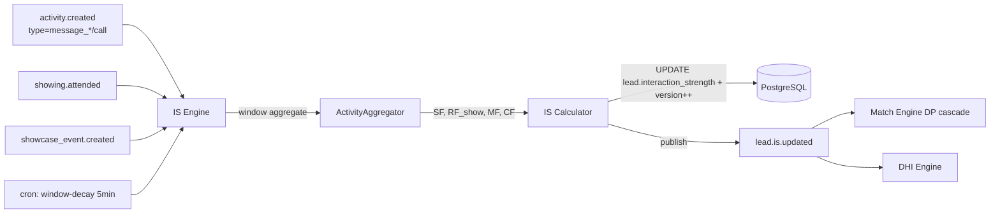

# TECH SPEC — REVYX Interaction Strength Engine
<!-- TECH_SPEC_REVYX_interaction-strength_v1.0.0.md · v1.0.0 · 2026-05 -->
<!-- CONFIDENȚIAL · Uz Intern · © 2026 REVYX · ITPRO SYSTEM SRL -->

## Changelog

| Versiune | Data | Autor | Note |
|---|---|---|---|
| 1.0.0 | 2026-05 | Senior PM + Solution Architect | ★ Spec inițială IS Engine — Phase 2 dedicată: IS calculat full din ACTIVITY (nu doar SF din SHOWING). RF_show real din SHOWCASE_EVENT (return visits 14d). MF/CF din ACTIVITY message_sent/received și call cu canal context. Ferestre tunable per tenant. Înlocuiește implementarea preliminară din lead-scoring v1.0.0 §6.2. |

---

## Cuprins

1. [Executive Summary](#1-executive-summary)
2. [Architecture Overview](#2-architecture-overview)
3. [Stack & Dependencies](#3-stack--dependencies)
4. [Data Model](#4-data-model)
5. [API Contracts](#5-api-contracts)
6. [Algorithms](#6-algorithms)
7. [State Machines](#7-state-machines)
8. [Concurrency](#8-concurrency)
9. [Caching](#9-caching)
10. [Background Jobs](#10-background-jobs)
11. [Error Handling](#11-error-handling)
12. [Security](#12-security)
13. [Observability](#13-observability)
14. [Performance Budgets](#14-performance-budgets)
15. [Testing Strategy](#15-testing-strategy)
16. [Deployment](#16-deployment)
17. [Migration Strategy](#17-migration-strategy)
18. [Risks & Mitigations](#18-risks--mitigations)
19. [Impact Assessment](#19-impact-assessment)

---

## 1. Executive Summary

★ **Interaction Strength (IS)** Engine este componenta dedicată Phase 2 care calculează `IS = 0.40·SF + 0.30·RF_show + 0.20·MF + 0.10·CF` (BRD §7.3) folosind **date reale din ACTIVITY și SHOWCASE_EVENT** în loc de heuristicile de start din `lead-scoring v1.0.0 §6.2`. Rezolvă următoarele lacune ale v1:

- **SF (Showing Frequency)**: era calculat din `act.showings7d` indirect — acum derivat din `SHOWING.attended=true` cu fereastră tunable.
- **RF_show (Return visits Showcase)**: era stub (`act.showcaseReturnVisits14d`) — acum citește direct din tabelul `showcase_event` (vezi spec showcase-links).
- **MF (Message Frequency)**: era contorizat plat — acum ponderat pe **canal** (whatsapp > email > sms) și **direcție** (received de la lead > sent de agent).
- **CF (Call Frequency)**: era contorizat plat — acum filtrat pe `duration_seconds ≥ 30` (filtrare apeluri ratate/eronate).
- **Normalizatori (3/5/10/5)**: din constanțe în config tunable per tenant + auto-tuning bazat pe distribuții observate.

| Atribut | Valoare |
|---|---|
| **Scope** | IS calc real din ACTIVITY + SHOWCASE_EVENT + SHOWING · normalizatori tunable per tenant · explainability detail · cascade DP |
| **Referință BRD** | §7.3 IS · §7.4 DP (consumer) · §8 ACTIVITY |
| **Phase** | 2 |
| **Owner tehnic** | Solution Architect + Data Science Lead |
| **Dependențe upstream** | lead-scoring v1.0.0 (lead.interaction_strength column) · showing v1.0.0 · showcase-links v1.0.0 (`showcase_event` table) · ACTIVITY |
| **Dependențe downstream** | Match Engine v1/v2 (DP via IS) · NBA · DHI |

**Garanții (în plus față de v1):**

1. IS ∈ [0,1] cu clamp explicit, formă identică cu BRD §7.3.
2. SF folosește SHOWING attended (nu intent), `RF_show` folosește SHOWCASE_EVENT distinct (`session_id` distinct/14 zile).
3. MF / CF excludă outliers: `duration_seconds < 30` (calls), `message_length < 5 chars` (messages auto-replies).
4. Recalc IS la fiecare INSERT ACTIVITY relevant + cron horar pentru window decay (ferestre rolling).
5. Normalizatori tunable per tenant via `scoring_config` (admin only) — vezi `lead-scoring v1.0.0 §13`.
6. Auto-tuning opțional: percentila 75 per tenant pe ultimele 60 zile devine normalizator (admin opt-in).

---

## 2. Architecture Overview



### 2.1 Data flow

1. La INSERT `activity` cu `activity_type ∈ {message_sent, message_received, call}`, se enqueue `is.recalc.lead`.
2. La `showing.attended=true` UPDATE event, se enqueue identic.
3. La `showcase_event` INSERT (vezi `showcase-links`), se enqueue identic.
4. **Window decay cron** (5 min): re-evaluare lead-uri cu `interaction_strength > 0` și last_activity_at vechi (decay natural).
5. IS recalc → UPDATE `lead.interaction_strength` cu optimistic locking + publish `lead.is.updated`.
6. Match Engine consumă pentru DP recalc (BRD §7.4 unchanged).

### 2.2 Componente

| Componentă | Responsabilitate |
|---|---|
| `ActivityAggregator` | Agregare conturi pe ferestre (`window_sf`, `window_rf`, `window_mf`, `window_cf`) cu filtre (canal, direcție, durată minimă) |
| `ISCalculator` | Aplică formula `0.40·SF + 0.30·RF_show + 0.20·MF + 0.10·CF` cu normalizatori per tenant |
| `NormalizerResolver` | Citește `scoring_config` per tenant SAU auto-calculate (P75 pe 60d) |
| `ISExplainer` | Detalii sub-componente pentru UI „de ce IS = X?" |
| `WindowDecayJob` | Recalc periodic pentru lead-uri inerți (windowed counts pot scădea) |

---

## 3. Stack & Dependencies

| Layer | Tehnologie | Versiune | Justificare |
|---|---|---|---|
| Backend | Node.js + TS | 20 LTS | Stack standard |
| DB | PostgreSQL | 16.x | Window aggregations · GENERATED columns opt |
| Cache | Redis | 7.x | IS snapshot per lead · normalizers cache |
| Queue | BullMQ | latest | Recalc events · debouncer |
| Audit | `auditLogger` | 1.0.0 | `LEAD_IS_RECALCULATED` cu delta |

---

## 4. Data Model

### 4.1 Tabel `is_window_config` (per tenant)

```sql
-- Migrare: 0170_is_window_config.sql
CREATE TABLE IF NOT EXISTS is_window_config (
  config_id            UUID         PRIMARY KEY DEFAULT gen_random_uuid(),
  tenant_id            UUID         NOT NULL UNIQUE,

  -- Ferestre rolling (zile)
  window_sf_days       INTEGER      NOT NULL DEFAULT 7,
  window_rf_days       INTEGER      NOT NULL DEFAULT 14,
  window_mf_days       INTEGER      NOT NULL DEFAULT 7,
  window_cf_days       INTEGER      NOT NULL DEFAULT 7,

  -- Normalizatori (denominators) — saturate la valoare → score 1.0
  normalizer_sf        NUMERIC(6,2) NOT NULL DEFAULT 3.00,    -- 3 showings în 7d → SF=1
  normalizer_rf        NUMERIC(6,2) NOT NULL DEFAULT 5.00,    -- 5 return visits în 14d → RF=1
  normalizer_mf        NUMERIC(6,2) NOT NULL DEFAULT 10.00,   -- 10 messages weighted în 7d → MF=1
  normalizer_cf        NUMERIC(6,2) NOT NULL DEFAULT 5.00,    -- 5 calls în 7d → CF=1

  -- Filters
  call_min_duration_sec INTEGER     NOT NULL DEFAULT 30,
  message_min_length    INTEGER     NOT NULL DEFAULT 5,

  -- Auto-tuning
  auto_tune_enabled    BOOLEAN      NOT NULL DEFAULT FALSE,
  auto_tune_window_days INTEGER     NOT NULL DEFAULT 60,
  auto_tune_percentile NUMERIC(3,2) NOT NULL DEFAULT 0.75,

  updated_at           TIMESTAMPTZ  NOT NULL DEFAULT NOW(),
  updated_by_user_id   UUID         NULL
);
```

### 4.2 Tabel `is_calculation_snapshot` (audit + explainability)

```sql
-- Migrare: 0171_is_calculation_snapshot.sql
CREATE TABLE IF NOT EXISTS is_calculation_snapshot (
  snapshot_id          UUID         PRIMARY KEY DEFAULT gen_random_uuid(),
  tenant_id            UUID         NOT NULL,
  lead_id              UUID         NOT NULL REFERENCES lead(lead_id),

  is_value             NUMERIC(4,3) NOT NULL CHECK (is_value BETWEEN 0 AND 1),
  sf                   NUMERIC(4,3) NOT NULL,
  rf_show              NUMERIC(4,3) NOT NULL,
  mf                   NUMERIC(4,3) NOT NULL,
  cf                   NUMERIC(4,3) NOT NULL,

  raw_counts           JSONB        NOT NULL,     -- { showings_attended_7d, returns_14d, msgs_weighted_7d, calls_qualified_7d, raw_msg_breakdown, raw_call_breakdown }
  normalizers_used     JSONB        NOT NULL,     -- snapshot config la momentul calc
  trigger              TEXT         NOT NULL CHECK (trigger IN ('activity_insert','showing_attended','showcase_event','cron_decay','manual')),

  calculated_at        TIMESTAMPTZ  NOT NULL DEFAULT NOW()
);

CREATE INDEX IF NOT EXISTS idx_is_snap_lead_time
  ON is_calculation_snapshot (tenant_id, lead_id, calculated_at DESC);
```

> Snapshot reține istoric (90 zile retention via cron `snapshot.gc`); util pentru debugging și explainability UI.

### 4.3 ALTER `lead`

```sql
-- Migrare: 0172_lead_is_meta.sql
ALTER TABLE lead
  ADD COLUMN IF NOT EXISTS is_calculated_at TIMESTAMPTZ NOT NULL DEFAULT NOW(),
  ADD COLUMN IF NOT EXISTS is_components    JSONB       NULL;     -- { SF, RF_show, MF, CF }
```

> `lead.interaction_strength` (NUMERIC(4,3)) deja există din lead-scoring v1.0.0 §4.1.

### 4.4 Constraints & invariants

| Invariant | Enforcement |
|---|---|
| `IS, SF, RF_show, MF, CF ∈ [0,1]` | CHECK + clamp |
| Snapshot append-only (delete doar via gc) | RLS / role permission |
| Config update → AUDIT_LOG | App middleware |

---

## 5. API Contracts

### 5.1 Internal services

```typescript
interface ISEngine {
  recalcForLead(leadId: string, trigger: ISTrigger, opts?: { force?: boolean }): Promise<ISSnapshot>;
  recalcBatch(leadIds: string[], trigger: ISTrigger): Promise<{ updated: number }>;
}

interface ActivityAggregator {
  aggregate(leadId: string, cfg: ISWindowConfig, now: Date): Promise<RawCounts>;
}

type ISSnapshot = {
  is: number;
  sf: number; rfShow: number; mf: number; cf: number;
  rawCounts: RawCounts;
  normalizers: NormalizersResolved;
  trigger: ISTrigger;
  calculatedAt: Date;
};
```

### 5.2 REST endpoints

| Method | Path | RBAC | Descriere |
|---|---|---|---|
| `GET` | `/api/v1/leads/:id/is` | agent (own) / team_lead+ | IS curent + breakdown |
| `GET` | `/api/v1/leads/:id/is/history?from=&to=` | agent (own) / team_lead+ | Snapshot-uri din `is_calculation_snapshot` |
| `POST` | `/api/v1/leads/:id/is/recalc` | manager+ | Forțare recalc (rate limited) |
| `GET` | `/api/v1/admin/is/config` | admin | Read config |
| `PUT` | `/api/v1/admin/is/config` | admin | Update normalizers / windows |

---

## 6. Algorithms

### 6.1 Aggregator queries (SQL canonice)

```sql
-- SF: showings cu attended=true în window_sf_days
SELECT COUNT(*) AS showings_attended
FROM showing
WHERE tenant_id = $1 AND lead_id = $2
  AND attended = TRUE
  AND scheduled_at >= NOW() - ($3 || ' days')::INTERVAL;

-- RF_show: distinct sessions în showcase_event în window_rf_days, exclud prima vizionare
SELECT COUNT(DISTINCT session_id) AS return_sessions
FROM showcase_event
WHERE tenant_id = $1 AND lead_id = $2
  AND event_type = 'view'
  AND occurred_at >= NOW() - ($3 || ' days')::INTERVAL
  AND session_id IS NOT NULL
  AND occurred_at > (
    SELECT MIN(occurred_at) FROM showcase_event
    WHERE tenant_id = $1 AND lead_id = $2 AND event_type = 'view'
  );

-- MF: messages weighted (canal + direcție) în window_mf_days
SELECT
  SUM(
    CASE
      WHEN activity_type = 'message_received' AND channel = 'whatsapp' THEN 1.5
      WHEN activity_type = 'message_received' AND channel = 'email'    THEN 1.0
      WHEN activity_type = 'message_received' AND channel = 'sms'      THEN 0.8
      WHEN activity_type = 'message_received' AND channel = 'platform' THEN 1.2
      WHEN activity_type = 'message_sent'     AND channel = 'whatsapp' THEN 0.6
      WHEN activity_type = 'message_sent'     AND channel = 'email'    THEN 0.4
      WHEN activity_type = 'message_sent'     AND channel = 'sms'      THEN 0.3
      WHEN activity_type = 'message_sent'     AND channel = 'platform' THEN 0.5
      ELSE 0.5
    END
  ) AS msgs_weighted
FROM activity
WHERE tenant_id = $1 AND entity_type = 'lead' AND entity_id = $2
  AND activity_type IN ('message_sent','message_received')
  AND timestamp >= NOW() - ($3 || ' days')::INTERVAL
  AND COALESCE(LENGTH(metadata->>'body'), 99) >= $4;     -- message_min_length

-- CF: calls qualified (duration ≥ threshold) în window_cf_days
SELECT COUNT(*) AS calls_qualified
FROM activity
WHERE tenant_id = $1 AND entity_type = 'lead' AND entity_id = $2
  AND activity_type = 'call'
  AND COALESCE(duration_seconds, 0) >= $3                -- call_min_duration_sec
  AND timestamp >= NOW() - ($4 || ' days')::INTERVAL;
```

### 6.2 IS calculator

```typescript
async function recalcForLead(leadId: string, trigger: ISTrigger): Promise<ISSnapshot> {
  return db.transaction(async (tx) => {
    const lead = await tx.selectFrom('lead').where('lead_id','=',leadId).forUpdate().executeTakeFirstOrThrow();
    const cfg = await loadConfig(lead.tenant_id);
    const counts = await aggregator.aggregate(leadId, cfg, new Date());

    const sf      = clamp01(counts.showingsAttended / cfg.normalizerSf);
    const rfShow  = clamp01(counts.returnSessions   / cfg.normalizerRf);
    const mf      = clamp01(counts.msgsWeighted     / cfg.normalizerMf);
    const cf      = clamp01(counts.callsQualified   / cfg.normalizerCf);

    const is = clamp01(0.40*sf + 0.30*rfShow + 0.20*mf + 0.10*cf);
    const newComponents = { SF: sf, RF_show: rfShow, MF: mf, CF: cf };

    const isMaterialDelta  = Math.abs(is - Number(lead.interaction_strength)) >= 1e-4;
    const compsChanged     = !sameComponents(lead.is_components, newComponents);

    // Snapshot scris întotdeauna (audit + explainability), chiar dacă IS nu s-a mișcat material.
    await tx.insertInto('is_calculation_snapshot').values({
      tenant_id: lead.tenant_id, lead_id: leadId,
      is_value: is, sf, rf_show: rfShow, mf, cf,
      raw_counts: counts as any, normalizers_used: cfg as any,
      trigger,
    }).execute();

    // UPDATE doar când e cazul (evită version bump inutil + cascade DP zgomotos).
    if (!isMaterialDelta && !compsChanged) {
      return { is, sf, rfShow, mf, cf, rawCounts: counts, normalizers: cfg, trigger, calculatedAt: new Date() };
    }

    await tx.updateTable('lead').set({
      interaction_strength: is,
      is_calculated_at: new Date(),
      is_components: newComponents,
      version: lead.version + 1n,
    }).where('lead_id','=',leadId).where('version','=',lead.version).execute();

    await auditLogger.record({
      tenantId: lead.tenant_id,
      eventType: 'LEAD_IS_RECALCULATED',
      entityType: 'LEAD', entityId: leadId,
      oldValue: { interaction_strength: lead.interaction_strength, is_components: lead.is_components },
      newValue: { interaction_strength: is, components: newComponents },
      metadata: { trigger, material_delta: isMaterialDelta },
    }, tx);

    await invalidateCache(`lead:${leadId}:is`);
    // DP cascade publish DOAR la material delta — components-only schimbare nu afectează DP.
    if (isMaterialDelta) {
      tx.afterCommit(() => events.publish('lead.is.updated', { leadId, is, components: newComponents }));
    }
    return { is, sf, rfShow, mf, cf, rawCounts: counts, normalizers: cfg, trigger, calculatedAt: new Date() };
  });
}

// Egalitate componente cu toleranță numerică
function sameComponents(prev: any, next: { SF: number; RF_show: number; MF: number; CF: number }): boolean {
  if (!prev) return false;
  return ['SF','RF_show','MF','CF'].every(k => Math.abs(Number(prev[k] ?? 0) - Number((next as any)[k])) < 1e-4);
}
```

### 6.3 Auto-tuning normalizers (opt-in)

```typescript
async function autoTuneNormalizers(tenantId: string) {
  const cfg = await loadConfig(tenantId);
  if (!cfg.autoTuneEnabled) return;

  // P75 pe 60 zile pentru fiecare componentă pe baza distribuției lead-urilor active
  const sample = await db.executeQuery<{
    showings_attended: number; return_sessions: number;
    msgs_weighted: number; calls_qualified: number;
  }>(`
    WITH active_leads AS (
      SELECT lead_id FROM lead
      WHERE tenant_id = $1 AND last_activity_at >= NOW() - INTERVAL '60 days'
    )
    SELECT
      percentile_cont($2) WITHIN GROUP (ORDER BY (rc->>'showingsAttended')::numeric)  AS showings_attended,
      percentile_cont($2) WITHIN GROUP (ORDER BY (rc->>'returnSessions')::numeric)    AS return_sessions,
      percentile_cont($2) WITHIN GROUP (ORDER BY (rc->>'msgsWeighted')::numeric)      AS msgs_weighted,
      percentile_cont($2) WITHIN GROUP (ORDER BY (rc->>'callsQualified')::numeric)    AS calls_qualified
    FROM (
      SELECT raw_counts AS rc FROM is_calculation_snapshot s
      JOIN active_leads al USING (lead_id)
      WHERE s.tenant_id = $1 AND s.calculated_at >= NOW() - INTERVAL '60 days'
    ) t
  `, [tenantId, cfg.autoTunePercentile]);

  // Aplică floor/ceiling: nu permite normalizatori absurzi
  const tuned = {
    normalizerSf: clamp(sample.showings_attended ?? cfg.normalizerSf, 1, 10),
    normalizerRf: clamp(sample.return_sessions   ?? cfg.normalizerRf, 1, 20),
    normalizerMf: clamp(sample.msgs_weighted     ?? cfg.normalizerMf, 3, 50),
    normalizerCf: clamp(sample.calls_qualified   ?? cfg.normalizerCf, 1, 15),
  };
  await persistConfig(tenantId, tuned, { autoTuned: true });
  await auditLogger.record({ tenantId, eventType: 'IS_NORMALIZERS_AUTO_TUNED', metadata: tuned, actorType: 'JOB' });
}
```

### 6.4 Window decay cron

```typescript
// cron: */5 * * * * — 5 min
async function decayJob() {
  // Lead-uri active care n-au avut recalc în ultimele 60 min
  const stale = await db.selectFrom('lead')
    .where('interaction_strength','>', 0)
    .where('is_calculated_at','<', new Date(Date.now() - 60*60*1000))
    .where('status','in',['NEW','ASSIGNED','CONTACTED','SHOWING','NEGOTIATION'])
    .select('lead_id').limit(500).execute();
  for (const l of stale) await queue.add('is.recalc.lead', { leadId: l.lead_id, trigger: 'cron_decay' }, {
    jobId: `is:${l.lead_id}:decay:${minuteSlot()}`,           // idempotency
  });
}
```

### 6.5 Debounce / coalesce

INSERT-urile rapide ACTIVITY (ex: 5 mesaje într-o secundă) ar declanșa 5 recalc. Coalesce via BullMQ `jobId = "is:${leadId}:${minute}"` → maxim 1 recalc/min/lead la flux normal · forțare bypass via `force=true`.

### 6.6 Exit criteria — backwards compat cu lead-scoring v1

- Funcția `calculateInteractionStrength` din lead-scoring v1.0.0 §6.2 este **deprecată** sub flag `flag.is_engine_v1.enabled = true`.
- Sub flag, lead-scoring `recalc` cheamă `ISEngine.recalcForLead(leadId)` în loc de calcul inline.
- `lead.interaction_strength` rămâne sursa unică (UPDATE de către IS Engine, nu mai de lead-scoring direct pentru IS).
- Migrare de date: backfill `is_components` la prima recalc.

---

## 7. State Machines

IS nu are state machine propriu (este o valoare scalară per lead). State machine-ul lead-ului rămâne în lead-scoring v1.

---

## 8. Concurrency

- Optimistic locking pe `lead.version` (moștenit din lead-scoring).
- Coalesce job pe `jobId` minute-bucketed previne thrashing.
- Snapshot INSERT este append-only — nu există race.
- Cross-service hardening (Redlock pe `is:lead:{id}`) — opțional, vezi `concurrency-hardening v1.0.0`.

---

## 9. Caching

| Key Redis | Conținut | TTL | Invalidare |
|---|---|---|---|
| `lead:{id}:is` | { is, components, normalizers } | 5 min | event `lead.is.updated` |
| `is:config:{tenantId}` | config snapshot | 10 min | event `is.config.changed` |
| `is:aggregate:{leadId}` | rawCounts | 60 sec | event `activity.created` pe lead |

---

## 10. Background Jobs

| Job | Tip | Idempotent | Retry |
|---|---|---|---|
| `is.recalc.lead` | event-driven (activity / showing / showcase_event) | DA (jobId minute bucket) | 3× backoff |
| `is.cron.decay` | cron `*/5 * * * *` | DA | 5× |
| `is.autotune` | cron `0 4 * * 1` (luni 4:00) | DA | 3× |
| `is.snapshot.gc` | cron `0 5 * * *` zilnic — purge >90d | DA | 3× |

---

## 11. Error Handling

| Cod | Caz | Răspuns |
|---|---|---|
| `IS_VERSION_CONFLICT` | optimistic lock | retry 3× |
| `IS_AGGREGATION_TIMEOUT` | query >1s | abandon + log + reenqueue |
| `IS_CONFIG_INVALID` | normalizer ≤ 0 | 422 admin update |
| `IS_RATE_LIMITED` | recalc forțat manual >1/min/lead | 429 |
| `IS_LEAD_TERMINAL` | recalc pe lead WON/LOST | 200 + skip |

---

## 12. Security

- RBAC moștenit lead-scoring v1.0.0 §12.
- **AUDIT_LOG events:**
  - `LEAD_IS_RECALCULATED` (cu delta) — replace event existent (specializare)
  - `IS_NORMALIZERS_AUTO_TUNED`
  - `IS_CONFIG_UPDATED` (admin)
  - `LEAD_IS_RECALC_FORCED` (manual manager+)
- **PII:** `metadata->>body` length checked (nu se loghează body conținut).
- **Rate limiting:** `POST /leads/:id/is/recalc` 1/min/lead.

---

## 13. Observability

| Metric | Tip | Alert |
|---|---|---|
| `is_recalc_duration_ms` (p95) | histogram | p95 > 200ms |
| `is_recalc_lag_seconds` (event → updated) | histogram | p95 > 30s — VIOLATES NFR-01 |
| `is_distribution{tenant}` | histogram | drift detection |
| `is_zero_rate` | gauge | proporție lead-uri cu IS=0 (>50% → review) |
| `is_normalizer_auto_tune_total` | counter | spikes nelegitime |
| `activity_aggregator_query_duration_ms` | histogram | p95 > 200ms — index health |

Dashboard: `REVYX / IS Engine Health`.

---

## 14. Performance Budgets

| Metric | Target | Sursă |
|---|---|---|
| `recalcForLead` | p95 < 200 ms | UX |
| `aggregate` SQL (4 queries) | p95 < 100 ms | UX |
| `decayJob` (500 leads) | p95 < 30 s | infra |
| Cascade (lead.is.updated → DP recalc) | ≤ 30 s | NFR-01 |
| `GET /leads/:id/is` | p95 < 150 ms | UX |

---

## 15. Testing Strategy

### 15.1 Unit
- `aggregate` — distinct return_sessions calc
- Message weights pe canal + direcție corecte
- Filtre: call duration <30s exclus · message length <5 exclus
- Auto-tune clamp: floor/ceiling enforced
- Coalesce: 5 inserts → 1 recalc în window

### 15.2 Integration
- INSERT activity message_received whatsapp → IS recalc cu MF↑
- Showing attended → SF↑, IS recalc, DP cascade <30s
- showcase_event 3rd visit (acelasi lead, session diferit) → RF_show ↑
- Normalizer admin update → recalc pentru lead-uri active afectate

### 15.3 E2E
- Lead nou (IS=0) cu 2 showings + 1 call >30s + 8 mesaje cu mix canale → IS calculat conform formulei, DP recalc
- Window decay: lead inactiv 14d → MF/CF→0, IS scăzut

### 15.4 Load
- 1000 activity.created/min → IS recalc throughput menținut, lag p95 ≤ 30s
- 50k lead-uri active · cron decay rulează în <60s

### 15.5 Chaos
- showcase_event tabel slow (lock) → query timeout grațios + reenqueue

### 15.6 Coverage

| Layer | Coverage |
|---|---|
| `recalcForLead` | ≥ 95% |
| `aggregate` filters/weights | ≥ 95% |
| auto-tune | ≥ 90% |
| API handlers | ≥ 85% |

---

## 16. Deployment

| Aspect | Detaliu |
|---|---|
| Feature flag | `flag.is_engine_v1.enabled` (prerequisite `lead_scoring_v1.enabled` + `showcase_links_v1.enabled`) |
| Rollout | shadow 1 săpt (calc fără publish) → canary 10% → 50% → 100% |
| Rollback | flag OFF → lead-scoring revine la calcul inline |
| Owner | Solution Architect + Data Science Lead |

---

## 17. Migration Strategy

```
0170_is_window_config.sql          -- per-tenant config
0171_is_calculation_snapshot.sql   -- audit explainability
0172_lead_is_meta.sql              -- + is_calculated_at, is_components
```

Idempotente. Backfill: la activarea flag-ului, job `is.recalc.lead` enqueued pentru toate lead-urile active (priority low) — completează în ~2h pentru 50k leads.

---

## 18. Risks & Mitigations

| # | Risc | Probab. | Impact | Mitigare |
|---|---|---|---|---|
| R1 | Aggregate queries lente la activity > 10M rows | MED | HIGH | Index pe `(entity_type, entity_id, timestamp)` + partitioning lunar (Phase 3) |
| R2 | Normalizer auto-tune produce drift mare | LOW | MED | Floor/ceiling clamp · admin review · jurnal AUDIT |
| R3 | Channel weights subiective | MED | MED | Tunable per tenant (Phase 2 extension) · default validate cu T01–T07 BRD §12 |
| R4 | IS cascadă DP grea sub spikes | MED | MED | Coalesce minute-bucket · DP cascade idempotent |
| R5 | Snapshot table explodat (90d × leads × activity) | MED | MED | Cron GC · `idx` partial pe (tenant, lead, calculated_at DESC) |
| R6 | RF_show double-counted pe sesiuni multiple per zi | LOW | LOW | DISTINCT session_id · prima vizionare exclusă |
| R7 | Mesaje auto-reply (out of office) inflează MF | MED | LOW | `message_min_length=5` filter + Phase 3 ML auto-detect |

---

## 19. Impact Assessment

### 19.1 Scope of Change

| Element | Detaliu |
|---|---|
| Document | TECH_SPEC_REVYX_interaction-strength_v1.0.0.md |
| Tip schimbare | NEW (replace inline `calculateInteractionStrength` din lead-scoring v1) |
| Aria afectată | Pilon 01 (subset IS) · entități noi (`is_window_config`, `is_calculation_snapshot`) · lead.interaction_strength surse de adevăr migrată |
| Origine | BRD §7.3 IS · lead-scoring v1 §6.2 hooks · S5 deliverable #3 |

### 19.2 Impact pe documente conexe

| Document | Tip impact | Acțiune |
|---|---|---|
| TECH_SPEC_REVYX_lead-scoring_v1.0.0.md | Major (depreciere func IS inline) | §6.2 referă acest spec ★; bump v1.1.0 cu marker "IS calc moved to is-engine" |
| TECH_SPEC_REVYX_showing_v1.0.0.md | Minor | Event `showing.attended` → trigger IS |
| TECH_SPEC_REVYX_showcase-links_v1.0.0.md | Minor | INSERT `showcase_event` → trigger IS RF_show |
| TECH_SPEC_REVYX_match-engine v1/v2 | None | Consum IS read-only |
| TECH_SPEC_REVYX_audit-log_v1.1.1.md | Minor | + `LEAD_IS_RECALCULATED` (specializare), `IS_NORMALIZERS_AUTO_TUNED`, `IS_CONFIG_UPDATED` |
| TECH_SPEC_REVYX_concurrency-hardening_v1.0.0.md | Major (paralel) | Coalesce / Redlock pe IS recalc |

### 19.3 Impact pe scoring

| Scor | Afectat? | Detaliu |
|---|---|---|
| **IS** | DA | Calcul real cu data ACTIVITY/SHOWING/SHOWCASE |
| LS | NU (formă) | Indirect prin re-folosirea IS în alte explorări (analytics) |
| **DP** | DA (cascade) | DP recalculat la lead.is.updated |
| TS, NBA, DHI | DA (cascade) | Indirect via DP |

### 19.4 Impact pe entități / schema BD

| Entitate | Modificare | Migrare |
|---|---|---|
| `is_window_config` | NEW | 0170 |
| `is_calculation_snapshot` | NEW | 0171 |
| LEAD | + `is_calculated_at`, `is_components` | 0172 |

### 19.5 Impact pe RBAC

| Rol | Permisiuni adăugate |
|---|---|
| agent | unchanged |
| manager | + `POST /leads/:id/is/recalc` |
| admin | config tunable + auto-tune toggle |

### 19.6 Impact pe SLA & NFR

| NFR / SLA | Înainte | După | Validare |
|---|---|---|---|
| NFR-01 (lead score updated <30s) | aplicabil indirect | aplicabil direct (IS event → DP cascade) | Load test |

### 19.7 Impact pe Securitate & GDPR

| Aspect | Status | Notă |
|---|---|---|
| PII | NU direct | Body nu se inspectează (doar length) |
| AUDIT_LOG events noi | DA | §12 |
| Consent flow | NU | — |
| HMAC / JWT / RBAC | NU schimbare | RBAC moștenit |
| Rate limiting | DA | recalc forțat |

### 19.8 Risks & Mitigations

Vezi §18.

### 19.9 Test Plan

Vezi §15. Edge obligatoriu: T01–T07 BRD §12 cu IS calculat real (regression vs v1 stub).

### 19.10 Rollout & Rollback

| Aspect | Detaliu |
|---|---|
| Feature flag | `flag.is_engine_v1.enabled` |
| Strategie | shadow → 10% → 50% → 100% în 3 săpt |
| Rollback | flag OFF → fallback inline lead-scoring |
| Owner | Solution Architect + Data Science Lead |

### 19.11 Approval Gate

| Aprobator | Necesar pentru |
|---|---|
| Senior PM | Channel weights · normalizatori default |
| Solution Architect | Schema · query plans · cascade |
| Data Science Lead | Auto-tune percentile · clamp |
| Security Lead | RBAC · AUDIT |

---

*docs/tech-spec/TECH_SPEC_REVYX_interaction-strength_v1.0.0.md · v1.0.0 · 2026-05 · CONFIDENȚIAL · Uz Intern*
*REVYX — Real Estate Execution Intelligence · © 2026 REVYX · ITPRO SYSTEM SRL*
