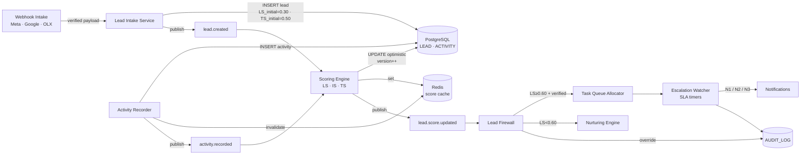

# TECH SPEC — REVYX Lead Scoring Engine
<!-- TECH_SPEC_REVYX_lead-scoring_v1.0.0.md · v1.0.0 · 2026-05 -->
<!-- CONFIDENȚIAL · Uz Intern · © 2026 REVYX · ITPRO SYSTEM SRL -->

## Changelog

| Versiune | Data | Autor | Note |
|---|---|---|---|
| 1.0.0 | 2026-05 | Senior PM + Solution Architect | Spec inițială Lead Scoring Engine — LS, IS, TS, Lead Firewall, Escalation Protocol · Phase 1 |

---

## Cuprins

1. [Executive Summary](#1-executive-summary)
2. [Architecture Overview](#2-architecture-overview)
3. [Stack & Dependencies](#3-stack--dependencies)
4. [Data Model](#4-data-model)
5. [API Contracts](#5-api-contracts)
6. [Algorithms](#6-algorithms)
7. [State Machines](#7-state-machines)
8. [Concurrency](#8-concurrency)
9. [Caching](#9-caching)
10. [Background Jobs](#10-background-jobs)
11. [Error Handling](#11-error-handling)
12. [Security](#12-security)
13. [Observability](#13-observability)
14. [Performance Budgets](#14-performance-budgets)
15. [Testing Strategy](#15-testing-strategy)
16. [Deployment](#16-deployment)
17. [Migration Strategy](#17-migration-strategy)
18. [Risks & Mitigations](#18-risks--mitigations)
19. [Impact Assessment](#19-impact-assessment)

---

## 1. Executive Summary

Lead Scoring Engine este nucleul Pilonului 01 (Lead Intelligence) și componentă critică pentru Pilonul 03 (Match Intelligence) prin contribuția LS și IS în formula DP.

| Atribut | Valoare |
|---|---|
| **Scope** | Calcul LS (BRD §7.1), IS (§7.3), TS (§7.6) · Lead Firewall · Manager Override · Escalation Protocol 3 niveluri |
| **Referință BRD** | §5 Pilon 01 + 04 · §6.1 BR-01/02/03/04/12 · §7.1, §7.3, §7.6 · §12 AC-LF-*, AC-LS-* |
| **Phase** | 1 (Core engines) |
| **Owner tehnic** | Solution Architect + Senior PM |
| **Dependențe upstream** | Phase 0: Auth/RBAC · AUDIT_LOG · webhook-intake · tenancy-roles-extension |
| **Dependențe downstream** | Match Engine (DP) · NBA Engine · DHI Engine · Task Allocator |

**Garanții oferite:**

1. `LS_initial = 0.30` la creare lead (BR-02, AC-LS-01).
2. `TS_initial = 0.50` la creare lead.
3. Recalc LS în `≤ 30 sec` după orice interacțiune (NFR-01, AC-LS-02).
4. Lead Firewall: doar `LS ≥ 0.60 + contact_verified` ajunge în queue agent (BR-01) în ≤ 2 min (NFR-02, AC-LF-01).
5. Manager Override logat în AUDIT_LOG (AC-LF-03).
6. Escalation Protocol 3 niveluri activ pentru lead-uri HOT (BR-03).
7. LS, IS, TS ∈ [0.0, 1.0] în orice condiție de input (clamp explicit, AC-LS-05).

---

## 2. Architecture Overview



### 2.1 Data flow (happy path lead nou)

1. Webhook verificat HMAC (vezi `webhook-intake`) → `Lead Intake Service`.
2. INSERT `lead` cu `LS_initial=0.30`, `TS_initial=0.50`, `score_initialized_at=NOW()`, `version=1`.
3. AUDIT_LOG event `LEAD_CREATED` în aceeași tranzacție.
4. Job async `recalcLS(lead_id)` executat la T+0 cu signals disponibile (BF_declared, contact_verified).
5. Re-scor publicat → `Lead Firewall` decide (queue agent vs nurturing).
6. Pentru lead HOT (`LS ≥ 0.75`): Escalation Watcher armează timere N1/N2/N3.

### 2.2 Componente principale

| Componentă | Responsabilitate |
|---|---|
| `LeadIntakeService` | Normalizare payload · dedup fuzzy · INSERT atomic + audit |
| `ScoringEngine` | Calcul LS · IS · TS (formule BRD §7.1/7.3/7.6) |
| `LeadFirewall` | Decizie binary: queue agent vs nurturing |
| `ManagerOverrideService` | Override LS<0.60 cu approval Manager + AUDIT |
| `EscalationWatcher` | Timere SLA per lead HOT · 3 niveluri |
| `ActivityRecorder` | INSERT ACTIVITY + cache invalidation + republish |
| `ScoreCache` | Redis: read-through cu invalidare event-driven |

---

## 3. Stack & Dependencies

| Layer | Tehnologie | Versiune | Justificare |
|---|---|---|---|
| Backend | Node.js + TypeScript | 20 LTS · TS 5.x | Stack standard REVYX (`strict: true`) |
| ORM | Kysely (preferat) sau Prisma | latest stable | Type-safe + control SQL pentru optimistic locking |
| DB | PostgreSQL | 16.x | TIMESTAMPTZ · GENERATED columns · CHECK constraints |
| Cache | Redis | 7.x | Score cache + queue (BullMQ) |
| Queue | BullMQ | latest | Idempotent jobs · retry exponențial · delayed jobs (escalation) |
| Audit | `auditLogger` (TECH_SPEC audit-log) | 1.0.0 | INSERT în aceeași tranzacție |
| Auth | JWT RS256 (Phase 0) | — | RBAC 5 roluri |

---

## 4. Data Model

### 4.1 Tabel `lead` (Phase 1 — extins față de Phase 0)

```sql
-- Migrare: 0050_lead_phase1.sql
CREATE TABLE IF NOT EXISTS lead (
  lead_id                       UUID            PRIMARY KEY DEFAULT gen_random_uuid(),
  tenant_id                     UUID            NOT NULL,
  source                        TEXT            NOT NULL CHECK (source IN ('meta','google','olx','referral','manual','import')),
  source_external_id            TEXT            NULL,

  -- Contact
  full_name                     TEXT            NULL,
  phone_e164                    TEXT            NULL,
  email                         TEXT            NULL,
  phone_verified                BOOLEAN         NOT NULL DEFAULT FALSE,
  email_verified                BOOLEAN         NOT NULL DEFAULT FALSE,

  -- Intent / preferințe (input scoring)
  intent_declared               NUMERIC(4,3)    NULL CHECK (intent_declared BETWEEN 0 AND 1),
  budget_min_eur                NUMERIC(12,2)   NULL,
  budget_max_eur                NUMERIC(12,2)   NULL,
  budget_validated              BOOLEAN         NOT NULL DEFAULT FALSE,
  timeline_urgency_label        TEXT            NULL CHECK (timeline_urgency_label IN ('immediate','3m','6m','12m','exploratory')),
  preferred_property_type       TEXT            NULL,
  preferred_location            TEXT            NULL,

  -- Scoruri (clamp [0,1])
  lead_score                    NUMERIC(4,3)    NOT NULL DEFAULT 0.300 CHECK (lead_score BETWEEN 0 AND 1),
  trust_score                   NUMERIC(4,3)    NOT NULL DEFAULT 0.500 CHECK (trust_score BETWEEN 0 AND 1),
  interaction_strength          NUMERIC(4,3)    NOT NULL DEFAULT 0.000 CHECK (interaction_strength BETWEEN 0 AND 1),

  -- Sub-componente persistate pentru explainability
  score_components              JSONB           NULL,     -- { I, BF, TU, E, TS, RC, FV, BS, SF, RF_show, MF, CF }
  score_initialized_at          TIMESTAMPTZ     NOT NULL DEFAULT NOW(),
  score_recalculated_at         TIMESTAMPTZ     NOT NULL DEFAULT NOW(),

  -- Lead Firewall
  firewall_state                TEXT            NOT NULL DEFAULT 'PENDING' CHECK (firewall_state IN ('PENDING','BLOCKED','QUEUED','OVERRIDDEN','NURTURING')),
  firewall_reason               TEXT            NULL,
  override_by_user_id           UUID            NULL,
  override_at                   TIMESTAMPTZ     NULL,
  override_reason               TEXT            NULL,
  assigned_agent_id             UUID            NULL,
  assigned_at                   TIMESTAMPTZ     NULL,

  -- Escalation
  escalation_level              SMALLINT        NOT NULL DEFAULT 0 CHECK (escalation_level BETWEEN 0 AND 3),
  sla_due_at                    TIMESTAMPTZ     NULL,

  -- GDPR (reluat din Phase 0)
  gdpr_consent_at               TIMESTAMPTZ     NOT NULL,
  gdpr_consent_channel          TEXT            NOT NULL,
  gdpr_consent_version          TEXT            NOT NULL,
  data_retention_expires_at     TIMESTAMPTZ     NOT NULL,
  erasure_requested_at          TIMESTAMPTZ     NULL,

  -- Optimistic locking (BR Phase 1)
  version                       BIGINT          NOT NULL DEFAULT 1,

  -- Status workflow (vezi §7)
  status                        TEXT            NOT NULL DEFAULT 'NEW' CHECK (status IN ('NEW','QUALIFIED','CONTACTED','SHOWING','NEGOTIATION','WON','LOST','NURTURING')),

  -- Dedup
  dedup_hash                    TEXT            NULL,
  duplicate_of_lead_id          UUID            NULL REFERENCES lead(lead_id),

  created_at                    TIMESTAMPTZ     NOT NULL DEFAULT NOW(),
  updated_at                    TIMESTAMPTZ     NOT NULL DEFAULT NOW()
);

CREATE INDEX IF NOT EXISTS idx_lead_tenant_status        ON lead (tenant_id, status, lead_score DESC);
CREATE INDEX IF NOT EXISTS idx_lead_firewall             ON lead (tenant_id, firewall_state, lead_score DESC);
CREATE INDEX IF NOT EXISTS idx_lead_assigned_agent       ON lead (tenant_id, assigned_agent_id) WHERE assigned_agent_id IS NOT NULL;
CREATE INDEX IF NOT EXISTS idx_lead_sla_due              ON lead (sla_due_at) WHERE sla_due_at IS NOT NULL;
CREATE INDEX IF NOT EXISTS idx_lead_dedup                ON lead (tenant_id, dedup_hash) WHERE dedup_hash IS NOT NULL;
CREATE INDEX IF NOT EXISTS idx_lead_phone                ON lead (tenant_id, phone_e164) WHERE phone_e164 IS NOT NULL;
```

### 4.2 Tabel `activity` (input pentru IS, TS, NBA Δt)

Definit complet în BRD §8 — recapitulat aici pentru contractul scoring:

```sql
CREATE TABLE IF NOT EXISTS activity (
  activity_id      UUID            PRIMARY KEY DEFAULT gen_random_uuid(),
  tenant_id        UUID            NOT NULL,
  entity_type      TEXT            NOT NULL CHECK (entity_type IN ('lead','deal','property','agent')),
  entity_id        UUID            NOT NULL,
  activity_type    TEXT            NOT NULL CHECK (activity_type IN (
    'call','message_sent','message_received','showing','offer_made',
    'note_added','score_updated','status_changed','showcase_viewed','document_downloaded'
  )),
  performed_by     UUID            NULL,
  channel          TEXT            NULL CHECK (channel IN ('whatsapp','email','sms','platform','phone','in_app') OR channel IS NULL),
  duration_seconds INTEGER         NULL,
  metadata         JSONB           NULL,
  occurred_at      TIMESTAMPTZ     NOT NULL DEFAULT NOW()
);

CREATE INDEX IF NOT EXISTS idx_activity_entity_time
  ON activity (tenant_id, entity_type, entity_id, occurred_at DESC);
```

### 4.3 Constraints & invariants

| Invariant | Enforcement |
|---|---|
| `LS, TS, IS ∈ [0,1]` | CHECK + clamp app-side la write |
| `LS_initial = 0.30` la INSERT | DEFAULT 0.300 + INSERT explicit din service |
| `TS_initial = 0.50` la INSERT | DEFAULT 0.500 |
| `version` strict crescător per row | `WHERE version = :prev` la UPDATE (optimistic locking) |
| `gdpr_consent_*` non-null | NOT NULL — refuz INSERT fără consent (BR-06) |
| `firewall_state` tranziții valide | App-level state machine §7 |

---

## 5. API Contracts

### 5.1 Internal services

```typescript
interface LeadIntakeService {
  intakeFromWebhook(payload: VerifiedWebhookPayload): Promise<LeadIntakeResult>;
  intakeManual(input: ManualLeadInput, actor: User): Promise<LeadIntakeResult>;
}

interface ScoringEngine {
  recalcLeadScore(leadId: string, opts?: { reason?: string }): Promise<ScoreSnapshot>;
  recalcInteractionStrength(leadId: string): Promise<number>;
  recalcTrustScore(leadId: string): Promise<number>;
}

interface LeadFirewall {
  evaluate(leadId: string): Promise<FirewallDecision>;
  override(leadId: string, manager: User, reason: string, targetAgentId: string): Promise<void>;
}

interface EscalationWatcher {
  arm(leadId: string, slaDueAt: Date): Promise<void>;
  cancel(leadId: string, reason: 'contacted' | 'closed' | 'override' | 'reassigned'): Promise<void>;
}
```

### 5.2 REST endpoints (manager + agent UI)

| Method | Path | RBAC | Descriere |
|---|---|---|---|
| `GET` | `/api/v1/leads/:id` | agent (own) / team_lead+ | Detalii lead + scor + componente |
| `GET` | `/api/v1/leads/:id/score-breakdown` | agent (own) / team_lead+ | Sub-componente LS/IS/TS pentru explainability |
| `POST` | `/api/v1/leads/:id/recalc-score` | manager+ | Forțează recalc (debug) |
| `POST` | `/api/v1/leads/:id/firewall/override` | manager+ | Manager Override (AC-LF-03/04) |
| `POST` | `/api/v1/leads/:id/assign` | team_lead+ | Asignare manuală agent |
| `POST` | `/api/v1/leads/:id/contacted` | agent (own) | Marchează prim contact (oprește SLA timer) |
| `GET` | `/api/v1/leads/queue` | agent | Coadă filtrată by `assigned_agent_id = me` (max 3 active — BR-04) |

Toate endpointurile WRITE sunt audit-logate (vezi §12).

---

## 6. Algorithms

### 6.1 Lead Score (BRD §7.1)

```typescript
// LS = 0.35*I + 0.25*BF + 0.15*TU + 0.15*E + 0.10*TS
function calculateLeadScore(lead: LeadInputs, ts: number): {
  ls: number; components: LSComponents;
} {
  const I  = clamp01(lead.intent ?? 0);
  const BF = clamp01(lead.budgetFit ?? 0);
  const TU = clamp01(lead.timelineUrgency ?? 0);
  const E  = clamp01(lead.engagement ?? 0);
  const TSv = clamp01(ts ?? 0.5);

  const ls = 0.35*I + 0.25*BF + 0.15*TU + 0.15*E + 0.10*TSv;
  return { ls: clamp01(ls), components: { I, BF, TU, E, TS: TSv } };
}

// Cazul t=0 (lead nou, date incomplete) — formula BRD §7.1 paragraful star
function calculateInitialLS(lead: LeadInputs): number {
  const BF_declared      = clamp01(lead.budgetDeclared ? 1 : 0);
  const contact_verified = clamp01(lead.phoneVerified || lead.emailVerified ? 1 : 0);
  const ls = 0.25*BF_declared + 0.30*contact_verified;
  // BR-02: niciodată sub 0.30 la creare
  return Math.max(0.30, clamp01(ls));
}
```

#### Mapping inputs → factori (factori normalizați [0,1])

| Factor | Cum se calculează | Sursă |
|---|---|---|
| **I (Intent)** | `0.5*intent_declared + 0.3*activity_intent_signals + 0.2*contact_recency` | `lead.intent_declared` + ACTIVITY ultimele 7 zile |
| **BF (Budget Fit)** | `1.0` dacă budget overlap cu inventory PROPERTY ≥ 30% · `0.7` doar declarat fără validare · `0` lipsă | `lead.budget_min/max_eur` × inventory |
| **TU (Timeline Urgency)** | mapping label → score: `immediate=1.0`, `3m=0.75`, `6m=0.50`, `12m=0.25`, `exploratory=0.10` | `lead.timeline_urgency_label` |
| **E (Engagement)** | `min(1, 0.2*messages + 0.3*calls + 0.5*showings) / 7d_window` | ACTIVITY 7d |
| **TS** | vezi §6.3 | calcul `recalcTrustScore` |

#### Praguri LS → acțiune (BRD §7.1)

| LS | Acțiune | Workflow |
|---|---|---|
| `< 0.40` | Nurturing automat | `firewall_state = NURTURING` |
| `0.40 – 0.60` | Nurturing + monitorizare | `BLOCKED` (cu task low-priority) |
| `0.60 – 0.75` | Queue agent (normal) | `QUEUED` SLA 2h |
| `≥ 0.75` | HOT — alertă imediată | `QUEUED` SLA 15min + escalation armată |

### 6.2 Interaction Strength (BRD §7.3)

```typescript
// IS = 0.40*SF + 0.30*RF_show + 0.20*MF + 0.10*CF
function calculateInteractionStrength(act: ActivityWindow): number {
  const SF      = clamp01(act.showings7d / SF_NORMALIZER);            // SF_NORMALIZER = 3
  const RF_show = clamp01(act.showcaseReturnVisits14d / RF_SHOW_NORM); // RF_SHOW_NORM = 5
  const MF      = clamp01(act.messages7d / MF_NORMALIZER);             // MF_NORMALIZER = 10
  const CF      = clamp01(act.calls7d / CF_NORMALIZER);                // CF_NORMALIZER = 5

  return clamp01(0.40*SF + 0.30*RF_show + 0.20*MF + 0.10*CF);
}
```

> Normalizatorii (3 / 5 / 10 / 5) sunt config tunable per tenant în `scoring_config` (admin only). Default-uri validate cu T01–T07.

### 6.3 Trust Score (BRD §7.6)

```typescript
// TS = 0.40*RC + 0.30*FV + 0.30*BS
function calculateTrustScore(lead: Lead, act: ActivityWindow): number {
  const RC = responseConsistency(act);  // % răspunsuri în <24h
  const FV = financialValidation(lead); // 1.0 budget validated · 0.5 declared · 0 absent
  const BS = behaviorStability(act);    // 1 - frecvență oscilare preferințe (preferred_*)

  return clamp01(0.40*RC + 0.30*FV + 0.30*BS);
}

// La creare: TS_initial = 0.50 (constanta inițială BRD §7.1 + 7.6)
const TS_INITIAL = 0.50;
```

### 6.4 Lead Firewall (BR-01)

```typescript
type FirewallDecision =
  | { state: 'QUEUED'; assignedAgentId: string; slaDueAt: Date; priority: 'HOT'|'NORMAL' }
  | { state: 'BLOCKED'; reason: 'LS_BELOW_THRESHOLD' | 'CONTACT_INVALID' }
  | { state: 'NURTURING'; reason: 'LS_COLD' };

function evaluateFirewall(lead: Lead): FirewallDecision {
  const contactValid = lead.phone_verified || lead.email_verified;
  if (lead.lead_score < 0.40) return { state: 'NURTURING', reason: 'LS_COLD' };
  if (lead.lead_score < 0.60) return { state: 'BLOCKED', reason: 'LS_BELOW_THRESHOLD' };
  if (!contactValid)          return { state: 'BLOCKED', reason: 'CONTACT_INVALID' };

  // Eligibil pentru queue → Task Allocator decide agentul (max 3 active per agent — BR-04)
  const priority = lead.lead_score >= 0.75 ? 'HOT' : 'NORMAL';
  const slaMinutes = priority === 'HOT' ? 15 : (lead.lead_score >= 0.60 ? 120 : 1440);
  return {
    state: 'QUEUED',
    assignedAgentId: allocateAgent(lead),       // implementat în Task Allocator
    slaDueAt: addMinutes(new Date(), slaMinutes),
    priority,
  };
}
```

#### Manager Override (AC-LF-03/04)

```typescript
async function override(leadId: string, manager: User, reason: string, targetAgentId: string) {
  await db.transaction(async (tx) => {
    const lead = await tx.selectFrom('lead').where('lead_id','=',leadId).forUpdate().executeTakeFirstOrThrow();
    if (lead.firewall_state !== 'BLOCKED') throw new Error('OVERRIDE_INVALID_STATE');

    await tx.updateTable('lead')
      .set({
        firewall_state: 'OVERRIDDEN',
        override_by_user_id: manager.userId,
        override_at: new Date(),
        override_reason: reason,
        assigned_agent_id: targetAgentId,
        assigned_at: new Date(),
        sla_due_at: addMinutes(new Date(), 120),  // SLA fallback 2h
        version: lead.version + 1n,
      })
      .where('lead_id','=',leadId)
      .where('version','=',lead.version)
      .execute();

    await auditLogger.record({
      tenantId: lead.tenant_id,
      userId: manager.userId,
      actorType: 'USER',
      eventType: 'LEAD_FIREWALL_OVERRIDE',
      entityType: 'LEAD',
      entityId: leadId,
      oldValue: { firewall_state: lead.firewall_state, lead_score: lead.lead_score },
      newValue: { firewall_state: 'OVERRIDDEN', assigned_agent_id: targetAgentId },
      metadata: { override_reason: reason },
    }, tx);
  });
}
```

### 6.5 Escalation Protocol 3 niveluri (BR-03)

```
T+0           : queue agent  → notificare push
T+SLA         : Nivel 1 — auto follow-up (WhatsApp template `follow_up_qualified`) + push agent
T+SLA+30min   : Nivel 2 — manager alertat cu detalii complete (push + email)
T+SLA+2h      : Nivel 3 — auto-reasignare la agentul cu APS maxim disponibil + AUDIT
```

```typescript
// EscalationWatcher folosește delayed jobs BullMQ
async function arm(leadId: string, slaDueAt: Date) {
  await queue.add('lead.escalation.l1', { leadId, level: 1 }, { delay: ms(slaDueAt - now()),         jobId: `esc:${leadId}:1` });
  await queue.add('lead.escalation.l2', { leadId, level: 2 }, { delay: ms(slaDueAt - now()) + 30*60_000, jobId: `esc:${leadId}:2` });
  await queue.add('lead.escalation.l3', { leadId, level: 3 }, { delay: ms(slaDueAt - now()) + 2*60*60_000, jobId: `esc:${leadId}:3` });
}

// Cancel la prim contact / close / override / reassign
async function cancel(leadId: string, reason: string) {
  for (const lvl of [1,2,3]) await queue.removeJob(`esc:${leadId}:${lvl}`);
  await auditLogger.record({ /* ... */ eventType: 'ESCALATION_CANCELLED', metadata: { reason } });
}
```

Job handler L3 — auto-reasignare:

```typescript
async function handleEscalationL3({ leadId }) {
  await db.transaction(async (tx) => {
    const lead = await tx.selectFrom('lead').where('lead_id','=',leadId).forUpdate().executeTakeFirstOrThrow();
    if (lead.status !== 'NEW' && lead.status !== 'QUALIFIED') return; // deja contactat

    const newAgent = await pickAgentByMaxAPS(tx, lead.tenant_id, { excludeAgentId: lead.assigned_agent_id });
    await tx.updateTable('lead').set({
      assigned_agent_id: newAgent.agent_id,
      assigned_at: new Date(),
      escalation_level: 3,
      version: lead.version + 1n,
    }).where('lead_id','=',leadId).where('version','=',lead.version).execute();

    await auditLogger.record({
      eventType: 'ESCALATION_TRIGGERED',
      entityType: 'LEAD',
      entityId: leadId,
      oldValue: { assigned_agent_id: lead.assigned_agent_id },
      newValue: { assigned_agent_id: newAgent.agent_id, escalation_level: 3 },
      metadata: { level: 3, trigger: 'AUTO_REASSIGN' },
    }, tx);
  });
}
```

### 6.6 Recalc orchestration

```typescript
// Trigger: ACTIVITY insert · LEAD field changed · cron 6h fallback
async function recalcLeadScore(leadId: string): Promise<ScoreSnapshot> {
  return db.transaction(async (tx) => {
    const lead = await tx.selectFrom('lead').where('lead_id','=',leadId).forUpdate().executeTakeFirstOrThrow();
    const acts = await loadActivityWindow(tx, leadId);

    const ts = calculateTrustScore(lead, acts);
    const is = calculateInteractionStrength(acts);
    const { ls, components } = calculateLeadScore(deriveLSInputs(lead, acts), ts);

    if (sameScores(lead, { ls, ts, is })) return existingSnapshot(lead);

    await tx.updateTable('lead').set({
      lead_score: ls,
      trust_score: ts,
      interaction_strength: is,
      score_components: { ...components, IS: is, TS: ts },
      score_recalculated_at: new Date(),
      version: lead.version + 1n,
    }).where('lead_id','=',leadId).where('version','=',lead.version).execute();

    await auditLogger.record({
      tenantId: lead.tenant_id,
      actorType: 'SYSTEM',
      eventType: 'LEAD_SCORE_UPDATED',
      entityType: 'LEAD',
      entityId: leadId,
      oldValue: { lead_score: lead.lead_score, trust_score: lead.trust_score, interaction_strength: lead.interaction_strength },
      newValue: { lead_score: ls, trust_score: ts, interaction_strength: is },
      metadata: { trigger: 'recalc' },
    }, tx);

    await invalidateCache(`lead:${leadId}:scores`);
    await events.publish('lead.score.updated', { leadId, ls, ts, is, prev: lead });

    return { ls, ts, is, components };
  });
}
```

---

## 7. State Machines

### 7.1 Firewall state machine

```
PENDING ──(LS<0.40)──> NURTURING
PENDING ──(LS≥0.40 & <0.60)──> BLOCKED
PENDING ──(LS≥0.60 & contact_valid)──> QUEUED
BLOCKED ──(manager override)──> OVERRIDDEN
OVERRIDDEN ──(agent contacted)──> [exit firewall]
QUEUED ──(agent contacted)──> [exit firewall]
NURTURING ──(LS upgrade ≥0.40)──> BLOCKED|QUEUED
```

### 7.2 Lead status machine

```
NEW ──> QUALIFIED ──> CONTACTED ──> SHOWING ──> NEGOTIATION ──> WON | LOST
                  └─> NURTURING (cooldown)
NEW ──> NURTURING (LS_COLD)
NURTURING ──> QUALIFIED (re-evaluare scoruri)
```

---

## 8. Concurrency

- **Optimistic locking obligatoriu** (BRD §9.5 + Constraint C-05): toate UPDATE-urile pe `lead` includ `WHERE version = :prev`. La conflict (`affectedRows = 0`): **re-fetch + recalc**, nu suprascriere.
- Maxim 3 retry-uri pe conflict cu backoff `50ms · 100ms · 200ms`. După 3 conflicte: log warning + drop (job eligibil pentru re-run periodic).
- `auditLogger.record` rulează în aceeași tranzacție cu UPDATE-ul pentru consistență.
- Lock advisory (`pg_advisory_xact_lock(hashtext(lead_id))`) pe `recalcLeadScore` pentru evitarea coliziunilor pe lead "fierbinte".

---

## 9. Caching

| Key Redis | Conținut | TTL | Invalidare |
|---|---|---|---|
| `lead:{leadId}:scores` | `{ ls, ts, is, components, version }` | 5 min | event `lead.score.updated` · ACTIVITY insert |
| `lead:{leadId}:firewall` | `FirewallDecision` | 60 sec | event `lead.score.updated` · override |
| `tenant:{tenantId}:agent_apsCache` | top-K agenți by APS pentru reassign | 30 sec | event `agent.aps.updated` |
| `lead:queue:{agentId}` | listă lead_id + lead_score sortat desc | 10 sec | event `lead.assigned` · `lead.contacted` |

**Strategie:** read-through cu fallback DB. Invalidare strict event-driven (publish/subscribe), nu time-based pentru paths critice.

**Stale read protection:** la conflict optimistic, cache invalidat înainte de retry.

---

## 10. Background Jobs

| Job | Cron / Trigger | Idempotent | Retry |
|---|---|---|---|
| `lead.score.recalc.fallback` | cron `*/6 * * * *` (6h) | DA (calcul determinist) | 3× backoff 30s/2m/5m |
| `lead.escalation.l1/l2/l3` | delayed BullMQ | DA (verifică status înainte) | 1× retry 30s |
| `lead.dedup.fuzzy` | la INSERT lead | DA | 2× backoff |
| `lead.nurturing.tick` | cron `0 9,15 * * *` (zilnic 09:00 + 15:00) | DA | 3× backoff 5m |
| `lead.gdpr.purge` | cron `0 3 * * *` (zilnic 03:00) | DA | 5× backoff exponențial |

---

## 11. Error Handling

| Cod | Caz | Răspuns |
|---|---|---|
| `LEAD_VERSION_CONFLICT` | UPDATE rejected by version | Re-fetch + retry max 3× |
| `LEAD_GDPR_CONSENT_MISSING` | INSERT fără consent | 422 + AUDIT_LOG `LEAD_INTAKE_REJECTED_NO_CONSENT` |
| `LEAD_FIREWALL_INVALID_STATE` | Override pe non-BLOCKED | 409 |
| `LEAD_DUPLICATE` | Fuzzy match >85% | 200 + `duplicate_of_lead_id` setat + AUDIT |
| `SCORE_OUT_OF_RANGE` | Bug în recalc → ls > 1 sau < 0 | Hard-fail + alert SecOps + clamp aplicat înainte de write |
| `ESCALATION_DISARM_FAILED` | Job de cancel ratează | Re-add cu jobId stabil (idempotent) |

**Fail-closed:** dacă AUDIT_LOG insert eșuează (vezi audit-log §11), tranzacția scoring se rollback.

---

## 12. Security

- **JWT RS256** moștenit din Phase 0 (auth-rbac).
- **RBAC**:
  - `agent` — read/write doar pe lead-urile proprii (`assigned_agent_id = me`)
  - `senior_agent` — + override priority pe lead propriu
  - `team_lead` — read echipă · assign manual
  - `manager` — Lead Firewall Override · re-assign · GDPR export
  - `admin` — config scoring weights + normalizatori IS
- **AUDIT_LOG events emise:**
  - `LEAD_CREATED` · `LEAD_SCORE_UPDATED` · `LEAD_FIREWALL_BLOCKED` · `LEAD_FIREWALL_OVERRIDE`
  - `LEAD_ASSIGNED` · `LEAD_CONTACTED` · `LEAD_DEDUP_DETECTED`
  - `ESCALATION_TRIGGERED` · `ESCALATION_CANCELLED`
  - `LEAD_INTAKE_REJECTED_NO_CONSENT` · `GDPR_ERASURE_REQUESTED` (cascade)
- **PII handling:** `phone_e164`, `email`, `full_name` mascate în AUDIT_LOG (hash SHA256 + salt tenant per audit-log §12.1).
- **Rate limiting** moștenit (NFR-05/06): API intern 1.000 req/min/token.
- **Single session per agent (BR-12):** la password change → revocare JWT + AUDIT `AUTH_PASSWORD_CHANGED`.

---

## 13. Observability

| Metric | Tip | Alert |
|---|---|---|
| `lead_score_recalc_duration_ms` (p50/p95/p99) | histogram | p95 > 30s 5min — VIOLATES NFR-01 |
| `lead_score_recalc_failures_total` | counter | >5/min → pager |
| `lead_firewall_decision_total{state}` | counter | trend monitoring |
| `lead_firewall_override_total{manager_id}` | counter | review săptămânal |
| `lead_escalation_triggered_total{level}` | counter | spike L3 → alert |
| `lead_queue_size{agent_id}` | gauge | >3 → bug Task Allocator |
| `lead_intake_to_queue_seconds` | histogram | p95 > 120s → VIOLATES NFR-02 |
| `lead_score_components` | trace span | explainability |

Logs structured JSON cu `tenant_id`, `lead_id`, `correlation_id`. Dashboard Grafana: `REVYX / Lead Scoring Health`.

---

## 14. Performance Budgets

| Metric | Target | Sursă |
|---|---|---|
| Recalc LS | p95 ≤ 30 sec | NFR-01 |
| Lead intake → queue | p95 ≤ 2 min | NFR-02 |
| Firewall decision | p95 < 500 ms | UX |
| API GET /leads/:id | p95 < 200 ms | UX |
| Throughput recalc | ≥ 200 leads/min/instanță | Capacity |

---

## 15. Testing Strategy

### 15.1 Unit
- `calculateLeadScore` — toate cazurile factori 0..1 + clamp + edge T01 (toți factori = 0 → 0.30)
- `calculateInteractionStrength` — normalizatori validați
- `calculateTrustScore` — RC/FV/BS isolated
- `evaluateFirewall` — toate ramurile decision tree
- Initial LS path (BR-02) — 100% coverage

### 15.2 Integration
- INSERT lead fără consent → reject
- INSERT lead → `LS_initial = 0.30` în BD (T01)
- ACTIVITY insert → recalc trigger → score updated în <30s
- Optimistic locking conflict → retry success
- AUDIT_LOG events emise corect cu `correlation_id` consistent

### 15.3 E2E
- Webhook Meta → intake → score → firewall → queue agent în <2 min (AC-LF-01)
- Manager Override pe LS<0.60 → lead în queue agent în <2 min (AC-LF-04)
- Lead HOT fără răspuns → N1 la T+15min, N2 la T+45min, N3 la T+2h15min (auto-reassign)
- Edge T01: lead nou → LS=0.30 ✓
- Edge T05: agent APS_default=0.65 → DP nepenalizat
- AC-LS-04: modificare buget → recalc imediat

### 15.4 Load
- 1.000 leads/min intake sustained 10 min · p95 intake→queue < 90s
- 5.000 ACTIVITY inserts/min · p95 recalc < 25s
- Escalation jobs concurrent 10.000 timere active

### 15.5 Chaos
- Redis down → fallback DB cu degradare grațioasă (latency ↑)
- BullMQ Redis down → escalation jobs persisted local + replay
- Lead "fierbinte" cu 100 ACTIVITY/sec → advisory lock previne thrashing

### 15.6 Coverage target

| Layer | Coverage |
|---|---|
| Scoring formulas | ≥ 98% |
| Firewall + Override | ≥ 95% |
| Escalation | ≥ 90% |
| API handlers | ≥ 85% |

---

## 16. Deployment

| Aspect | Detaliu |
|---|---|
| Feature flag | `flag.lead_scoring_v1.enabled` (default OFF în staging) |
| Rollout | canary 10% tenanți pilot → 50% → 100% în 2 săptămâni |
| Rollback | flag OFF · DOWN migration `0050_down.sql` (DROP newly added columns) |
| Secrets | Niciun secret — config scoring weights în `scoring_config` table (admin only) |
| Owner rollout | Senior PM + Solution Architect |

---

## 17. Migration Strategy

```
0050_lead_phase1.sql              -- ALTER lead: scoring fields + firewall + escalation + GDPR + version
0051_activity_indexes.sql         -- Indexuri suplimentare ACTIVITY (entity_time, score input window)
0052_scoring_config.sql           -- Tabel scoring_config per tenant (weights, normalizatori)
0053_lead_dedup_function.sql      -- Funcție SQL fuzzy match (pg_trgm)
```

Toate migrările idempotente (`ADD COLUMN IF NOT EXISTS`). Backwards compat: existing leads (Phase 0 webhook intake) primesc `LS = 0.30`, `TS = 0.50`, `version = 1` la migrare.

---

## 18. Risks & Mitigations

| # | Risc | Probab. | Impact | Mitigare |
|---|---|---|---|---|
| R1 | Recalc thrash pe lead "fierbinte" | MED | MED | Advisory lock + debounce 2s |
| R2 | Optimistic conflict floods | LOW | MED | Retry max 3× + alert pe rate ridicat |
| R3 | LS calculat ≠ așteptat (formulă greșită) | LOW | CRITIC | Tests T01–T07 obligatorii pre-merge + property-based testing |
| R4 | Escalation L3 reasignează la agent supraîncărcat | MED | HIGH | Verificare `tasks_active < 3` (BR-04) + `is_active` + `out_of_office_until` |
| R5 | Manager override abuziv | LOW | MED | Dashboard Manager Override Audit (review săptămânal) |
| R6 | Cache stale după invalidare ratată | LOW | MED | TTL hard-cap 5min · double-check version la read |
| R7 | Dedup fuzzy ratează duplicate | MED | MED | Threshold tunable per tenant + manual merge UI |

---

## 19. Impact Assessment

### 19.1 Scope of Change

| Element | Detaliu |
|---|---|
| Document | TECH_SPEC_REVYX_lead-scoring_v1.0.0.md |
| Tip schimbare | NEW |
| Aria afectată | Phase 1 · Pilon 01 (Lead Intelligence) · Pilon 04 (Execution) · entitate LEAD + ACTIVITY · scoring LS/IS/TS · BR-01/02/03/04/12 |
| Origine | BRD §5 Pilon 01+04 · §6.1 BR-01/02/03/04 · §7.1/7.3/7.6 · §12 AC-LF-* + AC-LS-* |

### 19.2 Impact pe documente conexe

| Document | Tip impact | Acțiune |
|---|---|---|
| BRD_REVYX_v1.0.0.md | None | Formule deja documentate · spec doar implementează |
| TECH_SPEC_REVYX_audit-log_v1.0.0.md | Minor | Catalog event_type extins cu `LEAD_SCORE_UPDATED`, `LEAD_DEDUP_DETECTED`, `ESCALATION_CANCELLED`, `LEAD_INTAKE_REJECTED_NO_CONSENT` |
| TECH_SPEC_REVYX_webhook-intake_v1.0.0.md | Minor | Webhook intake apelează `LeadIntakeService.intakeFromWebhook` |
| TECH_SPEC_REVYX_property_v1.0.0.md (S3) | Minor | BF (Budget Fit) consumă inventory PROPERTY pentru overlap |
| TECH_SPEC_REVYX_match-engine (S4) | Major | Match Engine consumă `lead_score`, `interaction_strength` pentru DP |
| TECH_SPEC_REVYX_nba-engine (S4) | Major | NBA consumă DP + Δt din ACTIVITY |
| WORKFLOW_REVYX_lead-lifecycle_v1.0.0.md (S3) | None | Reflectă mecanica acestui spec |
| WORKFLOW_REVYX_escalation (S4) | Minor | Implementare detaliată BR-03 |
| brand-configs/revyx.md | None | — |

### 19.3 Impact pe scoring

| Scor | Afectat? | Detaliu |
|---|---|---|
| **LS** | DA | Implementare directă §6.1 + LS_initial=0.30 (BR-02) |
| **IS** | DA | Implementare directă §6.2 |
| **TS** | DA | Implementare directă §6.3 + TS_initial=0.50 |
| PS | NU | Calculat în spec property |
| DP | NU (indirect) | Consumă LS/IS din acest spec |
| NBA | NU (indirect) | Consumă Δt din ACTIVITY (input acestui spec) |
| APS | NU | Consumat de auto-reassign L3 |
| DHI | NU | — |

### 19.4 Impact pe entități / schema BD

| Entitate | Modificare | Migrare |
|---|---|---|
| LEAD | ALTER (+25 câmpuri scoring/firewall/escalation/version) | 0050_lead_phase1.sql |
| ACTIVITY | NEW indexes | 0051_activity_indexes.sql |
| SCORING_CONFIG | NEW (per-tenant weights) | 0052_scoring_config.sql |
| AUDIT_LOG | None (catalog event extins) | — |

### 19.5 Impact pe RBAC

| Rol | Permisiuni adăugate |
|---|---|
| agent | Read/write lead propriu · `POST /leads/:id/contacted` |
| senior_agent | + override priority pe lead propriu |
| team_lead | Assign manual lead în echipă |
| manager | Lead Firewall Override · view Manager Override Audit |
| admin | Config scoring weights · normalizatori IS |

### 19.6 Impact pe SLA & NFR

| NFR / SLA | Înainte | După | Validare |
|---|---|---|---|
| NFR-01 (recalc LS) | nedefinit | p95 ≤ 30s | Load test 15.4 |
| NFR-02 (intake → queue) | nedefinit | p95 ≤ 2 min | E2E AC-LF-01 |
| SLA HOT | 15 min | 15 min (escalation activă) | E2E escalation |
| SLA Calificat | 2h | 2h | E2E |
| BR-04 (max 3 task active) | nedefinit | enforced în Task Allocator | Integration |

### 19.7 Impact pe Securitate & GDPR

| Aspect | Status | Notă |
|---|---|---|
| PII | DA | `phone_e164`, `email`, `full_name` redacted în AUDIT_LOG |
| AUDIT_LOG events noi | DA | `LEAD_SCORE_UPDATED`, `LEAD_DEDUP_DETECTED`, `ESCALATION_CANCELLED`, `LEAD_INTAKE_REJECTED_NO_CONSENT` |
| Consent flow | DA | `gdpr_consent_*` NOT NULL — INSERT refuzat fără consent (BR-06) |
| HMAC / JWT / RBAC | DA | RBAC §12 · JWT moștenit Phase 0 |
| Rate limiting | NU | Moștenit (NFR-05/06) |

### 19.8 Risks & Mitigations

Vezi §18.

### 19.9 Test Plan

Vezi §15. Edge cases obligatorii: T01 (LS=0.30), T05 (APS_default), AC-LF-01..05, AC-LS-01..05.

### 19.10 Rollout & Rollback

| Aspect | Detaliu |
|---|---|
| Feature flag | `flag.lead_scoring_v1.enabled` default OFF |
| Strategie rollout | canary 10% → 50% → 100% în 2 săptămâni |
| Rollback | flag OFF + DOWN migration |
| Owner rollout | Senior PM + Solution Architect |

### 19.11 Approval Gate

| Aprobator | Necesar pentru |
|---|---|
| Senior PM | Formule LS/IS/TS aliniate cu BRD §7 · Lead Firewall semantica |
| Solution Architect | Schema BD · optimistic locking · escalation jobs |
| Security Lead | PII redact · AUDIT events · RBAC matrix |
| Legal / DPO | GDPR consent flow + retention |

---

*docs/tech-spec/TECH_SPEC_REVYX_lead-scoring_v1.0.0.md · v1.0.0 · 2026-05 · CONFIDENȚIAL · Uz Intern*
*REVYX — Real Estate Execution Intelligence · © 2026 REVYX · ITPRO SYSTEM SRL*
