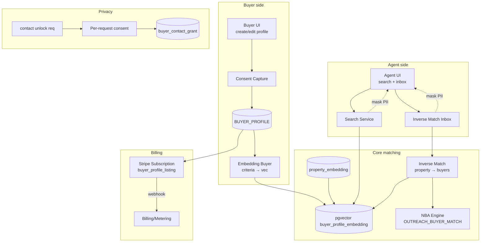

# TECH SPEC — MARKETPLACE TWO-SIDED (Buyer Profiles · Inverse Matching · NBA Agent)
<!-- TECH_SPEC_REVYX_marketplace-two-sided_v1.0.0.md · v1.0.0 · 2026-05 -->
<!-- CONFIDENȚIAL · Uz Intern · © 2026 REVYX · ITPRO SYSTEM SRL -->

## Changelog

| Versiune | Data | Autor | Note |
|---|---|---|---|
| 1.0.0 | 2026-05 | Senior PM + Solution Architect | ★ Spec inițială S8 — marketplace bidirectional · BUYER_PROFILE public/searchable de agenți · matching invers (proprietate ↔ cereri active) · NBA agent „Ai N proprietăți care match cereri active" · billing buyer profile listing ca produs separat (Stripe) |

---

## Cuprins

1. [Executive Summary](#1-executive-summary)
2. [Architecture Overview](#2-architecture-overview)
3. [Stack & Dependencies](#3-stack--dependencies)
4. [Data Model](#4-data-model)
5. [API Contracts](#5-api-contracts)
6. [Algorithms (Inverse Matching · BPS)](#6-algorithms)
7. [State Machines](#7-state-machines)
8. [Concurrency](#8-concurrency)
9. [Caching](#9-caching)
10. [Background Jobs](#10-background-jobs)
11. [Error Handling](#11-error-handling)
12. [Security & Privacy](#12-security--privacy)
13. [Observability](#13-observability)
14. [Performance Budgets](#14-performance-budgets)
15. [Testing Strategy](#15-testing-strategy)
16. [Deployment & Rollout](#16-deployment--rollout)
17. [Migration Strategy](#17-migration-strategy)
18. [Risks & Mitigations](#18-risks--mitigations)
19. [Impact Assessment](#19-impact-assessment)

---

## 1. Executive Summary

★ **Marketplace Two-Sided** extinde REVYX dintr-un sistem orientat-listing într-un marketplace cu două laturi: **proprietăți** (latura existentă, vânzător/agent) și **cereri de cumpărare publice** (latura nouă, cumpărător). Cumpărătorii (lead-uri convertite) pot publica un `BUYER_PROFILE` cu criterii (buget, locație, tip, suprafață, urgență) **vizibil agenților** din rețeaua REVYX.

| Atribut | Valoare |
|---|---|
| **Scope** | Entitate `BUYER_PROFILE` publică · search agent · matching invers (proprietate → cereri match) · NBA agent „Ai N proprietăți match" · billing per buyer profile (Stripe addon) · privacy/consent strict |
| **Referință BRD** | §4 Entități · §5 Pilon 03 (Match) · §9.4 GDPR · §6.1 Lead Firewall (BR-01) |
| **Phase** | 5 (Maturitate platformă) |
| **Owner tehnic** | Solution Architect + Product · Owner business: PM Marketplace |
| **Dependențe upstream** | LEAD entity (intake & consent) · Match Engine v2 (pgvector) · NBA Engine v1 · Billing/Metering S7 (Stripe) |
| **Dependențe downstream** | Property Engine (PS) · NBA Engine (acțiuni noi) · UI agent (search + inbox) |

**Garanții:**

1. **Consent explicit dual** la creare BUYER_PROFILE: (a) GDPR base consent + (b) consent specific „profil public căutabil de agenți" — auditabil, revocabil oricând.
2. **PII minimization:** numele complet și contact NU sunt vizibile public; agenții văd doar criterii + un alias `BUY-XXXX` + buton „solicit contact" → consent flow per request.
3. **Inverse matching** simetric cu Match Engine v2: același pgvector cosine similarity peste embedding combinat (criterii buyer ↔ features property).
4. **NBA agent** cu acțiune nouă `OUTREACH_BUYER_MATCH` când agent are proprietăți cu `score ≥ 0.65` față de cereri active (BR-01 Lead Firewall echivalent — `BPS ≥ 0.65 + contact_unlock_eligible`).
5. **Billing:** publish buyer profile = produs Stripe `revyx_buyer_profile_listing` cu prețuri tier (Free/Pro/Premium) — Pro extinde TTL la 90 zile + alerte push.
6. **Backwards compat:** Match Engine v2 nu se modifică structural; spec adaugă **inverse query path** peste același index.

---

## 2. Architecture Overview



### 2.1 Data flow

1. Buyer (lead convertit) creează `BUYER_PROFILE` în UI public sau în webview agent assist.
2. Consent dual capturat → `BUYER_PROFILE.status = ACTIVE` (sau `PENDING_PAYMENT` pentru tier Pro/Premium).
3. Embedding generat din criterii structurate (city/district/type/rooms/area_min/area_max/budget_min/budget_max/condition/urgency/features_array).
4. Search agent: query text + filtre → search ranked în pgvector.
5. Inverse match: pentru fiecare property activă a agentului, top-k buyer profiles match (`BPS ≥ 0.65`).
6. NBA Engine consumă match-uri → emite `OUTREACH_BUYER_MATCH` task (max 3 active per agent — BR-04 respectat).
7. Agent solicită contact → `buyer_contact_grant` workflow → buyer aprobă → contact dezvăluit (audit complet).
8. Billing: Stripe subscription per buyer profile; webhook → `metering` event.

---

## 3. Stack & Dependencies

| Layer | Tehnologie | Versiune | Justificare |
|---|---|---|---|
| Backend | Node.js + TypeScript | 20 LTS | Stack standard |
| DB | PostgreSQL + pgvector | 16.x · pgvector 0.7+ | Reuse Match v2 index strategy |
| Cache | Redis | 7.x | Search cache · contact-unlock rate limit |
| Search | pgvector HNSW + GIN tsvector hybrid | — | Vector + lexical pentru orașe/cuvinte cheie |
| Billing | Stripe | latest | Subscription + metered usage |
| Audit | `auditLogger` v1.0.0 | — | `BUYER_PROFILE_*`, `BUYER_CONTACT_GRANT_*` |
| Notif | Push + email | — | Buyer alerts + agent inbox digest |

---

## 4. Data Model

### 4.1 Tabel `buyer_profile`

```sql
-- Migrare: 0510_buyer_profile.sql
CREATE TABLE IF NOT EXISTS buyer_profile (
  buyer_profile_id      UUID         PRIMARY KEY DEFAULT gen_random_uuid(),
  tenant_id             UUID         NOT NULL,                       -- agency context (creator); search global multi-tenant gated
  lead_id               UUID         NOT NULL REFERENCES lead(lead_id),
  alias                 TEXT         NOT NULL UNIQUE,                -- 'BUY-X8K3' generat
  status                TEXT         NOT NULL CHECK (status IN ('DRAFT','PENDING_PAYMENT','ACTIVE','PAUSED','EXPIRED','REVOKED')),

  -- Criterii (structured)
  city                  TEXT         NOT NULL,
  districts             TEXT[]       NOT NULL DEFAULT '{}',
  property_type         TEXT[]       NOT NULL,                       -- ['apartment','house']
  rooms_min             SMALLINT     NULL CHECK (rooms_min >= 0),
  rooms_max             SMALLINT     NULL CHECK (rooms_max >= rooms_min),
  area_sqm_min          NUMERIC(8,2) NULL,
  area_sqm_max          NUMERIC(8,2) NULL,
  budget_eur_min        NUMERIC(14,2) NULL,
  budget_eur_max        NUMERIC(14,2) NOT NULL CHECK (budget_eur_max > 0),
  condition_grades      TEXT[]       NOT NULL DEFAULT '{}',
  features_required     TEXT[]       NOT NULL DEFAULT '{}',          -- ['parking','elevator']
  features_nice         TEXT[]       NOT NULL DEFAULT '{}',
  urgency               TEXT         NOT NULL CHECK (urgency IN ('IMMEDIATE','3M','6M','12M','EXPLORATORY')),

  -- Visibility & consent
  consent_public        BOOLEAN      NOT NULL,                       -- distinct de GDPR base
  consent_public_at     TIMESTAMPTZ  NOT NULL,
  consent_revoked_at    TIMESTAMPTZ  NULL,
  pii_visibility        TEXT         NOT NULL DEFAULT 'MASKED'
                        CHECK (pii_visibility IN ('MASKED','ON_GRANT')),

  -- Lifecycle
  tier                  TEXT         NOT NULL DEFAULT 'FREE'
                        CHECK (tier IN ('FREE','PRO','PREMIUM')),
  ttl_days              INTEGER      NOT NULL DEFAULT 30,
  expires_at            TIMESTAMPTZ  NOT NULL,
  paused_at             TIMESTAMPTZ  NULL,
  paused_reason         TEXT         NULL,

  -- Quality / scoring
  bps_max_recent        NUMERIC(4,3) NULL,                            -- max BPS observat în 7d (UI)
  views_total           INTEGER      NOT NULL DEFAULT 0,
  contact_grants_total  INTEGER      NOT NULL DEFAULT 0,

  version               INTEGER      NOT NULL DEFAULT 1,
  created_at            TIMESTAMPTZ  NOT NULL DEFAULT NOW(),
  updated_at            TIMESTAMPTZ  NOT NULL DEFAULT NOW()
);

CREATE INDEX IF NOT EXISTS idx_bp_active_city    ON buyer_profile (city) WHERE status='ACTIVE';
CREATE INDEX IF NOT EXISTS idx_bp_active_type    ON buyer_profile USING GIN (property_type) WHERE status='ACTIVE';
CREATE INDEX IF NOT EXISTS idx_bp_active_districts ON buyer_profile USING GIN (districts) WHERE status='ACTIVE';
CREATE INDEX IF NOT EXISTS idx_bp_lead           ON buyer_profile (lead_id);
CREATE INDEX IF NOT EXISTS idx_bp_expires        ON buyer_profile (expires_at) WHERE status='ACTIVE';
```

### 4.2 Tabel `buyer_profile_embedding`

```sql
-- Migrare: 0511_buyer_profile_embedding.sql
CREATE TABLE IF NOT EXISTS buyer_profile_embedding (
  buyer_profile_id      UUID         PRIMARY KEY REFERENCES buyer_profile(buyer_profile_id) ON DELETE CASCADE,
  embedding             vector(384)  NOT NULL,
  embedding_model       TEXT         NOT NULL,        -- 'multilingual-mpnet-v2' (consistent cu Match v2)
  refreshed_at          TIMESTAMPTZ  NOT NULL DEFAULT NOW()
);
CREATE INDEX IF NOT EXISTS idx_bp_embed_hnsw ON buyer_profile_embedding USING hnsw (embedding vector_cosine_ops);
```

### 4.3 Tabel `buyer_contact_grant`

```sql
-- Migrare: 0512_buyer_contact_grant.sql
CREATE TABLE IF NOT EXISTS buyer_contact_grant (
  grant_id              UUID         PRIMARY KEY DEFAULT gen_random_uuid(),
  buyer_profile_id      UUID         NOT NULL REFERENCES buyer_profile(buyer_profile_id),
  requesting_agent_id   UUID         NOT NULL,
  requesting_tenant_id  UUID         NOT NULL,
  property_id_context   UUID         NULL,             -- proprietatea pentru care agentul cere contact
  status                TEXT         NOT NULL CHECK (status IN ('REQUESTED','APPROVED','DENIED','EXPIRED','REVOKED')),
  requested_at          TIMESTAMPTZ  NOT NULL DEFAULT NOW(),
  decided_at            TIMESTAMPTZ  NULL,
  expires_at            TIMESTAMPTZ  NOT NULL,         -- TTL 30 zile post-approval
  revoked_at            TIMESTAMPTZ  NULL,
  message_to_buyer      TEXT         NULL,             -- pitch initial agent (max 500 chars)
  UNIQUE (buyer_profile_id, requesting_agent_id, property_id_context)   -- 1 cerere per (agent, property) pe profile
);
CREATE INDEX IF NOT EXISTS idx_grant_buyer ON buyer_contact_grant (buyer_profile_id, status);
CREATE INDEX IF NOT EXISTS idx_grant_agent ON buyer_contact_grant (requesting_agent_id, status);
```

### 4.4 Tabel `buyer_match_score`

Snapshot inverse-match per (property × buyer_profile) — refreshed event-driven și prin cron de garbage collection.

```sql
-- Migrare: 0513_buyer_match_score.sql
CREATE TABLE IF NOT EXISTS buyer_match_score (
  match_id              UUID         PRIMARY KEY DEFAULT gen_random_uuid(),
  property_id           UUID         NOT NULL,
  buyer_profile_id      UUID         NOT NULL REFERENCES buyer_profile(buyer_profile_id),
  bps                   NUMERIC(4,3) NOT NULL CHECK (bps BETWEEN 0 AND 1),
  vec_sim               NUMERIC(4,3) NOT NULL,
  budget_fit            NUMERIC(4,3) NOT NULL,
  geo_fit               NUMERIC(4,3) NOT NULL,
  features_fit          NUMERIC(4,3) NOT NULL,
  factors               JSONB        NOT NULL,
  is_current            BOOLEAN      NOT NULL DEFAULT TRUE,
  computed_at           TIMESTAMPTZ  NOT NULL DEFAULT NOW(),
  expires_at            TIMESTAMPTZ  NOT NULL,
  UNIQUE (property_id, buyer_profile_id, is_current) DEFERRABLE INITIALLY DEFERRED
);
CREATE INDEX IF NOT EXISTS idx_bms_property_active
  ON buyer_match_score (property_id, bps DESC) WHERE is_current = TRUE;
CREATE INDEX IF NOT EXISTS idx_bms_buyer_active
  ON buyer_match_score (buyer_profile_id, bps DESC) WHERE is_current = TRUE;
```

### 4.5 Tabel `buyer_profile_billing_subscription`

```sql
-- Migrare: 0514_buyer_profile_billing.sql
CREATE TABLE IF NOT EXISTS buyer_profile_billing_subscription (
  subscription_id       UUID         PRIMARY KEY DEFAULT gen_random_uuid(),
  buyer_profile_id      UUID         NOT NULL REFERENCES buyer_profile(buyer_profile_id),
  stripe_subscription_id TEXT        NOT NULL UNIQUE,
  stripe_customer_id    TEXT         NOT NULL,
  product               TEXT         NOT NULL,        -- 'revyx_buyer_profile_listing'
  tier                  TEXT         NOT NULL CHECK (tier IN ('FREE','PRO','PREMIUM')),
  status                TEXT         NOT NULL CHECK (status IN ('TRIALING','ACTIVE','PAST_DUE','CANCELED','UNPAID')),
  current_period_start  TIMESTAMPTZ  NOT NULL,
  current_period_end    TIMESTAMPTZ  NOT NULL,
  created_at            TIMESTAMPTZ  NOT NULL DEFAULT NOW(),
  updated_at            TIMESTAMPTZ  NOT NULL DEFAULT NOW()
);
CREATE INDEX IF NOT EXISTS idx_bp_sub_active ON buyer_profile_billing_subscription (buyer_profile_id) WHERE status='ACTIVE';
```

### 4.6 Multi-tenancy & search visibility

Search pe `buyer_profile` este **global multi-tenant** (federat) **doar pentru `consent_public=TRUE` + `status='ACTIVE'`**. Tenant-ul vede toate buyer_profiles publice indiferent de `tenant_id`. PII rămâne mascată până la `buyer_contact_grant.status='APPROVED'`.

---

## 5. API Contracts

### 5.1 Buyer-facing (public)

| Method | Path | Auth | Descriere |
|---|---|---|---|
| `POST` | `/api/v1/buyer-profiles` | buyer JWT | Create profile (status DRAFT) |
| `POST` | `/api/v1/buyer-profiles/:id/publish` | buyer JWT | Publish (consent recheck + Stripe subscribe) |
| `PATCH` | `/api/v1/buyer-profiles/:id` | buyer JWT | Update criteria (re-embed) |
| `POST` | `/api/v1/buyer-profiles/:id/pause` | buyer JWT | Pause (status PAUSED) |
| `DELETE` | `/api/v1/buyer-profiles/:id` | buyer JWT | Revoke + soft-delete (30d retention) |
| `GET` | `/api/v1/buyer-profiles/:id/grants` | buyer JWT | Lista contact requests |
| `POST` | `/api/v1/buyer-contact-grants/:gid/decision` | buyer JWT | Body `{decision: 'APPROVED'|'DENIED'}` |

### 5.2 Agent-facing

| Method | Path | RBAC | Descriere |
|---|---|---|---|
| `GET` | `/api/v1/marketplace/buyer-profiles?city=&type=&...` | agent+ | Search buyer profiles (PII masked) |
| `GET` | `/api/v1/marketplace/buyer-profiles/:id` | agent+ | View detail (masked) |
| `POST` | `/api/v1/marketplace/buyer-profiles/:id/contact-request` | agent+ | Body `{property_id, message}` (rate limited 5/zi/agent) |
| `GET` | `/api/v1/marketplace/inbox` | agent+ | Inverse matches pentru proprietățile mele |
| `GET` | `/api/v1/marketplace/inbox/property/:pid` | agent (own) | Top-k buyers pentru property (BPS desc) |

### 5.3 Internal interfaces

```typescript
interface BuyerProfile { /* mirror schema 4.1 */ }

interface IInverseMatcher {
  topBuyersForProperty(propertyId: string, k?: number): Promise<BuyerMatch[]>;
  topPropertiesForBuyer(buyerProfileId: string, k?: number): Promise<PropertyMatch[]>;
  recompute(input: { propertyId?: string; buyerProfileId?: string }): Promise<void>;
}

interface IBuyerNbaProducer {
  // Emite OUTREACH_BUYER_MATCH în NBA pentru agent dacă BPS_max ≥ 0.65 și agent are sub 3 task-uri
  produceForAgent(agentId: string): Promise<{ tasksEmitted: number }>;
}
```

---

## 6. Algorithms

### 6.1 Embedding criterii buyer

Criteriile sunt serializate într-un text canonic + atribute structurate; embedding-ul reutilizează modelul Match v2 (`multilingual-mpnet-v2`, 384d).

```typescript
function canonicalize(b: BuyerProfile): string {
  const tier = b.urgency === 'IMMEDIATE' ? 'urgent' : b.urgency.toLowerCase();
  const types = b.property_type.join('/');
  const districts = b.districts.length ? `, districte ${b.districts.join('/')}` : '';
  const features = [...b.features_required, ...b.features_nice].slice(0, 8).join(',');
  return `Cumpărător ${tier} caută ${types} în ${b.city}${districts}, `
       + `buget ${b.budget_eur_min ?? 0}-${b.budget_eur_max} EUR, `
       + `${b.rooms_min ?? '?'}-${b.rooms_max ?? '?'} camere, `
       + `${b.area_sqm_min ?? '?'}-${b.area_sqm_max ?? '?'} mp, `
       + (features ? `dotări: ${features}` : '');
}
```

### 6.2 Buyer–Property Score (BPS)

```typescript
// BPS ∈ [0,1]
function bps(p: Property, b: BuyerProfile, vecSim: number): { bps: number; parts: BpsParts } {
  const budgetFit = budgetFitFn(p.price_amount_eur, b.budget_eur_min, b.budget_eur_max);
  const geoFit    = geoFitFn(p, b);
  const featFit   = featuresFitFn(p, b);
  const typeOk    = b.property_type.includes(p.property_type) ? 1 : 0;
  const roomsOk   = roomsMatchFn(p.rooms, b.rooms_min, b.rooms_max);
  const areaOk    = areaMatchFn(p.area_sqm, b.area_sqm_min, b.area_sqm_max);

  // Hard gates (BPS=0): tip incorect sau în afara budget cu >20%
  if (typeOk === 0) return { bps: 0, parts: zero };
  if (budgetFit < 0.20) return { bps: 0, parts: zero };

  const bps = clamp01(
    0.30 * vecSim     +
    0.25 * budgetFit  +
    0.20 * geoFit     +
    0.15 * featFit    +
    0.05 * roomsOk    +
    0.05 * areaOk
  );
  return { bps, parts: { vecSim, budgetFit, geoFit, featFit, roomsOk, areaOk } };
}

function budgetFitFn(price: number, lo: number|null, hi: number): number {
  if (price <= hi && (lo === null || price >= lo)) return 1.0;
  if (price > hi) {
    const over = (price - hi) / hi;
    return clamp01(1 - over * 5);                  // -20% over → 0
  }
  // price below lo (atypical) — still fit
  return 0.95;
}
```

### 6.3 Inverse matching query

```sql
-- Top-K buyer profiles pentru o proprietate, pgvector cosine + filtre hard
WITH p AS (SELECT * FROM property WHERE property_id = $1),
     pe AS (SELECT embedding FROM property_embedding WHERE property_id = $1),
     candidates AS (
       SELECT bp.buyer_profile_id, bp.tenant_id, bp.alias,
              (1 - (bpe.embedding <=> pe.embedding)) AS vec_sim
       FROM buyer_profile bp
       JOIN buyer_profile_embedding bpe USING (buyer_profile_id), pe, p
       WHERE bp.status = 'ACTIVE'
         AND bp.consent_public = TRUE
         AND bp.expires_at > NOW()
         AND bp.city = p.city
         AND p.property_type = ANY (bp.property_type)
         AND p.price_amount_eur <= bp.budget_eur_max * 1.20
         AND (bp.budget_eur_min IS NULL OR p.price_amount_eur >= bp.budget_eur_min * 0.80)
       ORDER BY bpe.embedding <=> pe.embedding ASC
       LIMIT 50
     )
SELECT * FROM candidates;
```

Apoi în Node se calculează `BPS` pe candidați, se sortează și se persistă top-K (default 20) în `buyer_match_score`.

### 6.4 NBA agent — `OUTREACH_BUYER_MATCH`

```typescript
// Trigger: cron 30 min OR event 'buyer_profile.published' OR 'property.created'
async function produceNbaForAgent(agentId: string) {
  const activeTasks = await nba.countActive(agentId);
  if (activeTasks >= 3) return { tasksEmitted: 0 };          // BR-04

  const props = await listAgentProperties(agentId, 'ACTIVE');
  let emitted = 0;
  for (const p of props) {
    const top = await inverseMatcher.topBuyersForProperty(p.property_id, 5);
    const eligible = top.filter(m => m.bps >= 0.65);          // BR-01-equivalent
    if (eligible.length === 0) continue;

    await nba.upsertTask({
      tenantId: p.tenant_id, agentId,
      type: 'OUTREACH_BUYER_MATCH',
      title: `Ai ${eligible.length} cerere(i) de cumpărare match pentru "${p.title}"`,
      payload: { property_id: p.property_id, buyer_aliases: eligible.map(e => e.alias) },
      priority: maxBps(eligible),                              // [0..1] mapped la NBA scale
      slaMinutes: 240,                                         // 4h ≈ matching nou nu critic ca lead HOT
    });
    emitted++;
    if (await nba.countActive(agentId) >= 3) break;            // re-check guard
  }
  return { tasksEmitted: emitted };
}
```

NBA priority NBA-scale [0, 2.0] derivat: `priority = 1.2 + 0.5 × maxBps` (mid-band; lead HOT rămâne >1.7).

### 6.5 Contact unlock (consent per-request)

```typescript
async function requestContactUnlock(input: { agentId, buyerProfileId, propertyId, message }) {
  // Rate limit: 5/zi/agent total cross-tenant; +1 per buyer cap via UNIQUE
  if (await rateLimit.exceeded(`contact_req:${input.agentId}`, 5, '24h')) throw E('RATE_LIMITED');

  const grant = await db.insertInto('buyer_contact_grant').values({
    buyer_profile_id: input.buyerProfileId,
    requesting_agent_id: input.agentId,
    requesting_tenant_id: input.tenantId,
    property_id_context: input.propertyId,
    status: 'REQUESTED',
    expires_at: addDays(new Date(), 30),
    message_to_buyer: input.message?.slice(0, 500),
  }).returningAll().executeTakeFirstOrThrow();

  await notify.toBuyer(input.buyerProfileId, { type: 'CONTACT_REQUEST', grantId: grant.grant_id });
  await audit('BUYER_CONTACT_REQUEST', { grantId: grant.grant_id, agentId: input.agentId });
  return grant;
}

async function decideGrant(grantId: string, decision: 'APPROVED'|'DENIED') {
  // Optimistic locking via status='REQUESTED' guard
  const r = await db.updateTable('buyer_contact_grant').set({
      status: decision, decided_at: new Date(),
    })
    .where('grant_id','=',grantId).where('status','=','REQUESTED')
    .executeTakeFirst();
  if (r.numUpdatedRows === 0n) throw E('GRANT_ALREADY_DECIDED');
  await audit(decision === 'APPROVED' ? 'BUYER_CONTACT_GRANT_APPROVED' : 'BUYER_CONTACT_GRANT_DENIED', { grantId });
}
```

PII expunere: `GET /buyer-profiles/:id` returnează contact (lead.name, phone, email) **doar dacă** există un grant `APPROVED` pentru `(buyer_profile_id, requesting_agent_id)` neexpirat. Altfel `MASKED`.

### 6.6 Re-embedding triggers

| Trigger | Acțiune |
|---|---|
| `buyer_profile.PATCH criteria` | Re-canonicalize + re-embed + invalidate `buyer_match_score` curente · enqueue inverse-recompute pentru top properties |
| `property.changed{price|features}` | Recompute top buyers pentru property |
| Cron `buyer.expiry.scan` orar | `expires_at < NOW` → status EXPIRED + notify buyer |
| `Stripe webhook subscription.updated` | Sync tier · ajusta `ttl_days` (FREE 30 / PRO 90 / PREMIUM 180) |

---

## 7. State Machines

### 7.1 BUYER_PROFILE lifecycle

```
DRAFT ──publish (tier FREE)──> ACTIVE
DRAFT ──publish (tier PRO/PREMIUM)──> PENDING_PAYMENT ──Stripe success──> ACTIVE
ACTIVE ──pause──> PAUSED ──resume──> ACTIVE
ACTIVE ──expires_at < NOW──> EXPIRED
ACTIVE ──revoke / GDPR right to erasure──> REVOKED (soft-delete 30d retention)
PENDING_PAYMENT ──Stripe fail──> DRAFT
```

### 7.2 buyer_contact_grant

```
REQUESTED ──approve──> APPROVED ──expires_at(30d)──> EXPIRED
REQUESTED ──deny──> DENIED
APPROVED ──buyer revoke──> REVOKED
```

---

## 8. Concurrency

- **Optimistic locking** pe `buyer_profile.version` — re-fetch + retry max 3× la conflict.
- **Inverse-match recompute** idempotent pe (property_id, buyer_profile_id) cu `is_current` flag — UNIQUE deferrable păstrează atomicitatea.
- **NBA producer** advisory lock per agent: `pg_advisory_xact_lock(hashtext('nba:'||agent_id))` pentru a evita 2 produceri simultane care depășesc cap-ul de 3 active.
- **Stripe webhook idempotent:** `stripe_event_id` UNIQUE; replay gated.

---

## 9. Caching

| Key Redis | Conținut | TTL | Invalidare |
|---|---|---|---|
| `bp:search:{hash(filters)}` | rezultate search | 60s | event `buyer_profile.published/changed` |
| `bp:topbuyers:{propertyId}` | top-20 buyers | 5 min | event `buyer_profile.changed` sau `property.changed` |
| `bp:topprops:{buyerId}` | top-20 properties | 5 min | event `property.changed` în city |
| `bp:nba:agent:{agentId}` | last produced timestamp | 30 min | re-produce gated |
| `bp:contact_req:{agentId}` | counter rate limit | 24h | sliding window |

---

## 10. Background Jobs

| Job | Trigger | Idempotent |
|---|---|---|
| `bp.embedding.refresh` | event `buyer_profile.changed` | DA |
| `bp.inverse.recompute.property` | event `property.changed` | DA |
| `bp.inverse.recompute.buyer` | event `buyer_profile.changed` | DA |
| `bp.expiry.scan` | cron orar | DA |
| `bp.nba.producer` | cron 30 min + events | DA |
| `bp.stripe.sync` | webhook | DA (event_id UNIQUE) |
| `bp.gc.match_scores` | cron zilnic | DA — purge `is_current=false` >30d |
| `bp.consent.audit_export` | cron lunar | DA — pentru DPO |

---

## 11. Error Handling

| Cod | Caz | Răspuns |
|---|---|---|
| `BP_CONSENT_MISSING` | publish fără consent_public | 422 |
| `BP_BUDGET_INVALID` | budget_eur_max ≤ 0 | 422 |
| `BP_RATE_LIMITED` | >5 contact requests/24h/agent | 429 |
| `BP_GRANT_ALREADY_DECIDED` | concurrent decision | 409 |
| `BP_NOT_PUBLIC` | search returnează profile non-public (bug) | 500 + alert |
| `BP_PII_LEAK_GUARD` | masking layer fail-open | 500 + alert CRITICAL |
| `BP_STRIPE_DESYNC` | local status vs Stripe drift | 503 + repair job |

---

## 12. Security & Privacy

### 12.1 RBAC

| Rol | Permisiuni |
|---|---|
| `buyer` (lead convertit) | CRUD own buyer_profile · decide grants · revoke |
| `agent` | search public profiles · contact request · view inbox own |
| `senior_agent` | + bulk contact suggestions |
| `team_lead` | + view inbox team |
| `manager` | + view inbox agency |
| `admin` | config tier prices · forced revoke (compliance) |

### 12.2 GDPR

- **Lawful basis (Art. 6):** consent (Art. 6(1)(a)) cu opt-in dual la creare profil.
- **Art. 5 minimization:** doar criteriile sunt publice; PII (nume, telefon, email) NU.
- **Art. 17 erasure:** `DELETE` profile → status REVOKED + `lead.contact_pii` păstrat doar dacă există alte baze legale; embedding și match scores șterse imediat.
- **Art. 15 access:** export JSON `GET /buyer-profiles/:id/export` cu toate datele + grants + audit.
- **Art. 21 obiecție profilare:** dacă buyer obiectează la inverse-matching, status='PAUSED' + zero embedding refresh.
- **DPIA:** necesar — risc mediu (PII pseudonimizat dar comportament profilat). Anexat la documentația ISO 27001.

### 12.3 Audit events

`BUYER_PROFILE_CREATED`, `BUYER_PROFILE_PUBLISHED`, `BUYER_PROFILE_UPDATED`, `BUYER_PROFILE_PAUSED`, `BUYER_PROFILE_EXPIRED`, `BUYER_PROFILE_REVOKED`, `BUYER_CONTACT_REQUEST`, `BUYER_CONTACT_GRANT_APPROVED`, `BUYER_CONTACT_GRANT_DENIED`, `BUYER_CONTACT_GRANT_REVOKED`, `BUYER_PII_REVEALED` (la fiecare GET cu unmask), `BUYER_BILLING_TIER_CHANGED`.

### 12.4 Anti-abuse

- Agent care primește >3 `DENIED` consecutive → cool-down 24h pe contact-request.
- Buyer profile spam guard: max 2 active profiles per `lead_id`.
- Heuristic "agent farming" (>50 contact requests cross-tenant/24h tenant-aggregated) → flag manual review.

### 12.5 Rate limiting

| Endpoint | Limit |
|---|---|
| `POST /contact-request` | 5/zi/agent · 200/zi/tenant |
| `POST /buyer-profiles` | 5/oră/lead |
| `PATCH /buyer-profiles/:id` | 20/zi/profile |
| `GET /marketplace/buyer-profiles` | 60/min/user |

---

## 13. Observability

| Metric | Tip | Alert |
|---|---|---|
| `bp_active_total{tenant}` | gauge | drop >20% wow |
| `bp_search_p95_ms` | histogram | p95 > 400ms |
| `bp_inverse_recompute_lag_s` | histogram | p95 > 60s |
| `bp_contact_request_rate{agent}` | counter | >5/zi → throttle |
| `bp_pii_unmask_total` | counter | spike → audit |
| `bp_grant_approval_rate_24h` | gauge | <10% → product issue |
| `bp_stripe_sync_lag_s` | histogram | p95 > 300s |

Dashboard: `REVYX / Marketplace Two-Sided`.

---

## 14. Performance Budgets

| Metric | Target |
|---|---|
| `GET /marketplace/buyer-profiles` (search) | p95 < 400ms (1M profiles) |
| `topBuyersForProperty` k=20 | p95 < 250ms |
| `produceNbaForAgent` (10 properties) | p95 < 800ms |
| `POST /contact-request` | p95 < 200ms |
| Stripe webhook → DB sync | p99 < 60s |

---

## 15. Testing Strategy

### 15.1 Unit
- `bps()` — boundary tests (typeOk=0, budgetFit=0.20, vecSim=0/1).
- `budgetFitFn` — over budget 5%/10%/20%/25%.
- `requestContactUnlock` — rate limit boundary.
- `decideGrant` — concurrent transitions.
- Canonicalize → embedding determinism (snapshot).

### 15.2 Integration
- Publish profile → embedding generated → searchable in <30s.
- PATCH criteria → embeddings refresh → match scores invalidated.
- Contact request → buyer notify → approve → PII revealed (audit).
- Profile expires → status EXPIRED + matches `is_current=false`.
- Stripe webhook subscription.updated → tier/ttl synced.

### 15.3 E2E
- Buyer creează profil PRO → Stripe payment succes → ACTIVE 90 zile → agent vede în search → contact request → buyer approve → PII unmask → conversie deal.
- Privacy regression: search rezultate NU conțin PII niciodată în absența grant-ului APPROVED.
- GDPR erasure: DELETE → embedding/matches șterse imediat · profile soft-deleted 30d.

### 15.4 Load
- 100k buyer_profiles active · 1M properties · top-20 inverse match p95 ≤ 250ms.
- 50 events/sec property updates → recompute backlog ≤ 60s.

### 15.5 Chaos
- Stripe webhook delayed 30 min → PENDING_PAYMENT recovery.
- pgvector index rebuild — fallback la lexical+filters până la HNSW ready.

### 15.6 Coverage

| Layer | Coverage |
|---|---|
| `bps()` + sub-formule | ≥99% |
| Privacy/PII unmask path | ≥99% |
| API handlers | ≥90% |
| Stripe sync | ≥95% |
| NBA producer | ≥95% |

---

## 16. Deployment & Rollout

| Aspect | Detaliu |
|---|---|
| Feature flag | `flag.marketplace_two_sided.enabled` (per tenant initial) |
| Rollout | Pilot 3 tenant 4 săpt → 25% → 100% în 8 săpt |
| Soft launch | Tier FREE only la pilot; PRO/PREMIUM activate la GA |
| Privacy review | Mandatory DPO sign-off pre-pilot |
| Rollback | Flag OFF → search hidden, NBA producer disabled, profile creation blocked; date păstrate intacte |

---

## 17. Migration Strategy

```
0510_buyer_profile.sql
0511_buyer_profile_embedding.sql
0512_buyer_contact_grant.sql
0513_buyer_match_score.sql
0514_buyer_profile_billing.sql
```

Idempotente. Backfill: zero (entitate nouă). Stripe products + prices create via Terraform/IaC (out-of-scope — în S7 billing-metering).

---

## 18. Risks & Mitigations

| # | Risc | Probab. | Impact | Mitigare |
|---|---|---|---|---|
| R1 | Buyer spam profile fals | MED | MED | Verificare phone OTP + GDPR consent + limit 2/lead |
| R2 | Agent farming PII | MED | HIGH | Rate limit 5/zi · cool-down · denial pattern detection |
| R3 | PII leak via API masking bug | LOW | CRITICAL | Test snapshot regression · Privacy PR review checklist · DPIA |
| R4 | Cross-tenant search abuse | MED | MED | Same multi-tenant search dar audit `BUYER_PII_REVEALED` per request |
| R5 | Cold-start cu 0 buyer profiles → no value | HIGH | MED | Seed pe tenant pilot · agent assist creare profile pentru lead-uri existente |
| R6 | Stripe webhook lost → status drift | LOW | MED | Reconciliation cron zilnic · Stripe API GET fallback |
| R7 | Inverse matching cost (10k properties × 100k buyers) | MED | MED | pgvector HNSW · top-K cu hard prefilter (city/type/budget) |
| R8 | Buyer revoke după contact deal in progress | LOW | HIGH | `lead.contact_pii` păstrat sub bază legală "execution of contract" Art. 6(1)(b) cu DPO sign-off |
| R9 | Tier downgrade brusc → 90→30 zile loss | LOW | LOW | Grace 7 zile + email notice |

---

## 19. Impact Assessment

### 19.1 Scope of Change

| Element | Detaliu |
|---|---|
| Document | TECH_SPEC_REVYX_marketplace-two-sided_v1.0.0.md |
| Tip | NEW (S8 deliverable #2) |
| Aria | Match v2 inverse path · NBA action nouă · billing addon · GDPR |
| Origine | S8 brief — marketplace bidirectional |

### 19.2 Impact pe documente conexe

| Document | Impact | Acțiune |
|---|---|---|
| `match-engine` v2.0.0 | Minor | Inverse path documentat aici, index reused; nicio modificare contract Match |
| `nba-engine` v1.0.0 | Minor | Tip task nou `OUTREACH_BUYER_MATCH` · cap BR-04 respectat |
| `lead-scoring` v1.0.0 | None | LEAD rămâne sursă pentru BUYER_PROFILE.lead_id |
| BRD | Minor | §4 entități: BUYER_PROFILE adăugat ★; Pilon 03 extins inverse |
| `audit-log` v1.0.0 | Minor | Catalog event extins `BUYER_*` |
| `webhook-intake` v1.0.0 | None | Stripe webhook reused |

### 19.3 Impact pe scoring

| Scor | Afectat? | Detaliu |
|---|---|---|
| BPS (nou) | DA | Scor [0,1] adăugat — ★ noua formulă §6.2 |
| LS, PS, IS, TS, DHI, NBA | NU | NBA nou tip task, dar formula priority neschimbată |
| DP | NU | Marketplace e canal alternativ, nu schimbă DP property↔lead existent |

### 19.4 Impact pe entități / schema BD

| Entitate | Modificare | Migrare |
|---|---|---|
| `buyer_profile` | NEW | 0510 |
| `buyer_profile_embedding` | NEW | 0511 |
| `buyer_contact_grant` | NEW | 0512 |
| `buyer_match_score` | NEW | 0513 |
| `buyer_profile_billing_subscription` | NEW | 0514 |

### 19.5 Impact pe RBAC

| Rol | Permisiuni adăugate |
|---|---|
| `buyer` (rol nou ★ pentru endpoint public) | CRUD own profile · decide grants |
| `agent`+ | search · contact request · inbox |
| `admin` | tier config · forced revoke |

### 19.6 Impact pe SLA & NFR

| NFR | Înainte | După |
|---|---|---|
| Search p95 | nedefinit | < 400ms (1M profiles) |
| Inverse match recompute | nedefinit | < 60s post property change |
| Contact request rate | nedefinit | 5/zi/agent |

### 19.7 Securitate & GDPR

| Aspect | Status | Notă |
|---|---|---|
| PII | DA — pseudonimizat | DPIA obligatoriu |
| AUDIT events | DA | §12.3 |
| Consent dual | DA | §12.2 |
| Rate limiting | DA | §12.5 |

### 19.8 Test Plan

Vezi §15. Privacy regression test snapshot obligatoriu pre-deploy.

### 19.9 Rollout & Rollback

Pilot 3 tenanți 4 săpt → 25% → 100%. Rollback prin flag OFF (date intacte).

### 19.10 Approval Gate

| Aprobator | Necesar pentru |
|---|---|
| Senior PM | UX flow consent + tier pricing |
| Solution Architect | Schema · inverse query · NBA integration |
| Security Lead | RBAC · audit · PII masking |
| DPO | DPIA · consent dual · GDPR Art. 6/15/17/21 |
| Billing Lead | Stripe products · tier config · webhook idempotency |

---

*docs/tech-spec/TECH_SPEC_REVYX_marketplace-two-sided_v1.0.0.md · v1.0.0 · 2026-05 · CONFIDENȚIAL · Uz Intern*
*REVYX — Real Estate Execution Intelligence · © 2026 REVYX · ITPRO SYSTEM SRL*
