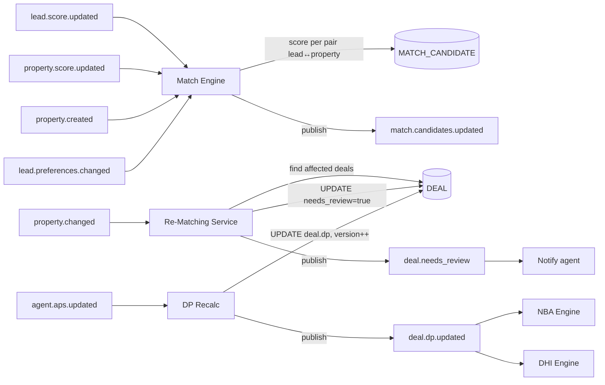

# TECH SPEC — REVYX Match Engine
<!-- TECH_SPEC_REVYX_match-engine_v1.0.0.md · v1.0.0 · 2026-05 -->
<!-- CONFIDENȚIAL · Uz Intern · © 2026 REVYX · ITPRO SYSTEM SRL -->

## Changelog

| Versiune | Data | Autor | Note |
|---|---|---|---|
| 1.0.0 | 2026-05 | Senior PM + Solution Architect | Spec inițială Match Engine — DP=0.30·LS+0.30·PS+0.20·APS+0.20·IS, 12 criterii hard/soft match, re-matching cu needs_review=true (BR-05) · Phase 1 |

---

## Cuprins

1. [Executive Summary](#1-executive-summary)
2. [Architecture Overview](#2-architecture-overview)
3. [Stack & Dependencies](#3-stack--dependencies)
4. [Data Model](#4-data-model)
5. [API Contracts](#5-api-contracts)
6. [Algorithms](#6-algorithms)
7. [State Machines](#7-state-machines)
8. [Concurrency](#8-concurrency)
9. [Caching](#9-caching)
10. [Background Jobs](#10-background-jobs)
11. [Error Handling](#11-error-handling)
12. [Security](#12-security)
13. [Observability](#13-observability)
14. [Performance Budgets](#14-performance-budgets)
15. [Testing Strategy](#15-testing-strategy)
16. [Deployment](#16-deployment)
17. [Migration Strategy](#17-migration-strategy)
18. [Risks & Mitigations](#18-risks--mitigations)
19. [Impact Assessment](#19-impact-assessment)

---

## 1. Executive Summary

Match Engine este nucleul Pilonului 03 (Match Intelligence). Asociază LEAD ↔ PROPERTY prin 12 criterii (hard + soft) și calculează **DP (Deal Probability)** = `0.30·LS + 0.30·PS + 0.20·APS + 0.20·IS` (BRD §7.4). Suportă re-matching automat la modificări inventory cu marcaj `needs_review=true` pe deal-urile afectate (BR-05). În Phase 1 versiunea „explainable" rule-based; pgvector ANN reservat pentru Phase 2 (vezi spec property §10).

| Atribut | Valoare |
|---|---|
| **Scope** | DP calc · 12-criteria match scoring · candidate ranking · re-matching cu needs_review (BR-05) · DEAL creation gate |
| **Referință BRD** | §5 Pilon 03 · §6.1 BR-05/11 · §7.4 DP · §12 T05 (APS_default=0.65) |
| **Phase** | 1 (Core engines · explainable rule-based) |
| **Owner tehnic** | Solution Architect + Senior PM |
| **Dependențe upstream** | lead-scoring v1.0.0 (LS, IS) · property v1.0.0 (PS) · agent (APS, BR-11) |
| **Dependențe downstream** | NBA Engine (DP) · DHI Engine (DP) · Task Allocator (asignare deal-agent) |

**Garanții oferite:**

1. DP ∈ [0, 1] cu clamp explicit (formula §7.4).
2. **APS_default = 0.65** pentru agenți cu `<5 deal-uri` SAU `<30 zile în sistem` (BR-11, T05).
3. 12-criteria match scor ∈ [0, 1] cu hard-stop pe criterii deal-breakers (vezi §6.2).
4. Re-matching trigger pe modificare inventory PROPERTY → DEAL afectat marcat `needs_review=true` · **deal-urile NU se anulează automat** (BR-05).
5. DP recalc ≤ 30 sec după modificare LS/PS/IS/APS (NFR-01 derivat).
6. Match candidate listing pe LEAD: top-K configurat (default 5), sortat desc match_score.

---

## 2. Architecture Overview



### 2.1 Data flow

1. Trigger event: `lead.score.updated`, `property.score.updated`, `property.created`, `lead.preferences.changed`, `agent.aps.updated`.
2. Match Engine calculează scor pereche `(lead, property)` cu 12 criterii (hard filter + soft weight) → INSERT/UPDATE `match_candidate`.
3. Re-Matching Service (`property.changed`): identifică DEAL-urile cu `property_id = X` în status non-terminal, marchează `needs_review=true` (BR-05). Niciun cancel automat.
4. DP Recalc (event-driven): orice schimbare LS/PS/IS/APS → recalc DP pe deal-urile asociate · publish `deal.dp.updated` consumat de NBA + DHI.

### 2.2 Componente principale

| Componentă | Responsabilitate |
|---|---|
| `MatchScorer` | 12-criteria scor pereche · hard-stop deal-breakers · weighted soft factors |
| `MatchRanker` | Top-K candidates per lead · paginare · cache Redis |
| `DPCalculator` | DP = 0.30·LS + 0.30·PS + 0.20·APS + 0.20·IS · clamp01 |
| `APSResolver` | APS sau APS_default=0.65 (BR-11) |
| `ReMatchingService` | BR-05: needs_review pe deal-uri, fără cancel |
| `DealCreationGate` | Politică „creează deal" doar dacă match_score ≥ threshold |

---

## 3. Stack & Dependencies

| Layer | Tehnologie | Versiune | Justificare |
|---|---|---|---|
| Backend | Node.js + TypeScript | 20 LTS · TS 5.x | Stack standard REVYX |
| ORM | Kysely | latest | Type-safe SQL · CTEs explicite |
| DB | PostgreSQL | 16.x | GENERATED columns · GIST/btree indexes |
| Cache | Redis | 7.x | Cache match candidates · DP per deal |
| Queue | BullMQ | latest | Re-matching batch + DP recalc cascade |
| Audit | `auditLogger` | 1.0.0 | DEAL DP changes · needs_review trigger |

**Notă pgvector:** Match Engine v1 e **rule-based explainable**. ANN top-K cu pgvector (HNSW activat în spec property §10 / Phase 3) este integrare separată — Phase 2 (S5+).

---

## 4. Data Model

### 4.1 Tabel `match_candidate`

```sql
-- Migrare: 0110_match_candidate.sql
CREATE TABLE IF NOT EXISTS match_candidate (
  match_id           UUID         PRIMARY KEY DEFAULT gen_random_uuid(),
  tenant_id          UUID         NOT NULL,
  lead_id            UUID         NOT NULL REFERENCES lead(lead_id),
  property_id        UUID         NOT NULL REFERENCES property(property_id),

  match_score        NUMERIC(4,3) NOT NULL CHECK (match_score BETWEEN 0 AND 1),
  match_components   JSONB        NOT NULL,    -- 12 criterii detail
  hard_stop_reasons  TEXT[]       NULL,        -- {'budget_overflow','wrong_city'} → match_score=0

  status             TEXT         NOT NULL DEFAULT 'CANDIDATE'
    CHECK (status IN ('CANDIDATE','SHARED','SHOWING','REJECTED','PROMOTED','STALE')),

  shared_at          TIMESTAMPTZ  NULL,
  promoted_to_deal_at TIMESTAMPTZ NULL,
  promoted_deal_id   UUID         NULL,
  rejected_reason    TEXT         NULL,

  version            BIGINT       NOT NULL DEFAULT 1,
  calculated_at      TIMESTAMPTZ  NOT NULL DEFAULT NOW(),
  created_at         TIMESTAMPTZ  NOT NULL DEFAULT NOW(),

  UNIQUE (tenant_id, lead_id, property_id)
);

CREATE INDEX IF NOT EXISTS idx_match_lead_score
  ON match_candidate (tenant_id, lead_id, match_score DESC)
  WHERE status IN ('CANDIDATE','SHARED');
CREATE INDEX IF NOT EXISTS idx_match_property
  ON match_candidate (tenant_id, property_id, match_score DESC)
  WHERE status IN ('CANDIDATE','SHARED');
```

### 4.2 ALTER `deal` (Phase 1 — DP + needs_review BR-05)

```sql
-- Migrare: 0111_deal_dp.sql
ALTER TABLE deal
  ADD COLUMN IF NOT EXISTS dp                 NUMERIC(4,3) NOT NULL DEFAULT 0 CHECK (dp BETWEEN 0 AND 1),
  ADD COLUMN IF NOT EXISTS dp_components      JSONB        NULL,    -- { ls, ps, aps, is, aps_source }
  ADD COLUMN IF NOT EXISTS dp_calculated_at   TIMESTAMPTZ  NOT NULL DEFAULT NOW(),
  ADD COLUMN IF NOT EXISTS needs_review       BOOLEAN      NOT NULL DEFAULT FALSE,
  ADD COLUMN IF NOT EXISTS needs_review_reason TEXT        NULL,
  ADD COLUMN IF NOT EXISTS needs_review_at    TIMESTAMPTZ  NULL,
  ADD COLUMN IF NOT EXISTS match_id           UUID         NULL REFERENCES match_candidate(match_id);

CREATE INDEX IF NOT EXISTS idx_deal_dp
  ON deal (tenant_id, dp DESC) WHERE status NOT IN ('WON','LOST','CANCELLED');
CREATE INDEX IF NOT EXISTS idx_deal_needs_review
  ON deal (tenant_id, needs_review) WHERE needs_review = TRUE;
```

### 4.3 ALTER `agent` (BR-11)

```sql
-- Migrare: 0112_agent_aps_meta.sql
ALTER TABLE agent
  ADD COLUMN IF NOT EXISTS aps               NUMERIC(4,3) NULL CHECK (aps IS NULL OR aps BETWEEN 0 AND 1),
  ADD COLUMN IF NOT EXISTS aps_calculated_at TIMESTAMPTZ  NULL,
  ADD COLUMN IF NOT EXISTS deal_count_total  INTEGER      NOT NULL DEFAULT 0,
  ADD COLUMN IF NOT EXISTS agent_since_date  DATE         NULL;
```

> APS calc complet în S5 (Phase 2 — Performance Intelligence). Phase 1 folosește APS_default=0.65 când criteriile BR-11 sunt îndeplinite SAU `aps IS NULL`.

### 4.4 Constraints & invariants

| Invariant | Enforcement |
|---|---|
| `match_score ∈ [0,1]` | CHECK + clamp |
| `dp ∈ [0,1]` | CHECK + clamp |
| Unique (tenant, lead, property) per match_candidate | UNIQUE constraint |
| `needs_review` deal NU implică cancel auto (BR-05) | App-level: status nu se modifică |
| `aps` calc fallback la 0.65 dacă <5 deals SAU <30 zile | App-level §6.4 |

---

## 5. API Contracts

### 5.1 Internal services

```typescript
interface MatchScorer {
  scorePair(lead: Lead, property: Property): MatchScore;
  scoreCandidatesForLead(leadId: string, opts?: { topK?: number }): Promise<MatchCandidate[]>;
  scoreCandidatesForProperty(propertyId: string, opts?: { topK?: number }): Promise<MatchCandidate[]>;
}

interface DPCalculator {
  recalcForDeal(dealId: string, reason?: string): Promise<{ dp: number; components: DPComponents }>;
  recalcForLead(leadId: string): Promise<{ updated: number }>;     // cascade pe deal-urile lead-ului
  recalcForProperty(propertyId: string): Promise<{ updated: number }>;
  recalcForAgent(agentId: string): Promise<{ updated: number }>;
}

interface ReMatchingService {
  onPropertyChanged(propertyId: string, changedFields: string[]): Promise<{ flagged: number }>;
}

interface DealCreationGate {
  canPromote(matchId: string): Promise<{ allowed: boolean; reason?: string }>;
}
```

### 5.2 REST endpoints

| Method | Path | RBAC | Descriere |
|---|---|---|---|
| `GET` | `/api/v1/leads/:id/matches?top=5` | agent (own) / team_lead+ | Top candidates property pentru lead |
| `GET` | `/api/v1/properties/:id/matches?top=5` | agent / team_lead+ | Top leads pentru property |
| `POST` | `/api/v1/matches/:id/share` | agent | Marchează SHARED (trimis buyer) |
| `POST` | `/api/v1/matches/:id/promote` | agent (own) | Creează DEAL din match |
| `POST` | `/api/v1/matches/:id/reject` | agent (own) | RejECT cu reason |
| `GET` | `/api/v1/deals/:id/dp` | agent (own) / team_lead+ | DP + componente |
| `GET` | `/api/v1/deals?needs_review=true` | agent (own) / team_lead+ | Pipeline cu nevoie review (BR-05) |
| `POST` | `/api/v1/deals/:id/clear-review` | agent (own) | Closeout `needs_review` cu confirmare |

---

## 6. Algorithms

### 6.1 DP formula (BRD §7.4)

```typescript
// DP = 0.30 × LS + 0.30 × PS + 0.20 × APS + 0.20 × IS
function calculateDP(input: DPInputs): DPResult {
  const ls  = clamp01(input.ls);
  const ps  = clamp01(input.ps);
  const aps = clamp01(input.aps);   // 0.65 dacă criteriile BR-11
  const is  = clamp01(input.is);
  const dp = clamp01(0.30*ls + 0.30*ps + 0.20*aps + 0.20*is);
  return { dp, components: { ls, ps, aps, is, aps_source: input.apsSource } };
}
```

### 6.2 12 criterii match (Phase 1 rule-based)

Match scor = produsul `hard_filter_pass × Σ(weight_i × criterion_i)` cu hard-stop pe criterii deal-breakers.

```typescript
type Criterion = { name: string; type: 'hard'|'soft'; weight: number; eval: (l: Lead, p: Property) => number };

const CRITERIA: Criterion[] = [
  // HARD (deal-breakers — return 0 din eval blochează tot scor)
  { name: 'transaction_type',     type: 'hard', weight: 0,    eval: (l,p) => l.preferred_transaction_type === p.transaction_type ? 1 : 0 },
  { name: 'city',                 type: 'hard', weight: 0,    eval: (l,p) => l.preferred_city && p.city ? (normalizeCity(l.preferred_city) === normalizeCity(p.city) ? 1 : 0) : 1 },
  { name: 'property_type',        type: 'hard', weight: 0,    eval: (l,p) => !l.preferred_property_type || l.preferred_property_type === p.property_type ? 1 : 0 },
  { name: 'budget_overflow',      type: 'hard', weight: 0,    eval: (l,p) => budgetOverflow(l, p) <= 0.10 ? 1 : 0 }, // ≤10% over hard cap

  // SOFT (weighted)
  { name: 'budget_fit',           type: 'soft', weight: 0.20, eval: (l,p) => budgetFitScore(l, p) },                  // overlap interval buget
  { name: 'rooms_match',          type: 'soft', weight: 0.10, eval: (l,p) => roomsMatch(l.preferred_rooms, p.rooms) },
  { name: 'area_fit',             type: 'soft', weight: 0.10, eval: (l,p) => areaFit(l.preferred_area_sqm_min, l.preferred_area_sqm_max, p.area_sqm) },
  { name: 'location_demand',      type: 'soft', weight: 0.10, eval: (_,p) => p.location_demand_score },               // PS sub-component
  { name: 'property_quality',     type: 'soft', weight: 0.10, eval: (_,p) => p.property_quality_score },
  { name: 'listing_freshness',    type: 'soft', weight: 0.10, eval: (_,p) => p.listing_freshness_score },             // LF din property spec
  { name: 'amenity_overlap',      type: 'soft', weight: 0.15, eval: (l,p) => amenityOverlap(l.preferred_amenities, p.amenities) },
  { name: 'parking_pet_special',  type: 'soft', weight: 0.05, eval: (l,p) => specialFlags(l, p) },
  { name: 'urgency_alignment',    type: 'soft', weight: 0.10, eval: (l,p) => urgencyAlign(l.timeline_urgency_label, p.is_priority_listing) },
];
// soft weights sum = 1.00
```

```typescript
function scorePair(lead: Lead, property: Property): MatchScore {
  const hardFails: string[] = [];
  const components: Record<string, number> = {};

  for (const c of CRITERIA.filter(x => x.type === 'hard')) {
    const v = c.eval(lead, property);
    components[c.name] = v;
    if (v === 0) hardFails.push(c.name);
  }
  if (hardFails.length > 0) {
    return { score: 0, components, hardStopReasons: hardFails };
  }

  let soft = 0;
  for (const c of CRITERIA.filter(x => x.type === 'soft')) {
    const v = clamp01(c.eval(lead, property));
    components[c.name] = v;
    soft += c.weight * v;
  }
  return { score: clamp01(soft), components, hardStopReasons: [] };
}
```

> Helpers `budgetFitScore`, `roomsMatch`, `areaFit`, `amenityOverlap`, `urgencyAlign` documentate inline cu formule deterministe (no fuzzy în Phase 1).

### 6.3 Top-K ranking (per lead)

```typescript
async function scoreCandidatesForLead(leadId: string, topK = 5): Promise<MatchCandidate[]> {
  const lead = await loadLead(leadId);
  // Pre-filter SQL pentru hard criteria (city + transaction + property_type + budget_overflow ≤10%)
  const filtered = await db.selectFrom('property')
    .where('tenant_id','=',lead.tenant_id).where('status','=','ACTIVE')
    .where('transaction_type','=',lead.preferred_transaction_type)
    .where(eb => eb.or([eb('city','=',lead.preferred_city), sql`${lead.preferred_city} IS NULL`]))
    .where('price_eur', '<=', lead.budget_max_eur ? Number(lead.budget_max_eur) * 1.10 : Number.POSITIVE_INFINITY)
    .selectAll().limit(200).execute();

  const scored = filtered.map(p => ({ p, score: scorePair(lead, p) }));
  scored.sort((a, b) => b.score.score - a.score.score);
  const top = scored.slice(0, topK);

  // Persist match_candidate (UPSERT)
  for (const { p, score } of top) {
    await db.insertInto('match_candidate').values({
      tenant_id: lead.tenant_id, lead_id: leadId, property_id: p.property_id,
      match_score: score.score, match_components: score.components,
      hard_stop_reasons: score.hardStopReasons.length ? score.hardStopReasons : null,
      status: 'CANDIDATE',
    }).onConflict(oc => oc.columns(['tenant_id','lead_id','property_id']).doUpdateSet(eb => ({
      match_score: eb.ref('excluded.match_score'),
      match_components: eb.ref('excluded.match_components'),
      version: eb.ref('match_candidate.version').plus(1),
      calculated_at: new Date(),
    }))).execute();
  }
  return top.map(t => /* ... */);
}
```

### 6.4 APS resolver (BR-11, T05)

```typescript
const APS_DEFAULT = 0.65;

function resolveAPS(agent: Agent, now: Date): { aps: number; source: 'default_br11'|'calculated' } {
  const tenureDays = agent.agent_since_date
    ? daysBetween(agent.agent_since_date, now, 'Europe/Chisinau')
    : 0;
  const dealCount = agent.deal_count_total;

  // BR-11: APS_default pentru agenți cu <5 deal-uri SAU <30 zile
  if (dealCount < 5 || tenureDays < 30 || agent.aps == null) {
    return { aps: APS_DEFAULT, source: 'default_br11' };
  }
  return { aps: Number(agent.aps), source: 'calculated' };
}
```

### 6.5 DP recalc orchestration

```typescript
async function recalcForDeal(dealId: string, reason?: string) {
  return db.transaction(async (tx) => {
    const deal = await tx.selectFrom('deal').where('deal_id','=',dealId).forUpdate().executeTakeFirstOrThrow();
    if (['WON','LOST','CANCELLED'].includes(deal.status)) return existingSnapshot(deal);

    const lead = await loadLead(deal.lead_id);
    const property = await loadProperty(deal.property_id);
    const agent = await loadAgent(deal.assigned_agent_id);

    const { aps, source: apsSource } = resolveAPS(agent, new Date());
    const { dp, components } = calculateDP({
      ls: Number(lead.lead_score), ps: Number(property.property_score),
      is: Number(lead.interaction_strength), aps, apsSource,
    });

    if (Math.abs(dp - Number(deal.dp)) < 1e-4) return { dp, components };

    await tx.updateTable('deal').set({
      dp, dp_components: components, dp_calculated_at: new Date(),
      version: deal.version + 1n,
    }).where('deal_id','=',dealId).where('version','=',deal.version).execute();

    await auditLogger.record({
      tenantId: deal.tenant_id,
      eventType: 'DEAL_DP_RECALCULATED',
      entityType: 'DEAL', entityId: dealId,
      oldValue: { dp: deal.dp }, newValue: { dp },
      metadata: { reason, aps_source: apsSource },
    }, tx);

    await invalidateCache(`deal:${dealId}:dp`);
    tx.afterCommit(() => events.publish('deal.dp.updated', { dealId, dp, components }));
    return { dp, components };
  });
}
```

### 6.6 Re-Matching cu BR-05 (needs_review, NU cancel)

```typescript
async function onPropertyChanged(propertyId: string, changedFields: string[]) {
  // Doar câmpuri material (price, status, area, rooms, location) declanșează re-match
  const MATERIAL = ['price_eur','status','area_sqm','rooms','city','district','property_type'];
  if (!changedFields.some(f => MATERIAL.includes(f))) return { flagged: 0 };

  const affectedDeals = await db.selectFrom('deal')
    .where('property_id','=',propertyId)
    .where('status','not in',['WON','LOST','CANCELLED'])
    .selectAll().execute();

  for (const d of affectedDeals) {
    await db.transaction(async (tx) => {
      const fresh = await tx.selectFrom('deal').where('deal_id','=',d.deal_id).forUpdate().executeTakeFirstOrThrow();
      // BR-05: NU se anulează deal-uri automat — doar marcaj review
      await tx.updateTable('deal').set({
        needs_review: true,
        needs_review_reason: `property_changed: ${changedFields.join(',')}`,
        needs_review_at: new Date(),
        version: fresh.version + 1n,
      }).where('deal_id','=',d.deal_id).where('version','=',fresh.version).execute();

      await auditLogger.record({
        eventType: 'DEAL_NEEDS_REVIEW',
        entityType: 'DEAL', entityId: d.deal_id,
        metadata: { trigger: 'property_changed', changed_fields: changedFields },
      }, tx);

      tx.afterCommit(() => events.publish('deal.needs_review', { dealId: d.deal_id, propertyId }));
    });
  }
  return { flagged: affectedDeals.length };
}
```

### 6.7 Deal creation gate

```typescript
const PROMOTE_THRESHOLD = 0.55;

async function canPromote(matchId: string) {
  const m = await db.selectFrom('match_candidate').where('match_id','=',matchId).executeTakeFirstOrThrow();
  if (m.match_score < PROMOTE_THRESHOLD) return { allowed: false, reason: 'MATCH_SCORE_TOO_LOW' };
  if (m.hard_stop_reasons?.length) return { allowed: false, reason: 'HARD_STOP_'+m.hard_stop_reasons.join(',') };
  if (m.status !== 'CANDIDATE' && m.status !== 'SHARED') return { allowed: false, reason: 'INVALID_STATE' };
  return { allowed: true };
}
```

> Threshold tunable per tenant în `scoring_config` (admin only). Default 0.55 e seed.

---

## 7. State Machines

### 7.1 Match candidate lifecycle

```
CANDIDATE ──(agent share buyer)──> SHARED
SHARED    ──(showing scheduled)──> SHOWING
SHOWING   ──(promote)──> PROMOTED   (DEAL creat)
CANDIDATE ──(agent reject)──> REJECTED
*         ──(property SOLD/WITHDRAWN)──> STALE
PROMOTED  ──> [terminal]
REJECTED  ──> [terminal]
STALE     ──> [terminal]
```

### 7.2 Deal lifecycle (relevantă DP/needs_review)

```
QUALIFIED ──> NEGOTIATION ──> WON | LOST
* ──(property changed)──> needs_review=true (status NU se modifică — BR-05)
* ──(agent clears review)──> needs_review=false
```

---

## 8. Concurrency

- **Optimistic locking** pe `deal` și `match_candidate` cu `version` field. Conflict → re-fetch + retry max 3× (50/100/200 ms).
- UPSERT match_candidate cu `ON CONFLICT (tenant, lead, property) DO UPDATE` + increment version atomic.
- Re-Matching cascade: lock per deal individual (nu lock global pe property) pentru paralelism.
- `pg_advisory_xact_lock(hashtext('deal:'||deal_id))` în `recalcForDeal` previne thrash pe deal "fierbinte".

---

## 9. Caching

| Key Redis | Conținut | TTL | Invalidare |
|---|---|---|---|
| `lead:{id}:matches:top5` | array match_candidate | 5 min | event `match.candidates.updated` · `lead.preferences.changed` |
| `property:{id}:matches:top5` | array match_candidate | 5 min | event `match.candidates.updated` · `property.changed` |
| `deal:{id}:dp` | snapshot DP + components | 5 min | event `deal.dp.updated` |
| `agent:{id}:aps` | { aps, source } | 30 sec | event `agent.aps.updated` |

---

## 10. Background Jobs

| Job | Tip | Idempotent | Retry |
|---|---|---|---|
| `match.recalc.lead` | event-driven `lead.score.updated` / `lead.preferences.changed` | DA (UPSERT) | 3× backoff |
| `match.recalc.property` | event-driven `property.score.updated` / `property.created` | DA | 3× backoff |
| `match.dp.cascade` | event `deal.dp.updated` parent | DA | 3× |
| `match.rematch.property_change` | event `property.changed` | DA (idempotent flag) | 3× |
| `match.stale.scan` | cron `0 4 * * *` (zilnic) — STALE când property SOLD/WITHDRAWN | DA | 5× |

---

## 11. Error Handling

| Cod | Caz | Răspuns |
|---|---|---|
| `MATCH_VERSION_CONFLICT` | optimistic lock | retry 3× |
| `DEAL_VERSION_CONFLICT` | optimistic lock | retry 3× |
| `MATCH_SCORE_TOO_LOW` | promote sub threshold | 422 |
| `MATCH_HARD_STOP` | hard criteria fail | 422 cu reasons |
| `MATCH_INVALID_STATE` | tranziție ilegală | 409 |
| `DP_OUT_OF_RANGE` | bug → DP > 1 | hard-fail + alert + clamp |
| `DEAL_TERMINAL_RECALC` | recalc pe WON/LOST | 200 + skip |
| `RE_MATCH_NO_AFFECTED_DEALS` | property change fără deals | 200 + flagged=0 |

---

## 12. Security

- **JWT RS256** moștenit Phase 0.
- **RBAC:**
  - `agent` — read matches pe lead-urile proprii · share/promote/reject
  - `senior_agent` — + override threshold pentru promote propriu
  - `team_lead` — read team
  - `manager` — view agency · forțare recalc · clear needs_review
  - `admin` — config threshold + soft weights
- **AUDIT_LOG events:**
  - `MATCH_CANDIDATES_GENERATED` · `MATCH_SHARED` · `MATCH_PROMOTED` · `MATCH_REJECTED`
  - `DEAL_DP_RECALCULATED` · `DEAL_NEEDS_REVIEW` · `DEAL_REVIEW_CLEARED`
  - `MATCH_CONFIG_CHANGED` (admin)
- **PII handling:** match_components nu conține PII direct. Lead/property accesate via FK cu RBAC moștenit.
- **Rate limiting** moștenit (NFR-05/06).

---

## 13. Observability

| Metric | Tip | Alert |
|---|---|---|
| `match_score_distribution` | histogram | drift detection |
| `match_candidates_per_lead` | gauge | <2 → review hard criteria |
| `dp_recalc_duration_ms` (p95) | histogram | p95 > 30s — VIOLATES NFR-01 |
| `dp_recalc_lag_seconds` | histogram | p95 > 30s — VIOLATES |
| `rematch_property_change_total` | counter | spike → review |
| `deal_needs_review_open_total` | gauge | accumulating → ageing alert |
| `aps_default_rate` | gauge | proporție agenți pe BR-11 default (track scaling Phase 2) |

Dashboard: `REVYX / Match & DP Health`.

---

## 14. Performance Budgets

| Metric | Target | Sursă |
|---|---|---|
| scorePair (single) | p95 < 2 ms | Capacity |
| scoreCandidatesForLead (200 props prefilter) | p95 < 500 ms | UX |
| DP recalc per deal | p95 < 100 ms | UX |
| DP cascade (lead modificat → 5 deals) | p95 ≤ 30 sec | NFR-01 derivat |
| Re-matching property changed (10 deals) | p95 < 5 sec | UX |
| GET /leads/:id/matches?top=5 | p95 < 300 ms | UX |

---

## 15. Testing Strategy

### 15.1 Unit
- `calculateDP` — clamp01 + T05 (APS_default=0.65) + edge LS=PS=IS=0
- `resolveAPS` — BR-11 (deal_count<5 SAU tenure<30d → 0.65)
- `scorePair` — toate 12 criterii izolat + hard-stop semnături (city mismatch → score=0)
- Soft weights sum = 1.00 (test invariant)

### 15.2 Integration
- INSERT lead → match.recalc.lead → top-5 candidates persistate
- UPDATE property.price → re-match flag deals (BR-05) + recalc DP
- onPropertyChanged: status='WITHDRAWN' → matches STALE + needs_review pe deals
- DP recalc cascade (lead.score.updated → 5 deals) în <30s

### 15.3 E2E
- Lead nou cu LS=0.80, property cu PS=0.85, agent BR-11 (APS_default=0.65), IS=0.50
  → DP = 0.30·0.80 + 0.30·0.85 + 0.20·0.65 + 0.20·0.50 = 0.24 + 0.255 + 0.13 + 0.10 = **0.725**
- T05: agent <5 deals → DP folosește APS_default · DP nepenalizat (vs 0)
- BR-05: property price ↓20% → toate deal-urile pe property `needs_review=true`, NICIUN cancel
- Promote match cu score=0.60 → DEAL creat cu DP recalculat
- Promote match cu score=0.40 → 422 MATCH_SCORE_TOO_LOW

### 15.4 Load
- 1.000 properties · scoreCandidatesForLead p95 < 500ms
- 100 lead score updates/min · DP cascade p95 < 30s
- 50 property changes/min · re-match flagged p95 < 5s

### 15.5 Chaos
- Lead/property eliminat în mijlocul scoring → tranzacție rollback grațios
- match_candidate cache stale → invalidare event-driven · double-check version

### 15.6 Coverage target

| Layer | Coverage |
|---|---|
| `calculateDP` + helpers | ≥ 99% |
| `scorePair` + 12 criterii | ≥ 95% |
| `resolveAPS` (BR-11) | ≥ 100% |
| `ReMatchingService` (BR-05) | ≥ 95% |
| API handlers | ≥ 85% |

---

## 16. Deployment

| Aspect | Detaliu |
|---|---|
| Feature flag | `flag.match_engine_v1.enabled` (prerequisite `lead_scoring_v1.enabled` + `property_v1.enabled`) |
| Rollout | canary 10% → 50% → 100% în 2 săptămâni |
| Rollback | flag OFF · DEAL.dp + match_candidate read-only · DOWN migration |
| Owner rollout | Senior PM + Solution Architect |

---

## 17. Migration Strategy

```
0110_match_candidate.sql    -- CREATE TABLE match_candidate + indexes
0111_deal_dp.sql            -- ALTER deal: dp, dp_components, needs_review, match_id
0112_agent_aps_meta.sql     -- ALTER agent: aps, deal_count_total, agent_since_date
```

Idempotente. Backwards compat: deals existente primesc `dp=0`, `needs_review=false`, recalc la prima trecere a Engine-ului.

---

## 18. Risks & Mitigations

| # | Risc | Probab. | Impact | Mitigare |
|---|---|---|---|---|
| R1 | DP scala eronată → afectează NBA + DHI | LOW | CRITIC | Test T05 + clamp01 obligatoriu + property-based |
| R2 | Hard criteria prea stricte → puține matches | MED | MED | Tunable per tenant + relax mode (city radius search) |
| R3 | Re-matching cascadă lent pe agency mare | MED | MED | Job batched · per-deal lock · monitoring lag |
| R4 | needs_review uitate de agent | MED | MED | UI banner persistent + nightly digest manager |
| R5 | APS_default mascat scor agent slab | LOW | LOW | Track `aps_default_rate` · review la rampe scalare Phase 2 |
| R6 | Match score ne-explainable pentru utilizator | LOW | MED | UI „Why this match?" cu breakdown 12 criterii (Phase 2) |
| R7 | Volum match_candidate explodat (cartesian product) | MED | HIGH | Pre-filter SQL agresiv · top-K cap · STALE cleanup zilnic |

---

## 19. Impact Assessment

### 19.1 Scope of Change

| Element | Detaliu |
|---|---|
| Document | TECH_SPEC_REVYX_match-engine_v1.0.0.md |
| Tip schimbare | NEW |
| Aria afectată | Phase 1 · Pilon 03 (Match Intelligence) · entități MATCH_CANDIDATE + DEAL + AGENT · scoring DP · BR-05/11 |
| Origine | BRD §5 Pilon 03 · §6.1 BR-05/11 · §7.4 DP · §12 T05 |

### 19.2 Impact pe documente conexe

| Document | Tip impact | Acțiune |
|---|---|---|
| BRD_REVYX_v1.0.0.md | None | Implementare formulă §7.4 + BR-05/11 |
| TECH_SPEC_REVYX_lead-scoring_v1.0.0.md | None | Consum LS+IS read-only |
| TECH_SPEC_REVYX_property_v1.0.0.md | None | Consum PS read-only |
| TECH_SPEC_REVYX_nba-engine_v1.0.0.md | Major (paralel) | DP source pentru NBA |
| TECH_SPEC_REVYX_dhi-engine_v1.0.0.md | Major (paralel) | DP source pentru DHI |
| TECH_SPEC_REVYX_audit-log_v1.0.0.md | Minor | Catalog event extins (`MATCH_*`, `DEAL_DP_*`, `DEAL_NEEDS_REVIEW`) |
| WORKFLOW_REVYX_property-onboarding | Minor | property change → re-match cascadă documentată |
| WORKFLOW_REVYX_offer-chain (S4) | None | Operează pe DEAL acceptat |

### 19.3 Impact pe scoring

| Scor | Afectat? | Detaliu |
|---|---|---|
| LS, IS, PS | NU (consum) | Input |
| **DP** | DA | Implementare directă §7.4 |
| **Match score** | DA | NEW (12 criterii) |
| APS | DA | Resolver cu BR-11 fallback 0.65 |
| NBA, DHI | NU (consum) | Read-only DP |

### 19.4 Impact pe entități / schema BD

| Entitate | Modificare | Migrare |
|---|---|---|
| MATCH_CANDIDATE | NEW | 0110_match_candidate.sql |
| DEAL | ALTER (+7 câmpuri DP/needs_review/match_id) | 0111_deal_dp.sql |
| AGENT | ALTER (+4 câmpuri APS meta) | 0112_agent_aps_meta.sql |

### 19.5 Impact pe RBAC

| Rol | Permisiuni |
|---|---|
| agent | CRUD matches lead propriu · share/promote/reject |
| senior_agent | + override threshold |
| team_lead | view team |
| manager | view agency · clear needs_review · forțare recalc |
| admin | config threshold + soft weights |

### 19.6 Impact pe SLA & NFR

| NFR / SLA | Înainte | După | Validare |
|---|---|---|---|
| NFR-01 (recalc cascadă DP) | 30s | ≤ 30s | Load test |
| BR-05 (re-matching fără cancel) | nedefinit | needs_review only | E2E |
| BR-11 (APS_default 0.65) | nedefinit | enforced | Unit T05 |

### 19.7 Impact pe Securitate & GDPR

| Aspect | Status | Notă |
|---|---|---|
| PII | NU direct (FK) | Match components agnostic |
| AUDIT_LOG events noi | DA | Vezi §12 |
| Consent flow | NU | — |
| HMAC / JWT / RBAC | DA | RBAC §12 |
| Rate limiting | NU | Moștenit |

### 19.8 Risks & Mitigations

Vezi §18.

### 19.9 Test Plan

Vezi §15. Edge cases obligatorii: T05 (APS_default=0.65), BR-05 (property change fără cancel), 12-criteria coverage.

### 19.10 Rollout & Rollback

| Aspect | Detaliu |
|---|---|
| Feature flag | `flag.match_engine_v1.enabled` |
| Strategie rollout | canary 10% → 50% → 100% în 2 săptămâni |
| Rollback | flag OFF + DOWN migration |
| Owner rollout | Senior PM + Solution Architect |

### 19.11 Approval Gate

| Aprobator | Necesar pentru |
|---|---|
| Senior PM | Formulă DP · 12 criterii match · BR-05 semantica · BR-11 fallback |
| Solution Architect | Schema BD · UPSERT match_candidate · DP cascade |
| Security Lead | RBAC · AUDIT events |
| Legal / DPO | None — fără PII direct |

---

*docs/tech-spec/TECH_SPEC_REVYX_match-engine_v1.0.0.md · v1.0.0 · 2026-05 · CONFIDENȚIAL · Uz Intern*
*REVYX — Real Estate Execution Intelligence · © 2026 REVYX · ITPRO SYSTEM SRL*
