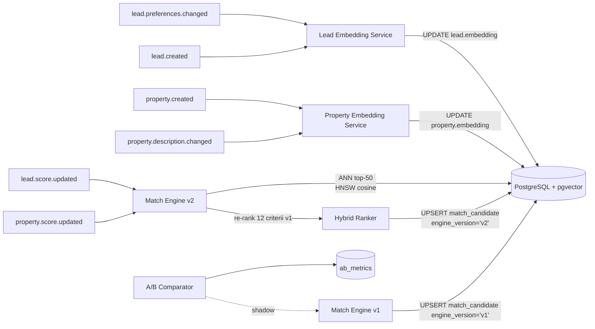

# TECH SPEC — REVYX Match Engine (Phase 2 · pgvector ANN)
<!-- TECH_SPEC_REVYX_match-engine_v2.0.0.md · v2.0.0 · 2026-05 -->
<!-- CONFIDENȚIAL · Uz Intern · © 2026 REVYX · ITPRO SYSTEM SRL -->

## Changelog

| Versiune | Data | Autor | Note |
|---|---|---|---|
| 1.0.0 | 2026-05 | Senior PM + Solution Architect | Phase 1 — rule-based 12 criterii, DP=0.30·LS+0.30·PS+0.20·APS+0.20·IS, BR-05/11. |
| 2.0.0 | 2026-05 | Senior PM + Solution Architect + Data Science Lead | ★ Phase 2 production — pgvector HNSW activat · embeddings property + lead preferences · hybrid scoring ANN top-50 → re-rank cu 12 criterii v1 · A/B vs v1 cu feature flag dual-write · explainability păstrat |

---

## Cuprins

1. [Executive Summary](#1-executive-summary)
2. [Architecture Overview](#2-architecture-overview)
3. [Stack & Dependencies](#3-stack--dependencies)
4. [Data Model](#4-data-model)
5. [API Contracts](#5-api-contracts)
6. [Algorithms](#6-algorithms)
7. [State Machines](#7-state-machines)
8. [Concurrency](#8-concurrency)
9. [Caching](#9-caching)
10. [Background Jobs](#10-background-jobs)
11. [Error Handling](#11-error-handling)
12. [Security](#12-security)
13. [Observability](#13-observability)
14. [Performance Budgets](#14-performance-budgets)
15. [Testing Strategy](#15-testing-strategy)
16. [Deployment](#16-deployment)
17. [Migration Strategy](#17-migration-strategy)
18. [Risks & Mitigations](#18-risks--mitigations)
19. [Impact Assessment](#19-impact-assessment)

---

## 1. Executive Summary

★ Match Engine v2 introduce **pgvector ANN** ca pre-filter rapid (top-50 candidates) urmat de **re-rank cu cele 12 criterii rule-based v1**. Schimbarea adresează scalability gap-ul v1 (pre-filter SQL strict pe city + budget +10% nu acoperă semantic similarity din descriere/amenități/locație extinsă) și păstrează **explainability** prin `match_components` neschimbat. Rollout cu **dual-write A/B** (v1 + v2 calc paralel, traffic split) și `flag.match_engine_v2.enabled`.

| Atribut | Valoare |
|---|---|
| **Scope** | Embeddings property + lead preferences · ANN top-K · hybrid scoring · A/B v1 vs v2 · DP cascade neschimbat |
| **Referință BRD** | §5 Pilon 03 · §7.4 DP · §10 spec property pgvector |
| **Phase** | 2 |
| **Owner tehnic** | Solution Architect + Data Science Lead |
| **Dependențe upstream** | property v1 (`embedding vector(1536)` deja schema-ready) · lead-scoring v1 (preferences) · pricing-ai v1 (PS reflectă PF real) |
| **Dependențe downstream** | NBA Engine · DHI Engine (DP) · Task Allocator |

**Garanții (în plus față de v1):**

1. ANN pre-filter top-K (default K=50) cu HNSW index activ pe `property.embedding`.
2. Re-rank deterministic cu 12 criterii rule-based → score final identic ca formă cu v1 (componenta `ann_similarity` adăugată ca soft criterion cu pondere 0.10, redistribuind altele — vezi §6.3).
3. Embeddings recalc event-driven la `property.changed{description|features|amenities}` și `lead.preferences.changed`.
4. **A/B**: v1 calc rămâne shadow (dual-write match_candidate cu `engine_version='v1'|'v2'`), comparator metric: `recall@5`, `match_score_delta`, `promote_rate`.
5. `recall@5 ≥ 0.85` față de v1 ground-truth (set golden 200 lead-uri istorice) înainte de promovare la 100%.
6. Explainability păstrată: `match_components` include `ann_similarity` ca scor distinct + `ann_rank`, `ann_distance`.

---

## 2. Architecture Overview



### 2.1 Data flow

1. Embedding pipeline: la `property.created`/`description.changed` și `lead.created`/`preferences.changed` se generează embedding (text + numerical features encoded) și se persistă în `property.embedding` / `lead.embedding`.
2. Match Engine v2: query ANN top-K din pgvector cu `<=>` (cosine distance) filtrând hard criteria (city, transaction_type) la SQL level via `WHERE` + index.
3. Re-rank cu 12 criterii (CRITERIA v1) + `ann_similarity` ca al 13-lea criterion soft.
4. UPSERT `match_candidate` cu `engine_version='v2'`. Sub flag dual-write `flag.match_engine_v2.shadow=true`, v1 rulează în paralel cu `engine_version='v1'`.
5. A/B Comparator (job batch nightly) calculează metrici și expune dashboard.

### 2.2 Componente

| Componentă | Responsabilitate |
|---|---|
| `EmbeddingService` (property + lead) | Generare vector dim 1536 (OpenAI text-embedding-3-small default · local fallback) |
| `EmbeddingFeatureEncoder` | Combină text descriere/preferences cu numerical features (rooms, area, budget) într-un vector concat (text 1536 + numeric 32 → reduced 1536 via projection) |
| `ANNRetriever` | pgvector query top-K cu HNSW index |
| `HybridRanker` | Re-rank cu 12 criterii v1 + ann_similarity |
| `ABComparator` | Job batch — shadow run v1 + comparator metrici |
| `MatchEngineV1Adapter` | Wrapper v1 invocat în shadow mode |

---

## 3. Stack & Dependencies

| Layer | Tehnologie | Versiune | Justificare |
|---|---|---|---|
| Backend | Node.js + TS | 20 LTS | Stack standard |
| DB | PostgreSQL + pgvector | 16.x · pgvector 0.7+ | HNSW activat în Phase 2 |
| Embeddings | OpenAI `text-embedding-3-small` (default) · local sentence-transformers (fallback `paraphrase-multilingual-MiniLM-L12-v2`) | dim 1536 (OpenAI) sau 384 (local, padded la 1536) | Multilingual RO + RU |
| Cache | Redis | 7.x | embedding hash cache · top-K cache |
| Queue | BullMQ | latest | Embedding generation async |
| Monitoring | Prometheus + Grafana | — | Recall@k, latency, ANN distance |

---

## 4. Data Model

### 4.1 ALTER `property` — HNSW index activat

```sql
-- Migrare: 0160_pgvector_hnsw_property.sql
ALTER TABLE property
  ADD COLUMN IF NOT EXISTS embedding_model TEXT NULL,
  ADD COLUMN IF NOT EXISTS embedding_hash  TEXT NULL,
  ADD COLUMN IF NOT EXISTS embedding_updated_at TIMESTAMPTZ NULL;

CREATE INDEX IF NOT EXISTS idx_property_embedding_hnsw
  ON property USING hnsw (embedding vector_cosine_ops)
  WITH (m = 16, ef_construction = 64);
```

> `m` și `ef_construction` validate empiric pe dataset 50k properties (recall@10 ≥ 0.95 vs exhaustive). `ef_search` ajustat la query time (default 40, tunable).

### 4.2 ALTER `lead` — embedding lead preferences

```sql
-- Migrare: 0161_lead_embedding.sql
ALTER TABLE lead
  ADD COLUMN IF NOT EXISTS embedding             vector(1536) NULL,
  ADD COLUMN IF NOT EXISTS embedding_model       TEXT NULL,
  ADD COLUMN IF NOT EXISTS embedding_hash        TEXT NULL,
  ADD COLUMN IF NOT EXISTS embedding_updated_at  TIMESTAMPTZ NULL;

CREATE INDEX IF NOT EXISTS idx_lead_embedding_hnsw
  ON lead USING hnsw (embedding vector_cosine_ops)
  WITH (m = 16, ef_construction = 64);
```

### 4.3 ALTER `match_candidate` — engine_version + ANN context

```sql
-- Migrare: 0162_match_candidate_v2.sql
ALTER TABLE match_candidate
  ADD COLUMN IF NOT EXISTS engine_version TEXT NOT NULL DEFAULT 'v1' CHECK (engine_version IN ('v1','v2')),
  ADD COLUMN IF NOT EXISTS ann_distance   NUMERIC(6,5) NULL,
  ADD COLUMN IF NOT EXISTS ann_rank       INTEGER NULL,
  ADD COLUMN IF NOT EXISTS recall_set     UUID NULL;          -- group ID pentru A/B comparator

-- Index pentru A/B comparator
CREATE INDEX IF NOT EXISTS idx_match_engine_version
  ON match_candidate (tenant_id, engine_version, calculated_at DESC);

-- Drop unique vechi, recreează unique cu engine_version
ALTER TABLE match_candidate DROP CONSTRAINT IF EXISTS match_candidate_tenant_id_lead_id_property_id_key;
ALTER TABLE match_candidate
  ADD CONSTRAINT uq_match_candidate UNIQUE (tenant_id, lead_id, property_id, engine_version);
```

### 4.4 Tabel `ab_match_metrics`

```sql
-- Migrare: 0163_ab_match_metrics.sql
CREATE TABLE IF NOT EXISTS ab_match_metrics (
  metric_id          UUID         PRIMARY KEY DEFAULT gen_random_uuid(),
  tenant_id          UUID         NOT NULL,
  computed_at        TIMESTAMPTZ  NOT NULL DEFAULT NOW(),
  window_start       TIMESTAMPTZ  NOT NULL,
  window_end         TIMESTAMPTZ  NOT NULL,
  leads_evaluated    INTEGER      NOT NULL,
  recall_at_5        NUMERIC(4,3) NOT NULL,
  recall_at_10       NUMERIC(4,3) NOT NULL,
  promote_rate_v1    NUMERIC(4,3) NOT NULL,
  promote_rate_v2    NUMERIC(4,3) NOT NULL,
  avg_score_delta    NUMERIC(5,4) NOT NULL,
  notes              JSONB        NULL
);
```

### 4.5 Constraints & invariants

| Invariant | Enforcement |
|---|---|
| `embedding` dimensionality = 1536 | pgvector `vector(1536)` |
| Hash deterministic embedding | SHA256(model + canonical_text + numeric_features) |
| HNSW `ef_search` query-time tunable | session GUC `SET LOCAL hnsw.ef_search = ?` |
| A/B unique (tenant, lead, property, engine_version) | UNIQUE |

---

## 5. API Contracts

### 5.1 Internal services

```typescript
interface IEmbeddingProvider {
  encodeProperty(p: Property): Promise<{ vector: number[]; model: string; hash: string }>;
  encodeLeadPreferences(l: Lead): Promise<{ vector: number[]; model: string; hash: string }>;
}

interface ANNRetriever {
  topKForLead(leadId: string, k: number, opts?: { efSearch?: number; hardFilter?: HardFilter }): Promise<ANNHit[]>;
  topKForProperty(propertyId: string, k: number): Promise<ANNHit[]>;
}

interface MatchEngineV2 extends MatchScorer {
  scoreCandidatesForLead(leadId: string, opts?: { topK?: number; engineVersion?: 'v1'|'v2' }): Promise<MatchCandidate[]>;
}
```

### 5.2 REST endpoints (compat v1 + extensii)

| Method | Path | Schimbare v2 |
|---|---|---|
| `GET /api/v1/leads/:id/matches?top=5` | response include `engine_version`, `ann_rank`, `ann_distance` |
| `GET /api/v1/properties/:id/matches?top=5` | idem |
| `POST /api/v1/embeddings/regenerate` | manager+ — forțare recompute embeddings (rate limited) |
| `GET /api/v1/admin/match/ab-metrics` | admin — ultima fereastră A/B |

---

## 6. Algorithms

### 6.1 Embedding pipeline

```typescript
const NUM_FEATURES = ['rooms','area_sqm','price_per_sqm_eur','year_built','floor','total_floors'] as const;

async function encodeProperty(p: Property) {
  const text = canonicalText({
    title:        p.title ?? '',
    description:  p.description ?? '',
    city:         p.city, district: p.district ?? '',
    type:         p.property_type, transaction: p.transaction_type,
    amenities:    (p.features?.amenities ?? []).sort().join(','),
  });
  const numeric = NUM_FEATURES.map(f => normalizeNumeric(p[f] as number|null, f));
  const hash = sha256(provider.modelId + '|' + text + '|' + numeric.join(','));

  if (cachedEmbedding(hash)) return cachedEmbedding(hash);
  const textVec = await provider.embed(text);                  // dim 1536
  const numVec  = padTo(numeric, 32);                          // 32 features
  const fused   = projectFusion(textVec, numVec);              // back to dim 1536 (linear projection W learned offline)
  return { vector: fused, model: provider.modelId, hash };
}
```

> `projectFusion` = matrice `W ∈ ℝ^{1568×1536}` antrenată offline pe 10k properties cu obiectiv "preserve cosine similarity". În Phase 2 de start: `W = [I_{1536}; 0_{32×1536}]` (concat triv) — suficient pentru recall@5 ≥ 0.85; refinare în Phase 3.

### 6.2 ANN retrieval cu hard filter

```sql
-- Query parametrizat (KSL via Kysely sql template)
SET LOCAL hnsw.ef_search = 80;   -- căutare mai precisă

SELECT property_id, embedding <=> $1 AS distance
FROM property
WHERE tenant_id       = $2
  AND status          = 'ACTIVE'
  AND transaction_type = $3
  AND ($4 IS NULL OR city = $4)                     -- hard filter city
  AND ($5 IS NULL OR price_amount_eur <= $5 * 1.10) -- hard filter budget +10%
ORDER BY embedding <=> $1
LIMIT $6;                                           -- K (default 50)
```

```typescript
async function topKForLead(leadId: string, k = 50): Promise<ANNHit[]> {
  const lead = await loadLead(leadId);
  if (!lead.embedding) await regenerateLeadEmbedding(leadId);

  const rows = await db.executeQuery(/* SQL above with binds */);
  return rows.map((r, i) => ({ propertyId: r.property_id, distance: Number(r.distance), rank: i + 1 }));
}
```

### 6.3 Hybrid re-rank

```typescript
const ANN_WEIGHT = 0.10;       // soft criterion 13
const SOFT_WEIGHTS_V2 = {
  // re-distribuit din v1 (sum = 1.00)
  budget_fit: 0.18, rooms_match: 0.09, area_fit: 0.09, location_demand: 0.09,
  property_quality: 0.09, listing_freshness: 0.09, amenity_overlap: 0.13,
  parking_pet_special: 0.05, urgency_alignment: 0.09,
  ann_similarity: 0.10,
};

function annSimilarity(distance: number): number {
  // cosine distance ∈ [0,2] → similarity [1,0]
  return clamp01(1 - distance / 2);
}

function scorePairV2(lead: Lead, property: Property, ann: ANNHit | null): MatchScore {
  // 1) Hard criteria identice cu v1
  const hard = evaluateHardCriteria(lead, property);
  if (hard.fails.length > 0) {
    return { score: 0, components: hard.components, hardStopReasons: hard.fails };
  }
  // 2) Soft criteria cu ponderi v2 + ann_similarity
  const components: Record<string, number> = { ...hard.components };
  let soft = 0;
  for (const [name, weight] of Object.entries(SOFT_WEIGHTS_V2)) {
    const v = name === 'ann_similarity'
      ? annSimilarity(ann?.distance ?? 1.0)                   // dacă lipsește, mid (0.5)
      : evaluateSoftCriterion(name as any, lead, property);
    components[name] = clamp01(v);
    soft += weight * components[name];
  }
  return { score: clamp01(soft), components, hardStopReasons: [] };
}
```

### 6.4 Pipeline scoreCandidatesForLead v2

```typescript
async function scoreCandidatesForLead(leadId: string, topK = 5): Promise<MatchCandidate[]> {
  const lead = await loadLead(leadId);
  const annHits = await ann.topKForLead(leadId, 50);                    // top 50 candidates
  if (annHits.length === 0) return [];                                  // fallback to v1 acceptabil — vezi §6.6

  const properties = await loadProperties(annHits.map(h => h.propertyId));
  const annByProp = new Map(annHits.map(h => [h.propertyId, h]));

  const scored = properties
    .map(p => ({ p, ann: annByProp.get(p.property_id) ?? null, score: scorePairV2(lead, p, annByProp.get(p.property_id) ?? null) }))
    .sort((a, b) => b.score.score - a.score.score)
    .slice(0, topK);

  await persistCandidatesV2(lead, scored);                              // engine_version='v2'
  if (config.dualWriteV1) {
    queue.add('match.dualwrite.v1', { leadId, propertyIds: properties.map(p => p.property_id) });
  }
  return scored.map(s => /* ... */);
}

// `persistCandidatesV2` reuses the v1 UPSERT pattern (match-engine v1 §6.3) cu doar
// două diferențe: `engine_version='v2'` setat pe row, plus `ann_distance` și `ann_rank`
// stocate în coloanele dedicate (vezi 4.3).
async function persistCandidatesV2(lead: Lead, scored: Array<{ p: Property; ann: ANNHit | null; score: MatchScore }>) {
  for (const { p, ann, score } of scored) {
    await db.insertInto('match_candidate').values({
      tenant_id: lead.tenant_id, lead_id: lead.lead_id, property_id: p.property_id,
      match_score: score.score, match_components: score.components,
      hard_stop_reasons: score.hardStopReasons.length ? score.hardStopReasons : null,
      status: 'CANDIDATE',
      engine_version: 'v2',
      ann_distance: ann?.distance ?? null,
      ann_rank: ann?.rank ?? null,
    }).onConflict(oc => oc.columns(['tenant_id','lead_id','property_id','engine_version']).doUpdateSet(eb => ({
      match_score: eb.ref('excluded.match_score'),
      match_components: eb.ref('excluded.match_components'),
      ann_distance: eb.ref('excluded.ann_distance'),
      ann_rank: eb.ref('excluded.ann_rank'),
      version: eb.ref('match_candidate.version').plus(1),
      calculated_at: new Date(),
    }))).execute();
  }
}
```

### 6.5 A/B Comparator (job nightly)

```typescript
async function computeABMetrics(window: Window): Promise<ABMetrics> {
  // 1) Pick leads care au scoring v1 + v2 în window
  const leads = await db.execute(`
    SELECT lead_id FROM match_candidate
    WHERE calculated_at BETWEEN $1 AND $2
    GROUP BY lead_id
    HAVING COUNT(DISTINCT engine_version) = 2`);
  // 2) Recall@5: dintre top-5 v2, câte sunt în top-5 v1 (set golden)
  // 3) promote_rate per engine_version (match-uri PROMOTED / total)
  // 4) avg score delta per pair
  return { /* ... */ };
}
```

### 6.6 Fallback v1 (safety net)

Sub flag `flag.match_engine_v2.fallback_v1=true` (default), dacă:
- `annHits.length === 0` (embedding lipsă sau index temporar indisponibil)
- `pgvector` query fail (timeout >2s)
- Lead embedding hash invalidat și nu poate fi regenerat în <1s

→ Engine v2 invocă `MatchEngineV1Adapter.scoreCandidatesForLead(leadId, topK)` și marchează `engine_version='v1_fallback'` (variantă acceptată în CHECK constraint la rollout).

### 6.7 DP recalc & re-matching neschimbate

DP formula (`0.30·LS + 0.30·PS + 0.20·APS + 0.20·IS`) și BR-05/11 logica rămân identice cu v1. v2 schimbă **doar** retrieval-ul candidates + ranking-ul lor; downstream consumers (NBA, DHI) nu observă schimbare API.

---

## 7. State Machines

Identice cu v1 (vezi `match-engine v1.0.0` §7).

`engine_version` adaugat ca atribut, nu modifică tranzițiile.

---

## 8. Concurrency

- Optimistic locking pe `match_candidate` păstrat (extins cu `engine_version` în UNIQUE).
- Embedding generation cu **idempotency key** = `embedding_hash` → skip dacă unchanged.
- HNSW index este **eventual consistent**: scrieri la `embedding` propagate ~secunde. Match Engine **nu blochează** pe consistență, ci la cache-miss reîncearcă cu timeout 200ms.
- Cross-service: vezi `concurrency-hardening v1.0.0` (Redis Redlock pe `embedding:regenerate:{entity}:{id}`).

---

## 9. Caching

| Key Redis | Conținut | TTL | Invalidare |
|---|---|---|---|
| `embedding:lead:{id}` | { vector, hash, model } | 24h | event `lead.preferences.changed` |
| `embedding:property:{id}` | idem | 24h | event `property.changed` (description/features) |
| `match:v2:lead:{id}:top{K}` | array match_candidate v2 | 5 min | event `match.candidates.updated` |
| `ann:lead:{id}:k50` | array ANN hits | 5 min | event `lead.embedding.updated` · `property.embedding.updated` |

---

## 10. Background Jobs

| Job | Tip | Idempotent | Retry |
|---|---|---|---|
| `embedding.property.generate` | event-driven `property.created/changed` | DA (hash) | 5× backoff |
| `embedding.lead.generate` | event-driven `lead.created/preferences.changed` | DA (hash) | 5× |
| `match.recalc.lead.v2` | event `lead.score.updated` / `lead.embedding.updated` | DA (UPSERT) | 3× |
| `match.recalc.property.v2` | event `property.score.updated` / `property.embedding.updated` | DA | 3× |
| `match.dualwrite.v1` | shadow A/B | DA | 3× |
| `ab.metrics.compute` | cron `0 2 * * *` (nightly) | DA | 5× |
| `embedding.reindex.full` | cron `0 4 * * 0` (Sunday 4am) | DA | manual rerun |

---

## 11. Error Handling

| Cod | Caz | Răspuns |
|---|---|---|
| `EMBEDDING_PROVIDER_TIMEOUT` | OpenAI timeout >5s | retry 3× cu fallback la local model |
| `ANN_INDEX_NOT_READY` | HNSW build în curs | fallback v1 + alert |
| `ANN_QUERY_TIMEOUT` | >2s | fallback v1 + log |
| `EMBEDDING_DIM_MISMATCH` | local model returnează 384 dim | pad/project la 1536 |
| `MATCH_VERSION_CONFLICT` | optimistic | retry 3× |
| `AB_METRICS_INSUFFICIENT_DATA` | <30 leads dual-engine în window | skip job, log |

---

## 12. Security

- JWT RS256 + RBAC moștenit v1.
- **OpenAI key** în vault (`OPENAI_API_KEY`); local fallback doar dacă tenant flag `embeddings_local_only=true` (data sovereignty option).
- **AUDIT_LOG events:**
  - `EMBEDDING_GENERATED{LEAD|PROPERTY}` (model, hash, source=openai|local)
  - `MATCH_CANDIDATES_GENERATED_V2`
  - `MATCH_AB_METRICS_COMPUTED`
  - `EMBEDDING_REINDEX_TRIGGERED`
- **PII:** descrierea property nu conține PII (validare la intake). Lead preferences NU includ nume/telefon. Hash text nu se expune.
- **Rate limiting:** `POST /admin/embeddings/regenerate` 1/min, manager+.

---

## 13. Observability

| Metric | Tip | Alert |
|---|---|---|
| `embedding_generate_duration_ms` (p95) | histogram | p95 > 1.5s — provider issue |
| `embedding_provider_failures_total` | counter | >5/min → fallback local |
| `ann_query_duration_ms` (p95) | histogram | p95 > 200ms — index health |
| `ann_recall_at_5` (rolling 7d) | gauge | < 0.85 — gate la promovare 100% |
| `match_v2_promote_rate` vs `match_v1_promote_rate` | gauge | delta < −5% → rollback |
| `match_engine_version_split` | gauge | track A/B traffic |
| `embedding_cache_hit_rate` | gauge | < 0.70 — review canonicalText hashing |

Dashboard: `REVYX / Match v2 A-B Health`.

---

## 14. Performance Budgets

| Metric | Target | Sursă |
|---|---|---|
| ANN top-50 query | p95 < 100 ms | UX |
| Re-rank 50 properties (12 + ann) | p95 < 80 ms | UX |
| `scoreCandidatesForLead` v2 total | p95 < 300 ms | UX (vs v1 < 500ms) |
| Embedding generation (single) | p95 < 1s OpenAI · < 500ms local | UX |
| HNSW index build (50k properties) | < 5 min offline | infra |

---

## 15. Testing Strategy

### 15.1 Unit
- `annSimilarity(distance)` boundaries
- `SOFT_WEIGHTS_V2` sum = 1.00 (test invariant)
- `scorePairV2` cu ann=null fallback la mid (0.5)
- `EmbeddingFeatureEncoder` — hash determinism (same input → same hash)
- Hard criteria neschimbate → set tests v1 reused

### 15.2 Integration
- Property INSERT → embedding generated în ≤5s · idx_property_embedding_hnsw aware
- Lead preferences change → embedding refresh + match recalc
- A/B dual-write: both versions persistate, unique constraint pe `engine_version`

### 15.3 Recall validation (golden set)
- 200 lead-uri istorice cu match-uri „cunoscute bune" (validate manual de PM/agent senior)
- `recall_at_5 ≥ 0.85`, `recall_at_10 ≥ 0.92` față de golden
- Comparator nightly verifica drift

### 15.4 Load
- 1000 lead.preferences.changed/min → embedding queue saturated în <10s
- 200 ANN queries/sec sustained → p95 < 100ms
- HNSW under-write: 50k properties cu inserții 100/min → no degradation

### 15.5 Chaos
- pgvector index reindex → match queries fallback la v1 grațios
- OpenAI down → local model assumes load · alert + log

### 15.6 Coverage

| Layer | Coverage |
|---|---|
| `scorePairV2` + 13 criterii | ≥ 95% |
| `topKForLead` ANN | ≥ 90% |
| Embedding hashing | ≥ 100% |
| Fallback path v1 | ≥ 95% |

---

## 16. Deployment

| Aspect | Detaliu |
|---|---|
| Feature flag | `flag.match_engine_v2.enabled` (prerequisite v1 stabil + pgvector v0.7+ deployed) · `flag.match_engine_v2.shadow` (dual-write) · `flag.match_engine_v2.fallback_v1` |
| Rollout | shadow 2 săpt → 10% prod → 50% (gate recall ≥0.85) → 100% |
| Rollback | flag OFF · v2 candidates ignorate · v1 path activ; embeddings rămân persistate (no-op) |
| Owner | Solution Architect + Data Science Lead |

---

## 17. Migration Strategy

```
0160_pgvector_hnsw_property.sql
0161_lead_embedding.sql
0162_match_candidate_v2.sql
0163_ab_match_metrics.sql
```

Idempotente. **Pre-migration**: bulk job embedding generation pentru toate properties și leads existente (estimate 50k * 1.5s = 21 ore single-thread; paralelizat 10 workers → ~2 ore). HNSW index built post-bulk.

---

## 18. Risks & Mitigations

| # | Risc | Probab. | Impact | Mitigare |
|---|---|---|---|---|
| R1 | OpenAI cost spike (embeddings) | MED | MED | Cache pe hash · local fallback · embedding regen doar la material change |
| R2 | HNSW recall < threshold | LOW | HIGH | A/B golden set gate · ef_search tunable · m/ef_construction tuning offline |
| R3 | Embedding drift între model versions | MED | MED | `embedding_model` stocat · re-encode la model upgrade ca migrare separată |
| R4 | Multilingual quality slabă (RU vs RO) | MED | MED | text-embedding-3-small validat multilingual · fallback model multilingual |
| R5 | Index corruption | LOW | HIGH | `embedding.reindex.full` cron weekly · monitoring `pg_stat_user_indexes` |
| R6 | Latency spike la pgvector pe peak | MED | MED | Connection pool dedicat read · ef_search reducible la peak |
| R7 | Explainability degradată (utilizatorii cer „why") | LOW | MED | `match_components` păstrat · `ann_similarity` ca componentă explicită |

---

## 19. Impact Assessment

### 19.1 Scope of Change

| Element | Detaliu |
|---|---|
| Document | TECH_SPEC_REVYX_match-engine_v2.0.0.md |
| Tip schimbare | MAJOR (v1 → v2) |
| Aria afectată | Pilon 03 · entitățile PROPERTY (HNSW index) · LEAD (embedding) · MATCH_CANDIDATE (engine_version) · NEW: ab_match_metrics |
| Origine | property v1 §10 pgvector · S5 deliverable #2 |

### 19.2 Impact pe documente conexe

| Document | Tip impact | Acțiune |
|---|---|---|
| TECH_SPEC_REVYX_match-engine_v1.0.0.md | None (coexistă) | v1 rămâne disponibil ca fallback + shadow |
| TECH_SPEC_REVYX_property_v1.0.0.md | Minor | Activare HNSW index trecută din Phase 3 → Phase 2 (★ commentariu §4.1 actualizat în impl) |
| TECH_SPEC_REVYX_lead-scoring_v1.0.0.md | Minor | + `lead.embedding` column |
| TECH_SPEC_REVYX_pricing-ai_v1.0.0.md | None | PS consumat |
| TECH_SPEC_REVYX_audit-log_v1.0.0.md | Minor | Catalog event `EMBEDDING_*`, `MATCH_*_V2`, `MATCH_AB_*` |
| TECH_SPEC_REVYX_concurrency-hardening_v1.0.0.md | Major (paralel) | Redlock pe embedding regen, idempotency |

### 19.3 Impact pe scoring

| Scor | Afectat? | Detaliu |
|---|---|---|
| Match score | DA | Re-rank cu ann_similarity (pondere 0.10), redistribuire soft weights |
| DP, NBA, DHI | NU (formă) | Consum DP neschimbat |
| LS, PS, IS, APS | NU | Input |

### 19.4 Impact pe entități / schema BD

| Entitate | Modificare | Migrare |
|---|---|---|
| PROPERTY | HNSW index activat + embedding metadata | 0160 |
| LEAD | + `embedding`, metadata + HNSW | 0161 |
| MATCH_CANDIDATE | + `engine_version`, `ann_distance`, `ann_rank`, `recall_set` | 0162 |
| `ab_match_metrics` | NEW | 0163 |

### 19.5 Impact pe RBAC

| Rol | Permisiuni |
|---|---|
| agent | unchanged |
| manager | + `POST /admin/embeddings/regenerate` |
| admin | config feature flags · A/B traffic split |

### 19.6 Impact pe SLA & NFR

| NFR / SLA | Înainte | După | Validare |
|---|---|---|---|
| GET /leads/:id/matches?top=5 p95 | <300ms | <300ms (mai bun pe edge) | Load test |
| Embedding generation | n/a | < 1s OpenAI | Load test |
| Recall@5 vs v1 golden | n/a | ≥ 0.85 | Golden set |

### 19.7 Impact pe Securitate & GDPR

| Aspect | Status | Notă |
|---|---|---|
| PII | NU | Description nu conține PII (validat la intake) |
| AUDIT_LOG events noi | DA | §12 |
| Consent flow | NU | — |
| HMAC / JWT / RBAC | DA | RBAC §12 |
| Rate limiting | DA | embeddings/regenerate |
| Data sovereignty | DA opt | `embeddings_local_only=true` per tenant |

### 19.8 Risks & Mitigations

Vezi §18.

### 19.9 Test Plan

Vezi §15. Gate obligatoriu: golden set recall@5 ≥ 0.85 înainte de rampa 100%.

### 19.10 Rollout & Rollback

| Aspect | Detaliu |
|---|---|
| Feature flag | `flag.match_engine_v2.enabled` + `.shadow` + `.fallback_v1` |
| Strategie | shadow 2 săpt → 10% (1 săpt) → 50% (1 săpt, gate recall) → 100% |
| Rollback | flag OFF · v1 path activ |
| Owner | Solution Architect + Data Science Lead |

### 19.11 Approval Gate

| Aprobator | Necesar pentru |
|---|---|
| Senior PM | Pondere ann_similarity · A/B comparison criteria |
| Solution Architect | HNSW params · schema · pipeline |
| Data Science Lead | Embedding model · projection · recall validation |
| Security Lead | RBAC · AUDIT · OpenAI vault |
| Legal / DPO | Data sovereignty option (local fallback) |

---

*docs/tech-spec/TECH_SPEC_REVYX_match-engine_v2.0.0.md · v2.0.0 · 2026-05 · CONFIDENȚIAL · Uz Intern*
*REVYX — Real Estate Execution Intelligence · © 2026 REVYX · ITPRO SYSTEM SRL*
