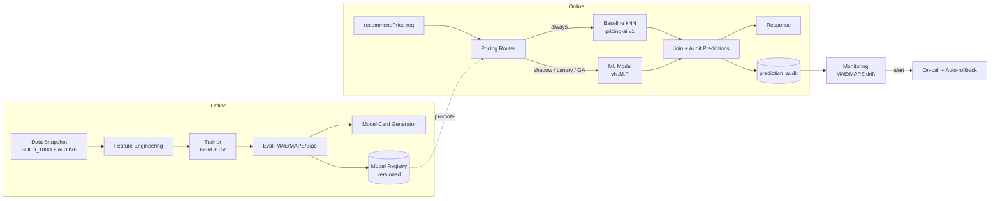

# TECH SPEC — ML PRICING GA (Graduation 100% + Shadow/Canary Discipline)
<!-- TECH_SPEC_REVYX_ml-pricing-ga_v1.0.0.md · v1.0.0 · 2026-05 -->
<!-- CONFIDENȚIAL · Uz Intern · © 2026 REVYX · ITPRO SYSTEM SRL -->

## Changelog

| Versiune | Data | Autor | Note |
|---|---|---|---|
| 1.0.0 | 2026-05 | Senior PM + Solution Architect + Data Science Lead | ★ Spec inițială S8 — graduate ML pricing din A/B la 100% trafic · A/B gates definite · rollout plan · monitoring post-GA (MAE alertă >10% degradare vs baseline) · shadow mode pentru modele noi (train → shadow → canary 5% → GA) · model card (bias check, feature importance, known limitations) |

---

## Cuprins

1. [Executive Summary](#1-executive-summary)
2. [Architecture Overview](#2-architecture-overview)
3. [Stack & Dependencies](#3-stack--dependencies)
4. [Data Model](#4-data-model)
5. [API Contracts](#5-api-contracts)
6. [Algorithms (A/B Gates · Shadow · Canary · GA)](#6-algorithms)
7. [State Machines](#7-state-machines)
8. [Concurrency](#8-concurrency)
9. [Caching](#9-caching)
10. [Background Jobs](#10-background-jobs)
11. [Error Handling](#11-error-handling)
12. [Security](#12-security)
13. [Observability](#13-observability)
14. [Performance Budgets](#14-performance-budgets)
15. [Testing Strategy](#15-testing-strategy)
16. [Deployment & Rollout](#16-deployment--rollout)
17. [Migration Strategy](#17-migration-strategy)
18. [Risks & Mitigations](#18-risks--mitigations)
19. [Model Card](#19-model-card)
20. [Impact Assessment](#20-impact-assessment)

---

## 1. Executive Summary

★ **ML Pricing GA** consfințește graduarea modelului ML de pricing (Phase 3 ML „real" — gradient boosted regression peste features structurale + comparables + market trend) din regim **A/B (50/50 vs deterministic kNN baseline)** la **100% trafic** prin contract `IPricingProvider` definit în `pricing-ai` v1.0.0 §5.1, fără breaking change pentru consumatori (Property Engine, Match Engine v2, Alert Service).

| Atribut | Valoare |
|---|---|
| **Scope** | A/B gates pentru promovare GA · proces `train → shadow → canary 5% → 25% → 100%` pentru orice model nou · monitoring post-GA cu alertă MAE drift >10% vs baseline · model card publicat per release |
| **Referință BRD** | §7.2 PS / PF · NFR-01 (recalc <30s) |
| **Referință Tech Spec** | `pricing-ai` v1.0.0 (deterministic baseline) · `ml-pricing-phase3` (A/B framework — predecessor logic) |
| **Phase** | 5 (Maturitate platformă) |
| **Owner tehnic** | Data Science Lead + Solution Architect + Site Reliability Lead |
| **Dependențe upstream** | A/B framework S7 · Model Registry (S7) · Comparables cache (`pricing-ai` §4.3) · Market Trend (`pricing-ai` §4.4) |
| **Dependențe downstream** | Property Engine (PF v2) · Match Engine v2 (DP indirect) · Alert Service (over/underpriced) |

**Garanții GA:**

1. **Niciun model nu graduate fără shadow ≥14 zile + canary 5% ≥7 zile** cu metrici verzi (vezi §6.1).
2. **A/B gate pass criteria** explicite și auditabile — nicio promovare manuală fără override `admin` și AUDIT_LOG.
3. **MAE post-GA alertă** când `MAE_rolling_24h > MAE_baseline_locked * 1.10` (degradare >10%).
4. **Auto-rollback** la versiunea anterioară la 3 alerte CRITICAL consecutive în 1 oră (kill switch).
5. **Model card** generat automat la fiecare release, publicat în `docs/model-cards/pricing-vN.M.P.md`.
6. **Backward compat:** `IPricingProvider.recommendPrice()` păstrează contractul §5.1 din `pricing-ai` v1.0.0 — consumatorii nu observă graduarea.

---

## 2. Architecture Overview



### 2.1 Stages

| Stage | Trafic ML | Trafic Baseline | Persist | Servire |
|---|---|---|---|---|
| **Train** | 0% | 100% | DA (eval set) | NU |
| **Shadow** | 100% (calc, not served) | 100% (served) | DA (predictions only) | NU |
| **Canary 5%** | 5% (served) | 95% (served) | DA (both) | DA |
| **Canary 25%** | 25% | 75% | DA | DA |
| **GA 100%** | 100% | 0% (kept warm pentru fallback) | DA | DA |

Baseline rămâne mereu deployed (warm) pentru rollback instant.

---

## 3. Stack & Dependencies

| Layer | Tehnologie | Versiune | Justificare |
|---|---|---|---|
| Trainer | Python 3.12 · scikit-learn / LightGBM | latest LTS | GBM = standard pentru tabular pricing |
| Online inference | TypeScript wrapper + `onnxruntime-node` | 1.x | ONNX export → Node fără Python online |
| Feature store | PostgreSQL views + Redis | 16.x · 7.x | Reuse comparables cache `pricing-ai` v1 §4.3 |
| Model registry | S3-compatible bucket + metadata table | — | Versioned artifacts + lineage |
| Experiment tracking | MLflow self-hosted | latest | Audit transparency + governance |
| Routing | feature flag service (existing) | — | Flag `flag.pricing_ml_ga.cohort_pct` |
| Audit | `auditLogger` v1.0.0 | — | Events `PRICING_MODEL_*` |
| Alerting | Prometheus + Alertmanager | latest | NFR drift detection |

---

## 4. Data Model

### 4.1 Tabel `pricing_model_registry`

```sql
-- Migrare: 0500_pricing_model_registry.sql
CREATE TABLE IF NOT EXISTS pricing_model_registry (
  model_id              UUID         PRIMARY KEY DEFAULT gen_random_uuid(),
  model_name            TEXT         NOT NULL,         -- 'pricing-gbm'
  semver                TEXT         NOT NULL,         -- 'v2.1.0'
  artifact_uri          TEXT         NOT NULL,         -- s3://revyx-models/pricing/v2.1.0/model.onnx
  artifact_sha256       TEXT         NOT NULL,
  feature_schema_hash   TEXT         NOT NULL,         -- guard împotriva feature drift
  trained_at            TIMESTAMPTZ  NOT NULL,
  trained_on_window     TSTZRANGE    NOT NULL,         -- range date training set
  trained_on_rows       INTEGER      NOT NULL,
  eval_metrics          JSONB        NOT NULL,         -- { mae, mape, r2, bias_by_district, ... }
  model_card_uri        TEXT         NOT NULL,         -- docs/model-cards/pricing-v2.1.0.md
  status                TEXT         NOT NULL CHECK (status IN ('DRAFT','SHADOW','CANARY','GA','RETIRED','ROLLED_BACK')),
  promoted_to_ga_at     TIMESTAMPTZ  NULL,
  retired_at            TIMESTAMPTZ  NULL,
  rolled_back_reason    TEXT         NULL,
  created_by            UUID         NOT NULL,         -- user_id (admin / ds_lead)
  created_at            TIMESTAMPTZ  NOT NULL DEFAULT NOW(),
  UNIQUE (model_name, semver)
);
CREATE UNIQUE INDEX IF NOT EXISTS idx_pricing_model_ga
  ON pricing_model_registry (model_name) WHERE status = 'GA';
```

### 4.2 Tabel `pricing_prediction_audit`

```sql
-- Migrare: 0501_pricing_prediction_audit.sql
CREATE TABLE IF NOT EXISTS pricing_prediction_audit (
  prediction_id         UUID         PRIMARY KEY DEFAULT gen_random_uuid(),
  tenant_id             UUID         NOT NULL,
  property_id           UUID         NOT NULL,
  model_id              UUID         NOT NULL REFERENCES pricing_model_registry(model_id),
  baseline_model_id     UUID         NULL REFERENCES pricing_model_registry(model_id),
  served                BOOLEAN      NOT NULL,         -- true=răspuns servit; false=shadow only
  served_path           TEXT         NOT NULL CHECK (served_path IN ('BASELINE','ML','SHADOW_ONLY')),
  ml_recommended_eur    NUMERIC(14,2) NULL,
  baseline_recommended_eur NUMERIC(14,2) NULL,
  ml_confidence         NUMERIC(4,3) NULL,
  baseline_confidence   NUMERIC(4,3) NULL,
  features_hash         TEXT         NOT NULL,
  latency_ms            INTEGER      NOT NULL,
  predicted_at          TIMESTAMPTZ  NOT NULL DEFAULT NOW()
) PARTITION BY RANGE (predicted_at);
-- Partitions monthly; retention 365 zile (audit & retraining).
CREATE INDEX IF NOT EXISTS idx_pred_audit_model ON pricing_prediction_audit (model_id, predicted_at DESC);
CREATE INDEX IF NOT EXISTS idx_pred_audit_property ON pricing_prediction_audit (tenant_id, property_id, predicted_at DESC);
```

### 4.3 Tabel `pricing_outcome_join`

Outcome real (deal won → sold price) este materializat când contract DEAL trece în WON, asociat cu predicția cea mai recentă servită ≤7 zile înainte de listing change la prețul final.

```sql
-- Migrare: 0502_pricing_outcome_join.sql
CREATE TABLE IF NOT EXISTS pricing_outcome_join (
  outcome_id            UUID         PRIMARY KEY DEFAULT gen_random_uuid(),
  tenant_id             UUID         NOT NULL,
  property_id           UUID         NOT NULL,
  prediction_id         UUID         NOT NULL REFERENCES pricing_prediction_audit(prediction_id),
  model_id              UUID         NOT NULL REFERENCES pricing_model_registry(model_id),
  predicted_eur         NUMERIC(14,2) NOT NULL,
  actual_sold_eur       NUMERIC(14,2) NOT NULL,
  abs_error_eur         NUMERIC(14,2) NOT NULL,
  pct_error             NUMERIC(7,4) NOT NULL,
  joined_at             TIMESTAMPTZ  NOT NULL DEFAULT NOW(),
  UNIQUE (property_id, prediction_id)
);
CREATE INDEX IF NOT EXISTS idx_outcome_model ON pricing_outcome_join (model_id, joined_at DESC);
```

### 4.4 Tabel `pricing_model_alert`

```sql
-- Migrare: 0503_pricing_model_alert.sql
CREATE TABLE IF NOT EXISTS pricing_model_alert (
  alert_id              UUID         PRIMARY KEY DEFAULT gen_random_uuid(),
  model_id              UUID         NOT NULL REFERENCES pricing_model_registry(model_id),
  alert_type            TEXT         NOT NULL CHECK (alert_type IN ('MAE_DRIFT','MAPE_DRIFT','BIAS_DRIFT','LATENCY_DRIFT','FEATURE_SCHEMA_MISMATCH','OUTAGE')),
  severity              TEXT         NOT NULL CHECK (severity IN ('WARN','HIGH','CRITICAL')),
  metric_value          NUMERIC(10,4) NOT NULL,
  baseline_value        NUMERIC(10,4) NOT NULL,
  delta_pct             NUMERIC(7,4) NOT NULL,
  window                TSTZRANGE    NOT NULL,
  triggered_at          TIMESTAMPTZ  NOT NULL DEFAULT NOW(),
  resolved_at           TIMESTAMPTZ  NULL,
  resolution_action     TEXT         NULL              -- 'AUTO_ROLLBACK' | 'MANUAL_OVERRIDE' | 'TUNED' | 'FALSE_POSITIVE'
);
CREATE INDEX IF NOT EXISTS idx_pricing_alert_open ON pricing_model_alert (model_id) WHERE resolved_at IS NULL;
```

---

## 5. API Contracts

### 5.1 Internal services (non-breaking)

```typescript
// Existing IPricingProvider contract preserved (pricing-ai v1.0.0 §5.1)
interface IPricingProvider {
  recommendPrice(input: PricingInput): Promise<PricingRecommendation | null>;
}

// New routing layer — internal only
interface IPricingRouter {
  decideStage(propertyId: string, tenantId: string): Promise<{
    servedPath: 'BASELINE' | 'ML' | 'SHADOW_ONLY';
    modelId: string;
    baselineModelId: string;
  }>;
  recommend(input: PricingInput): Promise<PricingRecommendation>;
}

// Model lifecycle ops — admin-only
interface IPricingModelOps {
  registerModel(meta: ModelRegistrationInput): Promise<{ modelId: string }>;
  promote(modelId: string, target: 'SHADOW'|'CANARY'|'GA', cohortPct?: number): Promise<void>;
  rollback(modelId: string, reason: string): Promise<void>;
  getCurrentGA(modelName: string): Promise<RegistryRow | null>;
}
```

### 5.2 REST endpoints

| Method | Path | RBAC | Descriere |
|---|---|---|---|
| `GET` | `/api/v1/admin/pricing/models` | admin | Lista modele cu status |
| `POST` | `/api/v1/admin/pricing/models/:id/promote` | admin (4-eyes: 2 admin distincți pentru GA) | Body: `{ target, cohortPct? }` |
| `POST` | `/api/v1/admin/pricing/models/:id/rollback` | admin | Body: `{ reason }` |
| `GET` | `/api/v1/admin/pricing/models/:id/metrics` | admin / ds_lead | MAE/MAPE/bias rolling 24h/7d |
| `GET` | `/api/v1/admin/pricing/alerts?state=open` | admin / on-call | Lista alerte deschise |

**4-eyes principle pentru `promote → GA`:** request inițial + approval distinct (alt admin) în 24h; expirat altfel. Ambele înregistrate în AUDIT_LOG.

---

## 6. Algorithms

### 6.1 A/B Gate — criterii promovare ★

| Tranziție | Gate (toate verzi obligatoriu) |
|---|---|
| **DRAFT → SHADOW** | Eval offline: `MAE_eval ≤ MAE_baseline_offline × 0.95` (≥5% mai bun) · `MAPE_eval ≤ 12%` · `R² ≥ 0.65` · bias district ≤ ±5% · Feature schema validate · Model card semnat de DS Lead |
| **SHADOW → CANARY 5%** | Shadow ≥ 14 zile · `MAE_shadow_rolling_7d ≤ MAE_baseline_rolling_7d × 1.05` (≤5% pierdere acceptată) · zero crash > 0.01% requests · latency p95 ≤ 200ms · feature_schema_hash stabil 7 zile |
| **CANARY 5% → 25%** | Canary 5% ≥ 7 zile · `MAE_ml_5pct ≤ MAE_baseline_95pct × 0.97` (≥3% mai bun real) · alerte CRITICAL = 0 · alerte HIGH ≤ 1 |
| **CANARY 25% → 100% (GA)** | Canary 25% ≥ 7 zile · `MAE_ml_25pct ≤ MAE_baseline_75pct × 0.95` · zero alerte CRITICAL · zero rollback events · `bias_district_max_delta ≤ 0.05` · 4-eyes admin approval |

**Auto-fail (revine la stagiul anterior):** orice metrică sub threshold pentru 3 ferestre rolling de 1h → demotion automată + AUDIT.

### 6.2 Shadow Mode

```typescript
async function recommendWithShadow(input: PricingInput): Promise<PricingRecommendation> {
  const decision = await router.decideStage(input.propertyId, input.tenantId);
  const baselineP = baselineProvider.recommendPrice(input);          // always run
  const mlP = decision.servedPath !== 'BASELINE'
    ? mlProvider.recommendPrice(input)
    : Promise.resolve(null);

  const [baseline, ml] = await Promise.allSettled([baselineP, mlP]);

  // Persist BOTH for audit, regardless of served path
  await persistPredictionAudit({
    tenantId: input.tenantId, propertyId: input.propertyId,
    modelId: decision.modelId, baselineModelId: decision.baselineModelId,
    served: decision.servedPath !== 'SHADOW_ONLY',
    servedPath: decision.servedPath,
    mlRec: settled(ml), baselineRec: settled(baseline),
    featuresHash: hashFeatures(input),
  });

  if (decision.servedPath === 'BASELINE' || decision.servedPath === 'SHADOW_ONLY') {
    return mustValue(baseline);                                       // shadow never served
  }
  return mustValue(ml);                                               // ML served (canary or GA)
}
```

### 6.3 Routing — cohort-stable hashing

```typescript
function decideServedPath(propertyId: string, modelStatus: 'SHADOW'|'CANARY'|'GA', cohortPct: number): 'BASELINE'|'ML'|'SHADOW_ONLY' {
  if (modelStatus === 'SHADOW') return 'SHADOW_ONLY';
  if (modelStatus === 'GA')     return 'ML';
  // CANARY: deterministic bucket pe propertyId pentru stabilitate experiment
  const bucket = murmurhash3(propertyId) % 10000;          // 0..9999
  return bucket < cohortPct * 100 ? 'ML' : 'BASELINE';     // cohortPct=5 → 5%
}
```

Bucketing pe `propertyId` (NU pe request) garantează că o proprietate primește același tratament la cereri repetate (consistență UX + experiment validity).

### 6.4 Post-GA monitoring — MAE drift alert

**MAE baseline locked:** la momentul promovării GA se snapshot-uiește `MAE_baseline_locked = MAE_offline_eval` (sau `MAE_canary_25pct` dacă e mai pesimist). Acesta devine reference imutabil până la următorul model GA.

```typescript
// Cron: la fiecare oră
async function evalDrift(modelId: string) {
  const ga = await registry.getCurrentGA('pricing-gbm');
  const m24 = await query(`
    SELECT AVG(abs_error_eur / actual_sold_eur) AS mae_norm
    FROM pricing_outcome_join
    WHERE model_id = $1 AND joined_at > NOW() - INTERVAL '24 hours'
  `, [modelId]);

  const baselineLocked = ga.eval_metrics.mae_baseline_locked;
  const deltaPct = (m24.mae_norm - baselineLocked) / baselineLocked;

  if (deltaPct > 0.10) {                     // >10% degradare
    await raiseAlert({
      modelId, type: 'MAE_DRIFT',
      severity: deltaPct > 0.20 ? 'CRITICAL' : 'HIGH',
      metricValue: m24.mae_norm, baselineValue: baselineLocked, deltaPct,
    });
  }
}
```

**Auto-rollback policy:** 3 alerte CRITICAL consecutive în 1 oră (sau 1 alertă cu `deltaPct > 0.30`) → declanșează `rollback(currentGA, 'AUTO_DRIFT')`. Modelul anterior GA (`previous_ga`) este re-promovat instant prin update flag → redirect 100% trafic → AUDIT_LOG eveniment `PRICING_MODEL_AUTO_ROLLBACK`.

### 6.5 Bias check (per district / per property_type)

```typescript
async function checkBias(modelId: string, window: '7d'|'30d') {
  const rows = await query(`
    SELECT p.district, p.property_type,
           AVG(o.pct_error)        AS mean_err,
           STDDEV(o.pct_error)     AS std_err,
           COUNT(*)                AS n
    FROM pricing_outcome_join o
    JOIN property p ON p.property_id = o.property_id
    WHERE o.model_id = $1 AND o.joined_at > NOW() - INTERVAL $2
    GROUP BY p.district, p.property_type
    HAVING COUNT(*) >= 30
  `, [modelId, window]);

  for (const r of rows) {
    if (Math.abs(r.mean_err) > 0.05) {        // bias district > ±5%
      await raiseAlert({ modelId, type: 'BIAS_DRIFT', severity: 'HIGH',
        metricValue: r.mean_err, baselineValue: 0, deltaPct: r.mean_err,
        window });
    }
  }
}
```

### 6.6 Feature schema guard

La fiecare inferență, `feature_schema_hash` curent se compară cu `feature_schema_hash` din modelul activ. Mismatch → fallback la baseline + alert `FEATURE_SCHEMA_MISMATCH` (CRITICAL). Previne servirea de modele cu inputs incompatibile după migrări de schema property.

---

## 7. State Machines

### 7.1 Lifecycle model

```
DRAFT ──gate 6.1──> SHADOW ──gate 6.1──> CANARY(5%) ──gate──> CANARY(25%) ──gate + 4eyes──> GA
                                                                                        │
                                                                                        ├─ rollback(manual / auto) ──> ROLLED_BACK
                                                                                        │
                                                                                        └─ next-model-promoted ──> RETIRED
```

Tranziții permise doar via `IPricingModelOps` (audit + RBAC). Niciun UPDATE direct în `pricing_model_registry.status`.

### 7.2 Alert lifecycle

```
OPEN ──auto-rollback / manual_override / tuned / false_positive──> RESOLVED
```

---

## 8. Concurrency

- **Promotion advisory lock:** `pg_advisory_xact_lock(hashtext('pricing_model_ops'))` — operațiuni `promote`/`rollback` serializate global.
- **Stage transition** atomic: `UPDATE registry SET status WHERE id AND status = expected_prev` (CAS) → fail dacă alt operator a schimbat starea între timp.
- **Feature flag propagation:** route table publish via Redis pub/sub; toți workerii actualizați în <500ms; verificare eventual consistency cu version counter (request ce a primit decizie pe v=N e logged cu modelId stabil chiar dacă v=N+1 e activ la response).
- **Rollback non-blocking:** rollback NU așteaptă drenarea cererilor in-flight; cererile noi merg pe `previous_ga` instant.

---

## 9. Caching

| Key Redis | Conținut | TTL | Invalidare |
|---|---|---|---|
| `pricing:routing:current` | `{modelId, status, cohortPct}` | până la pub/sub invalidate | event `pricing.model.promoted/rollback` |
| `pricing:model:{id}:meta` | metadata + feature schema hash | 24h | event `pricing.model.registered` |
| `pricing:alerts:open:{modelId}` | gauge alerts | 60s | event `pricing.alert.*` |

Modelul ONNX e încărcat în memorie per worker (LRU max 3 versiuni concomitent) — `previous_ga` păstrat warm pentru rollback instant <100ms.

---

## 10. Background Jobs

| Job | Tip | Cron / Trigger | Idempotent |
|---|---|---|---|
| `pricing.eval.drift.hourly` | cron | `0 * * * *` | DA |
| `pricing.eval.bias.daily` | cron | `0 4 * * *` | DA |
| `pricing.outcome.join` | event `deal.won` | per deal | DA (UNIQUE prediction_id) |
| `pricing.canary.gate.eval` | cron | `0 */6 * * *` | DA |
| `pricing.shadow.compare.daily` | cron | `0 5 * * *` | DA — produce raport ML vs Baseline |
| `pricing.model.warmup` | event `pricing.model.promoted` | per promote | DA |
| `pricing.partition.maintenance` | cron `0 2 1 * *` | lunar | DA |

---

## 11. Error Handling

| Cod | Caz | Răspuns |
|---|---|---|
| `PRICING_ML_UNAVAILABLE` | inference fail / timeout | fallback la baseline + log + counter |
| `PRICING_FEATURE_SCHEMA_MISMATCH` | hash mismatch | fallback baseline + alert CRITICAL |
| `PRICING_MODEL_NOT_FOUND` | model_id gone (race) | fallback GA curent + alert |
| `PRICING_PROMOTE_GATE_FAILED` | metrici sub threshold la promote | 422 + reason | 
| `PRICING_PROMOTE_4EYES_PENDING` | second admin lipsă | 202 (pending) |
| `PRICING_ROLLBACK_NO_PREVIOUS` | nu există previous GA | 409 + alert CRITICAL |

**Circuit breaker pe ML:** la `PRICING_ML_UNAVAILABLE > 5%` într-o fereastră de 5 min → bypass automat la baseline pentru următoarele 10 min, alert HIGH.

---

## 12. Security

- **JWT RS256** moștenit Phase 0.
- **RBAC:**
  - `agent` / `team_lead` / `manager` — acces normal pricing, fără model ops.
  - `admin` — register/promote/rollback (4-eyes pentru GA).
  - `data_science_lead` (rol nou ★) — register + promote până la `CANARY(25%)`; pentru GA tot necesită al doilea admin.
- **AUDIT_LOG events:**
  - `PRICING_MODEL_REGISTERED` · `PRICING_MODEL_PROMOTED_SHADOW/CANARY/GA`
  - `PRICING_MODEL_ROLLED_BACK` · `PRICING_MODEL_AUTO_ROLLBACK`
  - `PRICING_MODEL_BIAS_ALERT` · `PRICING_MODEL_DRIFT_ALERT`
  - `PRICING_MODEL_4EYES_REQUEST` · `PRICING_MODEL_4EYES_APPROVED`
- **Artifact integrity:** `artifact_sha256` verificat la load; mismatch → refuz boot worker + alert CRITICAL.
- **PII:** zero PII în features (preț + structurale + geo). Verificare automată la registration: lista features include doar columns whitelisted.
- **Rate limiting:** `POST /admin/pricing/models/:id/promote` — 1/oră/user; rollback fără limit (siguranță operațională).

---

## 13. Observability

| Metric | Tip | Alert |
|---|---|---|
| `pricing_ml_inference_duration_ms` (p95) | histogram | p95 > 200ms |
| `pricing_ml_error_rate` | counter ratio | >1% în 5 min |
| `pricing_mae_rolling_24h{model_id}` | gauge | drift §6.4 |
| `pricing_mape_rolling_24h{model_id}` | gauge | >15% |
| `pricing_bias_district_delta{model_id, district}` | gauge | >0.05 |
| `pricing_outcome_join_lag_hours` | histogram | p95 > 72h (deal won → join) |
| `pricing_canary_cohort_drift` | gauge | hash bucket drift detection |
| `pricing_model_warmup_duration_ms` | histogram | p95 > 5s |
| `pricing_4eyes_pending_seconds` | gauge | >24h → expire |

Dashboard: `REVYX / Pricing GA Health` + `REVYX / Pricing Model Lineage`.

---

## 14. Performance Budgets

| Metric | Target | Sursă |
|---|---|---|
| ML inference (cold) | p95 < 500ms | UX |
| ML inference (warm) | p95 < 80ms | UX |
| Shadow path overhead | p95 < 50ms additional | NFR |
| Promote operation | < 5s end-to-end | Ops |
| Auto-rollback latency | < 30s alert→trafic redirected | NFR-01 derivat |
| Drift eval cron | p95 < 60s for 1M predictions | Infra |

---

## 15. Testing Strategy

### 15.1 Unit
- A/B gate evaluator — toate threshold-urile §6.1 cu boundary cases.
- Cohort hashing — distribuție uniformă (chi-square test la 100k samples).
- Feature schema hash — colision detection.
- Auto-rollback trigger — 3 CRITICAL în 1h vs 2 CRITICAL.

### 15.2 Integration
- Promote DRAFT→SHADOW cu eval pass → status update + AUDIT.
- Promote CANARY→GA fără 4-eyes → 202 pending; cu 4-eyes → GA.
- Rollback cu `no previous` → 409 + alert.
- Inference fail injection → fallback baseline + circuit breaker.

### 15.3 E2E
- Train model sintetic → register → shadow 14 zile (compress time) → canary 5% → 25% → GA → drift injection → auto-rollback.
- Outcome join: deal.won după 30 zile de la prediction → row în `pricing_outcome_join`.

### 15.4 Load
- 1k inferențe/sec sustained — p95 < 200ms.
- Cohort routing stable la 10k properties × 100 cereri = 0% bucket drift.

### 15.5 Chaos
- ONNX runtime crash mid-request → fallback baseline + counter.
- Model artifact missing din S3 → boot worker degradat (baseline only) + alert.
- Feature schema migration mid-flight → mismatch detected + fallback.

### 15.6 Coverage

| Layer | Coverage |
|---|---|
| Gate evaluators | ≥99% |
| Routing / cohort | ≥98% |
| Drift / bias | ≥95% |
| Promote/rollback ops | ≥95% |
| API admin | ≥90% |

---

## 16. Deployment & Rollout

### 16.1 Feature flags

| Flag | Scop |
|---|---|
| `flag.pricing_ml_ga.enabled` | master kill-switch |
| `flag.pricing_ml_ga.cohort_pct` | 0/5/25/100 |
| `flag.pricing_ml_ga.shadow_only` | force shadow chiar și pentru GA (pentru regression test in prod) |

### 16.2 Rollout S8 plan

| Săpt | Etapă |
|---|---|
| 1 | Deploy infrastructure (registry, audit, monitoring) · primul model `v2.0.0` în SHADOW |
| 2 | Continuă SHADOW · prim raport zilnic ML vs Baseline |
| 3 | Promote CANARY 5% (un singur tenant pilot) |
| 4 | Extindere CANARY 5% la toți tenanții |
| 5 | CANARY 25% |
| 6 | GA 100% (4-eyes approval) · monitoring intensiv 14 zile |
| 7-8 | Stabilizare · lessons learned · model card v2.0.0 final |

### 16.3 Rollback

- **Soft rollback** (cohort_pct → 0): instant, niciun trafic ML.
- **Hard rollback** (status GA → ROLLED_BACK + previous GA reactivat): <30s.
- **Cold rollback** (înlocuirea binară a workerilor): <5 min.

---

## 17. Migration Strategy

```
0500_pricing_model_registry.sql
0501_pricing_prediction_audit.sql       (PARTITION BY RANGE monthly)
0502_pricing_outcome_join.sql
0503_pricing_model_alert.sql
```

Migrare necesită backfill 7 zile predictions pentru a avea baseline operațional la GA. Job `pricing.outcome.join.backfill` rulează one-shot la deploy.

---

## 18. Risks & Mitigations

| # | Risc | Probab. | Impact | Mitigare |
|---|---|---|---|---|
| R1 | Model overfit pe SOLD_180D (cohort mic district) | MED | HIGH | CV stratificat district + bias check §6.5 + min 30 samples per district |
| R2 | Drift sezon (toamnă vs primăvară) post-GA | HIGH | MED | Retrain trimestrial obligatoriu · canary la fiecare retrain |
| R3 | Auto-rollback flap (2 modele alternând) | LOW | HIGH | Cooldown 24h între rollback și re-promote · alertă HIGH dacă rollback < 7 zile post-GA |
| R4 | 4-eyes blochează emergency promote | LOW | MED | Override `admin` cu reason + AUDIT + post-mortem |
| R5 | Outcome join lag > 30 zile (DEAL won absent) | MED | MED | Drift bazat și pe `MAPE vs ACTIVE` (re-listing price as proxy) când outcome lipsește |
| R6 | Feature schema mismatch nedetectat | LOW | CRITICAL | Hash check obligatoriu pe fiecare inferență · fallback automat |
| R7 | Bias contra districte rurale (sample mic) | MED | HIGH | Bias check + flag district pentru fallback baseline când n<30 |
| R8 | Cost ONNX runtime în Node | MED | LOW | Benchmark p95 80ms warm; alternativ Python sidecar dacă inacceptabil |

---

## 19. Model Card

Fiecare model GA publică un **model card** generat la `register` și actualizat la fiecare gate pass. Locație: `docs/model-cards/pricing-vN.M.P.md`.

### 19.1 Conținut obligatoriu

1. **Identitate model** — nume, semver, model_id, trained_at, trained_on_window.
2. **Date training** — sources (SOLD_180D + ACTIVE), volum, distribuție geo/type, exclusions.
3. **Features** — listă completă + transformări + schema_hash + lipsuri (NULL handling).
4. **Algoritm** — GBM hyperparams · CV strategy (5-fold stratified by district).
5. **Eval offline** — MAE, MAPE, R², bias per district/type, calibration plot summary.
6. **Eval online (canary)** — MAE 5%/25% · alerte triggered · false positives.
7. **Bias check** — districte cu |mean_err| > 0.03 listate explicit.
8. **Feature importance** — top 20 features cu shap-style attribution.
9. **Known limitations** — exemplu: "underperformance pe properties >300m² (n<50)" sau "districte rurale Cahul cu n<30".
10. **Intended use & out-of-scope** — pricing residential MD/RM ROI agency only; NU pentru evaluare bancară, NU pentru valuari legale.
11. **Ethical considerations** — fără PII; impact agent (commission) discutat; nu se folosește pentru ranking discriminatoriu.
12. **Approvals** — DS Lead · Solution Architect · Security Lead · DPO (semnături în AUDIT_LOG).

### 19.2 Generator

Tool `revyx model-card generate --model-id <uuid>` produce automat secțiunile 1-8 din `pricing_model_registry.eval_metrics` + analiză feature importance. Secțiunile 9-12 completate manual de DS Lead înainte de promote `GA`.

### 19.3 Versionare

Model card urmează SemVer cu același semver ca modelul. Modificări post-publicare doar prin **errata** la sfârșitul documentului — niciun istoric rescris.

---

## 20. Impact Assessment

### 20.1 Scope of Change

| Element | Detaliu |
|---|---|
| Document | TECH_SPEC_REVYX_ml-pricing-ga_v1.0.0.md |
| Tip | NEW (S8 deliverable #1) |
| Aria | Pricing AI maturity · model lifecycle · governance · monitoring |
| Origine | S8 brief — graduate ML pricing din A/B la 100% |

### 20.2 Impact pe documente conexe

| Document | Impact | Acțiune |
|---|---|---|
| `pricing-ai` v1.0.0 | None (contract preserved) | Baseline kept warm pentru rollback |
| `match-engine` v2.0.0 | None | DP indirect prin PS — nicio schimbare contract |
| `audit-log` v1.0.0 | Minor | Catalog event extins `PRICING_MODEL_*` |
| `concurrency-hardening` v1.0.0 | Minor | Advisory locks pe model ops integrate |
| BRD | None | Nicio schimbare cerință |

### 20.3 Impact pe scoring

| Scor | Afectat? | Detaliu |
|---|---|---|
| **PS / PF** | DA (calitate, nu formulă) | PF rămâne formulă §6.5 din `pricing-ai` v1; ML schimbă doar `recommendedPriceEur` returnat |
| LS, IS, TS, DHI | NU | — |
| DP | DA (indirect prin PS) | Magnitudine ±2-3% așteptat post-GA |

### 20.4 Impact pe entități / schema BD

| Entitate | Modificare | Migrare |
|---|---|---|
| `pricing_model_registry` | NEW | 0500 |
| `pricing_prediction_audit` | NEW (partitioned monthly) | 0501 |
| `pricing_outcome_join` | NEW | 0502 |
| `pricing_model_alert` | NEW | 0503 |

### 20.5 Impact pe RBAC

| Rol | Permisiuni adăugate |
|---|---|
| `data_science_lead` ★ rol nou | register/promote până la CANARY(25%) |
| `admin` | promote GA (4-eyes) · rollback fără limit |

### 20.6 Impact pe SLA & NFR

| NFR | Înainte | După |
|---|---|---|
| Recalc cascade <30s | NFR-01 existent | Auto-rollback ≤30s — aliniat NFR-01 |
| Inference p95 | <1s (kNN) | <200ms ML warm · <500ms cold |
| MAE drift | nedefinit | <10% vs baseline locked |

### 20.7 Securitate & GDPR

| Aspect | Status | Notă |
|---|---|---|
| PII | NU | Whitelist features; verificare la register |
| AUDIT events noi | DA | §12 |
| 4-eyes governance | DA | Promote GA |
| Artifact integrity | DA | SHA-256 verificat la load |

### 20.8 Test Plan

Vezi §15. Edge obligatoriu: gate boundary, auto-rollback flap, schema mismatch, cohort stable hashing.

### 20.9 Rollout & Rollback

Vezi §16. Hard rollback <30s; cold rollback <5 min.

### 20.10 Approval Gate

| Aprobator | Necesar pentru |
|---|---|
| Senior PM | A/B gate thresholds · 4-eyes policy |
| Solution Architect | Schema · routing · circuit breaker |
| Data Science Lead | Eval metrics · model card · bias |
| Security Lead | RBAC · audit · artifact integrity |
| DPO | Confirmare zero PII |

---

*docs/tech-spec/TECH_SPEC_REVYX_ml-pricing-ga_v1.0.0.md · v1.0.0 · 2026-05 · CONFIDENȚIAL · Uz Intern*
*REVYX — Real Estate Execution Intelligence · © 2026 REVYX · ITPRO SYSTEM SRL*
