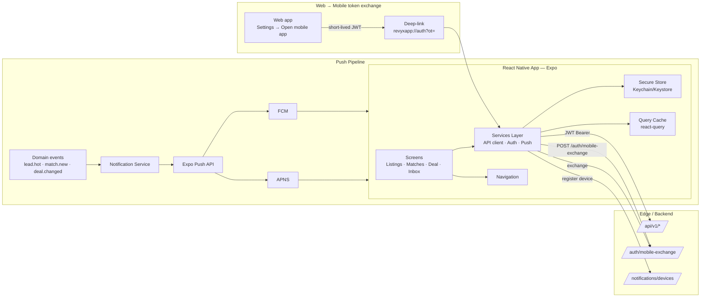

# TECH SPEC — MOBILE APP REACT NATIVE (Expo · iOS + Android)
<!-- TECH_SPEC_REVYX_mobile-rn_v1.0.0.md · v1.0.0 · 2026-05 -->
<!-- CONFIDENȚIAL · Uz Intern · © 2026 REVYX · ITPRO SYSTEM SRL -->

## Changelog

| Versiune | Data | Autor | Note |
|---|---|---|---|
| 1.0.0 | 2026-05 | Senior PM + Solution Architect + Mobile Lead | ★ Spec inițială S8 — React Native (Expo) iOS + Android · scope MVP: browse listings, view matches, deal status, push notifications · auth JWT shared (web cookie → deep-link token exchange) · push Expo Push + backend webhook consumer · API reused `/api/v1/*` |

---

## Cuprins

1. [Executive Summary](#1-executive-summary)
2. [Architecture Overview](#2-architecture-overview)
3. [Stack & Dependencies](#3-stack--dependencies)
4. [Data Model (extensions)](#4-data-model-extensions)
5. [API Contracts (consumed + new)](#5-api-contracts)
6. [Algorithms (Auth Exchange · Push Routing · Offline Cache)](#6-algorithms)
7. [State Machines](#7-state-machines)
8. [Concurrency](#8-concurrency)
9. [Caching](#9-caching)
10. [Background Jobs](#10-background-jobs)
11. [Error Handling](#11-error-handling)
12. [Security](#12-security)
13. [Observability](#13-observability)
14. [Performance Budgets](#14-performance-budgets)
15. [Testing Strategy](#15-testing-strategy)
16. [Deployment & Rollout](#16-deployment--rollout)
17. [Migration Strategy](#17-migration-strategy)
18. [Risks & Mitigations](#18-risks--mitigations)
19. [Impact Assessment](#19-impact-assessment)

---

## 1. Executive Summary

★ **Mobile RN MVP** livrează aplicații native iOS + Android construite pe **React Native + Expo (managed workflow EAS)**, cu scope limitat la consum (browse listings, view matches, deal status, push notifications) — fără editare critică în MVP. Backend rămâne neschimbat: app consumă `/api/v1/*` existent (zero endpoint-uri dedicated).

| Atribut | Valoare |
|---|---|
| **Scope MVP** | Listings browse · listings detail · my matches · deal status board · push notifications · WhatsApp deeplink · sign-in (existing web → mobile token exchange) |
| **Out-of-scope MVP** | Edit listings · upload media · scoring config · admin · billing |
| **Target platforms** | iOS 15+ (iPhone 8+), Android 8.0+ (API 26+) |
| **Distribuție** | App Store + Google Play (TestFlight pilot 8 săpt) |
| **Owner tehnic** | Mobile Lead + Solution Architect + Security Lead |
| **Dependențe upstream** | Auth (JWT RS256) · Lead/Property/Match/Deal API · Notification service S7 |
| **Phase** | 5 (Maturitate platformă) |

**Garanții:**

1. **Zero endpoint-uri noi** — `/api/v1/*` existent reused. Adăugări permise doar pentru: token exchange (`/auth/mobile-exchange`), push token registration (`/notifications/devices`), feature-flag fetch.
2. **Auth seamless web→mobile** prin one-time deep-link token (signed, single-use, ≤90 sec TTL).
3. **Refresh token rotation** menținută identic cu web (RBAC neschimbat).
4. **Push end-to-end** ≤ 5s pentru evenimente HOT lead (NFR-derived).
5. **Offline graceful**: ultimele liste + match-uri cached read-only; mutating actions necesită online.
6. **Privacy:** PII nu se stochează în async storage; secrets în Keychain (iOS) / Keystore (Android).

---

## 2. Architecture Overview



### 2.1 Componente

| Componentă | Responsabilitate |
|---|---|
| Expo SDK 51+ | Runtime, OTA updates, native modules |
| React Navigation | Stack/tab navigation |
| react-query (TanStack) | Cache + retry + invalidation |
| Expo Secure Store | JWT + refresh token |
| Expo Notifications | Push handling foreground/background |
| Expo Updates | OTA non-breaking updates |
| Sentry RN | Crash reports |
| API client (axios + interceptors) | Auth header + refresh + retry |

---

## 3. Stack & Dependencies

| Layer | Tehnologie | Versiune | Justificare |
|---|---|---|---|
| Runtime | React Native | 0.74+ | RN stable cu New Architecture (Hermes) |
| Framework | Expo (managed) + EAS Build | SDK 51+ | TestFlight/Play upload via cloud builds |
| Language | TypeScript strict | 5.x | parity web stack |
| State | react-query 5.x + Zustand | latest | server cache + UI state |
| Forms | react-hook-form | latest | predictable validation |
| Date/i18n | date-fns + i18n-js | latest | RO/RU/EN |
| Maps (future) | react-native-maps | latest | Google/Apple Maps |
| Push | Expo Push Notifications | — | Single API for APNS+FCM |
| Auth tokens | Expo Secure Store | — | Keychain/Keystore |
| Crash | Sentry React Native | latest | Same org as backend |
| Tests | Jest + Detox (E2E) | latest | Standard RN |

**Notă:** `bare workflow` evitat în MVP — toate features acoperite cu Expo SDK. Eject considerat doar dacă: deep media manipulation sau biometric prompts custom.

---

## 4. Data Model (extensions)

Niciun model nou major — MVP citește. Doar 2 tabele suport pentru auth exchange + device registration.

### 4.1 Tabel `mobile_one_time_token`

```sql
-- Migrare: 0530_mobile_one_time_token.sql
CREATE TABLE IF NOT EXISTS mobile_one_time_token (
  token_id              UUID         PRIMARY KEY DEFAULT gen_random_uuid(),
  tenant_id             UUID         NOT NULL,
  user_id               UUID         NOT NULL,
  token_hash            BYTEA        NOT NULL UNIQUE,    -- HMAC-SHA256(secret, raw_token)
  issued_at             TIMESTAMPTZ  NOT NULL DEFAULT NOW(),
  expires_at            TIMESTAMPTZ  NOT NULL,           -- issued_at + 90s
  consumed_at           TIMESTAMPTZ  NULL,
  client_meta           JSONB        NULL,               -- { device_model, os }
  CHECK (expires_at > issued_at)
);
CREATE INDEX IF NOT EXISTS idx_motok_user ON mobile_one_time_token (user_id, issued_at DESC);
CREATE INDEX IF NOT EXISTS idx_motok_unconsumed ON mobile_one_time_token (expires_at) WHERE consumed_at IS NULL;
```

### 4.2 Tabel `mobile_device`

```sql
-- Migrare: 0531_mobile_device.sql
CREATE TABLE IF NOT EXISTS mobile_device (
  device_id             UUID         PRIMARY KEY DEFAULT gen_random_uuid(),
  tenant_id             UUID         NOT NULL,
  user_id               UUID         NOT NULL,
  expo_push_token       TEXT         NOT NULL,           -- 'ExponentPushToken[xxx]'
  platform              TEXT         NOT NULL CHECK (platform IN ('ios','android')),
  app_version           TEXT         NOT NULL,
  os_version            TEXT         NOT NULL,
  locale                TEXT         NOT NULL DEFAULT 'ro-MD',
  timezone              TEXT         NOT NULL DEFAULT 'Europe/Chisinau',
  notif_prefs           JSONB        NOT NULL DEFAULT '{}'::jsonb,    -- { hot_leads, match_new, deal_status }
  registered_at         TIMESTAMPTZ  NOT NULL DEFAULT NOW(),
  last_seen_at          TIMESTAMPTZ  NOT NULL DEFAULT NOW(),
  revoked_at            TIMESTAMPTZ  NULL,
  UNIQUE (user_id, expo_push_token)
);
CREATE INDEX IF NOT EXISTS idx_dev_user_active ON mobile_device (user_id) WHERE revoked_at IS NULL;
CREATE INDEX IF NOT EXISTS idx_dev_token ON mobile_device (expo_push_token) WHERE revoked_at IS NULL;
```

### 4.3 Tabel `mobile_push_log` (audit + delivery diagnostics)

```sql
-- Migrare: 0532_mobile_push_log.sql
CREATE TABLE IF NOT EXISTS mobile_push_log (
  push_id               UUID         PRIMARY KEY DEFAULT gen_random_uuid(),
  tenant_id             UUID         NOT NULL,
  user_id               UUID         NOT NULL,
  device_id             UUID         NOT NULL REFERENCES mobile_device(device_id),
  event_type            TEXT         NOT NULL,           -- 'LEAD_HOT' | 'MATCH_NEW' | 'DEAL_CHANGED' | ...
  payload               JSONB        NOT NULL,           -- ⚠ no PII; only IDs
  expo_ticket_id        TEXT         NULL,
  expo_receipt_id       TEXT         NULL,
  status                TEXT         NOT NULL CHECK (status IN ('QUEUED','SENT','DELIVERED','FAILED','EXPIRED','REVOKED_TOKEN')),
  error_code            TEXT         NULL,
  sent_at               TIMESTAMPTZ  NOT NULL DEFAULT NOW(),
  delivered_at          TIMESTAMPTZ  NULL,
  failed_at             TIMESTAMPTZ  NULL
) PARTITION BY RANGE (sent_at);                          -- monthly, retention 90 days
CREATE INDEX IF NOT EXISTS idx_pushlog_device ON mobile_push_log (device_id, sent_at DESC);
CREATE INDEX IF NOT EXISTS idx_pushlog_status ON mobile_push_log (status, sent_at DESC) WHERE status IN ('FAILED','REVOKED_TOKEN');
```

---

## 5. API Contracts

### 5.1 Reused (no change)

`/api/v1/leads`, `/api/v1/properties`, `/api/v1/matches`, `/api/v1/deals`, `/api/v1/showings`, `/api/v1/marketplace/*` (dacă feature flag-ed) — toate apelate cu JWT Bearer.

### 5.2 New (mobile-only)

| Method | Path | Auth | Descriere |
|---|---|---|---|
| `POST` | `/api/v1/auth/mobile-exchange` | one-time token | Body `{ot}` → returnează `{access, refresh, user}` |
| `POST` | `/api/v1/auth/mobile-issue-ot` | web JWT | Emite OT pentru deep-link `revyxapp://auth?ot=...` |
| `POST` | `/api/v1/notifications/devices` | mobile JWT | Body `{expo_push_token, platform, app_version, os_version, locale, timezone}` |
| `PATCH` | `/api/v1/notifications/devices/:id` | mobile JWT | Update notif_prefs sau locale |
| `DELETE` | `/api/v1/notifications/devices/:id` | mobile JWT | Logout / revoke token |
| `GET` | `/api/v1/feature-flags` | mobile JWT | Flag-uri relevante (mobile_marketplace, mobile_offline, ...) |
| `GET` | `/api/v1/me/timezone` | mobile JWT | Forced UTC+2 enforcement (BRD §0) |

Toate respectă RBAC global (agent-or-above). Niciun endpoint mobile-only bypass.

### 5.3 Schema TS

```typescript
type OtIssueResponse = { ot: string; expiresAt: string };
type OtExchangeRequest = { ot: string; client_meta?: { device_model?: string; os?: string } };
type OtExchangeResponse = { access: string; refresh: string; user: UserSummary };

type DeviceRegister = {
  expo_push_token: string;
  platform: 'ios' | 'android';
  app_version: string;
  os_version: string;
  locale?: string;
  timezone?: string;
};

type NotifPrefs = {
  hot_leads: boolean;          // LS≥0.75
  match_new: boolean;
  deal_status: boolean;
  showing_reminder: boolean;
  buyer_match: boolean;        // marketplace integration
};
```

---

## 6. Algorithms

### 6.1 Auth — Web → Mobile token exchange

**Step 1 (Web):** Utilizator în setări web `Open mobile app` → `POST /auth/mobile-issue-ot` cu cookie sesiune web.

```typescript
async function issueOt(userId: string, tenantId: string): Promise<{ot: string; expiresAt: Date}> {
  const raw = randomBytesHex(32);                        // 64-char hex
  const hash = hmacSha256(OT_SECRET, raw);
  const expiresAt = new Date(Date.now() + 90_000);       // 90s TTL
  await db.insertInto('mobile_one_time_token').values({
    tenant_id: tenantId, user_id: userId, token_hash: hash, expires_at: expiresAt,
  }).execute();
  return { ot: raw, expiresAt };
}
```

**Step 2 (Web → Mobile):** Web genereează deep-link `revyxapp://auth?ot=<raw>`. iOS Universal Link sau Android App Link asociate domeniului `revyx.app`.

**Step 3 (Mobile):** Mobile primește deep link → `POST /auth/mobile-exchange { ot }`.

```typescript
async function exchangeOt(rawOt: string, clientMeta: any): Promise<OtExchangeResponse> {
  const hash = hmacSha256(OT_SECRET, rawOt);
  const tx = await db.transaction(async (t) => {
    const row = await t.selectFrom('mobile_one_time_token')
      .where('token_hash','=',hash).where('consumed_at','is',null)
      .where('expires_at','>',new Date()).forUpdate().executeTakeFirst();
    if (!row) throw E('OT_INVALID_OR_EXPIRED');
    await t.updateTable('mobile_one_time_token').set({ consumed_at: new Date(), client_meta: clientMeta })
      .where('token_id','=',row.token_id).execute();
    return row;
  });
  // Emit standard JWT identical cu web (RS256, 15min access + 7d refresh + rotation)
  const { access, refresh } = await tokenIssuer.issuePair(tx.user_id, tx.tenant_id, { device: 'mobile' });
  await audit('AUTH_MOBILE_EXCHANGED', { userId: tx.user_id, tokenId: tx.token_id });
  return { access, refresh, user: await loadUserSummary(tx.user_id) };
}
```

**Refresh token policy:** identic web — single session per user (BR-12). Mobile login forțează logout din alte sessions decât dacă config tenant `multi_session_mobile=true`.

### 6.2 Push token registration

```typescript
// Mobile: la pornire, după auth, întreabă permission, primește expoPushToken
async function registerDeviceFlow() {
  const { status } = await Notifications.requestPermissionsAsync();
  if (status !== 'granted') return;
  const token = (await Notifications.getExpoPushTokenAsync({ projectId })).data;
  await api.post('/api/v1/notifications/devices', {
    expo_push_token: token,
    platform: Platform.OS,
    app_version: Constants.expoConfig.version,
    os_version: Platform.Version.toString(),
    locale: Localization.locale,
    timezone: Localization.timezone,
  });
}
```

Backend `POST /notifications/devices` — UPSERT pe `(user_id, expo_push_token)` cu `revoked_at=NULL`, refresh `last_seen_at`. Enforced max 5 active devices per user (cele mai vechi auto-revoked).

### 6.3 Push routing & throttling

```typescript
async function emitPush(event: DomainEvent) {
  const recipients = await routeRecipients(event);
  for (const r of recipients) {
    const devices = await loadActiveDevices(r.userId);
    for (const d of devices) {
      if (!d.notif_prefs[event.notifKey] ?? true) continue;            // user disabled
      await pushQueue.add('push.send', {
        deviceId: d.device_id, eventType: event.type,
        title: i18n.t(`push.${event.type}.title`, d.locale, event.params),
        body:  i18n.t(`push.${event.type}.body`,  d.locale, event.params),
        data:  redactPii(event.payload),                                // ⚠ never PII in payload
      });
    }
  }
}

// Worker
async function sendPush(job) {
  const dev = await loadDevice(job.deviceId);
  if (!dev || dev.revoked_at) return;
  const ticket = await expo.sendPushNotificationsAsync([{
    to: dev.expo_push_token,
    title: job.title, body: job.body, data: job.data, sound: 'default',
    priority: prioFromEvent(job.eventType),                              // 'high' for lead.hot
    channelId: 'default',                                                // android channel
    badge: 1,
  }]);
  const t = ticket[0];
  await db.insertInto('mobile_push_log').values({
    tenant_id: dev.tenant_id, user_id: dev.user_id, device_id: dev.device_id,
    event_type: job.eventType, payload: job.data, expo_ticket_id: t.id ?? null,
    status: t.status === 'ok' ? 'SENT' : 'FAILED',
    error_code: t.status === 'ok' ? null : (t.details?.error ?? 'UNKNOWN'),
  }).execute();

  if (t.status !== 'ok' && t.details?.error === 'DeviceNotRegistered') {
    await markDeviceRevoked(dev.device_id, 'EXPO_DEVICE_NOT_REGISTERED');
  }
}
```

**Receipt polling:** după 15 min `expo.getPushNotificationReceiptsAsync(ticketIds)` → update `expo_receipt_id`, `status=DELIVERED|FAILED`. Job idempotent.

**Throttling:** max 50 push/min/user (anti-flood); peste → coalesce într-un singur push „N notificări noi" cu deep-link la inbox.

### 6.4 Deep linking

| Schema | Path | Acțiune |
|---|---|---|
| `revyxapp://auth?ot=<token>` | universal link `https://revyx.app/applink/auth` | exchange OT |
| `revyxapp://leads/<id>` | `https://revyx.app/applink/leads/<id>` | open lead detail |
| `revyxapp://matches/<id>` | `https://revyx.app/applink/matches/<id>` | open match |
| `revyxapp://deals/<id>` | `https://revyx.app/applink/deals/<id>` | open deal |

iOS `apple-app-site-association` și Android `assetlinks.json` configurate la `https://revyx.app/.well-known/`.

### 6.5 Offline cache strategy

- **react-query** cu `cacheTime: 1h` + `staleTime: 60s` pentru liste; `1h staleTime` pentru detail.
- Persistent cache via `@tanstack/query-persist-client-async-storage` cu **whitelist** queries (no PII-sensitive — listings + matches metadata, deal status — fără `lead.contact_pii`).
- Mutating actions (showing checkin, deal status update) **REQUIRE** online — UI shows offline indicator + retry queue (max 1h).
- Logout = clear all caches + secure store + push token revoke.

### 6.6 Internationalization

- `i18n-js` cu key namespacing `screen.<name>.<key>`.
- Locale loaded la cold start din `Localization.locale`; fallback `ro-MD`.
- Timezone forced `Europe/Chisinau` la afișare timestamps (CLAUDE.md §0).
- Currency default EUR; afișat cu separator `.` (mii) și `,` (zecimale) — RO/MD convention.

### 6.7 OTA updates (Expo Updates)

- Channels: `production`, `staging`, `pilot`.
- Auto-update on app start + background fetch.
- Limit: doar JS/asset updates; native code change → store release.
- Rollback: pin previous runtime version via EAS dashboard.
- Forced update prompt: dacă API răspunde `426 Upgrade Required` (versiune client < `min_supported`).

---

## 7. State Machines

### 7.1 OT lifecycle

```
ISSUED ──exchange(ok)──> CONSUMED
ISSUED ──expires_at──> EXPIRED (lazy via index)
ISSUED ──exchange(invalid hash)──> rejected (no state change)
```

### 7.2 Device lifecycle

```
REGISTERED ──user delete OR Expo DeviceNotRegistered──> REVOKED
REGISTERED ──last_seen_at < NOW − 90d──> STALE → revoked job
```

### 7.3 Push delivery

```
QUEUED ──worker send──> SENT ──receipt poll(ok)──> DELIVERED
SENT ──receipt poll(fail)──> FAILED
SENT ──receipt poll(DeviceNotRegistered)──> REVOKED_TOKEN
QUEUED ──TTL 1h──> EXPIRED
```

---

## 8. Concurrency

- OT exchange: `SELECT ... FOR UPDATE` previne dublu-consum (race deep-link reopened).
- Device upsert pe `(user_id, expo_push_token)` UNIQUE — ON CONFLICT update `last_seen_at`.
- Push queue: BullMQ cu deduplicare `event_id:user_id` în 60s (anti-storm).
- Receipt poll: idempotent; ticket_id UNIQUE.

---

## 9. Caching

| Layer | Key | TTL | Invalidation |
|---|---|---|---|
| Mobile react-query | `listings:filter:hash` | 60s stale, 1h cache | manual on push `match.new` |
| Mobile react-query | `deals:list` | 60s stale | push `deal.changed` |
| Mobile secure-store | JWT access | 15 min | refresh interceptor |
| Mobile secure-store | refresh token | 7 zile + rotation | logout |
| Backend Redis | `me:timezone:{userId}` | 1h | profile change |

---

## 10. Background Jobs

| Job | Trigger | Idempotent |
|---|---|---|
| `mobile.ot.cleanup` | cron `*/5 * * * *` | DA (delete consumed/expired >24h) |
| `mobile.push.send` | event domain | DA (event_id deduplication 60s) |
| `mobile.push.receipts.poll` | cron `*/15 * * * *` | DA |
| `mobile.device.stale.revoke` | cron daily | DA |
| `mobile.pushlog.partition.maintain` | cron monthly | DA |

---

## 11. Error Handling

| Cod | Caz | Răspuns |
|---|---|---|
| `OT_INVALID_OR_EXPIRED` | wrong hash sau >90s | 401 |
| `OT_ALREADY_CONSUMED` | replay | 401 (uniform 401 anti-enum) |
| `MOBILE_VERSION_UNSUPPORTED` | app_version < min | 426 + `min_supported` |
| `DEVICE_NOT_FOUND` | DELETE pe token gone | 404 |
| `PUSH_TOKEN_REVOKED` | DeviceNotRegistered de la Expo | log + auto-revoke |
| `PUSH_RATE_LIMITED` | >50 push/min/user | coalesce |
| `LOCALE_UNSUPPORTED` | i18n missing key | fallback EN + log warning |

---

## 12. Security

### 12.1 Auth & tokens

- JWT RS256 identic web (Phase 0).
- Access token în memory (RAM); refresh token în Secure Store (Keychain/Keystore).
- Refresh rotation: vechi refresh invalidat la fiecare schimb (single-use); reuse detected → revoke session + audit `AUTH_REFRESH_REUSE`.
- Single session per user enforced (BR-12); login mobile = logout web (configurable per tenant).

### 12.2 OT (one-time token)

- 64-char hex (256-bit) cryptographically random.
- HMAC-SHA256 hash stocat (cleartext NU stocat).
- TTL ≤90s; consumed_at exclusive.
- Rate limit: 3 issue/min/user; 10 exchange attempts/min/IP (anti-bruteforce).

### 12.3 Push payload privacy

- **NICIODATĂ PII** (telefoane, nume complete) în notification body sau data.
- Doar IDs + i18n keys; mobile face fetch on-tap pentru detail.
- Audit `MOBILE_PUSH_SENT` în `mobile_push_log` (no PII column).

### 12.4 Secure Store

- Keychain (iOS) cu `kSecAttrAccessibleAfterFirstUnlock` (refresh token survives reboot).
- Keystore (Android) cu `setUserAuthenticationRequired(false)` for refresh token, `true` pentru biometric-gated features (future).
- Secrets NU se loghează niciodată; Sentry redaction layer obligatoriu.

### 12.5 Network

- Certificate pinning pentru `*.revyx.app` (sha256 fingerprints — 2 keys: primary + backup pentru rotație).
- HTTPS only; ATS strict iOS, Network Security Config Android.
- WebView sandbox: dacă deschide URL extern (showcase link), se folosește `WebBrowser.openBrowserAsync` (system browser), nu WebView in-app.

### 12.6 RBAC

Mobile NU adaugă roluri. Roluri agent/senior_agent/team_lead/manager funcționale ca pe web. Admin features intenționat NU disponibile mobile (reduce blast radius).

### 12.7 GDPR

- Push notif consent obligatoriu OS-level (granted la prima cerere).
- User poate dezactiva per-tip notification din Settings → notif_prefs.
- Logout = revoke `mobile_device` + clear cache + clear secure store.
- DSAR export include `mobile_device` + `mobile_push_log` (90d retention).

### 12.8 App store guidelines compliance

- iOS: Privacy Policy linked în App Store Connect; Data Collection labels updated (no tracking, no third-party SDK ads).
- Android: Data Safety section completat; no sensitive permissions beyond push, network.

### 12.9 Audit events

`AUTH_MOBILE_OT_ISSUED`, `AUTH_MOBILE_OT_EXCHANGED`, `AUTH_MOBILE_OT_INVALID_ATTEMPT`, `MOBILE_DEVICE_REGISTERED`, `MOBILE_DEVICE_REVOKED`, `MOBILE_PUSH_SENT` (sampled), `MOBILE_PUSH_RECEIPT_FAILED`, `AUTH_REFRESH_REUSE`.

---

## 13. Observability

### 13.1 Backend metrics

| Metric | Tip | Alert |
|---|---|---|
| `mobile_ot_exchange_success_rate` | gauge | <95% în 1h |
| `mobile_ot_exchange_latency_ms_p95` | histogram | >300ms |
| `mobile_push_delivered_rate{event}` | gauge | <85% în 1h |
| `mobile_push_delivery_latency_ms_p95{event}` | histogram | >5000ms (HOT) |
| `mobile_active_devices_total{platform}` | gauge | drop >10% wow |
| `mobile_app_version_distribution` | gauge | tail >30% on min_supported−1 |
| `mobile_refresh_reuse_total` | counter | >0 → security alert |

### 13.2 Mobile telemetry

- Sentry: crash-free sessions ≥ 99%.
- Custom events: `screen_view`, `auth_exchange_success/fail`, `push_received`, `push_opened`.
- Performance: TTI cold start, screen render p95.

### 13.3 Dashboards

`REVYX / Mobile Health` + `REVYX / Push Pipeline`.

---

## 14. Performance Budgets

| Metric | Target |
|---|---|
| Cold start TTI | iOS <2.5s · Android <3.5s (mid-tier) |
| Listings list render (50 items) | <300ms |
| OT exchange roundtrip | p95 <500ms |
| Push delivery (Expo→APNS/FCM→device) HOT | p95 <5s end-to-end |
| Crash-free sessions | ≥99% |
| App size | iOS <60 MB · Android <40 MB (split APK) |

---

## 15. Testing Strategy

### 15.1 Unit (Jest)

- API client interceptors (refresh, retry, 401 redirect to login).
- i18n fallback chain.
- Push payload builders — PII redaction snapshot.
- OT exchange handler (server-side).

### 15.2 Component (React Native Testing Library)

- Listings list (loading, empty, error states).
- Deal status board.
- Notif prefs toggles persist.

### 15.3 E2E (Detox)

- Login flow web → deep-link → mobile authenticated.
- Receive push notification → tap → land on correct screen.
- Offline: airplane mode → cached lists visible; mutating action → queued + retry.

### 15.4 Backend integration

- OT issue → exchange → JWT validated.
- Device registration UPSERT.
- Push send → ticket → receipt → status updated.

### 15.5 Load

- 10k devices receive lead.hot push within 5s p95.
- 1k OT exchanges/min — DB no contention.

### 15.6 Security tests

- OT replay → 401.
- OT brute-force IP rate limit kicks in.
- Refresh reuse detection → session revoke + alert.
- Cert pinning bypass (Frida) → app refuses connection.
- Push payload assertion: no PII (regex `\b\+?\d{8,15}\b` + email pattern).

### 15.7 Coverage

| Layer | Coverage |
|---|---|
| API client + interceptors | ≥95% |
| Auth flows backend | ≥95% |
| Push send + receipt | ≥90% |
| Mobile components | ≥80% |
| E2E happy paths | 100% scenarios |

---

## 16. Deployment & Rollout

| Aspect | Detaliu |
|---|---|
| Build | EAS Build cloud (iOS + Android in parallel) |
| Distribution pilot | TestFlight (iOS) + Play Internal Track (Android) |
| Pilot duration | 8 săpt cu 30 agenți selectați |
| GA distribution | App Store + Play Store production |
| Feature flags | `flag.mobile_app.enabled` per tenant; sub-flags: `mobile_marketplace`, `mobile_push_hot_lead` |
| OTA | EAS Update channels: `pilot`, `production` |
| Forced update | Backend răspunde 426 cu `min_supported`; mobile prompts store update |
| Rollback OTA | EAS dashboard pin previous runtime |
| Rollback store | iOS phased release halt; Android halted rollout |

### 16.1 Rollout plan

| Săpt | Etapă |
|---|---|
| 1-2 | Build pilot · TestFlight 5 internal QA |
| 3-4 | TestFlight 30 agenți pilot (1 tenant) |
| 5-6 | Play Internal Track + iterație |
| 7-8 | Production submit · phased rollout 5%→25%→50%→100% |
| 9+ | Monitor crash-free, push delivery, telemetry |

---

## 17. Migration Strategy

```
0530_mobile_one_time_token.sql
0531_mobile_device.sql
0532_mobile_push_log.sql        (PARTITION BY RANGE monthly, retention 90d)
```

Idempotente. No backfill — feature opt-in per user/device.

---

## 18. Risks & Mitigations

| # | Risc | Probab. | Impact | Mitigare |
|---|---|---|---|---|
| R1 | Apple/Google review respinge (privacy labels lipsă) | MED | HIGH | Privacy review pre-submit · DPO sign-off · App Privacy Manifest (iOS 17+) |
| R2 | Expo Push downtime → notif missed | LOW | HIGH | Fallback la APNS/FCM direct (long-term); monitoring + status page Expo |
| R3 | Cert pinning rotation breaks app | LOW | HIGH | Backup pin în config + OTA update path · 90 zile overlap |
| R4 | OT replay attack | LOW | HIGH | Single-use + 90s TTL + HMAC hash + rate limit |
| R5 | PII leaked în push payload (bug) | MED | CRITICAL | Snapshot test redaction · CI guard · Sentry redaction |
| R6 | Refresh token theft via root/jailbreak | LOW | HIGH | Detect rooted/jailbroken (best-effort warning) · short access TTL · refresh rotation |
| R7 | OTA push code with bug → mass crash | MED | HIGH | Staged rollout · auto-revert dacă crash-free <97% în 1h |
| R8 | App version fragmentation | HIGH | MED | Forced update prompt 426 · sunset old `min_supported` semestrial |
| R9 | i18n missing keys → blanks UX | MED | LOW | Fallback EN + Sentry log + CI key-coverage check |
| R10 | OS push permission denied → no push | MED | MED | Banner reminder + Settings deep-link + degradation graceful (in-app inbox alternativ) |

---

## 19. Impact Assessment

### 19.1 Scope of Change

| Element | Detaliu |
|---|---|
| Document | TECH_SPEC_REVYX_mobile-rn_v1.0.0.md |
| Tip | NEW (S8 deliverable #4) |
| Aria | New surface (mobile app) · auth extension · push pipeline · device registry |
| Origine | S8 brief — RN MVP iOS+Android |

### 19.2 Impact pe documente conexe

| Document | Impact | Acțiune |
|---|---|---|
| BRD | Minor | §10 surface extins ★ — mobile MVP |
| `audit-log` v1.0.0 | Minor | Catalog event extins `MOBILE_*`, `AUTH_MOBILE_*` |
| `webhook-intake` v1.0.0 | None | — |
| `lead-scoring` / `match` / `dhi` etc. | None | API reused as-is |
| `marketplace-two-sided` (S8) | Minor | Push events buyer match propagated mobile |
| `white-label` (S8) | Minor | Mobile theme via `/public/brand` per tenant (future) |

### 19.3 Impact pe scoring

Niciunul — mobile e pur consumer.

### 19.4 Impact pe entități / schema BD

| Entitate | Modificare | Migrare |
|---|---|---|
| `mobile_one_time_token` | NEW | 0530 |
| `mobile_device` | NEW | 0531 |
| `mobile_push_log` | NEW (partitioned) | 0532 |

### 19.5 Impact pe RBAC

Niciun rol nou. RBAC existent enforced via JWT.

### 19.6 Impact pe SLA & NFR

| NFR | Detaliu |
|---|---|
| Push HOT lead | p95 <5s end-to-end |
| Cold start | iOS <2.5s · Android <3.5s |
| Crash-free | ≥99% |
| App version sunset | semestrial |

### 19.7 Securitate & GDPR

| Aspect | Status | Notă |
|---|---|---|
| PII | NU în push payload | §12.3 |
| AUDIT events | DA | §12.9 |
| Cert pinning | DA | §12.5 |
| DSAR includes mobile data | DA | §12.7 |
| OS permission consent | DA | §12.7 |

### 19.8 Test Plan

Vezi §15. Critical: PII redaction in push, OT replay, cert pinning bypass.

### 19.9 Rollout & Rollback

TestFlight pilot 8 săpt → phased prod rollout. Rollback prin OTA pin sau halted store rollout.

### 19.10 Approval Gate

| Aprobator | Necesar pentru |
|---|---|
| Senior PM | Scope MVP · pilot agenți |
| Solution Architect | OT design · push pipeline · API surface |
| Mobile Lead | Stack · Expo SDK · CI/CD EAS |
| Security Lead | OT · cert pinning · refresh rotation · PII redaction |
| DPO | Privacy manifest · DSAR · push consent |

---

*docs/tech-spec/TECH_SPEC_REVYX_mobile-rn_v1.0.0.md · v1.0.0 · 2026-05 · CONFIDENȚIAL · Uz Intern*
*REVYX — Real Estate Execution Intelligence · © 2026 REVYX · ITPRO SYSTEM SRL*
