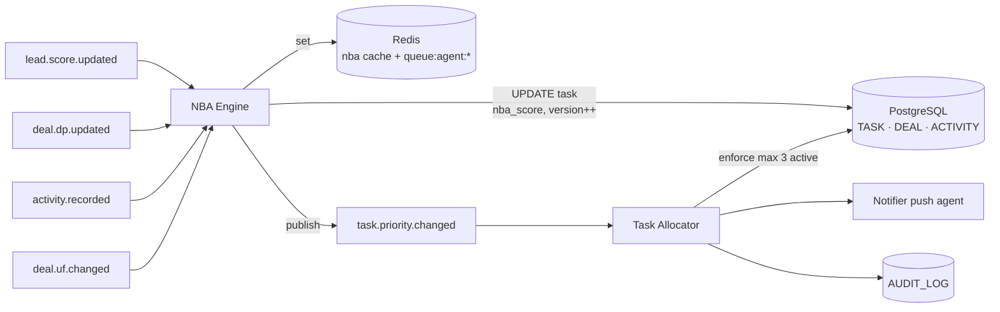

# TECH SPEC — REVYX NBA Engine
<!-- TECH_SPEC_REVYX_nba-engine_v1.0.0.md · v1.0.0 · 2026-05 -->
<!-- CONFIDENȚIAL · Uz Intern · © 2026 REVYX · ITPRO SYSTEM SRL -->

## Changelog

| Versiune | Data | Autor | Note |
|---|---|---|---|
| 1.0.0 | 2026-05 | Senior PM + Solution Architect | Spec inițială NBA — formulă DP × UF × e^(−0.1·Δt), scala [0, 2.0], Task Allocator max 3 active (BR-04), UTC+2 forțat · Phase 1 |

---

## Cuprins

1. [Executive Summary](#1-executive-summary)
2. [Architecture Overview](#2-architecture-overview)
3. [Stack & Dependencies](#3-stack--dependencies)
4. [Data Model](#4-data-model)
5. [API Contracts](#5-api-contracts)
6. [Algorithms](#6-algorithms)
7. [State Machines](#7-state-machines)
8. [Concurrency](#8-concurrency)
9. [Caching](#9-caching)
10. [Background Jobs](#10-background-jobs)
11. [Error Handling](#11-error-handling)
12. [Security](#12-security)
13. [Observability](#13-observability)
14. [Performance Budgets](#14-performance-budgets)
15. [Testing Strategy](#15-testing-strategy)
16. [Deployment](#16-deployment)
17. [Migration Strategy](#17-migration-strategy)
18. [Risks & Mitigations](#18-risks--mitigations)
19. [Impact Assessment](#19-impact-assessment)

---

## 1. Executive Summary

NBA (Next Best Action) Engine este componenta de prioritizare a task-urilor agentului. Calculează scorul brut `NBA = DP × UF × e^(−0.1 × Δt)` (BRD §7.5), aplică sortare descrescătoare, alimentează Task Allocator care impune `max 3 task-uri active per agent` (BR-04). NBA este **singura excepție de scală** din REVYX — domeniul `[0, 2.0]` (BRD §7 nota star).

| Atribut | Valoare |
|---|---|
| **Scope** | Calcul NBA · Task Queue ordering · Task Allocator (BR-04) · Task lifecycle |
| **Referință BRD** | §5 Pilon 04 · §6.1 BR-04 · §7.5 · §12 T02 (Δt=100→NBA≈0) · T06 (NBA_max=2.0) |
| **Phase** | 1 (Core engines) — versiune cu DP din Phase 1 (poate folosi defaults APS_default=0.65) |
| **Owner tehnic** | Solution Architect + Senior PM |
| **Dependențe upstream** | lead-scoring v1.0.0 (LS, IS) · property v1.0.0 (PS) · agent (APS · seed) |
| **Dependențe downstream** | Agent UI dashboard · Escalation Watcher (re-prioritize) |

**Garanții oferite:**

1. NBA ∈ [0, 2.0] — clamp explicit la output (T06).
2. Δt = zile de la ultima ACTIVITY pe entitatea relevantă, calculat în **timezone UTC+2 (Europe/Chișinău)** forced (BR-12 timezone constraint).
3. Recalc NBA ≤ 30 sec de la modificare DP/UF/Δt (NFR-01 derivat).
4. Task Allocator: maxim **3 task-uri active per agent** la orice moment (BR-04, AC-LS).
5. Sort task queue descrescător după valoarea brută NBA, **nu normalizată** (BRD §7.5).
6. T02: Δt = 100 zile → NBA ≈ 0 (e^−10 ≈ 4.54e-5) — deal apare ultimul.
7. T06: DP=1.0, UF=2.0, Δt=0 → NBA = 2.0 — deal apare primul.

---

## 2. Architecture Overview



### 2.1 Data flow

1. Trigger event publicat: `lead.score.updated`, `deal.dp.updated`, `activity.recorded`, `deal.uf.changed`, `task.completed`.
2. NBA Engine recalculează DP (din spec match-engine) + UF (mapping urgency) + Δt (NOW − last activity in UTC+2).
3. UPDATE `task.nba_score` cu optimistic locking.
4. Task Allocator re-evaluează coada agentului și asigură `max 3 active` (BR-04).
5. Re-prioritization push în UI agent prin event `task.priority.changed`.

### 2.2 Componente principale

| Componentă | Responsabilitate |
|---|---|
| `NBAEngine` | Calcul NBA per task · clamp [0,2.0] · cache Redis |
| `UrgencyFactorResolver` | Mapping label → UF (1.0/1.3/1.6/2.0) cu sursă `deal.urgency_label` |
| `DeltaTResolver` | Δt din ACTIVITY ultima per `entity_id` în timezone UTC+2 |
| `TaskAllocator` | Asignare task→agent cu enforcement max 3 active (BR-04) · APS-aware fallback |
| `TaskQueueService` | Listare paginată sortată desc NBA pentru UI agent |

---

## 3. Stack & Dependencies

| Layer | Tehnologie | Versiune | Justificare |
|---|---|---|---|
| Backend | Node.js + TypeScript | 20 LTS · TS 5.x | Stack standard REVYX |
| ORM | Kysely | latest | SQL precis pentru `EXTRACT(DAY FROM ...)` cu timezone |
| DB | PostgreSQL | 16.x | `AT TIME ZONE 'Europe/Chisinau'` · GENERATED columns opționale |
| Cache | Redis | 7.x | `ZSET` pentru sorted queue per agent |
| Queue | BullMQ | latest | Recalc batch jobs |
| Audit | `auditLogger` | 1.0.0 | Manual override · re-asignare |

---

## 4. Data Model

### 4.1 Tabel `task` (Phase 1 — extins față de BRD §8 inițial)

```sql
-- Migrare: 0090_task_phase1.sql
CREATE TABLE IF NOT EXISTS task (
  task_id                 UUID            PRIMARY KEY DEFAULT gen_random_uuid(),
  tenant_id               UUID            NOT NULL,
  agent_id                UUID            NOT NULL REFERENCES agent(agent_id),

  -- Sursa task-ului
  source_entity_type      TEXT            NOT NULL CHECK (source_entity_type IN ('lead','deal','property','showing','offer')),
  source_entity_id        UUID            NOT NULL,

  -- Tipul recomandat (Phase 2 — model NBA poate sugera tip specific; Phase 1 derivat din status)
  task_type               TEXT            NOT NULL CHECK (task_type IN (
    'first_contact','follow_up','schedule_showing','send_property',
    'request_documents','draft_offer','close_deal','review_no_show','custom'
  )),
  task_label              TEXT            NULL,

  -- Scoring
  nba_score               NUMERIC(5,4)    NOT NULL DEFAULT 0 CHECK (nba_score BETWEEN 0 AND 2.0),
  nba_components          JSONB           NULL,   -- { dp, uf, delta_t_days, exp_factor }
  nba_calculated_at       TIMESTAMPTZ     NOT NULL DEFAULT NOW(),

  -- Lifecycle
  status                  TEXT            NOT NULL DEFAULT 'PENDING' CHECK (status IN ('PENDING','ACTIVE','COMPLETED','SNOOZED','CANCELLED','REASSIGNED')),
  activated_at            TIMESTAMPTZ     NULL,        -- când a devenit unul din top 3
  completed_at            TIMESTAMPTZ     NULL,
  snoozed_until           TIMESTAMPTZ     NULL,        -- max +24h, validat în service
  cancellation_reason     TEXT            NULL,

  -- Optimistic locking
  version                 BIGINT          NOT NULL DEFAULT 1,

  due_at                  TIMESTAMPTZ     NULL,        -- moștenit din SLA dacă e un task de tip first_contact
  created_at              TIMESTAMPTZ     NOT NULL DEFAULT NOW(),
  updated_at              TIMESTAMPTZ     NOT NULL DEFAULT NOW()
);

-- Indexuri critice
CREATE INDEX IF NOT EXISTS idx_task_agent_active
  ON task (tenant_id, agent_id, nba_score DESC)
  WHERE status = 'ACTIVE';
CREATE INDEX IF NOT EXISTS idx_task_agent_pending
  ON task (tenant_id, agent_id, nba_score DESC)
  WHERE status = 'PENDING';
CREATE INDEX IF NOT EXISTS idx_task_source
  ON task (tenant_id, source_entity_type, source_entity_id);
CREATE INDEX IF NOT EXISTS idx_task_due
  ON task (due_at) WHERE due_at IS NOT NULL AND status IN ('PENDING','ACTIVE');

-- Constraint BR-04: max 3 ACTIVE per agent enforced via partial unique + counter trigger.
-- Implementare alternativă (recomandată) — trigger BEFORE INSERT/UPDATE care numără ACTIVE per agent_id.
```

### 4.2 Trigger BR-04 (max 3 active per agent)

```sql
CREATE OR REPLACE FUNCTION task_enforce_max_3_active() RETURNS TRIGGER AS $$
DECLARE
  active_count INTEGER;
BEGIN
  IF NEW.status = 'ACTIVE' AND (TG_OP = 'INSERT' OR OLD.status <> 'ACTIVE') THEN
    SELECT COUNT(*) INTO active_count
      FROM task
      WHERE tenant_id = NEW.tenant_id
        AND agent_id = NEW.agent_id
        AND status = 'ACTIVE'
        AND task_id <> NEW.task_id;
    IF active_count >= 3 THEN
      RAISE EXCEPTION 'BR_04_MAX_3_ACTIVE_TASKS' USING ERRCODE = '23514';
    END IF;
  END IF;
  RETURN NEW;
END;
$$ LANGUAGE plpgsql;

CREATE TRIGGER trg_task_max_3_active
  BEFORE INSERT OR UPDATE OF status ON task
  FOR EACH ROW EXECUTE FUNCTION task_enforce_max_3_active();
```

### 4.3 ALTER `deal` — câmpuri urgență

```sql
-- Migrare: 0091_deal_urgency.sql
ALTER TABLE deal
  ADD COLUMN IF NOT EXISTS urgency_label TEXT NULL CHECK (urgency_label IS NULL OR urgency_label IN ('normal','approaching','declared','critical')),
  ADD COLUMN IF NOT EXISTS expected_close_date DATE NULL;
```

Mapping label → UF: `normal=1.0`, `approaching=1.3`, `declared=1.6`, `critical=2.0` (BRD §7.5).

### 4.4 Constraints & invariants

| Invariant | Enforcement |
|---|---|
| `nba_score ∈ [0, 2.0]` | CHECK + clamp app-side |
| Max 3 ACTIVE per agent (BR-04) | Trigger §4.2 |
| `version` strict crescător | UPDATE WHERE version=:prev |
| Δt non-negative | App: max(0, days_since_last_activity) |
| `snoozed_until ≤ NOW()+24h` | App-level + check pre-INSERT |

---

## 5. API Contracts

### 5.1 Internal services

```typescript
interface NBAEngine {
  recalcForTask(taskId: string): Promise<NBAResult>;
  recalcForEntity(entityType: SourceEntityType, entityId: string): Promise<NBAResult[]>;
}

interface TaskAllocator {
  allocate(input: AllocateInput): Promise<Task>;
  promoteNextActive(agentId: string): Promise<Task | null>;  // promovează cel mai mare PENDING când slot liber
  reassign(taskId: string, newAgentId: string, reason: string, actor: User): Promise<Task>;
}

interface TaskQueueService {
  listForAgent(agentId: string, opts?: { status?: TaskStatus[]; limit?: number }): Promise<Task[]>;
  complete(taskId: string, outcome: TaskOutcome, actor: User): Promise<void>;
  snooze(taskId: string, until: Date, actor: User): Promise<void>;
}
```

### 5.2 REST endpoints

| Method | Path | RBAC | Descriere |
|---|---|---|---|
| `GET` | `/api/v1/tasks/queue` | agent | Top tasks pentru agent (3 ACTIVE + N PENDING sortate desc NBA) |
| `GET` | `/api/v1/tasks/:id` | agent (own) / team_lead+ | Detalii task + componente NBA |
| `POST` | `/api/v1/tasks/:id/complete` | agent (own) | Marchează completed cu outcome |
| `POST` | `/api/v1/tasks/:id/snooze` | agent (own) | Snooze max 24h |
| `POST` | `/api/v1/tasks/:id/reassign` | team_lead+ | Re-asignare manuală cu reason |
| `POST` | `/api/v1/tasks/:id/recalc-nba` | manager+ | Forțează recalc (debug) |

---

## 6. Algorithms

### 6.1 NBA formula (BRD §7.5)

```typescript
// NBA = DP × UF × e^(−0.1 × Δt)
// Scala: [0, 2.0] (singura excepție din REVYX)
// NBA_max = 2.0 când DP=1.0, UF=2.0, Δt=0

const NBA_LAMBDA = 0.1;
const NBA_MIN = 0;
const NBA_MAX = 2.0;

function calculateNBA(input: NBAInputs): NBAResult {
  const dp = clamp01(input.dp);                      // [0,1]
  const uf = clampRange(input.uf, 1.0, 2.0);         // BRD: 1.0/1.3/1.6/2.0
  const dt = Math.max(0, input.deltaTDays);          // zile non-negative
  const expFactor = Math.exp(-NBA_LAMBDA * dt);
  const raw = dp * uf * expFactor;
  const nba = Math.max(NBA_MIN, Math.min(NBA_MAX, raw));
  return {
    nba,
    components: { dp, uf, delta_t_days: dt, exp_factor: expFactor },
  };
}
```

### 6.2 UF mapping (BRD §7.5)

```typescript
type UrgencyLabel = 'normal'|'approaching'|'declared'|'critical';

const UF_MAP: Record<UrgencyLabel, number> = {
  normal:      1.0,
  approaching: 1.3,
  declared:    1.6,
  critical:    2.0,
};

function resolveUrgencyFactor(deal: Deal, now: Date): { uf: number; label: UrgencyLabel } {
  // 1. Override declarat manual de buyer/agent → declared (1.6) sau critical (2.0)
  if (deal.urgency_label === 'critical') return { uf: 2.0, label: 'critical' };
  if (deal.urgency_label === 'declared') return { uf: 1.6, label: 'declared' };

  // 2. Auto bazat pe expected_close_date
  if (deal.expected_close_date) {
    const daysToClose = daysBetween(now, deal.expected_close_date, 'Europe/Chisinau');
    if (daysToClose <= 7)  return { uf: 2.0, label: 'critical' };
    if (daysToClose <= 30) return { uf: 1.3, label: 'approaching' };
  }

  return { uf: 1.0, label: 'normal' };
}
```

### 6.3 Δt calculation cu timezone UTC+2 forțat

```typescript
import { toZonedTime } from 'date-fns-tz';

const TZ = 'Europe/Chisinau';

async function resolveDeltaTDays(entityType: string, entityId: string, now: Date): Promise<number> {
  // Ultima ACTIVITY pe entitatea relevantă (lead sau deal — pentru deal include cascadă lead+property)
  const lastActivity = await db.selectFrom('activity')
    .where('entity_type','=',entityType)
    .where('entity_id','=',entityId)
    .orderBy('occurred_at','desc')
    .limit(1)
    .select(['occurred_at']).executeTakeFirst();

  if (!lastActivity) return 0; // entitate nouă fără activitate → Δt=0 (NBA = DP×UF)

  // Forțăm UTC+2 pe ambele momente — Δt = floor diferență zile calendar locale
  const lastLocal = toZonedTime(lastActivity.occurred_at, TZ);
  const nowLocal  = toZonedTime(now, TZ);
  const diffMs = nowLocal.getTime() - lastLocal.getTime();
  return Math.max(0, Math.floor(diffMs / (24*60*60_000)));
}
```

> **Notă timezone:** REVYX rulează în Republica Moldova (UTC+2 fix; UTC+3 DST în vigoare aprilie–octombrie) — `Europe/Chisinau` gestionează DST automat. Δt calculat în zile calendar locale, nu UTC, pentru a evita off-by-one la miezul nopții.

### 6.4 Recalc orchestration

```typescript
async function recalcForTask(taskId: string): Promise<NBAResult> {
  return db.transaction(async (tx) => {
    const task = await tx.selectFrom('task').where('task_id','=',taskId).forUpdate().executeTakeFirstOrThrow();
    const deal = await tx.selectFrom('deal').where('deal_id','=',task.source_entity_id /* sau lead */).executeTakeFirstOrThrow();

    const dp = await dealEngine.getDP(deal.deal_id);  // din Match Engine spec
    const { uf, label } = resolveUrgencyFactor(deal, new Date());
    const dt = await resolveDeltaTDays(task.source_entity_type, task.source_entity_id, new Date());

    const result = calculateNBA({ dp, uf, deltaTDays: dt });

    if (Math.abs(result.nba - Number(task.nba_score)) < 1e-4 && task.nba_components?.uf === uf) {
      return result; // no-op evită UPDATE inutil
    }

    await tx.updateTable('task').set({
      nba_score: result.nba,
      nba_components: { ...result.components, urgency_label: label },
      nba_calculated_at: new Date(),
      version: task.version + 1n,
    }).where('task_id','=',taskId).where('version','=',task.version).execute();

    await invalidateCache(`task:${taskId}`);
    await events.publish('task.priority.changed', { taskId, agentId: task.agent_id, nba: result.nba });

    return result;
  });
}
```

### 6.5 Task Allocator (BR-04 enforcement)

```typescript
async function allocate(input: AllocateInput): Promise<Task> {
  return db.transaction(async (tx) => {
    // 1. INSERT task PENDING (trigger BR-04 nu se aplică pentru PENDING)
    const task = await tx.insertInto('task').values({
      tenant_id: input.tenantId,
      agent_id: input.agentId,
      source_entity_type: input.sourceType,
      source_entity_id: input.sourceId,
      task_type: input.taskType,
      task_label: input.label,
      due_at: input.dueAt,
      status: 'PENDING',
    }).returningAll().executeTakeFirstOrThrow();

    // 2. Calculează NBA preliminary cu DP+UF+Δt
    const result = await calcNBAInline(tx, task);
    await tx.updateTable('task').set({
      nba_score: result.nba, nba_components: result.components, version: task.version + 1n,
    }).where('task_id','=',task.task_id).where('version','=',task.version).execute();

    // 3. Promovează ACTIVE dacă agent are < 3 ACTIVE și acest task e top-3 PENDING
    await maybePromoteToActive(tx, task.agent_id);
    return await reload(tx, task.task_id);
  });
}

async function maybePromoteToActive(tx: Transaction, agentId: string) {
  const activeCount = await tx.selectFrom('task').where('agent_id','=',agentId).where('status','=','ACTIVE').executeWithCount();
  const slots = 3 - activeCount;
  if (slots <= 0) return;

  const candidates = await tx.selectFrom('task')
    .where('agent_id','=',agentId).where('status','=','PENDING')
    .orderBy('nba_score','desc').limit(slots).selectAll().execute();

  for (const c of candidates) {
    await tx.updateTable('task').set({
      status: 'ACTIVE', activated_at: new Date(), version: c.version + 1n,
    }).where('task_id','=',c.task_id).where('version','=',c.version).execute();
  }
}

async function complete(taskId: string, outcome: TaskOutcome, actor: User) {
  await db.transaction(async (tx) => {
    const task = await tx.selectFrom('task').where('task_id','=',taskId).forUpdate().executeTakeFirstOrThrow();
    if (task.agent_id !== actor.userId && !actor.isManagerOrAbove) throw new Error('FORBIDDEN');

    await tx.updateTable('task').set({
      status: 'COMPLETED', completed_at: new Date(), version: task.version + 1n,
    }).where('task_id','=',taskId).where('version','=',task.version).execute();

    await auditLogger.record({ eventType: 'TASK_COMPLETED', entityType: 'TASK', entityId: taskId, metadata: { outcome } }, tx);

    // Slot liberat → promovare automată
    await maybePromoteToActive(tx, task.agent_id);
  });
}
```

### 6.6 Snooze cu cap 24h

```typescript
async function snooze(taskId: string, until: Date, actor: User) {
  const cap = addHours(new Date(), 24);
  if (until > cap) throw new Error('SNOOZE_EXCEEDS_24H');
  // ... UPDATE status='SNOOZED', snoozed_until=until
  // Cron `task.snooze.wakeup` re-promovează la PENDING când snoozed_until <= NOW()
}
```

---

## 7. State Machines

### 7.1 Task lifecycle

```
PENDING ──(slot liber + top NBA)──> ACTIVE
PENDING ──(snooze)──> SNOOZED ──(wakeup)──> PENDING
ACTIVE  ──(complete)──> COMPLETED
ACTIVE  ──(cancel)──> CANCELLED
ACTIVE  ──(reassign)──> REASSIGNED (clone PENDING pe agent nou)
PENDING/ACTIVE/SNOOZED ──(source entity LOST/SOLD)──> CANCELLED (auto)
```

---

## 8. Concurrency

- **Optimistic locking** pe `task` (version field). Conflict → re-fetch + retry max 3× (50/100/200 ms).
- **Trigger BR-04** rulează în aceeași tranzacție cu INSERT/UPDATE → BD-level guarantee.
- **Promote race:** două completions concurente → ambele apelează `maybePromoteToActive` → trigger BR-04 protejează contra >3 active.
- Lock advisory `pg_advisory_xact_lock(hashtext('agent:'||agent_id))` în `maybePromoteToActive` previne race pe selecția top-N.

---

## 9. Caching

| Key Redis | Conținut | TTL | Invalidare |
|---|---|---|---|
| `task:{id}` | snapshot task | 60 sec | UPDATE pe task |
| `agent:{id}:queue` (ZSET) | task_id → score=nba_score | 30 sec | event `task.priority.changed` |
| `agent:{id}:active_count` | int 0..3 | 30 sec | INSERT/UPDATE pe ACTIVE |
| `deal:{id}:dp` | float (din Match Engine) | 5 min | event `deal.dp.updated` |

Folosim `ZSET` pentru queue agent → `ZRANGEBYSCORE` în descending pentru paginare top-K eficient.

---

## 10. Background Jobs

| Job | Tip | Idempotent | Retry |
|---|---|---|---|
| `task.nba.recalc.fallback` | cron `0 */1 * * *` (orar) | DA (calcul determinist) | 3× backoff 30s |
| `task.snooze.wakeup` | cron `*/5 * * * *` | DA | 2× |
| `task.cleanup_completed` | cron `0 3 * * *` (zilnic 03:00) | DA · arhivează >90 zile | 5× |
| `task.delta_t.recalc.daily` | cron `0 0 * * *` UTC+2 (00:00 local) | DA | 3× |

> Cron `task.delta_t.recalc.daily` rulează la 00:00 ora locală Chișinău pentru a actualiza Δt-urile fără event ACTIVITY (deal-uri inactive). Implementare BullMQ cu `repeat.cron` + `tz: 'Europe/Chisinau'`.

---

## 11. Error Handling

| Cod | Caz | Răspuns |
|---|---|---|
| `BR_04_MAX_3_ACTIVE_TASKS` | Trigger BD prinde overflow | 409 + retry maybePromote |
| `TASK_VERSION_CONFLICT` | optimistic lock | retry 3× |
| `NBA_OUT_OF_RANGE` | bug în calc → >2.0 sau <0 | hard-fail + alert + clamp |
| `SNOOZE_EXCEEDS_24H` | until > NOW+24h | 422 |
| `TASK_INVALID_STATE_TRANSITION` | complete pe SNOOZED, etc | 409 |
| `TASK_FORBIDDEN` | RBAC violation | 403 |

---

## 12. Security

- **JWT RS256** moștenit Phase 0.
- **RBAC:**
  - `agent` — read/write tasks proprii (`agent_id = me`)
  - `senior_agent` — + reorder priority manual (alegere top 3)
  - `team_lead` — read echipă · reassign în echipă
  - `manager` — reassign agency-wide · forțare recalc
  - `admin` — config UF mapping · NBA_LAMBDA tunable
- **AUDIT_LOG events:**
  - `TASK_CREATED` · `TASK_NBA_RECALCULATED` · `TASK_ACTIVATED` · `TASK_COMPLETED`
  - `TASK_SNOOZED` · `TASK_REASSIGNED` · `TASK_CANCELLED` · `TASK_FORCE_RECALC`
- **Rate limiting** moștenit (NFR-05/06).
- Niciun secret — config NBA_LAMBDA și UF map în `scoring_config` (admin only).

---

## 13. Observability

| Metric | Tip | Alert |
|---|---|---|
| `nba_recalc_duration_ms` (p95) | histogram | p95 > 30s — VIOLATES NFR |
| `nba_score_distribution` | histogram | drift detection |
| `task_active_count{agent_id}` | gauge | >3 → BUG (BR-04 broken) — pager imediat |
| `task_pending_oldest_seconds` | gauge | >24h pe HOT → escalation review |
| `nba_recalc_failures_total` | counter | >5/min → pager |
| `task_completion_latency_seconds` | histogram | KPI |
| `nba_components{component}` | gauge | trace (DP, UF, expFactor) per task |

Dashboard: `REVYX / NBA & Task Queue`.

---

## 14. Performance Budgets

| Metric | Target | Sursă |
|---|---|---|
| Recalc NBA per task | p95 ≤ 50 ms | UX |
| Recalc NBA per entity (cascade) | p95 ≤ 30 sec | NFR-01 derivat |
| GET /tasks/queue | p95 < 200 ms | UX |
| Promote ACTIVE on slot free | p95 < 500 ms | UX |
| Throughput recalc | ≥ 1.000 tasks/min/instanță | Capacity |

---

## 15. Testing Strategy

### 15.1 Unit
- `calculateNBA` — T01 (Δt=0), T02 (Δt=100 → ≈4.5e-5), T06 (1.0×2.0×1.0 = 2.0)
- `resolveUrgencyFactor` — toate label-urile + auto-derivare din `expected_close_date`
- `resolveDeltaTDays` — DST transition Europe/Chisinau (martie/octombrie) — verificare off-by-one
- Clamp [0, 2.0] explicit + property-based testing

### 15.2 Integration
- INSERT 4 tasks PENDING pe același agent · promovare ACTIVE → max 3 (BR-04)
- `task_enforce_max_3_active` trigger blochează al 4-lea ACTIVE direct
- complete top NBA → promote next PENDING automat
- snooze → wakeup cron → re-PENDING
- Recalc cascade pe `lead.score.updated` cu N tasks

### 15.3 E2E
- Lead nou cu LS=0.80 → task `first_contact` creat cu NBA mare → ACTIVE imediat (slot liber)
- Deal cu Δt=100 zile → NBA aproape 0 → task la coada queue (T02)
- Critical deadline (urgency='critical') + DP=1.0 + Δt=0 → NBA=2.0 top sort (T06)
- Reassign de la agent A la B → task A reset · task B respectă BR-04

### 15.4 Load
- 10.000 tasks PENDING pe 100 agenți · recalc cascade < 5 min
- 200 task completions/min · promote latency p95 < 500ms

### 15.5 Chaos
- Trigger BD ratează (improbabil) → app-level guard secundar
- Redis ZSET corupt → rebuild from DB cu `nba_score DESC`

### 15.6 Coverage target

| Layer | Coverage |
|---|---|
| `calculateNBA` + helpers | ≥ 99% |
| Task Allocator + state machine | ≥ 95% |
| Trigger BR-04 (SQL) | ≥ 100% (test rows) |
| API handlers | ≥ 85% |

---

## 16. Deployment

| Aspect | Detaliu |
|---|---|
| Feature flag | `flag.nba_v1.enabled` (prerequisite `lead_scoring_v1.enabled` + `match_engine_v1.enabled`) |
| Rollout | canary 10% → 50% → 100% în 2 săptămâni |
| Rollback | flag OFF · trigger păstrat (BR-04 nu deranjează rest of system) · DOWN migration `0090_down.sql` |
| Owner rollout | Senior PM + Solution Architect |

---

## 17. Migration Strategy

```
0090_task_phase1.sql       -- CREATE TABLE task + indexes
0091_deal_urgency.sql      -- ALTER deal: urgency_label, expected_close_date
0092_task_br04_trigger.sql -- Trigger task_enforce_max_3_active
```

Idempotente. Backwards compat: tabel `task` Phase 0 (dacă există) → migrare data preserved cu `INSERT INTO task SELECT ...`.

---

## 18. Risks & Mitigations

| # | Risc | Probab. | Impact | Mitigare |
|---|---|---|---|---|
| R1 | NBA scala >2.0 (bug) | LOW | CRITIC | Tests T06 + clamp explicit + alert SecOps |
| R2 | DST off-by-one Δt | MED | LOW | date-fns-tz cu Europe/Chisinau · test march+october |
| R3 | Trigger BR-04 deadlock pe burst INSERT | LOW | MED | Advisory lock per agent în Allocator |
| R4 | Recalc cascade thrash pe lead "fierbinte" | MED | MED | Debounce 5s + batch recalc |
| R5 | Task Allocator picks wrong agent (APS stale) | LOW | MED | APS recalc cron + cache TTL 30s |
| R6 | Snooze abuse de agent → SLA scăpat | MED | MED | Snooze max 24h cap + audit + alert manager pe pattern |
| R7 | UF auto-derivare contrazice manual override | LOW | LOW | Manual override prioritar (rule §6.2) |

---

## 19. Impact Assessment

### 19.1 Scope of Change

| Element | Detaliu |
|---|---|
| Document | TECH_SPEC_REVYX_nba-engine_v1.0.0.md |
| Tip schimbare | NEW |
| Aria afectată | Phase 1 · Pilon 04 (Execution) · entitate TASK + DEAL · scoring NBA · BR-04 |
| Origine | BRD §5 Pilon 04 · §6.1 BR-04 · §7.5 NBA · §12 T02/T06 |

### 19.2 Impact pe documente conexe

| Document | Tip impact | Acțiune |
|---|---|---|
| BRD_REVYX_v1.1.0.md | None | Implementare formulă §7.5 |
| TECH_SPEC_REVYX_lead-scoring_v1.0.0.md | None | Consumă LS, IS via DP din Match Engine |
| TECH_SPEC_REVYX_match-engine (S4) | Major (paralel) | DP source pentru NBA |
| TECH_SPEC_REVYX_dhi-engine (S4) | None | NBA și DHI consumă DP independent |
| TECH_SPEC_REVYX_audit-log_v1.1.1.md | Minor | Catalog event extins (`TASK_*`) |
| WORKFLOW_REVYX_lead-lifecycle_v1.0.0.md | Minor | Task `first_contact` derivat din NBA |
| WORKFLOW_REVYX_escalation (S4) | Minor | Reassign L3 actualizează NBA |

### 19.3 Impact pe scoring

| Scor | Afectat? | Detaliu |
|---|---|---|
| LS, PS, IS, TS | NU (consum) | Read-only via DP |
| DP | NU (consum) | Input |
| **NBA** | DA | Implementare directă §6.1 + scala [0,2.0] (T06) |
| APS | NU (consum) | Tie-breaker în Allocator |
| DHI | NU | — |

### 19.4 Impact pe entități / schema BD

| Entitate | Modificare | Migrare |
|---|---|---|
| TASK | NEW (Phase 1 dedicat) | 0090_task_phase1.sql |
| DEAL | ALTER (+2 câmpuri urgență) | 0091_deal_urgency.sql |
| Trigger BR-04 | NEW | 0092_task_br04_trigger.sql |

### 19.5 Impact pe RBAC

| Rol | Permisiuni |
|---|---|
| agent | CRUD tasks proprii |
| senior_agent | + reorder priority manual |
| team_lead | reassign în echipă |
| manager | reassign agency-wide · force recalc |
| admin | config UF mapping · NBA_LAMBDA |

### 19.6 Impact pe SLA & NFR

| NFR / SLA | Înainte | După | Validare |
|---|---|---|---|
| NFR-01 (recalc cascade) | 30s | ≤ 30s | Load test |
| BR-04 (max 3 active) | nedefinit | enforced BD-level | Integration |
| T06 (NBA_max=2.0) | nedefinit | validat | Unit |

### 19.7 Impact pe Securitate & GDPR

| Aspect | Status | Notă |
|---|---|---|
| PII | NU | TASK nu conține PII direct |
| AUDIT_LOG events noi | DA | `TASK_*` (vezi §12) |
| Consent flow | NU | — |
| HMAC / JWT / RBAC | DA | RBAC §12 |
| Rate limiting | NU | Moștenit |

### 19.8 Risks & Mitigations

Vezi §18.

### 19.9 Test Plan

Vezi §15. Edge cases obligatorii: T02 (Δt=100), T06 (NBA=2.0), DST transition.

### 19.10 Rollout & Rollback

| Aspect | Detaliu |
|---|---|
| Feature flag | `flag.nba_v1.enabled` |
| Strategie rollout | canary 10% → 50% → 100% în 2 săptămâni |
| Rollback | flag OFF + DOWN migration |
| Owner rollout | Senior PM + Solution Architect |

### 19.11 Approval Gate

| Aprobator | Necesar pentru |
|---|---|
| Senior PM | Formulă NBA · scala [0,2.0] (excepție documentată) · BR-04 enforcement |
| Solution Architect | Schema TASK · trigger SQL · timezone UTC+2 forced |
| Security Lead | RBAC · AUDIT events |
| Legal / DPO | None — TASK fără PII |

---

*docs/tech-spec/TECH_SPEC_REVYX_nba-engine_v1.0.0.md · v1.0.0 · 2026-05 · CONFIDENȚIAL · Uz Intern*
*REVYX — Real Estate Execution Intelligence · © 2026 REVYX · ITPRO SYSTEM SRL*
