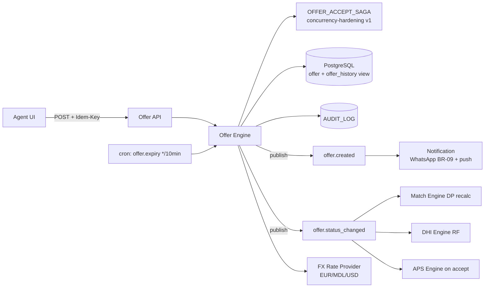

# TECH SPEC — REVYX Offer Engine
<!-- TECH_SPEC_REVYX_offer-engine_v1.0.0.md · v1.0.0 · 2026-05 -->
<!-- CONFIDENȚIAL · Uz Intern · © 2026 REVYX · ITPRO SYSTEM SRL -->

## Changelog

| Versiune | Data | Autor | Note |
|---|---|---|---|
| 1.0.0 | 2026-05 | Senior PM + Solution Architect | ★ Spec inițială Offer Engine — operationalizare schema OFFER (BRD §8) · counter chain cu `counter_to_offer_id` · cross-currency snapshot la `responded_at` · view `offer_history` per deal · manager review gate la chain >7 · API endpoints complete · OFFER_ACCEPT_SAGA integrare cu concurrency-hardening v1.0.0. Recomandare emisă în WORKFLOW offer-chain v1.0.0 §15.4. |

---

## Cuprins

1. [Executive Summary](#1-executive-summary)
2. [Architecture Overview](#2-architecture-overview)
3. [Stack & Dependencies](#3-stack--dependencies)
4. [Data Model](#4-data-model)
5. [API Contracts](#5-api-contracts)
6. [Algorithms](#6-algorithms)
7. [State Machines](#7-state-machines)
8. [Concurrency](#8-concurrency)
9. [Caching](#9-caching)
10. [Background Jobs](#10-background-jobs)
11. [Error Handling](#11-error-handling)
12. [Security](#12-security)
13. [Observability](#13-observability)
14. [Performance Budgets](#14-performance-budgets)
15. [Testing Strategy](#15-testing-strategy)
16. [Deployment](#16-deployment)
17. [Migration Strategy](#17-migration-strategy)
18. [Risks & Mitigations](#18-risks--mitigations)
19. [Impact Assessment](#19-impact-assessment)

---

## 1. Executive Summary

★ Offer Engine este componenta Phase 2 a Pilonului 05 (Negotiation Intelligence) care **operationalizează tabelul OFFER** (schema BRD §8). Implementează lanțul counter-offer (3-7 runde), gate manager review la chain >7, snapshot rate currency la `responded_at` pentru deal-uri cross-currency și expune view `offer_history` per deal. Integrează cu `concurrency-hardening v1.0.0` pentru `OFFER_ACCEPT_SAGA`.

| Atribut | Valoare |
|---|---|
| **Scope** | Tabel OFFER complet · counter chain · currency snapshot · `offer_history` view · manager gate >7 · API CRUD + tranziții · expiry cron · OFFER_ACCEPT_SAGA |
| **Referință BRD** | §5 Pilon 05 · §8 OFFER ★ · §12 T07 |
| **Phase** | 2 |
| **Owner tehnic** | Solution Architect + Senior PM |
| **Dependențe upstream** | match-engine v1 (DEAL în NEGOTIATION) · property v1 (status RESERVED) · audit-log v1 · concurrency-hardening v1 (saga + idempotency) |
| **Dependențe downstream** | deal-closure v1 (handoff WON_PENDING_NOTARY) · DHI Engine (RF concurență) · whatsapp templates BR-09 |

**Garanții:**

1. Schema OFFER conformă BRD §8 cu toate câmpurile (`offer_id`, `deal_id`, `offered_by`, `amount`, `currency`, `status`, `valid_until`, `counter_to_offer_id`, `notes`, `created_at`, `responded_at`).
2. Counter chain via FK self-referențial cu invariant: `counter_to_offer_id.deal_id = self.deal_id` și `counter_to_offer_id.status='countered'` la INSERT.
3. **Currency snapshot at `responded_at`**: rate FX salvat pe offer la accept/counter pentru audit consistent.
4. **Manager review gate**: chain_round ≥ 8 → 423 LOCKED până aprobare manager (audit explicit).
5. **OFFER_ACCEPT_SAGA** garantează atomicitate cross-service (offer + deal + property + notify + DP/DHI cascade).
6. View `offer_history` per deal — read-only, ordonată cronologic, cu coloane denormalizate (chain_round, delta_amount_eur, time_to_respond_seconds).
7. NFR: INSERT offer p95 < 500ms · accept saga p95 < 2s · expiry cron precision ±10min.

---

## 2. Architecture Overview



### 2.1 Componente

| Componentă | Responsabilitate |
|---|---|
| `OfferEngine` (orchestrator) | CRUD + tranziții status |
| `CounterChainValidator` | Verifică `counter_to_offer_id` invariants + chain length |
| `ManagerReviewGate` | Block POST counter la chain ≥ 8 fără manager approval |
| `CurrencySnapshotter` | FX rate at `responded_at` (cache 60min) |
| `ExpiryService` | cron `*/10 * * * *` mark `valid_until < NOW` → expired |
| `OfferAcceptSagaRunner` | Wraps concurrency-hardening saga |
| `OfferHistoryView` | Materialized view (vezi §4.4) |

---

## 3. Stack & Dependencies

| Layer | Tehnologie | Versiune | Justificare |
|---|---|---|---|
| Backend | Node.js + TS | 20 LTS | Stack |
| ORM | Kysely | latest | SQL explicit · view query |
| DB | PostgreSQL | 16.x | Materialized view + RLS |
| Cache | Redis | 7.x | FX rates · offer_history per deal |
| Queue | BullMQ | latest | Saga + expiry |
| FX | Curs valutar BNM (Banca Națională Moldovei) | scrape daily 9:00 | Conformitate locală + fallback ECB |
| Audit | `auditLogger` | 1.0.0 | OFFER_* events |
| Concurrency | concurrency-hardening v1.0.0 | — | Saga + idempotency + Redlock |

---

## 4. Data Model

### 4.1 Tabel `offer` (BRD §8 operationalizat)

```sql
-- Migrare: 0190_offer.sql
CREATE TABLE IF NOT EXISTS offer (
  offer_id              UUID         PRIMARY KEY DEFAULT gen_random_uuid(),
  tenant_id             UUID         NOT NULL,
  deal_id               UUID         NOT NULL REFERENCES deal(deal_id) ON DELETE RESTRICT,

  offered_by            TEXT         NOT NULL CHECK (offered_by IN (
    'buyer','agent_on_behalf_buyer','seller','agent_on_behalf_seller'
  )),
  offered_by_user_id    UUID         NULL,            -- agent care a submis (audit)
  amount                NUMERIC(14,2) NOT NULL CHECK (amount > 0),
  currency              TEXT         NOT NULL CHECK (currency IN ('EUR','MDL','USD')),
  amount_eur_snapshot   NUMERIC(14,2) NOT NULL,       -- ★ rate snapshot la created_at
  fx_rate_to_eur        NUMERIC(12,6) NOT NULL,
  fx_rate_source        TEXT         NOT NULL CHECK (fx_rate_source IN ('BNM','ECB','MANUAL')),

  status                TEXT         NOT NULL DEFAULT 'pending' CHECK (status IN (
    'pending','accepted','rejected','countered','withdrawn','expired'
  )),
  valid_until           TIMESTAMPTZ  NULL,
  counter_to_offer_id   UUID         NULL REFERENCES offer(offer_id) ON DELETE SET NULL,  -- ★ chain integrity
  chain_round           INTEGER      NOT NULL DEFAULT 1 CHECK (chain_round >= 1),
  manager_review_required BOOLEAN    NOT NULL DEFAULT FALSE,
  manager_reviewed_at   TIMESTAMPTZ  NULL,
  manager_reviewed_by   UUID         NULL,

  notes                 TEXT         NULL,
  metadata              JSONB        NULL,

  created_at            TIMESTAMPTZ  NOT NULL DEFAULT NOW(),
  responded_at          TIMESTAMPTZ  NULL,            -- ★ momentul accept/reject/counter
  responded_fx_rate_to_eur NUMERIC(12,6) NULL,        -- ★ snapshot adițional la responded
  withdraw_reason       TEXT         NULL,

  version               BIGINT       NOT NULL DEFAULT 1
);

CREATE INDEX IF NOT EXISTS idx_offer_deal_chain
  ON offer (tenant_id, deal_id, chain_round DESC);
CREATE INDEX IF NOT EXISTS idx_offer_status_pending
  ON offer (tenant_id, status, valid_until)
  WHERE status = 'pending';
CREATE INDEX IF NOT EXISTS idx_offer_counter_to
  ON offer (counter_to_offer_id) WHERE counter_to_offer_id IS NOT NULL;
CREATE INDEX IF NOT EXISTS idx_offer_manager_review
  ON offer (tenant_id, manager_review_required)
  WHERE manager_review_required = TRUE AND manager_reviewed_at IS NULL;

-- Invariant: counter_to_offer_id same deal — enforcement în trigger §4.5 (RAISE EXCEPTION OFFER_INVALID_COUNTER_PARENT
-- la deal_id mismatch). Nu folosim EXCLUDE constraint: semantica EXCLUDE este pentru a interzice perechi de rânduri
-- conflictuale, nu pentru validare FK cross-row. Trigger BEFORE INSERT (§4.5) face validation explicită cu rollback.
```

### 4.2 ALTER `deal` — long_negotiation flag + manager review state

```sql
-- Migrare: 0191_deal_offer_extensions.sql
ALTER TABLE deal
  ADD COLUMN IF NOT EXISTS manager_review_required     BOOLEAN     NOT NULL DEFAULT FALSE,
  ADD COLUMN IF NOT EXISTS long_negotiation_flagged_at TIMESTAMPTZ NULL,
  ADD COLUMN IF NOT EXISTS manager_reviewed_at         TIMESTAMPTZ NULL,    -- ★ gate state for chain_round >= 8
  ADD COLUMN IF NOT EXISTS manager_reviewed_by         UUID        NULL,
  ADD COLUMN IF NOT EXISTS won_pending_notary_at       TIMESTAMPTZ NULL;

-- Extindere enum status (vezi DEAL existing CHECK; folosim TEXT cu CHECK actualizat)
ALTER TABLE deal DROP CONSTRAINT IF EXISTS deal_status_check;
ALTER TABLE deal ADD CONSTRAINT deal_status_check CHECK (status IN (
  'NEW','QUALIFIED','SHOWING','NEGOTIATION',
  'WON_PENDING_NOTARY','WON','LOST','CANCELLED'
));
```

### 4.3 Tabel `fx_rate_daily`

```sql
-- Migrare: 0192_fx_rate_daily.sql
CREATE TABLE IF NOT EXISTS fx_rate_daily (
  rate_id        UUID         PRIMARY KEY DEFAULT gen_random_uuid(),
  date           DATE         NOT NULL,
  currency_from  TEXT         NOT NULL CHECK (currency_from IN ('EUR','MDL','USD')),
  currency_to    TEXT         NOT NULL CHECK (currency_to IN ('EUR','MDL','USD')),
  rate           NUMERIC(12,6) NOT NULL CHECK (rate > 0),
  source         TEXT         NOT NULL CHECK (source IN ('BNM','ECB','MANUAL')),
  fetched_at     TIMESTAMPTZ  NOT NULL DEFAULT NOW(),
  UNIQUE (date, currency_from, currency_to, source)
);
CREATE INDEX IF NOT EXISTS idx_fx_lookup ON fx_rate_daily (currency_from, currency_to, date DESC);
```

### 4.4 View `offer_history` (per deal)

```sql
-- Migrare: 0193_offer_history_view.sql
CREATE OR REPLACE VIEW offer_history AS
SELECT
  o.tenant_id,
  o.deal_id,
  o.offer_id,
  o.chain_round,
  o.offered_by,
  o.amount,
  o.currency,
  o.amount_eur_snapshot,
  o.status,
  o.valid_until,
  o.counter_to_offer_id,
  o.created_at,
  o.responded_at,
  EXTRACT(EPOCH FROM (o.responded_at - o.created_at))::INTEGER AS time_to_respond_seconds,
  (o.amount_eur_snapshot - LAG(o.amount_eur_snapshot) OVER (
    PARTITION BY o.deal_id ORDER BY o.chain_round
  )) AS delta_amount_eur,
  o.notes,
  o.manager_review_required
FROM offer o
ORDER BY o.deal_id, o.chain_round;
```

### 4.5 Constraints & invariants (app + trigger)

| Invariant | Enforcement |
|---|---|
| `chain_round = parent.chain_round + 1` la INSERT counter | App-level + trigger BEFORE INSERT |
| `counter_to_offer_id.deal_id = self.deal_id` | Trigger validation |
| `counter_to_offer_id.status` trebuie să fie `countered` post-accept-this-counter | Tranzacție atomică §6.3 |
| `manager_review_required=TRUE` la `chain_round = 8` | App + trigger |
| `amount_eur_snapshot = amount * fx_rate_to_eur` | Trigger BEFORE INSERT |
| Single accepted per deal | Partial UNIQUE INDEX `WHERE status='accepted'` |
| `valid_until > created_at` | CHECK |

```sql
-- Trigger snapshot + chain validation
CREATE OR REPLACE FUNCTION offer_before_insert() RETURNS TRIGGER AS $$
BEGIN
  -- 1) Currency snapshot
  IF NEW.currency = 'EUR' THEN
    NEW.fx_rate_to_eur := 1.0;
    NEW.amount_eur_snapshot := NEW.amount;
    NEW.fx_rate_source := COALESCE(NEW.fx_rate_source, 'BNM');
  ELSE
    SELECT rate, source INTO NEW.fx_rate_to_eur, NEW.fx_rate_source
    FROM fx_rate_daily
    WHERE currency_from = NEW.currency AND currency_to = 'EUR'
      AND date <= NEW.created_at::date
    ORDER BY date DESC LIMIT 1;
    IF NEW.fx_rate_to_eur IS NULL THEN
      RAISE EXCEPTION 'OFFER_FX_RATE_UNAVAILABLE';
    END IF;
    NEW.amount_eur_snapshot := ROUND(NEW.amount * NEW.fx_rate_to_eur, 2);
  END IF;

  -- 2) Chain validation
  IF NEW.counter_to_offer_id IS NOT NULL THEN
    PERFORM 1 FROM offer
      WHERE offer_id = NEW.counter_to_offer_id
        AND deal_id = NEW.deal_id
        AND status IN ('pending','countered');
    IF NOT FOUND THEN RAISE EXCEPTION 'OFFER_INVALID_COUNTER_PARENT'; END IF;

    SELECT chain_round + 1 INTO NEW.chain_round FROM offer WHERE offer_id = NEW.counter_to_offer_id;
  ELSE
    NEW.chain_round := 1;
  END IF;

  -- 3) Manager review gate
  IF NEW.chain_round >= 8 THEN
    NEW.manager_review_required := TRUE;
    -- Validare gate: DEAL.manager_reviewed_at trebuie să fie setat (aprobare prealabilă).
    -- Aplicația ar fi trebuit să blocheze înainte cu HttpError 423; trigger e plasă de siguranță.
    PERFORM 1 FROM deal
      WHERE deal_id = NEW.deal_id
        AND manager_reviewed_at IS NOT NULL
        AND (long_negotiation_flagged_at IS NULL OR manager_reviewed_at >= long_negotiation_flagged_at);
    IF NOT FOUND THEN
      RAISE EXCEPTION 'OFFER_MANAGER_REVIEW_REQUIRED' USING ERRCODE = 'check_violation';
    END IF;
  END IF;

  RETURN NEW;
END;
$$ LANGUAGE plpgsql;

CREATE TRIGGER trg_offer_before_insert BEFORE INSERT ON offer
  FOR EACH ROW EXECUTE FUNCTION offer_before_insert();

-- AFTER INSERT: reset deal.manager_reviewed_at after consuming approval (one-shot per round ≥ 8)
CREATE OR REPLACE FUNCTION offer_after_insert_consume_review() RETURNS TRIGGER AS $$
BEGIN
  IF NEW.chain_round >= 8 THEN
    UPDATE deal SET
      manager_reviewed_at = NULL,
      manager_reviewed_by = NULL,
      long_negotiation_flagged_at = NOW()
    WHERE deal_id = NEW.deal_id;
  END IF;
  RETURN NEW;
END;
$$ LANGUAGE plpgsql;

CREATE TRIGGER trg_offer_after_insert_consume_review AFTER INSERT ON offer
  FOR EACH ROW EXECUTE FUNCTION offer_after_insert_consume_review();

-- Single accepted per deal
CREATE UNIQUE INDEX IF NOT EXISTS uq_offer_accepted_per_deal
  ON offer (tenant_id, deal_id) WHERE status = 'accepted';
```

---

## 5. API Contracts

### 5.1 REST endpoints

| Method | Path | RBAC | Idempotency | Descriere |
|---|---|---|---|---|
| `POST` | `/api/v1/deals/:dealId/offers` | agent (own) | YES | Submit ofertă inițială (counter_to=NULL) sau counter (counter_to=parent) |
| `GET`  | `/api/v1/deals/:dealId/offers` | agent (own) / team_lead+ | NO | Listă oferte (chain) |
| `GET`  | `/api/v1/deals/:dealId/offer-history` | agent (own) / team_lead+ | NO | View `offer_history` |
| `GET`  | `/api/v1/offers/:id` | agent (own) / team_lead+ | NO | Detail offer |
| `POST` | `/api/v1/offers/:id/accept` | agent (own) | YES | Tranziție accepted (saga) |
| `POST` | `/api/v1/offers/:id/reject` | agent (own) | YES | Tranziție rejected |
| `POST` | `/api/v1/offers/:id/counter` | agent (own) | YES | Counter (creează nou offer + UPDATE parent=countered) |
| `POST` | `/api/v1/offers/:id/withdraw` | agent (own offered_by) | YES | Withdraw |
| `POST` | `/api/v1/deals/:dealId/manager-review/approve` | manager+ | YES | Deblocare chain ≥ 8 (operează pe DEAL) |
| `POST` | `/api/v1/deals/:dealId/manager-review/reject` | manager+ | YES | DEAL=LOST reason=negotiation_stalemate (cancel pending offers) |

### 5.2 Internal services

```typescript
interface OfferEngine {
  submit(input: OfferSubmitInput, actor: User): Promise<Offer>;
  accept(offerId: string, actor: User, idemKey: string): Promise<{ offer: Offer; deal: Deal }>;
  reject(offerId: string, actor: User, reason?: string): Promise<Offer>;
  counter(parentOfferId: string, input: OfferCounterInput, actor: User): Promise<Offer>;
  withdraw(offerId: string, actor: User, reason: string): Promise<Offer>;
  managerReviewDeal(dealId: string, decision: 'approve'|'reject', actor: User): Promise<Deal>;
}

type OfferSubmitInput = {
  dealId: string;
  offeredBy: 'buyer'|'agent_on_behalf_buyer'|'seller'|'agent_on_behalf_seller';
  amount: number;
  currency: 'EUR'|'MDL'|'USD';
  validUntil?: Date;            // default +72h dacă lipsă
  counterToOfferId?: string;    // null pentru initial
  notes?: string;
};
```

---

## 6. Algorithms

### 6.1 Submit (initial sau counter)

```typescript
async function submit(input: OfferSubmitInput, actor: User): Promise<Offer> {
  return db.transaction(async (tx) => {
    const deal = await tx.selectFrom('deal').where('deal_id','=',input.dealId).forUpdate().executeTakeFirstOrThrow();
    if (deal.status !== 'NEGOTIATION') throw new Error('DEAL_NOT_IN_NEGOTIATION');

    // Manager gate: când submit-ul ar produce un offer cu chain_round >= 8 (parent.chain_round >= 7),
    // necesită aprobare prealabilă pe DEAL. Aprobarea e validă "o singură rundă" — la fiecare nouă
    // rundă peste 8, gate-ul resetează `manager_reviewed_at` la NULL în trigger §4.5 după INSERT.
    if (input.counterToOfferId) {
      const parent = await tx.selectFrom('offer').where('offer_id','=',input.counterToOfferId).executeTakeFirstOrThrow();
      if (parent.chain_round >= 7 && !deal.manager_reviewed_at) {
        // Marchează DEAL pentru manager UI dacă nu e deja flagged
        if (!deal.manager_review_required) {
          await tx.updateTable('deal').set({
            manager_review_required: true,
            long_negotiation_flagged_at: new Date(),
            version: deal.version + 1n,
          }).where('deal_id','=',deal.deal_id).where('version','=',deal.version).execute();
          await auditLogger.record({
            tenantId: deal.tenant_id, eventType: 'DEAL_LONG_NEGOTIATION_FLAGGED',
            entityType: 'DEAL', entityId: deal.deal_id,
            metadata: { parent_chain_round: parent.chain_round },
          }, tx);
        }
        throw new HttpError(423, 'MANAGER_REVIEW_REQUIRED');
      }
    }

    const inserted = await tx.insertInto('offer').values({
      tenant_id: deal.tenant_id,
      deal_id: input.dealId,
      offered_by: input.offeredBy,
      offered_by_user_id: actor.userId,
      amount: input.amount,
      currency: input.currency,
      // amount_eur_snapshot, fx_rate_to_eur, fx_rate_source, chain_round, manager_review_required
      // calculated by trigger
      status: 'pending',
      valid_until: input.validUntil ?? addHours(new Date(), 72),
      counter_to_offer_id: input.counterToOfferId ?? null,
      notes: input.notes ?? null,
    } as any).returningAll().executeTakeFirstOrThrow();

    // Mark parent ca countered (dacă e counter)
    if (input.counterToOfferId) {
      await tx.updateTable('offer').set({
        status: 'countered',
        responded_at: new Date(),
        responded_fx_rate_to_eur: inserted.fx_rate_to_eur,
        version: sql`version + 1`,
      }).where('offer_id','=',input.counterToOfferId).where('status','=','pending').execute();
    }

    await auditLogger.record({
      tenantId: deal.tenant_id,
      eventType: input.counterToOfferId ? 'OFFER_COUNTERED' : 'OFFER_CREATED',
      entityType: 'OFFER', entityId: inserted.offer_id,
      newValue: { amount: inserted.amount, currency: inserted.currency, chain_round: inserted.chain_round },
      metadata: { deal_id: deal.deal_id, parent_offer_id: input.counterToOfferId },
    }, tx);

    if (inserted.manager_review_required) {
      await tx.updateTable('deal').set({
        manager_review_required: true,
        long_negotiation_flagged_at: new Date(),
      }).where('deal_id','=',deal.deal_id).execute();
      await auditLogger.record({
        tenantId: deal.tenant_id,
        eventType: 'DEAL_LONG_NEGOTIATION_FLAGGED',
        entityType: 'DEAL', entityId: deal.deal_id,
        metadata: { chain_round: inserted.chain_round },
      }, tx);
    }

    tx.afterCommit(() => {
      events.publish('offer.created', { offerId: inserted.offer_id, dealId: deal.deal_id });
      notifyCounterparty(inserted);   // WhatsApp `offer_received` (BR-09) + push
    });
    return inserted;
  });
}
```

### 6.2 Accept (via OFFER_ACCEPT_SAGA)

```typescript
async function accept(offerId: string, actor: User, idemKey: string) {
  return saga.start({
    type: 'OFFER_ACCEPT',
    steps: [
      { name: 'validate_offer',     invoke: validateOffer },
      { name: 'lock_deal',          invoke: ctx => lockManager.acquire([`deal:${ctx.dealId}`,`offer:${offerId}`], 5000).then(l => ({ leaseId: l.id })) },
      { name: 'update_offer',       invoke: updateOfferAccepted, compensate: revertOfferAccepted },
      { name: 'transition_deal',    invoke: transitionDealWonPendingNotary, compensate: revertDealNegotiation },
      { name: 'reserve_property',   invoke: reservePropertyStatus, compensate: unreserveProperty },
      { name: 'cancel_other_offers', invoke: cancelOtherPendingOffersOnDeal },
      { name: 'notify_parties',     invoke: sendAcceptNotifications },
      { name: 'recalc_dp_dhi',      invoke: triggerDpDhiRecalc },
      { name: 'release_lock',       invoke: ctx => lockManager.release({ id: ctx.leaseId }) },
    ],
  }, { offerId, actorId: actor.userId, dealId: '' /* filled in step 1 */ }, { tenantId: actor.tenantId, idempotencyKey: idemKey });
}
```

### 6.3 Counter (atomic parent=countered + child=pending)

Implementat în `submit()` cu `counterToOfferId` set. Trigger asigură `chain_round=parent+1`. Tranzacția unică previne race.

### 6.4 Manager review gate flow

Gate-ul operează pe DEAL (nu pe offer): la `chain_round >= 8`, `deal.manager_reviewed_at` e marker-ul
care permite următoarea submisie. `offer.manager_review_required` rămâne ca audit-marker pe offer-ul care
a declanșat gate-ul (informațional). Aprobarea e valabilă pentru următoarea rundă; trigger-ul §4.5 resetează
`deal.manager_reviewed_at` la NULL după fiecare INSERT cu `chain_round >= 8` (deci managerul re-aprobă pentru
fiecare rundă consecutivă peste 8).

```typescript
async function managerReview(dealId: string, decision: 'approve'|'reject', actor: User): Promise<Deal> {
  return db.transaction(async (tx) => {
    const deal = await tx.selectFrom('deal').where('deal_id','=',dealId).forUpdate().executeTakeFirstOrThrow();
    if (!deal.manager_review_required) throw new HttpError(409, 'DEAL_REVIEW_INVALID_STATE');
    if (!hasRole(actor, 'manager')) throw new HttpError(403, 'FORBIDDEN');

    if (decision === 'reject') {
      // Cancel toate offers pending pe deal + DEAL → LOST
      await tx.updateTable('offer').set({
        status: 'withdrawn', responded_at: new Date(),
        withdraw_reason: 'manager_rejected_long_negotiation',
        version: sql`version + 1`,
      }).where('deal_id','=',dealId).where('status','=','pending').execute();

      const updated = await tx.updateTable('deal').set({
        status: 'LOST', lost_reason: 'negotiation_stalemate',
        manager_reviewed_at: new Date(), manager_reviewed_by: actor.userId,
        manager_review_required: false,
        version: deal.version + 1n,
      }).where('deal_id','=',dealId).where('version','=',deal.version).returningAll().executeTakeFirstOrThrow();

      await auditLogger.record({
        tenantId: deal.tenant_id, eventType: 'DEAL_NEGOTIATION_STALEMATE_LOST',
        entityType: 'DEAL', entityId: dealId,
        metadata: { manager_user_id: actor.userId },
      }, tx);
      return updated;
    }

    // approve: deblocare gate
    const updated = await tx.updateTable('deal').set({
      manager_reviewed_at: new Date(),
      manager_reviewed_by: actor.userId,
      version: deal.version + 1n,
    }).where('deal_id','=',dealId).where('version','=',deal.version).returningAll().executeTakeFirstOrThrow();

    await auditLogger.record({
      tenantId: deal.tenant_id, eventType: 'DEAL_MANAGER_REVIEW_APPROVED',
      entityType: 'DEAL', entityId: dealId,
      metadata: { manager_user_id: actor.userId },
    }, tx);
    return updated;
  });
}
```

### 6.5 Currency snapshot (la responded_at)

La `accept`/`reject`/`counter`, snapshot adițional `responded_fx_rate_to_eur` se salvează din FX rate curent — util pentru audit dacă currency rate a fluctuat material între `created_at` și `responded_at`.

```typescript
async function snapshotResponded(tx: Tx, offer: Offer): Promise<number> {
  if (offer.currency === 'EUR') return 1.0;
  const rate = await fx.getRate(offer.currency, 'EUR', new Date());
  await tx.updateTable('offer').set({ responded_fx_rate_to_eur: rate, responded_at: new Date() })
    .where('offer_id','=',offer.offer_id).execute();
  return rate;
}
```

### 6.6 Expiry cron

```typescript
// cron */10 * * * *
async function expiryScan() {
  const expired = await db.updateTable('offer')
    .set({ status: 'expired', responded_at: sql`NOW()` })
    .where('status','=','pending')
    .where('valid_until','<', sql`NOW()`)
    .returning(['offer_id','tenant_id','deal_id']).execute();

  for (const e of expired) {
    await auditLogger.record({
      tenantId: e.tenant_id, eventType: 'OFFER_EXPIRED',
      entityType: 'OFFER', entityId: e.offer_id,
      metadata: { deal_id: e.deal_id },
    });
    events.publish('offer.expired', { offerId: e.offer_id, dealId: e.deal_id });
  }
}
```

### 6.7 Property unavailability mid-chain

```typescript
events.subscribe('property.status.changed', async ({ propertyId, oldStatus, newStatus }) => {
  if (!['SOLD','WITHDRAWN'].includes(newStatus)) return;
  // Withdraw orice pending offer pe deal-uri legate de property
  const dealIds = await db.selectFrom('deal').where('property_id','=',propertyId)
    .where('status','=','NEGOTIATION').select('deal_id').execute();
  for (const { deal_id } of dealIds) {
    await db.updateTable('offer').set({
      status: 'withdrawn', responded_at: sql`NOW()`,
      withdraw_reason: 'property_unavailable',
      version: sql`version + 1`,
    }).where('deal_id','=',deal_id).where('status','=','pending').execute();
    await db.updateTable('deal').set({
      status: 'LOST', lost_reason: 'property_unavailable',
      version: sql`version + 1`,
    }).where('deal_id','=',deal_id).execute();
  }
});
```

---

## 7. State Machines

### 7.1 Offer status

```
pending ──(seller accept)──> accepted [terminal]
pending ──(seller reject)──> rejected [terminal]
pending ──(counter creat)──> countered [terminal]
pending ──(owner withdraw)──> withdrawn [terminal]
pending ──(valid_until pass)──> expired [terminal]
```

### 7.2 Manager review

```
manager_review_required=true ──(approve)──> review cleared, chain continues
manager_review_required=true ──(reject)──> DEAL=LOST, chain terminated
```

### 7.3 Deal status (relevantă)

```
NEGOTIATION ──(offer accepted)──> WON_PENDING_NOTARY [→ deal-closure]
NEGOTIATION ──(manager reject)──> LOST (reason=negotiation_stalemate)
NEGOTIATION ──(property unavailable)──> LOST (reason=property_unavailable)
```

---

## 8. Concurrency

- **OFFER_ACCEPT_SAGA** garantează atomicitate cross-service (vezi concurrency-hardening §6.4.1).
- **Optimistic locking** pe `offer.version` și `deal.version`.
- **Redlock** pe `[deal:X, offer:Y]` (ordonat alfabetic).
- **Race accept vs counter**: optimistic pe `offer.status='pending'` în UPDATE WHERE — primul wins.
- **Race accept vs property.SOLD**: `reservePropertyStatus` step verifică `property.status='ACTIVE'` cu version, eșuează grațios dacă property a devenit indisponibilă mid-saga (compensate).
- **Idempotency-Key obligatoriu** pe POST /accept, /reject, /counter, /withdraw.

---

## 9. Caching

| Key Redis | Conținut | TTL | Invalidare |
|---|---|---|---|
| `offer:history:{dealId}` | array view rows | 5 min | event `offer.created` / `offer.status_changed` |
| `fx:rate:{from}:{to}` | rate curent | 60 min | cron daily refresh |
| `offer:pending:{dealId}` | listă offers pending pe deal | 30 sec | mutation |

---

## 10. Background Jobs

| Job | Tip | Idempotent | Retry |
|---|---|---|---|
| `offer.expiry.scan` | cron `*/10 * * * *` | DA | 5× |
| `fx.rate.refresh.daily` | cron `0 9 * * *` (BNM) | DA | 5× cu fallback ECB |
| `offer.notify.fallback` | event `offer.created` (whatsapp fail) | DA | 3× |
| `offer.history.materialize` | event-driven (opt: materialized view refresh) | DA | 3× |

---

## 11. Error Handling

| Cod | Caz | Răspuns |
|---|---|---|
| `DEAL_NOT_IN_NEGOTIATION` | submit pe deal status invalid | 409 |
| `OFFER_INVALID_COUNTER_PARENT` | counter_to non-existent / wrong deal | 422 |
| `OFFER_VALIDITY_EXPIRED` | accept dupa valid_until | 422 |
| `OFFER_INVALID_STATE` | tranziție ilegală | 409 |
| `MANAGER_REVIEW_REQUIRED` | counter la chain ≥ 8 | 423 |
| `OFFER_FX_RATE_UNAVAILABLE` | currency conversion fail la INSERT | 503 + retry-after |
| `OFFER_VERSION_CONFLICT` | optimistic | retry 3× |
| `OFFER_FORBIDDEN_ACTOR` | withdraw de către non-owner | 403 |
| `OFFER_DUPLICATE_ACCEPT` | accept pe deal cu offer accepted | 409 (UNIQUE) |

---

## 12. Security

- **JWT RS256** + RBAC moștenit.
- **AUDIT_LOG events:**
  - `OFFER_CREATED` · `OFFER_ACCEPTED` · `OFFER_REJECTED` · `OFFER_COUNTERED` · `OFFER_WITHDRAWN` · `OFFER_EXPIRED`
  - `OFFER_MANAGER_REVIEW_APPROVED` · `OFFER_MANAGER_REVIEW_REJECTED`
  - `DEAL_LONG_NEGOTIATION_FLAGGED` · `DEAL_NEGOTIATION_STALEMATE_LOST`
  - `OFFER_PROPERTY_UNAVAILABLE_AUTO_WITHDRAWN`
- **PII**: `offered_by_user_id` referință internă; numele buyer/seller nu sunt în offer table (FK lead/property).
- **Rate limiting**: POST submit 5/min/agent · accept 1/min/offer.

---

## 13. Observability

| Metric | Tip | Alert |
|---|---|---|
| `offer_chain_length` | histogram | p95 > 5 — review |
| `offer_time_to_respond_seconds` | histogram | p95 > 24h — KPI |
| `offer_accept_saga_duration_ms` | histogram | p95 > 2s |
| `offer_manager_review_open_total` | gauge | > 5 — manager backlog |
| `offer_expired_total` | counter | spike — review valid_until UX |
| `offer_fx_rate_fallback_total` | counter | BNM down |
| `offer_long_negotiation_total` | counter | trend |

Dashboard: `REVYX / Offer Pipeline`.

---

## 14. Performance Budgets

| Metric | Target | Sursă |
|---|---|---|
| Submit offer | p95 < 500 ms | UX (workflow §7) |
| Accept saga complete | p95 < 2 s | UX |
| GET offer-history (50 offers) | p95 < 200 ms | UX |
| Expiry cron precision | ±10 min | NFR |
| FX rate lookup | p95 < 50 ms | infra |

---

## 15. Testing Strategy

### 15.1 Unit
- Trigger snapshot: EUR, MDL, USD cu rate cunoscut → amount_eur_snapshot corect
- chain_round increment correct la counter
- Manager review gate trigger la chain=8
- expiry: status pending + valid_until trecut → expired

### 15.2 Integration
- Submit initial → INSERT cu chain_round=1
- Counter A→B→C→D (T07 BRD §12) → chain_round 1,2,3,4 corect, parents=countered
- Chain 1..7 OK; chain=8 → 423 LOCKED; manager approve → resume
- Accept → DEAL=WON_PENDING_NOTARY + property=RESERVED atomic
- Property SOLD mid-chain → toate pending withdrawn + DEAL=LOST

### 15.3 E2E
- Cross-currency: offer MDL=20000 cu rate EUR/MDL=0.05 → snapshot EUR=1000
- Accept saga: failure în step 5 (reserve_property) → compensate revert offer + deal
- Idempotency: 3× POST /accept cu același key → 1 execution + 2 cached

### 15.4 Load
- 100 simultaneous accepts pe diferite offers → no resource exhaustion, p95<2s
- 1000 expiry cron / oră → no missed offers

### 15.5 Chaos
- BNM down la INSERT → fallback ECB; ambele down → 503 + retry
- Saga step 7 (notify) fail → step success preserved, alert non-blocking

### 15.6 Coverage

| Layer | Coverage |
|---|---|
| Trigger logic | ≥ 100% |
| OfferEngine | ≥ 95% |
| Saga steps | ≥ 95% |
| API handlers | ≥ 90% |

---

## 16. Deployment

| Aspect | Detaliu |
|---|---|
| Feature flag | `flag.offer_engine_v1.enabled` (prerequisite `concurrency_hardening_v1.saga` ON) |
| Rollout | shadow 1 săpt → 10% → 50% → 100% în 3 săpt |
| Rollback | flag OFF · restore previous DEAL.offer_price flow (BRD §8 backwards compat noted) |
| Owner | Solution Architect + Senior PM |

---

## 17. Migration Strategy

```
0190_offer.sql                 -- offer table + trigger
0191_deal_offer_extensions.sql -- DEAL status enum + flags
0192_fx_rate_daily.sql         -- FX history
0193_offer_history_view.sql    -- view
```

Idempotente. Backfill: deals existente cu `offer_price` populat → INSERT 1 offer cu `chain_round=1`, `status='pending'` (sau `accepted` dacă deal deja WON).

---

## 18. Risks & Mitigations

| # | Risc | Probab. | Impact | Mitigare |
|---|---|---|---|---|
| R1 | Currency rate provider down | LOW | HIGH | Fallback ECB · cache 60min · retry exponential |
| R2 | Saga compensation half-failed | LOW | HIGH | Manual admin abort + audit; concurrency-hardening §6.3 |
| R3 | Long negotiation chain abuse | MED | LOW | Manager review gate la 8 · audit + alert |
| R4 | Race counter vs accept | MED | MED | Optimistic + saga; primul wins |
| R5 | WhatsApp template offer_received neaprobat | LOW | LOW | Fallback push intern + email; audit |
| R6 | Trigger plpgsql performance pe scale | LOW | LOW | Benchmark 1000 INSERT/sec — OK |
| R7 | Cross-currency audit confuzie | LOW | MED | EUR snapshot mandatory + responded snapshot · view normalizat |

---

## 19. Impact Assessment

### 19.1 Scope of Change

| Element | Detaliu |
|---|---|
| Document | TECH_SPEC_REVYX_offer-engine_v1.0.0.md |
| Tip schimbare | NEW (operationalizează BRD §8) |
| Aria afectată | Pilon 05 · NEW entitate OFFER cu trigger · ALTER DEAL (status enum + flags) · NEW fx_rate_daily · view offer_history |
| Origine | BRD §5 Pilon 05 · §8 OFFER · §12 T07 · WORKFLOW offer-chain v1.0.0 §15.4 (recomandare) · S5 deliverable #5 |

### 19.2 Impact pe documente conexe

| Document | Tip impact | Acțiune |
|---|---|---|
| BRD_REVYX_v1.1.0.md | None | Implementare §8 OFFER |
| WORKFLOW_REVYX_offer-chain_v1.0.1.md | Major (★ followup v1.1) | Referință tabel concret + saga · update §15 cu schema link |
| WORKFLOW_REVYX_deal-closure_v1.0.0.md | Minor | Handoff WON_PENDING_NOTARY confirmat |
| TECH_SPEC_REVYX_match-engine_v2.0.0.md | Minor | DP recalc trigger pe offer events |
| TECH_SPEC_REVYX_dhi-engine_v1.0.0.md | Minor | RF concurență input |
| TECH_SPEC_REVYX_aps-engine_v1.0.0.md (S5 #7) | Major | DCR increment la accept |
| TECH_SPEC_REVYX_audit-log_v1.1.1.md | Minor | Catalog event extins |
| TECH_SPEC_REVYX_concurrency-hardening_v1.0.0.md | None (consumer) | OFFER_ACCEPT_SAGA folosit |

### 19.3 Impact pe scoring

| Scor | Afectat? | Detaliu |
|---|---|---|
| LS · IS | DA (cascade) | offer_made activity → IS recalc |
| TS | DA | FV boost la accept · BS oscilație counter |
| DP · DHI | DA (cascade) | recalc post-status_changed |
| APS | DA | DCR↑ la accept (saga step) |

### 19.4 Impact pe entități / schema BD

| Entitate | Modificare | Migrare |
|---|---|---|
| OFFER | NEW cu trigger | 0190 |
| DEAL | ALTER (status enum extins, flags) | 0191 |
| `fx_rate_daily` | NEW | 0192 |
| `offer_history` view | NEW | 0193 |

### 19.5 Impact pe RBAC

| Rol | Permisiuni adăugate |
|---|---|
| agent | CRUD offers pe deals proprii |
| senior_agent | + override valid_until extension |
| manager | + manager-review approve/reject |
| admin | config FX source, rate limits |

### 19.6 Impact pe SLA & NFR

| NFR / SLA | Înainte | După | Validare |
|---|---|---|---|
| Submit p95 | n/a | <500ms | Load |
| Accept saga p95 | n/a | <2s | Load |
| Expiry precision | n/a | ±10min | Cron monitor |

### 19.7 Impact pe Securitate & GDPR

| Aspect | Status | Notă |
|---|---|---|
| PII | NU direct | FK based |
| AUDIT_LOG events noi | DA | §12 |
| Consent flow | NU | — |
| HMAC / JWT / RBAC | DA | RBAC §12 |
| Rate limiting | DA | submit + accept |

### 19.8 Risks & Mitigations

Vezi §18.

### 19.9 Test Plan

Vezi §15. T07 BRD §12 chain A→B→C→D obligatoriu E2E.

### 19.10 Rollout & Rollback

| Aspect | Detaliu |
|---|---|
| Feature flag | `flag.offer_engine_v1.enabled` |
| Strategie | shadow → 10% → 50% → 100% în 3 săpt |
| Rollback | flag OFF · DEAL.offer_price legacy path |
| Owner | Solution Architect + Senior PM |

### 19.11 Approval Gate

| Aprobator | Necesar pentru |
|---|---|
| Senior PM | Schema OFFER · manager review threshold · FX strategy |
| Solution Architect | Trigger · saga · indexes |
| Security Lead | RBAC · AUDIT |
| Legal / DPO | None — fără PII direct |

---

*docs/tech-spec/TECH_SPEC_REVYX_offer-engine_v1.0.0.md · v1.0.0 · 2026-05 · CONFIDENȚIAL · Uz Intern*
*REVYX — Real Estate Execution Intelligence · © 2026 REVYX · ITPRO SYSTEM SRL*
