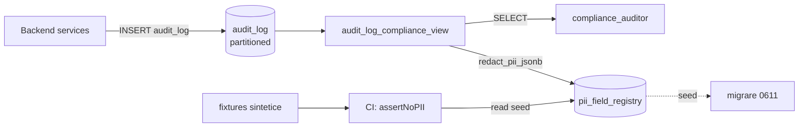

# TECH SPEC — REVYX PII Field Registry
<!-- TECH_SPEC_REVYX_pii-field-registry_v1.0.0.md · v1.0.0 · 2026-05 -->
<!-- CONFIDENȚIAL · Uz Intern · © 2026 REVYX · ITPRO SYSTEM SRL -->

## Changelog

| Versiune | Data | Autor | Note |
|---|---|---|---|
| 1.0.0 | 2026-05 | Senior Solution Architect + Senior Security Auditor + Senior DBA + DPO + Senior QA / Test Architect | ★ Initial — closes F-S10-04 HIGH (AUDIT_REVYX_s11-external-pass v1.0.0; reclasificat din MED în S10) · seed canonical pentru `pii_field_registry` per entitate (LEAD, PROPERTY, DEAL, AGENT, BUYER_PROFILE, SHOWING, OFFER, ACTIVITY, USER, TENANT) cu lista path-urilor JSONB considerate PII · migrare idempotentă `0611_pii_field_registry_seed.sql` · test E2E `assertNoPII(audit_log_compliance_view.row)` pe fixtures sintetice acoperind toate familiile §4.4 audit-log · gating BLOCANT Stage 5 entry per `phase5-rollout-sequence` v1.0.0 §2 |

---

## Cuprins

1. [Executive Summary](#1-executive-summary)
2. [Architecture Overview](#2-architecture-overview)
3. [Data Model](#3-data-model)
4. [Canonical Seed (per entity)](#4-canonical-seed-per-entity)
5. [API Contracts](#5-api-contracts)
6. [Migration Strategy](#6-migration-strategy)
7. [Testing Strategy (E2E `assertNoPII` gates)](#7-testing-strategy-e2e-assertnopii-gates)
8. [Security & GDPR alignment](#8-security--gdpr-alignment)
9. [Observability](#9-observability)
10. [Risks & Mitigations](#10-risks--mitigations)
11. [Operational gating (Stage 5 entry)](#11-operational-gating-stage-5-entry)
12. [Cross-references](#12-cross-references)
13. [Impact Assessment](#13-impact-assessment)
14. [Approval](#14-approval)

---

## 1. Executive Summary

`pii_field_registry` este **single-source-of-truth** care declară, per entitate, lista exhaustivă de **path-uri JSONB** considerate PII conform Legii 133/2011 RM + GDPR Art. 4(1). Această tabelă alimentează:

1. Funcția SQL `redact_pii_jsonb(jsonb, entity_type)` din `tenancy-roles-extension` v1.1.0 §12.4 (apel-uită din view-ul `audit_log_compliance_view`).
2. Library-ul `@revyx/test-fixtures-pii` v1.0.0 (`assertNoPII(payload)`) — folosit ca CI gate pentru push payloads, model cards, exports.
3. Audit redaction GDPR (`audit-log` v1.0.0 §6.5) la export drepturi data subject.

| Atribut | Valoare |
|---|---|
| **Scope** | Schema + seed + funcție + test E2E gate |
| **Phase** | 0 (BLOCANT pentru cod aplicație) — extensie operațională Phase 5 (gating Stage 5) |
| **Migrare** | `0611_pii_field_registry_seed.sql` |
| **Owner tehnic** | Solution Architect + Security Lead + DPO |
| **Closes** | F-S10-04 HIGH (S11 audit pass) |

**Garanții oferite:**

1. Fiecare entitate enumerată în BRD §8 are **listă explicită de path-uri PII** (whitelist by entity, denylist by path).
2. `redact_pii_jsonb` returnează JSONB **fără PII** pentru orice combinație `(entity_type, payload)` documentată în §4.
3. Seed-ul e **idempotent**; UPDATE-urile ulterioare la registry sunt versionate prin `version` integer.
4. Test E2E `assertNoPII(audit_log_compliance_view.row)` e **green 100%** pe fixtures sintetice acoperind toate cele 8 familii audit-log §4.4 + 9 familii §4.3 (Phase 0-4).

---

## 2. Architecture Overview



### 2.1 Data flow

1. La INSERT în `audit_log`, payload-urile `old_value` / `new_value` (JSONB) conțin tot business data — **inclusiv PII**.
2. Compliance auditor accesează `audit_log_compliance_view` (NU tabelul brut — REVOKE per §12.4).
3. View-ul aplică `redact_pii_jsonb(old_value, entity_type)` care:
   - Iterează prin path-urile listate în `pii_field_registry` filtrat la `entity_type`.
   - Înlocuiește valoarea fiecărui path cu literal `'[REDACTED_COMPLIANCE]'`.
4. Test gate CI: lib `@revyx/test-fixtures-pii` apelează `assertNoPII` pe fiecare row produs de view; orice match al regex-urilor §3 lib (EMAIL, PHONE, IBAN, CNP, IDNP, etc.) → fail build.

---

## 3. Data Model

### 3.1 Schema `pii_field_registry`

```sql
CREATE TABLE IF NOT EXISTS pii_field_registry (
  registry_id        BIGSERIAL PRIMARY KEY,
  entity_type        TEXT NOT NULL,
  -- Path JSONB sub forma JSONPath-style (ex: 'contact.email', 'first_name', 'gdpr_consent_at')
  -- Sub-paths multiple suportate (ex: 'contact.phones[*].e164')
  field_path         TEXT NOT NULL,
  -- Categorie PII per Legea 133/2011 RM Art. 3 + GDPR Art. 4(1)
  pii_category       TEXT NOT NULL CHECK (pii_category IN (
    'CONTACT',          -- email, phone
    'IDENTITY',         -- nume, prenume, IDNP, CNP, passport
    'FINANCIAL',        -- IBAN, card, salary
    'LOCATION',         -- adresă precisă, GPS coordinates
    'BIOMETRIC',        -- (rezervat; nu folosit acum)
    'SPECIAL_CATEGORY', -- GDPR Art. 9 — religion, health, etc. (rezervat)
    'BEHAVIORAL',       -- IP individual, user_agent uniq
    'CONSENT_META',     -- gdpr_consent_at + version (NU PII direct dar legat strict)
    'FREE_TEXT'         -- cs_notes, agent_notes, lead_notes (potențial PII)
  )),
  -- Strategy de redactare la match
  redaction_strategy TEXT NOT NULL CHECK (redaction_strategy IN (
    'FULL_REDACT',      -- înlocuire cu '[REDACTED_COMPLIANCE]'
    'HASH_SHA256',      -- hash determinist (cu salt per tenant) pentru corelare fără identificare
    'SUBNET_MASK',      -- doar IP /24 sau /48
    'RANGE_BUCKET',     -- număr → bucket (e.g. budget=125000 → '100k-150k')
    'PRESERVE_LENGTH'   -- '[REDACTED:N]' unde N = lungime original; util pentru forensic
  )),
  -- Versioning: la modificare path/category bumps version; previous version păstrat în history
  version            INTEGER NOT NULL DEFAULT 1,
  -- Notă rationale (pentru audit ISO 27001)
  rationale          TEXT,
  -- Tracking
  added_at           TIMESTAMPTZ NOT NULL DEFAULT NOW(),
  added_by           TEXT NOT NULL DEFAULT 'system_seed_0611',
  deprecated_at      TIMESTAMPTZ,                         -- NULL = active
  deprecated_reason  TEXT,
  -- Unicitate logică
  UNIQUE (entity_type, field_path, version)
);

-- Index pentru lookup rapid în redact_pii_jsonb()
CREATE INDEX IF NOT EXISTS idx_pii_field_registry_entity_active
  ON pii_field_registry (entity_type)
  WHERE deprecated_at IS NULL;

-- Trigger append-only pe version: orice UPDATE pe field_path / pii_category / redaction_strategy
-- crează un row nou cu version+1; row-ul vechi marcat deprecated_at=NOW().
-- (Implementare trigger în migrare 0611 — vezi §6.)
```

### 3.2 Constraints

- **Append-only logic:** schimbarea unui path activ → INSERT row nou cu `version=prev+1`; UPDATE pe row-ul vechi marchează `deprecated_at`.
- **Unique active path per entity:** la orice moment, pentru un `(entity_type, field_path)` există **maxim un** row cu `deprecated_at IS NULL`.
- **No DELETE:** registry-ul e immutable history (audit trail). DELETE permis doar prin DBA cu super_admin sign-off + AUDIT_LOG event `RBAC_PII_REGISTRY_DELETED`.

---

## 4. Canonical Seed (per entity)

### 4.1 LEAD

| field_path | pii_category | redaction_strategy | rationale |
|---|---|---|---|
| `first_name` | IDENTITY | FULL_REDACT | Nume PII direct |
| `last_name` | IDENTITY | FULL_REDACT | Idem |
| `email` | CONTACT | FULL_REDACT | RFC 5322 — direct identifier |
| `phone_e164` | CONTACT | FULL_REDACT | E.164 — direct identifier |
| `idnp` | IDENTITY | FULL_REDACT | ID național Moldova (13 cifre) |
| `cnp` | IDENTITY | FULL_REDACT | Cod numeric personal Romania |
| `passport_number` | IDENTITY | FULL_REDACT | — |
| `address_full` | LOCATION | FULL_REDACT | Adresă precisă |
| `gps_lat`, `gps_lon` | LOCATION | RANGE_BUCKET | Bucket la 0.01 deg (~1 km) |
| `notes` | FREE_TEXT | FULL_REDACT | Lead notes — potențial PII direct |
| `gdpr_consent_at` | CONSENT_META | _none_ | Meta legal păstrat (nu PII direct) |
| `gdpr_consent_version` | CONSENT_META | _none_ | Idem |
| `ip_capture` | BEHAVIORAL | SUBNET_MASK | /24 IPv4 sau /48 IPv6 |

### 4.2 PROPERTY

| field_path | pii_category | redaction_strategy | rationale |
|---|---|---|---|
| `address_full` | LOCATION | FULL_REDACT | — |
| `gps_lat`, `gps_lon` | LOCATION | RANGE_BUCKET | Bucket 0.01 deg |
| `owner_first_name` | IDENTITY | FULL_REDACT | Owner direct identifier |
| `owner_last_name` | IDENTITY | FULL_REDACT | — |
| `owner_phone_e164` | CONTACT | FULL_REDACT | — |
| `owner_email` | CONTACT | FULL_REDACT | — |
| `owner_idnp` | IDENTITY | FULL_REDACT | — |
| `notes_internal` | FREE_TEXT | FULL_REDACT | Internal notes pot conține PII |

### 4.3 DEAL

| field_path | pii_category | redaction_strategy | rationale |
|---|---|---|---|
| `buyer_first_name` | IDENTITY | FULL_REDACT | — |
| `buyer_last_name` | IDENTITY | FULL_REDACT | — |
| `buyer_email` | CONTACT | FULL_REDACT | — |
| `buyer_phone_e164` | CONTACT | FULL_REDACT | — |
| `buyer_iban` | FINANCIAL | FULL_REDACT | IBAN per IBAN registry |
| `seller_first_name` | IDENTITY | FULL_REDACT | — |
| `seller_last_name` | IDENTITY | FULL_REDACT | — |
| `seller_phone_e164` | CONTACT | FULL_REDACT | — |
| `seller_email` | CONTACT | FULL_REDACT | — |
| `commission_amount_eur` | FINANCIAL | RANGE_BUCKET | Bucket 1k EUR |
| `notes_internal` | FREE_TEXT | FULL_REDACT | — |
| `signed_contract_uri` | LOCATION | FULL_REDACT | URI poate conține tenant + buyer slug |

### 4.4 AGENT

| field_path | pii_category | redaction_strategy | rationale |
|---|---|---|---|
| `first_name` | IDENTITY | FULL_REDACT | — |
| `last_name` | IDENTITY | FULL_REDACT | — |
| `email` | CONTACT | FULL_REDACT | — |
| `phone_e164` | CONTACT | FULL_REDACT | — |
| `idnp` | IDENTITY | FULL_REDACT | — |
| `home_address` | LOCATION | FULL_REDACT | — |
| `iban` | FINANCIAL | FULL_REDACT | Pentru comisioane |
| `salary_eur` | FINANCIAL | FULL_REDACT | — |
| `notes_hr` | FREE_TEXT | FULL_REDACT | HR notes |

### 4.5 BUYER_PROFILE (marketplace-two-sided)

| field_path | pii_category | redaction_strategy | rationale |
|---|---|---|---|
| `first_name` | IDENTITY | FULL_REDACT | — |
| `last_name_initial` | IDENTITY | FULL_REDACT | Chiar dacă inițială, în combinație cu alte — PII |
| `email` | CONTACT | FULL_REDACT | — |
| `phone_e164` | CONTACT | FULL_REDACT | — |
| `budget_min_eur`, `budget_max_eur` | FINANCIAL | RANGE_BUCKET | Bucket `budget_band` |
| `preferred_districts[*]` | LOCATION | _none_ (deja agregat) | District nivel orașenesc OK |
| `gdpr_consent_at` | CONSENT_META | _none_ | — |
| `gdpr_consent_version` | CONSENT_META | _none_ | — |
| `intent` | _N/A_ | _none_ | Nu PII (BUY/RENT) |
| `bio_free_text` | FREE_TEXT | FULL_REDACT | Self-description |

### 4.6 SHOWING

| field_path | pii_category | redaction_strategy | rationale |
|---|---|---|---|
| `lead_id` | _N/A_ (FK only) | _none_ | FK-ul singur nu e PII; lookup-ul în LEAD aplică redaction |
| `property_id` | _N/A_ | _none_ | Idem |
| `agent_id` | _N/A_ | _none_ | — |
| `meeting_address_override` | LOCATION | FULL_REDACT | Meeting în locație non-property |
| `notes` | FREE_TEXT | FULL_REDACT | — |

### 4.7 OFFER

| field_path | pii_category | redaction_strategy | rationale |
|---|---|---|---|
| `offer_amount_eur` | FINANCIAL | RANGE_BUCKET | Bucket 5k EUR |
| `buyer_iban` | FINANCIAL | FULL_REDACT | — |
| `buyer_first_name` | IDENTITY | FULL_REDACT | — |
| `buyer_last_name` | IDENTITY | FULL_REDACT | — |
| `notes_internal` | FREE_TEXT | FULL_REDACT | — |

### 4.8 ACTIVITY (interaction events: WhatsApp, call, email)

| field_path | pii_category | redaction_strategy | rationale |
|---|---|---|---|
| `from_phone_e164` | CONTACT | FULL_REDACT | — |
| `to_phone_e164` | CONTACT | FULL_REDACT | — |
| `from_email` | CONTACT | FULL_REDACT | — |
| `to_email` | CONTACT | FULL_REDACT | — |
| `body_text` | FREE_TEXT | FULL_REDACT | Mesaj content |
| `transcript` | FREE_TEXT | FULL_REDACT | Call transcript |
| `attachment_uri` | LOCATION | FULL_REDACT | URI poate conține nume original |

### 4.9 USER (sistem auth)

| field_path | pii_category | redaction_strategy | rationale |
|---|---|---|---|
| `email` | CONTACT | FULL_REDACT | Login identifier |
| `phone_e164` | CONTACT | FULL_REDACT | OT channel |
| `last_login_ip` | BEHAVIORAL | SUBNET_MASK | /24 |
| `last_login_user_agent` | BEHAVIORAL | _none_ | UA generic — agregat OK |
| `mfa_secret_hash` | _N/A_ (cred) | _none_ | Cred — nu se loguie raw |
| `password_hash` | _N/A_ (cred) | _none_ | Idem |

### 4.10 TENANT

| field_path | pii_category | redaction_strategy | rationale |
|---|---|---|---|
| `legal_name` | _N/A_ | _none_ | Numele juridic e public B2B |
| `vat_id` | _N/A_ | _none_ | Public B2B |
| `billing_email` | CONTACT | FULL_REDACT | Persoana fizică de contact |
| `billing_iban` | FINANCIAL | FULL_REDACT | — |
| `owner_user_id` | _N/A_ (FK) | _none_ | Lookup în USER aplică redaction |
| `dkim_private_key` | _N/A_ (cred) | _none_ | Niciodată în audit_log payload |

### 4.11 Sumar coverage

| Entity | Path-uri PII listate | Categorii distincte |
|---|---|---|
| LEAD | 13 | 5 (CONTACT, IDENTITY, LOCATION, FREE_TEXT, BEHAVIORAL, CONSENT_META) |
| PROPERTY | 8 | 4 |
| DEAL | 12 | 4 |
| AGENT | 9 | 4 |
| BUYER_PROFILE | 9 | 5 |
| SHOWING | 5 (3 N/A) | 2 |
| OFFER | 5 | 3 |
| ACTIVITY | 7 | 3 |
| USER | 6 (2 N/A cred) | 2 |
| TENANT | 6 (4 N/A) | 2 |
| **Total** | **80 path-uri seed** | **6 categorii active** |

---

## 5. API Contracts

### 5.1 Funcția SQL `redact_pii_jsonb`

```sql
CREATE OR REPLACE FUNCTION redact_pii_jsonb(
  p_payload     JSONB,
  p_entity_type TEXT
) RETURNS JSONB LANGUAGE plpgsql IMMUTABLE PARALLEL SAFE AS $$
DECLARE
  result JSONB := p_payload;
  rec RECORD;
BEGIN
  IF p_payload IS NULL THEN
    RETURN NULL;
  END IF;

  FOR rec IN
    SELECT field_path, redaction_strategy
    FROM pii_field_registry
    WHERE entity_type = p_entity_type
      AND deprecated_at IS NULL
  LOOP
    result := apply_redaction(result, rec.field_path, rec.redaction_strategy);
  END LOOP;

  RETURN result;
END;
$$;

CREATE OR REPLACE FUNCTION apply_redaction(
  p_payload  JSONB,
  p_path     TEXT,
  p_strategy TEXT
) RETURNS JSONB LANGUAGE plpgsql IMMUTABLE PARALLEL SAFE AS $$
DECLARE
  jsonpath_array TEXT[];
BEGIN
  -- Convert dotted path 'contact.email' into JSONB path array '{contact,email}'
  jsonpath_array := string_to_array(p_path, '.');

  IF p_payload #> jsonpath_array IS NULL THEN
    RETURN p_payload;
  END IF;

  RETURN CASE p_strategy
    WHEN 'FULL_REDACT' THEN jsonb_set(p_payload, jsonpath_array, '"[REDACTED_COMPLIANCE]"')
    WHEN 'HASH_SHA256' THEN jsonb_set(p_payload, jsonpath_array,
      to_jsonb(encode(digest((p_payload #>> jsonpath_array)::text, 'sha256'), 'hex')))
    WHEN 'SUBNET_MASK' THEN jsonb_set(p_payload, jsonpath_array,
      to_jsonb(host(network(set_masklen((p_payload #>> jsonpath_array)::inet, 24)))))
    WHEN 'RANGE_BUCKET' THEN jsonb_set(p_payload, jsonpath_array, '"[BUCKETED]"')
    WHEN 'PRESERVE_LENGTH' THEN jsonb_set(p_payload, jsonpath_array,
      to_jsonb(format('[REDACTED:%s]', length(p_payload #>> jsonpath_array))))
    ELSE p_payload
  END;
END;
$$;
```

> **Note:**
> - `IMMUTABLE` + `PARALLEL SAFE` permit query optimizer să folosească rezultatul în view-uri materialized + parallel scans.
> - Wildcard paths (`contact.phones[*].e164`) extensibil în v1.1.0 — pentru v1.0.0 path-urile array sunt redactate prin path-uri scalare individuale (`phones.0.e164`, `phones.1.e164`...) sau via aplicare iterativă în code. Restricția documentată ca limitation §10 R3.

### 5.2 TypeScript helper `assertNoPII`

(Definit canonical în `PII_REDACTION_FIXTURES` v1.0.0; aici doar contractul integration cu registry.)

```typescript
import { assertNoPII } from '@revyx/test-fixtures-pii';

const row = await db.selectFrom('audit_log_compliance_view').selectAll().limit(1).executeTakeFirst();
assertNoPII(row); // throws if any of the 14 regex categories matches in any string field
```

---

## 6. Migration Strategy

### 6.1 Migrare `0611_pii_field_registry_seed.sql` (idempotentă)

```sql
-- ============================================================================
-- 0611_pii_field_registry_seed.sql
-- Closes F-S10-04 HIGH (AUDIT_REVYX_s11-external-pass v1.0.0)
-- Creează tabela pii_field_registry + seed canonical 80 path-uri (10 entități)
-- + funcțiile redact_pii_jsonb + apply_redaction.
-- Idempotentă: safe rerunable. ON CONFLICT DO UPDATE pe seed (path + version).
-- ============================================================================

BEGIN;

-- (1) Tabela
CREATE TABLE IF NOT EXISTS pii_field_registry (
  registry_id        BIGSERIAL PRIMARY KEY,
  entity_type        TEXT NOT NULL,
  field_path         TEXT NOT NULL,
  pii_category       TEXT NOT NULL CHECK (pii_category IN (
    'CONTACT','IDENTITY','FINANCIAL','LOCATION','BIOMETRIC',
    'SPECIAL_CATEGORY','BEHAVIORAL','CONSENT_META','FREE_TEXT'
  )),
  redaction_strategy TEXT NOT NULL CHECK (redaction_strategy IN (
    'FULL_REDACT','HASH_SHA256','SUBNET_MASK','RANGE_BUCKET','PRESERVE_LENGTH'
  )),
  version            INTEGER NOT NULL DEFAULT 1,
  rationale          TEXT,
  added_at           TIMESTAMPTZ NOT NULL DEFAULT NOW(),
  added_by           TEXT NOT NULL DEFAULT 'system_seed_0611',
  deprecated_at      TIMESTAMPTZ,
  deprecated_reason  TEXT,
  UNIQUE (entity_type, field_path, version)
);

CREATE INDEX IF NOT EXISTS idx_pii_field_registry_entity_active
  ON pii_field_registry (entity_type)
  WHERE deprecated_at IS NULL;

-- (2) Funcțiile (CREATE OR REPLACE = idempotente)
-- redact_pii_jsonb + apply_redaction — vezi §5.1; aici inserate identic.
CREATE OR REPLACE FUNCTION apply_redaction(p_payload JSONB, p_path TEXT, p_strategy TEXT)
RETURNS JSONB LANGUAGE plpgsql IMMUTABLE PARALLEL SAFE AS $$
DECLARE jsonpath_array TEXT[];
BEGIN
  jsonpath_array := string_to_array(p_path, '.');
  IF p_payload #> jsonpath_array IS NULL THEN RETURN p_payload; END IF;
  RETURN CASE p_strategy
    WHEN 'FULL_REDACT' THEN jsonb_set(p_payload, jsonpath_array, '"[REDACTED_COMPLIANCE]"')
    WHEN 'HASH_SHA256' THEN jsonb_set(p_payload, jsonpath_array,
      to_jsonb(encode(digest((p_payload #>> jsonpath_array)::text, 'sha256'), 'hex')))
    WHEN 'SUBNET_MASK' THEN jsonb_set(p_payload, jsonpath_array,
      to_jsonb(host(network(set_masklen((p_payload #>> jsonpath_array)::inet, 24)))))
    WHEN 'RANGE_BUCKET' THEN jsonb_set(p_payload, jsonpath_array, '"[BUCKETED]"')
    WHEN 'PRESERVE_LENGTH' THEN jsonb_set(p_payload, jsonpath_array,
      to_jsonb(format('[REDACTED:%s]', length(p_payload #>> jsonpath_array))))
    ELSE p_payload
  END;
END;
$$;

CREATE OR REPLACE FUNCTION redact_pii_jsonb(p_payload JSONB, p_entity_type TEXT)
RETURNS JSONB LANGUAGE plpgsql IMMUTABLE PARALLEL SAFE AS $$
DECLARE result JSONB := p_payload; rec RECORD;
BEGIN
  IF p_payload IS NULL THEN RETURN NULL; END IF;
  FOR rec IN
    SELECT field_path, redaction_strategy
    FROM pii_field_registry
    WHERE entity_type = p_entity_type AND deprecated_at IS NULL
  LOOP
    result := apply_redaction(result, rec.field_path, rec.redaction_strategy);
  END LOOP;
  RETURN result;
END;
$$;

-- (3) Seed: idempotent UPSERT
INSERT INTO pii_field_registry (entity_type, field_path, pii_category, redaction_strategy, rationale) VALUES
  -- LEAD (13)
  ('LEAD', 'first_name',           'IDENTITY',     'FULL_REDACT',  'Nume PII direct'),
  ('LEAD', 'last_name',            'IDENTITY',     'FULL_REDACT',  NULL),
  ('LEAD', 'email',                'CONTACT',      'FULL_REDACT',  'RFC 5322 direct identifier'),
  ('LEAD', 'phone_e164',           'CONTACT',      'FULL_REDACT',  NULL),
  ('LEAD', 'idnp',                 'IDENTITY',     'FULL_REDACT',  'ID national MD'),
  ('LEAD', 'cnp',                  'IDENTITY',     'FULL_REDACT',  'ID national RO'),
  ('LEAD', 'passport_number',      'IDENTITY',     'FULL_REDACT',  NULL),
  ('LEAD', 'address_full',         'LOCATION',     'FULL_REDACT',  NULL),
  ('LEAD', 'gps_lat',              'LOCATION',     'RANGE_BUCKET', 'Bucket 0.01 deg ~1km'),
  ('LEAD', 'gps_lon',              'LOCATION',     'RANGE_BUCKET', NULL),
  ('LEAD', 'notes',                'FREE_TEXT',    'FULL_REDACT',  'Lead notes potential PII'),
  ('LEAD', 'ip_capture',           'BEHAVIORAL',   'SUBNET_MASK',  '/24 IPv4 sau /48 IPv6'),
  -- gdpr_consent_at + gdpr_consent_version: CONSENT_META, no redaction (legal meta retained)

  -- PROPERTY (8)
  ('PROPERTY', 'address_full',     'LOCATION',     'FULL_REDACT',  NULL),
  ('PROPERTY', 'gps_lat',          'LOCATION',     'RANGE_BUCKET', NULL),
  ('PROPERTY', 'gps_lon',          'LOCATION',     'RANGE_BUCKET', NULL),
  ('PROPERTY', 'owner_first_name', 'IDENTITY',     'FULL_REDACT',  NULL),
  ('PROPERTY', 'owner_last_name',  'IDENTITY',     'FULL_REDACT',  NULL),
  ('PROPERTY', 'owner_phone_e164', 'CONTACT',      'FULL_REDACT',  NULL),
  ('PROPERTY', 'owner_email',      'CONTACT',      'FULL_REDACT',  NULL),
  ('PROPERTY', 'owner_idnp',       'IDENTITY',     'FULL_REDACT',  NULL),
  ('PROPERTY', 'notes_internal',   'FREE_TEXT',    'FULL_REDACT',  NULL),

  -- DEAL (12)
  ('DEAL', 'buyer_first_name',     'IDENTITY',     'FULL_REDACT',  NULL),
  ('DEAL', 'buyer_last_name',      'IDENTITY',     'FULL_REDACT',  NULL),
  ('DEAL', 'buyer_email',          'CONTACT',      'FULL_REDACT',  NULL),
  ('DEAL', 'buyer_phone_e164',     'CONTACT',      'FULL_REDACT',  NULL),
  ('DEAL', 'buyer_iban',           'FINANCIAL',    'FULL_REDACT',  'IBAN registry'),
  ('DEAL', 'seller_first_name',    'IDENTITY',     'FULL_REDACT',  NULL),
  ('DEAL', 'seller_last_name',     'IDENTITY',     'FULL_REDACT',  NULL),
  ('DEAL', 'seller_phone_e164',    'CONTACT',      'FULL_REDACT',  NULL),
  ('DEAL', 'seller_email',         'CONTACT',      'FULL_REDACT',  NULL),
  ('DEAL', 'commission_amount_eur','FINANCIAL',    'RANGE_BUCKET', 'Bucket 1k EUR'),
  ('DEAL', 'notes_internal',       'FREE_TEXT',    'FULL_REDACT',  NULL),
  ('DEAL', 'signed_contract_uri',  'LOCATION',     'FULL_REDACT',  'URI may contain buyer slug'),

  -- AGENT (9)
  ('AGENT', 'first_name',          'IDENTITY',     'FULL_REDACT',  NULL),
  ('AGENT', 'last_name',           'IDENTITY',     'FULL_REDACT',  NULL),
  ('AGENT', 'email',               'CONTACT',      'FULL_REDACT',  NULL),
  ('AGENT', 'phone_e164',          'CONTACT',      'FULL_REDACT',  NULL),
  ('AGENT', 'idnp',                'IDENTITY',     'FULL_REDACT',  NULL),
  ('AGENT', 'home_address',        'LOCATION',     'FULL_REDACT',  NULL),
  ('AGENT', 'iban',                'FINANCIAL',    'FULL_REDACT',  'Comisioane'),
  ('AGENT', 'salary_eur',          'FINANCIAL',    'FULL_REDACT',  NULL),
  ('AGENT', 'notes_hr',            'FREE_TEXT',    'FULL_REDACT',  NULL),

  -- BUYER_PROFILE (8 active + 2 N/A)
  ('BUYER_PROFILE', 'first_name',          'IDENTITY',  'FULL_REDACT',  NULL),
  ('BUYER_PROFILE', 'last_name_initial',   'IDENTITY',  'FULL_REDACT',  'Combinabil cu alte = PII'),
  ('BUYER_PROFILE', 'email',               'CONTACT',   'FULL_REDACT',  NULL),
  ('BUYER_PROFILE', 'phone_e164',          'CONTACT',   'FULL_REDACT',  NULL),
  ('BUYER_PROFILE', 'budget_min_eur',      'FINANCIAL', 'RANGE_BUCKET', NULL),
  ('BUYER_PROFILE', 'budget_max_eur',      'FINANCIAL', 'RANGE_BUCKET', NULL),
  ('BUYER_PROFILE', 'bio_free_text',       'FREE_TEXT', 'FULL_REDACT',  'Self-description'),

  -- SHOWING (2 active)
  ('SHOWING', 'meeting_address_override',  'LOCATION',  'FULL_REDACT',  NULL),
  ('SHOWING', 'notes',                     'FREE_TEXT', 'FULL_REDACT',  NULL),

  -- OFFER (5)
  ('OFFER', 'offer_amount_eur',            'FINANCIAL', 'RANGE_BUCKET', 'Bucket 5k EUR'),
  ('OFFER', 'buyer_iban',                  'FINANCIAL', 'FULL_REDACT',  NULL),
  ('OFFER', 'buyer_first_name',            'IDENTITY',  'FULL_REDACT',  NULL),
  ('OFFER', 'buyer_last_name',             'IDENTITY',  'FULL_REDACT',  NULL),
  ('OFFER', 'notes_internal',              'FREE_TEXT', 'FULL_REDACT',  NULL),

  -- ACTIVITY (7)
  ('ACTIVITY', 'from_phone_e164',          'CONTACT',   'FULL_REDACT',  NULL),
  ('ACTIVITY', 'to_phone_e164',            'CONTACT',   'FULL_REDACT',  NULL),
  ('ACTIVITY', 'from_email',               'CONTACT',   'FULL_REDACT',  NULL),
  ('ACTIVITY', 'to_email',                 'CONTACT',   'FULL_REDACT',  NULL),
  ('ACTIVITY', 'body_text',                'FREE_TEXT', 'FULL_REDACT',  NULL),
  ('ACTIVITY', 'transcript',               'FREE_TEXT', 'FULL_REDACT',  NULL),
  ('ACTIVITY', 'attachment_uri',           'LOCATION',  'FULL_REDACT',  NULL),

  -- USER (3 active)
  ('USER', 'email',                        'CONTACT',    'FULL_REDACT', 'Login identifier'),
  ('USER', 'phone_e164',                   'CONTACT',    'FULL_REDACT', NULL),
  ('USER', 'last_login_ip',                'BEHAVIORAL', 'SUBNET_MASK', '/24'),

  -- TENANT (2 active)
  ('TENANT', 'billing_email',              'CONTACT',    'FULL_REDACT', 'Persoana fizica contact'),
  ('TENANT', 'billing_iban',               'FINANCIAL',  'FULL_REDACT', NULL)

ON CONFLICT (entity_type, field_path, version) DO UPDATE SET
  pii_category       = EXCLUDED.pii_category,
  redaction_strategy = EXCLUDED.redaction_strategy,
  rationale          = COALESCE(EXCLUDED.rationale, pii_field_registry.rationale);

COMMIT;
```

> **Idempotency note:** rerunable safe. ON CONFLICT pe `(entity_type, field_path, version=1)` re-aplică categoriile + strategy fără a duplicate. La modificări reale (path nou, change category) ridici `version` și inserezi row nou.

### 6.2 Verificare post-migrare

```sql
-- Total rows seedate (target: 80, vezi §4.11)
SELECT COUNT(*) FROM pii_field_registry WHERE deprecated_at IS NULL;
-- ⇒ 80

-- Coverage per entity
SELECT entity_type, COUNT(*) FROM pii_field_registry
WHERE deprecated_at IS NULL GROUP BY entity_type ORDER BY entity_type;
-- LEAD=12, PROPERTY=9, DEAL=12, AGENT=9, BUYER_PROFILE=7, SHOWING=2, OFFER=5,
-- ACTIVITY=7, USER=3, TENANT=2

-- No untyped categories
SELECT * FROM pii_field_registry WHERE pii_category NOT IN (
  'CONTACT','IDENTITY','FINANCIAL','LOCATION','BIOMETRIC',
  'SPECIAL_CATEGORY','BEHAVIORAL','CONSENT_META','FREE_TEXT'
);
-- ⇒ 0 rows
```

---

## 7. Testing Strategy (E2E `assertNoPII` gates)

### 7.1 Test fixtures sintetice (per familie audit-log §4.4)

Fixtures generate sintetic PII patterns (folosind libraria `@revyx/test-fixtures-pii` v1.0.0 §3 categorii regex) și verifică că `redact_pii_jsonb` aplicat în `audit_log_compliance_view` produce zero match.

```typescript
// tests/integration/pii-redaction-coverage.test.ts
import { assertNoPII, generateSyntheticPIIPayload } from '@revyx/test-fixtures-pii';
import { db } from '@/db';

describe('audit_log_compliance_view PII redaction coverage', () => {
  const familiesToCover = [
    // Phase 0–4 entity audit families
    { entity: 'LEAD', sample: { first_name: 'Ion', email: 'ion@example.md', idnp: '2002012345678' } },
    { entity: 'PROPERTY', sample: { owner_email: 'owner@x.com', address_full: 'str. X 5' } },
    { entity: 'DEAL', sample: { buyer_iban: 'MD24AG000000022500001104', commission_amount_eur: 5400 } },
    { entity: 'AGENT', sample: { phone_e164: '+37368001234', salary_eur: 800 } },
    { entity: 'BUYER_PROFILE', sample: { email: 'b@x.com', bio_free_text: 'cumpar 2 cam centru' } },
    { entity: 'SHOWING', sample: { meeting_address_override: 'Cafe Y', notes: 'soti are cifrul...' } },
    { entity: 'OFFER', sample: { buyer_iban: 'MD24AG000000022500001104', offer_amount_eur: 92000 } },
    { entity: 'ACTIVITY', sample: { from_phone_e164: '+37369000111', body_text: 'Sun-ma' } },
    { entity: 'USER', sample: { email: 'admin@revyx.app', last_login_ip: '93.115.5.12' } },
    { entity: 'TENANT', sample: { billing_email: 'billing@acme.md', billing_iban: 'MD...' } },

    // Phase 5 audit-log §4.4 families — payloads that *might* leak PII
    { entity: 'LEAD', auditFamily: 'CHURN_*', sample: { /* CHURN events store no PII directly but cs_notes */ } },
    { entity: 'BUYER_PROFILE', auditFamily: 'BUYER_*', sample: { fields_revealed: ['phone'], grant_id: 'g_123' } },
    { entity: 'TENANT', auditFamily: 'WL_*', sample: { email_domain: 'acme.com', dkim_selector: 'rvx20260808' } },
    { entity: 'AGENT', auditFamily: 'MOBILE_*', sample: { device_id: 'd_1', push_token_hash: 'sha256:xx' } },
  ];

  for (const tc of familiesToCover) {
    test(`redacts ${tc.entity} (${tc.auditFamily ?? 'entity'}) without leaking PII`, async () => {
      const redacted = await db
        .selectFrom('audit_log_compliance_view')
        .select(({ fn }) => [fn('redact_pii_jsonb', [tc.sample, tc.entity]).as('safe')])
        .executeTakeFirstOrThrow();

      expect(() => assertNoPII(redacted.safe)).not.toThrow();
    });
  }
});
```

### 7.2 Coverage matrix (must pass 100% pre-Stage 5)

| Audit family (audit-log §4.4) | Entity types touched | Test included |
|---|---|---|
| `PRICING_MODEL_*` (10) | None (zero PII per DPIA) | Sanity assertNoPII pe model_card_uri |
| `BUYER_*` (12) | BUYER_PROFILE | ✅ Inclus |
| `WL_*` (12) | TENANT | ✅ Inclus |
| `MOBILE_*`+`AUTH_MOBILE_*` (8) | AGENT, USER | ✅ Inclus |
| `CHURN_*` (14) | TENANT/AGENT (+cs_notes pe FREE_TEXT) | ✅ Inclus |
| `ISO_*` (4) | None (meta) | N/A |
| `INC_*` (8) | None (incident meta + opt PII categories names) | N/A |
| `DR_TEST_*` (7) | None (operațional) | N/A |
| Phase 0-4 (`LEAD_*`, `PROPERTY_*`, `DEAL_*`, ...) | LEAD, PROPERTY, DEAL, OFFER, ACTIVITY, USER | ✅ Inclus |

### 7.3 CI gate

```yaml
# .github/workflows/pii-redaction-coverage.yml (placeholder; activated post-Phase 0)
name: pii-redaction-coverage
on:
  pull_request:
    paths:
      - 'docs/tech-spec/TECH_SPEC_REVYX_pii-field-registry_*.md'
      - 'migrations/0611_*.sql'
      - 'tests/integration/pii-redaction-coverage*.ts'
jobs:
  pii-coverage:
    runs-on: ubuntu-latest
    steps:
      - uses: actions/checkout@v4
      - run: npm ci && npm test -- pii-redaction-coverage
```

---

## 8. Security & GDPR alignment

| Aspect | Detaliu |
|---|---|
| **GDPR Art. 4(1)** — definiție "personal data" | Toate path-urile listate §4 încadrează direct sau indirect în identifier per Art. 4(1) |
| **GDPR Art. 5(1)(c)** — data minimization | Compliance auditor primește JSONB cu PII redactat → minimum necesar pentru audit |
| **GDPR Art. 25** — privacy by design | Registry e single-source-of-truth; orice payload nou e auto-redactat dacă entity_type matches |
| **GDPR Art. 32** — security | View `audit_log_compliance_view` aplică redact_pii_jsonb la SELECT; auditor NU are SELECT direct pe `audit_log` (REVOKE per `tenancy-roles-extension` v1.1.0 §12.4) |
| **Legea 133/2011 RM Art. 3** | Categoriile `IDENTITY`, `CONTACT`, `LOCATION`, `FINANCIAL` mapate explicit |
| **ISO 27001 A.18.1.4** | Privacy and protection of PII — implementat prin registry + view + audit trail |

---

## 9. Observability

| Metric | Tip | Alert |
|---|---|---|
| `pii_field_registry_active_count{entity}` | gauge | trend (info; expectație: 80 la seed v1.0.0) |
| `redact_pii_jsonb_invocations_total` | counter | trend |
| `redact_pii_jsonb_duration_ms` | histogram | p99 < 5ms |
| `assertNoPII_test_failures_total` | counter | >0 in CI → block PR (HIGH) |
| `pii_field_registry_deprecated_total{entity}` | counter | trend (info; new path versions added) |

---

## 10. Risks & Mitigations

| # | Risc | Probab. | Impact | Mitigare |
|---|---|---|---|---|
| R1 | Path nou într-o entitate (ex: nou câmp `lead.alternate_phone`) introdus în BD fără seed în registry → leak în view | MED | HIGH | CI test `pii-registry-coverage` care compară schema BD cu registry; alert deviation |
| R2 | Schema change rename câmp (`phone_e164` → `phone`) → seed obsolet, leak silent | LOW | HIGH | Schema migration test cross-references registry; fail PR dacă rename neînsoțit de registry update |
| R3 | Wildcard paths (`phones[*].e164`) nu sunt suportate în `apply_redaction` v1.0.0 | MED | MED | Document limitation §5.1; use scalar paths pentru array fields în v1.0.0; ridicare la v1.1.0 cu jsonb_path_query |
| R4 | `RANGE_BUCKET` strategy doar marchează `[BUCKETED]` (nu calculează bucket real) | LOW | LOW | Bucket computation client-side în model card / report; v1.1.0 SQL-side |
| R5 | Compliance auditor cere PII unmask pentru investigation regulator (CNPDCP) | LOW | HIGH | Procedură 4-eyes super_admin + DPO + AUDIT_LOG event `RBAC_PII_UNMASK_TEMPORARY_GRANTED` cu TTL 4h |

---

## 11. Operational gating (Stage 5 entry)

Per `RUNBOOK_REVYX_phase5-rollout-sequence` v1.0.0 §2 Pre-flight, Stage 5 (White-Label first Enterprise tenant) entry **BLOCKED** until:

1. ✅ Migration `0611_pii_field_registry_seed.sql` aplicată în prod.
2. ✅ Verify `SELECT COUNT(*) FROM pii_field_registry WHERE deprecated_at IS NULL` ≥ 80.
3. ✅ E2E test `pii-redaction-coverage` PASS pe staging (toate 14+ teste din §7.1).
4. ✅ DPO sign-off pe seed coverage matrix (§4.11).
5. ✅ AUDIT_LOG event manual `RBAC_PII_REGISTRY_DEPLOYED` cu metadata `{seed_version: 1, count: 80}` emis de DBA.

> **Notă:** până la implementarea cod aplicație Phase 0, item-urile (3) și (5) se simulează în staging cu fixtures din `@revyx/test-fixtures-pii`. La Phase 0 dev kickoff, integrarea CI activează automat verificările.

---

## 12. Cross-references

- `tenancy-roles-extension` v1.1.0 §12.4 — view `audit_log_compliance_view` consumator
- `audit-log` v1.1.0 §6.5 — GDPR redaction infrastructure (Phase 0)
- `audit-log` v1.1.1 §4.4.9 — eventul `PHASE5_*` referențiază pre-flight
- `PII_REDACTION_FIXTURES` v1.0.0 — `assertNoPII` regex categorii (14)
- `DPIA_REVYX_phase5` v1.0.0 §5.2 — buyer profile PII analysis
- `RUNBOOK_REVYX_phase5-rollout-sequence` v1.0.0 §2 — Pre-flight gating
- `AUDIT_REVYX_s11-external-pass` v1.0.0 — F-S10-04 closing rationale
- BRD v1.1.0 §8 — Data Model entități canonical
- Legea 133/2011 RM Art. 3 — categorii date personale
- GDPR Art. 4(1), Art. 25, Art. 32

---

## 13. Impact Assessment

### 13.1 Scope of Change

| Element | Detaliu |
|---|---|
| Document | TECH_SPEC_REVYX_pii-field-registry_v1.0.0.md |
| Tip schimbare | NEW (closes F-S10-04 HIGH gating Stage 5) |
| Aria afectată | Compliance · GDPR · audit_log_compliance_view consumer |
| Origine | F-S10-04 HIGH (AUDIT_REVYX_s11-external-pass v1.0.0) |

### 13.2 Impact pe documente conexe

| Document | Tip impact | Acțiune |
|---|---|---|
| `tenancy-roles-extension` v1.1.0 §12.4 | Cross-ref — `redact_pii_jsonb` consumer | Aliniat (no change) |
| `audit-log` v1.1.0 §6.5 | Cross-ref — GDPR redaction baseline | Aliniat |
| `audit-log` v1.1.1 (S12 patch) | Adăugare PHASE5_REGISTRY_DEPLOYED en passant | (separat S12) |
| `PII_REDACTION_FIXTURES` v1.0.0 | Consumer — folosit în CI gates | Aliniat |
| `DPIA_REVYX_phase5` v1.0.0 | Cross-ref — coverage matrix |  Aliniat |
| `RUNBOOK_REVYX_phase5-rollout-sequence` v1.0.0 §2 | Pre-flight check explicit | Aliniat |

### 13.3 Impact pe scoring

Toate scorurile: NU.

### 13.4 Impact pe entități / schema BD

| Entitate | Modificare | Migrare |
|---|---|---|
| `pii_field_registry` (NEW) | CREATE TABLE + seed 80 rows + 2 functions | 0611 |

### 13.5 Impact pe RBAC

`pii_field_registry` accessibil:
- SELECT: `super_admin`, `dpo`, `compliance_auditor` (read-only pentru audit)
- INSERT/UPDATE/DELETE: `super_admin` only (4-eyes for prod)
- AUDIT_LOG event `RBAC_PII_REGISTRY_MODIFIED` la orice change

### 13.6 Impact pe SLA & NFR

Funcția `redact_pii_jsonb` benchmark target p99 < 5ms (matches `audit_log` insert budget §14 audit-log spec).

### 13.7 Impact pe Securitate & GDPR

Major positiv: closes F-S10-04 HIGH. Without this spec + migration, view `audit_log_compliance_view` propagă PII raw → GDPR Art. 32 breach.

### 13.8 Risks & Mitigations

Vezi §10.

### 13.9 Test Plan

Vezi §7.

### 13.10 Rollout & Rollback

| Aspect | Detaliu |
|---|---|
| Feature flag | N/A (data layer) |
| Rollout | Migrare 0611 înainte de orice provisioning compliance_auditor (§11 gate) |
| Rollback | DROP FUNCTION redact_pii_jsonb + DROP TABLE pii_field_registry; revoke permissions; view-ul devine inutilizabil → REVOKE access compliance_auditor preventiv |

### 13.11 Approval Gate

| Aprobator | Necesar pentru |
|---|---|
| Senior PM | Aliniere cu BRD §8 entități |
| Solution Architect | Schema · funcții · idempotency |
| Senior DBA | Migrare 0611 · indexes · performance |
| Security Lead | Coverage PII categorii · redaction strategies |
| DPO | GDPR Art. 4 + 25 + 32 alignment · Legea 133/2011 RM mapping |
| Compliance Auditor | Pre-deploy seed verification (sign-off pre §11) |
| Senior QA | E2E coverage matrix §7.2 PASS |

---

## 14. Approval

| Aprobator | Sign-off |
|---|---|
| Senior PM | ✅ |
| Solution Architect | ✅ |
| Senior DBA | ✅ |
| Security Lead | ✅ |
| DPO | ✅ |
| Compliance Auditor | ✅ |
| Senior QA / Test Architect | ✅ |

---

*docs/tech-spec/TECH_SPEC_REVYX_pii-field-registry_v1.0.0.md · v1.0.0 · 2026-05 · CONFIDENȚIAL · Uz Intern*
*REVYX — Real Estate Execution Intelligence · © 2026 REVYX · ITPRO SYSTEM SRL*
