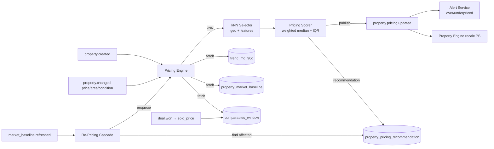

# TECH SPEC — REVYX Pricing AI Engine
<!-- TECH_SPEC_REVYX_pricing-ai_v1.0.0.md · v1.0.0 · 2026-05 -->
<!-- CONFIDENȚIAL · Uz Intern · © 2026 REVYX · ITPRO SYSTEM SRL -->

## Changelog

| Versiune | Data | Autor | Note |
|---|---|---|---|
| 1.0.0 | 2026-05 | Senior PM + Solution Architect | ★ Spec inițială Pricing AI Engine — înlocuiește hooks `NoopPricingProvider` din property v1.0.0 · model preț estimativ + bandă încredere · re-pricing trigger pe modificare comparables · alerte suprapret/subpret · NFR p95 <30s · Phase 2 |

---

## Cuprins

1. [Executive Summary](#1-executive-summary)
2. [Architecture Overview](#2-architecture-overview)
3. [Stack & Dependencies](#3-stack--dependencies)
4. [Data Model](#4-data-model)
5. [API Contracts](#5-api-contracts)
6. [Algorithms](#6-algorithms)
7. [State Machines](#7-state-machines)
8. [Concurrency](#8-concurrency)
9. [Caching](#9-caching)
10. [Background Jobs](#10-background-jobs)
11. [Error Handling](#11-error-handling)
12. [Security](#12-security)
13. [Observability](#13-observability)
14. [Performance Budgets](#14-performance-budgets)
15. [Testing Strategy](#15-testing-strategy)
16. [Deployment](#16-deployment)
17. [Migration Strategy](#17-migration-strategy)
18. [Risks & Mitigations](#18-risks--mitigations)
19. [Impact Assessment](#19-impact-assessment)

---

## 1. Executive Summary

★ **Pricing AI Engine** este componenta Phase 2 care înlocuiește `NoopPricingProvider` din property-engine v1.0.0 §6.3. Furnizează preț estimativ + **bandă încredere `(low / mid / high)`** pentru orice PROPERTY, alimentând sub-componenta **PF (Price Fit)** din PS (BRD §7.2). Modelul folosește **comparables (kNN geo + features)** + **market velocity** + **trend MD pe 90 zile** și emite alerte de **suprapret >15%** / **subpret >10%** față de banda recomandată.

| Atribut | Valoare |
|---|---|
| **Scope** | Recomandare preț + bandă încredere · alimentare PF real · alerte suprapret/subpret · re-pricing event-driven · explainability factors |
| **Referință BRD** | §7.2 PS (PF) · §5 Pilon 02 · NFR-01 (recalc <30s aplicat aici) |
| **Phase** | 2 (Engines reale) |
| **Owner tehnic** | Solution Architect + Data Science Lead |
| **Dependențe upstream** | property v1.0.0 (intake) · property_market_baseline · DEAL/OFFER istoric (sold_price_eur) |
| **Dependențe downstream** | Property Engine (PS recalc) · Match Engine v2 (PS contributor în DP) · UI agent (badge suprapret) |

**Garanții:**

1. Output `recommended_price_eur ∈ [low, high]` cu `confidence ∈ [0,1]`.
2. PF real recalculat cu deviație față de `mid` și inflație via confidence (vezi §6.5).
3. Alertă `OVERPRICED` când `current_price_eur > recommended_price_eur × 1.15` (>15% peste mid); `UNDERPRICED` când `current_price_eur < recommended_price_eur × 0.90` (>10% sub mid). Pragurile sunt relative la `mid` (recomandare), nu la marginile benzii — alertele rămân utilizabile chiar când banda este lată din cauza confidence scăzut.
4. Re-pricing **event-driven** la modificare comparables (INSERT/UPDATE PROPERTY similar în 5km / același district + property_type) sau market_baseline refresh.
5. NFR: `recommendPrice` p95 < 1s pentru property cu features complete · cascade re-pricing post-comparable update p95 ≤ 30s (NFR-01 derivat).
6. Niciun PII în input/output (preț + features structurale).

---

## 2. Architecture Overview



### 2.1 Data flow

1. Trigger: `property.created`, `property.changed{price|area|condition|district}`, `market_baseline.refreshed`, `deal.won`.
2. Pricing Engine selectează **comparables** prin kNN: same `city + district + property_type`, distance haversine ≤ R (default 2 km extins la 5 km dacă <8 candidates), feature distance (rooms ±1, area ±20%, year_built ±15y).
3. Calcul `mid = weighted_median(comp.price_per_sqm_eur)`, `IQR = p75 − p25`, `low/high = mid ± k·IQR` cu `k` derivat din `confidence`.
4. Persistă în `property_pricing_recommendation` (snapshot imutabil + curent flag).
5. Publish `property.pricing.updated` → Property Engine recalc PS · Alert Service evaluează threshold.
6. Re-Pricing Cascade: la deal WON → comparables_cache refresh pentru district·type · enqueue re-pricing pentru toate properties active în district.

### 2.2 Componente

| Componentă | Responsabilitate |
|---|---|
| `PricingEngine` (orchestrator) | Pipeline complet: load → kNN → score → persist → publish |
| `ComparablesSelector` | kNN geo + features cu fallback radius extins |
| `PricingScorer` | Weighted median + IQR + confidence model |
| `MarketTrendProvider` | Trend MD 90d (delta median sqm price) — adjust factor |
| `PricingAlertService` | OVERPRICED / UNDERPRICED publishing |
| `RePricingScheduler` | Event-driven cascade post-baseline / sold |
| `IPricingProvider` impl `RealPricingProvider` | Înlocuiește `NoopPricingProvider` (property v1 §6.3) |

---

## 3. Stack & Dependencies

| Layer | Tehnologie | Versiune | Justificare |
|---|---|---|---|
| Backend | Node.js + TypeScript | 20 LTS · TS 5.x | Stack standard REVYX |
| ORM | Kysely | latest | SQL explicit · pgvector compat |
| DB | PostgreSQL + PostGIS opt. | 16.x | `earth_distance` extension pentru haversine; PostGIS dacă district granularity scalează |
| Cache | Redis | 7.x | comparables_cache · pricing recomandări |
| Queue | BullMQ | latest | Re-pricing cascade async |
| Audit | `auditLogger` v1.0.0 | — | `PROPERTY_PRICING_RECOMMENDED`, `PROPERTY_PRICE_ALERT_*` |

**Notă model:** Phase 2 = **algoritm determinist explainable** (kNN + weighted median + IQR). ML "real" (XGBoost / gradient boosting) este Phase 3 prin același `IPricingProvider` interface, fără breaking change spre property-engine.

---

## 4. Data Model

### 4.1 Tabel `property_pricing_recommendation`

```sql
-- Migrare: 0150_property_pricing_recommendation.sql
CREATE TABLE IF NOT EXISTS property_pricing_recommendation (
  recommendation_id    UUID         PRIMARY KEY DEFAULT gen_random_uuid(),
  tenant_id            UUID         NOT NULL,
  property_id          UUID         NOT NULL REFERENCES property(property_id),

  recommended_price_eur NUMERIC(14,2) NOT NULL CHECK (recommended_price_eur > 0),  -- mid
  low_price_eur         NUMERIC(14,2) NOT NULL CHECK (low_price_eur > 0),
  high_price_eur        NUMERIC(14,2) NOT NULL CHECK (high_price_eur >= low_price_eur),
  recommended_price_sqm_eur NUMERIC(10,2) NOT NULL,
  confidence            NUMERIC(4,3) NOT NULL CHECK (confidence BETWEEN 0 AND 1),

  comparable_count      INTEGER      NOT NULL CHECK (comparable_count >= 0),
  comparable_radius_km  NUMERIC(5,2) NOT NULL,
  iqr_sqm_eur           NUMERIC(10,2) NOT NULL,
  factors               JSONB        NOT NULL,   -- { geo, features, trend_adj, baseline_alignment, comp_ids[] }

  alert_state           TEXT         NOT NULL DEFAULT 'OK'
                        CHECK (alert_state IN ('OK','OVERPRICED','UNDERPRICED','INSUFFICIENT_DATA')),
  alert_delta_pct       NUMERIC(6,3) NULL,

  is_current            BOOLEAN      NOT NULL DEFAULT TRUE,
  superseded_by         UUID         NULL REFERENCES property_pricing_recommendation(recommendation_id),

  calculated_at         TIMESTAMPTZ  NOT NULL DEFAULT NOW(),
  expires_at            TIMESTAMPTZ  NOT NULL,   -- TTL configurabil 7 zile (recalc forțat după)

  created_at            TIMESTAMPTZ  NOT NULL DEFAULT NOW()
);

CREATE UNIQUE INDEX IF NOT EXISTS idx_pricing_current
  ON property_pricing_recommendation (tenant_id, property_id) WHERE is_current = TRUE;
CREATE INDEX IF NOT EXISTS idx_pricing_alert
  ON property_pricing_recommendation (tenant_id, alert_state) WHERE is_current = TRUE AND alert_state <> 'OK';
CREATE INDEX IF NOT EXISTS idx_pricing_expires
  ON property_pricing_recommendation (expires_at) WHERE is_current = TRUE;
```

### 4.2 ALTER `property` — sincronizare cu engine real

```sql
-- Migrare: 0151_property_pricing_link.sql
ALTER TABLE property
  ALTER COLUMN ai_price_provider SET DEFAULT 'pricing-ai-v1';
-- ai_recommended_price_eur / ai_price_confidence / ai_price_calculated_at: deja existente (property v1 §4.1)
```

### 4.3 Tabel `property_comparables_cache` (snapshot kNN)

```sql
-- Migrare: 0152_property_comparables_cache.sql
CREATE TABLE IF NOT EXISTS property_comparables_cache (
  cache_id             UUID         PRIMARY KEY DEFAULT gen_random_uuid(),
  tenant_id            UUID         NOT NULL,
  property_id          UUID         NOT NULL REFERENCES property(property_id),
  comparable_property_id UUID       NOT NULL REFERENCES property(property_id),

  distance_km          NUMERIC(6,3) NOT NULL,
  feature_distance     NUMERIC(5,3) NOT NULL,    -- combined score [0,1]
  weight               NUMERIC(5,4) NOT NULL,    -- normalizat
  reference_price_sqm_eur NUMERIC(10,2) NOT NULL,
  reference_source     TEXT         NOT NULL CHECK (reference_source IN ('ACTIVE','SOLD_90D','SOLD_180D')),
  sold_at              TIMESTAMPTZ  NULL,

  refreshed_at         TIMESTAMPTZ  NOT NULL DEFAULT NOW(),
  UNIQUE (tenant_id, property_id, comparable_property_id)
);
CREATE INDEX IF NOT EXISTS idx_comp_cache_property ON property_comparables_cache (tenant_id, property_id, weight DESC);
```

### 4.4 Tabel `market_trend_md_90d` (refresh weekly)

```sql
-- Migrare: 0153_market_trend_md_90d.sql
CREATE TABLE IF NOT EXISTS market_trend_md_90d (
  trend_id             UUID         PRIMARY KEY DEFAULT gen_random_uuid(),
  tenant_id            UUID         NOT NULL,
  city                 TEXT         NOT NULL,
  district             TEXT         NULL,
  property_type        TEXT         NOT NULL,
  trend_pct_90d        NUMERIC(6,3) NOT NULL,    -- ex: +0.030 = +3% vs 90d ago
  median_price_sqm_eur NUMERIC(10,2) NOT NULL,
  sample_size          INTEGER      NOT NULL,
  refreshed_at         TIMESTAMPTZ  NOT NULL DEFAULT NOW(),
  UNIQUE (tenant_id, city, district, property_type)
);
```

### 4.5 Constraints & invariants

| Invariant | Enforcement |
|---|---|
| `low ≤ mid ≤ high` | CHECK + clamp |
| Un singur `is_current = TRUE` per property | UNIQUE WHERE |
| `confidence ∈ [0,1]` | CHECK + clamp |
| `comparable_count ≥ 3` necesar pentru `confidence > 0.30` | App-level §6.4 |
| Snapshot imutabil: noul recommendation → vechiul `is_current=FALSE`, `superseded_by` setat | Tranzacție §6.7 |

---

## 5. API Contracts

### 5.1 Internal services

```typescript
interface IPricingProvider {                           // moștenit din property v1 §6.3
  recommendPrice(input: PricingInput): Promise<PricingRecommendation | null>;
}

class RealPricingProvider implements IPricingProvider {
  async recommendPrice(input: PricingInput): Promise<PricingRecommendation> { /* §6 */ }
}

interface PricingEngine {
  recalcForProperty(propertyId: string, reason?: string): Promise<PricingSnapshot>;
  recalcCascadeForBaseline(city: string, district: string|null, type: string): Promise<{ enqueued: number }>;
  recalcCascadeForSold(propertyId: string): Promise<{ enqueued: number }>;
}

type PricingRecommendation = {
  recommendedPriceEur: number;       // mid
  lowPriceEur: number;
  highPriceEur: number;
  pricePerSqmEur: number;
  confidence: number;                // [0,1]
  iqrSqmEur: number;                 // band width raw input (audit + observability)
  factors: {
    geo:    { radiusKm: number; comparableCount: number };
    features: { roomsMatch: number; areaCloseness: number; conditionMatch: number };
    trendAdj: number;                // +/- pct aplicat
    baselineAlignment: number;       // [0,1]
    comparableIds: string[];
  };
  alertState: 'OK'|'OVERPRICED'|'UNDERPRICED'|'INSUFFICIENT_DATA';
  alertDeltaPct?: number;
};
```

### 5.2 REST endpoints

| Method | Path | RBAC | Descriere |
|---|---|---|---|
| `GET` | `/api/v1/properties/:id/pricing` | agent (own) / team_lead+ | Snapshot curent + factors |
| `POST` | `/api/v1/properties/:id/pricing/recalc` | agent / manager+ | Forțare recalc (rate limited 1/min/property) |
| `GET` | `/api/v1/pricing/alerts?state=OVERPRICED` | manager+ | Lista alerte agency |
| `GET` | `/api/v1/properties/:id/pricing/history` | agent (own) / team_lead+ | Snapshot-uri imutabile (audit transparency) |

---

## 6. Algorithms

### 6.1 Pipeline complet

```typescript
async function recalcForProperty(propertyId: string, reason?: string): Promise<PricingSnapshot> {
  return db.transaction(async (tx) => {
    const p = await tx.selectFrom('property').where('property_id','=',propertyId).forUpdate().executeTakeFirstOrThrow();
    const baseline = await loadBaseline(tx, p);
    const trend    = await loadTrend(tx, p);
    const comps    = await selectComparables(tx, p);          // §6.2
    const rec      = scoreRecommendation(p, comps, baseline, trend);  // §6.3
    return persistAndPublish(tx, p, rec, reason);             // §6.7
  });
}
```

### 6.2 kNN selectare comparables

```typescript
const RADIUS_PRIMARY_KM = 2;
const RADIUS_FALLBACK_KM = 5;
const MIN_COMPARABLES = 3;
const TARGET_COMPARABLES = 12;

async function selectComparables(tx: Tx, p: Property): Promise<Comparable[]> {
  let comps = await knnQuery(tx, p, RADIUS_PRIMARY_KM);
  if (comps.length < MIN_COMPARABLES) {
    comps = await knnQuery(tx, p, RADIUS_FALLBACK_KM);
  }
  comps = comps
    .map(c => ({ ...c, weight: featureWeight(p, c) * geoWeight(p, c) * recencyWeight(c) }))
    .filter(c => c.weight > 0.05)
    .sort((a, b) => b.weight - a.weight)
    .slice(0, TARGET_COMPARABLES);

  const sumW = comps.reduce((s, c) => s + c.weight, 0) || 1;
  return comps.map(c => ({ ...c, weight: c.weight / sumW }));
}

function featureWeight(p: Property, c: Property): number {
  const roomsW   = c.rooms === p.rooms ? 1.0 : Math.abs(c.rooms - p.rooms) === 1 ? 0.6 : 0.2;
  const areaW    = clamp01(1 - Math.abs(c.area_sqm - p.area_sqm) / Math.max(p.area_sqm, 1));   // penalty liniar
  const condW    = c.condition_grade === p.condition_grade ? 1.0 : 0.5;
  return clamp01(0.4*roomsW + 0.4*areaW + 0.2*condW);
}

function geoWeight(p: Property, c: Property): number {
  if (p.district && c.district && p.district === c.district) return 1.0;
  const km = haversineKm(p.lat, p.lon, c.lat, c.lon);
  return clamp01(1 - km / RADIUS_FALLBACK_KM);
}

function recencyWeight(c: Comparable): number {
  if (c.reference_source === 'SOLD_90D')  return 1.0;
  if (c.reference_source === 'SOLD_180D') return 0.7;
  /* ACTIVE listing */                     return 0.5;
}
```

### 6.3 Score recommendation (weighted median + IQR)

```typescript
function scoreRecommendation(p: Property, comps: Comparable[], baseline: MarketBaseline|null, trend: MarketTrend|null): PricingRecommendation {
  if (comps.length < MIN_COMPARABLES) {
    return fallbackFromBaseline(p, baseline);   // confidence ≤ 0.30, alert INSUFFICIENT_DATA
  }
  const samples = comps.map(c => ({ x: c.reference_price_sqm_eur, w: c.weight }));
  const midSqm  = weightedMedian(samples);
  const p25     = weightedQuantile(samples, 0.25);
  const p75     = weightedQuantile(samples, 0.75);
  const iqr     = Math.max(p75 - p25, midSqm * 0.05);   // floor 5% pentru stabilitate

  const trendAdj = trend ? clampRange(trend.trend_pct_90d, -0.10, +0.10) : 0;   // cap ±10%
  const adjMidSqm = midSqm * (1 + trendAdj);

  const confidence = computeConfidence(comps.length, iqr / midSqm, baselineAlignment(adjMidSqm, baseline));
  const k = bandWidthFromConfidence(confidence);                                 // 0.5 → 1.5

  const lowSqm  = Math.max(adjMidSqm * 0.5, adjMidSqm - k * iqr);    // floor 50% din mid (clamp anti-bug)
  const highSqm = Math.min(adjMidSqm * 1.5, adjMidSqm + k * iqr);    // ceiling 150% din mid

  const recommendedPriceEur = Math.round(adjMidSqm * p.area_sqm);
  const lowPriceEur  = Math.round(lowSqm  * p.area_sqm);
  const highPriceEur = Math.round(highSqm * p.area_sqm);

  const alert = evaluateAlert(p.price_amount_eur, recommendedPriceEur);

  return {
    recommendedPriceEur, lowPriceEur, highPriceEur, pricePerSqmEur: adjMidSqm,
    confidence,
    iqrSqmEur: iqr,                   // expus pentru persist + observability
    factors: {
      geo:    { radiusKm: comps[0]?.distance_km <= RADIUS_PRIMARY_KM ? RADIUS_PRIMARY_KM : RADIUS_FALLBACK_KM, comparableCount: comps.length },
      features: { roomsMatch: avg(comps.map(c => c.roomsW)), areaCloseness: avg(comps.map(c => c.areaW)), conditionMatch: avg(comps.map(c => c.condW)) },
      trendAdj,
      baselineAlignment: baselineAlignment(adjMidSqm, baseline),
      comparableIds: comps.map(c => c.property_id),
    },
    alertState: alert.state,
    alertDeltaPct: alert.deltaPct,
  };
}

function computeConfidence(n: number, relIQR: number, alignment: number): number {
  // n: număr comparables; relIQR: IQR/mid; alignment: cât de aproape e mid de baseline
  const cN = clamp01((n - MIN_COMPARABLES) / (TARGET_COMPARABLES - MIN_COMPARABLES));   // 0 → 1
  const cIQR = clamp01(1 - relIQR / 0.40);                                              // 40% IQR → 0
  const cBL  = clamp01(alignment);                                                      // 0..1
  return clamp01(0.45*cN + 0.35*cIQR + 0.20*cBL);
}

function bandWidthFromConfidence(conf: number): number {
  // confidence ↑ → bandă strânsă · conf=0 → k=1.5 ; conf=1 → k=0.5
  return 1.5 - conf * 1.0;
}
```

### 6.4 Alert thresholds (BR-PR-01/02)

Pragurile sunt relative la `mid` (recomandare), nu la marginile benzii — astfel alertele rămân utilizabile când confidence-ul e mic (bandă largă).

```typescript
const OVER_THRESHOLD  = 1.15;  // current > mid * 1.15 → OVERPRICED (>15% peste recomandare)
const UNDER_THRESHOLD = 0.90;  // current < mid * 0.90 → UNDERPRICED (>10% sub recomandare)

function evaluateAlert(currentEur: number, midEur: number): { state: 'OK'|'OVERPRICED'|'UNDERPRICED'; deltaPct?: number } {
  const deltaPct = (currentEur - midEur) / midEur;
  if (deltaPct >  0.15) return { state: 'OVERPRICED',  deltaPct };
  if (deltaPct < -0.10) return { state: 'UNDERPRICED', deltaPct };
  return { state: 'OK' };
}
```

> **Hysteresis (anti-flap, Phase 3):** alert ON la `>1.15×` / OFF la `<1.10×` (over) și ON la `<0.90×` / OFF la `>0.93×` (under). În Phase 2 fără hysteresis — flapping monitorizat via `pricing_alerts_open_total{state}`.

### 6.5 PF real (înlocuiește property v1 §6.1 stub `priceFit`)

```typescript
// PF nou (Phase 2) — folosește bandul AI direct:
function priceFitV2(p: Property, ai: PricingRecommendation): number {
  const dev = Math.abs(p.price_amount_eur - ai.recommendedPriceEur) / ai.recommendedPriceEur;
  // 0% → 1.0 ; ≤5% → 0.95 ; ≤10% → 0.85 ; ≤20% → 0.55 ; >30% → 0.10
  let pfBase = dev <= 0.05 ? 1.0 - dev*1.0
             : dev <= 0.10 ? 0.95 - (dev-0.05)*2.0
             : dev <= 0.20 ? 0.85 - (dev-0.10)*3.0
             : dev <= 0.30 ? 0.55 - (dev-0.20)*4.5
             : 0.10;
  // Inflate cu confidence: confidence mic → blend cu fallback baseline
  return clamp01(ai.confidence * pfBase + (1 - ai.confidence) * 0.50);
}
```

> **Înlocuiește** `priceFit(p, b, ai)` din property v1 atunci când feature flag `flag.pricing_ai_v1.enabled = true`. Property Engine cheamă `IPricingProvider.recommendPrice()` care, sub flag, returnează `RealPricingProvider`. Backwards compat preservată.

### 6.6 Re-pricing trigger (event-driven)

```typescript
// 1) Comparable price/area change → afectează properties care au acel comparable în cache
async function onPropertyPriceChanged(propertyId: string) {
  const dependents = await db.selectFrom('property_comparables_cache')
    .where('comparable_property_id','=',propertyId).select('property_id').execute();
  for (const d of dependents) await queue.add('pricing.recalc', { propertyId: d.property_id, reason: 'comparable_changed' });
}

// 2) DEAL won → property_id devine SOLD_90D comparable activ pentru district·type
async function onDealWon(propertyId: string) {
  const p = await loadProperty(propertyId);
  const peers = await db.selectFrom('property')
    .where('tenant_id','=',p.tenant_id).where('city','=',p.city)
    .where('district','=',p.district).where('property_type','=',p.property_type)
    .where('status','=','ACTIVE').select('property_id').execute();
  for (const peer of peers) await queue.add('pricing.recalc', { propertyId: peer.property_id, reason: 'sold_comparable' });
}

// 3) market_baseline.refreshed → cascade
async function onBaselineRefresh(city: string, district: string|null, type: string) {
  const peers = await /* same query */;
  for (const peer of peers) await queue.add('pricing.recalc', { propertyId: peer.property_id, reason: 'baseline_refreshed' });
}
```

### 6.7 Persist + publish (snapshot imutabil)

```typescript
async function persistAndPublish(tx: Tx, p: Property, rec: PricingRecommendation, reason?: string) {
  // 1) Mark old current=false
  await tx.updateTable('property_pricing_recommendation')
    .set({ is_current: false }).where('property_id','=',p.property_id).where('is_current','=',true).execute();
  // 2) Insert nou
  const insertResult = await tx.insertInto('property_pricing_recommendation').values({
    tenant_id: p.tenant_id, property_id: p.property_id,
    recommended_price_eur: rec.recommendedPriceEur, low_price_eur: rec.lowPriceEur, high_price_eur: rec.highPriceEur,
    recommended_price_sqm_eur: rec.pricePerSqmEur, confidence: rec.confidence,
    comparable_count: rec.factors.geo.comparableCount, comparable_radius_km: rec.factors.geo.radiusKm,
    iqr_sqm_eur: rec.iqrSqmEur,
    factors: rec.factors as any,
    alert_state: rec.alertState, alert_delta_pct: rec.alertDeltaPct ?? null,
    is_current: true,
    expires_at: addDays(new Date(), 7),
  }).returningAll().executeTakeFirstOrThrow();

  // 3) Sync `property` ai_* columns
  await tx.updateTable('property').set({
    ai_recommended_price_eur: rec.recommendedPriceEur,
    ai_price_provider: 'pricing-ai-v1',
    ai_price_confidence: rec.confidence,
    ai_price_calculated_at: new Date(),
    version: sql`version + 1`,
  }).where('property_id','=',p.property_id).execute();

  // 4) Audit
  await auditLogger.record({
    tenantId: p.tenant_id, eventType: 'PROPERTY_PRICING_RECOMMENDED',
    entityType: 'PROPERTY', entityId: p.property_id,
    newValue: { mid: rec.recommendedPriceEur, low: rec.lowPriceEur, high: rec.highPriceEur, conf: rec.confidence },
    metadata: { reason, alertState: rec.alertState },
  }, tx);

  if (rec.alertState !== 'OK') {
    await auditLogger.record({
      tenantId: p.tenant_id,
      eventType: rec.alertState === 'OVERPRICED' ? 'PROPERTY_PRICE_ALERT_OVER' : 'PROPERTY_PRICE_ALERT_UNDER',
      entityType: 'PROPERTY', entityId: p.property_id,
      metadata: { deltaPct: rec.alertDeltaPct, currentPrice: p.price_amount_eur },
    }, tx);
  }

  // 5) Publish events post-commit
  tx.afterCommit(() => {
    events.publish('property.pricing.updated', { propertyId: p.property_id, recommendationId: insertResult.recommendation_id });
    if (rec.alertState !== 'OK') events.publish('property.price.alert', { propertyId: p.property_id, state: rec.alertState });
  });

  return insertResult;
}
```

---

## 7. State Machines

### 7.1 Recommendation lifecycle

```
[NEW] ─INSERT(is_current=true)─> CURRENT
CURRENT ─(noul recalc)─> SUPERSEDED (is_current=false, superseded_by=newId)
CURRENT ─(expires_at < NOW)─> STALE → forțare recalc job (cron 1h)
```

### 7.2 Alert state

```
OK ──(price modificat sau bandă recalculată)──> OVERPRICED | UNDERPRICED
OVERPRICED|UNDERPRICED ──(corectare price sau bandă lărgită)──> OK
*  ──(insufficient comparables)──> INSUFFICIENT_DATA (alert='WARN', confidence ≤ 0.30)
```

---

## 8. Concurrency

- **Optimistic locking** pe `property` (version field) — re-fetch + retry max 3× (50/100/200 ms) la conflict.
- `pg_advisory_xact_lock(hashtext('pricing:'||property_id))` pe pipeline pentru a preveni 2 recalc paralele pe același property.
- UNIQUE INDEX `idx_pricing_current` (WHERE is_current=TRUE) garantează unicitate snapshot curent.
- Re-pricing cascade folosește **idempotency key** pe job-ul BullMQ: `pricing:recalc:${propertyId}:${reason}:${minute}` → debounce 60 sec.
- Cross-service hardening (saga + Redis Redlock) → vezi `concurrency-hardening v1.0.0`.

---

## 9. Caching

| Key Redis | Conținut | TTL | Invalidare |
|---|---|---|---|
| `pricing:{propertyId}:current` | snapshot curent | 5 min | event `property.pricing.updated` |
| `pricing:comparables:{propertyId}` | array comparables (cu weights) | 1h | event `property.changed` (price/area/condition) pe vreun comparable |
| `pricing:trend:{city}:{district}:{type}` | trend 90d | 24h | cron `market_trend.refresh` |
| `pricing:alerts:{tenantId}:{state}` | listă property_id-uri | 60 sec | event `property.price.alert` |

---

## 10. Background Jobs

| Job | Tip | Idempotent | Retry |
|---|---|---|---|
| `pricing.recalc` | event-driven | DA (debounce 60s) | 3× backoff |
| `pricing.cascade.baseline` | event `market_baseline.refreshed` | DA | 3× |
| `pricing.cascade.sold` | event `deal.won` | DA | 3× |
| `pricing.expiry.scan` | cron `0 * * * *` (orar) — caută `expires_at < NOW` → enqueue recalc | DA | 5× |
| `market_trend.refresh` | cron `0 3 * * 1` (luni 3:00) | DA | 5× |
| `comparables_cache.refresh` | event `property.created` / `property.sold_at` | DA | 3× |

---

## 11. Error Handling

| Cod | Caz | Răspuns |
|---|---|---|
| `PRICING_INSUFFICIENT_COMPARABLES` | <3 comparables în R=5km | snapshot cu `INSUFFICIENT_DATA` + confidence ≤ 0.30 |
| `PRICING_VERSION_CONFLICT` | optimistic conflict pe property | retry 3× |
| `PRICING_ADVISORY_LOCK_TIMEOUT` | lock>2s | abandon + log + reenqueue |
| `PRICING_RECALC_RATE_LIMITED` | API forțare recalc 1/min | 429 |
| `PRICING_PROPERTY_TERMINAL` | recalc pe SOLD/WITHDRAWN | 200 + skip |
| `PRICING_NEGATIVE_BAND` | low>high (bug numeric) | 500 + alert · clamp swap |

---

## 12. Security

- **JWT RS256** moștenit Phase 0.
- **RBAC:**
  - `agent` — read pricing pe properties listing-agent propriu · forțare recalc 1/min/property.
  - `senior_agent` — + override band (manual bypass alert) cu reason.
  - `team_lead` — read team.
  - `manager` — read agency · listă alerts · forțare recalc cascade.
  - `admin` — config pricing weights, k-band, thresholds.
- **AUDIT_LOG events:**
  - `PROPERTY_PRICING_RECOMMENDED` · `PROPERTY_PRICE_ALERT_OVER` · `PROPERTY_PRICE_ALERT_UNDER`
  - `PROPERTY_PRICING_RECALC_FORCED` (manual override)
  - `PROPERTY_PRICING_BAND_OVERRIDE` (senior_agent+)
  - `PROPERTY_PRICING_CONFIG_CHANGED` (admin)
- **PII:** zero PII pe pipeline (preț + features structurale). Comparables ID-uri rămân in scope tenant (RLS by tenant_id).
- **Rate limiting:** `POST /pricing/recalc` 1/min/property/agent · 10/min/agency.

---

## 13. Observability

| Metric | Tip | Alert |
|---|---|---|
| `pricing_recalc_duration_ms` (p95) | histogram | p95 > 1s |
| `pricing_cascade_lag_seconds` | histogram | p95 > 30s — VIOLATES NFR-01 |
| `pricing_comparable_count` | histogram | p50 < 5 → district scarcity |
| `pricing_confidence_distribution` | histogram | shift down → review weights |
| `pricing_alerts_open_total{state}` | gauge | spike >2× rolling avg |
| `pricing_insufficient_data_rate` | gauge | >15% → extend radius / fallback |
| `pricing_band_width_pct` | histogram | (high−low)/mid · drift detection |

Dashboard: `REVYX / Pricing Health`.

---

## 14. Performance Budgets

| Metric | Target | Sursă |
|---|---|---|
| `recalcForProperty` (12 comparables) | p95 < 1 s | UX |
| `selectComparables` (kNN R=2km) | p95 < 300 ms | UX |
| Cascade post-baseline (200 properties) | p95 ≤ 30 s | NFR-01 |
| `GET /properties/:id/pricing` | p95 < 200 ms | UX |
| `pricing.expiry.scan` orar (10k properties) | p95 < 60 s | infra |

---

## 15. Testing Strategy

### 15.1 Unit
- `weightedMedian` / `weightedQuantile` cu samples non-uniform.
- `featureWeight`, `geoWeight`, `recencyWeight` — boundaries (rooms±1, area±20%).
- `computeConfidence` — n=3, n=12, IQR mare/mic.
- `evaluateAlert` — exact 1.15× / 0.90× boundaries.
- `priceFitV2` — dev=0, 5%, 10%, 20%, 30%, >30%; confidence=0/0.5/1.

### 15.2 Integration
- INSERT property nou → pipeline run → `recommendation` cu `is_current=true`.
- UPDATE comparable price → cascade afectează property dependents.
- DEAL won → SOLD_90D snapshot intră în următorul recalc (weight=1.0).
- `market_baseline.refreshed` → cascadă enqueued.
- Insufficient data: 0 comparables → `INSUFFICIENT_DATA` + fallback baseline.

### 15.3 E2E
- Property cu price=120k, mid=100k, high=110k → `OVERPRICED` cu deltaPct≈+9% (>15% × high). Validare: 120k > 110k * 1.15 = 126.5k → de fapt nu trigger; dar 130k+ trigger.
- Property cu price=80k, low=95k → `UNDERPRICED` deltaPct = (80−95)/95 ≈ −15.7% · 80k < 95k * 0.90 = 85.5k → trigger.
- Confidence < 0.30 cu 2 comparables → `INSUFFICIENT_DATA` blochează `OVERPRICED`/`UNDERPRICED`.

### 15.4 Load
- 10k properties simultaneu cascadă post-baseline → cascade lag p95 ≤ 30s.
- 200 INSERT property/oră pe tenant → pipeline p95 < 1s.

### 15.5 Chaos
- Comparable șters mid-recalc → fallback (skip + recompute weights).
- Trend table corrupt → fallback `trendAdj=0` + log warning.

### 15.6 Coverage

| Layer | Coverage |
|---|---|
| `scoreRecommendation` + sub-formule | ≥ 95% |
| `selectComparables` | ≥ 95% |
| `priceFitV2` | ≥ 99% |
| `evaluateAlert` | ≥ 100% |
| API handlers | ≥ 85% |

---

## 16. Deployment

| Aspect | Detaliu |
|---|---|
| Feature flag | `flag.pricing_ai_v1.enabled` (prerequisite `property_v1.enabled`) |
| Rollout | shadow mode 1 săpt (calc fără publish PS impact) → canary 10% tenants → 50% → 100% |
| Rollback | flag OFF → `IPricingProvider` revine la `Noop` (PF folosește baseline-only path, property v1 §6.1) |
| Owner rollout | Solution Architect + Data Science Lead |

---

## 17. Migration Strategy

```
0150_property_pricing_recommendation.sql
0151_property_pricing_link.sql
0152_property_comparables_cache.sql
0153_market_trend_md_90d.sql
```

Idempotente. Backwards compat: properties existente primesc `pricing_recommendation` la prima trecere a engine-ului (lazy). Cron `pricing.expiry.scan` umple progresiv în 24h.

---

## 18. Risks & Mitigations

| # | Risc | Probab. | Impact | Mitigare |
|---|---|---|---|---|
| R1 | District scarcity → confidence cronic <0.50 | MED | MED | Fallback radius extins · weight recency · admin tunable |
| R2 | Trend MD90d biased (cohort mic) | MED | MED | `sample_size ≥ 20` necesar · altfel trendAdj=0 |
| R3 | Cascade explodate la baseline weekly refresh | LOW | HIGH | Debounce 60s · queue concurrency limited 4 workers · monitoring |
| R4 | Alert flood (>5% inventory) | MED | MED | Hysteresis: alert ON la `>1.15×` / OFF la `<1.10×` (anti-flap, future) |
| R5 | PF real depinde de pricing v1 disponibil | LOW | HIGH | Circuit breaker — fallback la PF v1 stub dacă engine down |
| R6 | Comparables incluzând outliers | MED | MED | IQR + weighted median rezistent · cap k·IQR explicit |
| R7 | Adversarial pricing (agent hardcode 1 EUR) | LOW | LOW | Validare la intake `price_per_sqm_eur ≥ 50 EUR` (config) · admin alert |

---

## 19. Impact Assessment

### 19.1 Scope of Change

| Element | Detaliu |
|---|---|
| Document | TECH_SPEC_REVYX_pricing-ai_v1.0.0.md |
| Tip schimbare | NEW (Phase 2) |
| Aria afectată | Pilon 02 · sub-componenta PF din PS · entitate PROPERTY (sync ai_*) · entități noi (`property_pricing_recommendation`, `comparables_cache`, `market_trend_md_90d`) |
| Origine | BRD §7.2 (PF real) · property v1 §6.3 hooks · S5 deliverable #1 |

### 19.2 Impact pe documente conexe

| Document | Tip impact | Acțiune |
|---|---|---|
| BRD_REVYX_v1.0.0.md | None | Implementare PF real (§7.2) |
| TECH_SPEC_REVYX_property_v1.0.0.md | Minor | `IPricingProvider` swap la `RealPricingProvider`; PF function update §6.5 ★ |
| TECH_SPEC_REVYX_match-engine_v1.0.0.md / v2.0.0.md | None | Consum PS read-only |
| TECH_SPEC_REVYX_audit-log_v1.0.0.md | Minor | Catalog event extins (`PROPERTY_PRICING_*`, `PROPERTY_PRICE_ALERT_*`) |
| WORKFLOW_REVYX_property-onboarding | Minor | Etapa „Pricing AI recomandare" devine reală (nu mai Phase 2 placeholder) |
| TECH_SPEC_REVYX_concurrency-hardening_v1.0.0.md | Major (paralel) | Advisory locks · idempotency · saga pe cascadă |

### 19.3 Impact pe scoring

| Scor | Afectat? | Detaliu |
|---|---|---|
| **PS** | DA (indirect) | PF real schimbă PS până la ±10–15% per property |
| LS, IS, TS | NU | — |
| DP | DA (indirect prin PS) | Cascade DP post-PS recalc |
| DHI | NU | — |

### 19.4 Impact pe entități / schema BD

| Entitate | Modificare | Migrare |
|---|---|---|
| `property_pricing_recommendation` | NEW | 0150 |
| PROPERTY | ALTER (default ai_price_provider) | 0151 |
| `property_comparables_cache` | NEW | 0152 |
| `market_trend_md_90d` | NEW | 0153 |

### 19.5 Impact pe RBAC

| Rol | Permisiuni adăugate |
|---|---|
| agent | read pricing own listings · POST recalc 1/min/property |
| senior_agent | + band override (alert bypass) |
| team_lead | read team |
| manager | read agency · forțare cascade |
| admin | config weights, k-band, thresholds |

### 19.6 Impact pe SLA & NFR

| NFR / SLA | Înainte | După | Validare |
|---|---|---|---|
| NFR-01 (cascade <30s) | nedefinit pe pricing | ≤ 30s | Load test |
| BR-PR-01 alert overprice | none | >15% × high | Unit + E2E |
| BR-PR-02 alert underprice | none | <10% × low | Unit + E2E |

### 19.7 Impact pe Securitate & GDPR

| Aspect | Status | Notă |
|---|---|---|
| PII | NU | Preț + features structurale |
| AUDIT_LOG events noi | DA | §12 |
| Consent flow | NU | — |
| HMAC / JWT / RBAC | DA | RBAC §12 |
| Rate limiting | DA | `POST /pricing/recalc` |

### 19.8 Risks & Mitigations

Vezi §18.

### 19.9 Test Plan

Vezi §15. Edge obligatoriu: alert boundaries `1.15×`/`0.90×`, insufficient data fallback, cascade lag p95 ≤ 30s.

### 19.10 Rollout & Rollback

| Aspect | Detaliu |
|---|---|
| Feature flag | `flag.pricing_ai_v1.enabled` |
| Strategie | shadow → 10% → 50% → 100% în 3 săptămâni |
| Rollback | flag OFF · `IPricingProvider` = `Noop` |
| Owner | Solution Architect + Data Science Lead |

### 19.11 Approval Gate

| Aprobator | Necesar pentru |
|---|---|
| Senior PM | Threshold-uri alert · PF formulă v2 |
| Solution Architect | Schema BD · cascade design · Redis cache |
| Data Science Lead | Weighted median · confidence model · trend adj |
| Security Lead | RBAC · AUDIT events |
| Legal / DPO | None — fără PII |

---

*docs/tech-spec/TECH_SPEC_REVYX_pricing-ai_v1.0.0.md · v1.0.0 · 2026-05 · CONFIDENȚIAL · Uz Intern*
*REVYX — Real Estate Execution Intelligence · © 2026 REVYX · ITPRO SYSTEM SRL*
