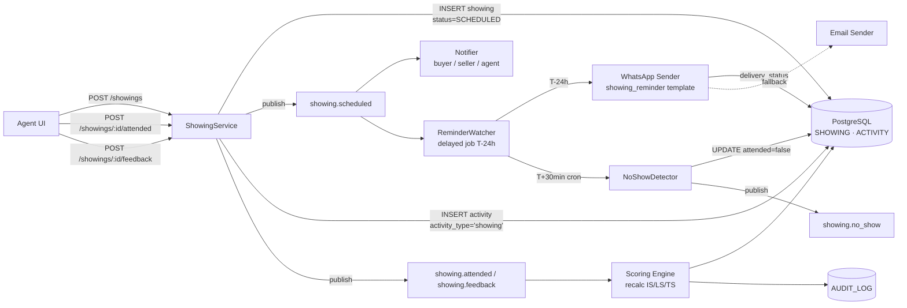

# TECH SPEC — REVYX Showing
<!-- TECH_SPEC_REVYX_showing_v1.0.0.md · v1.0.0 · 2026-05 -->
<!-- CONFIDENȚIAL · Uz Intern · © 2026 REVYX · ITPRO SYSTEM SRL -->

## Changelog

| Versiune | Data | Autor | Note |
|---|---|---|---|
| 1.0.0 | 2026-05 | Senior PM + Solution Architect | Spec inițială SHOWING — schema dedicată + reminder T-24h + no-show detection + feedback capture · Phase 1 |

---

## Cuprins

1. [Executive Summary](#1-executive-summary)
2. [Architecture Overview](#2-architecture-overview)
3. [Stack & Dependencies](#3-stack--dependencies)
4. [Data Model](#4-data-model)
5. [API Contracts](#5-api-contracts)
6. [Algorithms](#6-algorithms)
7. [State Machines](#7-state-machines)
8. [Concurrency](#8-concurrency)
9. [Caching](#9-caching)
10. [Background Jobs](#10-background-jobs)
11. [Error Handling](#11-error-handling)
12. [Security](#12-security)
13. [Observability](#13-observability)
14. [Performance Budgets](#14-performance-budgets)
15. [Testing Strategy](#15-testing-strategy)
16. [Deployment](#16-deployment)
17. [Migration Strategy](#17-migration-strategy)
18. [Risks & Mitigations](#18-risks--mitigations)
19. [Impact Assessment](#19-impact-assessment)

---

## 1. Executive Summary

Specificație tehnică pentru entitatea **SHOWING** (vizionare programată) — formalizare schema dedicată recomandată în WORKFLOW_REVYX_showing-flow §15.4. SHOWING este input critic pentru `SF` (Showing Frequency) în formula IS (BRD §7.3) și sursă de semnal pentru LS, TS, DP.

| Atribut | Valoare |
|---|---|
| **Scope** | Schema SHOWING · API CRUD · reminder T-24h · no-show auto-detect · feedback capture · cascadă recalc IS/LS/TS |
| **Referință BRD** | §5 Pilon 04 (Execution) · §7.3 IS · §8 entitate SHOWING · §6.3 BR-09 (template Meta) |
| **Phase** | 1 (Core engines — completare workflow showing) |
| **Owner tehnic** | Solution Architect + Senior PM |
| **Dependențe upstream** | Phase 0: Auth/RBAC · AUDIT_LOG · WhatsApp template `showing_reminder` Meta-aprobat. Phase 1: lead-scoring v1.0.0 · property v1.0.0 |
| **Dependențe downstream** | Match Engine · NBA Engine · DHI Engine (toate consumă SF actualizat) |

**Garanții oferite:**

1. SHOWING SCHEDULED → reminder T-24h trimis în fereastră ±5 minute (AC-SH-01).
2. ATTENDED → recalc IS+LS+TS în ≤30 sec (NFR-01, AC-SH-02).
3. No-show auto-detectat la T+30min fără confirmare prezență (AC-SH-03).
4. 3 NO_SHOW consecutive pe același lead → LEAD auto `LOST` cu `lost_reason='cooling_off'` (AC-SH-04).
5. WhatsApp template `showing_reminder` Meta-aprobat — fail trimite → fallback email (AC-SH-06).
6. GDPR consent revocat → WhatsApp skip · doar email (AC-SH-07).
7. `feedback_score ∈ [1,5]` enforced la nivel BD + API.

---

## 2. Architecture Overview



### 2.1 Data flow (happy path)

1. Agent POST `/showings` cu `deal_id`, `property_id`, `lead_id`, `scheduled_at`. Service validează conflict calendar + status property, INSERT atomic + ACTIVITY (`activity_type='showing'`, metadata.scheduled_at) + AUDIT.
2. ReminderWatcher armează delayed job `showing.reminder` cu `jobId='reminder:{showing_id}'` la `scheduled_at - 24h`.
3. La T-24h: WhatsApp template `showing_reminder` trimis (BR-09). Fail → fallback email + audit `WHATSAPP_TEMPLATE_FAILED`.
4. NoShowDetector cron `*/5 * * * *` filtrează `status='SCHEDULED' AND scheduled_at < NOW() - 30min`.
5. Agent marchează ATTENDED post-vizionare cu `duration_minutes`. Service publică `showing.attended` → Scoring Engine recalc IS/LS/TS.
6. Agent completează feedback (score 1-5 + notes) — recalc final cu impact LS conform §6.4.

### 2.2 Componente principale

| Componentă | Responsabilitate |
|---|---|
| `ShowingService` | CRUD SHOWING · validări state machine · INSERT atomic ACTIVITY |
| `ReminderWatcher` | Delayed jobs BullMQ T-24h · idempotent prin jobId stable |
| `NoShowDetector` | Cron 5min · UPDATE `status='NO_SHOW'` · cascade recalc TS |
| `ConsecutiveNoShowGuard` | Tracker counter `consecutive_no_show_count` per LEAD · trigger LOST la 3 |
| `WhatsAppSender` | Wrapper template `showing_reminder` (BR-09) · fallback email · delivery tracking |
| `FeedbackProcessor` | Validare score 1-5 · trigger recalc LS cu mapping §6.4 |

---

## 3. Stack & Dependencies

| Layer | Tehnologie | Versiune | Justificare |
|---|---|---|---|
| Backend | Node.js + TypeScript | 20 LTS · TS 5.x | Stack standard REVYX |
| ORM | Kysely | latest | Type-safe SQL · control optimistic locking |
| DB | PostgreSQL | 16.x | TIMESTAMPTZ · CHECK constraints · partial indexes |
| Cache | Redis | 7.x | Cache reminder schedule · noshow counters per lead |
| Queue | BullMQ | latest | Delayed jobs T-24h · cron T+30min · retry exponențial |
| WhatsApp | Meta Cloud API | v18 | Template `showing_reminder` Meta-aprobat (BR-09) |
| Calendar | iCalendar (RFC 5545) | — | ICS attachment în email confirm buyer |
| Audit | `auditLogger` | 1.0.0 | În aceeași tranzacție cu UPDATE-ul SHOWING |

---

## 4. Data Model

### 4.1 Tabel `showing` ★

```sql
-- Migrare: 0080_showing_phase1.sql
CREATE TABLE IF NOT EXISTS showing (
  showing_id              UUID            PRIMARY KEY DEFAULT gen_random_uuid(),
  tenant_id               UUID            NOT NULL,

  -- FK participanți
  deal_id                 UUID            NOT NULL REFERENCES deal(deal_id),
  property_id             UUID            NOT NULL REFERENCES property(property_id),
  lead_id                 UUID            NOT NULL REFERENCES lead(lead_id),
  agent_id                UUID            NOT NULL REFERENCES agent(agent_id),

  -- Programare
  scheduled_at            TIMESTAMPTZ     NOT NULL,
  duration_minutes        INTEGER         NULL CHECK (duration_minutes IS NULL OR duration_minutes BETWEEN 1 AND 480),

  -- Status workflow
  status                  TEXT            NOT NULL DEFAULT 'SCHEDULED'
                            CHECK (status IN ('SCHEDULED','REMINDED','ATTENDED','NO_SHOW','CANCELLED')),

  -- Rezultat
  attended                BOOLEAN         NULL,                 -- NULL până la confirmare
  cancellation_reason     TEXT            NULL
                            CHECK (cancellation_reason IS NULL OR cancellation_reason IN
                              ('no_show','reschedule','lead_cancelled','agent_cancelled','seller_unavailable','other')),
  cancelled_at            TIMESTAMPTZ     NULL,
  advance_notice_hours    NUMERIC(6,2)    NULL,                 -- (scheduled_at - cancelled_at) în ore

  -- Feedback
  feedback_score          SMALLINT        NULL CHECK (feedback_score IS NULL OR feedback_score BETWEEN 1 AND 5),
  feedback_notes          TEXT            NULL,                 -- PII potențial → redact în AUDIT
  feedback_at             TIMESTAMPTZ     NULL,
  feedback_by_user_id     UUID            NULL REFERENCES agent(agent_id),

  -- Reminder tracking
  reminder_sent_at        TIMESTAMPTZ     NULL,
  reminder_channel        TEXT            NULL CHECK (reminder_channel IS NULL OR reminder_channel IN ('whatsapp','email','both')),
  reminder_delivery_status TEXT           NULL CHECK (reminder_delivery_status IS NULL OR reminder_delivery_status IN ('sent','delivered','read','failed')),

  -- Optimistic locking
  version                 BIGINT          NOT NULL DEFAULT 1,

  created_at              TIMESTAMPTZ     NOT NULL DEFAULT NOW(),
  updated_at              TIMESTAMPTZ     NOT NULL DEFAULT NOW(),
  created_by_user_id      UUID            NOT NULL REFERENCES agent(agent_id)
);

-- Indexuri
CREATE INDEX IF NOT EXISTS idx_showing_tenant_status
  ON showing (tenant_id, status, scheduled_at);
CREATE INDEX IF NOT EXISTS idx_showing_lead
  ON showing (tenant_id, lead_id, scheduled_at DESC);
CREATE INDEX IF NOT EXISTS idx_showing_property
  ON showing (tenant_id, property_id, scheduled_at DESC);
CREATE INDEX IF NOT EXISTS idx_showing_agent_calendar
  ON showing (tenant_id, agent_id, scheduled_at)
  WHERE status IN ('SCHEDULED','REMINDED');
CREATE INDEX IF NOT EXISTS idx_showing_noshow_scan
  ON showing (scheduled_at)
  WHERE status IN ('SCHEDULED','REMINDED') AND attended IS NULL;
CREATE INDEX IF NOT EXISTS idx_showing_feedback_pending
  ON showing (tenant_id, agent_id, scheduled_at)
  WHERE status='ATTENDED' AND feedback_score IS NULL;
```

### 4.2 Conflict de calendar agent (BD-level guard)

```sql
-- Exclude conflicte pe agent_id în interval [scheduled_at, scheduled_at + 1h)
-- Doar pentru showings active (SCHEDULED/REMINDED) — nu blocăm ATTENDED/NO_SHOW/CANCELLED
ALTER TABLE showing ADD CONSTRAINT showing_agent_no_overlap
  EXCLUDE USING gist (
    agent_id WITH =,
    tstzrange(scheduled_at, scheduled_at + INTERVAL '60 minutes') WITH &&
  )
  WHERE (status IN ('SCHEDULED','REMINDED'));
-- Necesită extension btree_gist:
-- CREATE EXTENSION IF NOT EXISTS btree_gist;
```

### 4.3 Counter `consecutive_no_show_count` pe LEAD ★

```sql
-- Migrare: 0081_lead_consecutive_no_show.sql (ALTER lead)
ALTER TABLE lead
  ADD COLUMN IF NOT EXISTS consecutive_no_show_count SMALLINT NOT NULL DEFAULT 0,
  ADD COLUMN IF NOT EXISTS last_showing_at TIMESTAMPTZ NULL;
```

Reguli update (aplicate în `ShowingService`):
- ATTENDED → reset `consecutive_no_show_count = 0`, set `last_showing_at = scheduled_at`.
- NO_SHOW → increment `consecutive_no_show_count`, set `last_showing_at = scheduled_at`.
- La 3 → trigger `LeadLifecycleService.markLost(leadId, 'cooling_off')`.

### 4.4 Constraints & invariants

| Invariant | Enforcement |
|---|---|
| `feedback_score ∈ [1,5]` | CHECK constraint + API validation 422 |
| `duration_minutes ∈ [1, 480]` | CHECK |
| `scheduled_at` în UTC, dar tenant timezone forced UTC+2 la afișare | TIMESTAMPTZ + render layer |
| Conflict calendar agent | EXCLUDE USING gist (vezi §4.2) |
| `cancellation_reason` non-null când `status='CANCELLED'` sau `status='NO_SHOW'` | App-level state machine §7 |
| `feedback_at` non-null când `feedback_score` non-null | App-level + trigger pre-INSERT |
| `version` strict crescător | Optimistic locking §8 |

---

## 5. API Contracts

### 5.1 Internal services

```typescript
interface ShowingService {
  schedule(input: ScheduleShowingInput, actor: User): Promise<Showing>;
  markAttended(showingId: string, durationMinutes: number, actor: User): Promise<Showing>;
  markNoShow(showingId: string, actor: User | 'SYSTEM'): Promise<Showing>;
  cancel(showingId: string, reason: CancellationReason, actor: User): Promise<Showing>;
  recordFeedback(showingId: string, score: 1|2|3|4|5, notes: string|null, actor: User): Promise<Showing>;
}

interface ReminderWatcher {
  arm(showingId: string, scheduledAt: Date): Promise<void>;
  disarm(showingId: string): Promise<void>;
}

interface NoShowDetector {
  scanAndMark(): Promise<{ scanned: number; marked: number }>;
}
```

### 5.2 REST endpoints

| Method | Path | RBAC | Descriere |
|---|---|---|---|
| `POST` | `/api/v1/showings` | agent (own deal) / team_lead+ | Programează showing |
| `GET` | `/api/v1/showings/:id` | agent (own) / team_lead+ | Detalii showing |
| `GET` | `/api/v1/showings?lead_id=&property_id=&agent_id=&status=` | agent (own) / team_lead+ | Listă filtrabilă |
| `POST` | `/api/v1/showings/:id/attended` | agent (own) | Marchează prezență + duration |
| `POST` | `/api/v1/showings/:id/no-show` | agent (own) | Override manual no-show |
| `POST` | `/api/v1/showings/:id/cancel` | agent (own) / team_lead+ | Cancel cu reason |
| `POST` | `/api/v1/showings/:id/feedback` | agent (own) | Capture feedback 1-5 + notes |
| `POST` | `/api/v1/showings/:id/reschedule` | agent (own) | Anulează vechi + creează nou (atomic) |

### 5.3 Payload exemplu — POST /showings

```json
{
  "deal_id": "uuid",
  "property_id": "uuid",
  "lead_id": "uuid",
  "scheduled_at": "2026-05-12T15:00:00+02:00",
  "expected_duration_minutes": 45,
  "notes": "buyer prefer apt etaj > 3"
}
```

Response: `201 Created` cu showing complet + `Location` header.

Erori canonice: `409 SHOWING_AGENT_CALENDAR_CONFLICT`, `422 PROPERTY_NOT_AVAILABLE`, `422 LEAD_GDPR_CONSENT_MISSING`.

---

## 6. Algorithms

### 6.1 Schedule + reminder arm

```typescript
async function schedule(input: ScheduleShowingInput, actor: User): Promise<Showing> {
  return db.transaction(async (tx) => {
    const lead = await tx.selectFrom('lead').where('lead_id','=',input.leadId).executeTakeFirstOrThrow();
    const property = await tx.selectFrom('property').where('property_id','=',input.propertyId).executeTakeFirstOrThrow();

    // Validări
    if (!['ACTIVE','RESERVED'].includes(property.status)) throw new Error('PROPERTY_NOT_AVAILABLE');
    if (!lead.gdpr_consent_at) throw new Error('LEAD_GDPR_CONSENT_MISSING');
    if (lead.status === 'LOST') throw new Error('LEAD_LOST_CANNOT_SCHEDULE');

    // INSERT (BD constraint EXCLUDE prinde conflict calendar)
    const showing = await tx.insertInto('showing').values({
      tenant_id: actor.tenantId,
      deal_id: input.dealId,
      property_id: input.propertyId,
      lead_id: input.leadId,
      agent_id: input.agentId,
      scheduled_at: input.scheduledAt,
      status: 'SCHEDULED',
      created_by_user_id: actor.userId,
    }).returningAll().executeTakeFirstOrThrow();

    // ACTIVITY pentru SF input
    await tx.insertInto('activity').values({
      tenant_id: actor.tenantId,
      entity_type: 'lead',
      entity_id: input.leadId,
      activity_type: 'showing',
      performed_by: actor.userId,
      channel: 'in_app',
      metadata: { showing_id: showing.showing_id, scheduled_at: input.scheduledAt, phase: 'scheduled' },
      occurred_at: new Date(),
    }).execute();

    await auditLogger.record({
      tenantId: actor.tenantId,
      userId: actor.userId,
      eventType: 'SHOWING_SCHEDULED',
      entityType: 'SHOWING',
      entityId: showing.showing_id,
      newValue: { scheduled_at: input.scheduledAt, property_id: input.propertyId, agent_id: input.agentId },
    }, tx);

    // Arm reminder (după commit pentru a evita armarea pe rollback)
    tx.afterCommit(() => reminderWatcher.arm(showing.showing_id, input.scheduledAt));
    return showing;
  });
}
```

### 6.2 Reminder T-24h (delayed job)

```typescript
async function arm(showingId: string, scheduledAt: Date) {
  const delayMs = scheduledAt.getTime() - 24*60*60_000 - Date.now();
  if (delayMs < 0) return; // showing în <24h → skip reminder (reminder în T-2h fallback?)
  await queue.add(
    'showing.reminder',
    { showingId },
    { delay: delayMs, jobId: `reminder:${showingId}`, attempts: 3, backoff: { type: 'exponential', delay: 60_000 } }
  );
}

async function handleReminder({ showingId }: { showingId: string }) {
  const showing = await loadShowing(showingId);
  if (showing.status !== 'SCHEDULED') return; // CANCELLED/ATTENDED → skip

  const lead = await loadLead(showing.lead_id);
  const useWhatsApp = lead.gdpr_consent_at && lead.phone_e164 && hasConsent(lead, 'whatsapp');
  const channel: 'whatsapp'|'email'|'both' = useWhatsApp ? 'whatsapp' : 'email';

  let deliveryStatus: 'sent'|'failed' = 'sent';
  try {
    if (useWhatsApp) {
      await whatsappSender.sendTemplate('showing_reminder', lead.phone_e164, {
        property_address: shorten(property.address, 60),
        scheduled_at_local: formatChisinau(showing.scheduled_at),
        agent_name: agent.full_name,
        agent_phone: agent.phone_e164,
      });
    }
    await emailSender.send('showing_reminder', lead.email, /* ... */);
  } catch (err) {
    deliveryStatus = 'failed';
    await auditLogger.record({ eventType: 'WHATSAPP_TEMPLATE_FAILED', metadata: { template: 'showing_reminder', error: String(err) } });
    // Fallback email-only
    if (useWhatsApp) await emailSender.send('showing_reminder', lead.email, /* ... */);
  }

  await db.updateTable('showing')
    .set({ reminder_sent_at: new Date(), reminder_channel: channel, reminder_delivery_status: deliveryStatus, status: 'REMINDED', version: showing.version + 1n })
    .where('showing_id','=',showingId)
    .where('version','=',showing.version)
    .execute();

  await auditLogger.record({ eventType: 'SHOWING_REMINDER_SENT', entityType: 'SHOWING', entityId: showingId, metadata: { channel, deliveryStatus } });
}
```

### 6.3 No-show auto-detect (cron)

```typescript
// Cron: */5 * * * *
async function scanAndMark(): Promise<{ scanned: number; marked: number }> {
  const candidates = await db.selectFrom('showing')
    .where('status','in',['SCHEDULED','REMINDED'])
    .where('attended','is',null)
    .where('scheduled_at','<', sql`NOW() - INTERVAL '30 minutes'`)
    .selectAll().execute();

  let marked = 0;
  for (const s of candidates) {
    await markNoShow(s.showing_id, 'SYSTEM');
    marked++;
  }
  return { scanned: candidates.length, marked };
}
```

### 6.4 Feedback → LS impact mapping

```typescript
const FEEDBACK_LS_DELTA: Record<1|2|3|4|5, number> = {
  1: -0.10,
  2: -0.05,
  3:  0.00,
  4: +0.05,
  5: +0.10,
};

async function recordFeedback(showingId: string, score: 1|2|3|4|5, notes: string|null, actor: User) {
  return db.transaction(async (tx) => {
    const showing = await tx.selectFrom('showing').where('showing_id','=',showingId).forUpdate().executeTakeFirstOrThrow();
    if (showing.status !== 'ATTENDED') throw new Error('FEEDBACK_INVALID_STATE');

    await tx.updateTable('showing').set({
      feedback_score: score,
      feedback_notes: notes,
      feedback_at: new Date(),
      feedback_by_user_id: actor.userId,
      version: showing.version + 1n,
    }).where('showing_id','=',showingId).where('version','=',showing.version).execute();

    await tx.insertInto('activity').values({
      tenant_id: showing.tenant_id,
      entity_type: 'lead',
      entity_id: showing.lead_id,
      activity_type: 'note_added',
      performed_by: actor.userId,
      channel: 'in_app',
      metadata: { showing_id: showingId, feedback_score: score, phase: 'feedback' },
      occurred_at: new Date(),
    }).execute();

    await auditLogger.record({
      tenantId: showing.tenant_id,
      userId: actor.userId,
      eventType: 'SHOWING_FEEDBACK_RECORDED',
      entityType: 'SHOWING',
      entityId: showingId,
      newValue: { feedback_score: score },
      metadata: { notes_redacted: redactPII(notes) },
    }, tx);

    // Trigger recalc downstream — formulele finale aplică clamp01
    tx.afterCommit(() => events.publish('showing.feedback_recorded', { showingId, leadId: showing.lead_id, score }));
  });
}
```

> Δ-urile feedback sunt **semnal de input** pentru recalc LS — nu suprascriere directă. Engine-ul LS recalculează cu factor E (engagement) updatat din ACTIVITY. Magnitudinea finală e clamped la `clamp01(LS)`.

### 6.5 Consecutive no-show guard

```typescript
async function markNoShow(showingId: string, actor: User|'SYSTEM') {
  return db.transaction(async (tx) => {
    const showing = await tx.selectFrom('showing').where('showing_id','=',showingId).forUpdate().executeTakeFirstOrThrow();
    if (showing.status === 'NO_SHOW') return showing; // idempotent
    if (!['SCHEDULED','REMINDED'].includes(showing.status)) throw new Error('NOSHOW_INVALID_STATE');

    await tx.updateTable('showing').set({
      status: 'NO_SHOW', attended: false, cancellation_reason: 'no_show',
      version: showing.version + 1n,
    }).where('showing_id','=',showingId).where('version','=',showing.version).execute();

    const lead = await tx.selectFrom('lead').where('lead_id','=',showing.lead_id).forUpdate().executeTakeFirstOrThrow();
    const newCount = lead.consecutive_no_show_count + 1;
    await tx.updateTable('lead').set({
      consecutive_no_show_count: newCount,
      last_showing_at: showing.scheduled_at,
      version: lead.version + 1n,
    }).where('lead_id','=',lead.lead_id).where('version','=',lead.version).execute();

    await auditLogger.record({ eventType: 'SHOWING_NO_SHOW', entityType: 'SHOWING', entityId: showingId, metadata: { consecutive_count: newCount, actor: actor === 'SYSTEM' ? 'SYSTEM' : actor.userId } }, tx);

    if (newCount >= 3) {
      await leadLifecycle.markLost(lead.lead_id, 'cooling_off', tx);
    }

    tx.afterCommit(() => events.publish('showing.no_show', { showingId, leadId: lead.lead_id, consecutive_count: newCount }));
  });
}
```

---

## 7. State Machines

### 7.1 SHOWING status

```
SCHEDULED ──(T-24h reminder sent)──> REMINDED
SCHEDULED ──(cancel before)──> CANCELLED
REMINDED  ──(cancel before)──> CANCELLED
SCHEDULED ──(agent mark / cron T+30)──> ATTENDED | NO_SHOW
REMINDED  ──(agent mark / cron T+30)──> ATTENDED | NO_SHOW
ATTENDED  ──(feedback added)──> [terminal cu feedback_score set]
NO_SHOW   ──> [terminal]
CANCELLED ──> [terminal]
```

Tranziții ilegale: orice → SCHEDULED · orice terminal → orice (read-only). Reschedule = cancel vechi + create nou (atomic în service).

### 7.2 Counter consecutive_no_show

```
0 ──(NO_SHOW)──> 1 (soft warn agent)
1 ──(NO_SHOW)──> 2 (manager flag — Manager Override Audit)
2 ──(NO_SHOW)──> 3 (LEAD = LOST cooling_off · escalation cancel)
* ──(ATTENDED)──> 0 (reset)
```

---

## 8. Concurrency

- **Optimistic locking obligatoriu** pe `showing` și `lead` (BR Phase 1 + C-05). Toate UPDATE-urile includ `WHERE version = :prev`. Conflict → re-fetch + retry max 3× cu backoff `50/100/200 ms`.
- **EXCLUDE constraint pe agent calendar** (§4.2) previne dublu-booking la BD-level — service-ul nu trebuie să facă SELECT pre-validation race-prone.
- `auditLogger.record` în aceeași tranzacție.
- `tx.afterCommit(...)` pentru side-effects (queue add, event publish) — nu armăm joburi pe rollback.
- Lock advisory `pg_advisory_xact_lock(hashtext('lead:'||lead_id))` în `markNoShow` pentru evitarea condițiilor de cursă pe counter consecutive.

---

## 9. Caching

| Key Redis | Conținut | TTL | Invalidare |
|---|---|---|---|
| `showing:{id}` | snapshot showing | 60 sec | UPDATE pe showing |
| `lead:{id}:upcoming_showings` | listă scheduled în 30 zile | 30 sec | INSERT/UPDATE showing |
| `agent:{id}:calendar:{YYYYMMDD}` | timeslots ocupate | 60 sec | INSERT/CANCEL showing |
| `lead:{id}:noshow_counter` | int counter | 5 min | UPDATE pe LEAD |

**Strategie:** read-through pentru UI dashboard agent. Toate scrierile invalidate event-driven.

---

## 10. Background Jobs

| Job | Tip | Idempotent | Retry |
|---|---|---|---|
| `showing.reminder` | delayed (T-24h) · jobId stable | DA (verifică status) | 3× exp 60s/120s/240s |
| `showing.noshow.scan` | cron `*/5 * * * *` | DA (filter status+attended IS NULL) | inline |
| `showing.feedback.prompt` | delayed (T+24h post-ATTENDED) | DA | 2× backoff |
| `showing.cleanup_orphans` | cron `0 4 * * *` (zilnic) | DA | 3× |

Reminder fallback edge: dacă showing creat <24h înainte → `showing.reminder.short` la T-2h (best effort).

---

## 11. Error Handling

| Cod | Caz | Răspuns |
|---|---|---|
| `SHOWING_AGENT_CALENDAR_CONFLICT` | EXCLUDE constraint violation | 409 + UI sugest alt slot |
| `PROPERTY_NOT_AVAILABLE` | property.status ∉ ACTIVE/RESERVED | 422 |
| `LEAD_GDPR_CONSENT_MISSING` | consent revocat | 422 + AUDIT |
| `LEAD_LOST_CANNOT_SCHEDULE` | Lead status=LOST | 409 (manager override required) |
| `SHOWING_VERSION_CONFLICT` | optimistic lock | retry 3× |
| `WHATSAPP_TEMPLATE_FAILED` | Meta API error | fallback email + audit |
| `FEEDBACK_INVALID_STATE` | feedback pe non-ATTENDED | 409 |
| `FEEDBACK_OUT_OF_RANGE` | score ∉ [1,5] | 422 |
| `NOSHOW_INVALID_STATE` | mark no-show pe terminal | 409 |
| `RESCHEDULE_TOO_CLOSE` | scheduled_at < now+1h | 422 |

---

## 12. Security

- **JWT RS256** moștenit Phase 0. Scoped tokens cu `tenant_id`.
- **RBAC:**
  - `agent` — CRUD showings doar pe lead-uri proprii (`assigned_agent_id = me`).
  - `senior_agent` — + reschedule cu prioritate.
  - `team_lead` — view echipă · audit no-show patterns.
  - `manager` — view agency-wide · forțare cancel · override LEAD=LOST după 3 no-show.
  - `admin` — config thresholds (no-show count trigger, feedback delta magnitudes).
- **AUDIT_LOG events emise:**
  - `SHOWING_SCHEDULED` · `SHOWING_REMINDER_SENT` · `WHATSAPP_TEMPLATE_FAILED`
  - `SHOWING_ATTENDED` · `SHOWING_NO_SHOW` · `SHOWING_CANCELLED` · `SHOWING_RESCHEDULED`
  - `SHOWING_FEEDBACK_RECORDED` · `LEAD_LOST` (cascade când consecutive=3)
- **PII handling:** `feedback_notes` poate conține PII → câmp REDACTED în AUDIT (`redactPII()` mascează telefoane/emails înainte de stocare în `metadata`).
- **Rate limiting:** API intern moștenit (1.000 req/min/token). Endpointuri public-facing pentru buyer cancel via link → 20 req/oră/IP (NFR-05).
- **Single session per agent (BR-12):** moștenit.

---

## 13. Observability

| Metric | Tip | Alert |
|---|---|---|
| `showing_reminder_latency_ms` (delta vs scheduled_at - 24h) | histogram | p95 > 5min — VIOLATES AC-SH-01 |
| `showing_reminder_failures_total{channel}` | counter | >5/min → pager |
| `showing_noshow_detection_lag_ms` | histogram | p95 > 5min → alert |
| `showing_status_total{status}` | counter | trend |
| `showing_feedback_completion_rate` | gauge | <70% în 48h → KPI alert |
| `showing_agent_calendar_conflicts_total` | counter | spike → bug Task Allocator |
| `showing_consecutive_noshow_count` | gauge per lead | >2 → review queue |
| `whatsapp_template_failure_rate` | gauge | >2% → SecOps |

Dashboard: `REVYX / Showing Health`. Logs structured cu `tenant_id`, `showing_id`, `lead_id`, `correlation_id`.

---

## 14. Performance Budgets

| Metric | Target | Sursă |
|---|---|---|
| POST /showings | p95 < 500 ms | UX |
| Reminder T-24h precision | ±5 min | AC-SH-01 |
| ATTENDED → IS recalc | p95 ≤ 30 sec | NFR-01 / AC-SH-02 |
| No-show detect | T+30min ±5 min | AC-SH-03 |
| Feedback persisted | < 1 sec | UX |
| Throughput intake | ≥ 50 showings/min/instanță | Capacity |

---

## 15. Testing Strategy

### 15.1 Unit
- `markNoShow` — increment counter + transition LOST la 3 (proprietate)
- `recordFeedback` — toate scoruri 1-5, validare 0/6 → reject
- `arm()` — delay calc pentru showings <24h
- `redactPII(feedback_notes)` — mascare telefoane/emails

### 15.2 Integration
- INSERT showing cu agent ocupat → 409 din EXCLUDE constraint
- Cancel reminder job la cancel showing (verificare BullMQ removeJob)
- Idempotență `showing.reminder` (re-run cu jobId stable)
- Cascade LEAD=LOST după 3 NO_SHOW consecutive (cu reset la ATTENDED între)
- AUDIT_LOG events emise cu `correlation_id` consistent

### 15.3 E2E
- AC-SH-01: schedule + cron tick T-24h → WhatsApp `showing_reminder` trimis ±5min
- AC-SH-02: ATTENDED → IS recalc vizibil în <30s
- AC-SH-03: scheduled_at - 30min trecut → auto NO_SHOW
- AC-SH-04: 3 NO_SHOW consecutive → LEAD=LOST cu lost_reason='cooling_off'
- AC-SH-05: feedback_score=5 → LS boost vizibil în dashboard
- AC-SH-06: WhatsApp eșuat → fallback email + audit `WHATSAPP_TEMPLATE_FAILED`
- AC-SH-07: GDPR consent revocat → reminder doar email

### 15.4 Load
- 500 showings programate / 5 min · reminder armare < 3s/job
- 10.000 showings active simultan · cron noshow scan < 30s
- 100 feedback inserts/min cu cascade recalc · p95 < 1s

### 15.5 Chaos
- BullMQ Redis down → joburi reminder persisted local + replay la recover
- WhatsApp API down → toate cad pe email · alert SecOps
- Cron noshow ratează 2 ticks → următorul rulează catchup pentru toate showings stale (idempotent)

### 15.6 Coverage target

| Layer | Coverage |
|---|---|
| ShowingService state machine | ≥ 95% |
| Reminder/NoShow detectors | ≥ 90% |
| Feedback processor | ≥ 95% |
| API handlers | ≥ 85% |

---

## 16. Deployment

| Aspect | Detaliu |
|---|---|
| Feature flag | `flag.showing_v1.enabled` (prerequisite `lead_scoring_v1.enabled`) |
| Rollout | canary 10% tenanți pilot → 50% → 100% în 2 săptămâni |
| Rollback | flag OFF · showings existente păstrate read-only · cron paused · reminder jobs drained |
| Owner rollout | Senior PM + Solution Architect |

---

## 17. Migration Strategy

```
0080_showing_phase1.sql         -- CREATE TABLE showing + EXCLUDE constraint + indexes
0081_lead_consecutive_no_show.sql  -- ALTER lead: consecutive_no_show_count, last_showing_at
0082_btree_gist_extension.sql   -- CREATE EXTENSION IF NOT EXISTS btree_gist
```

Ordine: `0082` (extension) → `0080` (depinde de extension) → `0081` (independent).

DOWN migration: `0080_down.sql` `DROP TABLE showing CASCADE` doar dacă rows < 1.000 (production: feature flag OFF + freeze + arhivă în `showing_archive`).

---

## 18. Risks & Mitigations

| # | Risc | Probab. | Impact | Mitigare |
|---|---|---|---|---|
| R1 | EXCLUDE constraint costisitor pe volume mari | LOW | MED | Index gist optimizat · partial WHERE clause |
| R2 | Reminder T-24h jitter > 5min | LOW | MED | BullMQ delayed precision + monitoring lag |
| R3 | False-positive NO_SHOW (agent uită mark) | MED | MED | Window 30min generos + agent override UI |
| R4 | WhatsApp template `showing_reminder` neaprobat | LOW | HIGH | Submisie ≥2 săptămâni (BRD C-02) + fallback email validat |
| R5 | Calendar conflict pe reschedule rapid | MED | LOW | Atomic cancel+insert în tranzacție |
| R6 | Counter consecutive_no_show race | LOW | MED | Advisory lock pe lead_id în `markNoShow` |
| R7 | Feedback uitat → LS stale | MED | MED | Push T+24h + APS minor penalty pentru pending >48h |
| R8 | PII leak în feedback_notes log | LOW | HIGH | redactPII obligatoriu pre-AUDIT · review test |

---

## 19. Impact Assessment

### 19.1 Scope of Change

| Element | Detaliu |
|---|---|
| Document | TECH_SPEC_REVYX_showing_v1.0.0.md |
| Tip schimbare | NEW |
| Aria afectată | Phase 1 · Pilon 04 (Execution) · entitate SHOWING + LEAD (counter) · scoring IS/LS/TS · BR-09 |
| Origine | BRD §5 Pilon 04 · §7.3 IS · §8 entitate SHOWING · WORKFLOW showing-flow §15.4 (recomandare schema dedicată) |

### 19.2 Impact pe documente conexe

| Document | Tip impact | Acțiune |
|---|---|---|
| BRD_REVYX_v1.1.0.md | None | Schema BRD §8 implementată extensiv |
| TECH_SPEC_REVYX_lead-scoring_v1.0.0.md | Minor | Counter `consecutive_no_show_count` consumat indirect via LEAD field |
| TECH_SPEC_REVYX_audit-log_v1.1.1.md | Minor | Catalog event extins (`SHOWING_*`, `WHATSAPP_TEMPLATE_FAILED`) |
| TECH_SPEC_REVYX_property_v1.0.0.md | None | Read-only consum status property |
| TECH_SPEC_REVYX_match-engine (S4) | None | Match consumă SF via IS — schema agnostică |
| WORKFLOW_REVYX_showing-flow_v1.0.0.md | None | Workflow reflectă acum schema concretă |
| WORKFLOW_REVYX_lead-lifecycle_v1.0.1.md | Minor | Etapa LOST cu reason='cooling_off' triggerată din showing |

### 19.3 Impact pe scoring

| Scor | Afectat? | Detaliu |
|---|---|---|
| **IS** | DA | SF (0.40 weight) calculat din SHOWING ATTENDED |
| **LS** | DA | E (engagement) + feedback delta |
| **TS** | DA | RC + BS impactate la no-show / cancel |
| DP | DA (indirect) | Consumă LS+IS recalculate |
| DHI | DA (Phase 2) | RF + TF recalculați la transition showing |
| APS | DA (slight) | DCR penalty pentru agent cancel/no-show frecvent |
| NBA | DA (indirect) | Δt resetat la ATTENDED |

### 19.4 Impact pe entități / schema BD

| Entitate | Modificare | Migrare |
|---|---|---|
| SHOWING | NEW table + EXCLUDE constraint | 0080_showing_phase1.sql |
| LEAD | ALTER (+2 câmpuri counter + last_showing_at) | 0081_lead_consecutive_no_show.sql |
| ACTIVITY | None — INSERT-only consumer | — |
| pgsql extension btree_gist | NEW | 0082_btree_gist_extension.sql |

### 19.5 Impact pe RBAC

| Rol | Permisiuni adăugate |
|---|---|
| agent | CRUD showings pentru lead propriu · feedback capture |
| senior_agent | + reschedule prioritar |
| team_lead | View echipă · audit no-show patterns |
| manager | Override LOST după 3 no-show · view agency-wide |
| admin | Config thresholds (no-show trigger, feedback delta magnitudes) |

### 19.6 Impact pe SLA & NFR

| NFR / SLA | Înainte | După | Validare |
|---|---|---|---|
| NFR-01 (recalc LS) | 30s | 30s (SHOWING input) | E2E AC-SH-02 |
| Reminder precision | nedefinit | ±5 min | AC-SH-01 |
| No-show detect | nedefinit | T+30min | AC-SH-03 |

### 19.7 Impact pe Securitate & GDPR

| Aspect | Status | Notă |
|---|---|---|
| PII | DA | `feedback_notes` redactat în AUDIT |
| AUDIT_LOG events noi | DA | Vezi §12 |
| Consent flow | DA | WhatsApp reminder respect consent |
| HMAC / JWT / RBAC | DA | RBAC §12 |
| Rate limiting | NU | Moștenit |

### 19.8 Risks & Mitigations

Vezi §18.

### 19.9 Test Plan

Vezi §15. AC-SH-01..07 acoperite în E2E + integration.

### 19.10 Rollout & Rollback

| Aspect | Detaliu |
|---|---|
| Feature flag | `flag.showing_v1.enabled` |
| Strategie rollout | canary 10% → 50% → 100% în 2 săptămâni |
| Rollback | flag OFF · cron paused · reminder jobs drained |
| Owner rollout | Senior PM + Solution Architect |

### 19.11 Approval Gate

| Aprobator | Necesar pentru |
|---|---|
| Senior PM | Workflow alignment cu BRD §5 Pilon 04 + §7.3 IS |
| Solution Architect | Schema BD · EXCLUDE constraint · cron orchestration · BullMQ delayed jobs |
| Security Lead | GDPR consent gate · PII redact feedback · AUDIT events |
| Legal / DPO | Template Meta `showing_reminder` compliance · feedback retention |

---

### ★ Related — v1.4.0 (practici de teren)

> Notă aditivă de cross-referință (BRD v1.4.0). Nu modifică logica acestui spec.

- **Open House (ДОД) extension** — schema `showings` primește câmpuri aditive `is_open_house` (BOOLEAN) + `invited_partner_agent_ids` (UUID[]) pentru vizionări de cooperare cu agenți parteneri. Cross-ref: `TECH_SPEC_REVYX_mls-cooperation_v1.0.0.md` §7 · BRD §18.10.
- Logica de bază SHOWING (reminder T-24h, no-show detect, feedback → IS/LS/TS) rămâne neschimbată; Open House este un caz particular de showing cu participanți multipli.

---

*docs/tech-spec/TECH_SPEC_REVYX_showing_v1.0.0.md · v1.0.0 · 2026-05 · CONFIDENȚIAL · Uz Intern*
*REVYX — Real Estate Execution Intelligence · © 2026 REVYX · ITPRO SYSTEM SRL*
