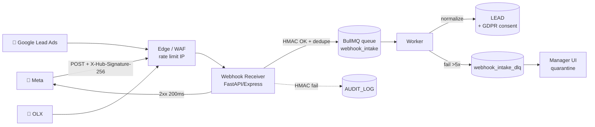

# TECH SPEC — REVYX Webhook Intake
<!-- TECH_SPEC_REVYX_webhook-intake_v1.0.0.md · v1.0.0 · 2026-05 -->
<!-- CONFIDENȚIAL · Uz Intern · © 2026 REVYX · ITPRO SYSTEM SRL -->

## Changelog

| Versiune | Data | Autor | Note |
|---|---|---|---|
| 1.0.0 | 2026-05 | Senior PM + Solution Architect | Spec inițială webhook intake · HMAC · DLQ · idempotency · Phase 0 |

---

## Cuprins

1. [Executive Summary](#1-executive-summary)
2. [Architecture Overview](#2-architecture-overview)
3. [Stack & Dependencies](#3-stack--dependencies)
4. [Data Model](#4-data-model)
5. [API Contracts](#5-api-contracts)
6. [Signature Verification](#6-signature-verification)
7. [State Machine](#7-state-machine)
8. [Concurrency & Idempotency](#8-concurrency--idempotency)
9. [Caching](#9-caching)
10. [Background Jobs & DLQ](#10-background-jobs--dlq)
11. [Error Handling](#11-error-handling)
12. [Security](#12-security)
13. [Observability](#13-observability)
14. [Performance Budgets](#14-performance-budgets)
15. [Testing Strategy](#15-testing-strategy)
16. [Deployment](#16-deployment)
17. [Migration Strategy](#17-migration-strategy)
18. [Risks & Mitigations](#18-risks--mitigations)
19. [Impact Assessment](#19-impact-assessment)

---

## 1. Executive Summary

Webhook Intake este punctul de intrare pentru lead-uri inbound de la **Meta (Facebook/Instagram), Google Lead Ads și OLX**. Cerință critică din Phase 0 (CLAUDE.md §6) și din BRD §5 Pilon 01 + §6.1 (HMAC-SHA256 obligatoriu).

| Atribut | Valoare |
|---|---|
| **Scope** | Recepție · validare HMAC · idempotency · DLQ · normalizare → LEAD |
| **Referință BRD** | §5 Pilon 01 · §6.1 BR-06 (GDPR) · §6.2 NFR-01/05 |
| **Phase** | 0 (BLOCANT) |
| **Surse v1.0** | Meta (Facebook + Instagram Lead Ads) · Google Lead Ads · OLX |

**Garanții oferite:**

1. Signature HMAC-SHA256 verificată **înainte** de orice procesare logică.
2. Idempotency garantată: re-livrare aceluiași event nu produce duplicate.
3. Replay protection prin fereastră timestamp `±5 min` + nonce per event.
4. Dead Letter Queue cu retry exponential 5×, apoi quarantine + alert manager.
5. AUDIT_LOG event la fiecare receive (`WEBHOOK_RECEIVED` sau `WEBHOOK_HMAC_FAILED`).

---

## 2. Architecture Overview



### 2.1 Path-uri

| Path | Latență țintă | Visibility |
|---|---|---|
| Receiver → 2xx | < 200 ms p95 | Public (WAN) |
| Worker → LEAD | < 30 sec p95 (NFR-01 derivat) | Intern |
| DLQ → quarantine UI | manager review | Intern |

---

## 3. Stack & Dependencies

| Layer | Tehnologie | Justificare |
|---|---|---|
| Runtime | Node.js 20 LTS + TypeScript 5.x strict | Stack standard |
| HTTP | Fastify | Performance high · raw body access nativ pentru HMAC |
| Queue | BullMQ + Redis | Idempotency keys · backoff exponential nativ |
| DB | PostgreSQL (entitate `WEBHOOK_EVENT`) | Persistență audit + dedupe |
| Validation | Zod (per source schema) | Type-safe contracts |
| WAF / edge | Cloudflare sau AWS WAF | Rate limiting IP, geo, bot detection |

---

## 4. Data Model

### 4.1 `webhook_event` (persistență idempotency + replay)

```sql
-- Migrare: 0020_webhook_event.sql
CREATE TYPE webhook_source AS ENUM ('META','GOOGLE','OLX');
CREATE TYPE webhook_status AS ENUM ('RECEIVED','PROCESSING','PROCESSED','FAILED','QUARANTINED');

CREATE TABLE IF NOT EXISTS webhook_event (
  webhook_event_id   UUID PRIMARY KEY DEFAULT gen_random_uuid(),
  tenant_id          UUID            NOT NULL,
  source             webhook_source  NOT NULL,
  external_event_id  TEXT            NOT NULL,    -- Meta `id`, Google `lead_id`, OLX `event_id`
  idempotency_key    TEXT            NOT NULL,    -- SHA256(source || external_event_id || tenant_id)
  signature_ok       BOOLEAN         NOT NULL,
  signature_header   TEXT            NOT NULL,
  payload            JSONB           NOT NULL,
  payload_hash       TEXT            NOT NULL,    -- SHA256 canonical(payload)
  received_at        TIMESTAMPTZ     NOT NULL DEFAULT NOW(),
  source_timestamp   TIMESTAMPTZ     NULL,
  ip_address         INET            NULL,
  user_agent         TEXT            NULL,
  status             webhook_status  NOT NULL DEFAULT 'RECEIVED',
  attempts           SMALLINT        NOT NULL DEFAULT 0,
  last_error         TEXT            NULL,
  processed_at       TIMESTAMPTZ     NULL,
  lead_id            UUID            NULL,        -- FK soft → LEAD după normalizare
  CONSTRAINT uq_webhook_idem UNIQUE (tenant_id, idempotency_key)
);

CREATE INDEX IF NOT EXISTS idx_webhook_status_received
  ON webhook_event (status, received_at DESC);

CREATE INDEX IF NOT EXISTS idx_webhook_source_external
  ON webhook_event (source, external_event_id);
```

### 4.2 `webhook_secret` (rotire chei HMAC)

```sql
CREATE TABLE IF NOT EXISTS webhook_secret (
  webhook_secret_id  UUID PRIMARY KEY DEFAULT gen_random_uuid(),
  tenant_id          UUID            NOT NULL,
  source             webhook_source  NOT NULL,
  secret_kid         TEXT            NOT NULL,    -- key id pentru rotație
  secret_value       BYTEA           NOT NULL,    -- encrypted at rest (KMS)
  active_from        TIMESTAMPTZ     NOT NULL,
  active_to          TIMESTAMPTZ     NULL,        -- NULL = currently active
  created_at         TIMESTAMPTZ     NOT NULL DEFAULT NOW(),
  CONSTRAINT uq_secret_kid UNIQUE (tenant_id, source, secret_kid)
);
```

Suport rotație fără downtime: la rotație, ambele chei active simultan timp de 24h.

---

## 5. API Contracts

### 5.1 Endpoint receiver

| Source | Method | Path | Headers obligatorii |
|---|---|---|---|
| Meta | POST | `/api/v1/webhooks/meta/{tenant_id}` | `X-Hub-Signature-256: sha256=<hex>` |
| Meta verify | GET | `/api/v1/webhooks/meta/{tenant_id}` | `hub.mode`, `hub.verify_token`, `hub.challenge` |
| Google | POST | `/api/v1/webhooks/google/{tenant_id}` | `Authorization: Bearer <google_signed_jwt>` |
| OLX | POST | `/api/v1/webhooks/olx/{tenant_id}` | `X-OLX-Signature: <hex>`, `X-OLX-Timestamp: <unix>` |

### 5.2 Răspunsuri standard

| Status | Caz |
|---|---|
| `200 OK` | Acceptat (signature OK + persistență `webhook_event` + enqueue) |
| `200 OK` (no-op) | Idempotent — duplicate detectat |
| `401 Unauthorized` | Signature invalidă |
| `408 Request Timeout` | Timestamp în afara ferestrei `±5 min` |
| `413 Payload Too Large` | Body > 256 KB |
| `429 Too Many Requests` | Rate limit per IP (60/min) sau per source (300/min/tenant) |
| `500` | Eroare internă — clientul **trebuie** să retry |

**Timeout SLA receiver: < 200 ms** — toate sursele externe încep retry la timeout.

### 5.3 Body normalizat intern (output worker)

```typescript
type NormalizedLead = {
  tenantId: string;
  source: 'META' | 'GOOGLE' | 'OLX';
  externalEventId: string;
  contact: {
    fullName?: string;
    phone?: string;
    email?: string;
    consentVersion: string;
    consentChannel: 'meta_lead_ads' | 'google_lead_form' | 'olx_form';
    consentAt: string; // ISO
  };
  intent?: {
    propertyType?: string;
    budgetEur?: number;
    timeline?: string;
    locationHint?: string;
  };
  raw: Record<string, unknown>;  // payload original pentru audit
};
```

---

## 6. Signature Verification

### 6.1 Meta (HMAC-SHA256)

```typescript
function verifyMeta(rawBody: Buffer, header: string, secret: Buffer): boolean {
  const expected = 'sha256=' + crypto
    .createHmac('sha256', secret)
    .update(rawBody)
    .digest('hex');
  return crypto.timingSafeEqual(Buffer.from(expected), Buffer.from(header));
}
```

- Body: **raw bytes** (NU `JSON.parse`-uit). Fastify `rawBody: true` necesar.
- Comparison: `crypto.timingSafeEqual` obligatoriu (anti timing attack).
- Verify token (handshake GET) configurabil per tenant, ≥ 32 random bytes.

### 6.2 Google Lead Ads

- Suport ambele moduri: HMAC-SHA256 cu shared secret SAU JWT semnat de Google (RS256, public key în JWKS Google).
- Verificare `aud` = endpoint REVYX, `iss` = `https://accounts.google.com`.

### 6.3 OLX

- HMAC-SHA256 pe `timestamp + "." + body`.
- Header `X-OLX-Timestamp` validat în fereastră `±300 sec` față de NOW (UTC).
- Reject `408` dacă în afara ferestrei.

### 6.4 Replay protection

| Mecanism | Detaliu |
|---|---|
| Timestamp window | `|now - source_timestamp| ≤ 300 sec` |
| Idempotency key | `SHA256(source || external_event_id || tenant_id)` — dedupe BD |
| Nonce | `external_event_id` per source (Meta `id`, Google `lead_id`, OLX `event_id`) |

---

## 7. State Machine

```
RECEIVED  ──enqueue──▶  PROCESSING  ──ok──▶  PROCESSED
                              │
                              └──fail──▶  FAILED  ──retry<5──▶  PROCESSING
                                                  │
                                                  └──retry=5──▶  QUARANTINED
```

| Tranziție | Trigger | AUDIT_LOG event |
|---|---|---|
| → RECEIVED | INSERT după HMAC OK | `WEBHOOK_RECEIVED` |
| → PROCESSING | Worker pickup | (debug only) |
| → PROCESSED | LEAD creat sau dedup match | `LEAD_CREATED` (la nivel LEAD) |
| → FAILED | Exception worker | `WEBHOOK_FAILED` (cu `attempt`) |
| → QUARANTINED | attempts ≥ 5 | `WEBHOOK_QUARANTINED` + alert manager |
| (rejected) | HMAC fail | `WEBHOOK_HMAC_FAILED` (NU se persistă în queue) |

---

## 8. Concurrency & Idempotency

### 8.1 Idempotency

- INSERT `webhook_event` cu `ON CONFLICT (tenant_id, idempotency_key) DO NOTHING RETURNING webhook_event_id`.
- Dacă `RETURNING` gol → duplicate; receiver returnează `200 OK` fără enqueue.

### 8.2 Concurrency worker

- BullMQ concurrency: 10 worker × 5 jobs = max 50 inflight per instanță.
- Lock per `idempotency_key` la nivel BullMQ — un singur worker procesează un event la un moment dat.
- Optimistic lock pe LEAD update via `version` field (când dedupe extinde lead existent).

---

## 9. Caching

- **Cache HMAC secret per `(tenant_id, source)`** — Redis TTL 5 min · invalidat la rotire.
- **Cache verify_token Meta** — Redis TTL 1h.
- **Bloom filter `external_event_id`** opțional pentru pre-dedupe rapid (Phase 2).

---

## 10. Background Jobs & DLQ

### 10.1 Worker

```
Queue: webhook_intake
Concurrency: 10
Backoff: exponential (1s, 2s, 4s, 8s, 16s)
Max attempts: 5
On failure: → webhook_intake_dlq
Removed on success: keep 24h pentru debug
Removed on fail: keep 30 zile
```

### 10.2 DLQ processing

- DLQ scrie status `QUARANTINED` în `webhook_event`.
- UI Manager (`/admin/quarantine`) afișează lista cu acțiuni: `Retry`, `Discard`, `Mark as fraud`.
- AUDIT_LOG event pentru fiecare acțiune manager.

### 10.3 Cleanup

```
Job: webhook_event_purge
Cron: 0 5 * * 0   (duminică 05:00)
Acțiune: DELETE webhook_event status=PROCESSED older than 90 zile
        (raw payload șters · referința păstrată în AUDIT_LOG)
```

---

## 11. Error Handling

| Cod intern | Cauză | Răspuns extern |
|---|---|---|
| `WHK_HMAC_INVALID` | Signature incorectă | `401` |
| `WHK_TIMESTAMP_OUT_OF_WINDOW` | Replay protection | `408` |
| `WHK_PAYLOAD_TOO_LARGE` | Body > 256 KB | `413` |
| `WHK_RATE_LIMIT` | 60/min/IP sau 300/min/tenant | `429 + Retry-After` |
| `WHK_DUPLICATE` | Idempotency hit | `200 OK` (no-op) |
| `WHK_PERSIST_FAILED` | DB error | `500` (retry source) |
| `WHK_NORMALIZE_FAILED` | Schema invalidă | enqueue → DLQ direct, `200 OK` |

**Principiu**: returnăm `200` cât mai des posibil pentru a evita retry storms; problemele de business merg prin DLQ + alert.

---

## 12. Security

### 12.1 Reguli inflexibile

- HMAC verificat **înainte** de `JSON.parse` pe payload.
- Constant-time compare (`timingSafeEqual`).
- Niciun secret în log-uri (regex deny-list aplicat pe structured logger).
- Secrete HMAC stocate criptate la rest (KMS / Vault).
- Rate limit per IP (60/min) + per source/tenant (300/min) la WAF.
- Geo-blocking opțional la WAF (configurabil per tenant).

### 12.2 GDPR

- Consent capturat la primul receive — `consent_version` + `consent_channel` în normalizat.
- Payload raw păstrat 90 zile maxim · apoi șters.
- Lead-ul rezultat moștenește toate câmpurile GDPR (BRD §8 LEAD extinsă).

### 12.3 AUDIT_LOG events

- `WEBHOOK_RECEIVED` (signature OK)
- `WEBHOOK_HMAC_FAILED` (cu IP + source — pattern detection)
- `WEBHOOK_QUARANTINED` (alert manager)
- `WEBHOOK_RETRY` (debug)
- `WEBHOOK_SECRET_ROTATED` (admin action)

---

## 13. Observability

| Metric | Tip | Alert |
|---|---|---|
| `webhook_received_total{source}` | counter | drop >50% vs. 24h baseline → alert |
| `webhook_hmac_failed_total{source,ip}` | counter | >10 / 5min same IP → block + page |
| `webhook_receiver_duration_ms` | histogram | p95 > 200 ms |
| `webhook_queue_depth` | gauge | >1.000 → alert |
| `webhook_dlq_depth` | gauge | >0 → manager dashboard badge |
| `webhook_worker_latency_ms` | histogram | p95 > 30 sec |

Logs structured cu `tenant_id`, `source`, `external_event_id`, `idempotency_key`, `attempt`. Trace OpenTelemetry pe spans `webhook.receive`, `webhook.verify`, `webhook.persist`, `webhook.normalize`.

Dashboard: `REVYX / Webhook Intake`.

---

## 14. Performance Budgets

| Metric | Target |
|---|---|
| Receiver latency p95 | < 200 ms |
| Receiver latency p99 | < 500 ms |
| Worker → LEAD created p95 | < 30 sec (NFR-01 derivat) |
| Throughput receiver | ≥ 500 req/sec/instanță |
| HMAC verify time | < 1 ms |
| DB INSERT webhook_event | < 10 ms |
| DLQ rate (target steady-state) | < 0.1% din received |

---

## 15. Testing Strategy

### 15.1 Unit
- HMAC verify Meta/Google/OLX — vector de test din docs oficiale + cazuri edge (body gol, header lipsă, header invalid)
- Idempotency dedupe — 100 INSERT identici → 1 rând
- Timestamp window — boundary `±300s ±1ms`
- Normalizer per source — schema Zod completă

### 15.2 Integration
- End-to-end POST → enqueue → worker → LEAD creat
- Duplicate POST → `200` no-op + zero LEAD nou
- HMAC fail → `401` + AUDIT_LOG `WEBHOOK_HMAC_FAILED`
- DLQ flow: 5 fail-uri consecutive → QUARANTINED + UI vizibil

### 15.3 Load
- 1.000 RPS sustained 10 min — receiver p95 < 200 ms
- Burst 5.000 RPS pentru 30 sec — fără pierderi (queue absoarbe)

### 15.4 Security
- Replay attack (event valid trimis 2× la interval >5 min) → `408`
- Spam HMAC fail de la IP X → block automat WAF după threshold
- Body size > 256 KB → `413` fără parse

### 15.5 Coverage target

| Layer | Coverage |
|---|---|
| HMAC verify | 100% |
| Idempotency logic | ≥ 95% |
| Normalizer per source | ≥ 90% |
| Worker pipeline | ≥ 85% |

---

## 16. Deployment

| Aspect | Detaliu |
|---|---|
| Feature flag | `flag.webhook_intake.{source}.enabled` per source · default ON pentru Meta/Google, gradual OLX |
| Environments | dev (mock receiver) · staging (sandbox Meta) · prod |
| Secrets | KMS-managed · rotație manuală 90 zile · auto-detect kid în payload |
| Rollout | Per source: canary 10% → 50% → 100% pe parcursul a 7 zile |

---

## 17. Migration Strategy

```
0020_webhook_event.sql        -- Tabel + indexuri
0021_webhook_secret.sql       -- Tabel chei rotative (encrypted column)
0022_webhook_grants.sql       -- Privilegii rol BD
```

Idempotente. Rollback: DROP cu safety guard (`DROP TABLE IF EXISTS webhook_event` doar dacă <100 rânduri).

---

## 18. Risks & Mitigations

| # | Risc | Probab. | Impact | Mitigare |
|---|---|---|---|---|
| R1 | Atac flood HMAC fail (DoS) | MED | MED | WAF rate limit per IP + auto-block după 10 fail/5min |
| R2 | Secret HMAC scurs prin GitHub | LOW | CRITIC | Pre-commit hook secret scan + KMS storage + rotire imediată |
| R3 | Receiver lent → Meta marchează endpoint failed | MED | HIGH | Hard timeout 200ms · queue async · health check Meta dashboard |
| R4 | Duplicate events Meta (cunoscut) | HIGH | LOW | Idempotency key + ON CONFLICT DO NOTHING |
| R5 | Schema breaking change Meta | MED | HIGH | Versioning `payload.schema_version` + per-version normalizer |
| R6 | Lead creat fără consent valid | LOW | CRITIC | Schema validation reject + DLQ + alert legal |

---

## 19. Impact Assessment

### 19.1 Scope of Change

| Element | Detaliu |
|---|---|
| Document | TECH_SPEC_REVYX_webhook-intake_v1.0.0.md |
| Tip schimbare | NEW |
| Aria afectată | Phase 0 · Pilon 01 Lead Intelligence · BR-06 GDPR |
| Origine | CLAUDE.md §6 Phase 0 + BRD §5 Pilon 01 |

### 19.2 Impact pe documente conexe

| Document | Tip impact | Acțiune |
|---|---|---|
| BRD_REVYX_v1.1.0.md | None | Cerințele deja prezente |
| TECH_SPEC_REVYX_audit-log_v1.1.1.md | Minor | Add events `WEBHOOK_*` în catalog (deja incluse) |
| WORKFLOW_REVYX_lead-lifecycle (viitor) | Major | Punctul de start = receiver webhook |
| TECH_SPEC_REVYX_lead-scoring (viitor) | Minor | Consumă `NormalizedLead` ca input |

### 19.3 Impact pe scoring

| Scor | Afectat? | Detaliu |
|---|---|---|
| LS | DA — indirect | Worker setează `LS_initial = 0.30` la creare LEAD |
| TS | DA — indirect | `TS_initial = 0.50` la creare |
| Restul | NU | — |

### 19.4 Impact pe entități / schema BD

| Entitate | Modificare | Migrare |
|---|---|---|
| WEBHOOK_EVENT | NEW | 0020 |
| WEBHOOK_SECRET | NEW | 0021 |
| LEAD | NONE (consumă, nu modifică) | — |

### 19.5 Impact pe RBAC

| Rol | Permisiuni adăugate |
|---|---|
| manager | READ quarantine queue + RETRY/DISCARD |
| admin | + ROTATE webhook_secret · CONFIG verify_token Meta |

### 19.6 Impact pe SLA & NFR

| NFR | Înainte | După | Validare |
|---|---|---|---|
| NFR-05 (rate limit public) | 20 req/min | 60 req/min/IP webhook + 300 req/min/source/tenant | Test 15.3 |
| NFR-01 derivat | LS update ≤ 30s | Worker → LEAD ≤ 30s p95 | Test 15.2 |

### 19.7 Impact pe Securitate & GDPR

| Aspect | Status | Notă |
|---|---|---|
| PII | DA | `phone`, `email`, `full_name` din lead |
| AUDIT_LOG events noi | DA | `WEBHOOK_*` (vezi §7) |
| Consent flow | DA | Capturat per source la receive |
| HMAC | DA | SHA256 pe toate sursele |
| Rate limiting | DA | 60/min IP · 300/min source/tenant |

### 19.8 Risks & Mitigations
Vezi §18.

### 19.9 Test Plan
Vezi §15.

### 19.10 Rollout & Rollback

| Aspect | Detaliu |
|---|---|
| Feature flag | `flag.webhook_intake.{source}.enabled` |
| Rollout | Canary 10% → 50% → 100% pe 7 zile per source |
| Rollback | Flag OFF · receiver returnează `503 Service Unavailable` (sursele retry) |

### 19.11 Approval Gate

| Aprobator | Necesar pentru |
|---|---|
| Solution Architect | Schema · queue · worker model |
| Security Lead | HMAC · KMS · rate limits · DLQ access |
| Senior PM | Source priority · DLQ UI flow |
| Legal | Consent capture per source aliniat cu Privacy Policy |

---

*docs/tech-spec/TECH_SPEC_REVYX_webhook-intake_v1.0.0.md · v1.0.0 · 2026-05 · CONFIDENȚIAL · Uz Intern*
*REVYX — Real Estate Execution Intelligence · © 2026 REVYX · ITPRO SYSTEM SRL*
