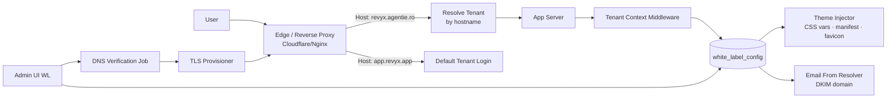

# TECH SPEC — WHITE-LABEL (Custom Branding · Subdomain Routing · Enterprise Addon)
<!-- TECH_SPEC_REVYX_white-label_v1.0.0.md · v1.0.0 · 2026-05 -->
<!-- CONFIDENȚIAL · Uz Intern · © 2026 REVYX · ITPRO SYSTEM SRL -->

## Changelog

| Versiune | Data | Autor | Note |
|---|---|---|---|
| 1.0.0 | 2026-05 | Senior PM + Solution Architect | ★ Spec inițială S8 — REVYX white-label pentru agenții imobiliare · branding custom (logo, culori, domeniu custom revyx.agentie.ro) · email from custom domain · subdomain routing middleware · Enterprise plan + WL addon (Stripe) |

---

## Cuprins

1. [Executive Summary](#1-executive-summary)
2. [Architecture Overview](#2-architecture-overview)
3. [Stack & Dependencies](#3-stack--dependencies)
4. [Data Model](#4-data-model)
5. [API Contracts](#5-api-contracts)
6. [Algorithms (Subdomain Routing · Theme Injection · Email From)](#6-algorithms)
7. [State Machines](#7-state-machines)
8. [Concurrency](#8-concurrency)
9. [Caching](#9-caching)
10. [Background Jobs](#10-background-jobs)
11. [Error Handling](#11-error-handling)
12. [Security](#12-security)
13. [Observability](#13-observability)
14. [Performance Budgets](#14-performance-budgets)
15. [Testing Strategy](#15-testing-strategy)
16. [Deployment & Rollout](#16-deployment--rollout)
17. [Migration Strategy](#17-migration-strategy)
18. [Risks & Mitigations](#18-risks--mitigations)
19. [Impact Assessment](#19-impact-assessment)

---

## 1. Executive Summary

★ **White-Label** permite agențiilor Enterprise să utilizeze REVYX sub propriul brand: subdomeniu dedicat (`revyx.agentie.ro`), logo, paletă culori, font (limitat la safe-list), email transactional `from: agentie.ro`. Nu este un fork — codebase rămâne unic, branding aplicat **runtime** prin tenant context detectat la edge.

| Atribut | Valoare |
|---|---|
| **Scope** | `white_label_config` JSONB pe tenant · subdomain routing middleware (CNAME `agentie.ro` → REVYX edge) · theme injection (CSS vars + manifest) · email DKIM/SPF custom domain · Stripe Enterprise plan + WL addon |
| **Referință BRD** | §4 Tenant · §9 Securitate (multi-tenancy) · §10 Branding |
| **Phase** | 5 (Maturitate platformă) |
| **Owner tehnic** | Solution Architect + Frontend Lead + DevOps Lead |
| **Dependențe upstream** | Tenancy v1 (`tenancy-roles-extension`) · Auth0/Supabase Auth · Billing/Metering S7 · Email service (Postmark/SES) |
| **Dependențe downstream** | Toate UI surfaces (web, viitor mobile RN) · Email templates · Showcase Links |

**Garanții:**

1. **Domeniu custom funcțional** prin CNAME → certificat TLS auto-provisionat (Let's Encrypt cu DNS challenge sau ACM); HTTP→HTTPS redirect obligatoriu.
2. **Brand isolation:** un tenant NU poate vedea/include resursele altui tenant; `white_label_config` strict scoped la `tenant_id`.
3. **Theme safe-list:** culori, font (Google Fonts whitelist), logo (size + content-type validate). NU CSS arbitrar.
4. **Email custom domain:** DKIM/SPF/DMARC verificate înainte de activare; fallback la `noreply@revyx.app` dacă verificarea expiră.
5. **Routing latency overhead** ≤ 5ms p95 la edge.
6. **Backwards compat:** tenants fără WL primesc default brand REVYX — niciun consumator existent afectat.

---

## 2. Architecture Overview



### 2.1 Flow

1. User vizitează `https://revyx.agentie.ro/`.
2. Edge proxy primește request, citește `Host` header, query la `tenant_domain` table → găsește `tenant_id`.
3. Edge atașează `X-REVYX-Tenant-Id` (signed) și forward la app.
4. App middleware citește header (validează semnătură), încarcă `white_label_config` din cache → injectează theme în SSR HTML.
5. Auth flows folosesc același tenant context; login UI brandat.
6. Email-uri transactional emit `from: noreply@agentie.ro` (DKIM signed cu cheia agenției).

### 2.2 Componente

| Componentă | Responsabilitate |
|---|---|
| `tenant_domain` table | Mapping `hostname → tenant_id` |
| `white_label_config` JSONB | Logo, paletă, font, manifest |
| Edge Worker (Cloudflare) sau Nginx | Resolve hostname → tenant; inject signed header |
| `WLContextMiddleware` | Validează header, încarcă config |
| `ThemeInjector` (SSR) | CSS variables în `<head>` |
| `EmailFromResolver` | Selectează DKIM domain |
| `WLAdminController` | Self-service config + DNS verify |
| `DnsVerifier` job | Verifică CNAME, DKIM, SPF, DMARC |
| `TlsProvisioner` | Let's Encrypt DNS-01 sau ACM |

---

## 3. Stack & Dependencies

| Layer | Tehnologie | Versiune | Justificare |
|---|---|---|---|
| Edge | Cloudflare Workers sau Nginx + lua | latest | Routing rapid pe hostname |
| TLS | acme.sh / cert-manager / ACM | latest | DNS-01 pentru wildcards & custom domains |
| Email | Postmark / SES | latest | Multi-domain DKIM |
| App | Node.js + TypeScript SSR (Next.js) | 20 LTS | Theme runtime injection |
| DB | PostgreSQL | 16.x | Cu RLS pentru WL config |
| Cache | Redis | 7.x | Hostname → tenant + WL config |
| DNS check | `dns/resolve` Node native + dig fallback | — | Verificare CNAME/TXT |
| Audit | `auditLogger` v1.0.0 | — | `WL_*` events |

---

## 4. Data Model

### 4.1 Tabel `tenant_domain`

```sql
-- Migrare: 0520_tenant_domain.sql
CREATE TABLE IF NOT EXISTS tenant_domain (
  domain_id             UUID         PRIMARY KEY DEFAULT gen_random_uuid(),
  tenant_id             UUID         NOT NULL,
  hostname              TEXT         NOT NULL UNIQUE,         -- 'revyx.agentie.ro'
  is_primary            BOOLEAN      NOT NULL DEFAULT FALSE,  -- max 1 primary per tenant
  status                TEXT         NOT NULL CHECK (status IN ('PENDING_DNS','PENDING_TLS','VERIFIED','SUSPENDED','REVOKED')),
  cname_target_expected TEXT         NOT NULL,                -- 'edge.revyx.app'
  cname_observed        TEXT         NULL,
  dns_last_check_at     TIMESTAMPTZ  NULL,
  dns_check_failures    INTEGER      NOT NULL DEFAULT 0,
  tls_cert_id           TEXT         NULL,                    -- ID @ cert provider
  tls_cert_expires_at   TIMESTAMPTZ  NULL,
  tls_renewed_at        TIMESTAMPTZ  NULL,
  verified_at           TIMESTAMPTZ  NULL,
  created_at            TIMESTAMPTZ  NOT NULL DEFAULT NOW(),
  updated_at            TIMESTAMPTZ  NOT NULL DEFAULT NOW()
);
CREATE UNIQUE INDEX IF NOT EXISTS idx_td_primary
  ON tenant_domain (tenant_id) WHERE is_primary = TRUE;
CREATE INDEX IF NOT EXISTS idx_td_status ON tenant_domain (status);
CREATE INDEX IF NOT EXISTS idx_td_tls_renew ON tenant_domain (tls_cert_expires_at) WHERE status='VERIFIED';
```

### 4.2 ALTER `tenant` (sau extension table) — `white_label_config`

```sql
-- Migrare: 0521_white_label_config.sql
ALTER TABLE tenant
  ADD COLUMN IF NOT EXISTS white_label_enabled BOOLEAN NOT NULL DEFAULT FALSE,
  ADD COLUMN IF NOT EXISTS white_label_config  JSONB   NOT NULL DEFAULT '{}'::jsonb,
  ADD COLUMN IF NOT EXISTS plan_tier           TEXT    NOT NULL DEFAULT 'STANDARD'
    CHECK (plan_tier IN ('STANDARD','PRO','ENTERPRISE'));

CREATE INDEX IF NOT EXISTS idx_tenant_wl_enabled ON tenant (tenant_id) WHERE white_label_enabled = TRUE;
```

#### Schema JSON `white_label_config` (validat la write)

```json
{
  "version": 1,
  "logo": {
    "url": "https://cdn.revyx.app/wl/{tenant}/logo.png",
    "width_px": 240,
    "height_px": 64
  },
  "favicon": { "url": "https://..." },
  "colors": {
    "primary":   "#0F4C81",
    "secondary": "#F2A900",
    "background":"#FFFFFF",
    "text":      "#111827"
  },
  "font": { "family": "Inter", "weights": [400, 500, 700] },
  "email": {
    "from_domain": "agentie.ro",
    "from_name":   "Agenția Imobiliară X",
    "reply_to":    "contact@agentie.ro",
    "dkim_status": "VERIFIED"
  },
  "manifest": {
    "name":       "Agenția X — REVYX",
    "short_name": "AgenȚX",
    "theme_color":"#0F4C81"
  },
  "footer": {
    "company_name": "Agenția X SRL",
    "company_legal":"CUI 12345 · Adresa..."
  }
}
```

**Validare (server-side schema):**

- Culori — `^#[0-9A-Fa-f]{6}$` strict; minim contrast WCAG AA (text vs background) ≥ 4.5.
- Font — whitelist Google Fonts (Inter, Roboto, Lato, Manrope, Montserrat, Poppins, Open Sans, Source Sans 3).
- Logo URL — must be `cdn.revyx.app/wl/{tenant_id}/...` (upload via signed URL); content-type ∈ {image/png, image/svg+xml, image/webp}; ≤ 200 KB.
- Email `from_domain` — must match unul din `tenant_email_domain` cu `dkim_status='VERIFIED'`.

### 4.3 Tabel `tenant_email_domain`

```sql
-- Migrare: 0522_tenant_email_domain.sql
CREATE TABLE IF NOT EXISTS tenant_email_domain (
  domain_id             UUID         PRIMARY KEY DEFAULT gen_random_uuid(),
  tenant_id             UUID         NOT NULL,
  domain                TEXT         NOT NULL,             -- 'agentie.ro'
  dkim_selector         TEXT         NOT NULL,             -- 'rvx20260501'
  dkim_public_key       TEXT         NOT NULL,
  dkim_private_key_kms_id TEXT       NOT NULL,             -- KMS reference, NU cleartext
  dkim_status           TEXT         NOT NULL CHECK (dkim_status IN ('PENDING_DNS','VERIFIED','FAILED','REVOKED')),
  spf_status            TEXT         NOT NULL CHECK (spf_status IN ('PENDING','OK','FAILED','MISSING')),
  dmarc_status          TEXT         NOT NULL CHECK (dmarc_status IN ('PENDING','OK','FAILED','MISSING')),
  last_check_at         TIMESTAMPTZ  NULL,
  verified_at           TIMESTAMPTZ  NULL,
  created_at            TIMESTAMPTZ  NOT NULL DEFAULT NOW(),
  UNIQUE (tenant_id, domain)
);
```

### 4.4 Tabel `tenant_wl_audit` (snapshot config changes)

```sql
-- Migrare: 0523_tenant_wl_audit.sql
CREATE TABLE IF NOT EXISTS tenant_wl_audit (
  audit_id              UUID         PRIMARY KEY DEFAULT gen_random_uuid(),
  tenant_id             UUID         NOT NULL,
  changed_by            UUID         NOT NULL,
  diff                  JSONB        NOT NULL,             -- { before, after }
  changed_at            TIMESTAMPTZ  NOT NULL DEFAULT NOW()
);
```

(Suplimentar față de AUDIT_LOG global — ușurează export pentru tenant.)

---

## 5. API Contracts

| Method | Path | RBAC | Descriere |
|---|---|---|---|
| `GET` | `/api/v1/admin/wl/config` | tenant admin (Enterprise) | Citește configul curent |
| `PUT` | `/api/v1/admin/wl/config` | tenant admin | Update config (validat) |
| `POST` | `/api/v1/admin/wl/logo/signed-upload` | tenant admin | Returnează URL S3 PUT temporar |
| `POST` | `/api/v1/admin/wl/domains` | tenant admin | Body `{hostname}` — initiate domain claim |
| `POST` | `/api/v1/admin/wl/domains/:id/verify` | tenant admin | Forțează verify DNS |
| `DELETE` | `/api/v1/admin/wl/domains/:id` | tenant admin | Revoke (TLS revoke + remove) |
| `POST` | `/api/v1/admin/wl/email-domains` | tenant admin | Add email domain |
| `GET` | `/api/v1/admin/wl/email-domains/:id/dns-records` | tenant admin | DKIM/SPF/DMARC records expected |
| `POST` | `/api/v1/admin/wl/email-domains/:id/verify` | tenant admin | Force DNS verify |
| `GET` | `/api/v1/public/brand` | unauth (gated by hostname) | Public brand JSON pentru SSR |

`GET /public/brand` returnează doar câmpuri sigure (logo URL, colors, manifest, font) — fără email/dkim.

### 5.1 Internal contracts

```typescript
interface IWlConfigService {
  get(tenantId: string): Promise<WlConfig>;
  update(tenantId: string, patch: Partial<WlConfig>, actorId: string): Promise<WlConfig>;
  resolveByHost(hostname: string): Promise<{ tenantId: string; config: WlConfig } | null>;
}

interface IDomainOps {
  claim(tenantId: string, hostname: string): Promise<TenantDomain>;
  verifyDns(domainId: string): Promise<{ ok: boolean; reason?: string }>;
  provisionTls(domainId: string): Promise<{ certId: string; expiresAt: Date }>;
  renewTls(domainId: string): Promise<void>;
  revoke(domainId: string): Promise<void>;
}

interface IEmailDomainOps {
  add(tenantId: string, domain: string): Promise<TenantEmailDomain>;
  verify(domainId: string): Promise<{ dkim: boolean; spf: boolean; dmarc: boolean }>;
  revoke(domainId: string): Promise<void>;
}
```

---

## 6. Algorithms

### 6.1 Subdomain routing middleware

**Edge layer** (Cloudflare Worker example logic):

```typescript
export default {
  async fetch(req: Request, env: Env): Promise<Response> {
    const host = req.headers.get('host')!.toLowerCase();
    let tenantId: string | null = null;

    if (host.endsWith('.revyx.app')) {
      // app.revyx.app → default; <slug>.revyx.app → tenant by slug
      const slug = host.replace('.revyx.app','');
      tenantId = slug === 'app' ? null : await env.TENANT_KV.get(`slug:${slug}`);
    } else {
      // Custom domain
      tenantId = await env.TENANT_KV.get(`host:${host}`);
    }

    if (host !== 'app.revyx.app' && tenantId === null) {
      return new Response('Domeniu neînregistrat. Verifică DNS sau contactează agenția.', { status: 404 });
    }

    const headers = new Headers(req.headers);
    if (tenantId) {
      const sig = await sign(`${tenantId}:${Date.now()}`, env.EDGE_SIGNING_KEY);
      headers.set('X-REVYX-Tenant-Id', tenantId);
      headers.set('X-REVYX-Tenant-Sig', sig);
    }
    return fetch(env.ORIGIN, { ...req, headers });
  }
};
```

**App middleware:**

```typescript
async function wlContextMiddleware(req, res, next) {
  const tenantId = req.headers['x-revyx-tenant-id'] as string | undefined;
  const sig      = req.headers['x-revyx-tenant-sig'] as string | undefined;
  if (tenantId) {
    if (!verifySig(`${tenantId}:`, sig, EDGE_SIGNING_KEY, /* skew=120s */)) {
      return res.status(400).json({ error: 'INVALID_TENANT_HEADER' });
    }
    req.tenant = await wlConfig.get(tenantId);
  } else {
    req.tenant = DEFAULT_TENANT_CTX;
  }
  next();
}
```

### 6.2 Theme injection (SSR)

```typescript
function buildThemeStyle(cfg: WlConfig): string {
  const c = cfg.colors ?? DEFAULTS.colors;
  return `<style id="wl-theme">:root{
    --rvx-primary:${c.primary};
    --rvx-secondary:${c.secondary};
    --rvx-bg:${c.background};
    --rvx-text:${c.text};
  }</style>`;
}
function buildFontLink(cfg: WlConfig): string {
  if (!cfg.font) return '';
  const w = cfg.font.weights.join(';');
  return `<link rel="preconnect" href="https://fonts.gstatic.com" crossorigin>
          <link rel="stylesheet" href="https://fonts.googleapis.com/css2?family=${encodeURIComponent(cfg.font.family)}:wght@${w}&display=swap">`;
}
```

CSP header se actualizează per tenant pentru a permite logo-ul la `cdn.revyx.app/wl/{tenant_id}/*` și fontul Google. **Nu** se permit script-uri sau iframe-uri custom — securitate strictă.

### 6.3 DNS verification

```typescript
async function verifyDns(domainId: string): Promise<{ok: boolean; reason?: string}> {
  const d = await db.selectFrom('tenant_domain').where('domain_id','=',domainId).executeTakeFirstOrThrow();
  const cnames = await dns.promises.resolveCname(d.hostname).catch(() => []);
  const observed = cnames[0]?.toLowerCase();

  await db.updateTable('tenant_domain').set({
    cname_observed: observed ?? null,
    dns_last_check_at: new Date(),
    dns_check_failures: observed === d.cname_target_expected.toLowerCase() ? 0 : sql`dns_check_failures + 1`,
  }).where('domain_id','=',domainId).execute();

  if (observed !== d.cname_target_expected.toLowerCase()) {
    return { ok: false, reason: `CNAME mismatch: expected ${d.cname_target_expected}, got ${observed ?? 'NXDOMAIN'}` };
  }

  if (d.status === 'PENDING_DNS') {
    await markPendingTls(domainId);
    await tlsProvisioner.requestCert(domainId);
  }
  return { ok: true };
}
```

### 6.4 DKIM/SPF/DMARC

**DKIM:**
- Generare cheie 2048-bit RSA, privat stocat în KMS (`dkim_private_key_kms_id`).
- Selector: `rvxYYYYMMDD` rotabil anual.
- TXT record expected: `<selector>._domainkey.<domain>` cu valoarea publică.

**SPF:**
- TXT root must include `include:revyx.app` sau `include:_spf.revyx.app`.

**DMARC:**
- Recomandat `v=DMARC1; p=none; rua=mailto:dmarc@revyx.app` la onboarding; policy upgrade la `quarantine` după 30 zile observare.

```typescript
async function verifyEmailDns(domainId: string) {
  const d = await loadEmailDomain(domainId);
  const dkimTxt   = await dns.promises.resolveTxt(`${d.dkim_selector}._domainkey.${d.domain}`).catch(() => []);
  const spfTxt    = await dns.promises.resolveTxt(d.domain).catch(() => []);
  const dmarcTxt  = await dns.promises.resolveTxt(`_dmarc.${d.domain}`).catch(() => []);

  const dkimOk  = dkimTxt.flat().some(r => r.includes(d.dkim_public_key.replace(/\s+/g,'').slice(0, 64)));
  const spfOk   = spfTxt.flat().some(r => r.startsWith('v=spf1') && (r.includes('include:revyx.app') || r.includes('include:_spf.revyx.app')));
  const dmarcOk = dmarcTxt.flat().some(r => r.startsWith('v=DMARC1'));

  await db.updateTable('tenant_email_domain').set({
    dkim_status: dkimOk ? 'VERIFIED' : 'FAILED',
    spf_status:  spfOk  ? 'OK' : 'MISSING',
    dmarc_status: dmarcOk ? 'OK' : 'MISSING',
    last_check_at: new Date(),
    verified_at: dkimOk && spfOk ? new Date() : null,
  }).where('domain_id','=',domainId).execute();
}
```

### 6.5 Email From resolver (send time)

```typescript
function resolveFrom(tenantId: string, defaultFrom: string): EmailFrom {
  const cfg = wlCache.get(tenantId);
  if (!cfg?.email || cfg.email.dkim_status !== 'VERIFIED') return DEFAULT_FROM;
  return {
    from: `${cfg.email.from_name} <noreply@${cfg.email.from_domain}>`,
    replyTo: cfg.email.reply_to ?? `contact@${cfg.email.from_domain}`,
    dkimDomain: cfg.email.from_domain,
  };
}
```

Email service (Postmark/SES) configurat cu **multi-domain DKIM signing**; la send, headerul `Message-Stream` selectează stream-ul tenant.

### 6.6 TLS provisioning & renewal

- DNS-01 challenge prin Cloudflare API sau Route53.
- Job `wl.tls.renew.daily` re-verifică certificate cu `expires_at < NOW + 21d`.
- Failure cumulative ≥ 3 → email tenant admin + alert.

### 6.7 Logo upload (signed URL)

```typescript
async function signedUploadUrl(tenantId: string, contentType: string) {
  if (!ALLOWED_LOGO_MIME.includes(contentType)) throw E('INVALID_MIME');
  const key = `wl/${tenantId}/logo-${Date.now()}.${extOf(contentType)}`;
  return s3.getSignedUrl('putObject', {
    Bucket: 'revyx-cdn', Key: key, Expires: 300,
    ContentType: contentType, ContentLengthRange: [1, 200_000],
    ACL: 'public-read',
  });
}
```

Post-upload: client face `PUT /admin/wl/config` cu URL nou. Backend verifică `HEAD` la URL că content-type/size match înainte de a accepta.

---

## 7. State Machines

### 7.1 tenant_domain

```
PENDING_DNS ──verifyDns(ok)──> PENDING_TLS ──provisionTls(ok)──> VERIFIED
PENDING_TLS ──provisionTls(fail x3)──> SUSPENDED
VERIFIED   ──renewal fail / cert expired──> SUSPENDED
SUSPENDED  ──manual fix + re-verify──> PENDING_DNS
*          ──admin revoke──> REVOKED
```

### 7.2 tenant_email_domain

```
PENDING_DNS (DKIM) ──verifyDns dkim+spf──> VERIFIED
VERIFIED ──drift (DNS removed)──> FAILED ──fix──> VERIFIED
* ──admin revoke──> REVOKED
```

---

## 8. Concurrency

- Updates pe `white_label_config` cu optimistic locking pe `tenant.version` (existing).
- TLS renewal idempotent: cron locked global cu `pg_advisory_xact_lock(hashtext('wl_tls_renew'))`.
- Edge KV (Cloudflare) eventually consistent ≤ 30s; după UPDATE config se invalidează `host:*` și `slug:*` keys explicit.

---

## 9. Caching

| Key Redis / Edge KV | Conținut | TTL | Invalidare |
|---|---|---|---|
| KV `host:{hostname}` | tenant_id | 1h | event `tenant_domain.changed` |
| KV `slug:{slug}` | tenant_id | 1h | event `tenant_slug.changed` |
| Redis `wl:cfg:{tenantId}` | white_label_config | 5 min | event `wl.config.updated` |
| Redis `wl:email:{tenantId}:{domain}` | DKIM status | 5 min | event `email_domain.verified` |
| CDN logo | static | immutable (URL versioned) | new upload = new URL |

---

## 10. Background Jobs

| Job | Trigger | Idempotent |
|---|---|---|
| `wl.dns.verify` | event `domain.claimed` + cron 15 min for PENDING | DA |
| `wl.tls.renew.daily` | cron `0 3 * * *` | DA |
| `wl.email.verify` | event + cron orar | DA |
| `wl.cdn.purge` | event `wl.config.updated` | DA |
| `wl.config.audit.diff` | trigger pe UPDATE config | DA |

---

## 11. Error Handling

| Cod | Caz | Răspuns |
|---|---|---|
| `WL_DOMAIN_TAKEN` | hostname duplicat | 409 |
| `WL_DOMAIN_DNS_MISMATCH` | CNAME nu match | 422 + reason |
| `WL_TLS_PROVISION_FAILED` | LE rate limit / DNS | 503 + retry |
| `WL_INVALID_COLOR_CONTRAST` | WCAG AA fail | 422 |
| `WL_LOGO_TOO_LARGE` | >200KB | 413 |
| `WL_FONT_NOT_ALLOWED` | font în afara whitelist | 422 |
| `WL_EMAIL_DKIM_NOT_VERIFIED` | publish config cu email unverified | 422 |
| `WL_PLAN_TIER_INSUFFICIENT` | plan < ENTERPRISE | 403 |
| `WL_HEADER_SIG_INVALID` | edge header missing/invalid | 400 |

---

## 12. Security

### 12.1 RBAC

| Rol | Permisiuni |
|---|---|
| `tenant_admin` (Enterprise) | full CRUD WL config + domains |
| `manager`/sub | read-only |
| `admin` (REVYX platform) | suspend WL · revoke domain · audit |

### 12.2 Audit events

`WL_CONFIG_UPDATED`, `WL_DOMAIN_CLAIMED`, `WL_DOMAIN_VERIFIED`, `WL_DOMAIN_REVOKED`, `WL_DOMAIN_SUSPENDED`, `WL_TLS_PROVISIONED`, `WL_TLS_RENEWED`, `WL_TLS_FAILED`, `WL_EMAIL_DOMAIN_VERIFIED`, `WL_EMAIL_DOMAIN_REVOKED`, `WL_LOGO_UPLOADED`, `WL_PLAN_TIER_CHANGED`.

### 12.3 Anti-hijack

- Domeniu claim → necesită verificare DNS TXT one-shot (`_revyx-verify.<domain>` cu token random) **înainte** de orice cert provisioning. Previne agentul A să claim-uiască domeniul agenției B.
- Token TXT generat random 32-byte hex; valid 7 zile; un tenant nu poate revendica același hostname mai mult de 1× per 24h.
- Suspend automat dacă CNAME drift detectat post-verified pentru >24h.

### 12.4 CSP & resource isolation

- CSP per tenant: `img-src 'self' cdn.revyx.app/wl/{tenantId}/* https://api.dicebear.com`; `script-src 'self'`; **NICIODATĂ `unsafe-inline`** sau script-uri tenant-uploaded.
- Logo SVG sanitizat la upload (nu permite `<script>` sau `on*` handlers); lib `dompurify` server-side.

### 12.5 Email security

- DKIM cheie privată 2048-bit RSA în KMS; rotație anuală (selector versionat).
- Quota anti-abuse: max 10k emails/zi tenant fără upgrade quota; spike detection.
- Bounce rate >5% sau spam complaint >0.1% → suspend automat trimiteri tenant + alert.

### 12.6 Rate limiting

| Endpoint | Limit |
|---|---|
| `POST /admin/wl/domains` | 3/zi/tenant |
| `POST /admin/wl/domains/:id/verify` | 6/oră/domain |
| `PUT /admin/wl/config` | 30/zi/tenant |
| `POST /admin/wl/logo/signed-upload` | 20/zi/tenant |

---

## 13. Observability

| Metric | Tip | Alert |
|---|---|---|
| `wl_domains_active_total` | gauge | drop wow >10% |
| `wl_dns_verify_failures{tenant}` | counter | >3 → notify tenant |
| `wl_tls_expires_in_days{domain}` | gauge | <14d → renew job |
| `wl_routing_overhead_ms_p95` | histogram | >5ms |
| `wl_email_dkim_failures{tenant}` | counter | spike → suspend send |
| `wl_logo_payload_bytes_p95` | histogram | abuse detection |
| `wl_cdn_purge_lag_s` | histogram | p95 >60s |

Dashboard: `REVYX / White-Label Health`.

---

## 14. Performance Budgets

| Metric | Target |
|---|---|
| Edge resolve hostname → tenant | p95 < 5ms |
| App middleware load WL config (cache hit) | p95 < 3ms |
| App middleware load WL config (cache miss) | p95 < 30ms |
| SSR theme injection overhead | p95 < 2ms |
| Email send with DKIM custom | p95 < 250ms |
| `PUT /admin/wl/config` | p95 < 200ms |

---

## 15. Testing Strategy

### 15.1 Unit
- JSON schema validator (colors regex, font whitelist, contrast WCAG).
- DNS verifier with mocked resolver (success / NXDOMAIN / wrong CNAME).
- Logo SVG sanitizer (script injection rejection).
- Edge sig verify (skew, replay).

### 15.2 Integration
- Claim domain → DNS verify pass → TLS provision (mock LE) → status VERIFIED.
- Update config → cache invalidate → next request returns new theme.
- Email send with verified domain → DKIM signed; with unverified → fallback.

### 15.3 E2E
- Full onboarding tenant Enterprise: claim `revyx.agentie.ro` → set CNAME → verify → upload logo → set colors → publish → user vizitează URL → vede brand corect → primește email `from: agentie.ro`.
- Cross-tenant isolation: tenant A nu poate seta `hostname` deja revendicat de tenant B (token TXT proves ownership).
- WCAG contrast violation rejected.

### 15.4 Load
- 10k requests/sec edge cu 1k WL tenants — overhead p95 <5ms.
- 100 simultaneous DNS verifies — no resolver hammering (rate limited 1/15s/domain).

### 15.5 Chaos
- LE rate limit hit → backoff exponential + alert.
- DKIM key KMS unavailable → fallback `noreply@revyx.app` + alert.

### 15.6 Coverage

| Layer | Coverage |
|---|---|
| Schema validator | ≥99% |
| DNS / TLS jobs | ≥95% |
| Theme injector | ≥95% |
| Email resolver | ≥99% |
| API handlers | ≥90% |

---

## 16. Deployment & Rollout

| Aspect | Detaliu |
|---|---|
| Feature flag | `flag.white_label.enabled` per tenant |
| Plan gating | `plan_tier='ENTERPRISE'` + WL addon Stripe |
| Rollout | Pilot 2 tenanți (LOI signed) 4 săpt → 10 tenanți → GA |
| Onboarding SLA | <72h de la subscription la VERIFIED domain (cu DNS owner cooperation) |
| Rollback | Flag OFF → request servit cu default brand (config persistat, dar nu aplicat) |

---

## 17. Migration Strategy

```
0520_tenant_domain.sql
0521_white_label_config.sql
0522_tenant_email_domain.sql
0523_tenant_wl_audit.sql
```

Idempotente. Default `white_label_enabled=FALSE` → niciun tenant existent afectat.

Backfill: zero. Feature opt-in per tenant.

---

## 18. Risks & Mitigations

| # | Risc | Probab. | Impact | Mitigare |
|---|---|---|---|---|
| R1 | Domain hijacking (claim altui tenant) | LOW | CRITICAL | TXT verification token + audit + 24h cooldown |
| R2 | TLS provisioning rate limit (LE) | MED | HIGH | DNS-01 cu wildcard `*.revyx.app` separat; per-tenant cert in batch |
| R3 | DKIM key compromise | LOW | HIGH | KMS + rotation anuală + audit `WL_EMAIL_DOMAIN_VERIFIED` |
| R4 | XSS via logo SVG | MED | HIGH | Sanitizer + CSP strict + content-type guard |
| R5 | Color contrast bad UX (accessibility) | MED | MED | WCAG AA validate la write · default fallback |
| R6 | Edge KV stale (>5 min lag) | LOW | LOW | Explicit purge la update + TTL scurt |
| R7 | Tenant suspend impact UX (404 brusc) | LOW | MED | Grace 7 zile cu banner avertisment înainte de suspend |
| R8 | Custom domain abuse pentru spam | LOW | HIGH | Bounce/complaint rate auto-suspend |
| R9 | DNS provider downtime → verify fail | MED | LOW | Retry 4× exponential + manual override admin |
| R10 | Plan downgrade Enterprise → Pro cu WL activ | LOW | MED | Grace 30 zile cu notificare; după → revert default brand, păstrează config soft |

---

## 19. Impact Assessment

### 19.1 Scope of Change

| Element | Detaliu |
|---|---|
| Document | TECH_SPEC_REVYX_white-label_v1.0.0.md |
| Tip | NEW (S8 deliverable #3) |
| Aria | Multi-tenancy branding · routing · email DKIM · plan tier · DPIA |
| Origine | S8 brief — REVYX white-label Enterprise |

### 19.2 Impact pe documente conexe

| Document | Impact | Acțiune |
|---|---|---|
| `tenancy-roles-extension` v1.0.0 | Minor | Tenant: extra columns `white_label_*`, `plan_tier` |
| `audit-log` v1.0.0 | Minor | Catalog event extins `WL_*` |
| `webhook-intake` v1.0.0 | None | — |
| Showcase Links | Minor | URL-urile pot fi servite sub `revyx.agentie.ro/share/...` (config) |
| BRD | Minor | §10 Branding extins ★ — WL ca feature Enterprise |

### 19.3 Impact pe scoring

Niciunul. WL e pur prezentational + email + routing.

### 19.4 Impact pe entități / schema BD

| Entitate | Modificare | Migrare |
|---|---|---|
| `tenant` | ALTER (3 columns) | 0521 |
| `tenant_domain` | NEW | 0520 |
| `tenant_email_domain` | NEW | 0522 |
| `tenant_wl_audit` | NEW | 0523 |

### 19.5 Impact pe RBAC

| Rol | Permisiuni adăugate |
|---|---|
| `tenant_admin` (Enterprise) | CRUD WL config + domains + email-domains |
| `admin` (platform) | suspend / revoke |

### 19.6 Impact pe SLA & NFR

| NFR | Detaliu |
|---|---|
| Routing overhead | ≤ 5ms p95 |
| Onboarding SLA | <72h domain verify (with DNS cooperation) |
| TLS renewal | min 21 zile înainte de expirare |

### 19.7 Securitate & GDPR

| Aspect | Status | Notă |
|---|---|---|
| PII | NU | doar configurație tenant |
| AUDIT | DA | §12.2 |
| DKIM rotation | DA | anual |
| CSP / sanitization | DA | §12.4 |

### 19.8 Test Plan

Vezi §15. Securitate prioritate: domain hijack + XSS via SVG.

### 19.9 Rollout & Rollback

Pilot 2 tenanți → 10 → GA. Rollback flag OFF.

### 19.10 Approval Gate

| Aprobator | Necesar pentru |
|---|---|
| Senior PM | Plan tier · onboarding SLA |
| Solution Architect | Schema · routing · TLS strategy |
| Frontend Lead | Theme injection · CSP · accessibility |
| Security Lead | Domain hijack guard · CSP · DKIM |
| DevOps Lead | TLS renewal · DNS automation |
| Billing Lead | Stripe Enterprise + WL addon |

---

*docs/tech-spec/TECH_SPEC_REVYX_white-label_v1.0.0.md · v1.0.0 · 2026-05 · CONFIDENȚIAL · Uz Intern*
*REVYX — Real Estate Execution Intelligence · © 2026 REVYX · ITPRO SYSTEM SRL*
