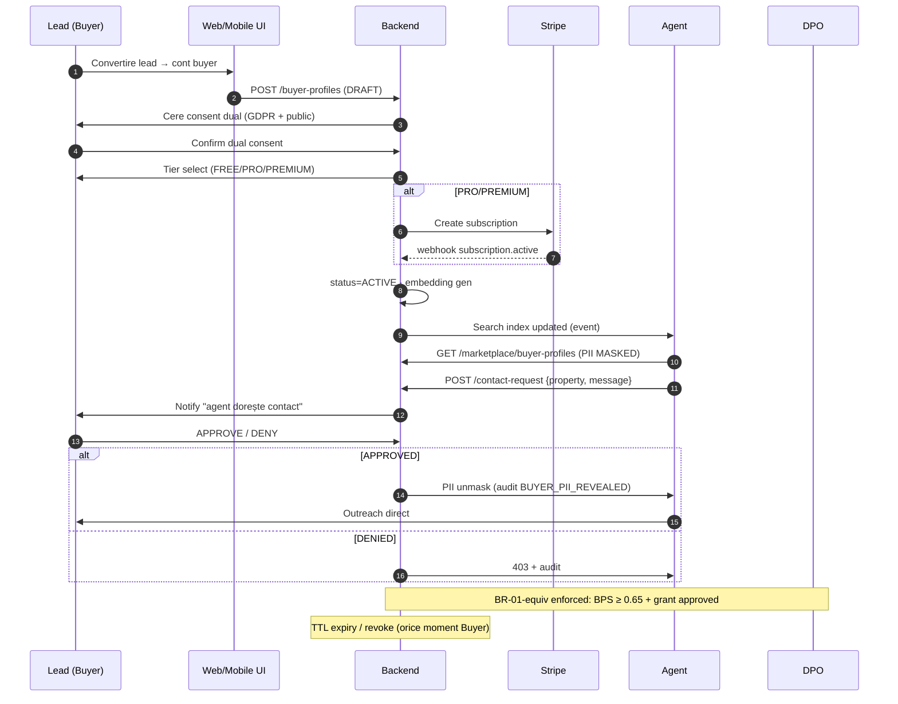

# WORKFLOW — BUYER PROFILE LIFECYCLE
<!-- WORKFLOW_REVYX_buyer-profile-lifecycle_v1.1.0.md · v1.1.0 · 2026-06 -->
<!-- CONFIDENȚIAL · Uz Intern · © 2026 REVYX · ITPRO SYSTEM SRL -->

## Changelog

| Versiune | Data | Autor | Note |
|---|---|---|---|
| 1.0.0 | 2026-05 | Senior PM + Solution Architect + DPO | ★ Workflow inițial S9 — buyer profile end-to-end · lead conversion → consent dual → tier select → publish → search → contact request → unmask → deal kickoff · swimlanes + decision points · referință `marketplace-two-sided` v1.0.1 |
| ★ **1.1.0** | **2026-06** | Solution Architect + Senior BA + Senior PM | ★ MINOR — Integrare *Buyer Needs Assessment Worksheet* (ABR®, EN/RU) + calificare PPP (Прямой Потенциальный Покупатель) din metodologia de teren. NEW §4.1.1 (Buyer Needs Assessment) cu entitatea `buyer_assessments` (BRD §8.5.1) + completeness gate BR-31 + scripturi calificare PPP la primul apel (2 variante). Aliniat BRD v1.4.0 §18.9 + §17.1 + ethic Art. 16 (`prior_agent_agreement`). Zero modificare steps existente 4.2-4.9. |

---

## 1. Scope

End-to-end lifecycle pentru **BUYER_PROFILE** (entitate publică, marketplace bidirectional). Acoperă creație, publicare cu plată, vizibilitate, contact request, expirare, revoke. Aliniat cu `TECH_SPEC_REVYX_marketplace-two-sided_v1.0.1`.

**Actori (swimlanes):** Buyer · Agent · Stripe · REVYX backend · DPO/Compliance.

---

## 2. Diagrama master



---

## 3. State machine BUYER_PROFILE

```
DRAFT ──publish FREE──────────────────────────> ACTIVE
DRAFT ──publish PRO/PREMIUM──> PENDING_PAYMENT
PENDING_PAYMENT ──Stripe success─> ACTIVE
PENDING_PAYMENT ──Stripe fail/timeout─> DRAFT
ACTIVE ──pause (buyer)─> PAUSED ──resume─> ACTIVE
ACTIVE ──expires_at < NOW──> EXPIRED
ACTIVE ──revoke / GDPR Art.17─> REVOKED (soft 30d)
PAUSED ──expires_at < NOW──> EXPIRED
EXPIRED ──republish─> ACTIVE (new cycle)
```

---

## 4. Steps detail

### 4.1 Lead → Buyer Profile Draft

| Pas | Actor | Acțiune | Validare | Audit |
|---|---|---|---|---|
| 1 | Buyer | Login (lead JWT) | RBAC role=buyer | `AUTH_LOGIN` |
| 2 | Buyer | UI form: city, type, budget, urgency, features | Schema validation client-side | — |
| 3 | Backend | `POST /buyer-profiles` | Max 2 active per lead (anti-spam) | `BUYER_PROFILE_CREATED` |
| 4 | Backend | status=DRAFT, alias=`BUY-XXXX` | `idx_bp_lead` UNIQUE check | — |

### ★ 4.1.1 Buyer Needs Assessment (worksheet structurat)

> **Sursă:** *Buyer Needs Assessment Worksheet* (ABR® Designation Course, EN + RU) + metodologie calificare PPP. Entitate `buyer_assessments` (BRD §8.5.1), one-to-one cu buyer/tenant lead. Worksheet-ul completează preferințele libere cu dimensiunile decisive pentru un match de calitate.

**Câmpuri worksheet (din documentul de teren):**

| Grup | Câmpuri |
|---|---|
| Financiar | `current_tenure` (own/rent) · `must_sell_to_purchase` · `mortgage_status` (none/prequalified/preapproved) · `lender` · `ideal_price_eur` · `ideal_monthly_payment_eur` |
| Posesie | `desired_possession_date` |
| Familie | `family_size` · `pets` |
| Criterii | `deal_breakers[]` (necompromisabile) · `compromise_areas[]` (flexibilitate) |
| Istoric | `search_history` (de cât timp caută · ce a oprit cumpărarea) · `prior_agent_agreement` (ce a semnat cu alt agent) |

**Reguli:**
- `assessment_completeness` (GENERATED ∈ [0,1]) — BR-31: dacă `< 0.50` AND `LS ≥ 0.60` → NBA task `complete_buyer_assessment` (priority MEDIUM) înainte de `schedule_showing`.
- Câmpurile alimentează: Match Engine (`must_sell`, `possession_date`, `deal_breakers` = filtre hard; `compromise_areas` = soft) · FRS (BRD §18.7) · Ethics `exclusive_listing_solicitation` (`prior_agent_agreement` → Art. 16).
- Cross-ref §17.1 (buget RM declarat/confirmat) + §17.3 (pre-aprobare bancară) + §17.4 (preferințele se rafinează post-vizionare).

**Calificare PPP la primul apel (script seed `execution_guides`, `first_contact` buyer):**
- Varianta A — cumpărător are agent: referral către partener (MLS) + programare ДОД/showing.
- Varianta B — cumpărător direct (nereprezentat): calificare nevoi (buget, zonă, termen, decision-maker) + propunere vizionare; întrebări „la ce mergi / de la ce pleci?".

### 4.2 Consent dual

**Critical:** GDPR Art. 6(1)(a) — consent specific pentru profil PUBLIC, separat de consent base.

| Consent | Stocat în | Revocabil |
|---|---|---|
| GDPR base (Art. 6(1)(a)) | `lead.consent_*` | DA, oricând (Art. 7) |
| Public profile (`consent_public`) | `buyer_profile.consent_public` | DA → cascade pause |

Lipsa consent_public → publish refuzat cu `BP_CONSENT_MISSING` (422).

### 4.3 Tier select & payment

| Tier | TTL | Caracteristici | Stripe product |
|---|---|---|---|
| FREE | 30 zile | search visibility · 1 push alert/zi | — (no charge) |
| PRO | 90 zile | + push instant + 5 contact requests/lună | `revyx_buyer_profile_pro` |
| PREMIUM | 180 zile | + featured top results + dedicated agent matching | `revyx_buyer_profile_premium` |

Stripe webhook `customer.subscription.created` → `subscription.active` → backend marchează `status=ACTIVE`. Timeout 24h fără webhook → status revine `DRAFT` cu notify.

### 4.4 Embedding + indexing

| Pas | Trigger | Output |
|---|---|---|
| 1 | status→ACTIVE | event `buyer_profile.published` |
| 2 | Worker `bp.embedding.refresh` | INSERT `buyer_profile_embedding` (pgvector 384d) |
| 3 | Worker `bp.inverse.recompute.buyer` | TOP-20 properties cached |
| 4 | NBA producer (cron 30min) | task `OUTREACH_BUYER_MATCH` pentru agenții care match |

### 4.5 Agent search & contact request

```
Agent → GET /marketplace/buyer-profiles?city=...&type=...
       Response: list cu PII MASKED (alias BUY-XXXX, criterii structurate)
Agent → POST /contact-request {buyer_profile_id, property_id, message}
       Rate limit: 5/zi/agent, 200/zi/tenant
       Cooldown: 24h dacă 3× DENIED consecutive
```

### 4.6 Buyer decision

Buyer primește notificare (email + push mobile dacă instalat).

| Decision | Result | Audit |
|---|---|---|
| APPROVE | grant.status=APPROVED · TTL 30 zile · PII unmasked pentru acest agent · property_id_context | `BUYER_CONTACT_GRANT_APPROVED` |
| DENY | grant.status=DENIED · counter pentru cooldown agent | `BUYER_CONTACT_GRANT_DENIED` |
| (no action 7d) | grant.status=EXPIRED · counter neutral | `BUYER_CONTACT_GRANT_EXPIRED` |

### 4.7 PII unmask (post-APPROVED)

`GET /buyer-profiles/:id` returnează contact (lead.name, phone, email) **doar dacă** există grant APPROVED valid pentru `(buyer_profile_id, requesting_agent_id)`.

Fiecare unmask = audit `BUYER_PII_REVEALED` cu (agent_id, grant_id, timestamp). DSAR include lista completă unmask events.

### 4.8 Deal kickoff (downstream)

Când agent + buyer parcurg pași spre tranzacție: lead-ul existent (`buyer_profile.lead_id`) primește `LS=0.85` boost manual de la agent → match-engine intră în flow standard. Buyer profile rămâne ACTIVE până la deal.WON sau revoke.

### 4.9 Expiry / revoke

- **Auto expiry:** cron orar `bp.expiry.scan` → status=EXPIRED + notify buyer pentru republish.
- **Buyer revoke:** `DELETE /buyer-profiles/:id` → status=REVOKED · embedding + match_scores șterse imediat · `lead.contact_pii` păstrat doar dacă există altă bază legală.
- **Stripe cancellation:** `subscription.canceled` → tier→FREE la următorul cycle (grace 7d cu notice).

---

## 5. Decision points & guards

| # | Punct | Regulă | Sursă |
|---|---|---|---|
| D1 | Publish profile | consent_public=TRUE && (tier=FREE || stripe_active) | `marketplace-two-sided` §6 |
| D2 | Show in search results | status=ACTIVE && consent_public=TRUE && expires_at>NOW | §6.3 |
| D3 | Generate NBA task agent | BPS ≥ 0.65 && agent.active_tasks < 3 | BR-04 + BR-01-equiv |
| D4 | Contact request allowed | agent rate not exceeded && no 24h cooldown | §12.5 |
| D5 | PII unmask | grant.status=APPROVED && grant.expires_at>NOW && grant.requesting_agent_id=current | §6.5 |
| D6 | Erasure cascade | GDPR Art.17 → embedding+match_scores deleted, lead retention per other legal basis | §12.2 |

---

## 6. Privacy & compliance hooks

| Hook | Trigger | Owner |
|---|---|---|
| Consent revocation cascade | `consent_public` → false | Backend auto · audit |
| DSAR export | request user | DPO + automated |
| Erasure (Art. 17) | request user | DPO 30 zile SLA |
| Objection profilare (Art. 21) | request user | Pause + DPO review |
| DPIA reference | annual review | DPO |

---

## 7. KPI workflow

| Metric | Target |
|---|---|
| Time DRAFT → ACTIVE (FREE) | <5 min p95 |
| Time DRAFT → ACTIVE (PRO/PREMIUM) | <10 min p95 (Stripe inclusive) |
| Contact request → buyer decision | median <24h |
| APPROVED rate | >35% (peste = healthy market fit) |
| DENIED → cooldown trigger rate | <5% |
| Profile → deal conversion 90d | >8% (target inițial) |

---

*docs/workflow/WORKFLOW_REVYX_buyer-profile-lifecycle_v1.1.0.md · v1.1.0 · 2026-06 · CONFIDENȚIAL · Uz Intern*
*REVYX — Real Estate Execution Intelligence · © 2026 REVYX · ITPRO SYSTEM SRL*
