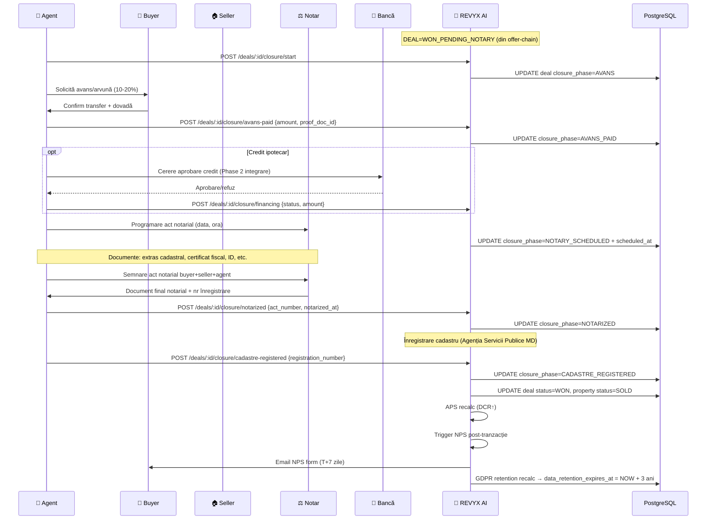

# WORKFLOW — REVYX Deal Closure (Path WON)
<!-- WORKFLOW_REVYX_deal-closure_v1.0.0.md · v1.0.0 · 2026-05 -->
<!-- CONFIDENȚIAL · Uz Intern · © 2026 REVYX · ITPRO SYSTEM SRL -->

## Changelog

| Versiune | Data | Autor | Note |
|---|---|---|---|
| 1.0.0 | 2026-05 | Senior PM + Solution Architect | Workflow inițial — path WON: notarial chain · NPS · APS update · GDPR retention |

---

## Cuprins

1. [Executive Summary](#1-executive-summary)
2. [Actori implicați](#2-actori-implicați)
3. [Pre-conditions](#3-pre-conditions)
4. [Flow Diagram](#4-flow-diagram)
5. [Etape detaliate](#5-etape-detaliate)
6. [Decision Points](#6-decision-points)
7. [Timing & SLA](#7-timing--sla)
8. [Score impacts](#8-score-impacts)
9. [AUDIT_LOG events](#9-audit_log-events)
10. [Notifications](#10-notifications)
11. [Error / Exception paths](#11-error--exception-paths)
12. [Post-conditions](#12-post-conditions)
13. [Acceptance Criteria](#13-acceptance-criteria)
14. [Glosar specific](#14-glosar-specific)
15. [Impact Assessment](#15-impact-assessment)

---

## 1. Executive Summary

Workflow operațional al închiderii unui deal pe **path WON** — de la `OFFER_ACCEPTED → DEAL=WON_PENDING_NOTARY` (preluat din WORKFLOW offer-chain) până la status terminal `WON`. Acoperă lanțul notarial Republica Moldova (avans/arvună → contract preliminar opțional → act notarial → înregistrare cadastru), capturare NPS post-tranzacție, update APS pentru agent (DCR), aplicare GDPR retention pe entitățile lead/deal.

| Atribut | Valoare |
|---|---|
| **Scope** | Notarial chain MD · NPS · APS DCR update · property SOLD · GDPR retention enforce · arhivare deal |
| **Referință BRD** | §5 Pilon 06 · §7.7 APS (DCR) · §9.4 GDPR retention · §6.1 BR-06/07 |
| **Tech spec referite** | offer-chain (handoff WON_PENDING_NOTARY) · property v1.0.0 (SOLD) · audit-log v1.0.0 |
| **Aplicabilitate** | DEAL în status `WON_PENDING_NOTARY` |

---

## 2. Actori implicați

| Actor | Token culoare | Sistem | Responsabilitate |
|---|---|---|---|
| 🤝 **Agent (deal owner)** | `--agt` | REVYX | Coordonare proces · upload documente · trigger NPS |
| 👤 **Buyer** | `--buy` | extern | Plată avans · semnătură contract · NPS feedback |
| 🏠 **Seller** | `--sel` | extern | Documente proprietate · semnătură · transfer posesie |
| ⚖️ **Notar** | `--not` | extern | Validare documente · autentificare act notarial · înregistrare |
| 🏦 **Bancă/Finanțator** | `--bnk` | extern (opțional) | Aprobare credit ipotecar · transfer suma vânzare |
| 🤖 **Sistem REVYX AI** | `--ai` | REVYX | Status tracking · NPS dispatch · APS recalc · GDPR retention |
| 👔 **Manager** | `--mgr` | REVYX | Audit deal closing · review NPS scor mic |

---

## 3. Pre-conditions

- DEAL status = `WON_PENDING_NOTARY` (după `OFFER_ACCEPTED`).
- Property status = `RESERVED` (set de offer accept).
- Agent activ pe deal (`assigned_agent_id IS NOT NULL`).
- Lead GDPR consent activ (BR-06).
- Currency rate snapshot stocat la accept (offer.currency conversion).

---

## 4. Flow Diagram

---

## 5. Etape detaliate

### Etapa 1 — Start closure (transition handoff)

**Trigger:** Agent acțiune „Începe închiderea" SAU automat la `OFFER_ACCEPTED`

**Actor:** 🤝 Agent / 🤖 AI

**Acțiuni:**
- Verificare: DEAL.status = `WON_PENDING_NOTARY`
- INSERT `deal_closure_step` cu `phase='STARTED'` + checklist creat (avans, financing optional, documents, notary, cadastre).
- UPDATE `deal.closure_phase = 'STARTED'`, `closure_started_at = NOW()`.
- Notificare buyer + seller cu pași și documente necesare.
- Generare task `close_deal` în NBA queue cu UF ridicat (`urgency=approaching` sau `critical` dacă scadent).

**AUDIT_LOG event:** `DEAL_CLOSURE_STARTED`

---

### Etapa 2 — Avans / Arvună

**Trigger:** Buyer transfer avans (10-20% standard MD) · Agent confirmă

**Actor:** 👤 Buyer · 🤝 Agent

**Acțiuni:**
- Agent upload dovadă plată (chitanță, ordin de plată) → `documents` table cu `document_type='avans_proof'`.
- POST `/deals/:id/closure/avans-paid { amount, currency, proof_doc_id, paid_at }`.
- UPDATE `deal.closure_phase = 'AVANS_PAID'`, `avans_amount`, `avans_paid_at`.
- INSERT ACTIVITY `(activity_type='document_downloaded', metadata.document_type='avans_proof')`.
- Optional: contract preliminar (antecontract) generat dacă tenant a configurat template.

**AUDIT_LOG event:** `DEAL_AVANS_PAID` cu `amount`, `currency`

**Score impact:** TS↑ FV (financial validation confirmat).

---

### Etapa 3 — Financing (opțional, doar dacă credit ipotecar)

**Trigger:** Agent flag `requires_financing=true` la deal

**Actor:** 🏦 Bancă (extern) · 🤝 Agent

**Acțiuni (Phase 2 integrare bancă):**
- Pentru Phase 1: agent updatează manual status financing.
- POST `/deals/:id/closure/financing { status='approved'|'rejected'|'pending', bank_name, amount, decision_at }`.
- UPDATE `deal.financing_status`.
- DHI re-eval: dacă financing rejected → RF financing 0.4 (vezi DHI Engine §6.2).

**AUDIT_LOG event:** `DEAL_FINANCING_UPDATE` cu `status`, `bank_name`

**Decision points:**
- `rejected` → DEAL revine la `NEGOTIATION` cu `needs_review=true` SAU `LOST` cu `lost_reason='financing_failed'` (alegere agent).
- `approved` → continuă spre notary.
- `pending` → cron reminder T+5 zile.

---

### Etapa 4 — Programare notarial

**Trigger:** Agent acțiune „Programează notar"

**Actor:** 🤝 Agent · ⚖️ Notar (extern)

**Acțiuni:**
- POST `/deals/:id/closure/notary-scheduled { notary_name, notary_office, scheduled_at, notes }`.
- UPDATE `deal.closure_phase = 'NOTARY_SCHEDULED'`, `notary_scheduled_at`.
- Notificare buyer + seller cu loc, oră, listă documente necesare.
- Reminder T-24h pe email buyer + seller.

**AUDIT_LOG event:** `DEAL_NOTARY_SCHEDULED`

> ⏱ **Documente standard MD necesare (informative — agent responsabil):**
> - Buletine identitate buyer + seller (sau pașapoarte)
> - Extras din Registrul Bunurilor Imobile (ASP)
> - Certificat fiscal de la primărie
> - Acte proprietate seller (contract anterior)
> - Acord soți (dacă e cazul, Codul Familiei MD)
> - Acord BNRM transfer dacă cumpărător străin (după caz)

---

### Etapa 5 — Semnare act notarial

**Trigger:** Eveniment fizic la notar · Agent confirmă post-eveniment

**Actor:** ⚖️ Notar · 👤 Buyer · 🏠 Seller · 🤝 Agent

**Acțiuni:**
- POST `/deals/:id/closure/notarized { act_number, notary_id, notarized_at, doc_scan_id }`.
- UPDATE `deal.closure_phase = 'NOTARIZED'`, `notary_act_number`, `notarized_at`.
- Upload scan act notarial (PDF) în `documents` cu `document_type='notary_act'` · acces RBAC restricționat.
- INSERT ACTIVITY.

**AUDIT_LOG event:** `DEAL_NOTARIZED` cu `act_number` (PII partial — full act doc retained securizat)

**Score impact:**

| Scor | Impact | Magnitude |
|---|---|---|
| LS | Final | I=1.0 (intent confirmat 100%) |
| TS | Final | FV=1.0 |

---

### Etapa 6 — Înregistrare cadastru

**Trigger:** Notar înregistrează la ASP (Agenția Servicii Publice — Cadastru MD) · Agent confirmă

**Actor:** ⚖️ Notar (proces extern) · 🤝 Agent

**Acțiuni:**
- POST `/deals/:id/closure/cadastre-registered { registration_number, registered_at }`.
- Tranzacție atomică:
  - UPDATE `deal.closure_phase = 'CADASTRE_REGISTERED'`, `cadastre_registration_number`.
  - UPDATE `deal.status = 'WON'`, `won_at = NOW()`.
  - UPDATE `property.status = 'SOLD'`, `sold_at = NOW()`, `sold_price_eur`.
  - UPDATE `lead.status = 'WON'`.
  - INSERT ACTIVITY pentru fiecare entitate.
- Cancel toate task-urile active pe deal (status → `CANCELLED` cu reason `deal_won`).
- Cancel showings programate viitoare pe property (`status='WITHDRAWN'`).

**AUDIT_LOG events:**
- `DEAL_WON`
- `PROPERTY_SOLD`
- `LEAD_WON`

> ⏱ Tranziție atomică în <1 sec.

---

### Etapa 7 — APS recalc + DCR update

**Trigger:** Event `deal.won` post-Etapa 6

**Actor:** 🤖 AI

**Acțiuni:**
- Increment `agent.deal_count_total` (folosit de BR-11 fallback check).
- Recalc APS pentru agent (Phase 2 — formula completă §7.7 BRD):
  - **CR (Conversion Rate)** = leads_won / leads_total (ultimele 90 zile)
  - **RT (Response Time Score)** = derived din ACTIVITY response_time_seconds (vezi §7.7)
  - **DCR (Deal Close Rate)** = deals_won / deals_negotiation_started ★ incrementat acum
  - **CS (Client Satisfaction)** = NPS score / 10 normalized (input din Etapa 8)
- Pentru Phase 1: aplicăm doar incrementul `deal_count_total`. APS rămâne în BR-11 fallback dacă <5 deals.
- Cache invalidare `agent:{id}:aps`.

**AUDIT_LOG event:** `AGENT_APS_RECALCULATED` cu `dcr_delta`, `new_aps`

---

### Etapa 8 — NPS post-tranzacție

**Trigger:** Cron `nps.dispatch` la T+7 zile post-WON (configurabil)

**Actor:** 🤖 AI · 👤 Buyer

**Acțiuni:**
- Email buyer cu link NPS form (1-10 score + comentariu open):
  - „Cât de probabil este să recomanzi REVYX/agent unui prieten?"
- INSERT `nps_response` la submit cu `score`, `comment`, `submitted_at`.
- Calcul NPS classification:
  - 9-10 = Promoter
  - 7-8 = Passive
  - 0-6 = Detractor
- Score < 7 → notify manager pentru revizuire.

**AUDIT_LOG event:** `NPS_SUBMITTED` cu `score`, `classification`

**Score impact:**

| Scor | Impact | Magnitude |
|---|---|---|
| **APS (CS)** | DA | NPS / 10 ca CS factor (Phase 2 formulă completă) |

---

### Etapa 9 — GDPR retention enforcement

**Trigger:** Eveniment `deal.won` + cron `gdpr.retention.recalc`

**Actor:** 🤖 AI

**Acțiuni:**
- UPDATE `lead.data_retention_expires_at = NOW() + INTERVAL '3 years'` (NFR-10 BRD §6.2).
- INSERT ACTIVITY `(activity_type='status_changed', metadata.gdpr_retention_set=true)`.
- Cron nightly `gdpr.purge` (existent din Phase 0):
  - Verifică `data_retention_expires_at < NOW()` → cascade ștergere/anonimizare:
    - LEAD: PII fields nullified (`full_name`, `phone_e164`, `email` → NULL)
    - DEAL: `notes` → NULL · păstrare numerice (price, dates) pentru analytics
    - ACTIVITY: ștergere bulk
    - PROPERTY: nu se atinge (own data company)
- Buyer notify post-WON cu drepturi GDPR (Art. 15-22): export, ștergere, portabilitate.

**AUDIT_LOG events:**
- `GDPR_RETENTION_SET` cu `expires_at`
- `GDPR_PURGE_EXECUTED` (la cron nightly trigger)

---

### Etapa 10 — Arhivare deal (read-only)

**Trigger:** Cron `deal.archive` la T+90 zile post-WON

**Actor:** 🤖 AI

**Acțiuni:**
- UPDATE `deal.archived_at = NOW()`.
- Move din UI active dashboards · păstrare în „Archive" search.
- Read-only mode (orice WRITE returns 423 LOCKED).

**AUDIT_LOG event:** `DEAL_ARCHIVED`

---

## 6. Decision Points

| # | Întrebare | Ramuri |
|---|---|---|
| D1 | Avans plătit în SLA (configurabil 7 zile)? | DA → continuă; NU → reminder agent · DHI RF↑ timeline_slip |
| D2 | Necesită financing? | DA → Etapa 3; NU → skip |
| D3 | Financing rejected? | → DEAL revine NEGOTIATION (needs_review) sau LOST cu reason='financing_failed' |
| D4 | Notar disponibil în 14 zile? | DA → schedule; NU → escalation manager (deal-uri cu >14 zile fără notary) |
| D5 | Buyer/Seller absent la notar? | Re-program · TS BS↓ pentru partea absentă |
| D6 | Cadastru registration succesful? | DA → WON terminal; NU → status `WON_PENDING_CADASTRE` blocant + alert |
| D7 | NPS score < 7? | Notify manager + APS CS↓ |
| D8 | GDPR consent revocat post-WON? | Date deal păstrate pentru obligații legale (notarial) · PII anonimizat la retention |

---

## 7. Timing & SLA

| Etapă | Timing țintă | SLA | Sursă |
|---|---|---|---|
| Start closure | imediat după accept | — | UX |
| Avans paid | în 7 zile post-accept | configurabil | KPI |
| Financing decision (dacă cazul) | în 30 zile | extern (bancă) | KPI |
| Notary scheduled | în 14 zile | configurabil | KPI |
| Notarized → Cadastre registered | 5-15 zile (procedural MD) | extern (notar/ASP) | KPI |
| APS recalc post-WON | < 30 sec | NFR-01 | E2E |
| NPS dispatch | T+7 zile post-WON | configurable | KPI |
| GDPR retention set | atomic la WON | — | NFR-10 |
| Deal archive | T+90 zile post-WON | — | UX |

---

## 8. Score impacts (consolidat)

| Etapă | Scor | Tip | Magnitude |
|---|---|---|---|
| Avans paid | TS | Boost | FV (financial validation) |
| Financing rejected | DHI | Penalizare | RF=0.4 financing |
| Notarized | LS, TS | Final | I=1.0, FV=1.0 |
| WON | DEAL.dp | Terminal | logical 1.0 (deal câștigat) |
| WON | property.status | SOLD | exit inventory |
| WON | APS | DCR↑ (acumulat) | +1 deal_won |
| NPS submitted | APS | CS factor | NPS/10 normalized |
| NPS <7 | APS | CS↓ | manager review |

---

## 9. AUDIT_LOG events

| Event | Etapă | Severity |
|---|---|---|
| `DEAL_CLOSURE_STARTED` | 1 | INFO |
| `DEAL_AVANS_PAID` | 2 | INFO |
| `DEAL_FINANCING_UPDATE` | 3 | INFO/WARN |
| `DEAL_NOTARY_SCHEDULED` | 4 | INFO |
| `DEAL_NOTARIZED` | 5 | INFO (sensitive — act_number) |
| `DEAL_WON` | 6 | INFO (key) |
| `PROPERTY_SOLD` | 6 | INFO |
| `LEAD_WON` | 6 | INFO |
| `AGENT_APS_RECALCULATED` | 7 | INFO |
| `NPS_SUBMITTED` | 8 | INFO |
| `NPS_LOW_SCORE_FLAGGED` | 8 (edge) | WARN |
| `GDPR_RETENTION_SET` | 9 | INFO |
| `GDPR_PURGE_EXECUTED` | 9 (cron) | INFO |
| `DEAL_ARCHIVED` | 10 | INFO |

---

## 10. Notifications

| Eveniment | Canal | Destinatar | Template |
|---|---|---|---|
| Closure start | Push + email | buyer + seller | intern checklist |
| Avans request | Push | buyer | intern + agent reminder |
| Notary scheduled | Email + ICS | buyer + seller | intern + ICS attachment |
| Notary T-24h | Email + WhatsApp (consent) | buyer + seller | intern reminder |
| Notarized confirm | Push + email | buyer + seller + agent | intern celebrare |
| Cadastre registered | Push + email | buyer + agent | intern „Felicitări — proprietate înregistrată" |
| WON terminal | Push agent | agent | intern „Deal închis — APS actualizat" |
| NPS form T+7 | Email | buyer | intern feedback request |
| NPS low (<7) | Email | manager | intern review |
| GDPR retention info | Email | buyer | intern GDPR rights |

---

## 11. Error / Exception paths

| Eroare | Etapă | Acțiune |
|---|---|---|
| Avans pierde SLA 7 zile | 2 | Reminder agent · DHI timeline_slip flag |
| Financing rejected | 3 | DEAL revine NEGOTIATION needs_review SAU LOST `financing_failed` (alegere agent) |
| Buyer/Seller absent la notar | 5 | Re-program · TS BS↓ partea absentă · alert agent |
| Cadastre rejected (probleme acte) | 6 | DEAL stays WON_PENDING_CADASTRE · alert agent + manager |
| Property dispute post-act | 5/6 | Manager intervenție · audit critic |
| Optimistic conflict pe atomic UPDATE | 6 | Retry 3× backoff |
| NPS form fail send | 8 | Retry 3× · log + manual dispatch |
| GDPR purge cascade fail | 9 | Alert SecOps · manual review |
| Document scan upload fail | 2/5 | Retry · backup local · manual sync |

---

## 12. Post-conditions

| Stare finală | Garanții |
|---|---|
| **WON terminal** | DEAL.status=WON · property.status=SOLD · lead.status=WON · APS DCR↑ · GDPR retention set |
| **NPS submitted** | APS CS factor actualizat (Phase 2) · manager notified dacă <7 |
| **Archived** | T+90 zile · read-only · search disponibil |
| **GDPR purged** | T+3 ani · PII anonimizat · numerice păstrate pentru analytics |
| **WON_PENDING_CADASTRE** (edge) | Blocant până înregistrare · alert manager |

---

## 13. Acceptance Criteria

| AC | Validare |
|---|---|
| **AC-DC-01** | OFFER_ACCEPTED → DEAL=WON_PENDING_NOTARY automat |
| **AC-DC-02** | Cadastre registered atomic: deal=WON + property=SOLD + lead=WON în <1 sec |
| **AC-DC-03** | APS DCR incrementat post-WON cu cache invalidat (vizibil <30s) |
| **AC-DC-04** | NPS form trimis exact T+7 zile post-WON (cron precision ±1h) |
| **AC-DC-05** | NPS score < 7 → email manager în <5 min |
| **AC-DC-06** | GDPR data_retention_expires_at = NOW + 3 ani la WON (NFR-10) |
| **AC-DC-07** | Cron GDPR purge la retention expired → PII anonimizat (lead.full_name=NULL etc.) |
| **AC-DC-08** | Financing rejected → DEAL ofertă pentru a reveni NEGOTIATION sau LOST |
| **AC-DC-09** | Deal archived la T+90 zile · WRITE returns 423 LOCKED |
| **AC-DC-10** | Toate documente sensitive (notary_act) restricționate RBAC |

---

## 14. Glosar specific

| Termen | Sensul |
|---|---|
| **WON_PENDING_NOTARY** | Status DEAL după accept, înainte de notarial |
| **Avans / Arvună** | Plată parțială upfront (10-20% standard MD) |
| **Antecontract** | Contract preliminar opțional (pre-notarial) |
| **Act notarial** | Document autentificat de notar — actul de vânzare-cumpărare |
| **Cadastru** | Registrul Bunurilor Imobile (ASP MD) |
| **NPS** | Net Promoter Score (1-10 · Promoter/Passive/Detractor) |
| **DCR** | Deal Close Rate — sub-componentă APS |
| **GDPR retention** | NFR-10 · NOW + 3 ani de la ultima activitate |
| **Anonimizare** | Înlocuire PII cu NULL/hash · păstrare numerice pentru analytics |

---

## 15. Impact Assessment

### 15.1 Scope of Change

| Element | Detaliu |
|---|---|
| Document | WORKFLOW_REVYX_deal-closure_v1.0.0.md |
| Tip schimbare | NEW |
| Aria afectată | Pilon 06 · entitate DEAL terminal · property terminal · APS · GDPR §9.4 BRD |
| Origine | BRD §5 Pilon 06 · §7.7 APS · §9.4 GDPR · §6.2 NFR-10 |

### 15.2 Impact pe documente conexe

| Document | Tip impact | Acțiune |
|---|---|---|
| BRD_REVYX_v1.1.0.md | None | Reflectă §9.4 GDPR + §7.7 APS |
| WORKFLOW_REVYX_offer-chain_v1.0.0.md | Major handoff | Accept → WON_PENDING_NOTARY preluat |
| WORKFLOW_REVYX_property-onboarding_v1.0.0.md | Minor | Property → SOLD terminal |
| TECH_SPEC_REVYX_dhi-engine_v1.0.0.md | None | DHI nu se aplică post-WON (status terminal exit) |
| TECH_SPEC_REVYX_match-engine_v2.0.0.md | Minor | DEAL terminal → exclude din DP recalc |
| TECH_SPEC_REVYX_audit-log_v1.1.1.md | Minor | Catalog event extins (`DEAL_CLOSURE_*`, `NPS_*`, `GDPR_PURGE_EXECUTED`) |
| TECH_SPEC_REVYX_lead-scoring_v1.0.0.md | None | Lead status WON terminal |

> **Recomandare:** schema completă deal_closure_step + nps_response + documents storage → TECH_SPEC dedicat S5/S6 (`TECH_SPEC_REVYX_deal-closure_v1.0.0.md`). Pentru S4 workflow oferă specificația contractuală operațională.

### 15.3 Impact pe scoring

| Scor | Afectat? | Detaliu |
|---|---|---|
| LS | DA (terminal) | I=1.0 la WON |
| TS | DA | FV=1.0 la avans + notarized |
| IS, PS | NU (terminal) | — |
| DP | NU (terminal exit) | — |
| DHI | NU (terminal exit) | — |
| **APS** | DA | DCR incrementat · CS din NPS (Phase 2 complet) |
| NBA | NU (deal terminal) | — |

### 15.4 Impact pe entități / schema BD

| Entitate | Modificare | Migrare |
|---|---|---|
| DEAL | ALTER (+15 câmpuri closure: closure_phase, avans_*, notary_*, cadastre_*, won_at, archived_at) | recomandare TECH_SPEC dedicat — `0130_deal_closure.sql` |
| DEAL_CLOSURE_STEP | NEW (audit pas cu pas) | 0131_deal_closure_step.sql |
| NPS_RESPONSE | NEW | 0132_nps_response.sql |
| DOCUMENTS | NEW (storage refs) | 0133_documents.sql |
| PROPERTY | None (status SOLD deja în spec property) | — |
| LEAD | None (status WON deja în spec) | — |

### 15.5 Impact pe RBAC

| Rol | Permisiuni |
|---|---|
| agent | Update closure phases pe deal propriu · upload documents |
| senior_agent | + override timeline expectations |
| team_lead | view team closures |
| manager | review closures · audit NPS scor mic · forțare archive |
| admin | config NPS dispatch delay · GDPR retention period |
| **DPO** (opțional rol viitor) | GDPR purge audit · DSR fulfillment |

### 15.6 Impact pe SLA & NFR

| NFR / SLA | Înainte | După | Validare |
|---|---|---|---|
| NFR-10 (GDPR retention 3 ani) | nedefinit | enforced la WON | AC-DC-06 |
| Atomic WON tranziție | nedefinit | < 1 sec | AC-DC-02 |
| NPS dispatch precision | nedefinit | T+7 ±1h | AC-DC-04 |
| Cron archive | nedefinit | T+90 zile | AC-DC-09 |

### 15.7 Impact pe Securitate & GDPR

| Aspect | Status | Notă |
|---|---|---|
| PII | DA | `full_name`, `phone`, `email` în lead · scan acte notariale (sensitive) — RBAC restricționat |
| AUDIT_LOG events noi | DA | Vezi §9 |
| Consent flow | DA | NPS dispatch consent-aware |
| HMAC / JWT / RBAC | DA | RBAC §15.5 + DPO viitor |
| GDPR retention (NFR-10) | DA | Enforced obligatoriu la WON |
| Right to erasure (Art. 17) | DA | Cascadă lead → deal anonim → activity șterse (cu păstrare obligații legale notariale 10 ani conform Codul Civil MD) |
| Document storage encryption | DA | acte notariale stocate criptat at-rest (S3 SSE-KMS sau echivalent) |

### 15.8 Risks & Mitigations

| # | Risc | Probab. | Impact | Mitigare |
|---|---|---|---|---|
| R1 | Cadastre înregistrare blocată (probleme acte) | MED | HIGH | Status WON_PENDING_CADASTRE · alert manager · escalation legal |
| R2 | Avans neplătit în SLA → deal stalled | MED | MED | Reminder agent · DHI timeline_slip · manager review |
| R3 | Financing rejected → deal pierdut tardiv | MED | HIGH | Phase 2 integrare bancă upfront · DHI early warning |
| R4 | NPS score sistematic mic (<7) → APS CS↓ unfair | LOW | MED | Manager review · contestare cu motivare |
| R5 | GDPR purge cascadă fail → date PII reținute peste limită | LOW | CRITIC | Daily cron monitoring · alert DPO · manual fallback |
| R6 | Document scan corupt / pierdut | LOW | HIGH | Backup S3 cross-region · checksum verify |
| R7 | Race condition la multi-step closure (avans + notary concurrent) | LOW | MED | Optimistic locking pe deal · state machine app-level |
| R8 | Conflict GDPR retention vs. obligație legală notarială (10 ani) | MED | HIGH | Distincție: PII anonimizat la 3 ani · numerice/notary_act_number păstrate 10 ani · documentat clar Privacy Policy |

### 15.9 Test Plan

Vezi §13 — toate AC-DC-01..10 acoperite în E2E + integration. Test specific GDPR purge cascade pe lead/deal/activity.

### 15.10 Rollout & Rollback

| Aspect | Detaliu |
|---|---|
| Feature flag | `flag.deal_closure_v1.enabled` (prerequisite `offer_chain_v1.enabled`) |
| Strategie rollout | canary 10% → 50% → 100% în 4 săptămâni (mai conservator — impact financiar+legal) |
| Rollback | Flag OFF · deal-uri WON_PENDING păstrate read-only manual · resume manual |
| Owner | Senior PM + Solution Architect + Legal review |

### 15.11 Approval Gate

| Aprobator | Necesar pentru |
|---|---|
| Senior PM | Workflow alignment cu §5 Pilon 06 + §7.7 APS |
| Solution Architect | Atomicitate WON tranziție · GDPR cascade purge · documents storage |
| Security Lead | RBAC notary docs · AUDIT events · encryption at-rest |
| Legal / DPO | Retention 3 ani PII vs. 10 ani notarial · conflict management · NFR-10 enforcement |
| Compliance | Republica Moldova fiscal/cadastru reglementări |

---

*docs/workflow/WORKFLOW_REVYX_deal-closure_v1.0.0.md · v1.0.0 · 2026-05 · CONFIDENȚIAL · Uz Intern*
*REVYX — Real Estate Execution Intelligence · © 2026 REVYX · ITPRO SYSTEM SRL*
