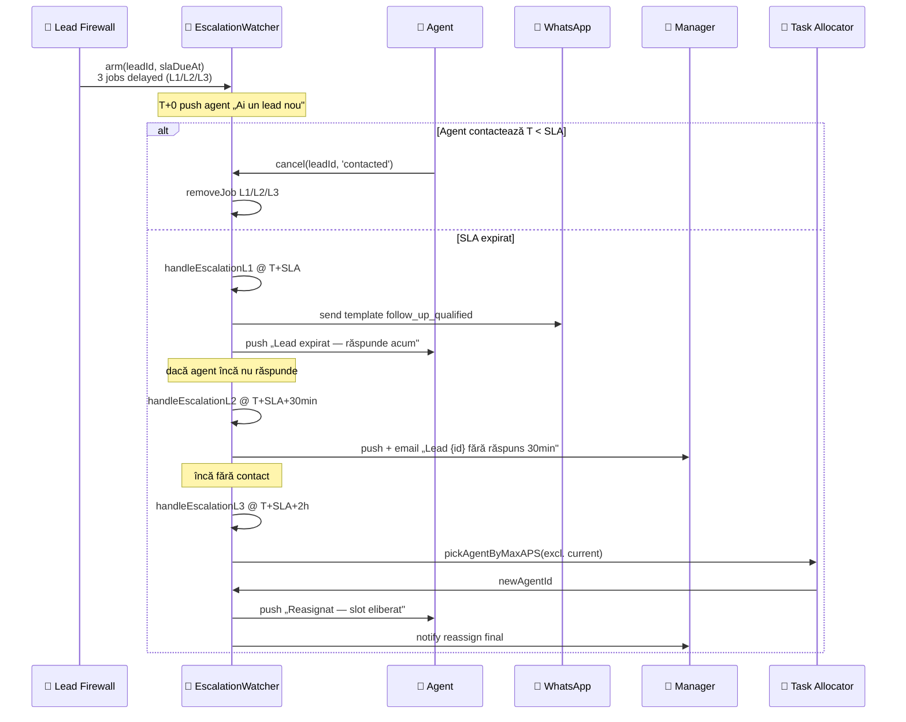

# WORKFLOW — REVYX Escalation Protocol
<!-- WORKFLOW_REVYX_escalation_v1.0.0.md · v1.0.0 · 2026-05 -->
<!-- CONFIDENȚIAL · Uz Intern · © 2026 REVYX · ITPRO SYSTEM SRL -->

## Changelog

| Versiune | Data | Autor | Note |
|---|---|---|---|
| 1.0.0 | 2026-05 | Senior PM + Solution Architect | Workflow inițial — Escalation Protocol 3 niveluri operațional (BR-03) · armare/cancel · auto-reasignare L3 |

---

## Cuprins

1. [Executive Summary](#1-executive-summary)
2. [Actori implicați](#2-actori-implicați)
3. [Pre-conditions](#3-pre-conditions)
4. [Flow Diagram](#4-flow-diagram)
5. [Etape detaliate](#5-etape-detaliate)
6. [Decision Points](#6-decision-points)
7. [Timing & SLA](#7-timing--sla)
8. [Score impacts](#8-score-impacts)
9. [AUDIT_LOG events](#9-audit_log-events)
10. [Notifications](#10-notifications)
11. [Error / Exception paths](#11-error--exception-paths)
12. [Post-conditions](#12-post-conditions)
13. [Acceptance Criteria](#13-acceptance-criteria)
14. [Glosar specific](#14-glosar-specific)
15. [Impact Assessment](#15-impact-assessment)

---

## 1. Executive Summary

Workflow operațional al Protocolului de Escaladare REVYX (BR-03). 3 niveluri secvențiale: N1 follow-up automat la T+SLA, N2 alertă manager la T+SLA+30min, N3 auto-reasignare la T+SLA+2h. Aplicabil la lead-uri în queue (`firewall_state IN ('QUEUED','OVERRIDDEN')`) cu SLA armat (HOT 15min · calificat 2h · warm 24h).

| Atribut | Valoare |
|---|---|
| **Scope** | Armare timere SLA · N1 / N2 / N3 · cancel events · auto-reasignare cu BR-04 + BR-11 |
| **Referință BRD** | §5 Pilon 04 · §5 Pilon 01 · §6.1 BR-03/04/11 · §12 SLA HOT/calificat/warm |
| **Tech spec referite** | lead-scoring v1.0.0 (EscalationWatcher) · nba-engine v1.0.0 · audit-log v1.0.0 |
| **Aplicabilitate** | Lead-uri QUEUED/OVERRIDDEN cu `assigned_agent_id IS NOT NULL` |

---

## 2. Actori implicați

| Actor | Token culoare | Sistem | Responsabilitate |
|---|---|---|---|
| 🤖 **Sistem REVYX AI** | `--ai` | REVYX | Armare timere · trigger N1/N2/N3 · auto-reasignare |
| 🤝 **Agent Imobiliar** | `--agt` | REVYX | Răspuns lead în SLA · cancel escalation la prim contact |
| 👔 **Manager** | `--mgr` | REVYX | Recipient alertă N2 · supervizare N3 · audit pattern |
| 👔 **Team Lead** | `--mgr` | REVYX | Notificat la N3 dacă echipa proprie afectată |
| 📱 **WhatsApp** | `--soc` | extern | Canal follow-up automat N1 (`follow_up_qualified` template) |

---

## 3. Pre-conditions

- LEAD în `firewall_state IN ('QUEUED','OVERRIDDEN')` cu `assigned_agent_id IS NOT NULL`.
- `sla_due_at IS NOT NULL` setat de Lead Firewall (`evaluateFirewall` → 15min HOT / 2h calificat / 24h warm).
- Agent activ (`agent.is_active = true`, `agent.out_of_office_until IS NULL OR > NOW()`).
- WhatsApp template `follow_up_qualified` Meta-aprobat (BR-09).
- `EscalationWatcher` rulează (BullMQ delayed jobs).

---

## 4. Flow Diagram

---

## 5. Etape detaliate

### Etapa 0 — Armare (T+0)

**Trigger:** `lead.firewall.evaluated` cu `state ∈ ('QUEUED','OVERRIDDEN')`

**Actor:** 🤖 EscalationWatcher

**Acțiuni:**
- Calcul `slaDueAt`:
  - HOT (LS ≥ 0.75): `NOW() + 15 min`
  - Calificat (0.60 ≤ LS < 0.75): `NOW() + 2h`
  - Warm (0.40 ≤ LS < 0.60): `NOW() + 24h`
  - Override (BLOCKED → OVERRIDDEN): `NOW() + 2h` fallback
- Adaugă 3 BullMQ delayed jobs cu `jobId` stable:
  - `esc:{leadId}:1` — delay = `slaDueAt - NOW()`
  - `esc:{leadId}:2` — delay = +30 min
  - `esc:{leadId}:3` — delay = +2h
- UPDATE `lead.sla_due_at = slaDueAt`, `escalation_level = 0`.
- INSERT ACTIVITY `(activity_type='status_changed', metadata.escalation='armed')`.

**AUDIT_LOG event:** `ESCALATION_ARMED` cu `slaDueAt`, `priority`, `assigned_agent_id`

**Score impact:** None (doar armare timere)

> ⏱ Timing: armare < 100ms. Idempotent: re-armare cu `jobId` stable ignoră duplicat.

---

### Etapa 1 — Contact reușit (cancel path)

**Trigger:** `POST /api/v1/leads/:id/contacted` SAU `lead.status` change la CONTACTED/QUALIFIED

**Actor:** 🤝 Agent

**Acțiuni:**
- ShowingService / LeadService apelează `EscalationWatcher.cancel(leadId, 'contacted')`.
- BullMQ `removeJob('esc:{leadId}:1')`, `:2`, `:3`.
- UPDATE `lead.escalation_level = 0`, `sla_due_at = NULL`.
- Recalc TS (RC↑ — răspuns rapid → boost behavior_stability).

**AUDIT_LOG event:** `ESCALATION_CANCELLED` cu `reason='contacted'` și `time_to_contact_seconds`

**Score impact:**

| Scor | Impact | Magnitudine |
|---|---|---|
| TS | Boost | RC↑ (răspuns < SLA) |
| LS | None direct | E↑ via ACTIVITY (call/message) |
| APS | Boost (acumulat) | RT (Response Time Score) ↑ |

> ⏱ Cancel < 200ms. Important: idempotent — re-apel ignoră dacă deja cancelled.

---

### Etapa 2 — Nivel 1 (T+SLA): follow-up automat

**Trigger:** Job BullMQ `esc:{leadId}:1` la `slaDueAt`

**Actor:** 🤖 AI

**Acțiuni:**
1. Verifică `lead.firewall_state ∈ ('QUEUED','OVERRIDDEN')` și `lead.status ∈ ('NEW','QUALIFIED')`. Dacă deja CONTACTED → no-op (idempotent).
2. Verifică GDPR consent buyer activ pentru WhatsApp.
3. Trimite WhatsApp template `follow_up_qualified` (BR-09 Meta-aprobat) cu variables:
   - `agent_name`, `agent_phone`, `lead_first_name` (dacă exists), `cta_link` (deep-link app).
4. Push agent: „Lead {short_id} expirat — răspunde acum (15min/2h/24h trecut)".
5. UPDATE `lead.escalation_level = 1`.
6. INSERT ACTIVITY `(activity_type='message_sent', channel='whatsapp', metadata.template='follow_up_qualified')`.

**AUDIT_LOG event:** `ESCALATION_TRIGGERED` cu `level=1`

**Score impact:**

| Scor | Impact | Magnitudine |
|---|---|---|
| TS | Slight ↓ | RC↓ (agent ratat SLA) |
| APS | Slight ↓ | RT penalizare (acumulat) |

**Decision:** Dacă agent contactează în ≤30 min după N1 → `cancel(reason='contacted_late_n1')`, jobs N2/N3 removed.

> ⚠ Fallback email dacă WhatsApp eșuat (vezi §11).

---

### Etapa 3 — Nivel 2 (T+SLA+30min): alertă manager

**Trigger:** Job BullMQ `esc:{leadId}:2`

**Actor:** 🤖 AI

**Acțiuni:**
1. Re-verifică condiții status (idempotent skip).
2. Push manager (rol=`manager`) din tenant: „Lead {id} fără răspuns 30 min după SLA".
3. Email manager cu link deep-link la lead detail + breakdown LS/TS/IS + agent_name.
4. Notificare paralelă team_lead (dacă `agent.team_id` setat).
5. UPDATE `lead.escalation_level = 2`.
6. UI: badge `🚨 ESCALATED L2` pe lead card.

**AUDIT_LOG event:** `ESCALATION_TRIGGERED` cu `level=2`, `notified_managers`

**Score impact:**

| Scor | Impact | Magnitudine |
|---|---|---|
| TS | None directly | — |
| APS | ↓ moderat | RT penalizare semnificativă (acumulat) |

**Decision:**
- Dacă manager intervine manual cu reassign → `cancel(reason='manager_reassign_n2')`.
- Dacă agent răspunde post-N2 → `cancel(reason='contacted_late_n2')`.

---

### Etapa 4 — Nivel 3 (T+SLA+2h): auto-reasignare

**Trigger:** Job BullMQ `esc:{leadId}:3`

**Actor:** 🤖 AI · 🤖 Task Allocator

**Acțiuni:**
1. Re-verifică status (idempotent skip).
2. Apel `TaskAllocator.pickAgentByMaxAPS(tenantId, { excludeAgentId: lead.assigned_agent_id })` — selectează agentul cu APS maxim **disponibil** care satisface:
   - `is_active = true`
   - `out_of_office_until IS NULL OR > NOW()`
   - `tasks_active < 3` (BR-04)
   - APS preluat cu fallback BR-11 (0.65 pentru agent <5 deals SAU <30 zile)
3. Tranzacție atomică:
   - UPDATE `lead.assigned_agent_id = newAgentId`, `escalation_level = 3`, `assigned_at = NOW()`.
   - Versiune optimistic locking respectată.
   - Re-armare timer `EscalationWatcher` cu noul SLA fallback (2h).
4. Push agent vechi: „Lead reasignat — slot eliberat".
5. Push agent nou: „Lead reasignat ție — răspunde rapid".
6. Notify manager: „Lead {id} reasignat de la {old_agent} la {new_agent} (auto-L3)".

**AUDIT_LOG event:** `ESCALATION_TRIGGERED` cu `level=3`, `trigger='AUTO_REASSIGN'`, `old_agent_id`, `new_agent_id`

**Score impact:**

| Scor | Impact | Magnitudine |
|---|---|---|
| **APS** (vechi) | ↓ semnificativ | RT + DCR penalizare (deal pierdut prin reasignare) |
| TS lead | None | — |
| LS | None | — |

**Edge case:** Niciun agent disponibil (toți la 3 active, OOO sau inactivi):
- Lead intră în `state='UNASSIGNED'` (extensie firewall_state) — vezi §11
- Notify manager critic: „Lead {id} fără agent disponibil — intervenție necesară"
- Cron `unassigned.retry` rulează la 5 min pentru re-pickup.

---

### Etapa 5 — Cancel post-N1/N2/N3

**Trigger:** Lead reaches CONTACTED, status change la WON/LOST, deal close, manager override final.

**Actor:** 🤝 Agent / 👔 Manager / sistem

**Acțiuni:**
- `cancel(leadId, reason ∈ ('contacted','closed','reassigned_manual','lost','manager_override'))`.
- Remove jobs L1/L2/L3 by stable jobId.
- UPDATE `lead.escalation_level` păstrat (audit history) · `sla_due_at = NULL`.

**AUDIT_LOG event:** `ESCALATION_CANCELLED` cu `reason`

---

## 6. Decision Points

| # | Întrebare | Ramuri |
|---|---|---|
| D1 | Lead status = NEW/QUALIFIED la trigger N1? | DA → trimite N1; NU → no-op |
| D2 | GDPR consent activ WhatsApp? | DA → template; NU → fallback email |
| D3 | Agent răspunde între N1 și N2? | DA → cancel; NU → trigger N2 |
| D4 | Manager intervine la N2 cu reassign manual? | DA → cancel + re-arm SLA pe agent nou; NU → așteaptă N3 |
| D5 | La N3, găsit agent disponibil cu BR-04 satisfăcut? | DA → reassign; NU → state UNASSIGNED + notify manager |
| D6 | Lead OVERRIDE de manager (BLOCKED → OVERRIDDEN) la T+0? | DA → arm cu SLA fallback 2h; NU → flow standard |
| D7 | Agent OOO (out_of_office_until > NOW())? | Pre-check N1: skip → escaladare imediată N2 |
| D8 | 3 reasignări consecutive (N3 multiple)? | Stop la 3 reasignări · UNASSIGNED + manager critical alert |

---

## 7. Timing & SLA

| Etapă | Timing | SLA | Sursă |
|---|---|---|---|
| Armare timere | < 100 ms | — | UX |
| N1 follow-up | T + SLA exact (±5 sec BullMQ jitter) | BR-03 | E2E |
| N2 alert manager | T + SLA + 30 min | BR-03 | E2E |
| N3 auto-reasignare | T + SLA + 2h | BR-03 | E2E |
| Cancel | < 200 ms | — | UX |
| Reasignare tranzacție | < 500 ms | — | UX |
| WhatsApp template send | p95 < 5 sec | NFR | Load |

---

## 8. Score impacts (consolidat)

| Etapă | Scor | Tip | Magnitudine |
|---|---|---|---|
| N1 trigger | TS | Slight ↓ | RC↓ |
| N1 trigger | APS | Slight ↓ | RT acumulat |
| N2 trigger | APS | ↓ moderat | RT mai sever |
| N3 reassign | APS (vechi) | ↓ semnificativ | DCR + RT |
| N3 reassign | APS (nou) | None inițial | așteaptă rezultat |
| Contact pre-N1 | TS | Boost | RC↑ |
| Contact pre-N1 | APS | Boost | RT↑ |

---

## 9. AUDIT_LOG events

| Event | Etapă | Severity |
|---|---|---|
| `ESCALATION_ARMED` | 0 | INFO |
| `ESCALATION_CANCELLED` | 1 / 5 | INFO |
| `ESCALATION_TRIGGERED` (level=1) | 2 | INFO |
| `ESCALATION_TRIGGERED` (level=2) | 3 | WARN |
| `ESCALATION_TRIGGERED` (level=3) | 4 | WARN |
| `LEAD_REASSIGNED_AUTO` | 4 | INFO |
| `LEAD_UNASSIGNED_NO_AGENT` | 4 (edge) | CRITICAL |
| `WHATSAPP_TEMPLATE_FAILED` | 2 | WARN |

---

## 10. Notifications

| Eveniment | Canal | Destinatar | Template |
|---|---|---|---|
| Armare T+0 | Push in-app | agent | intern „Lead nou {priority}" |
| N1 follow-up | WhatsApp | buyer | `follow_up_qualified` (Meta) |
| N1 push agent | Push | agent | intern „Lead expirat" |
| N2 alert | Push + email | manager + team_lead | intern digest |
| N3 reassign | Push | agent vechi (slot liberat) | intern |
| N3 reassign | Push | agent nou | intern „Lead reasignat ție" |
| N3 reassign | Email | manager | intern audit |
| UNASSIGNED edge | Push + email CRITICAL | manager | intern „Intervenție necesară" |

> ⚠ WhatsApp `follow_up_qualified` strict Meta-aprobat (BR-09). Fallback email validat E2E.

---

## 11. Error / Exception paths

| Eroare | Etapă | Acțiune |
|---|---|---|
| BullMQ Redis down la armare | 0 | Persist local fallback · replay la recover · alert SecOps |
| Agent OOO la N1 | 2 | Skip → escaladare imediată N2 |
| WhatsApp template fail | 2 | Retry 3× backoff · fallback email · audit `WHATSAPP_TEMPLATE_FAILED` |
| Niciun agent disponibil la N3 | 4 | UNASSIGNED + cron retry 5min + manager alert CRITICAL |
| Optimistic conflict pe reassign | 4 | Retry 3× cu backoff 50/100/200 ms |
| Lead deja CONTACTED când N1 trigger (race) | 2 | No-op idempotent |
| Manager override final intermediu | * | Cancel toate jobs L1/L2/L3 prin reason='manager_override' |
| 3 reasignări consecutive | 4 | Stop · UNASSIGNED · manager critical |

---

## 12. Post-conditions

| Stare finală | Garanții |
|---|---|
| **Cancel pre-N1** (contacted) | Jobs removed · APS RT↑ · TS RC↑ |
| **Cancel post-N1** | N1 audit logged · APS RT↓ minor · jobs N2/N3 removed |
| **Cancel post-N2** | N1+N2 audit · APS RT↓ moderat · job N3 removed |
| **Trigger N3 reassign** | Lead pe agent nou · APS vechi penalizat · timer re-armat fresh |
| **UNASSIGNED edge** | Lead în coadă specială · manager notificat · cron retry activ |

---

## 13. Acceptance Criteria

| AC | Validare |
|---|---|
| **AC-ESC-01** | Lead HOT (LS≥0.75) fără răspuns 15 min → N1 trimis exact (±5 sec) |
| **AC-ESC-02** | N1 trimis → 30 min fără răspuns → N2 alert manager push+email |
| **AC-ESC-03** | N2 trimis → 2h fără răspuns → N3 auto-reassign cu agent APS maxim disponibil |
| **AC-ESC-04** | Agent contact pre-SLA → toate 3 jobs cancelled idempotent |
| **AC-ESC-05** | N3 cu BR-04 respectat: niciun agent cu 3 active selectat |
| **AC-ESC-06** | N3 fără agent disponibil → state UNASSIGNED + manager CRITICAL alert |
| **AC-ESC-07** | Reassign optimistic conflict → retry 3× cu backoff success |
| **AC-ESC-08** | WhatsApp template fail → fallback email + audit `WHATSAPP_TEMPLATE_FAILED` |

---

## 14. Glosar specific

| Termen | Sensul |
|---|---|
| **Escalation Protocol** | BR-03 · 3 niveluri secvențiale |
| **N1 / N2 / N3** | Niveluri escaladare la T+SLA / +30min / +2h |
| **SLA** | 15min HOT · 2h calificat · 24h warm · 2h fallback override |
| **Cancel** | Eliminare jobs delayed la prim contact / close / override |
| **UNASSIGNED** | State edge când N3 nu găsește agent disponibil (BR-04 + OOO + inactiv) |
| **Auto-reassign** | Schimbare `assigned_agent_id` automată la N3 |
| **APS maxim disponibil** | `MAX(aps)` din agenții cu `tasks_active < 3 AND is_active AND NOT OOO` |

---

## 15. Impact Assessment

### 15.1 Scope of Change

| Element | Detaliu |
|---|---|
| Document | WORKFLOW_REVYX_escalation_v1.0.0.md |
| Tip schimbare | NEW |
| Aria afectată | Pilon 04 · BR-03/04/11 · entitate LEAD + AGENT · scoring TS/APS |
| Origine | BRD §5 Pilon 04 · §6.1 BR-03 · TECH_SPEC lead-scoring §6.5 (EscalationWatcher) |

### 15.2 Impact pe documente conexe

| Document | Tip impact | Acțiune |
|---|---|---|
| BRD_REVYX_v1.0.0.md | None | Reflectă mecanica BR-03 |
| TECH_SPEC_REVYX_lead-scoring_v1.0.0.md | None | EscalationWatcher implementare deja documentată |
| TECH_SPEC_REVYX_nba-engine_v1.0.0.md | Minor | Reasignare actualizează NBA pe agent nou |
| TECH_SPEC_REVYX_audit-log_v1.0.0.md | Minor | Catalog event extins (`LEAD_UNASSIGNED_NO_AGENT`) |
| WORKFLOW_REVYX_lead-lifecycle_v1.0.0.md | Minor | Etapa „queue" referențiază acest workflow detaliat |

### 15.3 Impact pe scoring

| Scor | Afectat? | Detaliu |
|---|---|---|
| LS, IS, PS, DP, NBA, DHI | NU | — |
| **TS** | DA | RC boost/penalty bazat pe response time |
| **APS** | DA | RT + DCR ↓ pe escalation L2/L3 · acumulat în timp |

### 15.4 Impact pe entități / schema BD

| Entitate | Modificare | Migrare |
|---|---|---|
| LEAD | None — `escalation_level`, `sla_due_at` deja în 0050_lead_phase1 | — |
| AGENT | None — `is_active`, `out_of_office_until`, `tasks_active` (counter) deja documentate | — |
| Eventual extensie firewall_state cu `UNASSIGNED` | ALTER (PATCH) | 0050b_lead_unassigned.sql (opțional dacă state explicit) |

### 15.5 Impact pe RBAC

| Rol | Permisiuni |
|---|---|
| agent | Read escalation level pe lead propriu |
| team_lead | Notificat la N3 echipei sale |
| manager | Recipient N2/N3 alerts · acknowledge UNASSIGNED · forțare cancel |
| admin | Config SLA tunable + delays (15/30/120 min) |

### 15.6 Impact pe SLA & NFR

| NFR / SLA | Înainte | După | Validare |
|---|---|---|---|
| SLA HOT | 15 min | enforced via N1 | E2E AC-ESC-01 |
| Escalation precision | nedefinit | ±5 sec BullMQ | AC-ESC-01 |
| BR-04 enforcement la N3 | nedefinit | obligatoriu | AC-ESC-05 |

### 15.7 Impact pe Securitate & GDPR

| Aspect | Status | Notă |
|---|---|---|
| PII | DA | Variables WhatsApp `lead_first_name` redactat în AUDIT |
| AUDIT_LOG events noi | DA | Vezi §9 |
| Consent flow | DA | WhatsApp `follow_up_qualified` consent-gated |
| HMAC / JWT / RBAC | DA | RBAC §15.5 |
| Rate limiting | NU | Moștenit |

### 15.8 Risks & Mitigations

| # | Risc | Probab. | Impact | Mitigare |
|---|---|---|---|---|
| R1 | BullMQ Redis down → escaladări ratate | LOW | HIGH | Persist local + replay · alert SecOps |
| R2 | N3 reassign agent OOO neactualizat | MED | MED | Real-time check `out_of_office_until` în pickAgent |
| R3 | UNASSIGNED edge frecvent | MED | HIGH | Manager dashboard real-time + auto cron retry · capacity planning agency |
| R4 | WhatsApp template `follow_up_qualified` neaprobat | LOW | HIGH | BR-09 submission ≥2 săptămâni · email fallback |
| R5 | Race cancel + N1 trigger | MED | LOW | Idempotent skip + atomic check status |
| R6 | Spam manager push N2 (multe lead-uri simultan) | MED | MED | Digest aggregation · max 1 push/min/manager + email digest |
| R7 | Agent abuziv „cancel manual" pentru a evita escaladare | LOW | MED | Audit pattern · APS DCR cu fallback validation |

### 15.9 Test Plan

Vezi §13 — toate AC-ESC-01..08 acoperite în E2E + integration. Test specific BullMQ Redis chaos (down/recover replay).

### 15.10 Rollout & Rollback

| Aspect | Detaliu |
|---|---|
| Feature flag | `flag.escalation_v1.enabled` (cu prerequisite `lead_scoring_v1.enabled`) |
| Strategie rollout | canary 10% → 50% → 100% în 2 săptămâni |
| Rollback | Flag OFF · jobs delayed drained · re-enable după fix |
| Owner | Senior PM + Solution Architect |

### 15.11 Approval Gate

| Aprobator | Necesar pentru |
|---|---|
| Senior PM | Workflow alignment cu BR-03 · timing-uri |
| Solution Architect | BullMQ delayed jobs · idempotent jobId · pickAgentByMaxAPS |
| Security Lead | AUDIT events · PII redaction WhatsApp variables |
| Legal / DPO | Template Meta `follow_up_qualified` compliance |

---

*docs/workflow/WORKFLOW_REVYX_escalation_v1.0.0.md · v1.0.0 · 2026-05 · CONFIDENȚIAL · Uz Intern*
*REVYX — Real Estate Execution Intelligence · © 2026 REVYX · ITPRO SYSTEM SRL*
