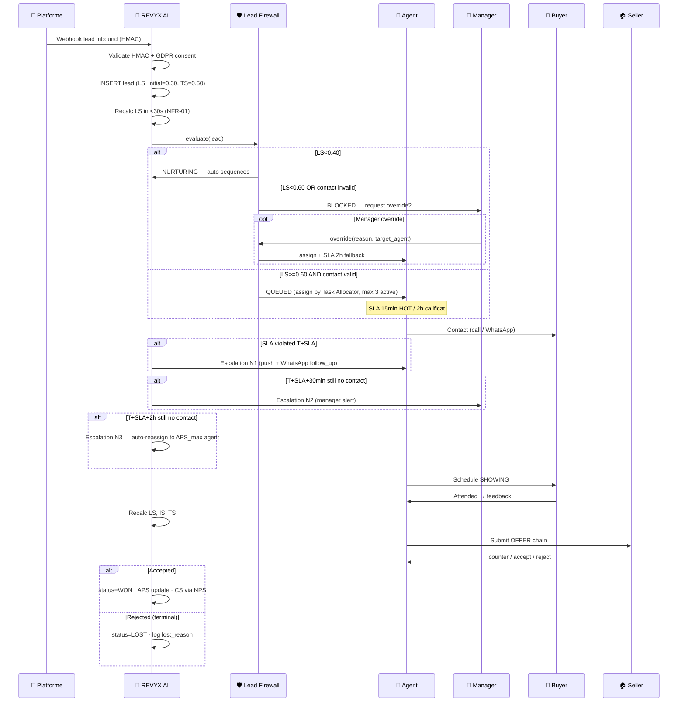

# WORKFLOW — REVYX Lead Lifecycle
<!-- WORKFLOW_REVYX_lead-lifecycle_v1.0.0.md · v1.0.0 · 2026-05 -->
<!-- CONFIDENȚIAL · Uz Intern · © 2026 REVYX · ITPRO SYSTEM SRL -->

## Changelog

| Versiune | Data | Autor | Note |
|---|---|---|---|
| 1.0.0 | 2026-05 | Senior PM + Solution Architect | Workflow inițial — INTAKE → FIREWALL → QUEUE → CONTACT → SHOWING → OFFER → DEAL/LOST |

---

## Cuprins

1. [Executive Summary](#1-executive-summary)
2. [Actori implicați](#2-actori-implicați)
3. [Pre-conditions](#3-pre-conditions)
4. [Flow Diagram](#4-flow-diagram)
5. [Etape detaliate](#5-etape-detaliate)
6. [Decision points](#6-decision-points)
7. [Timing & SLA](#7-timing--sla)
8. [Score impacts](#8-score-impacts)
9. [AUDIT_LOG events](#9-audit_log-events)
10. [Notifications](#10-notifications)
11. [Error / Exception paths](#11-error--exception-paths)
12. [Post-conditions](#12-post-conditions)
13. [Acceptance Criteria](#13-acceptance-criteria)
14. [Glosar specific](#14-glosar-specific)
15. [Impact Assessment](#15-impact-assessment)

---

## 1. Executive Summary

Acest workflow descrie ciclul complet de viață al unui LEAD în REVYX, de la sursa externă (Meta / Google / OLX / referral) până la închiderea deal-ului (WON) sau marcarea ca pierdut (LOST). Acoperă 8 stări principale, Lead Firewall (BR-01), Manager Override (AC-LF-03), Escalation Protocol 3 niveluri (BR-03), nurturing automat și GDPR consent (BR-06).

| Atribut | Valoare |
|---|---|
| **Scope** | INTAKE → FIREWALL → QUEUE → CONTACT → SHOWING → OFFER → DEAL/LOST |
| **Referință BRD** | §5 Pilon 01/04 · §6.1 BR-01..06 · §7.1 LS · §12 AC-LF-* + AC-LS-* |
| **Tech spec referite** | webhook-intake v1.0.0 · audit-log v1.0.0 · lead-scoring v1.0.0 · showcase-links v1.0.0 |
| **Aplicabilitate** | Toate sursele lead (Meta, Google, OLX, referral, manual, import) |

---

## 2. Actori implicați

| Actor | Token culoare | Sistem | Responsabilitate |
|---|---|---|---|
| 📱 **Platforme & Social** | `--soc` | extern | Sursă lead inbound (Meta Lead Ads, Google, OLX) |
| 🤖 **Sistem REVYX AI** | `--ai` | REVYX | Intake · LS calc · Firewall · Escalation · Nurturing · auto-reassign |
| 🤝 **Agent Imobiliar** | `--agt` | REVYX | Contact lead · vizionări · ofertă · negociere |
| 👔 **Manager Agenție** | `--mgr` | REVYX | Override Firewall · auditare alocări · escaladare N2 |
| 👤 **Client / Cumpărător** | `--buy` | extern + REVYX | Lead → buyer activ · semnare ofertă · participare vizionare |
| 🏠 **Proprietar / Vânzător** | `--sel` | extern + REVYX | Acceptare/respingere ofertă · counter-offer |

---

## 3. Pre-conditions

- Phase 0 Security finalizată (auth-rbac, AUDIT_LOG, webhook-intake HMAC).
- Tenant în starea `ACTIVE` (vezi WORKFLOW tenant-lifecycle).
- TECH_SPEC lead-scoring v1.0.0 deployed cu feature flag ON.
- Cel puțin 1 agent `is_active = true` și `tasks_active < 3` per BR-04.
- Property inventory disponibil (pentru BF — Budget Fit calc).
- WhatsApp templates Meta-aprobate (BR-09): `follow_up_warm`, `follow_up_qualified`, `showcase_link`.

---

## 4. Flow Diagram

---

## 5. Etape detaliate

### Etapa 1 — INTAKE (Lead Capture)

**Trigger:** Webhook Meta / Google / OLX (HMAC verificat) SAU intake manual din UI agent / import bulk

**Actor:** 🤖 Sistem REVYX AI (webhook) sau 🤝 Agent (manual)

**Pre-conditions:** GDPR consent capturat și prezent în payload (BR-06)

**Acțiuni sistem:**
- Verificare HMAC-SHA256 (vezi TECH_SPEC webhook-intake)
- Refuz INSERT dacă lipsește `gdpr_consent_at`, `gdpr_consent_channel`, `gdpr_consent_version`
- Dedup fuzzy (pg_trgm) pe `(phone_e164, email, full_name)` cu prag >85%
- INSERT atomic `lead`: `LS_initial=0.30`, `TS_initial=0.50`, `version=1`, `status=NEW`, `firewall_state=PENDING`
- AUDIT_LOG event `LEAD_CREATED` în aceeași tranzacție

**AUDIT_LOG events:**
- `LEAD_CREATED` — tenant_id, source, gdpr_consent_*, dedup_hash
- `LEAD_DEDUP_DETECTED` (dacă match >85%) — duplicate_of_lead_id

**Score impact:** `LS = 0.30` · `TS = 0.50` · `IS = 0.0`

> ⏱ **NFR-02:** lead calificat → queue agent în ≤ 2 min

---

### Etapa 2 — Initial Score Calculation

**Trigger:** publish event `lead.created`

**Actor:** 🤖 Scoring Engine

**Acțiuni:**
- `recalcLeadScore(lead_id)` cu input-uri disponibile la t=0
- Formula t=0 (BRD §7.1): `LS = max(0.30, 0.25*BF_declared + 0.30*contact_verified)`
- UPDATE `lead.lead_score` cu optimistic locking (`WHERE version = :prev`)
- Publish event `lead.score.updated`

**AUDIT_LOG event:** `LEAD_SCORE_UPDATED` — old_value, new_value, trigger=initial

**Score impact:** LS recalculat în ≤ 30 sec (NFR-01)

---

### Etapa 3 — FIREWALL Evaluation

**Trigger:** event `lead.score.updated`

**Actor:** 🛡 Lead Firewall

**Decision logic:**

| Condiție | Decizie | `firewall_state` |
|---|---|---|
| `LS < 0.40` | Nurturing automat (fără agent) | `NURTURING` |
| `0.40 ≤ LS < 0.60` | Blocked — manager review optional | `BLOCKED` (reason: LS_BELOW_THRESHOLD) |
| `LS ≥ 0.60` AND `!contact_valid` | Blocked — așteaptă verificare contact | `BLOCKED` (reason: CONTACT_INVALID) |
| `LS ≥ 0.60` AND `contact_valid` | Queue agent | `QUEUED` |

**SLA armare** (la `QUEUED`):
- `LS ≥ 0.75` (HOT) → SLA 15 min · arm escalation N1/N2/N3
- `0.60 ≤ LS < 0.75` (calificat) → SLA 2h
- (sub-prag nu intră aici)

> ⏱ **NFR-02 + AC-LF-01:** lead calificat → queue agent în ≤ 2 min total de la INTAKE

**AUDIT_LOG events:**
- `LEAD_FIREWALL_BLOCKED` (BLOCKED)
- `LEAD_ASSIGNED` (QUEUED — cu `assigned_agent_id`)
- `LEAD_NURTURING_STARTED` (NURTURING)

**Score impact:** niciuna directă — decizia consumă LS

---

### Etapa 3a — Manager Override (opțional, doar BLOCKED)

**Trigger:** Manager hit `POST /api/v1/leads/:id/firewall/override`

**Actor:** 👔 Manager Agenție

**Pre-conditions:**
- Lead în `firewall_state=BLOCKED`
- Manager are RBAC `manager` sau superior
- `override_reason` text obligatoriu

**Acțiuni:**
- Tranziție `BLOCKED → OVERRIDDEN`
- Set `assigned_agent_id`, `assigned_at = NOW()`, `sla_due_at = NOW()+2h` (fallback)
- AUDIT_LOG event `LEAD_FIREWALL_OVERRIDE` (vezi audit-log §4.3)

> ⏱ **AC-LF-04:** la override → lead în queue agent în ≤ 2 min

**Score impact:** niciuna

---

### Etapa 4 — CONTACT (Agent răspunde)

**Trigger:** Agent execută `POST /api/v1/leads/:id/contacted` SAU sistem detectează ACTIVITY `call` / `message_sent` cu `performed_by = assigned_agent_id`

**Actor:** 🤝 Agent

> ⏱ **SLA: 15 min HOT · 2h calificat** · Escalation N1 la T+SLA · N2 la T+SLA+30min · N3 la T+SLA+2h

**Acțiuni:**
- INSERT `activity` (type=`call` sau `message_sent` + channel)
- Cancel escalation timers (jobId stable: `esc:{lead_id}:1/2/3`)
- Lead status: `NEW → QUALIFIED → CONTACTED`
- Recalc LS/IS/TS (event-driven)

**AUDIT_LOG events:**
- `LEAD_CONTACTED` — performed_by, channel, duration_seconds
- `ESCALATION_CANCELLED` (× 3 niveluri)

**Score impact:** IS↑ (CF/MF), TS↑ (RC dacă răspuns rapid), LS↑

---

### Etapa 4a — Escalation N1/N2/N3 (path eșec contact)

**Trigger:** delayed jobs BullMQ (vezi TECH_SPEC lead-scoring §6.5)

| Nivel | Timing | Actor | Acțiune |
|---|---|---|---|
| **N1** | T+SLA | 🤖 AI | Push agent + WhatsApp template `follow_up_qualified` |
| **N2** | T+SLA+30min | 🤖 AI | Alertă manager (push + email) cu detalii complete |
| **N3** | T+SLA+2h | 🤖 AI | Auto-reassign la agent cu APS max disponibil (`tasks_active<3`, `is_active=true`, `out_of_office_until IS NULL`) |

**AUDIT_LOG event:** `ESCALATION_TRIGGERED` cu `metadata.level ∈ [1,2,3]`

**Score impact:** TS↓ (RC dacă lead reactionează după multe escaladări); APS impactat indirect prin RT (response time)

---

### Etapa 5 — SHOWING Scheduled & Attended

**Trigger:** Agent crează entitate SHOWING (vezi WORKFLOW showing-flow)

**Actor:** 🤝 Agent + 👤 Buyer + 🏠 Seller

**Acțiuni:**
- INSERT `showing` cu `scheduled_at`
- Reminder automat T-24h (WhatsApp `showing_reminder`)
- Post-vizionare: feedback_score [1-5] + notes
- Lead status: `CONTACTED → SHOWING`

**AUDIT_LOG events:**
- `SHOWING_SCHEDULED`
- `SHOWING_ATTENDED` / `SHOWING_NO_SHOW` / `SHOWING_CANCELLED`
- `SHOWING_FEEDBACK_RECORDED`

**Score impact (vezi WORKFLOW showing-flow §8):** SF↑ (IS), feedback impactează LS

---

### Etapa 6 — OFFER Chain

**Trigger:** Buyer / Agent submit ofertă

**Actor:** 🤝 Agent · 👤 Buyer · 🏠 Seller

**Acțiuni:**
- INSERT `offer` cu `offered_by`, `amount`, `currency`, `valid_until`
- Counter-offer chain via `counter_to_offer_id` (suport 3-7 runde — BRD §5 Pilon 05)
- Status transitions: `pending → countered/accepted/rejected/withdrawn`
- Lead status: `SHOWING → NEGOTIATION`

**AUDIT_LOG events:**
- `OFFER_SUBMITTED` · `OFFER_COUNTERED` · `OFFER_ACCEPTED` · `OFFER_REJECTED` · `OFFER_WITHDRAWN`

**Score impact:** IS↑ (activity cumulativă), DHI calculat la nivel deal

> ↪ Detalii complete în `WORKFLOW_REVYX_offer-chain` (S4)

---

### Etapa 7 — DEAL Closure (WON / LOST)

**Trigger:** Offer ACCEPTED → DEAL inițiat SAU final LOST decision

**Actor:** 🤝 Agent · ⚖️ Notar · 🏦 Bancă (la WON)

**Path WON:**
- Lead status: `NEGOTIATION → WON`
- DEAL final cu notarial documents → vezi `WORKFLOW_REVYX_deal-closure` (S4)
- NPS post-tranzacție trimis în T+7 zile (alimentează CS în APS)
- `agent.aps` recalculat (CR↑, DCR↑)

**Path LOST:**
- Lead status: `* → LOST`
- `lost_reason` enum obligatoriu: `price` / `competitor` / `cooling_off` / `financing` / `other`
- ACTIVITY note final cu context

**AUDIT_LOG events:**
- `DEAL_WON` / `LEAD_LOST` (cu `lost_reason`)
- `NPS_REQUESTED` / `NPS_RECEIVED` (dacă WON)

**Score impact:** APS update (CR/DCR/CS), DHI arhivat, LS final logat

---

### Etapa 8 — NURTURING (lead rece)

**Trigger:** `firewall_state = NURTURING` la Etapa 3 sau downgrade ulterior

**Actor:** 🤖 Sistem REVYX AI (zero intervenție agent — BR-01)

**Acțiuni:**
- Secvențe automate WhatsApp (`follow_up_warm`) la T+1d, T+7d, T+30d
- Recalc LS la fiecare ACTIVITY de răspuns
- Re-evaluare Firewall: dacă LS upgrade ≥ 0.40 → re-evaluare; ≥0.60 → re-queue agent

**AUDIT_LOG event:** `LEAD_NURTURING_TICK` cu sequence_step

**Score impact:** TS poate crește dacă lead răspunde · LS recalc

---

## 6. Decision points

| # | Întrebare | Ramuri |
|---|---|---|
| D1 | GDPR consent prezent în payload? | DA → INSERT; NU → reject 422 + `LEAD_INTAKE_REJECTED_NO_CONSENT` |
| D2 | Dedup fuzzy >85%? | DA → set `duplicate_of_lead_id` + notificare agent; NU → INSERT separat |
| D3 | LS la t=0? | <0.40 → NURTURING; <0.60 → BLOCKED; ≥0.60 + contact_valid → QUEUED |
| D4 | Contact verified (phone OR email)? | NU → BLOCKED (CONTACT_INVALID); DA → continuă D3 |
| D5 | Agent disponibil cu `tasks_active<3`? | NU → așteaptă cel mai aproape liber + log warn (BR-04); DA → assign |
| D6 | Manager override pe BLOCKED? | DA → OVERRIDDEN + assign; NU → rămâne BLOCKED, intră în nurturing după T+24h |
| D7 | Escalation N3 declanșat? | DA → reassign la APS max; dacă niciun agent eligibil → escalate la manager |
| D8 | Lead refuzat la SHOWING (no_show)? | DA → DHI/LS↓, optional re-schedule; consec 3 no_show → LOST |
| D9 | Offer chain depășește 7 runde? | DA → blocaj UI + alertă manager (BRD §5 Pilon 05 limit) |
| D10 | LOST cu reason `price`? | Re-match cu inventory price-adjusted (Phase 2) |

---

## 7. Timing & SLA

| Etapă | Timing țintă | SLA | Sursă |
|---|---|---|---|
| INTAKE → INSERT lead | < 3 sec | — | NFR (latency intern) |
| LS initial calc | < 30 sec | NFR-01 | BRD §6.2 |
| INTAKE → queue agent | < 2 min | NFR-02 / AC-LF-01 | BRD §6.2 |
| CONTACT lead HOT | 15 min | **HOT SLA** | BRD §5 Pilon 04 |
| CONTACT lead calificat | 2h | **Qualified SLA** | BRD §5 Pilon 04 |
| CONTACT lead warm | 24h | **Warm SLA** | BRD §5 Pilon 04 |
| Escalation N1 | T+SLA | — | BR-03 |
| Escalation N2 | T+SLA+30min | — | BR-03 |
| Escalation N3 | T+SLA+2h | — | BR-03 |
| Reminder showing | T-24h | — | BRD §5 Pilon 04 |
| NPS post-WON | T+7d | — | BRD §5 Pilon 07 |

---

## 8. Score impacts

| Etapă | Scor afectat | Tip impact | Magnitude |
|---|---|---|---|
| INTAKE | LS, TS | Init | LS=0.30 (BR-02) · TS=0.50 |
| Initial calc t=0 | LS | Update | `max(0.30, 0.25*BF + 0.30*contact_verified)` |
| Contact valid (phone+email) | LS | Boost | TS↑, contact_valid trigger queue |
| CONTACT prim răspuns | IS, TS, LS | Boost | CF↑/MF↑ · RC↑ · LS recalc |
| Escalation N3 (auto-reassign) | APS noul agent | Neutru | Doar evaluare disponibilitate |
| SHOWING attended + feedback>=4 | LS, IS, TS | Boost | SF↑ · `+0.05 LS` typical |
| SHOWING no_show | LS, TS | Penalizare | TS↓ (RC) |
| OFFER submitted | IS, DP | Boost | Activity cumulativă |
| WON | APS | Boost | CR↑ · DCR↑ · CS (NPS) |
| LOST | APS (slight) | Neutru/Penal | DCR contribuie |
| 5 zile fără ACTIVITY | DHI | Penalizare | RF=0.3 (comunicare) |

---

## 9. AUDIT_LOG events

| Event | Etapă | Severity |
|---|---|---|
| `LEAD_CREATED` | 1 | INFO |
| `LEAD_DEDUP_DETECTED` | 1 | INFO |
| `LEAD_INTAKE_REJECTED_NO_CONSENT` | 1 (reject) | WARN |
| `LEAD_SCORE_UPDATED` | 2 + recurent | INFO |
| `LEAD_FIREWALL_BLOCKED` | 3 | INFO |
| `LEAD_FIREWALL_OVERRIDE` | 3a | WARN (audit Manager) |
| `LEAD_ASSIGNED` | 3 / 3a / 4a (N3) | INFO |
| `LEAD_NURTURING_STARTED` | 3 | INFO |
| `LEAD_NURTURING_TICK` | 8 | INFO |
| `LEAD_CONTACTED` | 4 | INFO |
| `ESCALATION_TRIGGERED` | 4a | WARN |
| `ESCALATION_CANCELLED` | 4 | INFO |
| `SHOWING_SCHEDULED` / `_ATTENDED` / `_NO_SHOW` / `_FEEDBACK_RECORDED` | 5 | INFO/WARN |
| `OFFER_SUBMITTED` / `_COUNTERED` / `_ACCEPTED` / `_REJECTED` / `_WITHDRAWN` | 6 | INFO |
| `DEAL_WON` | 7 | INFO |
| `LEAD_LOST` | 7 | INFO (cu lost_reason) |
| `NPS_REQUESTED` / `_RECEIVED` | 7 | INFO |

Toate events păstrate per retention policy AUDIT_LOG (7 ani — vezi audit-log §10).

---

## 10. Notifications

| Eveniment | Canal | Destinatar | Template |
|---|---|---|---|
| Lead HOT assigned | Push + WhatsApp | agent | `follow_up_qualified` (Meta-aprobat) |
| Lead calificat assigned | Push | agent | `follow_up_qualified` |
| Escalation N1 | Push + WhatsApp | agent | `follow_up_qualified` |
| Escalation N2 | Push + email | manager | `escalation_alert` (intern, non-Meta) |
| Escalation N3 | Push | new agent + manager | `escalation_alert` |
| Showcase link send | WhatsApp | buyer | `showcase_link` (Meta-aprobat) |
| Showing reminder T-24h | WhatsApp + email | buyer + agent | `showing_reminder` (Meta-aprobat) |
| Offer received | Push + email | agent | `offer_received` (Meta-aprobat) |
| Lead lost | Email | manager (digest zilnic) | intern |
| NPS request | WhatsApp | buyer (post-WON) | non-Meta tranzacțional opt-in |

> ⚠ Templates Meta-aprobate (BRD §6.3): `follow_up_warm`, `follow_up_qualified`, `showcase_link`, `showing_reminder`, `offer_received` — submisie cu ≥2 săptămâni înainte de lansare.

---

## 11. Error / Exception paths

| Eroare | Etapă | Acțiune |
|---|---|---|
| HMAC invalid pe webhook | 1 | 401 + AUDIT `WEBHOOK_HMAC_FAILED` · sursă retry sau dropped (DLQ) |
| GDPR consent lipsă | 1 | 422 + AUDIT `LEAD_INTAKE_REJECTED_NO_CONSENT` · răspuns standardizat la sursă |
| Optimistic conflict pe LEAD UPDATE | 2/3/4 | Retry max 3× cu backoff 50/100/200 ms (vezi lead-scoring §8) |
| Agent indisponibil la N3 (toți cu `tasks_active=3`) | 4a | Escalate la manager + queue în „Awaiting Capacity" |
| Lead duplicate detectat după contact | 4 | Merge UI manual cu approval team_lead |
| Showing no_show 3× consecutiv | 5 | Lead → LOST automat cu reason=`cooling_off` |
| Offer chain >7 runde | 6 | Blocaj UI + alert manager · negociere closing manuală |
| WhatsApp template nu primit la sursă | 10 | Fallback email + retry 3× (BullMQ) |
| GDPR erasure mid-lifecycle | oricare | Cascade conform tenant-lifecycle §7 (LEAD soft-delete + PII redacted) |

---

## 12. Post-conditions

| Stare finală LEAD | Garanții |
|---|---|
| **WON** | DEAL în notarial chain · APS recalculat · NPS scheduled · AUDIT trail complet |
| **LOST** | `lost_reason` populat · ACTIVITY context final · APS impactat (DCR) |
| **NURTURING** | Fără agent assigned · secvențe automate active · re-evaluabil prin recalc LS |
| **BLOCKED** (final) | Fără agent assigned · vizibil doar în Manager Override Audit dashboard |

---

## 13. Acceptance Criteria

Validare AC din BRD §12:

| AC | Validare |
|---|---|
| **AC-LF-01** | E2E: webhook → INTAKE → LS≥0.60 → queue agent în ≤ 2 min |
| **AC-LF-02** | E2E: lead LS<0.60 → nu apare în dashboard agent · intră în nurturing în ≤ 5 min |
| **AC-LF-03** | E2E: manager override pe LS<0.60 · AUDIT cu user_id, lead_id, reason, timestamp |
| **AC-LF-04** | E2E: la override → lead apare în queue agent în ≤ 2 min |
| **AC-LF-05** | E2E: lead duplicate fuzzy>85% → marcat + notificare agent |
| **AC-LS-01** | DB: lead nou → `lead_score = 0.30` (T01) |
| **AC-LS-02** | E2E: ACTIVITY insert → LS recalc în ≤ 30 sec |
| **AC-LS-03** | E2E: budget valid + telefon verificat → LS ≥ 0.40 după prima evaluare |
| **AC-LS-04** | E2E: PATCH budget → recalc LS imediat |
| **AC-LS-05** | Property test: LS ∈ [0.0, 1.0] pentru orice combinație input |

---

## 14. Glosar specific

| Termen | Sensul |
|---|---|
| **INTAKE** | Etapa 1 — capturare lead inbound webhook / manual / import |
| **FIREWALL** | Decizia binary calificare lead pentru queue agent (BR-01) |
| **QUEUE** | Coadă agent cu max 3 task-uri active (BR-04) |
| **CONTACT** | Prima interacțiune agent → lead (call / message) |
| **NURTURING** | Secvențe automate fără intervenție agent pentru lead-uri reci |
| **OVERRIDE** | Manager forțează lead BLOCKED → queue agent cu AUDIT |
| **Escalation** | 3 niveluri SLA (BR-03) cu auto-reassign la N3 |
| **OFFER chain** | Lanț counter-offer cu `counter_to_offer_id` (BRD §5 Pilon 05) |
| **NPS** | Net Promoter Score post-WON, alimentează CS în APS |

---

## 15. Impact Assessment

### 15.1 Scope of Change

| Element | Detaliu |
|---|---|
| Document | WORKFLOW_REVYX_lead-lifecycle_v1.0.0.md |
| Tip schimbare | NEW |
| Aria afectată | Pilon 01 (Lead) · Pilon 04 (Execution) · Pilon 05 (Negotiation) · Pilon 06 (Deal) |
| Origine | BRD §5 Pilon 01-06 · §6.1 BR-01..06 · §12 AC-LF-* / AC-LS-* |

### 15.2 Impact pe documente conexe

| Document | Tip impact | Acțiune |
|---|---|---|
| BRD_REVYX_v1.1.0.md | None | Reflectă doar mecanica spec | 
| TECH_SPEC_REVYX_lead-scoring_v1.0.0.md | None | Workflow consumă spec |
| TECH_SPEC_REVYX_audit-log_v1.1.1.md | Minor | Catalog event extins (`LEAD_INTAKE_REJECTED_NO_CONSENT`, `LEAD_NURTURING_TICK`, `SHOWING_*`, `OFFER_*`, `LEAD_LOST`, `NPS_*`) |
| TECH_SPEC_REVYX_webhook-intake_v1.0.0.md | None | Etapa 1 referențiază existing |
| WORKFLOW_REVYX_property-onboarding_v1.0.0.md (S3) | None | Paralel — supply side |
| WORKFLOW_REVYX_showing-flow_v1.0.0.md (S3) | Referențiat | Etapa 5 detalii |
| WORKFLOW_REVYX_offer-chain (S4) | Referențiat | Etapa 6 detalii |
| WORKFLOW_REVYX_deal-closure (S4) | Referențiat | Etapa 7 path WON |
| WORKFLOW_REVYX_escalation (S4) | Referențiat | Etapa 4a detalii |

### 15.3 Impact pe scoring

| Scor | Afectat? | Detaliu |
|---|---|---|
| LS · IS · TS | DA | Workflow consumă recalc-uri lead-scoring |
| DP | DA (Phase 2) | DP calculat la creare DEAL (Etapa 6) |
| DHI | DA (Phase 2) | DHI activ pe DEAL în NEGOTIATION/WON |
| APS | DA | Update la WON/LOST (Etapa 7) |

### 15.4 Impact pe entități / schema BD

| Entitate | Modificare | Migrare |
|---|---|---|
| LEAD · ACTIVITY · SHOWING · OFFER · DEAL · AGENT | None (definite în spec-uri) | — |

### 15.5 Impact pe RBAC

| Rol | Permisiuni implicate |
|---|---|
| agent | Contact lead propriu · schedule SHOWING · submit OFFER |
| senior_agent | + override priority |
| team_lead | View echipă · merge duplicate |
| manager | Override Firewall · approve N2 · audit Override |
| admin | Config SLA timeout · weights nurturing |

### 15.6 Impact pe SLA & NFR

| NFR / SLA | Înainte | După | Validare |
|---|---|---|---|
| NFR-01 (recalc LS) | nedefinit | ≤ 30 sec | AC-LS-02 |
| NFR-02 (intake → queue) | nedefinit | ≤ 2 min | AC-LF-01 |
| HOT SLA | 15 min | armare escalation | E2E N1/N2/N3 |
| Calificat SLA | 2h | armare escalation | E2E |
| Warm SLA | 24h | nurturing | E2E |

### 15.7 Impact pe Securitate & GDPR

| Aspect | Status | Notă |
|---|---|---|
| PII | DA | Captură + redactare PII în AUDIT_LOG |
| AUDIT_LOG events noi | DA | Vezi §9 |
| Consent flow | DA | Refuz INSERT fără consent (BR-06, AC-LF-01) |
| HMAC / JWT / RBAC | DA | Webhook HMAC (Phase 0) · RBAC §15.5 |
| Rate limiting | NU | Moștenit (NFR-05/06) |

### 15.8 Risks & Mitigations

| # | Risc | Probab. | Impact | Mitigare |
|---|---|---|---|---|
| R1 | Capacity insuficientă agenți → BR-04 forțează lead queue blocat | MED | HIGH | Alertă „Awaiting Capacity" + recommend hire |
| R2 | Manager override abuziv | LOW | MED | Dashboard săptămânal + approval team_lead opțional |
| R3 | Lead pierdut prin escalation N3 reassign greșit | LOW | MED | Verificare APS + `is_active` + `tasks_active<3` |
| R4 | Nurturing spam pentru lead respins | LOW | MED | Frecvență cap + opt-out one-click |
| R5 | OFFER chain peste 7 runde paralizează UX | LOW | LOW | Blocaj soft + alert manager |

### 15.9 Test Plan

Vezi §13 (AC-LF-01..05, AC-LS-01..05).

### 15.10 Rollout & Rollback

| Aspect | Detaliu |
|---|---|
| Feature flag | Compus: `lead_scoring_v1.enabled` + `lead_lifecycle_v1.enabled` |
| Rollout | canary 10% pilot → 50% → 100% în 2 săptămâni |
| Rollback | Flags OFF · lead-uri în-zbor finalizate manual |
| Owner | Senior PM |

### 15.11 Approval Gate

| Aprobator | Necesar pentru |
|---|---|
| Senior PM | Workflow alignment cu BRD §5 piloni |
| Solution Architect | Tranziții stare + concurency |
| Security Lead | GDPR consent gate + AUDIT events |
| Legal / DPO | Consent flow + nurturing opt-out + retention |

---

*docs/workflow/WORKFLOW_REVYX_lead-lifecycle_v1.0.0.md · v1.0.0 · 2026-05 · CONFIDENȚIAL · Uz Intern*
*REVYX — Real Estate Execution Intelligence · © 2026 REVYX · ITPRO SYSTEM SRL*
