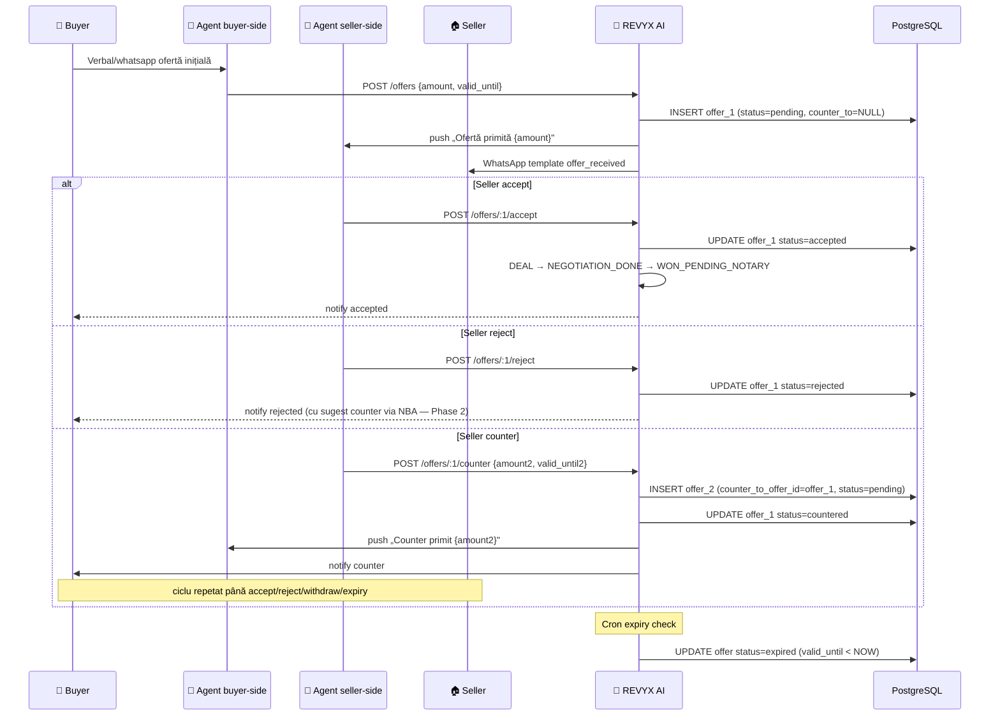

# WORKFLOW — REVYX Offer Chain
<!-- WORKFLOW_REVYX_offer-chain_v1.0.0.md · v1.0.0 · 2026-05 -->
<!-- CONFIDENȚIAL · Uz Intern · © 2026 REVYX · ITPRO SYSTEM SRL -->

## Changelog

| Versiune | Data | Autor | Note |
|---|---|---|---|
| 1.0.0 | 2026-05 | Senior PM + Solution Architect | Workflow inițial — counter-offer chain cu `counter_to_offer_id`, 3-7 runde, status pending/accepted/rejected/countered/withdrawn (BRD §8 OFFER + T07) |

---

## Cuprins

1. [Executive Summary](#1-executive-summary)
2. [Actori implicați](#2-actori-implicați)
3. [Pre-conditions](#3-pre-conditions)
4. [Flow Diagram](#4-flow-diagram)
5. [Etape detaliate](#5-etape-detaliate)
6. [Decision Points](#6-decision-points)
7. [Timing & SLA](#7-timing--sla)
8. [Score impacts](#8-score-impacts)
9. [AUDIT_LOG events](#9-audit_log-events)
10. [Notifications](#10-notifications)
11. [Error / Exception paths](#11-error--exception-paths)
12. [Post-conditions](#12-post-conditions)
13. [Acceptance Criteria](#13-acceptance-criteria)
14. [Glosar specific](#14-glosar-specific)
15. [Impact Assessment](#15-impact-assessment)

---

## 1. Executive Summary

Workflow operațional al lanțului de oferte (Pilon 05 — Negotiation Intelligence). Suportă **3-7 runde de negociere** cu chainging via `counter_to_offer_id` (BRD §8 OFFER + T07). Fiecare ofertă are status `pending / accepted / rejected / countered / withdrawn` și se leagă de cea precedentă printr-un FK self-referențial. Acceptanța avansează DEAL la status `NEGOTIATION → WON_PENDING_NOTARY` (vezi WORKFLOW deal-closure).

| Atribut | Valoare |
|---|---|
| **Scope** | OFFER lifecycle · counter chain · acceptanță · withdraw · validity expiry · DP/DHI re-trigger |
| **Referință BRD** | §5 Pilon 05 · §8 entitate OFFER ★ · §12 T07 (chain A→B→C→D) |
| **Tech spec referite** | match-engine v1.0.0 (DP) · dhi-engine v1.0.0 · audit-log v1.0.0 · whatsapp template `offer_received` |
| **Aplicabilitate** | DEAL în status `NEGOTIATION` (după showing ATTENDED + agent decision) |

---

## 2. Actori implicați

| Actor | Token culoare | Sistem | Responsabilitate |
|---|---|---|---|
| 👤 **Buyer / Cumpărător** | `--buy` | extern | Ofertă inițială · counter · accept/reject |
| 🏠 **Seller / Vânzător** | `--sel` | extern | Counter · accept/reject |
| 🤝 **Agent (buyer side)** | `--agt` | REVYX | Submisie pe behalf buyer · advisory |
| 🤝 **Agent (seller side)** | `--agt` | REVYX | Submisie pe behalf seller · advisory |
| 🤖 **Sistem REVYX AI** | `--ai` | REVYX | Validare chain · expiry validity · counter-offer recommendations · re-trigger DP/DHI |
| 👔 **Manager** | `--mgr` | REVYX | Audit oferte cu valoare anormală · review chain >7 runde |

---

## 3. Pre-conditions

- DEAL în status `NEGOTIATION` (post-showing ATTENDED · feedback ≥ 3).
- LEAD `firewall_state = QUEUED/OVERRIDDEN` exit · status `SHOWING/NEGOTIATION`.
- PROPERTY `status ∈ ('ACTIVE','RESERVED')`.
- GDPR consent buyer activ (BR-06).
- WhatsApp template `offer_received` Meta-aprobat (BR-09).
- Agent autorizat pe deal (`assigned_agent_id = me` sau team_lead+).

---

## 4. Flow Diagram

---

## 5. Etape detaliate

### Etapa 1 — Submisie ofertă inițială

**Trigger:** Agent buyer-side captează ofertă (verbală, telefonică, whatsapp) și submite în sistem

**Actor:** 🤝 Agent (buyer side)

**Acțiuni:**
- POST `/api/v1/offers`:
  - `deal_id`, `offered_by ∈ ('buyer','agent_on_behalf_buyer','seller','agent_on_behalf_seller')`
  - `amount` (NUMERIC ≥ 0), `currency ∈ ('EUR','MDL','USD')`
  - `valid_until` (TIMESTAMPTZ nullable; default NOW+72h dacă null)
  - `notes` text optional cu condiții speciale (e.g., „posesie 30 zile post-act", „rezervare avans 10%")
  - `counter_to_offer_id = NULL` (oferta inițială)
- Validare:
  - DEAL status = NEGOTIATION
  - PROPERTY status ∈ ACTIVE/RESERVED
  - amount > 0
  - `valid_until > NOW()` (dacă specificat)
- INSERT `offer` cu `status='pending'`, `created_at = NOW()`.
- INSERT ACTIVITY `(activity_type='offer_made', metadata.offer_id, .amount, .round=1)`.
- Trimite notificare seller-side:
  - WhatsApp template `offer_received` (BR-09 Meta) cu variables: `property_address`, `amount_formatted`, `valid_until_local`, `agent_name`.
  - Push agent seller-side.

**AUDIT_LOG event:** `OFFER_CREATED` cu `offered_by`, `amount`, `currency`, `valid_until`, `chain_round=1`

**Score impact:**

| Scor | Impact | Magnitude |
|---|---|---|
| LS | Boost | E↑ (ACTIVITY offer_made) |
| IS | None direct | (offer nu e showing) |
| TS | None | — |
| DP | Recalc | LS+IS schimbate → DP recalc |
| DHI | Recalc | DP schimbat |

---

### Etapa 2a — Seller accept (terminal)

**Trigger:** Seller / agent seller-side `POST /offers/:id/accept`

**Actor:** 🏠 Seller / 🤝 Agent (seller side)

**Acțiuni:**
- Validează `offer.status = 'pending'` și `offer.valid_until > NOW()`.
- Tranzacție atomică:
  - UPDATE `offer.status = 'accepted'`, `responded_at = NOW()`.
  - UPDATE `deal.status = 'WON_PENDING_NOTARY'` (handoff la WORKFLOW deal-closure).
  - UPDATE `property.status = 'RESERVED'` (dacă era ACTIVE).
  - INSERT ACTIVITY `(activity_type='status_changed', metadata={offer_accepted: offerId})`.
- Notificare:
  - Buyer push + WhatsApp `offer_accepted` (template Meta dacă consent)
  - Email confirm cu detalii pași notariali
  - Manager notify (audit accept)

**AUDIT_LOG event:** `OFFER_ACCEPTED` cu `accepted_by`, `final_amount`, `chain_length`

**Score impact:**

| Scor | Impact | Magnitude |
|---|---|---|
| LS | Boost | I↑ (intent confirmat) · final state |
| TS | Boost | FV↑ (financial validation implicit) |
| DP | → 1.0 (terminal) | Deal accepted |
| DHI | Re-eval | TF schimbat la post-acceptanță |
| APS | Boost (acumulat) | DCR (Deal Close Rate) ↑ |

> ⏱ Tranziție status DEAL în < 1 sec.

---

### Etapa 2b — Seller reject (terminal pe ofertă, deal continuă)

**Trigger:** Seller `POST /offers/:id/reject` cu reason optional

**Actor:** 🏠 Seller / 🤝 Agent (seller side)

**Acțiuni:**
- UPDATE `offer.status = 'rejected'`, `responded_at = NOW()`, `notes` extins cu reason.
- DEAL rămâne în NEGOTIATION (buyer poate submite ofertă nouă în lanț nou sau abandona).
- INSERT ACTIVITY.
- Notificare buyer + agent buyer-side.
- Sistem NBA suggest (Phase 2): „Counter cu X EUR" bazat pe `match.market_velocity_score`.

**AUDIT_LOG event:** `OFFER_REJECTED` cu `rejection_reason`

**Score impact:**

| Scor | Impact | Magnitude |
|---|---|---|
| TS | Slight ↓ | RC unchanged · BS slight (oscilație negociere) |
| DP | Recalc | LS rămâne, IS slight ↓ |
| DHI | Recalc | RF concurență posibil ↑ dacă pattern repeat |

---

### Etapa 2c — Seller counter (continuă chain)

**Trigger:** Seller `POST /offers/:id/counter { amount, valid_until, notes }`

**Actor:** 🏠 Seller / 🤝 Agent (seller side)

**Acțiuni:**
- Tranzacție atomică:
  - UPDATE `offer_N.status = 'countered'`, `responded_at = NOW()`.
  - INSERT `offer_N+1` cu:
    - `deal_id = offer_N.deal_id`
    - `counter_to_offer_id = offer_N.offer_id` (chain)
    - `offered_by = 'seller'` sau `'agent_on_behalf_seller'`
    - `amount`, `currency`, `valid_until`
    - `status = 'pending'`
- INSERT ACTIVITY `(activity_type='offer_made', metadata.round=N+1, .counter_to=N)`.
- Verifică chain length ≤ 7 (BRD §8 spec). Dacă N+1 = 7 → flag `manager_review_required` în deal.
- Notificare buyer + push agent buyer-side.
- WhatsApp template `offer_counter` (Meta — opțional, intern dacă neaprobat).

**AUDIT_LOG event:** `OFFER_COUNTERED` cu `prev_offer_id`, `new_offer_id`, `chain_round`, `delta_amount`

**Score impact:**

| Scor | Impact | Magnitude |
|---|---|---|
| IS | Boost | MF↑ (offer = high-value message) |
| TS | None | — |
| DP | Recalc | IS schimbat → DP slight ↑ |
| DHI | Recalc | RF concurență probabil 0 (negociere activă) |

---

### Etapa 2d — Withdraw (orice parte renunță voluntar)

**Trigger:** Buyer/Seller `POST /offers/:id/withdraw { reason }`

**Actor:** 👤 Buyer / 🏠 Seller / agent

**Acțiuni:**
- Validare: doar `offered_by` (sau agentul lui) poate retrage.
- UPDATE `offer.status = 'withdrawn'`, `responded_at = NOW()`, `notes` cu reason.
- DEAL rămâne în NEGOTIATION (alta poate continua chain-ul cu o nouă ofertă inițială).
- Notificare counterparty.

**AUDIT_LOG event:** `OFFER_WITHDRAWN` cu `withdrawn_by`, `reason`

**Score impact:**

| Scor | Impact | Magnitude |
|---|---|---|
| TS | Slight ↓ | BS (instabilitate behavior) |
| DP | Recalc | — |

---

### Etapa 3 — Expiry (validity passed)

**Trigger:** Cron `offer.expiry.scan` la `*/10 * * * *` (10 min)

**Actor:** 🤖 AI

**Acțiuni:**
- SELECT `offer` WHERE `status='pending' AND valid_until < NOW()`.
- UPDATE bulk `status='expired'`.
- INSERT ACTIVITY pentru fiecare.
- Notificare counterparty: „Oferta a expirat — re-submit dacă încă interesat".

**AUDIT_LOG event:** `OFFER_EXPIRED` cu `valid_until`

**Score impact:** TS slight ↓ (RC penalizare ușoară pe partea care nu a răspuns).

---

### Etapa 4 — Re-trigger DP/DHI (post-orice tranziție)

**Trigger:** Event `offer.created` / `offer.status_changed`

**Actor:** 🤖 AI

**Acțiuni:**
- Match Engine `recalcForDeal(dealId)` — DP recalc cu IS actualizat.
- DHI Engine `recalcForDeal(dealId)` — DHI recalc cu RF posibil schimbat (concurență 0 dacă chain activ).
- Cache invalidation.

**AUDIT_LOG events:** `DEAL_DP_RECALCULATED`, `DEAL_DHI_RECALCULATED`

---

### Etapa 5 — Manager review pe chain >7 runde

**Trigger:** `chain_round > 7` la counter

**Actor:** 👔 Manager

**Acțiuni:**
- UI flag deal cu badge `🔍 LONG_NEGOTIATION`.
- Email digest manager: lista deals cu chain > 7.
- Manager poate:
  - Forțare cancel (status=`LOST`, `lost_reason='negotiation_stalemate'`)
  - Override și permite continuare (audit)

**AUDIT_LOG event:** `DEAL_LONG_NEGOTIATION_FLAGGED`

---

## 6. Decision Points

| # | Întrebare | Ramuri |
|---|---|---|
| D1 | DEAL status = NEGOTIATION? | DA → INSERT permis; NU → 422 |
| D2 | `valid_until > NOW()` la accept? | DA → accept; NU → 422 EXPIRED |
| D3 | `chain_round` < 7 la counter? | DA → INSERT next; NU → flag manager_review |
| D4 | Counterparty are GDPR consent WhatsApp? | DA → template; NU → fallback email |
| D5 | Property `status = SOLD/WITHDRAWN` în mijloc chain? | DA → toate offers pending → withdrawn auto + notify |
| D6 | Offer reject → buyer poate submite ofertă nouă? | DA cu chain nou (counter_to=NULL); confirmă cu UI |
| D7 | Manager override pe deal LONG_NEGOTIATION? | accept → continuă; cancel → DEAL=LOST |
| D8 | Currency mismatch în chain (EUR ↔ MDL)? | Permis cu rate snapshot la responded_at + audit |

---

## 7. Timing & SLA

| Etapă | Timing țintă | SLA | Sursă |
|---|---|---|---|
| INSERT offer | < 500 ms | — | UX |
| Notificare counterparty | < 30 sec după INSERT | — | UX |
| Accept → DEAL=WON_PENDING_NOTARY | < 1 sec atomic | — | UX |
| Expiry cron precision | ±10 min | — | NFR |
| DP/DHI re-trigger post-offer | ≤ 30s (NFR-01 / 10 min NFR-03) | — | E2E |
| Counter response | nedefinit business · system tracks `time_to_counter_seconds` | — | KPI |

---

## 8. Score impacts (consolidat)

| Etapă | Scor | Tip | Magnitude |
|---|---|---|---|
| Offer initial | LS | Boost | E↑ (ACTIVITY) |
| Offer initial | DP/DHI | Recalc | cascade |
| Accept | LS, TS | Boost | I↑ FV↑ |
| Accept | APS | Boost (acumulat) | DCR↑ |
| Reject | TS | Slight ↓ | BS |
| Counter | IS | Boost | MF↑ |
| Withdraw | TS | Slight ↓ | BS |
| Expiry | TS | Slight ↓ | RC penalizare partea inertă |
| Long negotiation (chain >7) | DHI | RF↑ | Posibil concurență/timeline_slip |

---

## 9. AUDIT_LOG events

| Event | Etapă | Severity |
|---|---|---|
| `OFFER_CREATED` | 1 | INFO |
| `OFFER_ACCEPTED` | 2a | INFO (key tranziție) |
| `OFFER_REJECTED` | 2b | INFO |
| `OFFER_COUNTERED` | 2c | INFO |
| `OFFER_WITHDRAWN` | 2d | INFO |
| `OFFER_EXPIRED` | 3 | INFO |
| `DEAL_DP_RECALCULATED` (cascade) | 4 | INFO |
| `DEAL_DHI_RECALCULATED` (cascade) | 4 | INFO |
| `DEAL_LONG_NEGOTIATION_FLAGGED` | 5 | WARN |
| `DEAL_STATUS_CHANGED_TO_WON_PENDING_NOTARY` | 2a | INFO |

---

## 10. Notifications

| Eveniment | Canal | Destinatar | Template |
|---|---|---|---|
| Offer received | WhatsApp | seller (consent dependent) | `offer_received` (Meta — BR-09) |
| Offer received | Push | agent seller-side | intern |
| Counter received | WhatsApp / push | counterparty | `offer_counter` (Meta dacă aprobat) sau intern push |
| Accept | WhatsApp + email | buyer | `offer_accepted` (Meta dacă aprobat) |
| Accept | Email | manager | intern audit |
| Reject | Push | buyer-side | intern |
| Withdraw | Push | counterparty | intern |
| Expiry | Push + email | counterparty inert | intern reminder |
| Long negotiation chain >7 | Email digest | manager | intern flag |

---

## 11. Error / Exception paths

| Eroare | Etapă | Acțiune |
|---|---|---|
| Optimistic conflict pe offer UPDATE | 2 | Retry max 3× cu backoff |
| Property `SOLD/WITHDRAWN` în mijloc chain | * | Auto-withdraw toate pending + notify · DEAL=LOST cu reason='property_unavailable' |
| Currency unsupported | 1 | 422 — doar EUR/MDL/USD |
| `valid_until ≤ NOW()` la INSERT | 1 | 422 EXPIRED_VALIDITY |
| Accept pe offer status ≠ pending | 2a | 409 INVALID_STATE |
| Counter pe offer status ≠ pending | 2c | 409 |
| Withdraw de către non-owner | 2d | 403 FORBIDDEN |
| WhatsApp template `offer_received` neaprobat | 1 | Fallback push intern + email · audit `WHATSAPP_TEMPLATE_FAILED` |
| Chain >7 fără manager review | 5 | UI block POST counter cu mesaj „manager review required" · 423 LOCKED |
| Concurrent accept + counter (race seller) | 2a/2c | Optimistic lock pe offer.status — primul win |

---

## 12. Post-conditions

| Stare finală chain | Garanții |
|---|---|
| **Accepted** | DEAL=WON_PENDING_NOTARY · property RESERVED · workflow deal-closure preluat |
| **All rejected/withdrawn/expired** | DEAL rămâne NEGOTIATION · agent decide continuă cu chain nou sau LOST |
| **Long negotiation flagged** | Manager UI alert · audit · decisional gate |
| **Property unavailable mid-chain** | Toate pending → withdrawn auto · DEAL=LOST property_unavailable |

---

## 13. Acceptance Criteria

| AC | Validare |
|---|---|
| **AC-OF-01** | Offer initial INSERT cu `counter_to_offer_id=NULL` → status=pending |
| **AC-OF-02** | Counter chain A→B→C→D cu `counter_to_offer_id` corect (T07 BRD §12) |
| **AC-OF-03** | Accept → DEAL=WON_PENDING_NOTARY + property=RESERVED atomic |
| **AC-OF-04** | Counter pe offer expirat → 422 EXPIRED |
| **AC-OF-05** | Cron expiry → status=expired într-un ciclu de 10 min |
| **AC-OF-06** | Property SOLD în mijloc chain → toate pending withdrawn + DEAL=LOST |
| **AC-OF-07** | Chain length 8 (round 8) → 423 manager review required |
| **AC-OF-08** | DP recalc post-offer.created în ≤30s (NFR-01) |
| **AC-OF-09** | WhatsApp `offer_received` fail → fallback email + audit |

---

## 14. Glosar specific

| Termen | Sensul |
|---|---|
| **OFFER** | Entitate ofertă (BRD §8) |
| **Counter chain** | Lanț FK self-referențial via `counter_to_offer_id` |
| **chain_round** | Numărul ofertei în lanț (1=initial, 2=counter primul, etc.) |
| **valid_until** | Termen de valabilitate ofertă |
| **WON_PENDING_NOTARY** | Status DEAL după accept, înainte de actul notarial (vezi WORKFLOW deal-closure) |
| **Long negotiation** | Chain ≥ 8 runde · flag manager review |

---

## 15. Impact Assessment

### 15.1 Scope of Change

| Element | Detaliu |
|---|---|
| Document | WORKFLOW_REVYX_offer-chain_v1.0.0.md |
| Tip schimbare | NEW |
| Aria afectată | Pilon 05 · entitate OFFER (BRD §8) · DEAL status tranziție · scoring DP/DHI cascade |
| Origine | BRD §5 Pilon 05 · §8 OFFER · §12 T07 (chain A→B→C→D) |

### 15.2 Impact pe documente conexe

| Document | Tip impact | Acțiune |
|---|---|---|
| BRD_REVYX_v1.0.0.md | None | Reflectă schema OFFER §8 |
| TECH_SPEC_REVYX_match-engine_v1.0.0.md | Minor | Re-trigger DP la offer events |
| TECH_SPEC_REVYX_dhi-engine_v1.0.0.md | Minor | Re-trigger DHI |
| TECH_SPEC_REVYX_audit-log_v1.0.0.md | Minor | Catalog event extins (`OFFER_*`, `DEAL_LONG_NEGOTIATION_FLAGGED`) |
| WORKFLOW_REVYX_deal-closure_v1.0.0.md (S4) | Major handoff | Accept → WON_PENDING_NOTARY preluat de deal-closure |
| WORKFLOW_REVYX_lead-lifecycle_v1.0.0.md | Minor | Etapa OFFER substituie placeholder |

> **Recomandare:** schema completă OFFER + offer_history view → TECH_SPEC dedicat (S5: `TECH_SPEC_REVYX_offer-engine_v1.0.0.md`). Pentru S4 schema BRD §8 oferă specificația contractuală; tabel concret în spec dedicat.

### 15.3 Impact pe scoring

| Scor | Afectat? | Detaliu |
|---|---|---|
| LS | DA | E↑ pe ACTIVITY offer_made; I↑ la accept |
| IS | DA | MF↑ (offer = high-weight message) |
| TS | DA | RC pe expiry · BS oscilație counter |
| **DP** | DA | Recalc cascadă post-orice tranziție |
| **DHI** | DA | RF concurență 0 dacă negociere activă |
| APS | DA | DCR↑ la accept |

### 15.4 Impact pe entități / schema BD

| Entitate | Modificare | Migrare |
|---|---|---|
| OFFER | NEW (BRD §8) | recomandare TECH_SPEC dedicat S5 — `0120_offer_phase1.sql` |
| DEAL | ALTER (+`status WON_PENDING_NOTARY` enum value · `manager_review_required` flag) | 0121_deal_offer_extensions.sql |
| ACTIVITY | None — INSERT consumer | — |

### 15.5 Impact pe RBAC

| Rol | Permisiuni |
|---|---|
| agent | CRUD offers pe deal-uri proprii |
| senior_agent | + override `valid_until` extension |
| team_lead | view team offers |
| manager | review long negotiation · forțare cancel · override accept |
| admin | config chain max length (default 7) |

### 15.6 Impact pe SLA & NFR

| NFR / SLA | Înainte | După | Validare |
|---|---|---|---|
| NFR-01 (DP recalc) | 30s | enforced cascade | AC-OF-08 |
| Expiry cron precision | nedefinit | ±10 min | AC-OF-05 |
| Accept atomicitate | nedefinit | < 1s | AC-OF-03 |

### 15.7 Impact pe Securitate & GDPR

| Aspect | Status | Notă |
|---|---|---|
| PII | DA | `notes` poate conține condiții cu PII → redact în AUDIT |
| AUDIT_LOG events noi | DA | `OFFER_*` (vezi §9) |
| Consent flow | DA | WhatsApp `offer_received`/`offer_accepted` consent-gated |
| HMAC / JWT / RBAC | DA | RBAC §15.5 |
| Rate limiting | NU | Moștenit |

### 15.8 Risks & Mitigations

| # | Risc | Probab. | Impact | Mitigare |
|---|---|---|---|---|
| R1 | Chain bucle (counter_to_offer_id ciclic) | LOW | MED | Validare la INSERT: counter_to.deal_id == self.deal_id + chain_round increment monoton |
| R2 | Currency rate stale la mix EUR↔MDL | MED | MED | Snapshot rate la `responded_at` · refresh zilnic |
| R3 | Race accept + counter concurrent | MED | HIGH | Optimistic lock pe offer.status · primul win |
| R4 | Property SOLD în mijloc chain | LOW | HIGH | Auto-withdraw cascade · WORKFLOW property-onboarding emite event |
| R5 | WhatsApp `offer_received` neaprobat | LOW | HIGH | BR-09 submission ≥2 săptămâni · email fallback |
| R6 | Long negotiation abuziv (>7) | LOW | MED | Manager review gate la round 8 · flag UI |
| R7 | Withdrawal de non-owner | LOW | LOW | RBAC + ownership check |

### 15.9 Test Plan

Vezi §13 — toate AC-OF-01..09 acoperite în E2E + integration. Test specific T07 (chain A→B→C→D).

### 15.10 Rollout & Rollback

| Aspect | Detaliu |
|---|---|
| Feature flag | `flag.offer_chain_v1.enabled` (prerequisite `match_engine_v1.enabled` pentru DP cascadă) |
| Strategie rollout | canary 10% → 50% → 100% în 2 săptămâni |
| Rollback | Flag OFF · offers existente păstrate read-only · jobs cron paused |
| Owner | Senior PM + Solution Architect |

### 15.11 Approval Gate

| Aprobator | Necesar pentru |
|---|---|
| Senior PM | Workflow alignment cu BRD §5 Pilon 05 + §8 OFFER |
| Solution Architect | Schema chain (FK self-ref) · atomicitate accept · cascade re-trigger |
| Security Lead | PII redaction notes · AUDIT events · template Meta |
| Legal / DPO | Acceptanță legală a ofertei (formă electronică) · template `offer_received`/`offer_accepted` compliance |

---

*docs/workflow/WORKFLOW_REVYX_offer-chain_v1.0.0.md · v1.0.0 · 2026-05 · CONFIDENȚIAL · Uz Intern*
*REVYX — Real Estate Execution Intelligence · © 2026 REVYX · ITPRO SYSTEM SRL*
