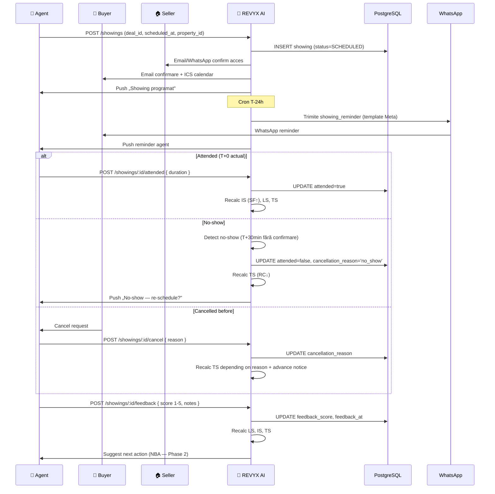

# WORKFLOW — REVYX Showing Flow
<!-- WORKFLOW_REVYX_showing-flow_v1.0.0.md · v1.0.0 · 2026-05 -->
<!-- CONFIDENȚIAL · Uz Intern · © 2026 REVYX · ITPRO SYSTEM SRL -->

## Changelog

| Versiune | Data | Autor | Note |
|---|---|---|---|
| 1.0.0 | 2026-05 | Senior PM + Solution Architect | Workflow inițial — SCHEDULED → REMINDER → ATTENDED/NO_SHOW → FEEDBACK → IS+LS update |

---

## Cuprins

1. [Executive Summary](#1-executive-summary)
2. [Actori implicați](#2-actori-implicați)
3. [Pre-conditions](#3-pre-conditions)
4. [Flow Diagram](#4-flow-diagram)
5. [Etape detaliate](#5-etape-detaliate)
6. [Decision points](#6-decision-points)
7. [Timing & SLA](#7-timing--sla)
8. [Score impacts](#8-score-impacts)
9. [AUDIT_LOG events](#9-audit_log-events)
10. [Notifications](#10-notifications)
11. [Error / Exception paths](#11-error--exception-paths)
12. [Post-conditions](#12-post-conditions)
13. [Acceptance Criteria](#13-acceptance-criteria)
14. [Glosar specific](#14-glosar-specific)
15. [Impact Assessment](#15-impact-assessment)

---

## 1. Executive Summary

Workflow detaliat al unei vizionări (SHOWING) — entitate critică pentru calculul IS (BRD §7.3 — `SF = Showing Frequency`) și impact direct asupra LS, TS și DP. Acoperă programare, reminder T-24h via WhatsApp template Meta-aprobat, prezență/absență, capturare feedback post-vizionare cu update scoruri.

| Atribut | Valoare |
|---|---|
| **Scope** | SCHEDULED → REMINDER (T-24h) → ATTENDED / NO_SHOW / CANCELLED → FEEDBACK → recalc IS+LS+TS |
| **Referință BRD** | §5 Pilon 04 · §7.3 IS · §8 SHOWING · §6.3 BR-09 (template Meta) |
| **Tech spec referite** | lead-scoring v1.0.0 · audit-log v1.0.0 · property v1.0.0 |
| **Aplicabilitate** | Toate property_type · transaction_type sale + rent |

---

## 2. Actori implicați

| Actor | Token culoare | Sistem | Responsabilitate |
|---|---|---|---|
| 🤝 **Agent Imobiliar** | `--agt` | REVYX | Programare · prezență · capturare feedback |
| 👤 **Buyer / Client** | `--buy` | extern + REVYX | Confirmare programare · participare · feedback voluntar |
| 🏠 **Seller / Proprietar** | `--sel` | extern + REVYX | Disponibilitate proprietate · acces fizic |
| 🤖 **Sistem REVYX AI** | `--ai` | REVYX | Reminder · recalc scoruri · alertă risk |
| 👔 **Manager** | `--mgr` | REVYX | Audit no-show frecvent · review feedback negativ |

---

## 3. Pre-conditions

- DEAL existent care leagă LEAD ↔ PROPERTY ↔ AGENT (creat după FIREWALL+match minim).
- LEAD în status `CONTACTED` sau `QUALIFIED` (vezi WORKFLOW lead-lifecycle).
- PROPERTY în status `ACTIVE` sau `RESERVED` (proprietate disponibilă pentru vizionare).
- Agent `is_active = true` și `tasks_active < 3` (BR-04).
- WhatsApp template `showing_reminder` Meta-aprobat (BR-09).
- GDPR consent buyer activ (BR-06) — pentru notificări WhatsApp/email.

---

## 4. Flow Diagram



---

## 5. Etape detaliate

### Etapa 1 — SCHEDULED (programare)

**Trigger:** Agent acțiune „Programează vizionare" sau scheduling automat (Phase 2)

**Actor:** 🤝 Agent

**Acțiuni:**
- Agent selectează `deal_id`, `property_id`, `lead_id`, `scheduled_at` (UTC+2 forțat — C-06)
- Verificare conflict calendar agent (`agent.calendar_sync_token` Phase 2)
- Verificare disponibilitate property (`status = ACTIVE/RESERVED`)
- INSERT `showing`:
  ```sql
  INSERT INTO showing (showing_id, tenant_id, deal_id, property_id, lead_id, agent_id,
                       scheduled_at, status)
  VALUES (gen_random_uuid(), :t, :d, :p, :l, :a, :ts AT TIME ZONE 'Europe/Chisinau', 'SCHEDULED');
  ```
- Notificare seller (acces fizic) — email/WhatsApp dacă consimțământ
- Notificare buyer — email confirmare + ICS attachment + intern push
- INSERT ACTIVITY `(entity_type='lead', activity_type='showing', metadata.scheduled_at)` pentru SF agregat

**AUDIT_LOG event:** `SHOWING_SCHEDULED` cu `scheduled_at`, `property_id`, `agent_id`

**Score impact:** preliminar SF↑ (intent showing) — recalc complet la ATTENDED

---

### Etapa 2 — REMINDER (T-24h)

**Trigger:** Cron `showing.reminder.tick` la `scheduled_at - 24h`

**Actor:** 🤖 AI

**Acțiuni:**
- Verifică `showing.status = SCHEDULED` (skip dacă deja CANCELLED)
- Trimite WhatsApp template `showing_reminder` la buyer (BR-09 Meta-aprobat):
  - Variables: `property_address`, `scheduled_at_local`, `agent_name`, `agent_phone`
- Push agent „Reminder: vizionare la {time}"
- INSERT ACTIVITY `(activity_type='message_sent', channel='whatsapp', metadata.template='showing_reminder')`

**AUDIT_LOG event:** `SHOWING_REMINDER_SENT`

**Score impact:** TS slight (RC dacă buyer răspunde reminder)

> ⏱ **Timing:** T-24h fix · idempotent (jobId stable `reminder:{showing_id}`)

---

### Etapa 3a — ATTENDED (prezență)

**Trigger:** Agent acțiune „Marcăm prezent" post-vizionare

**Actor:** 🤝 Agent + 👤 Buyer

**Acțiuni:**
- Agent confirmă prezența + completează `duration_minutes` (durata efectivă)
- UPDATE `showing`:
  ```sql
  UPDATE showing SET attended=true, duration_minutes=:d, status='ATTENDED'
  WHERE showing_id=:id;
  ```
- INSERT ACTIVITY `(activity_type='showing', duration_seconds=:d*60, channel='in_app')`
- Trigger evenimente recalc:
  - `lead.score.recalc` (LS, TS, IS)
  - DHI recalc pe DEAL (Phase 2)
  - APS update agent (DCR contribuie indirect prin conversion)

**AUDIT_LOG events:**
- `SHOWING_ATTENDED` cu `duration_minutes`

**Score impact:**

| Scor | Impact | Magnitude approximativă |
|---|---|---|
| LS | Boost | +0.05 (engagement E↑ via ACTIVITY) |
| IS | Boost | SF normalizat ↑ (BRD §7.3: SF / SF_NORMALIZER=3) |
| TS | Boost | RC↑ (dacă răspuns rapid la programare/reminder) |

---

### Etapa 3b — NO_SHOW

**Trigger:** Agent acțiune SAU detectare automată (T+30min fără confirmare prezență)

**Actor:** 🤝 Agent sau 🤖 AI

**Acțiuni:**
- UPDATE `showing` cu `attended=false`, `cancellation_reason='no_show'`, `status='NO_SHOW'`
- INSERT ACTIVITY `(activity_type='showing', metadata.no_show=true)` — folosit pentru RC penalizare
- Trigger recalc TS (RC↓ — Response Consistency penalizat)
- Push agent „No-show — re-schedule?" cu UI quick action

**Decision automat:**
- 1 no-show → soft warning (TS slight ↓)
- 2 no-shows consecutive → manager flag în Manager Override Audit
- 3 no-shows consecutive → LEAD auto-status `LOST` cu `lost_reason='cooling_off'` (vezi WORKFLOW lead-lifecycle Etapa 7)

**AUDIT_LOG events:**
- `SHOWING_NO_SHOW`
- `LEAD_LOST` (dacă 3rd consecutive — cu lost_reason='cooling_off')

**Score impact:**

| Scor | Impact | Magnitude |
|---|---|---|
| TS | Penalizare | RC↓ (no-show contează în behavior_stability) |
| LS | Penalizare | E↓ (engagement) |
| IS | Neutru | SF nu crește (showing nepartipat nu count) |

---

### Etapa 3c — CANCELLED (înainte de scheduled_at)

**Trigger:** Buyer/Agent/Seller anulează în avans

**Actor:** 🤝 Agent (initiator) sau 👤 Buyer (via UI public sau WhatsApp reply)

**Acțiuni:**
- Agent / sistem capturează `cancellation_reason ∈ ('reschedule', 'lead_cancelled', 'agent_cancelled', 'other')`
- UPDATE `showing.status = 'CANCELLED'` cu reason și `cancelled_at`
- Cancel reminder job dacă încă nu trimis

**Decision:**
- Cancel >24h advance → TS impact minim (răspuns OK)
- Cancel <24h advance → TS slight ↓ (RC penalizare ușoară)
- Cancel by agent → APS minor (Manager review dacă frecvent)

**AUDIT_LOG event:** `SHOWING_CANCELLED` cu `cancellation_reason` și advance_notice_hours

**Score impact:** dependent de reason + advance notice (vezi tabel §8)

---

### Etapa 4 — FEEDBACK (post-ATTENDED)

**Trigger:** Agent completează feedback formular (UI după showing) — ideal în ≤ 24h

**Actor:** 🤝 Agent (input principal); 👤 Buyer (input opțional via WhatsApp follow-up)

**Acțiuni:**
- Agent: `feedback_score ∈ [1-5]` (interes buyer post-vizionare) + `feedback_notes` (text)
- UPDATE `showing.feedback_score`, `feedback_notes`, `feedback_at = NOW()`
- INSERT ACTIVITY `(activity_type='note_added', metadata.feedback_score)` pentru semnal LS
- Recalc LS imediat:
  - `feedback_score = 5` → LS boost +0.10 (intent E↑)
  - `feedback_score = 4` → LS boost +0.05
  - `feedback_score = 3` → LS neutru
  - `feedback_score = 2` → LS penalty -0.05
  - `feedback_score = 1` → LS penalty -0.10 + UI suggest „Mark cooling off"

**AUDIT_LOG event:** `SHOWING_FEEDBACK_RECORDED` cu `feedback_score` (notes redacted dacă conțin PII)

**Score impact:**

| feedback_score | LS delta | IS impact | TS impact |
|---|---|---|---|
| 5 (foarte interesat) | +0.10 | SF count + duration weight | TS boost (BS) |
| 4 | +0.05 | SF count | TS slight boost |
| 3 (neutru) | 0 | SF count | neutru |
| 2 | -0.05 | SF count (dar low quality) | TS slight ↓ |
| 1 (deloc interesat) | -0.10 + LOST suggest | SF count | TS ↓ (BS) |

---

### Etapa 5 — Recalc + NBA (post-feedback)

**Trigger:** event `lead.score.updated` post-feedback

**Actor:** 🤖 AI

**Acțiuni:**
- Recalc complet LS/IS/TS via lead-scoring engine (vezi TECH_SPEC lead-scoring §6.6)
- Recalc DHI pe DEAL (Phase 2 — depinde de NBA + DHI engines)
- Sugestie NBA agent: next action (e.g., follow-up call, send another property, draft offer) — Phase 2
- Dacă feedback_score ∈ {4,5}: sugerează agent să propună următorul pas (offer / second showing)
- Dacă feedback_score ∈ {1,2}: sugerează re-match cu inventory diferit

**AUDIT_LOG events:**
- `LEAD_SCORE_UPDATED` (din scoring engine)
- `DEAL_DHI_RECALCULATED` (Phase 2)
- `NBA_RECOMMENDATION_GENERATED` (Phase 2)

---

## 6. Decision points

| # | Întrebare | Ramuri |
|---|---|---|
| D1 | Conflict calendar agent? | DA → block + sugest alternative; NU → schedule |
| D2 | Property `status ∈ (SOLD, WITHDRAWN)`? | DA → reject schedule; NU → continuă |
| D3 | Buyer GDPR consent activ pentru WhatsApp? | DA → reminder via WhatsApp; NU → fallback email-only |
| D4 | T+30min fără confirmare prezență? | DA → auto NO_SHOW; NU → așteaptă agent input |
| D5 | No-show consecutive count? | 1 → soft warn; 2 → manager flag; 3 → LEAD=LOST cooling_off |
| D6 | Cancel advance notice? | >24h → TS impact minim; <24h → RC↓ |
| D7 | feedback_score = 5? | Sugerează agent următorul pas (offer / second showing) |
| D8 | feedback_score ≤ 2? | Sugerează re-match inventory diferit · UI „mark cooling off" |
| D9 | Feedback nu completat în 48h post-ATTENDED? | Sistem prompt agent (push) · APS minor penalty |

---

## 7. Timing & SLA

| Etapă | Timing țintă | SLA | Sursă |
|---|---|---|---|
| INSERT showing | < 500 ms | — | UX |
| Reminder T-24h | exact (cron tolerance ±5 min) | — | NFR |
| No-show auto-detect | T+30min după scheduled_at | — | UX |
| ATTENDED → recalc LS | < 30 sec | NFR-01 | BRD §6.2 |
| Feedback completion | ≤ 48h post-ATTENDED | soft target | KPI |
| Notificare seller acces | < 5 min după SCHEDULED | — | UX |

---

## 8. Score impacts (consolidat)

| Etapă | Scor | Tip | Magnitude |
|---|---|---|---|
| SCHEDULED | IS preliminary | preliminary | SF intent (nu count final) |
| REMINDER (răspuns buyer rapid) | TS | Boost | RC↑ slight |
| ATTENDED | LS | Boost | +0.05 (E↑) |
| ATTENDED | IS | Boost | SF actual count în window 7d |
| ATTENDED + duration > 30 min | IS | Boost | SF + signal calitate |
| NO_SHOW | TS | Penalizare | RC↓ + BS↓ |
| NO_SHOW × 3 | LEAD | LOST | cooling_off · APS DCR↓ |
| CANCELLED >24h | TS | Neutru | RC OK |
| CANCELLED <24h | TS | Penalizare slight | RC↓ |
| Feedback 5 | LS | Boost | +0.10 |
| Feedback 4 | LS | Boost | +0.05 |
| Feedback 3 | LS | Neutru | 0 |
| Feedback 2 | LS | Penalizare | -0.05 |
| Feedback 1 | LS | Penalizare | -0.10 + LOST suggest |

> Magnitude-le sunt aproximative — formulele finale aplică `clamp01` și recalc complet bazat pe ACTIVITY window. Vezi TECH_SPEC lead-scoring §6.

---

## 9. AUDIT_LOG events

| Event | Etapă | Severity |
|---|---|---|
| `SHOWING_SCHEDULED` | 1 | INFO |
| `SHOWING_REMINDER_SENT` | 2 | INFO |
| `SHOWING_ATTENDED` | 3a | INFO |
| `SHOWING_NO_SHOW` | 3b | WARN |
| `SHOWING_CANCELLED` | 3c | INFO/WARN (depending on reason + advance) |
| `SHOWING_FEEDBACK_RECORDED` | 4 | INFO |
| `LEAD_SCORE_UPDATED` (cascadă) | 3a / 4 / 5 | INFO |
| `LEAD_LOST` (3 NO_SHOW consecutive) | 3b | INFO (cu lost_reason='cooling_off') |
| `NBA_RECOMMENDATION_GENERATED` (Phase 2) | 5 | INFO |

---

## 10. Notifications

| Eveniment | Canal | Destinatar | Template |
|---|---|---|---|
| SCHEDULED — buyer confirm | Email + ICS | buyer | intern tranzacțional + ICS |
| SCHEDULED — seller acces | WhatsApp / email | seller | intern (consent dependent) |
| SCHEDULED — agent push | Push in-app | agent | intern |
| REMINDER T-24h | WhatsApp | buyer | `showing_reminder` (Meta-aprobat — BR-09) |
| REMINDER T-24h | Push | agent | intern |
| ATTENDED confirm | Push | agent (next action prompt) | intern |
| NO_SHOW detected | Push | agent | intern „Re-schedule?" quick action |
| 3rd NO_SHOW | Email digest | manager | intern (audit flag) |
| FEEDBACK pending T+24h | Push | agent | intern reminder |
| Feedback 5 | Push | agent | intern „Suggest next step" |
| Feedback 1 | Push | agent + manager | intern (concern) |

> ⚠ WhatsApp `showing_reminder` strict Meta-aprobat (BR-09). Restul template-uri sunt intern-tranzacționale (email/push) sau session-based 24h window WhatsApp.

---

## 11. Error / Exception paths

| Eroare | Etapă | Acțiune |
|---|---|---|
| Conflict calendar agent | 1 | 409 + UI sugerează alt slot |
| Property SOLD/WITHDRAWN după programare | 1-3 | Auto-cancel + notify buyer + agent |
| WhatsApp template trimis fail | 2 | Retry 3× backoff · fallback email · audit `WHATSAPP_TEMPLATE_FAILED` |
| Buyer GDPR consent revocat după programare | 2-4 | Skip WhatsApp · doar email · log |
| Optimistic conflict pe SHOWING UPDATE | 3 | Retry max 3× backoff |
| Cron reminder ratează (jitter > 30 min) | 2 | Re-run manual cu idempotent jobId |
| Feedback score în afara [1-5] | 4 | 422 + UI validation |
| Auto-detect no-show ratează (cron lag) | 3b | Cron monitoring + alert pe lag >5 min |
| LEAD în status LOST după 3rd no-show — agent încearcă re-schedule | 3b | 409 · UI cere manager override |

---

## 12. Post-conditions

| Stare finală SHOWING | Garanții |
|---|---|
| **ATTENDED + feedback completat** | ACTIVITY logate · LS/IS/TS recalculate · DHI Phase 2 · NBA suggest |
| **ATTENDED + feedback pending** | LS recalc preliminary · agent prompt T+24h |
| **NO_SHOW** | TS penalizat · counter consecutive incrementat · LEAD status checked |
| **CANCELLED** | reason + advance_notice logate · impact TS dependent |
| **3 NO_SHOW** | LEAD = LOST (cooling_off) · agent reassigned dacă necesar |

---

## 13. Acceptance Criteria

| AC | Validare |
|---|---|
| **AC-SH-01** | SHOWING SCHEDULED → reminder T-24h trimis exact (±5 min) |
| **AC-SH-02** | ATTENDED → IS recalc cu SF↑ în ≤30s (NFR-01) |
| **AC-SH-03** | NO_SHOW → TS penalizat în ≤30s |
| **AC-SH-04** | 3 NO_SHOW consecutive → LEAD auto-LOST cu lost_reason='cooling_off' |
| **AC-SH-05** | feedback_score=5 → LS boost vizibil în dashboard în ≤30s |
| **AC-SH-06** | WhatsApp template `showing_reminder` Meta-aprobat — fail trimite → fallback email |
| **AC-SH-07** | GDPR consent revocat → WhatsApp skip · doar email |

---

## 14. Glosar specific

| Termen | Sensul |
|---|---|
| **SHOWING** | Vizionare programată (entitate BRD §8) |
| **SF** | Showing Frequency — sub-componentă IS (formula `0.40*SF + ...`) |
| **No-show** | Buyer absent fără cancel în avans |
| **Reminder T-24h** | WhatsApp `showing_reminder` Meta-aprobat trimis cu 24h înainte |
| **feedback_score** | [1-5] — interesul buyer-ului post-vizionare (input agent) |
| **Cooling off** | LOST reason când lead pierde interes (3 no-show indicator) |
| **Advance notice** | Câte ore înainte de scheduled_at a fost notificat cancel-ul |

---

## 15. Impact Assessment

### 15.1 Scope of Change

| Element | Detaliu |
|---|---|
| Document | WORKFLOW_REVYX_showing-flow_v1.0.0.md |
| Tip schimbare | NEW |
| Aria afectată | Pilon 04 (Execution) · entitate SHOWING · scoring IS/LS/TS · BR-09 template |
| Origine | BRD §5 Pilon 04 · §7.3 IS · §8 SHOWING · §6.3 BR-09 |

### 15.2 Impact pe documente conexe

| Document | Tip impact | Acțiune |
|---|---|---|
| BRD_REVYX_v1.0.0.md | None | Reflectă mecanica spec |
| TECH_SPEC_REVYX_lead-scoring_v1.0.0.md | None | Workflow consumă SF în IS |
| TECH_SPEC_REVYX_audit-log_v1.0.0.md | Minor | Catalog event extins (`SHOWING_REMINDER_SENT`, `SHOWING_FEEDBACK_RECORDED`, `WHATSAPP_TEMPLATE_FAILED`) |
| WORKFLOW_REVYX_lead-lifecycle_v1.0.0.md | None | Etapa 5 referențiază acest workflow |
| WORKFLOW_REVYX_offer-chain (S4) | Minor | Feedback ≥4 → suggest offer |

### 15.3 Impact pe scoring

| Scor | Afectat? | Detaliu |
|---|---|---|
| **IS** | DA | SF (0.40 weight) actualizat la ATTENDED |
| **LS** | DA | E (engagement) + feedback_score impact |
| **TS** | DA | RC + BS impacted la no-show / cancel |
| DP | DA (indirect) | DP = 0.30*LS + 0.20*IS + ... |
| DHI | DA (Phase 2) | Recalc post-showing |
| APS | DA (slight) | DCR penalizat dacă agent cancel frecvent |

### 15.4 Impact pe entități / schema BD

| Entitate | Modificare | Migrare |
|---|---|---|
| SHOWING | None — schemă deja în BRD §8 (DEAL/SHOWING extension) | TBD în spec dedicat (recomandare S4: `0080_showing_phase1.sql` cu schema completă) |
| ACTIVITY | None | — |

> **Notă:** schema concretă SHOWING ar trebui formalizată într-un TECH_SPEC dedicat (recomandare pentru S4). Pentru acum BRD §8 oferă specificația contractuală.

### 15.5 Impact pe RBAC

| Rol | Permisiuni |
|---|---|
| agent | CRUD showing pentru lead-ul propriu · capture feedback |
| team_lead | View echipă showings · audit no-show patterns |
| manager | Audit no-show frecvent · view feedback negative |
| admin | Config thresholds (feedback magnitude, no-show consecutive trigger) |

### 15.6 Impact pe SLA & NFR

| NFR / SLA | Înainte | După | Validare |
|---|---|---|---|
| NFR-01 (recalc LS) | nedefinit | ≤ 30 sec | AC-SH-02 |
| Reminder T-24h precision | nedefinit | ±5 min | AC-SH-01 |
| No-show detect | nedefinit | T+30min | AC-SH-03 |

### 15.7 Impact pe Securitate & GDPR

| Aspect | Status | Notă |
|---|---|---|
| PII | DA | `feedback_notes` poate conține PII → redactat în AUDIT |
| AUDIT_LOG events noi | DA | Vezi §9 |
| Consent flow | DA | WhatsApp reminder respect consent · revocation handled |
| HMAC / JWT / RBAC | DA | RBAC §15.5 |
| Rate limiting | NU | Moștenit |

### 15.8 Risks & Mitigations

| # | Risc | Probab. | Impact | Mitigare |
|---|---|---|---|---|
| R1 | Agent uită feedback → LS stale | MED | MED | Push reminder T+24h + APS minor penalty pentru pending feedback >48h |
| R2 | No-show false-positive (agent uită mark) | MED | MED | Cron T+30min + agent override în UI |
| R3 | WhatsApp `showing_reminder` neaprobat de Meta | LOW | HIGH | Submisie ≥2 săptămâni (BRD C-02) · fallback email validat E2E |
| R4 | GDPR consent revocat post-schedule | LOW | LOW | Auto-fallback email · log skip WhatsApp |
| R5 | Conflict calendar agent | MED | LOW | Validare la SCHEDULED · UI suggest alternative |
| R6 | Buyer nu primește reminder (number invalid) | MED | MED | Detection delivery fail · auto fallback email + notify agent |
| R7 | Agent cancel frecvent → APS↓ neechitabil | LOW | MED | Manager review · cancel reason audit |

### 15.9 Test Plan

Vezi §13 — toate AC-SH-01..07 acoperite în E2E + integration.

### 15.10 Rollout & Rollback

| Aspect | Detaliu |
|---|---|
| Feature flag | `flag.showing_flow_v1.enabled` (cu prerequisite `lead_scoring_v1.enabled`) |
| Strategie rollout | canary 10% → 50% → 100% în 2 săptămâni |
| Rollback | Flag OFF · showings existente păstrate read-only · cron paused |
| Owner | Senior PM + Solution Architect |

### 15.11 Approval Gate

| Aprobator | Necesar pentru |
|---|---|
| Senior PM | Workflow alignment cu BRD §5 Pilon 04 |
| Solution Architect | Schema SHOWING (recomandare TECH_SPEC dedicat S4) · cron orchestration |
| Security Lead | GDPR consent gate WhatsApp · AUDIT events |
| Legal / DPO | Feedback PII redaction · template Meta compliance |

---

*docs/workflow/WORKFLOW_REVYX_showing-flow_v1.0.0.md · v1.0.0 · 2026-05 · CONFIDENȚIAL · Uz Intern*
*REVYX — Real Estate Execution Intelligence · © 2026 REVYX · ITPRO SYSTEM SRL*
