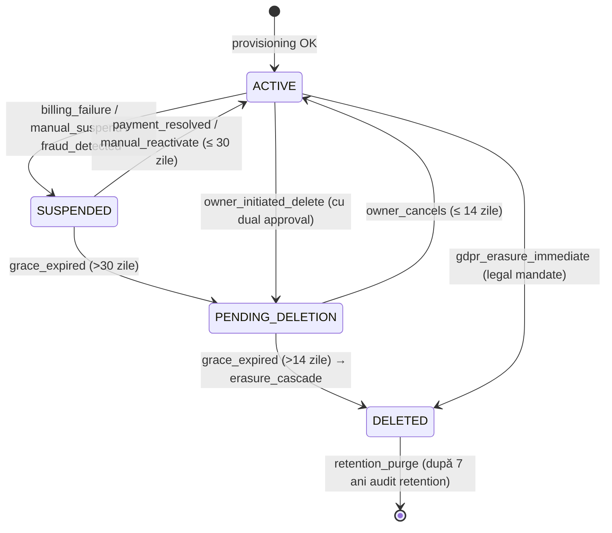

# WORKFLOW — REVYX Tenant Lifecycle
<!-- WORKFLOW_REVYX_tenant-lifecycle_v1.0.0.md · v1.0.0 · 2026-05 -->
<!-- CONFIDENȚIAL · Uz Intern · © 2026 REVYX · ITPRO SYSTEM SRL -->

## Changelog

| Versiune | Data | Autor | Note |
|---|---|---|---|
| 1.0.0 | 2026-05 | Senior PM + Solution Architect | Workflow inițial — ACTIVE → SUSPENDED → PENDING_DELETION → DELETED |

---

## Cuprins

1. [Executive Summary](#1-executive-summary)
2. [Actori implicați](#2-actori-implicați)
3. [Pre-conditions](#3-pre-conditions)
4. [State diagram](#4-state-diagram)
5. [Etape detaliate](#5-etape-detaliate)
6. [Decision points](#6-decision-points)
7. [Timing & SLA](#7-timing--sla)
8. [Score impacts](#8-score-impacts)
9. [AUDIT_LOG events](#9-audit_log-events)
10. [Notifications](#10-notifications)
11. [Error / Exception paths](#11-error--exception-paths)
12. [Post-conditions](#12-post-conditions)
13. [Acceptance Criteria](#13-acceptance-criteria)
14. [Glosar specific](#14-glosar-specific)
15. [Impact Assessment](#15-impact-assessment)

---

## 1. Executive Summary

Acest workflow descrie ciclul de viață al unui **TENANT** REVYX, de la stare activă până la eliminarea completă a datelor. Acoperă 4 stări (`ACTIVE`, `SUSPENDED`, `PENDING_DELETION`, `DELETED`) și 5 triggers principali (billing failure, manual suspend, owner-initiated delete, GDPR erasure cascade, retention purge).

| Atribut | Valoare |
|---|---|
| **Scope** | Lifecycle complet TENANT — de la suspend până la purge |
| **Referință BRD** | §6.1 BR-06 GDPR · §9 Securitate · §10 RBAC |
| **Tech spec referite** | tenancy-roles-extension v1.0.0 · audit-log v1.0.0 |
| **Aplicabilitate** | Toate cele 6 modele: SOLO, AGENCY, NETWORK, FRANCHISE, MARKETPLACE, ENTERPRISE |

---

## 2. Actori implicați

| Actor | Sistem | Responsabilitate |
|---|---|---|
| 👔 **Manager / Owner tenant** (`--mgr`) | REVYX | Solicitări manuale (suspend, delete, transfer) · approval pe acțiuni critice |
| 🤖 **Sistem REVYX AI** (`--ai`) | REVYX | Detecție trigger automat · execuție tranziții · cascade GDPR |
| 👔 **Admin REVYX (ITPRO)** (`--mgr`) | REVYX | Override · re-activare · anulare delete în fereastra grace |
| 💳 **Sistem Billing** (`--bnk` reutilizat) | extern + REVYX | Detectează failure plată · notifică sistem |
| ⚖️ **Legal / DPO** (`--not` reutilizat) | extern + REVYX | Aprobă purge legal hold · validează GDPR erasure |

---

## 3. Pre-conditions

- Tenant există în starea `ACTIVE` cu cel puțin 1 user `owner`.
- AUDIT_LOG operațional (TECH_SPEC_audit-log).
- RBAC custom roles seed-uite (TECH_SPEC_tenancy-roles-extension).
- Backup automatizat funcțional (PITR + logical dumps).
- Notificare canal configurat (email + WhatsApp pentru owner).

---

## 4. State diagram



---

## 5. Etape detaliate

### Etapa 1 — Detecție trigger SUSPEND

**Trigger:** unul dintre:
1. **Billing failure**: 3 încercări de încasare eșuate consecutiv (după 7-14-30 zile)
2. **Manual suspend**: owner / admin REVYX execută acțiune din UI
3. **Fraud detected**: scor automat > prag (Phase 2) sau alertă Security Lead

**Actor:** 🤖 Sistem REVYX AI (1 + 3) sau 👔 Manager/Owner (2)

**Acțiuni sistem:**
- Validare stare curentă = `ACTIVE`
- Pre-check: dacă există deal-uri în stadiu critic (DHI < 0.40) → adaugă warning, dar nu blochează
- Tranziție atomică: `tenant.status = 'SUSPENDED'`, `tenant.suspended_at = NOW()`, `tenant.suspend_reason = <enum>`

**AUDIT_LOG event:** `TENANT_SUSPENDED`

```yaml
entity_type: TENANT
entity_id: <tenant_id>
old_value: { status: 'ACTIVE' }
new_value: { status: 'SUSPENDED', suspend_reason: '<billing_failure | manual | fraud>' }
metadata: { triggered_by: '<system|user_id>', grace_period_days: 30 }
```

---

### Etapa 2 — Comportament în SUSPENDED

> ⏱ **Grace period: 30 zile**

**Acces:**
- Login `owner` → permis (poate rezolva billing, vedea dashboard read-only)
- Restul rolurilor → 403 + pagina „Tenant suspended"
- API calls → 403 cu cod `TENANT_SUSPENDED`
- Webhooks intake → respinse cu `503` (sursele retry sau eventual deprovision endpoint)

**Sistem:**
- Niciun job de scoring nu rulează (LS, PS, IS, DP, NBA, TS, APS, DHI înghețate)
- Niciun NBA generat → niciun task nou
- Lead-uri inbound respinse la receiver (`503`)
- Notificări push/WhatsApp către agenți: pauză

**Date:**
- Toate datele rămân la locul lor (NU se șterge nimic)
- Backup-urile continuă

---

### Etapa 3 — Tranziție SUSPENDED → ACTIVE (recovery)

**Trigger:** plată rezolvată (webhook billing) SAU manual reactivate de admin REVYX

**Pre-conditions:**
- Tenant în `SUSPENDED` cu `suspended_at + 30 zile > NOW()`
- Pentru billing: factura curentă marcată plătită

**Acțiuni:**
- `tenant.status = 'ACTIVE'`, `tenant.suspended_at = NULL`, `tenant.suspend_reason = NULL`
- Repornire job-uri scoring (recalcul DHI prioritar pentru deal-urile active)
- Re-activare receiver webhook
- Notificare owner + agenți: „Tenant reactivat"

**AUDIT_LOG event:** `TENANT_REACTIVATED`

---

### Etapa 4 — Tranziție SUSPENDED → PENDING_DELETION (grace expired)

**Trigger:** job nightly detectează `suspended_at + 30 zile < NOW()`

**Actor:** 🤖 Sistem REVYX AI

**Acțiuni:**
- Notificare email + WhatsApp `owner` cu **30 zile înainte** de expirare grace (T+0, T+15, T+25, T+29)
- La T+30: tranziție `SUSPENDED → PENDING_DELETION`
- Setare `tenant.deletion_scheduled_at = NOW() + 14 zile`

**AUDIT_LOG event:** `TENANT_PENDING_DELETION`

---

### Etapa 5 — Owner-initiated delete (path direct)

**Trigger:** owner solicită delete din UI

**Pre-conditions:**
- Stare `ACTIVE` sau `SUSPENDED`
- Dual approval: doi `owner` distincti SAU 1 `owner` + 24h delay automat
- Confirmare typed: utilizatorul scrie `DELETE <tenant_name>` în câmp text

**Acțiuni:**
- Tranziție → `PENDING_DELETION`
- `tenant.deletion_requested_by = user_id`, `tenant.deletion_scheduled_at = NOW() + 14 zile`
- Notificare toate rolurile `manager+`: „Tenant scheduled for deletion T+14d"

**AUDIT_LOG event:** `TENANT_DELETION_REQUESTED`

---

### Etapa 6 — Comportament în PENDING_DELETION

> ⏱ **Grace de anulare: 14 zile**

- Owner poate anula delete: `PENDING_DELETION → ACTIVE` cu AUDIT_LOG event `TENANT_DELETION_CANCELLED`
- Restul comportamentului identic cu SUSPENDED (read-only, fără scoring, webhooks blocate)
- Notificare owner la T+0, T+7, T+12, T+13 din 14 zile

---

### Etapa 7 — GDPR Erasure Cascade (la trecerea în DELETED)

**Trigger:** job nightly detectează `deletion_scheduled_at < NOW()` SAU GDPR erasure imediată (mandat legal)

**Actor:** 🤖 Sistem REVYX AI · validat de ⚖️ Legal pentru cazuri imediate

**Acțiuni cascade (ordine obligatorie, în tranzacție single sau saga cu rollback):**

1. **Notificare pre-purge** către `owner` și echipa REVYX (T-24h pentru cazuri programate)
2. **Backup final imutabil** — snapshot logic encrypted, păstrat 7 ani la rece (legal hold)
3. **Soft-delete entități business** (în această ordine):
   - `OFFER` → `WHERE deal.tenant_id = X`
   - `SHOWING` → `WHERE deal.tenant_id = X`
   - `ACTIVITY` → `WHERE tenant_id = X`
   - `TASK` → `WHERE tenant_id = X`
   - `DEAL` → `WHERE tenant_id = X`
   - `LEAD` → `WHERE tenant_id = X` · payload PII redacted
   - `PROPERTY` → `WHERE tenant_id = X`
   - `AGENT` → `WHERE tenant_id = X` · `user.email` anonymized → `deleted_<hash>@example.invalid`
   - `WEBHOOK_SECRET` → revoke + șters
   - `WEBHOOK_EVENT` → raw payload șters, doar metadata păstrate (audit)
4. **Hard-delete user_role** pentru tenant
5. **Marcare `tenant.status = 'DELETED'`, `tenant.deleted_at = NOW()`, `tenant.gdpr_erasure_at = NOW()`**
6. **AUDIT_LOG păstrat integral** (legal retention 7 ani — vezi audit-log §10.3)
7. **Revocare JWT-uri active** prin invalidare `rbac:resolved:{tenant_id}:*` în Redis

**AUDIT_LOG events emise:**
- `TENANT_ERASURE_STARTED`
- `LEAD_PII_REDACTED` (× N rânduri agregate)
- `AGENT_ANONYMIZED` (× N)
- `WEBHOOK_SECRET_REVOKED`
- `TENANT_DELETED`

**Performance budget:** erasure cascade pentru tenant cu 100k entități < 60 min.

---

### Etapa 8 — Retention purge (audit log final)

**Trigger:** job lunar `audit_log_purge_expired` (vezi audit-log §10.3) detectează partiții AUDIT_LOG > 84 luni (7 ani)

**Pre-conditions:**
- Tenant în `DELETED` de >7 ani
- Niciun legal hold activ (verificat în `legal_hold` table)
- Dual approval: admin REVYX + Legal sign-off în UI

**Acțiuni:**
- DROP partition AUDIT_LOG aferentă lunii respective
- Purge backup imutabil din S3 Glacier
- DELETE rând `tenant` final (hard delete)

**AUDIT_LOG event final emis înainte de purge:** `TENANT_RETENTION_PURGED` (păstrat în partiția curentă, NU în cea purgată)

---

## 6. Decision points

| # | Întrebare | Ramuri |
|---|---|---|
| D1 | Tenant are deal-uri active critic (DHI < 0.40) la suspend? | DA → warning manager + log; NU → procedează |
| D2 | Plata rezolvată în 30 zile? | DA → ACTIVE; NU → PENDING_DELETION |
| D3 | Owner anulează delete în 14 zile? | DA → ACTIVE; NU → DELETED (cascade) |
| D4 | Există legal hold pe tenant? | DA → blocare retention purge + alert Legal; NU → procedează |
| D5 | Erasure cascade eșuează la step N? | Saga compensation: rollback step N-1 până 1 + alert SecOps + retry manual |
| D6 | Tenant_type = NETWORK cu network_member-i activi? | Forțează detașare network_member-i înainte de cascade (data import către tenant nou) |
| D7 | Tenant_type = FRANCHISE cu locații multiple? | Confirmare per locație + cascade pe ordine de creare |

---

## 7. Timing & SLA

| Etapă | Timing | SLA |
|---|---|---|
| Detecție billing failure | < 1h după 3rd retry billing | — |
| Notificare owner SUSPENDED | < 5 min | — |
| Grace SUSPENDED | 30 zile fix | — |
| Tranziție SUSPENDED → PENDING_DELETION | nightly job ora 02:00 UTC+2 | T+30d ±24h |
| Grace PENDING_DELETION | 14 zile fix | — |
| Erasure cascade | < 60 min pentru 100k entități | < 24h hard limit |
| Retention purge | lunar, 1 ale lunii ora 04:00 UTC+2 | — |

---

## 8. Score impacts

| Etapă | Scor afectat | Tip impact | Magnitude |
|---|---|---|---|
| Suspend | LS, PS, IS, DP, NBA, TS, APS, DHI | Înghețare | Niciun recalc |
| Reactivate | DHI | Recalc prioritar | Pentru deal-uri active |
| PENDING_DELETION | toate | Înghețare | identic cu SUSPENDED |
| DELETED (cascade) | toate | Eliminare | Date sursă șterse, scoruri istorice rămân doar în AUDIT_LOG |

---

## 9. AUDIT_LOG events

| Event | Trigger | Severity |
|---|---|---|
| `TENANT_SUSPENDED` | Etapa 1 | INFO |
| `TENANT_REACTIVATED` | Etapa 3 | INFO |
| `TENANT_PENDING_DELETION` | Etapa 4 | WARN |
| `TENANT_DELETION_REQUESTED` | Etapa 5 | WARN |
| `TENANT_DELETION_CANCELLED` | Etapa 6 | INFO |
| `TENANT_ERASURE_STARTED` | Etapa 7 | CRITICAL |
| `LEAD_PII_REDACTED` | Etapa 7 (cascade) | CRITICAL |
| `AGENT_ANONYMIZED` | Etapa 7 (cascade) | CRITICAL |
| `WEBHOOK_SECRET_REVOKED` | Etapa 7 (cascade) | INFO |
| `TENANT_DELETED` | Etapa 7 final | CRITICAL |
| `TENANT_RETENTION_PURGED` | Etapa 8 | CRITICAL |
| `TENANT_LEGAL_HOLD_BLOCKED_PURGE` | Etapa 8 D4 | WARN |

Toate events păstrate în AUDIT_LOG conform retention policy 7 ani (audit-log §10.3).

---

## 10. Notifications

| Eveniment | Canal | Destinatar | Template |
|---|---|---|---|
| Suspend (billing) | Email + WhatsApp | owner | `tenant_suspended_billing` |
| Suspend (manual) | Email | owner + manageri | `tenant_suspended_manual` |
| Pre-PENDING_DELETION | Email + WhatsApp | owner | `tenant_grace_warning` (T-15d, T-5d, T-1d) |
| PENDING_DELETION confirmat | Email + WhatsApp | owner + manageri | `tenant_pending_deletion` |
| Pre-cascade erasure | Email | owner + REVYX team | `tenant_erasure_imminent` (T-24h) |
| DELETED final | Email | owner (la ultimul email înregistrat) + REVYX | `tenant_deleted_final` |
| Erasure failed | PagerDuty | SecOps + Solution Architect | (no template — pager) |

> ⚠️ Templates `tenant_*` NU sunt în lista celor 5 obligatorii Meta din BRD §6.3 (lead-flow). Sunt template-uri tranzacționale email și pot folosi WhatsApp doar dacă owner are session activă (window 24h).

---

## 11. Error / Exception paths

| Eroare | Etapă | Acțiune |
|---|---|---|
| Backup imutabil eșuează | 7.2 | Abort cascade · alert SecOps · retry manual cu admin approval |
| Cascade soft-delete eșuează la entity X | 7.3 | Saga compensation: rollback X-1 → 1 · marca tenant `status='ERASURE_FAILED'` · alert · max 3 retry-uri automate |
| Anonymizare AGENT eșuează (constraint FK) | 7.3 | Identificare deal cross-tenant (NETWORK shared inventory) → escaladare la Solution Architect |
| Retention purge blocat de legal hold | 8 | AUDIT_LOG event `TENANT_LEGAL_HOLD_BLOCKED_PURGE` · skip până la următoarea verificare |
| Owner inaccesibil pentru notificare | toate | Fallback la admin REVYX (ITPRO) după 3 încercări |
| Webhook billing reapare după PENDING_DELETION | 5/6 | Refuzat — owner trebuie să anuleze explicit |

---

## 12. Post-conditions

| Stare finală | Garanții |
|---|---|
| ACTIVE (după recovery) | Toate scorurile recalculate · job-uri repornite · receiver webhook ON |
| DELETED | Niciun PII identificabil în storage live · AUDIT_LOG complet păstrat · backup imutabil în legal hold · JWT-uri revocate · receiver webhook returnează 410 Gone |
| RETENTION_PURGED | Date sursă + audit log + backup șterse · doar `tenant_id` păstrat în registru meta cu `purged_at` (pentru a refuza re-utilizarea ID-ului) |

---

## 13. Acceptance Criteria

| AC | Validare |
|---|---|
| AC-1: Suspend nu afectează backup-urile existente | Test integration: backup job rulează indiferent de status |
| AC-2: Reactivare în <30 zile restaurează 100% acces | E2E: SUSPEND → 5 zile → REACTIVATE → toate scorurile recalculate corect |
| AC-3: Owner anulare delete în 14 zile funcționează | E2E: REQUEST_DELETE → cancel la T+13 → ACTIVE |
| AC-4: Cascade GDPR șterge toate PII din toate cele 13 entități | E2E: 100k seed data → cascade → query PII columns returnează 0 PII identificabil |
| AC-5: AUDIT_LOG păstrează toate events tenant lifecycle 7 ani | Verificare retention policy + protejat de purge până la legal sign-off |
| AC-6: Backup imutabil e încercabil pentru forensics | Test restore din S3 Glacier la sandbox isolated |
| AC-7: Notificările owner pre-deletion sunt livrate la T-15/-5/-1 zile | Test cu owner email mock + WhatsApp sandbox |

---

## 14. Glosar specific

| Termen | Sensul |
|---|---|
| **Grace period (suspend)** | 30 zile · oportunitate recovery înainte de PENDING_DELETION |
| **Grace period (delete)** | 14 zile · oportunitate cancel înainte de DELETED |
| **Erasure cascade** | Eliminarea ordonată a entităților business + anonimizare PII |
| **Legal hold** | Marcaj care blochează retention purge (proces juridic în curs) |
| **Dual approval** | 2 owner-i distincți SAU 1 owner + 24h delay |
| **Backup imutabil** | Snapshot encrypted, write-once, păstrat 7 ani la rece |
| **Retention purge** | Eliminare finală după 7 ani audit retention |

---

## 15. Impact Assessment

### 15.1 Scope of Change

| Element | Detaliu |
|---|---|
| Document | WORKFLOW_REVYX_tenant-lifecycle_v1.0.0.md |
| Tip schimbare | NEW |
| Aria afectată | Lifecycle TENANT · GDPR · AUDIT_LOG events · billing integration |
| Origine | Phase 0 closure + GDPR BR-06 |

### 15.2 Impact pe documente conexe

| Document | Tip impact | Acțiune |
|---|---|---|
| TECH_SPEC_REVYX_audit-log_v1.0.0.md | Minor | Events `TENANT_*`, `LEAD_PII_REDACTED`, `AGENT_ANONYMIZED` adăugate în catalog |
| TECH_SPEC_REVYX_tenancy-roles-extension_v1.0.0.md | None | Last-owner protection deja inclus |
| TECH_SPEC_REVYX_webhook-intake_v1.0.0.md | Minor | Receiver returnează 503 când tenant SUSPENDED, 410 Gone când DELETED |
| WORKFLOW_REVYX_gdpr-erasure (viitor) | Major | Reutilizează cascade definit în §7 |
| docs/legal/privacy-policy.md | Minor | Reflectă timingurile retention (30 + 14 + 84 luni) |

### 15.3 Impact pe scoring

| Scor | Afectat? | Detaliu |
|---|---|---|
| Toate | DA — indirect | Înghețate la SUSPEND/PENDING_DELETION; eliminate la DELETE |

### 15.4 Impact pe entități / schema BD

| Entitate | Modificare | Migrare |
|---|---|---|
| TENANT | ALTER (+status, +suspended_at, +suspend_reason, +deletion_requested_by, +deletion_scheduled_at, +deleted_at, +gdpr_erasure_at) | 0040_tenant_lifecycle.sql |
| LEAD/PROPERTY/.../OFFER | None (cascade DELETE ON tenant_id) | — |
| LEGAL_HOLD | NEW (table simplu: tenant_id, reason, started_at, ended_at, owner) | 0041_legal_hold.sql |

### 15.5 Impact pe RBAC

| Rol | Permisiuni adăugate |
|---|---|
| owner | Initiate delete (cu dual approval) · cancel pending_deletion |
| admin REVYX (ITPRO) | Override status · anulare delete · re-activare manual |
| Legal/DPO | Marcare/dezmarcare legal_hold · sign-off retention purge |

### 15.6 Impact pe SLA & NFR

| NFR | Înainte | După |
|---|---|---|
| GDPR retention default | 3 ani (NFR-10 lead) | + 7 ani audit-log + 30+14d grace tenant |
| Erasure cascade | nedefinit | < 60 min / 100k entități · hard limit < 24h |

### 15.7 Impact pe Securitate & GDPR

| Aspect | Status | Notă |
|---|---|---|
| PII | DA | Redactare/anonimizare în cascade |
| AUDIT_LOG events noi | DA | Vezi §9 |
| Consent flow | NU | Consent GDPR nu se modifică, doar lifecycle |
| HMAC/JWT/RBAC | DA | Revocare JWT la DELETE; receiver 503/410 |
| Rate limiting | NU | — |

### 15.8 Risks & Mitigations

| # | Risc | Probab. | Impact | Mitigare |
|---|---|---|---|---|
| R1 | Owner pierde acces email înainte de PENDING_DELETION | MED | HIGH | Multi-channel (email + WhatsApp) + admin REVYX fallback |
| R2 | Cascade lasă orphan rows în NETWORK shared inventory | MED | CRITIC | D6 — detachment forțat înainte de cascade |
| R3 | Re-utilizare tenant_id după purge | LOW | MED | Registru meta `purged_at` blochează re-create |
| R4 | Backup imutabil nu poate fi restaurat | LOW | CRITIC | Test restore lunar într-un sandbox |
| R5 | Legal hold uitat → date șterse din eroare | LOW | CRITIC | Dual approval Legal + admin la fiecare purge |
| R6 | Cron-ul de tranziție grace ratează zile | LOW | MED | Idempotent: query `WHERE deletion_scheduled_at < NOW()` recuperează |

### 15.9 Test Plan

Vezi §13 (AC-1 — AC-7).

### 15.10 Rollout & Rollback

| Aspect | Detaliu |
|---|---|
| Feature flag | `flag.tenant_lifecycle.enabled` (default OFF în dev/staging până validare cascade) |
| Rollout | Validare end-to-end pe staging cu tenant test → enable prod cu pilot tenant intern |
| Rollback | Status SUSPEND/PENDING_DELETION reversibil; DELETED ireversibil prin design |

### 15.11 Approval Gate

| Aprobator | Necesar pentru |
|---|---|
| Senior PM | UX flow + comunicare owner |
| Solution Architect | Cascade ordering + saga compensation |
| Security Lead | Backup imutabil + JWT revocation + HMAC secret revocation |
| Legal / DPO | Retention timeline + legal_hold integration + Privacy Policy alignment |

---

*docs/workflow/WORKFLOW_REVYX_tenant-lifecycle_v1.0.0.md · v1.0.0 · 2026-05 · CONFIDENȚIAL · Uz Intern*
*REVYX — Real Estate Execution Intelligence · © 2026 REVYX · ITPRO SYSTEM SRL*
