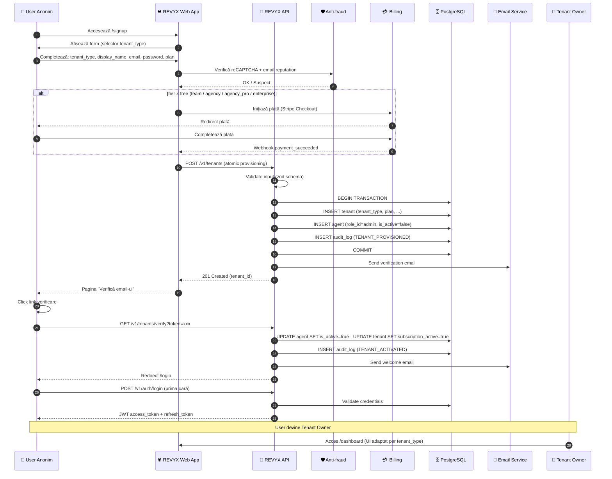

# WORKFLOW — Tenant Provisioning
<!-- WORKFLOW_REVYX_tenant-provisioning_v1.0.0.md · v1.0.0 · 2026-05 -->
<!-- CONFIDENȚIAL · Uz Intern · © 2026 REVYX · ITPRO SYSTEM SRL -->

## Changelog

| Versiune | Data | Autor | Note |
|---|---|---|---|
| 1.0.0 | 2026-05 | Senior PM | Workflow inițial — primul workflow live · validează SKILL_WORKFLOW v1.0.1 |

---

## Cuprins

1. [Executive Summary](#1-executive-summary)
2. [Actori Implicați](#2-actori-implicați)
3. [Pre-conditions](#3-pre-conditions)
4. [Flow Diagram](#4-flow-diagram)
5. [Etape Detaliate](#5-etape-detaliate)
6. [Decision Points](#6-decision-points)
7. [Timing & SLA](#7-timing--sla)
8. [Score Impacts](#8-score-impacts)
9. [AUDIT_LOG Events](#9-audit_log-events)
10. [Notifications](#10-notifications)
11. [Error / Exception Paths](#11-error--exception-paths)
12. [Post-conditions](#12-post-conditions)
13. [Acceptance Criteria Validare](#13-acceptance-criteria-validare)
14. [Glosar Specific](#14-glosar-specific)

---

## 1. Executive Summary

**Scop:** Crearea unei instanțe REVYX (TENANT) pentru un client nou, cu seed roluri, owner agent și activare subscription. Acoperă toate cele 6 modele de tenancy din BRD §4.3.

| Atribut | Valoare |
|---|---|
| **Refs** | BRD §4.3 (Tenancy Models) · BRD §8 (TENANT, ROLE, AGENT) · BRD §11 Phase 1 · TECH_SPEC_REVYX_tenancy-rbac §5 (API contracts) |
| **Frecvență** | La fiecare signup nou (estimat: 5-50/zi în Phase 1, 100+/zi în Phase 2) |
| **Durata totală happy path** | < 5 minute end-to-end (signup → primul login) |
| **Status** | Phase 1 — pentru tenant_type `SOLO` și `AGENCY` · alte tipuri activate gradual |

**Out of scope:**
- Onboarding wizard post-provisioning (UI flow primă utilizare) → workflow separat
- Migration date din alte sisteme → workflow separat
- Suspend / Delete tenant → workflow separat (`WORKFLOW_REVYX_tenant-lifecycle`)

---

## 2. Actori Implicați

| Actor | Token brand | Rol în workflow |
|---|---|---|
| 👤 **User Anonim (Signup)** | `--buy` (#10B981) | Inițiatorul provisioning-ului |
| 🤖 **Sistem REVYX AI** | `--ai` (#3B82F6) | Validare, creare entități, orchestrare |
| 📧 **Email Service** | `--soc` (#FF6B35) | Trimitere verificare + welcome (extern) |
| 💳 **Billing Provider** | `--bnk` (#8B5CF6) | Procesare plată tier (Stripe, etc.) |
| 👔 **Tenant Owner** | `--mgr` (#EC4899) | User Anonim devine Owner după activare |
| 🛡️ **Anti-fraud Service** | `--not` (#EF4444) | reCAPTCHA + email reputation (extern) |

> Paletă din `docs/brand-configs/revyx.md` §2.5.

---

## 3. Pre-conditions

| # | Condiție | Verificare |
|---|---|---|
| PC-01 | Sistem REVYX online · DB + Redis disponibile | Health check `/v1/health` returnează 200 |
| PC-02 | System roles (5) deja seedate (migration `0003_seed_system_roles.sql` rulată) | `SELECT COUNT(*) FROM role WHERE is_system=true` ≥ 5 |
| PC-03 | Email service configurat și operațional | DNS SPF/DKIM/DMARC valid · provider răspunde |
| PC-04 | Billing provider integrat (pentru tier-uri non-free) | Webhook endpoint configurat · API key valid |
| PC-05 | Privacy Policy + Cookie Policy publicate | Linkurile din signup form returnează 200 |
| PC-06 | Rate limiter activ (anti-abuse) | Redis `rate_limit:signup:*` operațional |

---

## 4. Flow Diagram



---

## 5. Etape Detaliate

### Etapa 1 — Acces signup form

| Câmp | Valoare |
|---|---|
| **Trigger** | User accesează `https://app.revyx.app/signup` |
| **Actor primar** | 👤 User Anonim |
| **Sistem** | 🌐 REVYX Web App |
| **Output** | Form afișat cu selector `tenant_type` și câmpuri condiționale per tier |
| **Durată estimată** | <2 secunde (page load) |

UI per `tenant_type`:
- `SOLO` → form minim: display_name, email, password
- `AGENCY` / `AGENCY_CUSTOM` → +legal_name, IDNO, billing_address
- `FRANCHISE` → +parent_brand_name, parent_brand_logo (post-provisioning)

### Etapa 2 — Completare form & validare client-side

| Câmp | Valoare |
|---|---|
| **Trigger** | User submit form |
| **Actor primar** | 👤 User Anonim |
| **Sistem** | 🌐 REVYX Web App + 🛡️ Anti-fraud |
| **Output** | Payload validat sau erori inline |

Validări client-side (zod schema partajat cu backend):
- `display_name`: min 2, max 200, no special chars la început
- `email`: format valid + MX record check
- `password`: min 12 chars · 1 upper · 1 lower · 1 digit · 1 special
- `tenant_type`: enum din 6 valori
- `subscription_plan`: enum permis pentru tenant_type ales (vezi BRD §4.3.2)
- `gdpr_consent`: checkbox obligatoriu bifat
- `terms_accepted`: checkbox obligatoriu bifat

Anti-fraud:
- reCAPTCHA v3 score ≥ 0.7
- Email reputation (HaveIBeenPwned · disposable email check)
- IP rate limit: max 3 signup-uri/IP/24h

### Etapa 3 — (Conditional) Plată tier

| Câmp | Valoare |
|---|---|
| **Trigger** | `subscription_plan ≠ 'solo'` (free) |
| **Actor primar** | 👤 User Anonim |
| **Sistem** | 💳 Billing Provider (Stripe Checkout) |
| **Output** | `payment_intent_id` confirmat · webhook `payment_succeeded` |
| **Durată estimată** | 30s - 2 minute |

Tier `solo` = free → skip această etapă.

Webhook handler (idempotent prin `payment_intent_id` unic):
```
POST /v1/billing/webhook
  validate HMAC signature (Stripe-Signature header)
  if event = payment_succeeded:
    cache: { intent_id → tenant_signup_payload } în Redis (TTL 30 min)
```

### Etapa 4 — Atomic Provisioning

| Câmp | Valoare |
|---|---|
| **Trigger** | `POST /v1/tenants` cu payload validat |
| **Actor primar** | 🤖 REVYX API |
| **Sistem** | PostgreSQL (transaction) |
| **Output** | `tenant_id` + `agent_id` (owner) create |
| **Durată estimată** | <500ms (P50) · <2s (P99) |
> ⏱ **Performance budget:** Tenant provisioning end-to-end < 2s P99 (Tech Spec §14)

Pseudocod (TypeScript-style):

```typescript
async function provisionTenant(input: ProvisionInput) {
  return await db.transaction(async (tx) => {
    // 1. Insert tenant
    const tenant = await tx.insert('tenant', {
      tenant_type: input.tenant_type,
      display_name: input.display_name,
      legal_name: input.legal_name,
      subscription_plan: input.subscription_plan,
      subscription_active: false,  // activated after email verification
      max_users: PLAN_LIMITS[input.subscription_plan].max_users,
      max_leads_per_month: PLAN_LIMITS[input.subscription_plan].max_leads,
      billing_email: input.email,
      timezone: 'Europe/Chisinau',
      currency_default: 'EUR',
    });

    // 2. Resolve admin role_id (system role, tenant_id IS NULL)
    const adminRole = await tx.queryOne(
      `SELECT role_id FROM role WHERE role_code='admin' AND is_system=true`
    );

    // 3. Insert owner agent
    const agent = await tx.insert('agent', {
      tenant_id: tenant.tenant_id,
      role_id: adminRole.role_id,
      email: input.email,
      display_name: input.owner_display_name,
      password_hash: await argon2.hash(input.password),
      is_active: false,  // activated after email verification
    });

    // 4. Audit log (immutable)
    await tx.insert('audit_log', {
      action: 'TENANT_PROVISIONED',
      entity_type: 'TENANT',
      entity_id: tenant.tenant_id,
      new_value: { tenant_type, subscription_plan, owner_agent_id: agent.agent_id },
      ip_address: input.ip,
    });

    return { tenant_id: tenant.tenant_id, agent_id: agent.agent_id };
  });
}
```

**Garanții:**
- ACID transaction — tenant + agent + audit_log create atomic SAU rollback complet
- Niciun lead/deal/property creat la provisioning (acela e onboarding follow-up)
- `subscription_active=false` și `agent.is_active=false` până la verificare email

### Etapa 5 — Trimitere email verificare

| Câmp | Valoare |
|---|---|
| **Trigger** | Provisioning succes |
| **Actor primar** | 🤖 REVYX API |
| **Sistem** | 📧 Email Service |
| **Output** | Email cu link `https://app.revyx.app/verify?token={signed_jwt}` |
| **Durată** | <5s (queued, async) |

Token verificare:
- JWT RS256 cu claim `{ tenant_id, agent_id, purpose: 'email_verification' }`
- TTL 24h
- One-time use (jti pe blacklist după consumare)

### Etapa 6 — User confirmă email

| Câmp | Valoare |
|---|---|
| **Trigger** | User click pe link verificare |
| **Actor primar** | 👤 User → 👔 Tenant Owner (transformare) |
| **Sistem** | 🤖 REVYX API |
| **Output** | `subscription_active=true` · `agent.is_active=true` · welcome email trimis |

```typescript
async function verifyEmail(token: string) {
  const claims = await jwt.verify(token, publicKey);
  if (claims.purpose !== 'email_verification') throw new InvalidToken();
  if (await blacklist.has(claims.jti)) throw new TokenAlreadyUsed();

  await db.transaction(async (tx) => {
    await tx.update('agent', { is_active: true }, { agent_id: claims.agent_id });
    await tx.update('tenant', { subscription_active: true }, { tenant_id: claims.tenant_id });
    await tx.insert('audit_log', {
      action: 'TENANT_ACTIVATED',
      entity_type: 'TENANT',
      entity_id: claims.tenant_id,
      new_value: { activated_at: new Date().toISOString() },
    });
  });

  await blacklist.add(claims.jti, ttl: claims.exp - now());
  await emailService.sendWelcome(claims.tenant_id);
}
```

### Etapa 7 — Primul login

| Câmp | Valoare |
|---|---|
| **Trigger** | Owner accesează `/login` cu credentials |
| **Actor primar** | 👔 Tenant Owner |
| **Sistem** | 🤖 REVYX API |
| **Output** | JWT access + refresh tokens · redirect `/dashboard` |
| **Durată** | <150ms P50 (Tech Spec §14) |

Dashboard adaptat per `tenant_type`:
- `SOLO` → ascunde "Echipă", "Roluri custom", arată "Lead Inbox" + "Deals"
- `AGENCY` → arată tot stack-ul standard
- `AGENCY_CUSTOM` → +"Role Builder" în meniu (dacă plan = agency_pro)
- `FRANCHISE` → +"Sub-agencies" în meniu

---

## 6. Decision Points

| Punct | Condiție | Ramură A | Ramură B |
|---|---|---|---|
| DP-01 | `subscription_plan == 'solo'` | Skip plată → direct provisioning | Continuă cu plata Stripe |
| DP-02 | Anti-fraud score < 0.7 | Block signup + log în AUDIT_LOG `SIGNUP_BLOCKED_FRAUD` | Continuă |
| DP-03 | Email duplicate (tenant existent cu același email pe alt cont) | Mesaj "Email deja folosit · login sau recuperare parolă" | Continuă |
| DP-04 | Tenant_type = `FRANCHISE` și `tenant_parent_id` lipsește | Eroare validare 400 | Continuă cu provisioning normal |
| DP-05 | Verificare email > 24h de la signup | Token expirat → re-trimitere disponibilă · agent rămâne `is_active=false` | Continuă |
| DP-06 | Plată eșuată (Stripe webhook `payment_failed`) | Cleanup pending tenant (TTL Redis 30 min) · email "Plata eșuată" | Continuă |
| DP-07 | După 7 zile, agent încă `is_active=false` | Job nightly șterge tenant + agent + audit_log marker `TENANT_PURGED_UNVERIFIED` | N/A |

---

## 7. Timing & SLA

| Etapă | Durată țintă P50 | Durată țintă P99 | SLA business |
|---|---|---|---|
| Form load | 1.5s | 3s | — |
| Anti-fraud check | 200ms | 1s | — |
| Plată Stripe (manual user) | 60s | 5 min | Depinde de user |
| Atomic Provisioning | 300ms | 2s | NFR proprie (Tech Spec §14) |
| Email delivery | 5s | 60s | Depinde de provider |
| End-to-end signup → primul login | 3 min | 10 min | UX target |

> ⏱ **SLA business:** Tenant provisioning **NU** are SLA externă față de utilizator (e self-service). Dar performance budget intern e respectat.

---

## 8. Score Impacts

| Etapă | Scor afectat | Tip impact | Magnitude |
|---|---|---|---|
| Tenant provisioning | — | N/A | Niciun lead/deal/property creat la provisioning |
| Owner login prima oară | APS (owner agent) | Init | `APS_default = 0.65` (BRD §7.7 · agent_since_date = today, <5 deals) |
| `agent_since_date` setat | Eligibilitate APS_default | Trigger 30 zile | După 30 zile + 5 deals → APS calculat din formulă |

> **Notă:** acest workflow nu generează evenimente de scoring. Lead/Property/Deal scoring încep cu workflow-urile dedicate.

---

## 9. AUDIT_LOG Events

Toate evenimentele sunt scrise APPEND-ONLY conform BRD §8 (AUDIT_LOG entity).

| Event `action` | Trigger | `entity_type` | `entity_id` | `old_value` | `new_value` |
|---|---|---|---|---|---|
| `SIGNUP_INITIATED` | Form submit (înainte provisioning) | TENANT | tmp_uuid | NULL | `{ tenant_type, plan, email_hash }` |
| `SIGNUP_BLOCKED_FRAUD` | reCAPTCHA score <0.7 SAU email blacklist | — | NULL | NULL | `{ reason, score, ip }` |
| `PAYMENT_INITIATED` | Stripe Checkout creat | TENANT | tmp_uuid | NULL | `{ payment_intent_id, amount, currency }` |
| `PAYMENT_SUCCEEDED` | Stripe webhook | TENANT | tmp_uuid | NULL | `{ payment_intent_id }` |
| `PAYMENT_FAILED` | Stripe webhook | TENANT | tmp_uuid | NULL | `{ payment_intent_id, failure_code }` |
| **`TENANT_PROVISIONED`** | Atomic provisioning success | TENANT | tenant_id | NULL | `{ tenant_type, subscription_plan, owner_agent_id }` |
| **`TENANT_ACTIVATED`** | Email verificat | TENANT | tenant_id | `{ subscription_active: false }` | `{ subscription_active: true, activated_at }` |
| `EMAIL_VERIFICATION_SENT` | Email queue accept | AGENT | agent_id | NULL | `{ token_jti, expires_at }` |
| `EMAIL_VERIFICATION_RESENT` | User cere re-trimitere | AGENT | agent_id | `{ previous_jti }` | `{ new_jti, expires_at }` |
| `LOGIN_FIRST_TIME` | Owner login prima oară | AGENT | agent_id | NULL | `{ ip, user_agent, login_at }` |
| `TENANT_PURGED_UNVERIFIED` | Job nightly · 7 zile fără verificare | TENANT | tenant_id | full state | `{ purged_at }` |

**Reguli:**
- Toate event-urile au `ip_address` și `timestamp` setate de sistem
- `email_hash` în loc de email plain pentru privacy (în `SIGNUP_INITIATED` înainte de a crea tenant)
- `user_id` = NULL pentru evenimente sistem (provisioning, scheduled jobs)

---

## 10. Notifications

| Eveniment | Canal | Destinatar | Template ID |
|---|---|---|---|
| Signup completat | 📧 Email | User | `tenant_email_verification` |
| Verificare reușită | 📧 Email | Tenant Owner | `tenant_welcome` |
| Plată reușită | 📧 Email | Tenant Owner | `payment_receipt` |
| Plată eșuată | 📧 Email | User | `payment_failure` |
| Email re-trimis (resend) | 📧 Email | User | `tenant_email_verification` (cu jti nou) |
| Tenant purged (7d unverified) | 📧 Email | User | `tenant_purged_inactive` (politicos · cu link nou signup) |

> ⚠️ **WhatsApp NU se folosește la provisioning** (templates pre-aprobate Meta sunt pentru lead lifecycle, conform BRD §6.3).

---

## 11. Error / Exception Paths

### EX-01: Email duplicate

```
DB constraint violation: uq_agent_email_per_tenant SAU verificare proactivă
→ HTTP 409 Conflict
→ UI: "Acest email este deja înregistrat. Login sau recuperare parolă."
→ AUDIT_LOG: niciun (nu loga încercări simple — anti-enumerare)
```

### EX-02: Tenant_type incompatibil cu plan

```
SOLO + plan=enterprise → 400 Bad Request
→ UI: "Planul Enterprise necesită cont Agency sau Franchise"
→ AUDIT_LOG: niciun (validare client-side ar trebui să prevină)
```

### EX-03: Plată eșuată

```
Stripe webhook payment_failed → cleanup payload din Redis
→ Email "Plata eșuată" cu link retry
→ AUDIT_LOG: PAYMENT_FAILED
→ User poate re-iniția signup fără penalty
```

### EX-04: Email service indisponibil

```
Provider returnează 5xx → retry 3× (backoff 2s/4s/8s)
→ Dacă tot eșuează: signup succes (tenant creat) DAR email pending
→ Background worker reîncearcă orar
→ User vede pagina "Email pe drum · Verifică folder spam"
→ AUDIT_LOG: EMAIL_VERIFICATION_FAILED + EMAIL_VERIFICATION_QUEUED_RETRY
```

### EX-05: Token verificare expirat

```
Verify endpoint primește token cu exp < now
→ HTTP 410 Gone
→ UI: "Link expirat" + buton "Trimite link nou"
→ Resend creează token nou (jti vechi pe blacklist)
→ AUDIT_LOG: EMAIL_VERIFICATION_RESENT
```

### EX-06: Atomic provisioning eșuează la jumătate

```
Transaction rollback automat (ACID)
→ Niciun tenant/agent creat
→ Plată Stripe NU e refundată automat (dispute manual prin dashboard)
→ AUDIT_LOG: PROVISIONING_FAILED + payment_intent_id pentru reconciliere
→ Alert PagerDuty (severity: high)
```

### EX-07: Tenant_parent_id invalid (FRANCHISE)

```
INSERT eșuează la chk_franchise_parent CHECK constraint
→ HTTP 400 Bad Request
→ UI: "Brand-ul părinte nu există · contactează admin franchise"
→ AUDIT_LOG: PROVISIONING_VALIDATION_FAILED
```

---

## 12. Post-conditions

După workflow happy path:

| Stare | Valoare |
|---|---|
| Row în `tenant` | 1, cu `subscription_active=true` |
| Row în `agent` | 1 (owner), cu `is_active=true`, `role_id=admin` (system role) |
| Email verificat | da (jti folosit, pe blacklist) |
| AUDIT_LOG events | min 4 (`SIGNUP_INITIATED`, `TENANT_PROVISIONED`, `TENANT_ACTIVATED`, `LOGIN_FIRST_TIME`) |
| RLS efect | Owner vede DOAR resurse cu `tenant_id = tenant.tenant_id` |
| Dashboard accesibil | da, adaptat per `tenant_type` |
| Quota init | `users: 1/max_users` · `leads: 0/max_leads_per_month` |

---

## 13. Acceptance Criteria Validare

Fiecare AC din BRD/Tech Spec demonstrat de acest workflow:

| AC | Sursă | Demonstrat în etapa |
|---|---|---|
| Tenant izolat prin `tenant_id` | Tech Spec §4.2 RLS | Etapa 7 — owner vede doar resurse proprii |
| 5 system roles seedate la deploy | Tech Spec §4.3 | PC-02 |
| Owner agent are role `admin` (system role) | BRD §10.1 | Etapa 4 (provisioning) |
| `APS_default = 0.65` agent nou | BRD §7.7 | Etapa 7 (Score Impacts §8) |
| AUDIT_LOG append-only | BRD §8 | §9 — toate event-urile fără UPDATE/DELETE |
| Email verification token TTL 24h | Tech Spec §12 | Etapa 5 |
| Single session per agent | BRD §9.1 / Tech Spec §12.2 | Etapa 7 (jti unic, blacklist la re-login) |
| GDPR consent capturat la signup | BRD §9.4 | Etapa 2 (validare client + server) |
| Performance: provisioning <2s P99 | Tech Spec §14 | Etapa 4 |
| Tenant signup endpoint accesibil anonim | Tech Spec §5.2 | Etapa 4 |

---

## 14. Glosar Specific

| Termen | Definiție |
|---|---|
| **Atomic Provisioning** | Inserarea tenant + agent + audit_log într-o singură tranzacție DB ACID |
| **Email Verification Token** | JWT RS256 single-use, TTL 24h, claim `purpose=email_verification` |
| **Owner** | Primul agent al unui tenant · automat assigned `role=admin` · NU e role separat în Phase 1 |
| **Pending Tenant** | Tenant cu `subscription_active=false` (între provisioning și verificare email) |
| **Quota Init** | Setarea `max_users` și `max_leads_per_month` din PLAN_LIMITS la creare tenant |
| **Cleanup Job** | Job nightly care șterge tenanți pending >7 zile fără verificare |

---

## Impact Assessment (auto-applied conform CLAUDE.md §13)

**Tip modificare:** Doc-only (Workflow nou) · primul Workflow live

**Documente actualizate:**
| Fișier | Versiune | Motiv |
|---|---|---|
| `docs/workflow/WORKFLOW_REVYX_tenant-provisioning_v1.0.0.md` | v1.0.0 (nou) | Primul workflow MD generat cu SKILL_WORKFLOW v1.0.1 |

**Documente afectate dar NU actualizate (justificate):**
| Document | De ce NU |
|---|---|
| BRD v1.1.0 | Workflow materializează cerințe existente · niciun BR nou introdus |
| Tech Spec tenancy-rbac v1.0.0 | Workflow folosește API contracts deja documentate (§5.1, §5.2) · niciun contract nou |
| `revyx.md` brand-config | Doar referințe la paletă actori (§2.5) · niciun token nou |

**Cod afectat:** N/A (docs-only · niciun cod scris încă)

**Teste rulate / specificate:**
- ✅ Doc lint manual: header, changelog, footer, anchor TOC, marcaj ★, paletă actori conform `revyx.md` §2.5
- ✅ Cross-doc consistency: AC-uri referențiază BRD/Tech Spec corecte
- ⏳ Specificat (cod nu există): E2E happy path provisioning, RLS test post-provisioning, `TENANT_PURGED_UNVERIFIED` job test, EX-06 rollback test

**Riscuri identificate:**
| Risc | Severitate | Mitigare |
|---|---|---|
| Tenancy-specific roles (`owner`, `network_lead`, `franchise_admin`) menționate în BRD §10.2 dar NEseedate în Tech Spec | medium | Phase 1 mapping: `owner = admin` (system role) · alte tenancy roles → urmează în Tech Spec ulterior |
| FRANCHISE parent-child onboarding nu e detaliat | low | Phase 3 — workflow separat va fi creat |
| Stripe refund la EX-06 manual | medium | Documentat în EX-06 · alert PagerDuty pentru reconciliere |

**Backwards compatibility:** Păstrată · primul workflow, no priors.

---

*WORKFLOW_REVYX_tenant-provisioning_v1.0.0.md · v1.0.0 · 2026-05 · CONFIDENȚIAL · Uz Intern*
*REVYX — Real Estate Execution Intelligence · © 2026 REVYX · ITPRO SYSTEM SRL*
