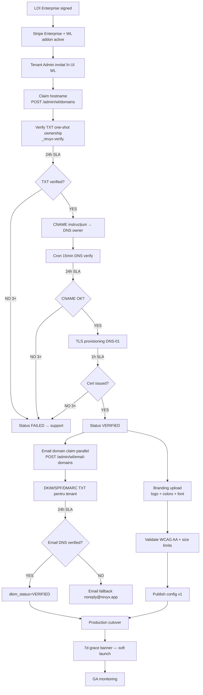

# WORKFLOW — WHITE-LABEL ONBOARDING
<!-- WORKFLOW_REVYX_white-label-onboarding_v1.0.0.md · v1.0.0 · 2026-05 -->
<!-- CONFIDENȚIAL · Uz Intern · © 2026 REVYX · ITPRO SYSTEM SRL -->

## Changelog

| Versiune | Data | Autor | Note |
|---|---|---|---|
| 1.0.0 | 2026-05 | Senior PM + Solution Architect + DevOps Lead | ★ Workflow inițial S9 — onboarding tenant Enterprise → white-label production · LOI → Stripe → DNS → TLS → DKIM → branding → cutover · SLA per pas · referință `white-label` v1.0.1 |

---

## 1. Scope

End-to-end onboarding pentru un tenant Enterprise care activează **white-label**: domeniu custom (`revyx.agentie.ro`), email DKIM, branding. Aliniat cu `TECH_SPEC_REVYX_white-label_v1.0.1`.

**Actori:** Tenant Admin · REVYX Customer Success · DevOps · Security · Stripe · DNS Provider tenant.

**SLA total țintă:** ≤72h de la subscription la status VERIFIED (cu cooperarea DNS owner-ului).

---

## 2. Diagrama master



---

## 3. Pași detaliați

### 3.1 Pre-onboarding (offline)

| # | Acțiune | Owner | Output |
|---|---|---|---|
| 1 | LOI Enterprise + WL addon agreement | Sales + Legal | Signed PDF |
| 2 | Stripe subscription `revyx_enterprise` + addon `revyx_white_label` active | Stripe webhook | `tenant.plan_tier='ENTERPRISE'` + `white_label_enabled=TRUE` |
| 3 | Tenant Admin email invite cu link `/admin/wl/setup` | CS | Setup token |

### 3.2 Domain claim & DNS verify (T0 → T+24h)

#### Step 3.2.1 — Claim

```
POST /api/v1/admin/wl/domains  { hostname: "revyx.agentie.ro" }
Response 201: { domain_id, txt_token: "rvx-verify-Ab3..." }
```

**TXT one-shot verification (anti-hijack):**
- DNS owner setează `_revyx-verify.revyx.agentie.ro` cu valoarea `rvx-verify-Ab3...`
- Token TTL 7 zile · 1× per 24h per hostname (rate limit anti-claim spam)
- Backend cron 15 min check; verificat → permite trecerea la CNAME step

#### Step 3.2.2 — CNAME setup

| Record | Type | Value |
|---|---|---|
| `revyx.agentie.ro` | CNAME | `edge.revyx.app` |

Cron `wl.dns.verify` orar; după 3 failures consecutive → status `SUSPENDED` + email tenant + alert ops.

### 3.3 TLS provisioning (T+24h → T+25h)

- DNS-01 challenge prin API DNS provider configurat (Cloudflare/Route53).
- Let's Encrypt cert issued + stocat (kid în KMS).
- `tls_cert_expires_at` setat (90 zile LE default).
- Cron `wl.tls.renew.daily` re-verify cu 21d înainte de expirare.

**Failure modes:**
- LE rate limit (5/săpt/IP+domain) → retry exponential 24h cooldown
- Wildcard cert disponibil pentru `*.revyx.app` (subdomain pattern) — accelerează în acel caz

### 3.4 Email domain (paralel cu 3.2/3.3)

#### Step 3.4.1 — Claim

```
POST /api/v1/admin/wl/email-domains  { domain: "agentie.ro" }
Response 201: { domain_id, dkim_selector, dkim_public_key }
```

#### Step 3.4.2 — DNS records expected

| Record | Type | Value |
|---|---|---|
| `<selector>._domainkey.agentie.ro` | TXT | `v=DKIM1; k=rsa; p=<public_key>` |
| `agentie.ro` | TXT | `v=spf1 include:_spf.revyx.app ~all` |
| `_dmarc.agentie.ro` | TXT | `v=DMARC1; p=none; rua=mailto:dmarc@revyx.app` |

#### Step 3.4.3 — Verify

Cron orar `wl.email.verify`; toate 3 (DKIM/SPF/DMARC) trebuie OK pentru `dkim_status=VERIFIED`. Lipsă DMARC = `MISSING` (nu fail — recomandat).

### 3.5 Branding setup

| Pas | Validare server-side |
|---|---|
| Upload logo (signed URL S3) | content-type whitelist · ≤200KB · SVG sanitizer |
| Set colors (primary/secondary/bg/text) | regex `#[0-9A-Fa-f]{6}` · WCAG AA contrast text/bg ≥ 4.5 |
| Set font | whitelist Google Fonts (Inter/Roboto/Lato/Manrope/Montserrat/Poppins/Open Sans/Source Sans 3) |
| Set manifest (theme_color, name) | length checks |
| Email from_name + reply_to | dkim_status='VERIFIED' obligatoriu pentru email custom |

`PUT /api/v1/admin/wl/config` validează schema integral; refuzat dacă orice câmp incorect.

### 3.6 Production cutover

| Step | Actor | Detaliu |
|---|---|---|
| 1 | Tenant Admin | Solicită cutover (toggle UI "Activează producție") |
| 2 | Backend | `white_label_enabled=TRUE` + cache purge edge KV |
| 3 | Edge | Începe să recunoască hostname → tenant_id |
| 4 | UI | Banner 7d "Setup nou — verifică toate funcționalitățile" |
| 5 | CS | Check-in 24h și 7d post-cutover |

**Rollback rapid:** flag OFF → request servit cu default brand (config persistat). Niciun data loss.

---

## 4. SLA & failure paths

| Pas | SLA target | Failure threshold | Acțiune |
|---|---|---|---|
| TXT one-shot verify | 24h | 3× nominal fail | Status FAILED · CS contact tenant |
| CNAME verify | 24h | 3× consecutive | Status SUSPENDED · email tenant |
| TLS provision | 1h post-CNAME OK | 3× LE error | Cooldown 24h + manual review |
| DKIM verify | 24h | 3× consecutive | Email fallback `noreply@revyx.app` |
| Logo upload | instant | size/type fail | UI inline error |
| Cutover | 5 min | edge KV propagation | Retry purge + verify |

---

## 5. RBAC & audit

| Acțiune | Rol minim | Audit event |
|---|---|---|
| Claim hostname | tenant_admin (Enterprise) | `WL_DOMAIN_CLAIMED` |
| Verify DNS | tenant_admin sau cron | `WL_DOMAIN_VERIFIED` |
| TLS provisioned | DevOps automated | `WL_TLS_PROVISIONED` |
| Update config | tenant_admin | `WL_CONFIG_UPDATED` (cu diff în `tenant_wl_audit`) |
| Cutover | tenant_admin | `WL_CUTOVER_COMPLETED` |
| Suspend (admin REVYX) | platform admin | `WL_DOMAIN_SUSPENDED` |
| Revoke domain | tenant_admin sau admin REVYX | `WL_DOMAIN_REVOKED` |

---

## 6. Pilot vs GA

| Etapă | Tenanți eligibili | Cerințe |
|---|---|---|
| Pilot (S8 rollout) | 2 LOI signed, în proces semnare contract | DNS owner cooperare confirmată |
| Beta (S9-S10) | Top 10 tenanți Enterprise | Pilot pass + telemetry stable |
| GA | Toți Enterprise | Pilot + Beta zero CRIT incidents 30d |

---

## 7. KPI workflow

| Metric | Target |
|---|---|
| Time LOI → cutover | ≤72h p95 (cu DNS cooperation) |
| TXT verify success rate | ≥95% (failure = DNS owner issue, nu REVYX) |
| TLS auto-renewal success | 100% |
| Cutover rollback rate | <5% (din pilot) |
| Tenant NPS post-onboarding | ≥40 |

---

*docs/workflow/WORKFLOW_REVYX_white-label-onboarding_v1.0.0.md · v1.0.0 · 2026-05 · CONFIDENȚIAL · Uz Intern*
*REVYX — Real Estate Execution Intelligence · © 2026 REVYX · ITPRO SYSTEM SRL*
